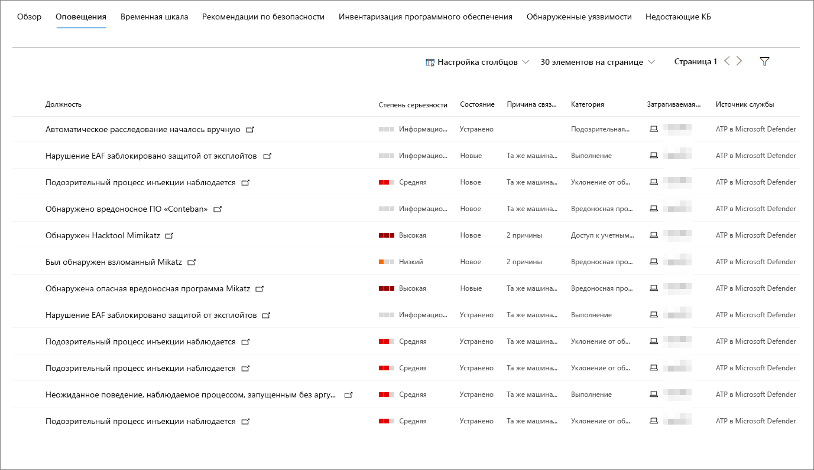

# Страница профиля компьютера

Портал безопасности Microsoft 365 предоставляет страницы профиля компьютера, поэтому вы можете оценить работоспособность и состояние устройств в сети. Каждая страница профиля компьютера содержит обширную информацию об устройстве.

Вы можете просмотреть подробные сведения о выполняемом программном обеспечении, событиях и событиях безопасности, а также найти ссылки на релевантные пакеты программного обеспечения.

Вы также можете использовать профиль компьютера для выполнения распространенных задач, связанных с безопасностью, и быстро просмотреть основные сведения об устройстве.

## Навигация на странице профиля компьютера

Доступ к странице профиля компьютера осуществляется путем непосредственного выбора имени устройства в списке компьютеров или с помощью кнопки **открыть компьютер** в меню список компьютеров.

После открытия страницы вы обнаружите, что она разбивается на три раздела.

Основная область содержимого (1) содержит семь вкладок, которые можно переключать для просмотра различных типов сведений о компьютере.

На боковой панели (2) приведены основные сведения о компьютере.

Кроме того, существуют действия ответа, доступные в заголовке (3) до боковой панели и основных разделов содержимого. Вы можете использовать действия, указанные в этом заголовке, для выполнения распространенных задач, связанных с безопасностью.

## Раздел "Вкладки"

Вкладки профиля компьютера позволяют переключать общие сведения о безопасности компьютера и таблицы, содержащие список оповещений, временной шкалы, список рекомендаций по безопасности, инвентаризации программного обеспечения, список обнаруженных уязвимостей и отсутствие КБ (обновления для системы безопасности).

### Вкладка "Обзор"

Вкладка по умолчанию — **Обзор**. Он обеспечивает краткий обзор наиболее важного факта безопасности для устройства.

Здесь вы можете найти диаграмму с уровнем риска и активными оповещениями, любыми вошедшими в систему пользователями, кратким списком наиболее и наименее часто работающих пользователей, а также оценками безопасности, подробно описывающими уровень доступности устройства, рекомендации по безопасности, уязвимое программное обеспечение и обнаруженные уязвимости.

### Вкладка "оповещения"

Вкладка **оповещения** содержит список оповещений, зарегистрированных на устройстве.

Можно настроить количество отображаемых элементов, а также столбцы, отображаемые для каждого элемента. По умолчанию в список задается по 30 элементов на страницу, а для отображения включается 11 столбцов.

Столбцы на этой вкладке содержат сведения о серьезности угрозы, которое инициировало оповещение, а также состояние расследования, состояние расследования и лицо, которому назначено оповещение.

Столбец " *затронутые сущности* " ссылается на компьютер (объект), профиль которого в данный момент просматривается, а также все остальные машины в вашей сети, на которые влияет эта проблема.

При выборе элемента в этом списке откроется ссылка на выбранное оповещение.

Этот список можно фильтровать по уровню серьезности, состоянию или уполномоченному.

### Вкладка "временная шкала"

Вкладка **временная шкала** содержит интерактивный хронологический график событий, возникающих на устройстве. Перемещая выделенную область диаграммы, вы можете просматривать события в разных диапазонах времени. Вы также можете ввести настраиваемый диапазон дат.

Под диаграммой представлен список событий для выбранного диапазона дат.

Количество отображаемых элементов и столбцов в списке можно изменить. В столбцах по умолчанию перечислены время события, активный пользователь, тип действия, сущности (процессы) и дополнительные сведения о событии.

При выборе элемента в списке откроется всплывающее окно с графиком сущностей события, в котором показаны родительские и дочерние процессы, вызвавшие событие.

Этот список можно фильтровать по определенному типу события; Например, события в реестре или события Smart Screen.

### Вкладка "рекомендации по безопасности"

На вкладке **рекомендации по безопасности** перечислены действия, которые можно предпринять для защиты устройства. При выборе элемента в этом списке откроется раскрывающееся меню, в котором можно получить инструкции по применению рекомендации.

Как и на предыдущих вкладках, количество элементов, отображаемых на странице, и столбцы, которые могут быть настроены.

Представление по умолчанию включает столбцы со сведениями о слабых слабых местах безопасности, связанной угрозой, связанным компонентом или программным обеспечением, на которые влияет угроза, и многое другое. Элементы можно фильтровать по состоянию рекомендаций.

### Перечень программного обеспечения

На вкладке **Инвентаризация программного обеспечения** перечислены программное обеспечение, установленное на устройстве.

Представление по умолчанию отображает поставщика программного обеспечения, установленного номера версии, количества известных слабых мест программного обеспечения, кода продукта и тегов. Количество отображаемых элементов и отображаемых столбцов можно изменить.

При выборе элемента в этом списке открывается всплывающее окно с дополнительными сведениями о выбранном программном обеспечении, а также путь и временная метка для последнего найденного программного обеспечения.

Этот список можно фильтровать по коду продукта.

### Вкладка обнаруженных уязвимостей

На вкладке **обнаруженные уязвимости** перечислены все распространенные уязвимости и эксплойты (списках CVE), которые могут повлиять на устройство.

Представление по умолчанию содержит степень серьезности CVE, классификационный показатель уязвимости (CVS), программное обеспечение, связанное с CVE, при публикации CVE, при последнем обновлении и угрозах, связанных с CVE.

Как и в предыдущих вкладках, отображается количество отображаемых элементов и столбцы, которые могут быть настроены.

При выборе элемента в этом списке откроется всплывающее окно с описанием CVE.

### Отсутствует КБ

На вкладке **пропущенные КБ** перечислены обновления Майкрософт, которые еще не были применены к компьютеру. "КБ" (вопросы и ответы) — это [статьи базы знаний](https://support.microsoft.com/help/242450/how-to-query-the-microsoft-knowledge-base-by-using-keywords-and-query) , описывающие эти обновления; Например, [KB4551762](https://support.microsoft.com/help/4551762/windows-10-update-kb4551762).

Представление по умолчанию содержит сведения о бюллетенях, содержащих обновления, версию ОС, затронутые продукты, списках CVE, номер статьи базы знаний и теги.

Количество элементов, отображаемых на странице, и отображаемых столбцов, которые могут быть настроены.

При выборе элемента откроется всплывающее окно со ссылкой на обновление.

## Боковой панели

Рядом с основной областью содержимого страницы профиля компьютера находится боковая панель.

Боковая панель предоставляет некоторую важную информацию в небольших подразделах, которые можно переключать при открытии или закрытии:

* **Tags** — все теги, связанные с устройством
* **Сведения о безопасности** : открытые инциденты, активные оповещения, уровень экспозиции и уровень риска
* **Сведения об устройствах** : домен, ОС, группа активов, состояние работоспособности, чувствительность к данным и IP-адреса
* **Активность сети** — метки времени в первый раз и в последний раз, когда устройство просмотрелось в сети.

Этот раздел также включает имя и уровень доступности устройства, а также значок, указывающий, активен ли он в данный момент в сети.

## Действия отклика

Действия отклика предоставляют быстрый способ защиты от угроз и анализа угроз.

Ниже перечислены действия, которые можно использовать для ответа.

* **Manage tagss** — обновления настраиваемые теги, примененные к этому устройству.
* **Изоляция компьютера** изолирует компьютер от сети организации, не подключаясь к Advanced Threat Protection в защитнике Майкрософт. Вы можете разрешить запуск Outlook, Teams и Skype для бизнеса, пока компьютер изолирован, в целях общения.
* **Ограничьте выполнение приложения** — запрещает приложениям, которые не подписаны корпорацией Майкрософт на выполнение
* **Запуск антивирусной проверки** — обновление определений антивирусной программы "Защитник Windows" и немедленное выполнение антивирусной проверки. Выбор между быстрым сканированием или полным сканированием.
* **Сбор пакетов для расследования** — сбор сведений о компьютере. По завершении расследования вы можете скачать его.
* **Initiate Live Response Session** — загружает удаленную оболочку на компьютере для [всестороннего расследования по безопасности](https://docs.microsoft.com/windows/security/threat-protection/microsoft-defender-atp/live-response).
* **Initiate автоматизированное исследование** — автоматически [исследует и исправлять угрозы](https://docs.microsoft.com/microsoft-365/security/office-365-security/office-365-air). Несмотря на то, что вы можете вручную активировать автоматическое расследование для запуска с этой страницы, [некоторые политики оповещений](https://docs.microsoft.com/microsoft-365/compliance/alert-policies?view=o365-worldwide#default-alert-policies) инициируют автоматическое расследование самостоятельно.
* **Центр уведомлений** — Просмотр состояния отправленных действий. Доступно только в том случае, если уже было выбрано другое действие.

## См. также

* [Обзор Защиты от угроз (Майкрософт)](microsoft-threat-protection.md)
* [Включение Защиты от угроз (Майкрософт)](mtp-enable.md)
* [Исследование сущностей на компьютерах с помощью Live Response](https://docs.microsoft.com/windows/security/threat-protection/microsoft-defender-atp/live-response)
* [Автоматическое исследование и реагирование (AIR) в Office 365](https://docs.microsoft.com/microsoft-365/security/office-365-security/office-365-air)
