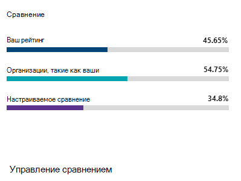
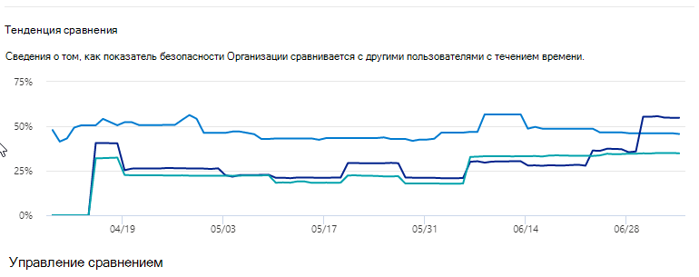

# Отслеживание истории оценки безопасности (Майкрософт) и обеспечение достижения целейTrack your Microsoft Secure Score history and meet goals

[!INCLUDE [Microsoft 365 Defender rebranding](../includes/microsoft-defender.md)]

[Оценка безопасности (Майкрософт)](microsoft-secure-score.md) — это показатель уровня безопасности организации, где большее число указывает на дополнительные действия по улучшению.[Microsoft Secure Score](microsoft-secure-score.md) is a measurement of an organization's security posture, with a higher number indicating more improvement actions taken. Его можно найти в Центре безопасности https://security.microsoft.com/securescore [Microsoft 365.](overview-security-center.md)It can be found at https://security.microsoft.com/securescore in the [Microsoft 365 security center](overview-security-center.md).

## Получение информации о действиях, которые повлияли на оценкуGain insights into activity that has affected your score

Просматривайте график показателей организации со временем на вкладке **"История".**View a graph of your organization's score over time in the **History** tab.

Под графиком находится список всех действий в выбранном диапазоне времени и их атрибутов, таких как итоговые точки и категории.Below the graph is a list of all the actions taken in the selected time range and their attributes, such as resulting points and category. Вы можете настроить диапазон дат и фильтровать их по категориям.You can customize a date range and filter by category.

Если выбрать действие по улучшению, связанное с действием, появится полный flyout действия улучшения.If you select the improvement action associated with an activity, the full improvement action flyout will appear.

Чтобы просмотреть всю историю определенного действия по улучшению, выберите ссылку на историю во flyout.To view all history for that specific improvement action, select the history link in the flyout.

## Обнаружение тенденций и настройка целейDiscover trends and set goals

На **вкладке "Метрики & тенденций"** имеется несколько графиков и диаграмм, которые дают больше информации о тенденциях и устанавливают цели.In the **Metrics & trends** tab, there are several graphs and charts to give you more visibility into trends and set goals. Вы можете установить диапазон дат для всей страницы визуализаций.You can set the date range for the whole page of visualizations. Визуализации включают:The visualizations include:

* **Зона "Оценка безопасности"** — настраивается на основе целей организации и определений диапазонов показателей "хороший", "ОК" и "Плохой".**Your Secure Score zone** - Customized based on your organization's goals and definitions of good, okay, and bad score ranges.
* **Тенденция регрессии** — временная шкала точек, которые были регрессивными из-за изменений конфигурации, пользователя или устройства.**Regression trend** - A timeline of points that have regressed because of configuration, user, or device changes.  
* **Тенденция сравнения** : сравнение оценки безопасности в организации с предыдущими.**Comparison trend** - How your organization's Secure Score compares to others' over time. Это представление может включать строки, представляющие среднюю оценку организаций с одинаковым количеством мест и настраиваемого представления сравнения, которое можно настроить.This view can include lines representing the score average of organizations with similar seat count and a custom comparison view that you can set.
* **Тенденция принятия рисков** — временная шкала действий по улучшению, помеченная как "принятый риск".**Risk acceptance trend** - Timeline of improvement actions marked as "risk accepted."
* **Изменение оценки** — количество достигнутого числа баллов, регрессии баллов и изменение вашего счета в указанном диапазоне дат.**Score changes** - The number of points achieved, points regressed, and changes to your score in the specified date range.

### Сравнение показателей с организациями, например вашейCompare your score to organizations like yours

Существует два места для сравнения показателей с похожими на вас организациями.There are two places to see how your score compares to organizations that are similar to you. На обеих диаграммах можно выбрать "Управление **сравнениями",** чтобы просмотреть и изменить сведения организации.In both charts, you can select **Manage comparisons** to view and edit your organization's information. Вы также можете создать собственное сравнение на основе отрасли, размера организации, лицензий и регионов.You can also create a custom comparison based on industry, organization size, licenses, and regions.

#### Диаграмма сравненияComparison bar chart

Диаграмма сравнения — это вкладка **"Обзор".** Наведите курсор на диаграмму, чтобы просмотреть оценку и возможность оценки.The comparison bar chart is the **Overview** tab. Hover over the chart to view the score and score opportunity. Данные сравнения анонимизируются, поэтому мы не знаем точно, какие другие клиенты находятся в наборе.The comparison data is anonymized so we don’t know exactly which others tenants are in the mix.

- **Такие организации, как** ваша: средняя оценка других клиентов (при условии, что у нас есть не менее пяти или более клиентов для сравнения), которые соответствуют следующим критериям:**Organizations like yours**: an average score of other tenants (provided we have at least five or more tenants to compare) that qualify with the following criteria:
    1. Та же отрасльSame industry
    2. Одинаковый размер организацииSame organization size
    3. Все регионыAll regions
    4. Используемые продукты Майкрософт на 80 % похожиMicrosoft products used are 80% similar
    5. Возможность (максимальная оценка, которую может получить текущая лицензия) в диапазоне 20 % от клиентаOpportunity (max score that can be achieved by current license) within a 20% range from your tenant

- **Настраиваемые сравнения**: необходимо настроить, выбрав **управление** сравнением на основе следующих критериев:**Custom Comparison**: needs to be set up by selecting **Manage Comparison** based on the following criteria:
    1. Выбранные отраслиSelected industry(s)
    2. Выбранные размеры организацииSelected organization size(s)
    3. Выбранные регионыSelected region(s)
    4. Выбранные лицензииSelected license(s)
    5. Используемые продукты Майкрософт на 80 % похожиMicrosoft products used are 80% similar
    6. Возможность (максимальный показатель, который может быть достигнут текущей лицензией) в диапазоне 20 % от клиентаOpportunity (max score that can be achieved by current license) within a 20% range from your tenant

Если вы сделали настраиваемый выбор, но результаты имеют менее пяти других клиентов, с чем можно сравнить, вы увидите "Недоступны из-за ограниченных данных".If you've made a custom selection but the results have less than five other tenants that we can compare against, you'll see “Not available due to limited data”.

#### Тенденция сравненияComparison trend

На **вкладке "Метрики & тенденций"** поимите, как оценка безопасности организации со временем будет сравниваться с другими.In the **Metrics & trends** tab, view how your organization's Secure Score compares to others' over time.

## Мы ждем ваших отзывов!We want to hear from you

Если у вас есть какие-либо проблемы, дайте нам знать, опубликовав в сообществе по [безопасности, & соответствия требованиям.](https://techcommunity.microsoft.com/t5/Security-Privacy-Compliance/bd-p/security_privacy)If you have any issues, let us know by posting in the [Security, Privacy & Compliance](https://techcommunity.microsoft.com/t5/Security-Privacy-Compliance/bd-p/security_privacy) community. Мы отслеживаем сообщество и предоставляем помощь.We're monitoring the community and will provide help.

## Связанные ресурсыRelated resources

- [Обзор оценки безопасности (Майкрософт)Microsoft Secure Score overview](microsoft-secure-score.md)
- [Оценка уровня безопасностиAssess your security posture](microsoft-secure-score-improvement-actions.md)
- [Что вскоре появитсяWhat's coming](microsoft-secure-score-whats-coming.md)
- [Новые возможностиWhat's new](microsoft-secure-score-whats-new.md)
