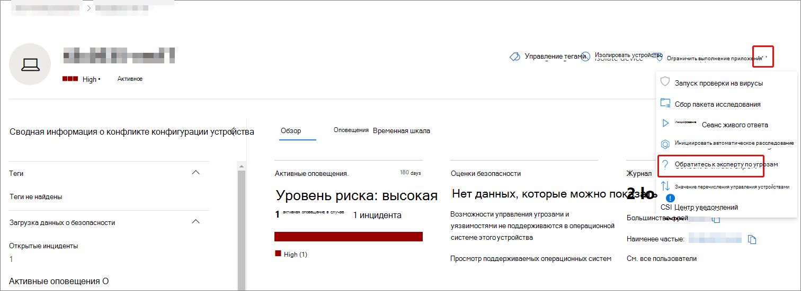
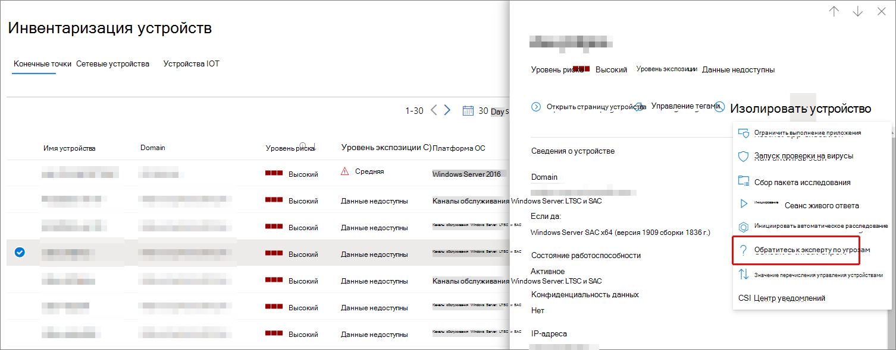
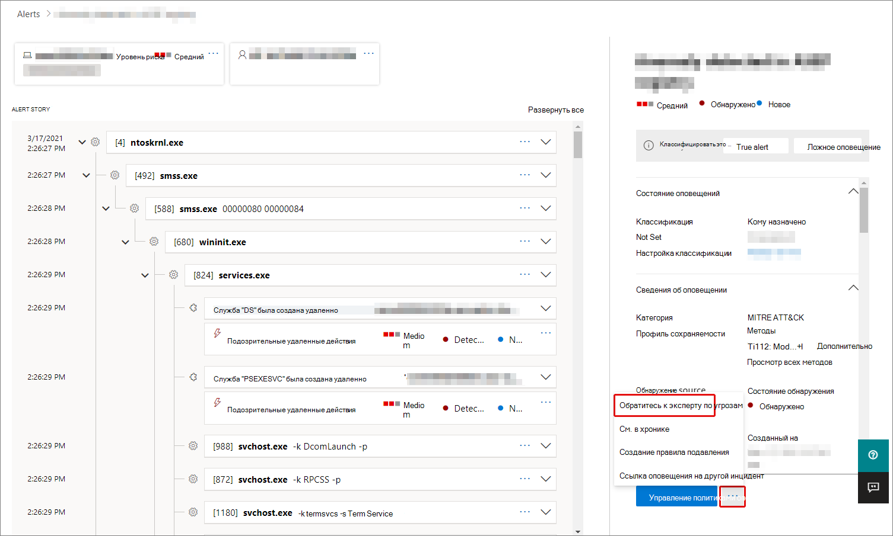

# Эксперты по угрозам Майкрософт в обзоре Microsoft 365Microsoft Threat Experts in Microsoft 365 overview

[!INCLUDE [Microsoft 365 Defender rebranding](../includes/microsoft-defender.md)]

**Область применения:****Applies to:**

- [Microsoft 365 DefenderMicrosoft 365 Defender](https://go.microsoft.com/fwlink/?linkid=2118804)
- [Microsoft Defender для конечной точкиMicrosoft Defender for Endpoint](https://go.microsoft.com/fwlink/p/?linkid=2146631)

[!INCLUDE [Prerelease](../includes/prerelease.md)]

Эксперты microsoft Threat . Целевые уведомления об атаках — это служба управляемой охоты на угрозы.Microsoft Threat Experts - Targeted Attack Notifications is a managed threat hunting service. После того как вы подаете заявку и будете приняты, вы получите целевые уведомления об атаке от экспертов microsoft threat, чтобы не пропустить критические угрозы для вашей среды.Once you apply and are accepted, you'll receive targeted attack notifications from Microsoft threat experts, so you won't miss critical threats to your environment. Эти уведомления помогут защитить конечные точки, электронную почту и удостоверения организации.These notifications will help you protect your organization's endpoints, email, and identities.
Эксперты microsoft Threat — эксперты по запросу позволяют получить консультации экспертов по угрозам, с которыми сталкивается ваша организация.Microsoft Threat Experts – Experts on Demand lets you get expert advice about threats your organization is facing. Вы можете связаться за помощью по угрозам, с которыми сталкивается ваша организация.You can reach out for help on threats your organization is facing. Он доступен в качестве службы подписки.It's available as a subscription service.

## Apply for Microsoft Threat Experts — Targeted Attack NotificationsApply for Microsoft Threat Experts – Targeted Attack Notifications

> [!IMPORTANT]
> Перед подачей заявления обязательно обсудите требования к требованиям для экспертов microsoft Threat Experts — targeted Attack Notifications с поставщиком технической службы Майкрософт и командой учетных записей.Before you apply, make sure to discuss the eligibility requirements for Microsoft Threat Experts – Targeted Attack Notifications  with your Microsoft Technical Service provider and account team.

Если у вас уже есть Microsoft Defender для конечной точки и Microsoft 365 Defender, вы можете обратиться за помощью к экспертам microsoft Threat Experts — Targeted Attack Notifications через портал Microsoft 365 Defender.If you already have Microsoft Defender for Endpoint and Microsoft 365 Defender, you can apply for Microsoft Threat Experts – Targeted Attack Notifications through their Microsoft 365 Defender portal. Перейдите к параметрам > конечных точек > общие > расширенные функции > **Microsoft Threat Experts — targeted Attack Notifications** и выберите **Apply**.Go to **Settings > Endpoints > General > Advanced features > Microsoft Threat Experts – Targeted Attack Notifications**, and select **Apply**. Подробнее [об этом см. в описании "Настройка](./configure-microsoft-threat-experts.md) возможностей экспертов по угрозам Майкрософт".See [Configure Microsoft Threat Experts capabilities](./configure-microsoft-threat-experts.md) for a full description.

После утверждения приложения вы начнете получать целевые уведомления об атаке всякий раз, когда специалисты по угрозам обнаруживают угрозу для вашей среды.Once your application is approved, you'll start receiving targeted attack notifications whenever Threat Experts detect a threat to your environment.

## Подписка на Эксперты по угрозам Майкрософт — эксперты по запросуSubscribe to Microsoft Threat Experts - Experts on Demand

Обратитесь к представителю Майкрософт, чтобы подписаться на экспертов по запросу.Contact your Microsoft representative to subscribe to Experts on Demand.  Подробные [сведения см. в материале Configure Microsoft Threat Experts.](./configure-microsoft-threat-experts.md)See [Configure Microsoft Threat Experts capabilities](./configure-microsoft-threat-experts.md) for full details.

## Получение уведомления о целевой атакеReceive targeted attack notification

Возможности "Эксперты по угрозам Майкрософт" — целевое уведомление об атаке обеспечивает активную охоту на наиболее важные угрозы для вашей сети.The Microsoft Threat Experts – Targeted Attack Notification capability provides proactive hunting for the most important threats to your network. Наши эксперты по угрозам охотятся за вторжениями противника, атаками на клавиатуре и расширенными атаками, такими как киберэспионаж.Our threat experts hunt for human adversary intrusions, hands-on-keyboard attacks, and advanced attacks, such as cyberespionage. Эти уведомления будут показываться как новое оповещение.These notifications will show up as a new alert. Служба управляемой охоты включает в себя:The managed hunting service includes:

- Мониторинг и анализ угроз, сокращение времени и риска для бизнесаThreat monitoring and analysis, reducing dwell time and the risk to your business
- Искусственный интеллект, обученный охотником, для обнаружения и нацеливающегося на известные атаки и возникающие угрозыHunter-trained artificial intelligence to discover and target both known attacks and emerging threats
- Определение наиболее важных рисков, помогая soCs повысить их эффективностьIdentification of the most pertinent risks, helping SOCs maximize their effectiveness
- Помощь в скопировании компромиссов и предоставлении максимального контекста, который можно быстро доставить, чтобы обеспечить быстрый ответ SOC.Help scoping compromises and providing as much context as can be quickly delivered to enable a swift SOC response.

## Сотрудничество с экспертами по запросуCollaborate with experts on demand

Вы также можете обратиться к экспертам по угрозам Майкрософт непосредственно на портале безопасности Microsoft 365 для быстрого и точного ответа на угрозы.You can also contact Microsoft threat experts from directly inside the Microsoft 365 security portal, for a swift and accurate threat response.  Эксперты могут предоставить представление, чтобы лучше понять сложные угрозы, с которые может столкнуться ваша организация.Experts can provide insight to better understand the complex threats your organization may face.  Обратитесь к эксперту:Consult an expert to:

- Сбор дополнительных сведений о оповещениях и инцидентах, включая корневые причины и областьGather additional information on alerts and incidents, including root causes and scope
- Получение ясности в подозрительных устройствах, оповещениях или инцидентах и получение следующих действий при наступательных действияхGain clarity into suspicious devices, alerts, or incidents and get next steps if faced with an advanced attacker
- Определение рисков и доступных средств защиты, связанных с субъектами угроз, кампаниями или новыми методами злоумышленниковDetermine risks and available protections related to threat actors, campaigns, or emerging attacker techniques

Возможность **проконсультироваться с экспертом по угрозам** доступна в нескольких местах на портале:The option to **Consult a threat expert** is available in several places throughout the portal:

- <i>**Меню действий страницы устройства**</i><i>**Device page actions menu**</i> 

- <i>**Меню вылетов страницы инвентаризации устройств**</i><i>**Device inventory page flyout menu**</i> 

- <i>**Меню вылетов страниц оповещений**</i><i>**Alerts page flyout menu**</i> 

- <i>**Меню действий страницы incidents**</i><i>**Incidents page actions menu**</i> 

- <i>**Страница инвентаризации инцидентов**</i><i>**Incidents inventory page**</i> 

> [!NOTE]
> Если у вас есть подписка на Premier Support, относя к лицензии Microsoft Defender для Office 365, вы можете отслеживать состояние дел экспертов по запросу через Центр служб Майкрософт.If you have Premier Support subscription mapped to your Microsoft Defender for Office 365 license, you can track the status of your Experts on Demand cases through Microsoft Services Hub.

Просмотрите это видео для краткого обзора центра служб Майкрософт.Watch this video for a quick overview of the Microsoft Services Hub.

> [!VIDEO https://www.microsoft.com/videoplayer/embed/RE4pk9f]

## См. такжеSee also

- [Настройка возможностей экспертов по угрозам МайкрософтConfigure Microsoft Threat Experts capabilities](./configure-microsoft-threat-experts.md)
