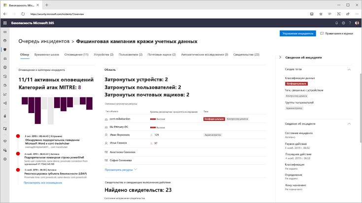
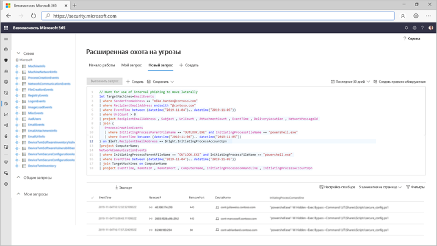

# Защита от угроз (Майкрософт)

**Область применения:**
- Защита от угроз (Майкрософт)

[!INCLUDE [Prerelease information](../includes/prerelease.md)]

Защита от угроз Майкрософт — это единый пакет защиты от предварительной и завершающей атакой, который интегрируется в конечные точки, удостоверения, электронные письма и приложения, чтобы обнаруживать, предотвращать и автоматически отвечать на совершенные атаки.  

Благодаря встроенному решению для защиты от угроз Майкрософт, специалисты по безопасности могут объединить угрозу, чтобы каждый из этих продуктов получал и определил полную область и влияние угрозы. сведения о том, как она была введена в среду, каковы ее влияние и как в настоящее время влияет на организацию. Защита от угроз Майкрософт выполняет автоматические действия по предотвращению или прекращению атак и автовосстановления, затронутых почтовых ящиков, конечных точек и удостоверений пользователей.  

Microsoft Threat Protection Suite защищает: 
- **Конечные точки с помощью защитника (Майкрософт) ATP** — это платформа единой конечной точки для защиты от вирусов, обнаружения нарушений подлинности, автоматического исследования и ответа. 
- **Электронная почта и совместная работа с office 365 ATP** : Office 365 ATP защищает вашу организацию от вредоносных угроз, исносящихся к сообщениям электронной почты, ссылкам (URL-адресам) и средствам совместной работы. 
- **Удостоверения с Azure ATP и служба Azure AD Identity Protection** — Azure ATP использует сигналы Active Directory для определения, обнаружения и проверки сложных угроз, скомпрометированных удостоверений и действий по предварительной программе проверки правовируса, направленных в организацию. 
- **Приложения с Microsoft Cloud App Security** -Microsoft Cloud App Security — это комплексное решение, которое позволяет глубоко отображать, строго управлять данными и улучшенную защиту облачных приложений. 

Уникальный межуровневый уровень защиты от угроз Майкрософт дополняет отдельные компоненты набора следующим образом:
- Защита от атак и координация защитных ответов в наборе через обмен сигналами и автоматические действия
- Соблюдайте закадровую закадровую статью об атаках по оповещениям, поведению и контексту для групп безопасности, присоединяя данные в оповещениях, подозрительных событиях и затронутых ресурсах к инцидентам.
- Автоматизация ответа на компромисс путем запуска самовосстановления для затронутых активов с помощью автоматизированного исправления
- Разрешите Teams Security выполнять подробную и эффективную Поиск угроз для данных конечной точки и данных Office

  
Происшествие между продуктами (обзор)

 
Все связанные оповещения по продуктам набора сопоставлены с одним инцидентом (представление "оповещения").

 
Поиск на основе запросов на основе необработанных данных электронной почты и конечных точек

Функции перекрестной защиты от угроз Майкрософт включают: 
- **Односторонняя область прозрачности** — Центральное представление всей информации об обнаруженных и затронутых активах, автоматических действиях и связанных свидетельствах в одной очереди и одной области в [Security.Microsoft.com](https://security.microsoft.com). 
- **Объединенные происшествия очередь** — чтобы помочь специалистам по безопасности сосредоточиться на том, что является критическим, обеспечивая полную область атак, подверженность затронутым активам и автоматизированные действия по исправлению группируются и помещаются своевременно. 
- **Автоматическое реагирование на угрозы** критической информации об угрозе совместно используется в режиме реального времени между продуктами Майкрософт по защите от угроз, чтобы предотвратить ход атаки. Например, если вредоносный файл обнаружен в конечной точке, защищенной с помощью пакета ATP для защитника Microsoft, он будет предписывает Office 365 ATP проверить и удалить файл из всех сообщений электронной почты. По всему комплекту безопасности Microsoft 365 файл будет заблокирован.
- **Самовосстановление для скомпрометированных устройств, удостоверений пользователей и почтовых ящиков** — защита от угроз Майкрософт использует автоматические действия и "Playbooks" для восстановления затронутых активов в безопасном состоянии. Защита от угроз Майкрософт использует функции автоматического исправления продуктов набора, чтобы гарантировать, что все затронутые активы по этому инциденту будут автоматически исправлены там, где это возможно.
- **Межпродуктная угроза** "Поиск вирусов". Teams могут использовать свои уникальные организационные знания для поиска подписывания нарушений, создавая собственные пользовательские запросы для необработанных данных, собранных различными продуктами для защиты. Защита от угроз Майкрософт обеспечивает доступ на основе запросов к 30 дням из исторических необработанных сигналов и данных оповещений между конечной точкой и данными Office 365 ATP. 

<h2>Службы защиты от угроз Майкрософт
</h2>
<table><tr><td>
<b><a href="https://docs.microsoft.com/windows/security/threat-protection/microsoft-defender-atp/microsoft-defender-advanced-threat-protection"><b>Advanced Threat Protection в защитнике Майкрософт</b>
</a></td>
<td>
<b><a href="https://docs.microsoft.com/office365/securitycompliance/office-365-atp"><b>Office 365 Advanced Threat protection</b>
</a></td>
<td>
<b><a href="https://docs.microsoft.com/azure-advanced-threat-protection/"><b>Служба Advanced Threat Protection в Azure</b></a>
</td>
<td>
<b><a href="https://docs.microsoft.com/cloud-app-security/"><b>Microsoft Cloud App Security</b></a>
</td>
</tr>
</table>
 

## Начало работы
Защиту от угроз (Майкрософт) могут использовать клиенты, у которых есть лицензия Microsoft 365 E5 или аналогичная лицензия.  Чтобы начать, включите службу в центре безопасности Microsoft 365 по адресу [Security.Microsoft.com](https://security.microsoft.com). Для получения дополнительных сведений прочитайте:
- [Требования к лицензированию](prerequisites.md#licensing-requirements)
- [Включение Защиты от угроз (Майкрософт)](mtp-enable.md)
