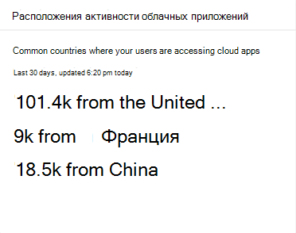

# Мониторинг приложений и отчетность в Центре безопасности Microsoft 365App monitoring and reporting in the Microsoft 365 security center

[!INCLUDE [Microsoft 365 Defender rebranding](../includes/microsoft-defender.md)]

Эти отчеты предоставляют более подробную информацию об используемых облачных приложениях в организации.These reports provide more insight into how cloud apps are being used in your organization. Включает различные типы приложений, их уровень риска и оповещения.Includes different kinds of apps, their level of risk, and alerts.

## отслеживание учетных записей электронной почты, подверженных риску;Monitor email accounts at risk

**Защита электронной почты** показывает учетные записи электронной почты под угрозой.**Email protection** shows email accounts at risk. Вы можете выбрать учетную запись для дальнейшего изучения в Центре безопасности Microsoft Defender.You can select an account to investigate further in Microsoft Defender Security Center.

## Мониторинг разрешений приложения, предоставленных пользователямиMonitor app permissions granted by users

**Cloud App Security — приложения OAuth** перечисляют приложения, обнаруженные Cloud App Security, которые получили разрешения от пользователей.**Cloud App Security - OAuth apps** lists apps discovered by Cloud App Security that have been granted permissions by users. Каталог рисков Cloud App Security включает более 16 000 приложений, которые оцениваются с помощью более чем 70 факторов риска.Cloud App Security's risk catalog includes over 16,000 apps that are assessed using over 70 risk factors.

Факторы риска начинаются с общих сведений, таких как издатель приложения.The risk factors start from general information, such as the app publisher. Затем он переходит к мерам безопасности и средствам контроля, таким как, поддерживает ли приложение шифрование в неавном действии или предоставляет журнал аудита активности пользователей.It then moves to security measures and controls, such as whether the app supports encryption at rest or provides an audit log of user activity.

## Мониторинг учетных записей пользователей облачных приложенийMonitor cloud app user accounts

**В учетных записях облачных приложений для проверки** перечислены учетные записи, которые могут требовать внимания.**Cloud app accounts for review** lists accounts that may require attention.

## Понять, какие облачные приложения используютсяUnderstand which cloud apps are used

**Обнаруженные облачные приложения (категории)** показывают, какие типы приложений используются в организации.**Discovered cloud apps (categories)** show what kinds of apps are being used in your organization. Он ссылок на информационную панель Cloud Discovery в Cloud App Security.It links to the Cloud Discovery dashboard in Cloud App Security. Дополнительные сведения см. [в кратком кратких сведениях: работа с обнаруженными приложениями.](https://docs.microsoft.com/cloud-app-security/discovered-apps)For more information, see [Quickstart: Work with discovered apps](https://docs.microsoft.com/cloud-app-security/discovered-apps).  

## Отслеживание доступа пользователей к облачным приложениямMonitor where users access cloud apps

**Расположения активности облачных приложений** показывают, где пользователи используют облачные приложения.**Cloud app activity locations** show where users are accessing cloud apps.

## Мониторинг состояния рабочих нагрузок инфраструктурыMonitor health for infrastructure workloads

**Состояние инфраструктуры** показывает оповещения о состоянии системы для рабочих нагрузок инфраструктуры в Защитнике Azure.**Infrastructure health** shows health status alerts for infrastructure workloads in Azure Defender.

Защитник Azure обеспечивает единое управление безопасностью и Защитник Для Office 365 в локальной и облачной рабочих нагрузках.Azure Defender provides unified security management and Defender for Office 365 across on-premises and cloud workloads. Вы можете собирать, искать и анализировать данные безопасности из различных источников, включая брандмауэры и другие партнерские решения.You can collect, search, and analyze security data from different sources, including firewalls and other partner solutions.

Дополнительные сведения см. в [документации По Защитнику Azure.](https://docs.microsoft.com/azure/security-center/)For more information, see [Azure Defender Documentation](https://docs.microsoft.com/azure/security-center/).

