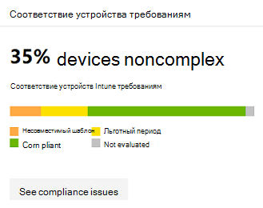

# <a name="device-monitoring-and-reporting-in-the-microsoft-365-security-center"></a><span data-ttu-id="5ddbc-104">Мониторинг устройств и создание отчетов в центре безопасности Майкрософт 365</span><span class="sxs-lookup"><span data-stu-id="5ddbc-104">Device monitoring and reporting in the Microsoft 365 security center</span></span>

[!INCLUDE [Microsoft 365 Defender rebranding](../includes/microsoft-defender.md)]


<span data-ttu-id="5ddbc-105">Обеспечьте безопасность и актуальность ваших устройств, а также возможность выявления потенциальных угроз в центре безопасности Microsoft 365.</span><span class="sxs-lookup"><span data-stu-id="5ddbc-105">Keep your devices secure, up-to-date, and spot potential threats in the Microsoft 365 security center.</span></span>

## <a name="view-device-alerts"></a><span data-ttu-id="5ddbc-106">Просмотр оповещений устройства</span><span class="sxs-lookup"><span data-stu-id="5ddbc-106">View device alerts</span></span>

<span data-ttu-id="5ddbc-107">Получайте обновленные оповещения о действиях с нарушением безопасности и других угрозах на устройствах от защитника Майкрософт для конечной точки (Эта возможность доступна с лицензией "точка").</span><span class="sxs-lookup"><span data-stu-id="5ddbc-107">Get up-to-date alerts about breach activity and other threats on your devices from Microsoft Defender for Endpoint (available with an E5 license).</span></span> <span data-ttu-id="5ddbc-108">Центр безопасности Microsoft 365 эффективно отслеживает эти оповещения на высоком уровне с помощью предпочтительного рабочего процесса.</span><span class="sxs-lookup"><span data-stu-id="5ddbc-108">Microsoft 365 security center effectively monitors these alerts at a high level using your preferred workflow.</span></span>

### <a name="monitor-high-impact-alerts"></a><span data-ttu-id="5ddbc-109">Отслеживание оповещений о высокой степени влияния</span><span class="sxs-lookup"><span data-stu-id="5ddbc-109">Monitor high-impact alerts</span></span>

<span data-ttu-id="5ddbc-110">Каждое оповещение Microsoft Defender для конечной точки имеет соответствующий уровень опасности (высокая, средняя, минимальная или информационная).</span><span class="sxs-lookup"><span data-stu-id="5ddbc-110">Each Microsoft Defender for Endpoint alert has a corresponding severity (high, medium, low, or informational).</span></span> <span data-ttu-id="5ddbc-111">Это указывает на потенциальное влияние на сеть, если оно не указано в автоматическом режиме.</span><span class="sxs-lookup"><span data-stu-id="5ddbc-111">It indicates potential impact to your network if left unattended.</span></span>  

<span data-ttu-id="5ddbc-112">Используйте карточку **серьезности оповещений для устройств** , чтобы сосредоточиться на более серьезных оповещениях и может требовать немедленный отклик.</span><span class="sxs-lookup"><span data-stu-id="5ddbc-112">Use the **Device alert severity** card to focus specifically on alerts that are more severe and might require immediate response.</span></span> <span data-ttu-id="5ddbc-113">С помощью этой карточки вы можете просмотреть дополнительные сведения на портале Центра безопасности защитника Майкрософт.</span><span class="sxs-lookup"><span data-stu-id="5ddbc-113">From this card, you can view more information on the Microsoft Defender Security Center portal.</span></span>


### <a name="understand-sources-of-alerts"></a><span data-ttu-id="5ddbc-115">Общие сведения об источниках оповещений</span><span class="sxs-lookup"><span data-stu-id="5ddbc-115">Understand sources of alerts</span></span>

<span data-ttu-id="5ddbc-116">Защитник Майкрософт для конечной точки использует данные из широкого диапазона датчиков безопасности и источников аналитики для создания оповещений.</span><span class="sxs-lookup"><span data-stu-id="5ddbc-116">Microsoft Defender for Endpoint leverages data from a broad range of security sensors and intelligence sources to generate alerts.</span></span> <span data-ttu-id="5ddbc-117">Например, он может использовать сведения об обнаружении антивирусной программы "защитник Майкрософт" и сторонней антивредоносной программы.</span><span class="sxs-lookup"><span data-stu-id="5ddbc-117">For example, it can use detection information from Microsoft Defender Antivirus and third-party antimalware.</span></span> <span data-ttu-id="5ddbc-118">Кроме того, он может использовать собственную логику, предоставляемую API веб-службы.</span><span class="sxs-lookup"><span data-stu-id="5ddbc-118">It can also use your own custom threat intelligence provided through the web service API.</span></span>

<span data-ttu-id="5ddbc-119">В карточке источников **обнаружения оповещений для устройств** показано распределение оповещений по источнику.</span><span class="sxs-lookup"><span data-stu-id="5ddbc-119">The **Device alert detection** sources card shows the distribution of alerts by source.</span></span> <span data-ttu-id="5ddbc-120">Отслеживание действий, связанных с определенными источниками, в частности пользовательскими источниками.</span><span class="sxs-lookup"><span data-stu-id="5ddbc-120">Track activity related to certain sources, particularly your custom sources.</span></span> <span data-ttu-id="5ddbc-121">Кроме того, с помощью карточки можно сосредоточиться на оповещениях, поступающих от датчиков, которые не настроены для автоматической блокировки вредоносных действий или компонентов.</span><span class="sxs-lookup"><span data-stu-id="5ddbc-121">You can also use the card to focus on alerts coming from sensors that aren't configured to automatically block malicious activity or components.</span></span>


<span data-ttu-id="5ddbc-123">С помощью этой карточки вы можете просмотреть дополнительные сведения на портале Центра безопасности защитника Майкрософт.</span><span class="sxs-lookup"><span data-stu-id="5ddbc-123">From this card, you can view more information on the Microsoft Defender Security Center portal.</span></span>

### <a name="understand-the-types-of-threats-that-trigger-alerts"></a><span data-ttu-id="5ddbc-124">Сведения о типах угроз, инициирующих оповещения</span><span class="sxs-lookup"><span data-stu-id="5ddbc-124">Understand the types of threats that trigger alerts</span></span>

<span data-ttu-id="5ddbc-125">Защитник Майкрософт для конечной точки сортирует каждое оповещение в категории, представляющей определенный этап в цепочке атак или типе компонента угрозы.</span><span class="sxs-lookup"><span data-stu-id="5ddbc-125">Microsoft Defender for Endpoint sorts each alert into a category representing a certain stage in the attack chain or type of threat component.</span></span> <span data-ttu-id="5ddbc-126">Например, обнаруженное действие по работе с угрозой может быть отнесено к категории "Латерал Replace", чтобы указать, что была предпринята попытка получить доступ к другим устройствам в сети.</span><span class="sxs-lookup"><span data-stu-id="5ddbc-126">For example, a detected threat activity might be categorized as "lateral movement" to indicate there was an attempt to reach other devices on the network.</span></span> <span data-ttu-id="5ddbc-127">Действия могут быть вызваны после того, как злоумышленники получит начальный фусолд.</span><span class="sxs-lookup"><span data-stu-id="5ddbc-127">The activity has likely occurred after attackers gained an initial foothold.</span></span> <span data-ttu-id="5ddbc-128">При обнаружении компонент угрозы может быть классифицирован в широком смысле как вредоносные программы или как конкретный тип угрозы.</span><span class="sxs-lookup"><span data-stu-id="5ddbc-128">When detected, a threat component might be classified broadly as malware or specifically as a specific threat type.</span></span> <span data-ttu-id="5ddbc-129">К особым относятся программы для атаки, переноса учетных данных и других типов вредоносных или нежелательных программ.</span><span class="sxs-lookup"><span data-stu-id="5ddbc-129">Specifics include ransomware, credential stealing, or other types of malicious or unwanted software.</span></span>

<span data-ttu-id="5ddbc-130">В карточке **категории угроз для устройств** показано распределение оповещений по этим категориям.</span><span class="sxs-lookup"><span data-stu-id="5ddbc-130">The **Device threat categories** card shows the distribution of alerts into these categories.</span></span> <span data-ttu-id="5ddbc-131">Используйте эту информацию для определения действий с угрозами, таких как попытки хищения учетных данных, которые обычно имеют более высокий уровень воздействия, чем попытки использования социальных сетей.</span><span class="sxs-lookup"><span data-stu-id="5ddbc-131">Use this information to identify threat activity, such as credential theft attempts, that usually have higher impact than social engineering attempts.</span></span> <span data-ttu-id="5ddbc-132">Кроме того, вы можете отслеживать наличие необратимых угроз, таких как "шантажистом".</span><span class="sxs-lookup"><span data-stu-id="5ddbc-132">You can also to monitor for potentially destructive threats like ransomware.</span></span>


### <a name="monitor-active-alerts"></a><span data-ttu-id="5ddbc-134">Отслеживание активных оповещений</span><span class="sxs-lookup"><span data-stu-id="5ddbc-134">Monitor active alerts</span></span>

<span data-ttu-id="5ddbc-135">Карточка **состояния оповещения для устройства** указывает количество предупреждений, которые не были разрешены и могут потребовать внимания.</span><span class="sxs-lookup"><span data-stu-id="5ddbc-135">The **Device alert status** card indicates the number of alerts that haven't been resolved and may require attention.</span></span> <span data-ttu-id="5ddbc-136">С помощью этой карточки вы можете просмотреть дополнительные сведения на портале Центра безопасности защитника Майкрософт.</span><span class="sxs-lookup"><span data-stu-id="5ddbc-136">From this card, you can view more information on the Microsoft Defender Security Center portal.</span></span>


### <a name="monitor-classification-of-resolved-alerts"></a><span data-ttu-id="5ddbc-138">Отслеживание классификации разрешенных оповещений</span><span class="sxs-lookup"><span data-stu-id="5ddbc-138">Monitor classification of resolved alerts</span></span>

<span data-ttu-id="5ddbc-139">При разрешении оповещения Майкрософт для оповещения о конечных точках ваш персонал безопасности может указать, было ли оповещение проверено следующим образом:</span><span class="sxs-lookup"><span data-stu-id="5ddbc-139">When resolving a Microsoft Defender for Endpoint alert, your security staff can specify whether an alert has been verified as:</span></span>

* <span data-ttu-id="5ddbc-140">Истинное оповещение, идентифицирующее реальные действия или компоненты угроз</span><span class="sxs-lookup"><span data-stu-id="5ddbc-140">A true alert that identifies actual breach activity or threat components</span></span>
* <span data-ttu-id="5ddbc-141">Ложное оповещение, которое неправильно определило нормальные действия</span><span class="sxs-lookup"><span data-stu-id="5ddbc-141">A false alert that has incorrectly detected normal activity</span></span>

<span data-ttu-id="5ddbc-142">На карточке **классификация оповещений устройств** показано, были ли разрешенные оповещения классифицированы как "истина" или "ложные".</span><span class="sxs-lookup"><span data-stu-id="5ddbc-142">The **Device alert classification** card shows whether your resolved alerts have been classified as true or false alerts.</span></span> <span data-ttu-id="5ddbc-143">С помощью этой карточки вы можете просмотреть дополнительные сведения на портале Центра безопасности защитника Майкрософт.</span><span class="sxs-lookup"><span data-stu-id="5ddbc-143">From this card, you can view more information on the Microsoft Defender Security Center portal.</span></span>

<span data-ttu-id="5ddbc-144">Примечание. в некоторых случаях сведения об классификации недоступны для определенных оповещений.</span><span class="sxs-lookup"><span data-stu-id="5ddbc-144">Note: In some cases, classification information is unavailable for certain alerts.</span></span>


### <a name="monitor-determination-of-resolved-alerts"></a><span data-ttu-id="5ddbc-146">Отслеживание определения разрешенных оповещений</span><span class="sxs-lookup"><span data-stu-id="5ddbc-146">Monitor determination of resolved alerts</span></span>

<span data-ttu-id="5ddbc-147">Вместе с классификацией о том, является ли предупреждение истинным или ложным во время разрешения, персонал по обеспечению безопасности может получить решение.</span><span class="sxs-lookup"><span data-stu-id="5ddbc-147">Along with classifying whether an alert is true or false during resolution, your security staff can provide a determination.</span></span> <span data-ttu-id="5ddbc-148">Определение указывает тип обычной или вредоносной активности, обнаруженной при проверке оповещения.</span><span class="sxs-lookup"><span data-stu-id="5ddbc-148">A determination indicates the type of normal or malicious activity that was found while validating the alert.</span></span>

<span data-ttu-id="5ddbc-149">На карточке **определения оповещения для устройства** отображается определение, предоставленное для каждого оповещения.</span><span class="sxs-lookup"><span data-stu-id="5ddbc-149">The **Device alert determination** card shows the determination provided for each alert.</span></span>

* <span data-ttu-id="5ddbc-150">**Апт** : Расширенная постоянная угроза, указывающая на то, что обнаруженные действия или компоненты угроз являются частью сложного нарушения безопасности, разработанного для получения фусолд в сети</span><span class="sxs-lookup"><span data-stu-id="5ddbc-150">**APT** : advanced persistent threat, indicating that the detected activity or threat component is part of a sophisticated breach designed to gain a foothold in the affected network</span></span>  
* <span data-ttu-id="5ddbc-151">**Вредоносные программы** : вредоносный файл или код</span><span class="sxs-lookup"><span data-stu-id="5ddbc-151">**Malware** : malicious file or code</span></span>
* <span data-ttu-id="5ddbc-152">**Сотрудники по безопасности** : обычные действия, выполняемые персоналом по обеспечению безопасности</span><span class="sxs-lookup"><span data-stu-id="5ddbc-152">**Security personnel** : normal activity performed by security staff</span></span>
* <span data-ttu-id="5ddbc-153">**Тестирование безопасности** : действия или компоненты, предназначенные для моделирования фактических угроз и ожидаемые для запуска датчиков безопасности и создания оповещений</span><span class="sxs-lookup"><span data-stu-id="5ddbc-153">**Security testing** : activity or components designed to simulate actual threats and expected to trigger security sensors and generate alerts</span></span>
* <span data-ttu-id="5ddbc-154">**Нежелательное программное обеспечение** : приложения и другое программное обеспечение, которые не являются вредоносными, но в ином случае нарушают политику или допустимые стандарты использования</span><span class="sxs-lookup"><span data-stu-id="5ddbc-154">**Unwanted software** : apps and other software that are not considered malicious, but otherwise violate policy or acceptable use standards</span></span>
* <span data-ttu-id="5ddbc-155">**Другие: любое** другое определение, которое не относится к предоставленным типам</span><span class="sxs-lookup"><span data-stu-id="5ddbc-155">**Others** : any other determination that doesn't fall under the provided types</span></span>

<span data-ttu-id="5ddbc-156">Из этой карточки вы можете просмотреть дополнительные сведения в центре безопасности защитника Майкрософт.</span><span class="sxs-lookup"><span data-stu-id="5ddbc-156">From this card, you can view more information in Microsoft Defender Security Center.</span></span>


### <a name="understand-which-devices-are-at-risk"></a><span data-ttu-id="5ddbc-158">Сведения о том, какие устройства подвержены риску</span><span class="sxs-lookup"><span data-stu-id="5ddbc-158">Understand which devices are at risk</span></span>

<span data-ttu-id="5ddbc-159">**Защита устройства** показывает уровень риска для устройств.</span><span class="sxs-lookup"><span data-stu-id="5ddbc-159">**Device protection** shows the risk level for devices.</span></span> <span data-ttu-id="5ddbc-160">Уровень риска зависит от таких факторов, как тип и серьезность оповещений на устройстве.</span><span class="sxs-lookup"><span data-stu-id="5ddbc-160">The risk level is based on factors such as the type and severity of alerts on the device.</span></span>


## <a name="monitor-and-report-status-of-intune-managed-devices"></a><span data-ttu-id="5ddbc-162">Отслеживание и отправка отчетов о состоянии устройств, управляемых Intune</span><span class="sxs-lookup"><span data-stu-id="5ddbc-162">Monitor and report status of Intune-managed devices</span></span>

<span data-ttu-id="5ddbc-163">Следующие отчеты содержат данные от устройств, зарегистрированных в Intune.</span><span class="sxs-lookup"><span data-stu-id="5ddbc-163">The following reports contain data from devices enrolled in Intune.</span></span> <span data-ttu-id="5ddbc-164">Данные из незарегистрированных устройств не входят в состав.</span><span class="sxs-lookup"><span data-stu-id="5ddbc-164">Data from unenrolled devices isn't included.</span></span> <span data-ttu-id="5ddbc-165">Просматривать эти карты могут только глобальные администраторы.</span><span class="sxs-lookup"><span data-stu-id="5ddbc-165">Only Global Administrators can view these cards.</span></span>

<span data-ttu-id="5ddbc-166">Данные устройства, зарегистрированные в Intune, включают:</span><span class="sxs-lookup"><span data-stu-id="5ddbc-166">Intune enrolled device data includes:</span></span>

* <span data-ttu-id="5ddbc-167">Соответствие устройства требованиям</span><span class="sxs-lookup"><span data-stu-id="5ddbc-167">Device compliance</span></span>
* <span data-ttu-id="5ddbc-168">Устройства с активным вредоносным по</span><span class="sxs-lookup"><span data-stu-id="5ddbc-168">Devices with active malware</span></span>
* <span data-ttu-id="5ddbc-169">Типы вредоносных программ на устройствах</span><span class="sxs-lookup"><span data-stu-id="5ddbc-169">Types of malware on devices</span></span>
* <span data-ttu-id="5ddbc-170">Вредоносные программы на устройствах</span><span class="sxs-lookup"><span data-stu-id="5ddbc-170">Malware on devices</span></span>
* <span data-ttu-id="5ddbc-171">Устройства с обнаружением вредоносных программ</span><span class="sxs-lookup"><span data-stu-id="5ddbc-171">Devices with malware detections</span></span>
* <span data-ttu-id="5ddbc-172">Пользователи с обнаружением вредоносных программ</span><span class="sxs-lookup"><span data-stu-id="5ddbc-172">Users with malware detections</span></span>

### <a name="monitor-device-compliance"></a><span data-ttu-id="5ddbc-173">Отслеживание соответствия устройства требованиям</span><span class="sxs-lookup"><span data-stu-id="5ddbc-173">Monitor device compliance</span></span>

<span data-ttu-id="5ddbc-174">**Соответствие требованиям устройства** показывает, сколько устройств, зарегистрированных в Intune, соответствуют политикам конфигурации.</span><span class="sxs-lookup"><span data-stu-id="5ddbc-174">**Device compliance** shows how many devices that are enrolled in Intune comply with configuration policies.</span></span>



### <a name="discover-devices-with-malware-detections"></a><span data-ttu-id="5ddbc-176">Обнаружение устройств с обнаружением вредоносных программ</span><span class="sxs-lookup"><span data-stu-id="5ddbc-176">Discover devices with malware detections</span></span>

<span data-ttu-id="5ddbc-177">**Обнаружение вредоносных программ для устройств** предоставляет количество устройств, зарегистрированных в Intune, с вредоносными программами, которые не были полностью устранены.</span><span class="sxs-lookup"><span data-stu-id="5ddbc-177">**Device malware detections** provide the number of Intune enrolled devices with malware that hasn't been fully resolved.</span></span> <span data-ttu-id="5ddbc-178">Отсутствие разрешения может быть вызвано ожидающими действиями, перезапуском, полным сканированием, ручными действиями пользователя или в случае неудачного завершения действия по исправлению.</span><span class="sxs-lookup"><span data-stu-id="5ddbc-178">A lack of resolution can be because of pending actions, a restart, a full scan, manual user actions, or if the remediation action was not successfully completed.</span></span>


### <a name="understand-the-types-of-malware-detected"></a><span data-ttu-id="5ddbc-180">Сведения о типах обнаруженных вредоносных программ</span><span class="sxs-lookup"><span data-stu-id="5ddbc-180">Understand the types of malware detected</span></span>

<span data-ttu-id="5ddbc-181">**Типы вредоносных программ на устройствах** содержат различные виды вредоносных программ, обнаруженных на устройствах, зарегистрированных в Intune.</span><span class="sxs-lookup"><span data-stu-id="5ddbc-181">**Types of malware on devices** show different kinds of malware that have been detected on devices enrolled in Intune.</span></span> <span data-ttu-id="5ddbc-182">Вы можете исследовать каждый тип в центре безопасности Microsoft 365.</span><span class="sxs-lookup"><span data-stu-id="5ddbc-182">You can investigate each type in the Microsoft 365 security center.</span></span>


### <a name="understand-the-specific-malware-detected-on-your-devices"></a><span data-ttu-id="5ddbc-184">Общие сведения об определенных вредоносных программах, обнаруженных на устройствах</span><span class="sxs-lookup"><span data-stu-id="5ddbc-184">Understand the specific malware detected on your devices</span></span>

<span data-ttu-id="5ddbc-185">**Вредоносные программы на устройствах** предоставляет список определенных вредоносных программ, обнаруженных на устройствах.</span><span class="sxs-lookup"><span data-stu-id="5ddbc-185">**Malware on devices** provides a list of the specific malware detected on your devices.</span></span>


### <a name="understand-which-devices-have-the-most-malware"></a><span data-ttu-id="5ddbc-187">Сведения о том, какие устройства имеют большинство вредоносных программ</span><span class="sxs-lookup"><span data-stu-id="5ddbc-187">Understand which devices have the most malware</span></span>

<span data-ttu-id="5ddbc-188">**Устройства с обнаружением вредоносных программ** показывают, какие устройства имеют большинство обнаружений вредоносных программ.</span><span class="sxs-lookup"><span data-stu-id="5ddbc-188">**Devices with malware detections** show which devices have the most malware detections.</span></span> <span data-ttu-id="5ddbc-189">в центре безопасности Майкрософт 365 вы можете проверить, активна ли вредоносная программа, кто использует устройство и его состояние управления в Intune.</span><span class="sxs-lookup"><span data-stu-id="5ddbc-189">in the Microsoft 365 security center, you can investigate whether malware is active, who uses the device, and its management status in Intune.</span></span>


### <a name="understand-which-users-have-devices-with-the-most-malware"></a><span data-ttu-id="5ddbc-191">Сведения о том, какие пользователи имеют устройства с большинством вредоносных программ</span><span class="sxs-lookup"><span data-stu-id="5ddbc-191">Understand which users have devices with the most malware</span></span>

<span data-ttu-id="5ddbc-192">**Пользователи с обнаружением вредоносных программ** покажут пользователей с устройствами, которые использовались большинством обнаружений вредоносных программ.</span><span class="sxs-lookup"><span data-stu-id="5ddbc-192">**Users with malware detections** show users with devices that had the most malware detections.</span></span> <span data-ttu-id="5ddbc-193">В центре безопасности Майкрософт 365 вы можете узнать, сколько устройств назначено каждому пользователю, и дополнительные сведения о каждом устройстве и о типе вредоносных программ.</span><span class="sxs-lookup"><span data-stu-id="5ddbc-193">In the Microsoft 365 security center, you can see how many devices are assigned to each user and more information about each device and the type of malware.</span></span>


## <a name="monitor-and-manage-attack-surface-reduction-rule-deployment-and-detections"></a><span data-ttu-id="5ddbc-195">Мониторинг и управление развертыванием и обнаружением правил снижения поверхности атак</span><span class="sxs-lookup"><span data-stu-id="5ddbc-195">Monitor and manage attack surface reduction rule deployment and detections</span></span>

<span data-ttu-id="5ddbc-196">[Правила предотвращения снижения уязвимости (ASR)](https://docs.microsoft.com/windows/security/threat-protection/microsoft-defender-atp/attack-surface-reduction) помогают предотвратить действия и приложения, которые обычно используются вредоносной программой для проникновения устройств.</span><span class="sxs-lookup"><span data-stu-id="5ddbc-196">[Attack Surface Reduction (ASR) rules](https://docs.microsoft.com/windows/security/threat-protection/microsoft-defender-atp/attack-surface-reduction) help prevent actions and apps that are typically used by exploit-seeking malware to infect devices.</span></span> <span data-ttu-id="5ddbc-197">Эти правила определяют, когда и как запускаются исполняемые файлы.</span><span class="sxs-lookup"><span data-stu-id="5ddbc-197">These rules control when and how executables can run.</span></span> <span data-ttu-id="5ddbc-198">Например, вы можете предотвратить запуск загруженного исполняемого файла в JavaScript или VBScript, блокировать вызовы Win32 API из макросов Office или блокировать процессы, которые выполняются с USB-накопителей.</span><span class="sxs-lookup"><span data-stu-id="5ddbc-198">For example, you can prevent JavaScript or VBScript from launching a downloaded executable, block Win32 API calls from Office macros, or block processes that run from USB drives.</span></span>


<span data-ttu-id="5ddbc-200">На карточке **Правила сокращения направлений атак** приведены общие сведения о развертывании правил на устройствах.</span><span class="sxs-lookup"><span data-stu-id="5ddbc-200">The **Attack surface reduction rules** card provides an overview of the deployment of rules across your devices.</span></span>

<span data-ttu-id="5ddbc-201">В верхнем столбце на этой карточке показано общее количество устройств, которые находятся в следующих режимах развертывания:</span><span class="sxs-lookup"><span data-stu-id="5ddbc-201">The top bar on the card shows the total number of devices that are in the following deployment modes:</span></span>

* <span data-ttu-id="5ddbc-202">**Режим блокировки** : устройства с как минимум одним правилом, настроенными для блокирования обнаруженных действий</span><span class="sxs-lookup"><span data-stu-id="5ddbc-202">**Block mode** : devices with at least one rule configured to block detected activity</span></span>
* <span data-ttu-id="5ddbc-203">**Режим аудита** : устройства без правил, не настроенные для блокирования обнаруженных действий, но у которых есть по крайней мере один набор правил для аудита обнаруженных действий</span><span class="sxs-lookup"><span data-stu-id="5ddbc-203">**Audit mode** : devices with no rules set to block detected activity, but has at least one rule set to audit detected activity</span></span>  
* <span data-ttu-id="5ddbc-204">**Выкл** : устройства со всеми правилами ASR отключены.</span><span class="sxs-lookup"><span data-stu-id="5ddbc-204">**Off** : devices with all ASR rules turned off</span></span>

<span data-ttu-id="5ddbc-205">В нижней части этой карточки приведены параметры всех устройств, отсортированные по правилам.</span><span class="sxs-lookup"><span data-stu-id="5ddbc-205">The lower part of this card shows settings by rule across your devices.</span></span> <span data-ttu-id="5ddbc-206">На каждой полосе отображается количество устройств, для которых задана блокировка, обнаружение аудита или отключение правила полностью.</span><span class="sxs-lookup"><span data-stu-id="5ddbc-206">Each bar indicates the number of devices that are set to block, audit detection, or have the rule completely turned off.</span></span>

### <a name="view-asr-detections"></a><span data-ttu-id="5ddbc-207">Просмотр обнаруженных аварийных ASR</span><span class="sxs-lookup"><span data-stu-id="5ddbc-207">View ASR detections</span></span>

<span data-ttu-id="5ddbc-208">Чтобы просмотреть подробные сведения об обнаружении правил ASR в сети, выберите **Просмотр обнаружений** в карточке **правила уменьшения уязвимой зоны** .</span><span class="sxs-lookup"><span data-stu-id="5ddbc-208">To view detailed information about ASR rule detections in your network, select **View detections** on the **Attack surface reduction rules** card.</span></span> <span data-ttu-id="5ddbc-209">Откроется вкладка **обнаружения** на странице подробный отчет.</span><span class="sxs-lookup"><span data-stu-id="5ddbc-209">The **Detections** tab in the detailed report page will open.</span></span>


<span data-ttu-id="5ddbc-211">На диаграмме, расположенной в верхней части страницы, показано обнаружение с обнаружением стеков по времени, которые были заблокированы или проверены.</span><span class="sxs-lookup"><span data-stu-id="5ddbc-211">The chart at the top of the page shows detections over time stacking detections that were either blocked or audited.</span></span> <span data-ttu-id="5ddbc-212">В таблице внизу перечислены последние обнаруженные действия.</span><span class="sxs-lookup"><span data-stu-id="5ddbc-212">The table at the bottom lists the most recent detections.</span></span> <span data-ttu-id="5ddbc-213">Чтобы понять, в чем заключаются обнаруженные действия, используйте следующие сведения в таблице:</span><span class="sxs-lookup"><span data-stu-id="5ddbc-213">Use the following information on the table to understand the nature of the detections:</span></span>

* <span data-ttu-id="5ddbc-214">**Обнаруженный файл** : файл, обычно сценарий или документ, содержимое которого активировало вероятные действия по атакам</span><span class="sxs-lookup"><span data-stu-id="5ddbc-214">**Detected file** : the file, typically a script or document, whose contents triggered the suspected attack activity</span></span>
* <span data-ttu-id="5ddbc-215">**Правило** : имя, описывающее действия по атакам, которые предназначено для перехвата правилом.</span><span class="sxs-lookup"><span data-stu-id="5ddbc-215">**Rule** : name describing the attack activities the rule is designed to catch.</span></span> <span data-ttu-id="5ddbc-216">Сведения о существующих правилах ASR</span><span class="sxs-lookup"><span data-stu-id="5ddbc-216">Read about existing ASR rules</span></span>
* <span data-ttu-id="5ddbc-217">**Исходное приложение** : приложение, которое загрузило или выполнило содержимое, вызывающее вероятные действия при атаке.</span><span class="sxs-lookup"><span data-stu-id="5ddbc-217">**Source app** : the application that loaded or executed content triggering the suspected attack activity.</span></span> <span data-ttu-id="5ddbc-218">Это может быть легальное приложение, например веб-браузер, приложение Office или системное средство, например PowerShell.</span><span class="sxs-lookup"><span data-stu-id="5ddbc-218">It could be a legitimate application, such as web browser, an Office application, or a system tool like PowerShell</span></span>
* <span data-ttu-id="5ddbc-219">**Издатель** : поставщик, который освободил исходное приложение</span><span class="sxs-lookup"><span data-stu-id="5ddbc-219">**Publisher** : the vendor that released the source app</span></span>

### <a name="review-device-asr-rule-settings"></a><span data-ttu-id="5ddbc-220">Проверка параметров правил для устройства ASR</span><span class="sxs-lookup"><span data-stu-id="5ddbc-220">Review device ASR rule settings</span></span>

<span data-ttu-id="5ddbc-221">На странице отчета " **правила снижения уязвимости** " перейдите на вкладку **Конфигурация** , чтобы просмотреть параметры правил для отдельных устройств.</span><span class="sxs-lookup"><span data-stu-id="5ddbc-221">In the **Attack surface reduction rules** report page, go to the **Configuration** tab to review rule settings for individual devices.</span></span> <span data-ttu-id="5ddbc-222">Выберите устройство, чтобы получить подробные сведения о том, находится ли каждое правило в режиме блокировки, режиме аудита или полном отключении.</span><span class="sxs-lookup"><span data-stu-id="5ddbc-222">Select a device to get detailed information about whether each rule is in block mode, audit mode, or turned off entirely.</span></span>


<span data-ttu-id="5ddbc-224">Microsoft Intune предоставляет функции управления для правил ASR.</span><span class="sxs-lookup"><span data-stu-id="5ddbc-224">Microsoft Intune provides management functionality for your ASR rules.</span></span> <span data-ttu-id="5ddbc-225">Если вы хотите обновить параметры, выберите **начать работу** в разделе **Настройка устройств** на вкладке, чтобы открыть компонент "Управление устройствами в Intune".</span><span class="sxs-lookup"><span data-stu-id="5ddbc-225">If you want to update your settings, select **Get started** under **Configure devices** in the tab to open device management on Intune.</span></span>

### <a name="exclude-files-from-asr-rules"></a><span data-ttu-id="5ddbc-226">Исключение файлов из правил ASR</span><span class="sxs-lookup"><span data-stu-id="5ddbc-226">Exclude files from ASR rules</span></span>

<span data-ttu-id="5ddbc-227">Центр безопасности Microsoft 365 собирает имена [файлов, которые могут потребоваться исключить](https://docs.microsoft.com/windows/security/threat-protection/microsoft-defender-atp/enable-attack-surface-reduction#exclude-files-and-folders-from-asr-rules) из обнаруженных правил по снижению уязвимости.</span><span class="sxs-lookup"><span data-stu-id="5ddbc-227">Microsoft 365 security center collects the names of the [files you might want to exclude](https://docs.microsoft.com/windows/security/threat-protection/microsoft-defender-atp/enable-attack-surface-reduction#exclude-files-and-folders-from-asr-rules) from detections by attack surface reduction rules.</span></span> <span data-ttu-id="5ddbc-228">За счет исключения файлов можно сократить количество ложных срабатываний и более уверенно развернуть правила уменьшения уязвимой зоны в режиме блокировки.</span><span class="sxs-lookup"><span data-stu-id="5ddbc-228">By excluding files, you can reduce false positive detections and more confidently deploy attack surface reduction rules in block mode.</span></span>

<span data-ttu-id="5ddbc-229">Исключения управляются в Microsoft Intune, но центр обеспечения безопасности Microsoft 365 предоставляет средство анализа, помогающее ознакомиться с файлами.</span><span class="sxs-lookup"><span data-stu-id="5ddbc-229">The exclusions are managed on Microsoft Intune, but Microsoft 365 security center provides an analysis tool to help you understand the files.</span></span> <span data-ttu-id="5ddbc-230">Чтобы начать сбор файлов для исключения, перейдите на вкладку " **Добавление исключений** " на странице отчета " **правила уменьшения уязвимой зоны** ".</span><span class="sxs-lookup"><span data-stu-id="5ddbc-230">To start collecting files for exclusion, go to the **Add exclusions** tab in the **Attack surface reduction rules** report page.</span></span>

>[!NOTE]  
><span data-ttu-id="5ddbc-231">Средство анализирует обнаружение по всем правилам сокращения направлений атак, но [только некоторые правила поддерживают исключения](https://docs.microsoft.com/windows/security/threat-protection/microsoft-defender-atp/troubleshoot-asr).</span><span class="sxs-lookup"><span data-stu-id="5ddbc-231">The tool analyzes detections by all attack surface reduction rules, but [only some rules support exclusions](https://docs.microsoft.com/windows/security/threat-protection/microsoft-defender-atp/troubleshoot-asr).</span></span>


<span data-ttu-id="5ddbc-233">В таблице перечислены все имена файлов, обнаруженные правилами сокращения для атак на уязвимую зону.</span><span class="sxs-lookup"><span data-stu-id="5ddbc-233">The table lists all the file names detected by your attack surface reduction rules.</span></span> <span data-ttu-id="5ddbc-234">Вы можете выбрать файлы, чтобы проанализировать последствия их исключения:</span><span class="sxs-lookup"><span data-stu-id="5ddbc-234">You can select files to review the impact of excluding them:</span></span>

* <span data-ttu-id="5ddbc-235">Сколько меньше обнаруженных обнаружений</span><span class="sxs-lookup"><span data-stu-id="5ddbc-235">How many fewer detections</span></span>
* <span data-ttu-id="5ddbc-236">Сколько устройств сообщает об обнаружении</span><span class="sxs-lookup"><span data-stu-id="5ddbc-236">How many fewer devices report the detections</span></span>

<span data-ttu-id="5ddbc-237">Чтобы получить список выбранных файлов с полными путями для исключения, выберите пункт **Получение путей исключения**.</span><span class="sxs-lookup"><span data-stu-id="5ddbc-237">To get a list of the selected files with their full paths for exclusion, select **Get exclusion paths**.</span></span>

<span data-ttu-id="5ddbc-238">Журналы для **переноса учетных данных блока правил ASR из подсистемы локального центра безопасности Windows (lsass.exe)** захватывают **lsass.exe** исходного приложения.</span><span class="sxs-lookup"><span data-stu-id="5ddbc-238">Logs for the ASR rule **Block credential stealing from the Windows local security authority subsystem (lsass.exe)** capture the source app **lsass.exe**.</span></span> <span data-ttu-id="5ddbc-239">Это обычный системный файл, но записанный как обнаруженный файл.</span><span class="sxs-lookup"><span data-stu-id="5ddbc-239">It is a normal system file, but captured as the detected file.</span></span> <span data-ttu-id="5ddbc-240">В результате созданный список исключаемых путей будет содержать этот файл.</span><span class="sxs-lookup"><span data-stu-id="5ddbc-240">As a result, the generated list of exclusion paths will include this file.</span></span> <span data-ttu-id="5ddbc-241">Чтобы исключить файл, который инициировал это правило, а не **lsass.exe** , вместо обнаруженного файла используйте путь к исходному приложению.</span><span class="sxs-lookup"><span data-stu-id="5ddbc-241">To exclude the file that triggered this rule instead of **lsass.exe** , use the path to the source app instead of the detected file.</span></span>

<span data-ttu-id="5ddbc-242">Чтобы найти исходное приложение, выполните следующий [Расширенный запрос поиска](https://docs.microsoft.com/windows/security/threat-protection/microsoft-defender-atp/advanced-hunting) для этого конкретного правила (определяемого с помощью идентификатора правила 9e6c4e1f-7d60-472f-ba1a-a39ef669e4b2):</span><span class="sxs-lookup"><span data-stu-id="5ddbc-242">To locate the source app, run the following [advanced hunting query](https://docs.microsoft.com/windows/security/threat-protection/microsoft-defender-atp/advanced-hunting) for this specific rule (identified by rule ID 9e6c4e1f-7d60-472f-ba1a-a39ef669e4b2):</span></span>

```kusto
DeviceEvents
| where Timestamp > ago(7d)
| where ActionType startswith "Asr"
| where AdditionalFields contains "9e6c4e1f-7d60-472f-ba1a-a39ef669e4b2"
| project InitiatingProcessFolderPath, InitiatingProcessFileName
```

#### <a name="check-files-for-exclusion"></a><span data-ttu-id="5ddbc-243">Проверка файлов для исключения</span><span class="sxs-lookup"><span data-stu-id="5ddbc-243">Check files for exclusion</span></span>

<span data-ttu-id="5ddbc-244">Перед исключением файла из ASR рекомендуется проанализировать его, чтобы определить, не является ли он вредоносным.</span><span class="sxs-lookup"><span data-stu-id="5ddbc-244">Before excluding a file from ASR, we recommend that you inspect the file to determine if it's indeed not malicious.</span></span>

<span data-ttu-id="5ddbc-245">Чтобы просмотреть файл, используйте [страницу сведений о файле](https://docs.microsoft.com/windows/security/threat-protection/microsoft-defender-atp/investigate-files) в центре безопасности защитника Майкрософт.</span><span class="sxs-lookup"><span data-stu-id="5ddbc-245">To review a file, use the [file information page](https://docs.microsoft.com/windows/security/threat-protection/microsoft-defender-atp/investigate-files) on Microsoft Defender Security Center.</span></span> <span data-ttu-id="5ddbc-246">На странице предоставляются сведения о распространении и коэффициент обнаружения антивирусной программы Вирустотал.</span><span class="sxs-lookup"><span data-stu-id="5ddbc-246">The page provides prevalence information and the VirusTotal antivirus detection ratio.</span></span> <span data-ttu-id="5ddbc-247">Вы также можете использовать эту страницу для передачи файла для детального анализа.</span><span class="sxs-lookup"><span data-stu-id="5ddbc-247">You can also use the page to submit the file for deep analysis.</span></span>

<span data-ttu-id="5ddbc-248">Чтобы найти обнаруженный файл в центре безопасности защитника Майкрософт, выполните поиск всех обнаружений ASR, используя следующий Расширенный запрос поиска:</span><span class="sxs-lookup"><span data-stu-id="5ddbc-248">To locate a detected file in Microsoft Defender Security Center, search for all ASR detections using the following advanced hunting query:</span></span>

```kusto
MiscEvents
| where EventTime > ago(7d)
| where ActionType startswith "Asr"
| project FolderPath, FileName, SHA1, InitiatingProcessFolderPath, InitiatingProcessFileName, InitiatingProcessSHA1
```

<span data-ttu-id="5ddbc-249">Используйте **SHA1** или **InitiatingProcessSHA1** в результатах поиска файла с помощью универсальной панели поиска в центре безопасности защитника Microsoft.</span><span class="sxs-lookup"><span data-stu-id="5ddbc-249">Use the **SHA1** or the **InitiatingProcessSHA1** in the results to search for the file using the universal search bar in Microsoft Defender Security Center.</span></span>
