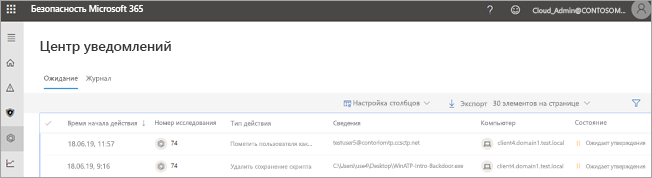
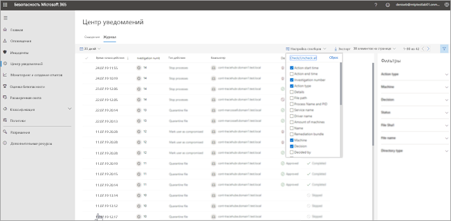
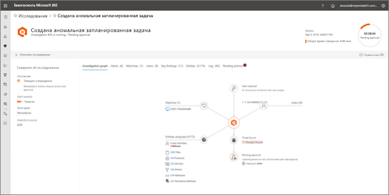

# Переход в центр уведомлений для просмотра действий по исправлению

**Область применения:**
- Защита от угроз (Майкрософт)

[!INCLUDE [Prerelease information](../includes/prerelease.md)]

## Интерфейс "единой области представления"

Используйте центр уведомлений для просмотра результатов текущего и прошлых исследований в почтовых ящиках и устройствах вашей организации. В зависимости от типа угрозы и [итогового вывода](mtp-autoir-results.md#remediation-actions-following-automated-investigation) действия по исправлению выполняются автоматически или после утверждения группой операций по безопасности вашей организации. Все действия по исправлению (как ожидающие утверждения, так и утвержденные) объединяются в центре уведомлений. 

В центре уведомлений доступен интерфейс "единой области представления" для задач, таких как:
- утверждение ожидающих действий по исправлению;
- просмотр журнала аудита утвержденных действий по исправлению; и
- проверка выполненных действий по исправлению.

Ваша группа операций по безопасности может работать эффективнее благодаря наличию в центре уведомлений комплексного представления защиты от угроз (Майкрософт) в работе.

## Действия по исправлению

В следующей таблице перечислены действия по исправлению, поддерживаемые в настоящее время в центре уведомлений. 

|Действия по исправлению для конечных точек  |Действия по исправления для электронной почты  |
|---------|---------|
|Файл карантина Удаление раздела реестра Прекращение процесса  Остановка службы  Удаление раздела реестра  Отключение драйвера  Удаление запланированной задачи      |Обратимое удаление сообщений электронной почты или кластеров Блокирование URL-адреса (во время щелчка) Отключение внешней переадресации почты          |

## Переход в центр уведомлений

1. Перейдите на страницу [https://security.microsoft.com](https://security.microsoft.com) и войдите. 

2. В панели навигации щелкните **Центр уведомлений**. 

3. В центре уведомлений отображаются две вкладки: **Ожидание** и **Журнал**.

    - На вкладке **Ожидание** перечислены исследования, требующие проверки и утверждения участником группы операций по безопасности для продолжения процесса. Обязательно просмотрите ожидающие элементы, представленные здесь, и выполните соответствующие действия.

    - На вкладке **Журнал** перечислены прошлые исследования и действия по исправлению, выполненные автоматически. Вы можете просматривать данные за последний день, неделю, месяц или шесть месяцев.

4. Чтобы отобразить только нужные столбцы, выберите команду **Настроить столбцы**. 

5. Выберите элемент в списке, чтобы просмотреть дополнительные сведения об исследовании. Откроется представление со сведениями об исследовании. 

    - Если исследование относится к контенту электронной почты (например, объектом является почтовый ящик), сведения об исследовании откроются в Центре безопасности и соответствия требованиям Office 365 ([https://protection.office.com/threatinvestigation](https://protection.office.com/threatinvestigation)). 

    - Если исследование затрагивает устройство, сведения об исследовании откроются в Центре безопасности ([https://security.microsoft.com](https://security.microsoft.com)). 

## Обязательные разрешения для задач центра уведомлений

Чтобы утвердить или отклонить ожидающие действия в центре уведомлений, вам должны быть назначены разрешения, указанные в следующей таблице.

|Действие по исправлению |Обязательные роли и разрешения |
|--|----|
|Исправление в Microsoft Defender ATP (устройства) |Роль **администратора безопасности**, назначенная в Azure Active Directory ([https://portal.azure.com](https://portal.azure.com)) или Центре администрирования Microsoft 365 ([https://admin.microsoft.com](https://admin.microsoft.com)) --- или --- Роль **Активные действия по исправлению**, назначенная в Microsoft Defender ATP     Для получения дополнительных сведений ознакомьтесь с приведенными ниже ресурсами.  - [Разрешения роли администратора в Azure Active Directory](https://docs.microsoft.com/azure/active-directory/users-groups-roles/directory-assign-admin-roles) - [Создание ролей и управление ими для контроля доступа на основе ролей (Microsoft Defender ATP)](https://docs.microsoft.com/windows/security/threat-protection/microsoft-defender-atp/user-roles)  |
|Исправление в Office 365 ATP (почта и содержимое Office)  |Роль **администратора безопасности**, назначенная в Azure Active Directory ([https://portal.azure.com](https://portal.azure.com)) или Центре администрирования Microsoft 365 ([https://admin.microsoft.com](https://admin.microsoft.com)) --- и ---  Роль **Поиск и очистка**, назначенная в Центре безопасности и соответствия требованиям Office 365 ([https://protection.office.com](https://protection.office.com))   **ВАЖНО!** Если роль администратора безопасности назначена вам только в Центре безопасности и соответствия требованиям Office 365, вы не сможете получить доступ к центру уведомлений и функциям защиты от угроз (Майкрософт). У вас должна быть роль администратора безопасности, назначенная в Azure Active Directory или Центре администрирования Microsoft 365.   Для получения дополнительных сведений ознакомьтесь с приведенными ниже ресурсами.  - [Разрешения роли администратора в Azure Active Directory](https://docs.microsoft.com/azure/active-directory/users-groups-roles/directory-assign-admin-roles) - [Разрешения в Центре безопасности и соответствия требованиям Office 365](https://docs.microsoft.com/microsoft-365/security/office-365-security/permissions-in-the-security-and-compliance-center) |

> [!NOTE]
> Пользователи, которым назначена роль **Глобальный администратор** в Azure Active Directory, могут утвердить или отклонить любые ожидающие действия в центре уведомлений. Однако рекомендуется ограничить в организации число пользователей, которым назначена роль глобального администратора. Рекомендуем использовать роли **Администратор безопасности**, **Активные действия по исправлению**, и **Поиск и очистка**, указанные выше, в качестве разрешений центра уведомлений.

## Дальнейшие действия 

- [Подробнее об инцидентах в службе защиты от угроз (Майкрософт)](incidents-overview.md)
- [Просмотр результатов автоматического исследования](mtp-autoir-results.md)
- [Сведения о выслеживании в службе защиты от угроз (Майкрософт)](advanced-hunting-overview.md)

