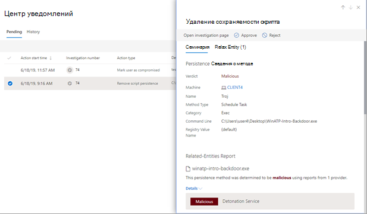

# Утверждение или отклонение ожидающих действий после автоматического исследованияApprove or reject pending actions following an automated investigation

[!INCLUDE [Microsoft 365 Defender rebranding](../includes/microsoft-defender.md)]

**Область применения:****Applies to:**
- Microsoft 365 DefenderMicrosoft 365 Defender

При выполнении автоматического анализа угроз может возникать одно или несколько [действий по исправлению](https://docs.microsoft.com/microsoft-365/security/mtp/mtp-remediation-actions), для которых требуется утверждение.When an automated investigation runs, it can result in one or more [remediation actions](https://docs.microsoft.com/microsoft-365/security/mtp/mtp-remediation-actions) that require approval to proceed. Например, может потребоваться удалить кластер сообщений электронной почты или файл из карантина.For example, a cluster of email messages might need to be deleted, or a quarantined file might need to be removed. Необходимо как можно скорее утвердить (или отклонить) ожидающие выполнения действия, чтобы автоматизированный анализ угроз мог продолжить работу и своевременно завершить ее.It's important to approve (or reject) pending actions as soon as possible so that your automated investigations can proceed and complete in a timely manner. 

> [!TIP]
> Если вы считаете, что функции автоматического исследования и реагирования в Защитнике Microsoft 365 что-то было пропущено или неправильно обнаружено, дайте нам знать!If you think something was missed or wrongly detected by automated investigation and response features in Microsoft 365 Defender, let us know! Узнайте, как сообщать о ложных срабатываах и отрицательных результатах в автоматизированных исследованиях и [ответах (AIR) в Microsoft 365 Defender.](mtp-autoir-report-false-positives-negatives.md)See [How to report false positives/negatives in automated investigation and response (AIR) capabilities in Microsoft 365 Defender](mtp-autoir-report-false-positives-negatives.md).

Ожидающих действий можно просмотреть и утвердить с помощью Центра действий [или](#review-a-pending-action-in-the-action-center) представления [сведений об анализе.](#review-a-pending-action-in-the-investigation-details-view)Pending actions can be reviewed and approved by using the [Action center](#review-a-pending-action-in-the-action-center) or the [investigation details view](#review-a-pending-action-in-the-investigation-details-view).

> [!NOTE]
> Чтобы утвердить или отклонить действия по исправлению, необходимы [соответствующие разрешения](mtp-action-center.md#required-permissions-for-action-center-tasks).You must have [appropriate permissions](mtp-action-center.md#required-permissions-for-action-center-tasks) to approve or reject remediation actions. Дополнительные сведения см. в предварительных условия для автоматического исследования и реагирования [в Microsoft 365 Defender.](mtp-configure-auto-investigation-response.md#prerequisites-for-automated-investigation-and-response-in-microsoft-365-defender)For more information, see [Prerequisites for automated investigation and response in Microsoft 365 Defender](mtp-configure-auto-investigation-response.md#prerequisites-for-automated-investigation-and-response-in-microsoft-365-defender).

## Просмотр ожидающего действия в центре уведомленийReview a pending action in the Action center

1. Перейдите на страницу [https://security.microsoft.com](https://security.microsoft.com) и войдите.Go to [https://security.microsoft.com](https://security.microsoft.com) and sign in. 

2. В панели навигации щелкните **Центр уведомлений**.In the navigation pane, choose **Action center**. 

3. В центре уведомлений на вкладке **Ожидание** выберите элемент в списке.In the Action Center, on the **Pending** tab, select an item in the list. 

    - При выборе элемента в столбце **Номер анализа** откроется страница сведений об анализе угроз.If you select an item in the **Investigation number** column, the investigation details page opens. На ней вы можете просмотреть результаты анализа угроз и утвердить или отклонить рекомендуемое действие.There, you can view the results of the investigation, and then either approve or reject the recommended action.
 
    - При выборе строки в списке откроется всплывающее окно, в котором можно просмотреть сведения об этом элементе.If you select a row in the list, a flyout opens, where you can view information about that item.   Используйте ссылки для просмотра связанного предупреждения или анализа, а также для утверждения или отклонения действия.Use the links to view an associated alert or an investigation, and approve or reject the action.

## Просмотр ожидающего действия в представлении со сведениями об анализе угрозReview a pending action in the investigation details view

1. На странице [сведений анализа](mtp-autoir-results.md) выберите вкладку **Ожидающие действия** (или **Действия**). Здесь перечислены элементы, ожидающие утверждения.On an [investigation details](mtp-autoir-results.md) page, select the **Pending actions** (or **Actions**) tab. Items that are pending approval are listed here.

2. Выберите элемент в списке, а затем выберите **утвердить** или **отклонить**.Select an item in the list, and then choose **Approve** or **Reject**.

## Отмена завершенных действийUndo completed actions

Если вы определили, что устройство или файл не являются угрозой, вы можете отменить предпринятые действия по исправлению, независимо от того, были ли эти действия предприняты автоматически или вручную.If you’ve determined that a device or a file is not a threat, you can undo remediation actions that were taken, whether those actions were taken automatically or manually. В центре действий на вкладке **"История"** можно отменить любое из следующих действий:In the Action center, on the **History** tab, you can undo any of the following actions:  

| Источник действияAction source | Поддерживаемые действияSupported Actions |
|:---|:---|
| - Автоматизированное исследование- Automated investigation  - Антивирусная программа "Microsoft Defender"- Microsoft Defender Antivirus  - Действия ответа вручную- Manual response actions | - Изолировать устройство- Isolate device  - Ограничить выполнение кода- Restrict code execution  - Карантин файла- Quarantine a file  - Удаление ключа реестра- Remove a registry key  - Остановка службы- Stop a service  - Отключить драйвер- Disable a driver  - Удалить запланированную задачу- Remove a scheduled task |

### Отмена действия по исправлениюTo undo a remediation action

1. Перейдите в центр действий [https://security.microsoft.com/action-center](https://security.microsoft.com/action-center) () и войдите в нее.Go to the Action center ([https://security.microsoft.com/action-center](https://security.microsoft.com/action-center)) and sign in.

2. На **вкладке "История"** выберите действие, которое нужно отменить.On the **History** tab, select an action that you want to undo.

3. В области в правой части экрана выберите **"Отменить".**In the pane on the right side of the screen, select **Undo**.

### Удаление файла из карантина на нескольких устройствахTo remove a file from quarantine across multiple devices 

1. Перейдите в центр действий [https://security.microsoft.com/action-center](https://security.microsoft.com/action-center) () и войдите в нее.Go to the Action center ([https://security.microsoft.com/action-center](https://security.microsoft.com/action-center)) and sign in.

2. На **вкладке "История"** выберите файл с типом действия **"Карантин".**On the **History** tab, select a file that has the Action type **Quarantine file**.

3. В области в правой части экрана выберите "Применить к **X"** дополнительных экземпляров этого файла, а затем выберите **"Отменить".**In the pane on the right side of the screen, select **Apply to X more instances of this file**, and then select **Undo**.

## Дальнейшие действияNext steps

- [Просмотр сведений и результатов автоматического исследованияView the details and results of an automated investigation](mtp-autoir-results.md)
- [Обработка ложных срабатывавай и отрицательных результатов в автоматизированном расследовании и реагировании на нихHandle false positives/negatives in automated investigation and response capabilities](mtp-autoir-report-false-positives-negatives.md)
