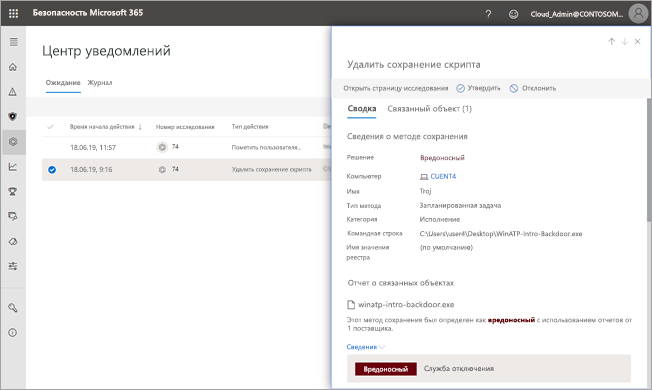

# Примите или отклоните запрос на ожидающие действия от автоматизированных анализов угроз

**Область применения:**
- Защита от угроз (Майкрософт)

[!INCLUDE [Prerelease information](../includes/prerelease.md)]

При выполнении автоматического анализа угроз может возникать одно или несколько [действий по исправлению](mtp-action-center.md#remediation-actions), для которых требуется утверждение. Например, может потребоваться удалить кластер сообщений электронной почты или файл из карантина. Необходимо как можно скорее утвердить (или отклонить) ожидающие выполнения действия, чтобы автоматизированный анализ угроз мог продолжить работу и своевременно завершить ее. 

Ожидающие выполнения действия могут быть проверены и утверждены с помощью одного из следующих способов:
- [через центр уведомлений](#review-a-pending-action-in-the-action-center)
- [через представление со сведениями об анализе угроз](#review-a-pending-action-in-the-investigation-details-view)

> [!NOTE]
> Чтобы утвердить или отклонить действия по исправлению, необходимы [соответствующие разрешения](mtp-action-center.md#required-permissions-for-action-center-tasks).

## Просмотр ожидающего действия в центре уведомлений

1. Перейдите на страницу [https://security.microsoft.com](https://security.microsoft.com) и войдите. 

2. В панели навигации щелкните **Центр уведомлений**. 

3. В центре уведомлений на вкладке **Ожидание** выберите элемент в списке. 

    - При выборе элемента в столбце **Номер анализа** откроется страница сведений об анализе угроз. На ней вы можете просмотреть результаты анализа угроз и утвердить или отклонить рекомендуемое действие.
 
    - При выборе строки в списке откроется всплывающее окно, в котором можно просмотреть сведения об этом элементе.   Используйте ссылки для просмотра связанного предупреждения или анализа, а также для утверждения или отклонения действия.

## Просмотр ожидающего действия в представлении со сведениями об анализе угроз

1. На странице [сведений анализа](mtp-autoir-results.md) выберите вкладку **Ожидающие действия** (или **Действия**). Здесь перечислены элементы, ожидающие утверждения.

2. Выберите элемент в списке, а затем выберите **утвердить** или **отклонить**.

## Дальнейшие действия

- [Дополнительные сведения о центре уведомлений](mtp-action-center.md)
- [Дополнительные сведения об инцидентах](incidents-overview.md)
- [Сведения об охоте на угрозы](advanced-hunting-overview.md)
