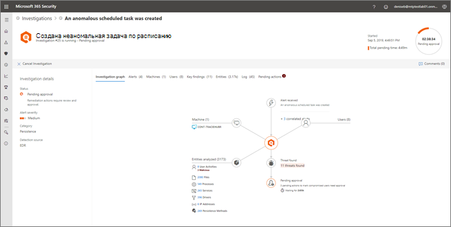
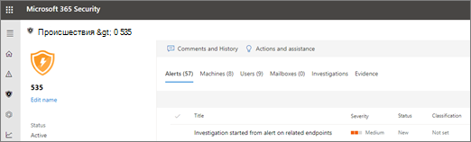

# Просмотр сведений и результатов автоматического исследования

**Область применения:**
- Защита от угроз (Майкрософт)

[!INCLUDE [Prerelease information](../includes/prerelease.md)]

При проведении автоматического исследования в службе защиты от угроз (Майкрософт) сведения о нем доступны во время и после автоматического исследования. Если у вас есть [необходимые разрешения](mtp-action-center.md#required-permissions-for-action-center-tasks), вы можете просмотреть эти подробности в представлении со сведениями об исследовании. В представлении со сведениями об исследовании содержится актуальное состояние и можно утвердить ожидающие действия. 

## Открытие представления со сведениями об исследовании

Чтобы открыть представление со сведениями об исследовании, можно использовать один из указанных ниже способов.
- [Выбор элемента в центре уведомлений](#select-an-item-in-the-action-center)
- [Выбор исследования на странице сведений об инциденте](#open-an-investigation-from-an-incident-details-page)

### Выбор элемента в центре уведомлений

В центре уведомлений можно просмотреть действия, ожидающие утверждения (на вкладке **Ожидание**), или утвержденные действия (на вкладке **Журнал**). 

1. Перейдите на страницу [https://security.microsoft.com](https://security.microsoft.com) и войдите. 

2. В панели навигации щелкните **Центр уведомлений**. 

3. На вкладке **Ожидание** или **Журнал** выберите элемент. Если у вас есть [необходимые разрешения](mtp-action-center.md#required-permissions-for-action-center-tasks), вы можете утвердить (или отклонить) ожидающие действия.

### Открытие исследования на странице сведений об инциденте

На странице сведений об инциденте можно просмотреть подробные сведения об инциденте, включая инициированные предупреждения с информацией о любых затрагиваемых устройствах, учетных записях пользователей и почтовых ящиках.

1. Перейдите на страницу [https://security.microsoft.com](https://security.microsoft.com) и войдите. 

2. В панели навигации щелкните **Инциденты**. 

3. Выберите элемент в списке, чтобы открыть представление со сведениями об инциденте. 

4. На вкладке **Исследования** выберите исследование из списка.

## Сведения об исследовании

В представлении со сведениями об исследовании можно просмотреть прошлые, текущие и ожидающие действия, относящиеся к исследованию. Представление со сведениями об исследовании выглядит примерно так:

В представлении со сведениями об исследовании можно просмотреть информацию на вкладках **Граф исследования**, **Оповещения**, **Устройства**, **Удостоверения**, **Основные выводы**, **Объекты**, **Журнал** и **Ожидающие выполнения действия**, описанные в следующей таблице.

|Вкладка    |Описание |
|--------|--------|
|Граф исследования    |Визуальное представление исследования. Описывает сущности и перечисляет обнаруженные угрозы, содержит оповещения и указывает на наличие действий, ожидающих утверждения. Для просмотра дополнительных сведений можно щелкнуть элемент на диаграмме. Например, щелкнув значок **Обнаруженные угрозы** вы перейдете на вкладку **Основные выводы**. |
|Оповещения |Содержит список оповещений, связанных с исследованием. Оповещения могут поступать из функций защиты от угроз на компьютере пользователя, приложений Office, Cloud App Security и других компонентов защиты от угроз в Microsoft 365.|
|Устройства|Содержит список компьютеров, включенных в исследование, а также уровень исправления.|
|Основные выводы   |Содержит список результатов исследования, а также состояние и выполненные или ожидающие действия. На этой вкладке можно утвердить ожидающие действия для устройств и удостоверений.|
|Объекты   |Содержит список действий пользователей, файлов, процессов, служб, драйверов, IP-адресов и методов сохранения, связанных с исследованием, а также состояние и выполненные действия.|
|Журнал    |Содержите подробное представление всех действий, выполненных в ходе исследования, и сведения о состоянии.|
|Ожидающие выполнения действия    |Содержит список элементов, требующих утверждения для продолжения.|

## Действия по исправлению после автоматического исследования

После завершения автоматического исследования дается заключение по каждому рассмотренному свидетельству и определяются действия по исправлению. В некоторых случаях действия по исправлению выполняются автоматически. В других случаях действия по исправлению ожидают утверждения. В таблице ниже перечислены возможные заключения и результаты.

|Заключение    |Область   |Результаты|
|------|------|------|
|Вредоносные  |Устройства (конечные точки)    |Действия по исправлению выполняются автоматически|
|Вредоносные  |Содержимое электронной почты (URL-адреса или вложения) | Рекомендуемые действия по исправлению ожидают утверждения|
|Подозрительные |Устройства или содержимое электронной почты |Рекомендуемые действия по исправлению ожидают утверждения|
|Чистые  |Устройства или содержимое электронной почты   |Действия по исправлению не требуются|

[Просмотр ожидающего действия в центре уведомлений](mtp-autoir-actions.md#review-a-pending-action-in-the-action-center)

> [!TIP]
> Если вы считаете, что что-то пошло не так или неправильно, с помощью автоматизированного расследования и функции ответа в Microsoft Threat Protection, сообщите нам о! Сведения о [том, как сообщить о ложных положительных и отрицательных значениях при автоматическом расследовании и возможностях реагирования (AIR) в защите от угроз Майкрософт](mtp-autoir-report-false-positives-negatives.md).

## Дальнейшие действия

- [Общие сведения о разрешениях центра уведомлений](mtp-action-center.md#required-permissions-for-action-center-tasks)
- [Утверждение или отклонение действий, относящихся к автоматизированному анализу угроз и реакции на них](mtp-autoir-actions.md)

