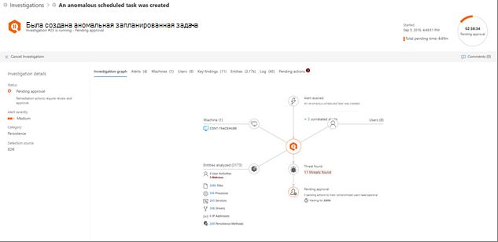

# Сведения и результаты автоматического исследования

[!INCLUDE [Microsoft 365 Defender rebranding](../includes/microsoft-defender.md)]

**Область применения:**
- Microsoft 365 Defender

При автоматическом расследовании в Microsoft 365 Defender подробные сведения об этом расследовании доступны во время и после автоматического расследования. Если у вас есть [необходимые разрешения](mtp-action-center.md#required-permissions-for-action-center-tasks), вы можете просмотреть эти подробности в представлении со сведениями об исследовании. В представлении со сведениями об исследовании содержится актуальное состояние и можно утвердить ожидающие действия. 

## Открытие представления со сведениями об исследовании

Чтобы открыть представление со сведениями об исследовании, можно использовать один из указанных ниже способов.
- [Выбор элемента в центре уведомлений](#select-an-item-in-the-action-center)
- [Выбор исследования на странице сведений об инциденте](#open-an-investigation-from-an-incident-details-page)

### Выбор элемента в центре уведомлений

В центре уведомлений можно просмотреть действия, ожидающие утверждения (на вкладке **Ожидание**), или утвержденные действия (на вкладке **Журнал**). 

1. Перейдите на страницу [https://security.microsoft.com](https://security.microsoft.com) и войдите. 

2. В панели навигации щелкните **Центр уведомлений**. 

3. На вкладке **Ожидание** или **Журнал** выберите элемент. Если у вас есть [необходимые разрешения](mtp-action-center.md#required-permissions-for-action-center-tasks), вы можете утвердить (или отклонить) ожидающие действия.

### Открытие исследования на странице сведений об инциденте

На странице сведений об инциденте можно просмотреть подробные сведения об инциденте, включая инициированные предупреждения с информацией о любых затрагиваемых устройствах, учетных записях пользователей и почтовых ящиках.

1. Перейдите на страницу [https://security.microsoft.com](https://security.microsoft.com) и войдите. 

2. В панели навигации щелкните **Инциденты**. 

3. Выберите элемент в списке, чтобы открыть представление со сведениями об инциденте. 

4. На вкладке **Исследования** выберите исследование из списка.

## Сведения об исследовании

В представлении со сведениями об исследовании можно просмотреть прошлые, текущие и ожидающие действия, относящиеся к исследованию. Представление со сведениями об исследовании выглядит примерно так:

В представлении со сведениями об исследовании можно просмотреть информацию на вкладках **Граф исследования**, **Оповещения**, **Устройства**, **Удостоверения**, **Основные выводы**, **Объекты**, **Журнал** и **Ожидающие выполнения действия**, описанные в следующей таблице.

| Вкладка | Описание |
|--------|--------|
| **Граф исследования**   | Визуальное представление исследования. Описывает сущности и перечисляет обнаруженные угрозы, содержит оповещения и указывает на наличие действий, ожидающих утверждения. Для просмотра дополнительных сведений можно щелкнуть элемент на диаграмме. Например, щелкнув значок **Обнаруженные угрозы** вы перейдете на вкладку **Основные выводы**. |
| **Alerts**    | Содержит список оповещений, связанных с исследованием. Оповещения могут исходить от функций защиты от угроз на компьютере пользователя, в приложениях Office, Cloud App Security и других функций Защитника Microsoft 365.|
| **Устройства** | Содержит список компьютеров, включенных в исследование, а также уровень исправления.|
| **Основные выводы**  | Содержит список результатов исследования, а также состояние и выполненные или ожидающие действия. На этой вкладке можно утвердить ожидающие действия для устройств и удостоверений.|
| **Entities**  | Содержит список действий пользователей, файлов, процессов, служб, драйверов, IP-адресов и методов сохранения, связанных с исследованием, а также состояние и выполненные действия.|
|**Log**    | Содержите подробное представление всех действий, выполненных в ходе исследования, и сведения о состоянии.|
| **Ожидающие выполнения действия** | Содержит список элементов, требующих утверждения для продолжения.|

## Дальнейшие действия:

- [Утверждение или отклонение действий, относящихся к автоматизированному анализу угроз и реакции на угрозы](mtp-autoir-actions.md)
- [Проверка действий по исправлению](mtp-remediation-actions.md)
