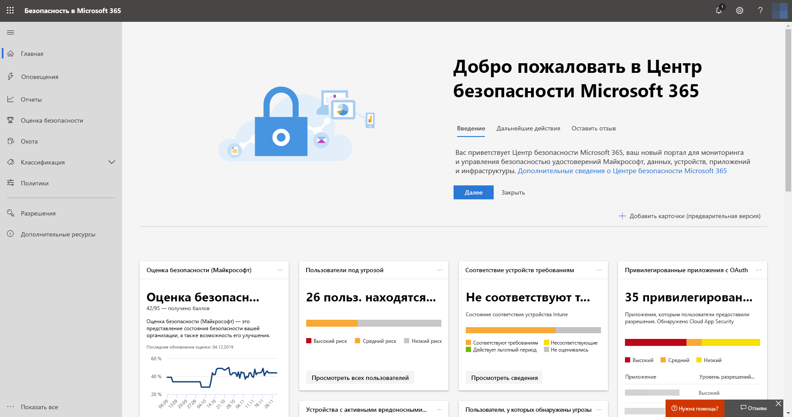
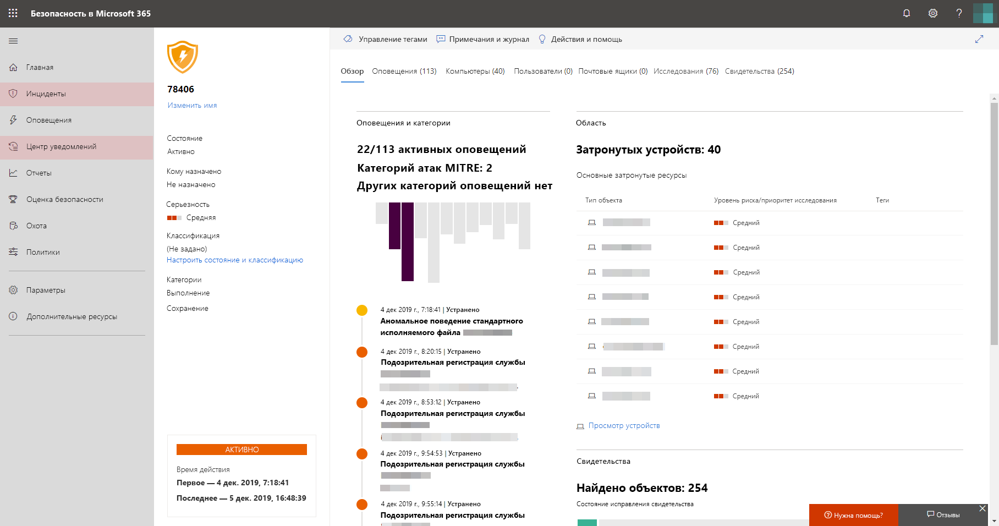

# Включение Защиты от угроз (Майкрософт)Turn on Microsoft Threat Protection

**Область применения:****Applies to:**
- Защита от угроз (Майкрософт)Microsoft Threat Protection

[!INCLUDE [Prerelease information](../includes/prerelease.md)]

Защита от угроз (Майкрософт) объединяет процесс реагирования на инциденты, интегрируя основные возможности Advanced Threat Protection (ATP) в Microsoft Defender, Office 365 ATP, Microsoft Cloud App Security и Azure ATP.Microsoft Threat Protection unifies your incident response process by integrating key capabilities across Microsoft Defender Advanced Threat Protection (ATP), Office 365 ATP, Microsoft Cloud App Security, and Azure ATP. В этом едином интерфейсе добавлены мощные функции, к которым можно получить доступ в Центре безопасности Майкрософт 365.This unified experience adds powerful features you can access in the Microsoft 365 security center.

## Проверка правомочностиCheck your eligibility
Защиту от угроз (Майкрософт) могут использовать клиенты, у которых есть лицензия Microsoft 365 E5 или аналогичная лицензия. Customers with a Microsoft 365 E5 or equivalent license can use Microsoft Threat Protection. Дополнительные сведения см. в статье [Требования к лицензированию](prerequisites.md#licensing-requirements).For more information, [read the licensing requirements](prerequisites.md#licensing-requirements).

## Начало работы со службойStart using the service
Включение службы Защиты от угроз (Майкрософт) объединяет данные из различных интегрированных служб.Turning on the Microsoft Threat Protection service aggregates data from the various integrated services. Данные будут обрабатываться и храниться централизованно, чтобы предоставить новые рекомендации и сделать возможными централизованные рабочие процессы реагирования.The data will be processed and stored centrally to identify new insights and to make centralized response workflows possible.

До включения службы параметры **Инциденты** и **Центр уведомлений** не отображаются в меню Центра безопасности Microsoft 365 ([security.microsoft.com](https://security.microsoft.com)).Before you turn the service on, Microsoft 365 security center ([security.microsoft.com](https://security.microsoft.com)) does not show the **Incidents** and the **Action center** options on the menu.

*Центр безопасности Microsoft 365 с отключенной службой Защиты от угроз (Майкрософт)*
*Microsoft 365 security center with Microsoft Threat Protection turned off*

Чтобы включить службу Защиты от угроз (Майкрософт), в Центре безопасности Microsoft 365 выберите **Параметры** > **Защита от угроз (Майкрософт)** > **Согласиться или отказаться**.To turn the Microsoft Threat Protection service on, go to **Settings** > **Microsoft Threat Protection** > **Opt-in / Opt-out** in the Microsoft 365 security center. Для выполнения этой задачи вам нужны права глобального администратора или администратора безопасности в [Azure Active Directory](https://docs.microsoft.com/azure/active-directory/users-groups-roles/directory-assign-admin-roles#available-roles).You will need to be a global administrator or a security administrator in [Azure Active Directory](https://docs.microsoft.com/azure/active-directory/users-groups-roles/directory-assign-admin-roles#available-roles) to perform this task.

Если для вашей организации подготовлена служба ATP в Microsoft Defender, данные будут храниться и обрабатываться в том же расположении центра обработки данных, которое вы выбрали для [данных ATP в Microsoft Defender](https://docs.microsoft.com/windows/security/threat-protection/microsoft-defender-atp/data-storage-privacy).If Microsoft Defender ATP has been provisioned for your organization, data will be stored and processed in the same data center location you have selected for [your Microsoft Defender ATP data](https://docs.microsoft.com/windows/security/threat-protection/microsoft-defender-atp/data-storage-privacy). В противном случае вам будет предложено выбрать новое расположение центра обработки данных для Защиты от угроз (Майкрософт).If you don't have Microsoft Defender ATP, you will be asked to choose a new data center location specifically for Microsoft Threat Protection. Согласие необходимо дать до предоставления службам общего доступа к данным и их агрегации.You will need to provide consent before data is shared between services and aggregated.

### Подтверждение включения службыConfirm that the service is on
После подготовки службы в нее добавляются:Once the service is provisioned, it adds:

- [Управление инцидентамиIncidents management](incidents-overview.md)
- Центр уведомлений для управления службой [Автоматического анализа угроз и защиты от атак](mtp-autoir.md)An action center for managing [automated investigation and response](mtp-autoir.md)
- Возможности [расширенного поиска](advanced-hunting-overview.md) на существующей странице **Поиск**[Advanced hunting](advanced-hunting-overview.md) capabilities to the existing **Hunting** page

*Центр безопасности Microsoft 365 с возможностью управления инцидентами и другими функциями Защиты от угроз (Майкрософт)*
*Microsoft 365 security center with incidents management and other Microsoft Threat Protection features*

### Получение данных Azure ATPGetting Azure ATP data
Чтобы предоставить доступ к данным Azure ATP службе Защиты от угроз (Майкрософт), убедитесь в том, что включена интеграция Microsoft Cloud App Security с Azure ATP.To share Azure ATP data with Microsoft Threat Protection, ensure that Microsoft Cloud App Security and Azure ATP integration is turned on. [Подробнее об этой интеграцииLearn more about this integration](https://docs.microsoft.com/cloud-app-security/aatp-integration)

## Выключение Защиты от угроз (Майкрософт)Turn off Microsoft Threat Protection
Чтобы прекратить использование службы Защиты от угроз (Майкрософт), в Центре безопасности Microsoft 365 выберите **Параметры** > **Защита от угроз (Майкрософт)** > **Согласиться или отказаться**.To stop using Microsoft Threat Protection, go to **Settings** > **Microsoft Threat Protection** > **Opt-in / Opt-out** in the Microsoft 365 security center. Снимите флажок **Включение Защиты от угроз (Майкрософт)** и сохраните изменения.Unselect **Turn on Microsoft Threat Protection** and save the changes.

Данные будут удалены без возможности восстановления, и соответствующие функции будут удалены из Центра безопасности Microsoft 365.Data will be permanently deleted and corresponding features will be removed from Microsoft 365 security center.

## Получение помощиGet assistance

Сотрудники Майкрософт могут помочь в подготовке или отмене подготовки службы и связанных ресурсов в клиенте.Microsoft staff can help provision or deprovision the service and related resources on your tenant. Чтобы получить помощь, [обратитесь в службу поддержки Premier](https://go.microsoft.com/fwlink/?LinkID=733758).For assistance, [contact premier support](https://go.microsoft.com/fwlink/?LinkID=733758).

## См. такжеRelated topics

- [Обзор Защиты от угроз (Майкрософт)Microsoft Threat Protection overview](microsoft-threat-protection.md)
- [Требования к лицензированию и другие предварительные требованияLicensing requirements and other prerequisites](prerequisites.md)
- [Обзор ATP в Microsoft DefenderMicrosoft Defender ATP overview](https://docs.microsoft.com/windows/security/threat-protection/microsoft-defender-atp/microsoft-defender-advanced-threat-protection)
- [Обзор Office 365 ATPOffice 365 ATP overview](../office-365-security/office-365-atp.md)
- [Обзор Microsoft Cloud App SecurityMicrosoft Cloud App Security overview](https://docs.microsoft.com/cloud-app-security/what-is-cloud-app-security)
- [Обзор Azure ATPAzure ATP overview](https://docs.microsoft.com/azure-advanced-threat-protection/what-is-atp)
- [Хранение данных в службе ATP в Microsoft DefenderMicrosoft Defender ATP data storage](https://docs.microsoft.com/windows/security/threat-protection/microsoft-defender-atp/data-storage-privacy)
