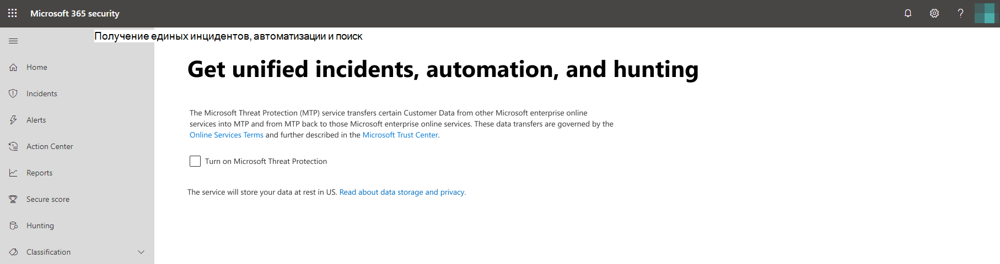

# Включение Защиты от угроз (Майкрософт)

**Область применения:**
- Защита от угроз (Майкрософт)

[Защита от угроз Майкрософт](microsoft-threat-protection.md) объединяет ваш процесс реагирования на инциденты за счет интеграции основных возможностей в Advanced Threat protection (ATP), Office 365 ATP, Microsoft Cloud App Security и Azure ATP. В этом едином интерфейсе добавлены мощные функции, к которым можно получить доступ в Центре безопасности Майкрософт 365.

Защита от угроз Майкрософт автоматически включается, когда пользователи с необходимыми разрешениями могут посетить центр безопасности Microsoft 365. В этой статье приводятся сведения о различных предварительных требованиях и способах подготовки системы защиты от угроз Майкрософт.

## Проверка допустимости лицензий и необходимых разрешений
Лицензия на продукт Microsoft 365 Security обычно дает вам возможность использовать защиту от угроз Майкрософт в центре безопасности Майкрософт 365 без дополнительной стоимости лицензирования. Мы рекомендуем получить лицензию безопасности Microsoft 365, а также лицензию, A5 или A5 или действительную комбинацию лицензий, предоставляющую доступ ко всем поддерживаемым службам.

Для получения подробных сведений о лицензировании [Прочтите требования к лицензированию](prerequisites.md#licensing-requirements).

### Проверка роли
Чтобы включить защиту от угроз Майкрософт, необходимо быть **глобальным администратором** или **администратором безопасности** в Azure Active Directory. [Просмотр ролей в Azure AD](https://docs.microsoft.com//azure/active-directory/users-groups-roles/directory-manage-roles-portal)

## Поддерживаемые службы
Защита от угроз Майкрософт собирает данные из различных поддерживаемых служб, которые вы уже развернули. Он будет обрабатывать и хранить данные централизованно, чтобы определять новые аналитики и создавать централизованные рабочие процессы ответа. Это происходит, не затрагивая существующие развертывания, параметры или данные, связанные со встроенными службами.

Чтобы получить лучшую защиту и оптимизировать защиту от угроз Майкрософт, мы рекомендуем развернуть все поддерживаемые службы в сети. Для получения дополнительных сведений [Ознакомьтесь с разворачиванием поддерживаемых служб](deploy-supported-services.md).

## Перед запуском службы
Перед включением службы центр безопасности Microsoft 365 ([Security.Microsoft.com](https://security.microsoft.com)) отображает страницу параметров защиты от угроз Майкрософт при выборе **инцидентов**, **центра уведомлений** **или поиска** в области навигации. Эти элементы навигации не отображаются, если вы не можете использовать защиту от угроз Майкрософт.

 *в центре безопасности Microsoft 365* .

## Запуск службы
Чтобы включить защиту от угроз Майкрософт, просто выберите **включить защиту от угроз Майкрософт** и примените изменение. Вы также можете получить доступ к этому параметру, выбрав **Параметры** ([Security.Microsoft.com/Settings](https://security.microsoft.com/settings)) в области навигации, а затем выбрав **защиту от угроз Майкрософт**.

>[!NOTE]
>Если вы не видите **Параметры** в области навигации или не смогли получить доступ к странице, проверьте свои разрешения и лицензии.

### Расположение центра обработки данных
Защита от угроз Майкрософт будет хранить и обрабатывать данные в том [же расположении, что и пакет ATP для защитника Майкрософт](https://docs.microsoft.com/windows/security/threat-protection/microsoft-defender-atp/data-storage-privacy). Если у вас нет пакета ATP для защитника Майкрософт, автоматически выбирается новое расположение центра обработки данных на основе расположения активных служб безопасности Microsoft 365. Выбранное расположение центра обработки данных отображается на экране.

>[!NOTE]
>Выберите пункт **нужна помощь?** в центре безопасности Майкрософт 365, чтобы обратиться в службу поддержки Майкрософт о подготовке защиты от угроз Майкрософт в другое расположение центра обработки данных. 

### Подтверждение включения службы
После подготовки службы в нее добавляются:

- [Управление инцидентами](incidents-overview.md)
- Центр уведомлений для управления службой [Автоматического анализа угроз и защиты от атак](mtp-autoir.md)
- [Расширенные](advanced-hunting-overview.md) возможности поисковых

 *Центр безопасности Microsoft 365 с возможностью управления происшествиями и другими возможностями защиты от угроз Майкрософт*

### Получение данных Azure ATP
Чтобы предоставить доступ к данным Azure ATP службе Защиты от угроз (Майкрософт), убедитесь в том, что включена интеграция Microsoft Cloud App Security с Azure ATP. [Подробнее об этой интеграции](https://docs.microsoft.com/cloud-app-security/aatp-integration)

## Выключение Защиты от угроз (Майкрософт)
Чтобы прекратить использование службы Защиты от угроз (Майкрософт), в Центре безопасности Microsoft 365 выберите **Параметры** > **Защита от угроз (Майкрософт)** > **Согласиться или отказаться**. Снимите флажок **включить защиту от угроз Майкрософт** и примените изменения.

Соответствующие функции будут удалены из центра безопасности Microsoft 365.

## Получение помощи

Чтобы получить ответы на часто задаваемые вопросы о включении защиты от угроз Майкрософт, [прочитайте вопросы и ответы](mtp-enable-faq.md).

Сотрудники службы поддержки Майкрософт могут помочь подготовить или отменить подготовку службы и связанных ресурсов в клиенте. Для получения помощи выберите **нужна помощь?** в центре безопасности Майкрософт 365. При обращении в службу поддержки следует упомянуть о защите от угроз Майкрософт.

## Связанные статьи

- [Вопросы и ответы](mtp-enable-faq.md)
- [Требования к лицензированию и другие предварительные требования](prerequisites.md)
- [Развертывание поддерживаемых служб](deploy-supported-services.md)
- [Обзор Защиты от угроз (Майкрософт)](microsoft-threat-protection.md)
- [Обзор ATP в Microsoft Defender](https://docs.microsoft.com/windows/security/threat-protection/microsoft-defender-atp/microsoft-defender-advanced-threat-protection)
- [Обзор Office 365 ATP](../office-365-security/office-365-atp.md)
- [Обзор Microsoft Cloud App Security](https://docs.microsoft.com/cloud-app-security/what-is-cloud-app-security)
- [Обзор Azure ATP](https://docs.microsoft.com/azure-advanced-threat-protection/what-is-atp)
- [Хранение данных в службе ATP в Microsoft Defender](https://docs.microsoft.com/windows/security/threat-protection/microsoft-defender-atp/data-storage-privacy)