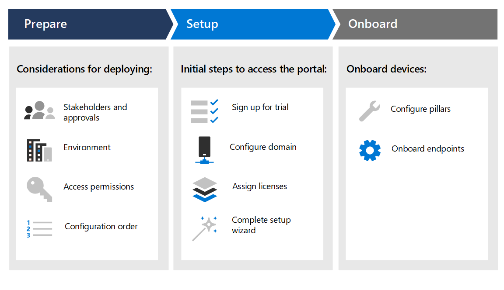

# Создание пробной или пилотной среды Microsoft 365 Defender 

[!INCLUDE [Microsoft 365 Defender rebranding](../includes/microsoft-defender.md)]

**Область применения:**
- Microsoft 365 Defender

Это руководство поможет вам при настройке лабораторной среды с пользователями и группами, а затем поможет вам с настройкой возможностей в Microsoft 365 Defender, чтобы можно было имитировать угрозы и получить осмысленный результат пробной проверки. 

Цель создания этой пробной лабораторной или пилотной среды — показать всесторонние и интегрированные возможности Защитника Microsoft 365. Изучите, как это интеллектуальное решение безопасности обнаруживает, предотвращает, автоматически исследует и реагирует на сложные угрозы в вашей организации. 

Вам будет порекомендоваться начать оценку Защитника Microsoft 365 на основе рекомендуемых путей развертывания. Цель состоит в том, чтобы помочь вам настроить решение для обеспечения безопасности в лабораторной среде с пробной учетной записью или в пилотной среде в производственной среде с полной лицензией. Подготовка пробной лабораторной или пилотной среды поможет вам представить дела использования операций безопасности для лиц, принимающих решения в вашей организации. После запуска имитации атаки и удовлетворены результатами, вы можете полностью развернуть и развернуть его в своей организации с помощью специалистов по техническому отделу продаж Майкрософт или экспертов в вашей организации. 

Это руководство поможет вам:
- Настройка сервера лаборатории и компьютеров
- Настройка Active Directory для пользователей и групп
- Настройка Microsoft Defender для удостоверений, Microsoft Defender для Office 365, Microsoft Defender для конечной точки и Microsoft Cloud App Security
- Настройка локальных политик для сервера и компьютеров
- Имитация атаки с угрозой для создания тестового инцидента или оповещения в Microsoft 365 Defender

>[!IMPORTANT]
>Для достижения оптимальных результатов следуйте инструкциям по лабораторной настройке как можно ближе.

## Этапы развертывания

Существует три этапа создания лабораторной среды пробной среды Microsoft 365 Defender.

|Этап | Описание | 
|:-------|:-----|
|[Этап 1. Подготовка](prepare-mtpeval.md)| Узнайте, что необходимо учитывать при развертывании Microsoft 365 Defender в тестовой или пилотной среде:   - Заинтересованные лица и выключите   - Вопросы среды  - Access  - Настройка Azure Active Directory   - Порядок настройки
|[Этап 2. Настройка](setup-mtpeval.md)|  Сначала необходимо получить доступ к Центру безопасности Microsoft 365, чтобы настроить пробную или пилотную среду Microsoft 365 Defender. Вы получите руководство по:  - Зарегистрироваться для пробной пробной пробной службы Microsoft 365 E5    - Настройка домена - Назначение лицензий Microsoft 365 E5 — Завершение работы мастера настройки на портале|
|[Этап 3. Настройка & в &](config-mtpeval.md) | Настройте каждую опору Защитника Microsoft 365 и конечные точки в составе службы. Вы получите руководство по:  - Настройка Microsoft Defender для Office 365 - Настройка Microsoft Cloud App Security - Настройка Microsoft Defender для удостоверений - Настройка Microsoft Defender для конечной точки

После завершения работы с этим руководством вы определили бы заинтересованных лиц и необходимые утверждения, получили бы необходимые разрешения на доступ, выполнили регистрацию в пробном составе, настроили домены и все опоры Защитника Microsoft 365, а конечные точки будут присоединены к службе.

## Ключевые возможности

Несмотря на то что Microsoft 365 Defender предоставляет множество возможностей, основное назначение этого руководства по развертыванию — начать работу с устройствами. В дополнение к введению, в этом руководстве вы можете начать работу со следующими возможностями.

Возможность | Описание 
:---|:---
Microsoft Defender для Office 365 | Помогает защитить весь процесс envrionment Office 365 от современных угроз
Microsoft Defender для удостоверений | Определяет и обнаруживает угрозы для скомпрометных удостоверений и вредоносных действий внутри программы.
Microsoft Cloud App Security | Обеспечивает богатые возможности видимости, контроля перемещения данных и обнаружения киберугроз в облачных службах.
Microsoft Defender для конечной точки | Предотвращает, обнаруживает и предоставляет возможности реагирования на сложные угрозы с комплексной безопасностью конечных точек.

## Область действия

Для данного руководства в области действия находятся следующие задачи:
-   Настройка Azure Active Directory
-   Настройка Защитника Microsoft 365
    -   Зарегистрируйся на пробной версией Microsoft 365 E5 или используйте полную лицензию, если вы используете пилотную версию
    -   Настройка домена
    -   Назначение лицензий Microsoft 365 E5
    -   Завершение работы мастера установки на портале
-   Настройка всех основ Защитника Microsoft 365 на основе практических методик
    -   Microsoft Defender для Office 365
    -   Microsoft Defender для удостоверений
    -   Microsoft Cloud App Security
    -   Microsoft Defender для конечной точки

## Вне области поддержки

Это руководство по развертыванию выходит за рамки следующих областей:

-   Настройка сторонних решений, которые могут интегрироваться с Microsoft 365 Defender
-   Тестирование проникновения в производственную среду

## Следующий шаг
[Этап 1. Подготовка](prepare-mtpeval.md) 
  Подготовка пробной или пилотной среды Microsoft 365 Defender
