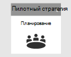
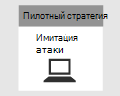
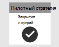

# Планирование пилотного проекта Microsoft 365 Defender 

[!INCLUDE [Microsoft 365 Defender rebranding](../includes/microsoft-defender.md)]

**Область применения:**
- Microsoft 365 Defender

| Планирование| [Предваритель](prepare-mtpeval.md) |  [Имитация атаки](mtp-pilot-simulate.md) |  [Закрытие и итоги](mtp-pilot-close.md)|
|--|--|--|--|
|*Вот что вам!*| | | |

В настоящее время вы находитесь на этапе планирования.

Чтобы убедиться, что пилотный проект является успешным, важно тщательно спланировать и получить утверждения от ваших заинтересованных лиц в начале. Элементы планирования включают идентифицирующие область, варианты использования, требования и критерии успеха.

В этом руководстве рассказывается, как спланировать пилотный проект. 

>[!IMPORTANT]
>Для достижения оптимальных результатов выполните пробные инструкции, как можно ближе.

## Область

Область пилотного проекта определяет, насколько широко будет использоваться тест, в зависимости от используемой среды и допустимых методов тестирования. Ниже приведено несколько примеров областей, которые необходимо рассмотреть.
- Среда разработки или тестирования, включающая конечные точки, серверы и контроллеры домена.
- Рабочая среда с Microsoft 365, Azure, службами Active Directory, конечными точками и серверами

>[!NOTE]
>Если у вас еще нет полных лицензий, вы можете получить пробные лицензии для [оценки защитника Microsoft 365](https://aka.ms/mtp-trial-lab) : планирование, подготовка, Настройка, Настройка и запуск пилотного проекта. Ваши заинтересованные лица играют значительную роль в упрощении процесса, начиная с начала и до конца.

Типы операционных систем, которые необходимо оценить, также следует определить на основе организации структура. Сюда могут относиться следующие: [конечные точки Mac](https://docs.microsoft.com/windows/security/threat-protection/microsoft-defender-atp/microsoft-defender-atp-mac#system-requirements), [Серверы Linux](https://docs.microsoft.com/windows/security/threat-protection/microsoft-defender-atp/microsoft-defender-atp-linux#system-requirements), [конечные точки windows 10](https://docs.microsoft.com/windows/security/threat-protection/microsoft-defender-atp/minimum-requirements#supported-windows-versions), [Windows Server 2016](https://docs.microsoft.com/windows/security/threat-protection/microsoft-defender-atp/minimum-requirements#supported-windows-versions).

## Варианты использования

Варианты использования представляют операторы того, как тестируемое средство предназначено для использования его назначенными пользователями. Их можно сформулировать как пользовательские описания функциональности с точки зрения определенного пользователя, например аналитика SOC. Например:
- Как аналитику SOC необходимо просмотреть, сопоставить, оценить и управлять оповещениями и событиями на устройствах, в сети и в почтовых ящиках. [Управление инцидентами]
- Как аналитику SOC, мне необходимо средство и процесс, чтобы автоматически исследовать вредоносные события в сети и реагировать на них. [Автоматический ИК-порт]
- Как аналитику SOC, я должен искать данные из моей среды, чтобы найти известные и потенциальные угрозы, а также подозрительные действия. [Расширенный поиск]

Помните, что эти варианты использования следует создавать в параметрах определенной области. Если, например, область тестирования не включает оценку таких средств, как Microsoft Cloud App Security, то не следует создавать варианты использования, основанные на этом качестве источника данных.

## Требования

В списке вариантов использования можно приступить к созданию требований. Требования включают функции, необходимые для удовлетворения вариантов использования. Эти требования можно разделить на категории, такие как настройка и обслуживание, поддержка интеграции и зависящие от функций требования, такие как возможность находить и возможность создания настраиваемых оповещений.

## План тестирования

В зависимости от требований могут быть приемлемы различные методы тестирования. Например, если необходимо оценить еффикаци автоматизированного исправления, план тестирования должен включать действия для создания поведения, которое вызывает автоматическое действие по исправлению в защитнике Microsoft 365. Если требуется определить конкретное поведение или атаку, то в тест могут потребоваться дополнительные действия. Точка состоит в том, чтобы создать план для тщательной проверки требований.

## Критерии успеха

Критерии успеха — это, в конечном счете, набор для измерения тестируемой области. Независимо от того, тестируется ли защитник Microsoft 365 (или любая другая технология по отношению к этому отношению) к другим средствам или само по себе, должно быть определено количественное условие для определения значения, предоставляемого средством. В зависимости от области, требований и плана тестирования критерии успешного выполнения определяют, как оценить тест. Это значение должно быть меньше или равно пройденному, и больше взвешенного показателя в соответствии с вашими потребностями. Например, для успешного выполнения средства может потребоваться вычислить оценку выше 80% в определенных критических областях.

## Систему

Один из способов объединения всех элементов плана можно создать систему показателей. Ниже приведен пример системы показателей.

| Вариант использования | Требования | Требования к конфигурации | План тестирования | Ожидаемый результат | Состояние тестирования | Оценка | Примечания |
|:-------|:-------|:-------|:-------|:-------|:-------|:-------|:-------|
|Управление инцидентами|— Защитник Microsoft 365    — Защитник Майкрософт для удостоверения   — Защитник Майкрософт для конечной точки   -Microsoft Cloud App Security (необязательно)|Сведения о [предварительных требованиях](https://aka.ms/mtp-trial-lab) к подготовке, настройке и настройке |[Имитация атаки](mtp-pilot-simulate.md)   [Исследование инцидента](https://docs.microsoft.com/microsoft-365/security/mtp/mtp-pilot-simulate#investigate-an-incident) |С помощью расследований можно оценить область и влияние инцидента и управлять инцидентом.||||
|аутоир|— Защитник Microsoft 365   — Защитник Майкрософт для удостоверения   — Защитник Майкрософт для конечной точки |Сведения о [предварительных требованиях](https://aka.ms/mtp-trial-lab) к подготовке, настройке и настройке  Включение Аутоир  |[Имитация атаки](mtp-pilot-simulate.md)   [Автоматическое исследование](https://docs.microsoft.com/microsoft-365/security/mtp/mtp-pilot-simulate.md#automated-investigation-and-remediation) |Оповещения и происшествия автоматически исправляются защитником Microsoft 365||||
|Расширенная охота на угрозы|— Защитник Microsoft 365   — Защитник Майкрософт для конечной точки   — Защитник Майкрософт для Office 365 |Сведения о [предварительных требованиях](https://aka.ms/mtp-trial-lab) к подготовке, настройке и настройке|[Сценарий расширенного подпоиска](https://docs.microsoft.com/microsoft-365/security/mtp/mtp-pilot-simulate.md#advanced-hunting-scenario) |Исследования могут находить данные с помощью расширенного поиска, сведение к затронутым сущностям и создание пользовательских обнаружений||||

## Следующий шаг
|  [Этап подготовки](prepare-mtpeval.md) | Подготовка пилотной среды защитника Microsoft 365
|:-------|:-----|
