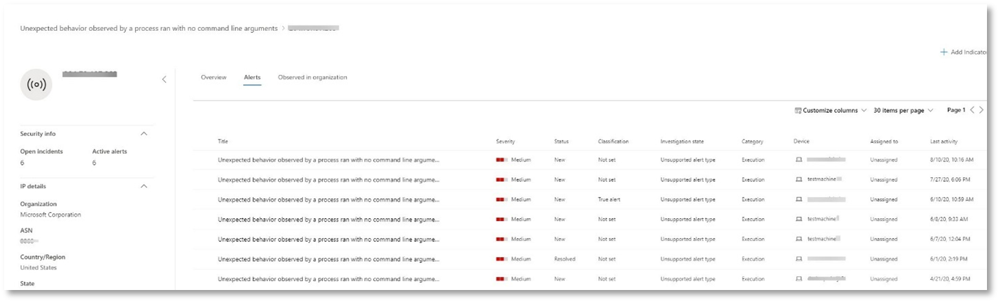

# <a name="run-your-microsoft-365-defender-attack-simulations"></a><span data-ttu-id="df1cf-104">Запуск имитации атак в Защитнике Microsoft 365</span><span class="sxs-lookup"><span data-stu-id="df1cf-104">Run your Microsoft 365 Defender attack simulations</span></span>

[!INCLUDE [Microsoft 365 Defender rebranding](../includes/microsoft-defender.md)]


|<span data-ttu-id="df1cf-105">[](mtp-pilot-plan.md)</span><span class="sxs-lookup"><span data-stu-id="df1cf-105">[](mtp-pilot-plan.md)</span></span><br/>[<span data-ttu-id="df1cf-106">Планирование</span><span class="sxs-lookup"><span data-stu-id="df1cf-106">Planning</span></span>](mtp-pilot-plan.md)|<span data-ttu-id="df1cf-107">[](prepare-mtpeval.md)</span><span class="sxs-lookup"><span data-stu-id="df1cf-107">[](prepare-mtpeval.md)</span></span><br/>[<span data-ttu-id="df1cf-108">Подготовка</span><span class="sxs-lookup"><span data-stu-id="df1cf-108">Preparation</span></span>](prepare-mtpeval.md)|<br/><span data-ttu-id="df1cf-110">Имитация атаки</span><span class="sxs-lookup"><span data-stu-id="df1cf-110">Simulate attack</span></span>|<span data-ttu-id="df1cf-111">[](mtp-pilot-close.md)</span><span class="sxs-lookup"><span data-stu-id="df1cf-111">[](mtp-pilot-close.md)</span></span><br/>[<span data-ttu-id="df1cf-112">Закрытие и итоги</span><span class="sxs-lookup"><span data-stu-id="df1cf-112">Close and summarize</span></span>](mtp-pilot-close.md)|
|--|--|--|--|
|||<span data-ttu-id="df1cf-113">*Вы здесь!*</span><span class="sxs-lookup"><span data-stu-id="df1cf-113">*You are here!*</span></span>||

<span data-ttu-id="df1cf-114">В настоящее время вы работаете на этапе моделирования атаки.</span><span class="sxs-lookup"><span data-stu-id="df1cf-114">You're currently in the attack simulation phase.</span></span>

<span data-ttu-id="df1cf-115">После подготовки пилотной среды необходимо протестировать управление инцидентами в Microsoft 365 Defender, а также автоматизированное исследование и исправление.</span><span class="sxs-lookup"><span data-stu-id="df1cf-115">After preparing your pilot environment, it's time to test the Microsoft 365 Defender incident management and automated investigation and remediation capabilities.</span></span> <span data-ttu-id="df1cf-116">Мы поможем вам смоделировать изощренную атаку, которая использует расширенные методы для скрытие от обнаружения.</span><span class="sxs-lookup"><span data-stu-id="df1cf-116">We'll help you to simulate a sophisticated attack that leverages advanced techniques to hide from detection.</span></span> <span data-ttu-id="df1cf-117">Атака нумерирует открытые сеансы SMB на контроллерах домена и извлекает последние IP-адреса устройств пользователей.</span><span class="sxs-lookup"><span data-stu-id="df1cf-117">The attack enumerates opened Server Message Block (SMB) sessions on domain controllers and retrieves recent IP addresses of users' devices.</span></span> <span data-ttu-id="df1cf-118">В эту категорию атак обычно не входят файлы, отброшенные на устройстве пострадавшего— они происходят исключительно в памяти.</span><span class="sxs-lookup"><span data-stu-id="df1cf-118">This category of attacks usually doesn't include files dropped on the victim's device—they occur solely in memory.</span></span> <span data-ttu-id="df1cf-119">Они "выжидают за свой счет", используя существующие системные и административные средства, и внедряют свой код в системные процессы, чтобы скрыть их выполнение. Такое поведение позволяет избежать обнаружения и сохраняемого на устройстве.</span><span class="sxs-lookup"><span data-stu-id="df1cf-119">They "live off the land" by using existing system and administrative tools and inject their code into system processes to hide their execution, Such behavior allows them to evade detection and persist on the device.</span></span>

<span data-ttu-id="df1cf-120">В этом моделировании пример сценария начинается со сценария PowerShell.</span><span class="sxs-lookup"><span data-stu-id="df1cf-120">In this simulation, our sample scenario starts with a PowerShell script.</span></span> <span data-ttu-id="df1cf-121">Пользователь может быть обманут при запуске сценария.</span><span class="sxs-lookup"><span data-stu-id="df1cf-121">A user might be tricked into running a script.</span></span> <span data-ttu-id="df1cf-122">Или сценарий может запускаться из удаленного подключения к другому компьютеру с ранее зараженного устройства — злоумышленник пытается переместиться в сети позже.</span><span class="sxs-lookup"><span data-stu-id="df1cf-122">Or the script might run from a remote connection to another computer from a previously infected device—the attacker attempting to move laterally in the network.</span></span> <span data-ttu-id="df1cf-123">Обнаружение этих сценариев может быть затруднено, так как администраторы также часто запускают сценарии удаленно для выполнения различных административных действий.</span><span class="sxs-lookup"><span data-stu-id="df1cf-123">Detection of these scripts can be difficult because administrators also often run scripts remotely to carry out various administrative activities.</span></span>


<span data-ttu-id="df1cf-125">Во время моделирования атака внедряет оболочку в процесс, на первый взгляд, очень простой.</span><span class="sxs-lookup"><span data-stu-id="df1cf-125">During the simulation, the attack injects shellcode into a seemingly innocent process.</span></span> <span data-ttu-id="df1cf-126">Сценарий требует использования notepad.exe.</span><span class="sxs-lookup"><span data-stu-id="df1cf-126">The scenario requires the use of notepad.exe.</span></span> <span data-ttu-id="df1cf-127">Мы выбрали этот процесс для имитации, но злоумышленники, скорее всего, будут нацелены на длительный системный процесс, например svchost.exe.</span><span class="sxs-lookup"><span data-stu-id="df1cf-127">We chose this process for the simulation, but attackers would more likely target a long-running system process, such as svchost.exe.</span></span> <span data-ttu-id="df1cf-128">После этого код оболочки отправляется на сервер команд и управления (C2) злоумышленника, чтобы получить инструкции о том, как действовать дальше.</span><span class="sxs-lookup"><span data-stu-id="df1cf-128">The shellcode then goes on to contact the attacker's command-and-control (C2) server to receive instructions on how to proceed.</span></span> <span data-ttu-id="df1cf-129">Сценарий пытается выполнять запросы на запросы к контроллеру домена (DC).</span><span class="sxs-lookup"><span data-stu-id="df1cf-129">The script attempts executing reconnaissance queries against the domain controller (DC).</span></span> <span data-ttu-id="df1cf-130">Злоумышленник может получить сведения о последних данных входа пользователя.</span><span class="sxs-lookup"><span data-stu-id="df1cf-130">Reconnaissance allows an attacker to get information about recent user login information.</span></span> <span data-ttu-id="df1cf-131">После получения этой информации злоумышленники могут перемещаться по сети, чтобы перейти к определенной конфиденциальной учетной записи.</span><span class="sxs-lookup"><span data-stu-id="df1cf-131">Once attackers have this information, they can move laterally in the network to get to a specific sensitive account</span></span>

> [!IMPORTANT]
> <span data-ttu-id="df1cf-132">Для достижения оптимальных результатов следуйте инструкциям по моделированию атак как можно ближе.</span><span class="sxs-lookup"><span data-stu-id="df1cf-132">For optimum results, follow the attack simulation instructions as closely as possible.</span></span>

## <a name="simulation-environment-requirements"></a><span data-ttu-id="df1cf-133">Требования к среде имитации</span><span class="sxs-lookup"><span data-stu-id="df1cf-133">Simulation environment requirements</span></span>

<span data-ttu-id="df1cf-134">Так как вы уже настроили пилотную среду на этапе подготовки, убедитесь, что у вас есть два устройства для этого сценария: тестового устройства и контроллера домена.</span><span class="sxs-lookup"><span data-stu-id="df1cf-134">Since you have already configured your pilot environment during the preparation phase, ensure that you have two devices for this scenario: a test device and a domain controller.</span></span>

1. <span data-ttu-id="df1cf-135">Убедитесь, что ваш клиент [включил Microsoft 365 Defender.](https://docs.microsoft.com/microsoft-365/security/mtp/mtp-enable#starting-the-service)</span><span class="sxs-lookup"><span data-stu-id="df1cf-135">Verify your tenant has [enabled Microsoft 365 Defender](https://docs.microsoft.com/microsoft-365/security/mtp/mtp-enable#starting-the-service).</span></span>

2. <span data-ttu-id="df1cf-136">Проверьте тестовую конфигурацию контроллера домена:</span><span class="sxs-lookup"><span data-stu-id="df1cf-136">Verify your test domain controller configuration:</span></span>

   - <span data-ttu-id="df1cf-137">Устройство работает с Windows Server 2008 R2 или более поздней версией.</span><span class="sxs-lookup"><span data-stu-id="df1cf-137">Device runs with Windows Server 2008 R2 or a later version.</span></span>
   - <span data-ttu-id="df1cf-138">Тестовый контроллер домена в [Microsoft Defender для удостоверений](https://docs.microsoft.com/azure/security-center/security-center-wdatp) и включает [удаленное управление.](https://docs.microsoft.com/windows-server/administration/server-manager/configure-remote-management-in-server-manager)</span><span class="sxs-lookup"><span data-stu-id="df1cf-138">The test domain controller to [Microsoft Defender for Identity](https://docs.microsoft.com/azure/security-center/security-center-wdatp) and enable [remote management](https://docs.microsoft.com/windows-server/administration/server-manager/configure-remote-management-in-server-manager).</span></span>
   - <span data-ttu-id="df1cf-139">[Убедитесь, что включена интеграция Microsoft Defender](https://docs.microsoft.com/cloud-app-security/mdi-integration) для удостоверений и Microsoft Cloud App Security.</span><span class="sxs-lookup"><span data-stu-id="df1cf-139">Verify that [Microsoft Defender for Identity and Microsoft Cloud App Security integration](https://docs.microsoft.com/cloud-app-security/mdi-integration) have been enabled.</span></span>
   - <span data-ttu-id="df1cf-140">В вашем домене создается тестовый пользователь без разрешений администратора.</span><span class="sxs-lookup"><span data-stu-id="df1cf-140">A test user is created on your domain – no admin permissions needed.</span></span>

3. <span data-ttu-id="df1cf-141">Проверьте конфигурацию тестового устройства:</span><span class="sxs-lookup"><span data-stu-id="df1cf-141">Verify test device configuration:</span></span>

   1. <span data-ttu-id="df1cf-142">Устройство работает с Windows 10 версии 1903 или более поздней.</span><span class="sxs-lookup"><span data-stu-id="df1cf-142">Device runs with Windows 10 version 1903 or a later version.</span></span>

   1. <span data-ttu-id="df1cf-143">Тестового устройства присоединяется к тестового домена.</span><span class="sxs-lookup"><span data-stu-id="df1cf-143">Test device is joined to the test domain.</span></span>

   1. <span data-ttu-id="df1cf-144">[Включит Защитник Windows антивирусной программы.](https://docs.microsoft.com/windows/security/threat-protection/windows-defender-antivirus/configure-windows-defender-antivirus-features)</span><span class="sxs-lookup"><span data-stu-id="df1cf-144">[Turn on Windows Defender Antivirus](https://docs.microsoft.com/windows/security/threat-protection/windows-defender-antivirus/configure-windows-defender-antivirus-features).</span></span> <span data-ttu-id="df1cf-145">Если у вас возникли проблемы с включением Защитник Windows антивирусной программы, см. этот [раздел об устранении неполадок.](https://docs.microsoft.com/windows/security/threat-protection/microsoft-defender-atp/troubleshoot-onboarding#ensure-that-windows-defender-antivirus-is-not-disabled-by-a-policy)</span><span class="sxs-lookup"><span data-stu-id="df1cf-145">If you are having trouble enabling Windows Defender Antivirus, see this [troubleshooting topic](https://docs.microsoft.com/windows/security/threat-protection/microsoft-defender-atp/troubleshoot-onboarding#ensure-that-windows-defender-antivirus-is-not-disabled-by-a-policy).</span></span>

   1. <span data-ttu-id="df1cf-146">Убедитесь, что тестового устройства в Microsoft [Defender для конечной точки)](https://docs.microsoft.com/windows/security/threat-protection/microsoft-defender-atp/configure-endpoints).</span><span class="sxs-lookup"><span data-stu-id="df1cf-146">Verify that the test device is [onboarded to Microsoft Defender for Endpoint)](https://docs.microsoft.com/windows/security/threat-protection/microsoft-defender-atp/configure-endpoints).</span></span>

<span data-ttu-id="df1cf-147">Если вы используете существующий клиент и реализуете группы устройств, создайте выделенную группу устройств для тестового устройства и выдайте ее на верхний уровень в конфигурации.</span><span class="sxs-lookup"><span data-stu-id="df1cf-147">If you use an existing tenant and implement device groups, create a dedicated device group for the test device and push it to top level in configuration UX.</span></span>

## <a name="run-the-attack-scenario-simulation"></a><span data-ttu-id="df1cf-148">Запуск имитации сценария атаки</span><span class="sxs-lookup"><span data-stu-id="df1cf-148">Run the attack scenario simulation</span></span>

<span data-ttu-id="df1cf-149">Чтобы запустить имитацию сценария атаки:</span><span class="sxs-lookup"><span data-stu-id="df1cf-149">To run the attack scenario simulation:</span></span>

1. <span data-ttu-id="df1cf-150">Войдите на тестовом устройстве с помощью тестовой учетной записи пользователя.</span><span class="sxs-lookup"><span data-stu-id="df1cf-150">Log in to the test device with the test user account.</span></span>

2. <span data-ttu-id="df1cf-151">Откройте окно Windows PowerShell на тестовом устройстве.</span><span class="sxs-lookup"><span data-stu-id="df1cf-151">Open a Windows PowerShell window on the test device.</span></span>

3. <span data-ttu-id="df1cf-152">Скопируйте следующий сценарий имитации:</span><span class="sxs-lookup"><span data-stu-id="df1cf-152">Copy the following simulation script:</span></span>

   ```powershell
   [Net.ServicePointManager]::SecurityProtocol = [Net.SecurityProtocolType]::Tls12;$xor
   = [System.Text.Encoding]::UTF8.GetBytes('WinATP-Intro-Injection');$base64String = (Invoke-WebRequest -URI "https://winatpmanagement.windows.com/client/management/static/MTP_Fileless_Recon.txt"
   -UseBasicParsing).Content;Try{ $contentBytes = [System.Convert]::FromBase64String($base64String) } Catch { $contentBytes = [System.Convert]::FromBase64String($base64String.Substring(3)) };$i = 0;
   $decryptedBytes = @();$contentBytes.foreach{ $decryptedBytes += $_ -bxor $xor[$i];
   $i++; if ($i -eq $xor.Length) {$i = 0} };Invoke-Expression ([System.Text.Encoding]::UTF8.GetString($decryptedBytes))
   ```

   > [!NOTE]
   > <span data-ttu-id="df1cf-153">Если открыть этот документ в веб-браузере, могут возникнуть проблемы с копированием полного текста без потери определенных символов или внесения дополнительных разрывов строк.</span><span class="sxs-lookup"><span data-stu-id="df1cf-153">If you open this document on a web browser, you might encounter problems copying the full text without losing certain characters or introducing extra line breaks.</span></span> <span data-ttu-id="df1cf-154">Загрузите этот документ и откройте его на сайте Adobe Reader.</span><span class="sxs-lookup"><span data-stu-id="df1cf-154">Download this document and open it on Adobe Reader.</span></span>

4. <span data-ttu-id="df1cf-155">В запросе в paste and run the copied script.</span><span class="sxs-lookup"><span data-stu-id="df1cf-155">At the prompt, paste and run the copied script.</span></span>

> [!NOTE]
> <span data-ttu-id="df1cf-156">Если вы используете PowerShell с использованием протокола удаленного рабочего стола (RDP), используйте команду Type Clipboard Text в клиенте RDP, так как метод **CTRL-V** или в виде вжатия правой кнопкой мыши может не работать.</span><span class="sxs-lookup"><span data-stu-id="df1cf-156">If you're running PowerShell using remote desktop protocol (RDP), use the Type Clipboard Text command in the RDP client because the **CTRL-V** hotkey or right-click-paste method might not work.</span></span> <span data-ttu-id="df1cf-157">В последних версиях PowerShell иногда этот метод также не принимается. Может потребоваться сначала скопировать его в Блокнот в памяти, скопировать на виртуальной машине, а затем вкопировать в PowerShell.</span><span class="sxs-lookup"><span data-stu-id="df1cf-157">Recent versions of PowerShell sometimes will also not accept that method, you might have to copy to Notepad in memory first, copy it in the virtual machine, and then paste it into PowerShell.</span></span>

<span data-ttu-id="df1cf-158">Через несколько секунд <i>notepad.exe</i> откроется.</span><span class="sxs-lookup"><span data-stu-id="df1cf-158">A few seconds later, <i>notepad.exe</i> will open.</span></span> <span data-ttu-id="df1cf-159">Имитированный код атаки будет вводиться в notepad.exe.</span><span class="sxs-lookup"><span data-stu-id="df1cf-159">A simulated attack code will be injected into notepad.exe.</span></span> <span data-ttu-id="df1cf-160">Оохранять автоматически созданный экземпляр Блокнота открытым для работы с полным сценарием.</span><span class="sxs-lookup"><span data-stu-id="df1cf-160">Keep the automatically generated Notepad instance open to experience the full scenario.</span></span>

<span data-ttu-id="df1cf-161">Смоделированный код атаки будет пытаться связаться с внешним IP-адресом (имитируя сервер C2), а затем попытаться ухудшить работу контроллера домена через SMB.</span><span class="sxs-lookup"><span data-stu-id="df1cf-161">The simulated attack code will attempt to communicate to an external IP address (simulating the C2 server) and then attempt reconnaissance against the domain controller through SMB.</span></span>

<span data-ttu-id="df1cf-162">После выполнения этого сценария на консоли PowerShell отобразилось сообщение.</span><span class="sxs-lookup"><span data-stu-id="df1cf-162">You'll see a message displayed on the PowerShell console when this script completes.</span></span>

```console
ran NetSessionEnum against [DC Name] with return code result 0
```

<span data-ttu-id="df1cf-163">Чтобы увидеть функцию автоматического реагирования на инциденты в действии, не notepad.exe процесса.</span><span class="sxs-lookup"><span data-stu-id="df1cf-163">To see the Automated Incident and Response feature in action, keep the notepad.exe process open.</span></span> <span data-ttu-id="df1cf-164">You'll see Automated Incident and Response stop the Notepad process.</span><span class="sxs-lookup"><span data-stu-id="df1cf-164">You'll see Automated Incident and Response stop the Notepad process.</span></span>

## <a name="investigate-an-incident"></a><span data-ttu-id="df1cf-165">Исследование инцидента</span><span class="sxs-lookup"><span data-stu-id="df1cf-165">Investigate an incident</span></span>

> [!NOTE]
> <span data-ttu-id="df1cf-166">Прежде чем мы пройдем по этому моделированию, посмотрите следующее видео, чтобы узнать, как управление инцидентами помогает собрать связанные оповещения вместе в рамках процесса исследования, где их можно найти на портале и как это поможет вам в ваших операциях безопасности:</span><span class="sxs-lookup"><span data-stu-id="df1cf-166">Before we walk you through this simulation, watch the following video to see how incident management helps you piece the related alerts together as part of the investigation process, where you can find it in the portal, and how it can help you in your security operations:</span></span>

> [!VIDEO https://www.microsoft.com/videoplayer/embed/RE4Bzwz?]

<span data-ttu-id="df1cf-167">Переключившись на точку зрения аналитика SOC, вы можете начать изучение атаки на портале Центра безопасности Microsoft 365.</span><span class="sxs-lookup"><span data-stu-id="df1cf-167">Switching to the SOC analyst point of view, you can now start to investigate the attack in the Microsoft 365 Security Center portal.</span></span>

1. <span data-ttu-id="df1cf-168">Откройте очередь инцидентов портала центра безопасности [Microsoft 365](https://security.microsoft.com/incidents) с любого устройства.</span><span class="sxs-lookup"><span data-stu-id="df1cf-168">Open the [Microsoft 365 Security Center portal](https://security.microsoft.com/incidents) incident queue from any device.</span></span>

2. <span data-ttu-id="df1cf-169">Перейдите **к пункту "Происшествия"** из меню.</span><span class="sxs-lookup"><span data-stu-id="df1cf-169">Navigate to **Incidents** from the menu.</span></span>

    

3. <span data-ttu-id="df1cf-171">Новый инцидент для имитации атаки появится в очереди инцидентов.</span><span class="sxs-lookup"><span data-stu-id="df1cf-171">The new incident for the simulated attack will appear in the incident queue.</span></span>

    

### <a name="investigate-the-attack-as-a-single-incident"></a><span data-ttu-id="df1cf-173">Исследование атаки как одного инцидента</span><span class="sxs-lookup"><span data-stu-id="df1cf-173">Investigate the attack as a single incident</span></span>

<span data-ttu-id="df1cf-174">Защитник Microsoft 365 сопоставляет аналитику и собирает все связанные оповещения и расследования из разных продуктов в один объект инцидента.</span><span class="sxs-lookup"><span data-stu-id="df1cf-174">Microsoft 365 Defender correlates analytics and aggregates all related alerts and investigations from different products into one incident entity.</span></span> <span data-ttu-id="df1cf-175">Таким образом, Защитник Microsoft 365 демонстрирует более широкую историю атак, позволяя аналитику SOC понимать сложные угрозы и реагировать на них.</span><span class="sxs-lookup"><span data-stu-id="df1cf-175">By doing so, Microsoft 365 Defender shows a broader attack story, allowing the SOC analyst to understand and respond to complex threats.</span></span>

<span data-ttu-id="df1cf-176">Оповещения, созданные во время моделирования, связаны с той же угрозой, и в результате автоматически объединяются как один инцидент.</span><span class="sxs-lookup"><span data-stu-id="df1cf-176">The alerts generated during this simulation are associated with the same threat, and as a result, are automatically aggregated as a single incident.</span></span>

<span data-ttu-id="df1cf-177">Чтобы просмотреть инцидент:</span><span class="sxs-lookup"><span data-stu-id="df1cf-177">To view the incident:</span></span>

1. <span data-ttu-id="df1cf-178">Перейдите в очередь **инцидентов.**</span><span class="sxs-lookup"><span data-stu-id="df1cf-178">Navigate to the **Incidents** queue.</span></span>

   

2. <span data-ttu-id="df1cf-180">Выберите самый новый элемент, щелкнув круг, расположенный слева от имени инцидента.</span><span class="sxs-lookup"><span data-stu-id="df1cf-180">Select the newest item by clicking on the circle located left of the incident name.</span></span> <span data-ttu-id="df1cf-181">На боковой панели отображаются дополнительные сведения об инциденте, включая все связанные оповещения.</span><span class="sxs-lookup"><span data-stu-id="df1cf-181">A side panel displays additional information about the incident, including all the related alerts.</span></span> <span data-ttu-id="df1cf-182">Каждый инцидент имеет уникальное имя, описывая его на основе атрибутов оповещений, которые он включает.</span><span class="sxs-lookup"><span data-stu-id="df1cf-182">Each incident has a unique name that describes it based on the attributes of the alerts it includes.</span></span>

   

   <span data-ttu-id="df1cf-184">Оповещения, которые показываются на панели мониторинга, могут фильтроваться на основе ресурсов служб: Microsoft Defender для удостоверений, Microsoft Cloud App Security, Microsoft Defender для конечной точки, Microsoft 365 Defender и Microsoft Defender для Office 365.</span><span class="sxs-lookup"><span data-stu-id="df1cf-184">The alerts that show in the dashboard can be filtered based on service resources: Microsoft Defender for Identity, Microsoft Cloud App Security, Microsoft Defender for Endpoint, Microsoft 365 Defender, and Microsoft Defender for Office 365.</span></span>

3. <span data-ttu-id="df1cf-185">Выберите **"Открыть страницу инцидента",** чтобы получить дополнительные сведения об инциденте.</span><span class="sxs-lookup"><span data-stu-id="df1cf-185">Select **Open incident page** to get more information about the incident.</span></span>

   <span data-ttu-id="df1cf-186">На странице **"Инцидент"** можно увидеть все оповещения и сведения, связанные с инцидентом.</span><span class="sxs-lookup"><span data-stu-id="df1cf-186">In the **Incident** page, you can see all the alerts and information related to the incident.</span></span> <span data-ttu-id="df1cf-187">Эти сведения включают сущности и ресурсы, задействованные в оповещении, источник обнаружения оповещений (Microsoft Defender для удостоверений, EDR) и причину их связи.</span><span class="sxs-lookup"><span data-stu-id="df1cf-187">The information includes the entities and assets that are involved in the alert, the detection source of the alerts (Microsoft Defender for Identity, EDR), and the reason they were linked together.</span></span> <span data-ttu-id="df1cf-188">Просмотр списка оповещений об инциденте показывает, как была совершена атака.</span><span class="sxs-lookup"><span data-stu-id="df1cf-188">Reviewing the incident alert list shows the progression of the attack.</span></span> <span data-ttu-id="df1cf-189">В этом представлении можно просмотреть и изучить отдельные оповещения.</span><span class="sxs-lookup"><span data-stu-id="df1cf-189">From this view, you can see and investigate the individual alerts.</span></span>

   <span data-ttu-id="df1cf-190">Вы также  можете щелкнуть "Управление инцидентом" в правом меню, пометить инцидент, назначить его себе и добавить комментарии.</span><span class="sxs-lookup"><span data-stu-id="df1cf-190">You can also click **Manage incident** from the right-hand menu, to tag the incident, assign it to yourself, and add comments.</span></span>

   

   

### <a name="review-generated-alerts"></a><span data-ttu-id="df1cf-193">Просмотр созданных оповещений</span><span class="sxs-lookup"><span data-stu-id="df1cf-193">Review generated alerts</span></span>

<span data-ttu-id="df1cf-194">Рассмотрим некоторые оповещения, созданные во время имитации атаки.</span><span class="sxs-lookup"><span data-stu-id="df1cf-194">Let's look at some of the alerts generated during the simulated attack.</span></span>

> [!NOTE]
> <span data-ttu-id="df1cf-195">Мы проберем только несколько оповещений, созданных во время имитации атаки.</span><span class="sxs-lookup"><span data-stu-id="df1cf-195">We'll walk through only a few of the alerts generated during the simulated attack.</span></span> <span data-ttu-id="df1cf-196">В зависимости от версии Windows и продуктов Microsoft 365 Defender, запущенных на вашем тестовом устройстве, вы можете увидеть больше оповещений, которые отображаются в несколько другом порядке.</span><span class="sxs-lookup"><span data-stu-id="df1cf-196">Depending on the version of Windows and the Microsoft 365 Defender products running on your test device, you might see more alerts that appear in a slightly different order.</span></span>


#### <a name="alert-suspicious-process-injection-observed-source-microsoft-defender-for-endpoint-edr"></a><span data-ttu-id="df1cf-198">Оповещение: обнаружено подозрительное введение процесса (источник: Microsoft Defender для endpoint EDR)</span><span class="sxs-lookup"><span data-stu-id="df1cf-198">Alert: Suspicious process injection observed (Source: Microsoft Defender for Endpoint EDR)</span></span>

<span data-ttu-id="df1cf-199">Продвинутые злоумышленники используют сложные и скрытные методы для сохраняемого в памяти и скрытия от средств обнаружения.</span><span class="sxs-lookup"><span data-stu-id="df1cf-199">Advanced attackers use sophisticated and stealthy methods to persist in memory and hide from detection tools.</span></span> <span data-ttu-id="df1cf-200">Одним из распространенных способов является работа с доверенным системным процессом, а не с вредоносным исполняемым кодом, что не позволяет средствам обнаружения и операциям безопасности выявлять вредоносный код.</span><span class="sxs-lookup"><span data-stu-id="df1cf-200">One common technique is to operate from within a trusted system process rather than a malicious executable, making it hard for detection tools and security operations to spot the malicious code.</span></span>

<span data-ttu-id="df1cf-201">Чтобы позволить аналитикам SOC перехватить эти сложные атаки, датчики глубины памяти в Microsoft Defender для конечной точки обеспечивают нашей облачной службе беспрецедентную видимость различных методов впрыска кода между процессами.</span><span class="sxs-lookup"><span data-stu-id="df1cf-201">To allow the SOC analysts to catch these advanced attacks, deep memory sensors in Microsoft Defender for Endpoint provide our cloud service with unprecedented visibility into a variety of cross-process code injection techniques.</span></span> <span data-ttu-id="df1cf-202">На следующем рисунке показано, как Защитник конечной точки обнаруживает и оповещается о попытке ввести код <i>notepad.exe. </i></span><span class="sxs-lookup"><span data-stu-id="df1cf-202">The following figure shows how Defender for Endpoint detected and alerted on the attempt to inject code to <i>notepad.exe</i>.</span></span>


#### <a name="alert-unexpected-behavior-observed-by-a-process-run-with-no-command-line-arguments-source-microsoft-defender-for-endpoint-edr"></a><span data-ttu-id="df1cf-204">Оповещение: непредвиденное поведение процесса, которое наблюдалось при запуске без аргументов командной строки (источник: Microsoft Defender для endpoint EDR)</span><span class="sxs-lookup"><span data-stu-id="df1cf-204">Alert: Unexpected behavior observed by a process run with no command-line arguments (Source: Microsoft Defender for Endpoint EDR)</span></span>

<span data-ttu-id="df1cf-205">Microsoft Defender для обнаружения конечных точек часто ориентирован на наиболее распространенный атрибут метода атаки.</span><span class="sxs-lookup"><span data-stu-id="df1cf-205">Microsoft Defender for Endpoint detections often target the most common attribute of an attack technique.</span></span> <span data-ttu-id="df1cf-206">Этот метод обеспечивает устойчивость и повышает планку перехода злоумышленников на новые методики.</span><span class="sxs-lookup"><span data-stu-id="df1cf-206">This method ensures durability and raises the bar for attackers to switch to newer tactics.</span></span>

<span data-ttu-id="df1cf-207">Мы используем крупномасштабные алгоритмы обучения, чтобы установить нормальное поведение общих процессов в организации и по всему миру и наблюдать за тем, когда эти процессы показывают аномальное поведение.</span><span class="sxs-lookup"><span data-stu-id="df1cf-207">We employ large-scale learning algorithms to establish the normal behavior of common processes within an organization and worldwide and watch for when these processes show anomalous behaviors.</span></span> <span data-ttu-id="df1cf-208">Эти аномальные поведения часто указывают на то, что был введен лишний код, который работает в другом доверенном процессе.</span><span class="sxs-lookup"><span data-stu-id="df1cf-208">These anomalous behaviors often indicate that extraneous code was introduced and are running in an otherwise trusted process.</span></span>

<span data-ttu-id="df1cf-209">В этом сценарии <i> процесс </i>notepad.exeс ненормальным поведением, включая связь с внешним расположением.</span><span class="sxs-lookup"><span data-stu-id="df1cf-209">For this scenario, the process <i>notepad.exe</i> is exhibiting abnormal behavior, involving communication with an external location.</span></span> <span data-ttu-id="df1cf-210">Этот результат не зависит от конкретного метода, используемого для внедрения и выполнения вредоносного кода.</span><span class="sxs-lookup"><span data-stu-id="df1cf-210">This outcome is independent of the specific method used to introduce and execute the malicious code.</span></span>

> [!NOTE]
> <span data-ttu-id="df1cf-211">Так как это оповещение основано на моделях машинного обучения, которые требуют дополнительной обработки, может потребоваться некоторое время, прежде чем вы увидите это оповещение на портале.</span><span class="sxs-lookup"><span data-stu-id="df1cf-211">Because this alert is based on machine-learning models that require additional backend processing, it might take some time before you see this alert in the portal.</span></span>

<span data-ttu-id="df1cf-212">Обратите внимание, что сведения оповещений включают внешний IP-адрес — индикатор, который можно использовать в качестве pivot для расширения исследования.</span><span class="sxs-lookup"><span data-stu-id="df1cf-212">Notice that the alert details include the external IP address—an indicator that you can use as a pivot to expand investigation.</span></span>

<span data-ttu-id="df1cf-213">Выберите IP-адрес в дереве процесса оповещения, чтобы просмотреть страницу сведений об IP-адресе.</span><span class="sxs-lookup"><span data-stu-id="df1cf-213">Select the IP address in the alert process tree to view the IP address details page.</span></span>


<span data-ttu-id="df1cf-215">На следующем рисунке показана выбранная страница сведений об IP-адресе (щелкнув IP-адрес в дереве процесса оповещения).</span><span class="sxs-lookup"><span data-stu-id="df1cf-215">The following figure displays the selected IP Address details page (clicking on IP address in the Alert process tree).</span></span>
<span data-ttu-id="df1cf-216"></span><span class="sxs-lookup"><span data-stu-id="df1cf-216"></span></span>

#### <a name="alert-user-and-ip-address-reconnaissance-smb-source-microsoft-defender-for-identity"></a><span data-ttu-id="df1cf-217">Оповещение: учетные записи пользователей и IP-адресов (SMB) (источник: Microsoft Defender для удостоверений)</span><span class="sxs-lookup"><span data-stu-id="df1cf-217">Alert: User and IP address reconnaissance (SMB) (Source: Microsoft Defender for Identity)</span></span>

<span data-ttu-id="df1cf-218">Использование протокола SMB позволяет злоумышленникам получать последние данные о входе пользователей, которые помогают им перемещаться по сети для доступа к определенной конфиденциальной учетной записи.</span><span class="sxs-lookup"><span data-stu-id="df1cf-218">Enumeration using Server Message Block (SMB) protocol enables attackers to get recent user logon information that helps them move laterally through the network to access a specific sensitive account.</span></span>

<span data-ttu-id="df1cf-219">При этом обнаружении оповещение инициирует, когда выполняется оповещение сеанса SMB для контроллера домена.</span><span class="sxs-lookup"><span data-stu-id="df1cf-219">In this detection, an alert is triggered when the SMB session enumeration runs against a domain controller.</span></span>


### <a name="review-the-device-timeline-microsoft-defender-for-endpoint"></a><span data-ttu-id="df1cf-221">Просмотр временной шкалы устройства [Microsoft Defender для конечной точки]</span><span class="sxs-lookup"><span data-stu-id="df1cf-221">Review the device timeline [Microsoft Defender for Endpoint]</span></span>

<span data-ttu-id="df1cf-222">После изучения различных оповещений в этом инциденте перейдите на страницу инцидента, которая была расследована ранее.</span><span class="sxs-lookup"><span data-stu-id="df1cf-222">After exploring the various alerts in this incident, navigate back to the incident page you investigated earlier.</span></span> <span data-ttu-id="df1cf-223">Выберите **вкладку "Устройства"** на странице инцидента, чтобы просмотреть устройства, участвующие в этом инциденте, как сообщаетСя в Microsoft Defender for Endpoint и Microsoft Defender for Identity.</span><span class="sxs-lookup"><span data-stu-id="df1cf-223">Select the **Devices** tab in the incident page to review the devices involved in this incident as reported by Microsoft Defender for Endpoint and Microsoft Defender for Identity.</span></span>

<span data-ttu-id="df1cf-224">Выберите имя устройства, на котором была совершена атака, чтобы открыть страницу сущности для конкретного устройства.</span><span class="sxs-lookup"><span data-stu-id="df1cf-224">Select the name of the device where the attack was conducted, to open the entity page for that specific device.</span></span> <span data-ttu-id="df1cf-225">На этой странице можно увидеть оповещения, которые были инициированы, и связанные события.</span><span class="sxs-lookup"><span data-stu-id="df1cf-225">In that page, you can see alerts that were triggered and related events.</span></span>

<span data-ttu-id="df1cf-226">Выберите **вкладку "Временная** шкала", чтобы открыть временную шкалу устройства и просмотреть все события и действия, наблюдаемые на устройстве, в хронологическом порядке, впереме с оповещениями.</span><span class="sxs-lookup"><span data-stu-id="df1cf-226">Select the **Timeline** tab to open the device timeline and view all events and behaviors observed on the device in chronological order, interspersed with the alerts raised.</span></span>


<span data-ttu-id="df1cf-228">Расширение некоторых наиболее интересных поведений предоставляет полезные сведения, такие как деревья процессов.</span><span class="sxs-lookup"><span data-stu-id="df1cf-228">Expanding some of the more interesting behaviors provides useful details, such as process trees.</span></span>

<span data-ttu-id="df1cf-229">Например, прокрутите вниз до тех пор, пока не найдете обнаруженное событие оповещения **Подозрительный процесс.**</span><span class="sxs-lookup"><span data-stu-id="df1cf-229">For example, scroll down until you find the alert event **Suspicious process injection observed**.</span></span> <span data-ttu-id="df1cf-230">Выберите **powershell.exe** в notepad.exe процесса под ней, чтобы отобразить полное дерево процессов для  этого поведения на графике сущностями событий на боковой области.</span><span class="sxs-lookup"><span data-stu-id="df1cf-230">Select the **powershell.exe injected to notepad.exe process** event below it, to display the full process tree for this behavior under the **Event entities** graph on the side pane.</span></span> <span data-ttu-id="df1cf-231">При необходимости используйте панели поиска для фильтрации.</span><span class="sxs-lookup"><span data-stu-id="df1cf-231">Use the search bar for filtering if necessary.</span></span>


### <a name="review-the-user-information-microsoft-cloud-app-security"></a><span data-ttu-id="df1cf-233">Просмотр сведений о пользователе [Microsoft Cloud App Security]</span><span class="sxs-lookup"><span data-stu-id="df1cf-233">Review the user information [Microsoft Cloud App Security]</span></span>

<span data-ttu-id="df1cf-234">На странице инцидента выберите  вкладку "Пользователи", чтобы отобразить список пользователей, участвующих в атаке.</span><span class="sxs-lookup"><span data-stu-id="df1cf-234">On the incident page, select the **Users** tab to display the list of users involved in the attack.</span></span> <span data-ttu-id="df1cf-235">В таблице содержатся дополнительные сведения о каждом пользователе, включая оценку приоритета исследования каждого **пользователя.**</span><span class="sxs-lookup"><span data-stu-id="df1cf-235">The table contains additional information about each user, including each user's **Investigation Priority** score.</span></span>

<span data-ttu-id="df1cf-236">Выберите имя пользователя, чтобы открыть страницу профиля пользователя, на которой можно проводить дальнейшее исследование.</span><span class="sxs-lookup"><span data-stu-id="df1cf-236">Select the user name to open the user's profile page where further investigation can be conducted.</span></span> <span data-ttu-id="df1cf-237">[Узнайте больше об исследовании рискованных пользователей.](https://docs.microsoft.com/cloud-app-security/tutorial-ueba#identify)</span><span class="sxs-lookup"><span data-stu-id="df1cf-237">[Read more about investigating risky users](https://docs.microsoft.com/cloud-app-security/tutorial-ueba#identify).</span></span>


## <a name="automated-investigation-and-remediation"></a><span data-ttu-id="df1cf-239">Автоматическое исследование и защита</span><span class="sxs-lookup"><span data-stu-id="df1cf-239">Automated investigation and remediation</span></span>

> [!NOTE]
><span data-ttu-id="df1cf-240">Прежде чем мы ознакомим вас с этим моделированием, посмотрите следующее видео, чтобы ознакомиться с автоматизированным самостоятельным процессом восстановления, где его найти на портале и как это может помочь в ваших операциях безопасности:</span><span class="sxs-lookup"><span data-stu-id="df1cf-240">Before we walk you through this simulation, watch the following video to get familiar with what automated self-healing is, where to find it in the portal, and how it can help in your security operations:</span></span>

> [!VIDEO https://www.microsoft.com/en-us/videoplayer/embed/RE4BzwB]

<span data-ttu-id="df1cf-241">Перейдите к инциденту на портале Центра безопасности Microsoft 365.</span><span class="sxs-lookup"><span data-stu-id="df1cf-241">Navigate back to the incident in the Microsoft 365 Security Center portal.</span></span> <span data-ttu-id="df1cf-242">На **вкладке "Исследования"** **на** странице "Инциденты" показаны автоматизированные исследования, инициированные Microsoft Defender для удостоверений и Microsoft Defender для конечной точки.</span><span class="sxs-lookup"><span data-stu-id="df1cf-242">The **Investigations** tab in the **Incident** page shows the automated investigations that were triggered by Microsoft Defender for Identity and Microsoft Defender for Endpoint.</span></span> <span data-ttu-id="df1cf-243">На приведенном ниже снимке экрана отображается только автоматическое исследование, инициированное Защитником для конечной точки.</span><span class="sxs-lookup"><span data-stu-id="df1cf-243">The screenshot below displays only the automated investigation triggered by Defender for Endpoint.</span></span> <span data-ttu-id="df1cf-244">По умолчанию Защитник конечной точки автоматически устраняет артефакты, найденные в очереди, что требует устранения.</span><span class="sxs-lookup"><span data-stu-id="df1cf-244">By default, Defender for Endpoint automatically remediates the artifacts found in the queue, which requires remediation.</span></span>


<span data-ttu-id="df1cf-246">Выберите оповещение, которое вызвало исследование, чтобы открыть страницу **сведений об исследованиях.**</span><span class="sxs-lookup"><span data-stu-id="df1cf-246">Select the alert that triggered an investigation to open the **Investigation details** page.</span></span> <span data-ttu-id="df1cf-247">Вы увидите следующие сведения:</span><span class="sxs-lookup"><span data-stu-id="df1cf-247">You'll see the following details:</span></span>

- <span data-ttu-id="df1cf-248">Оповещения, которые инициировали автоматическое исследование.</span><span class="sxs-lookup"><span data-stu-id="df1cf-248">Alert(s) that triggered the automated investigation.</span></span>
- <span data-ttu-id="df1cf-249">Влияли на пользователей и устройства.</span><span class="sxs-lookup"><span data-stu-id="df1cf-249">Impacted users and devices.</span></span> <span data-ttu-id="df1cf-250">Если индикаторы найдены на дополнительных устройствах, эти дополнительные устройства также будут указаны.</span><span class="sxs-lookup"><span data-stu-id="df1cf-250">If indicators are found on additional devices, these additional devices will be listed as well.</span></span>
- <span data-ttu-id="df1cf-251">Список свидетельств.</span><span class="sxs-lookup"><span data-stu-id="df1cf-251">List of evidence.</span></span> <span data-ttu-id="df1cf-252">Найденные и проанализированые сущности, такие как файлы, процессы, службы, драйверы и сетевые адреса.</span><span class="sxs-lookup"><span data-stu-id="df1cf-252">The entities found and analyzed, such as files, processes, services, drivers, and network addresses.</span></span> <span data-ttu-id="df1cf-253">Эти сущности анализируются на возможные связи с оповещением и оцениваются как безвредные или вредоносные.</span><span class="sxs-lookup"><span data-stu-id="df1cf-253">These entities are analyzed for possible relationships to the alert and rated as benign or malicious.</span></span>
- <span data-ttu-id="df1cf-254">Обнаружены угрозы.</span><span class="sxs-lookup"><span data-stu-id="df1cf-254">Threats found.</span></span> <span data-ttu-id="df1cf-255">Известные угрозы, найденные во время исследования.</span><span class="sxs-lookup"><span data-stu-id="df1cf-255">Known threats that are found during the investigation.</span></span>

> [!NOTE]
> <span data-ttu-id="df1cf-256">В зависимости от времени может по-прежнему работать автоматизированное исследование.</span><span class="sxs-lookup"><span data-stu-id="df1cf-256">Depending on timing, the automated investigation might still be running.</span></span> <span data-ttu-id="df1cf-257">Подождите несколько минут, пока процесс не будет завершен, прежде чем собирать и анализировать свидетельства и анализировать результаты.</span><span class="sxs-lookup"><span data-stu-id="df1cf-257">Wait a few minutes for the process to complete before you collect and analyze the evidence and review the results.</span></span> <span data-ttu-id="df1cf-258">Обновите **страницу сведений об** исследованиях, чтобы получить последние результаты.</span><span class="sxs-lookup"><span data-stu-id="df1cf-258">Refresh the **Investigation details** page to get the latest findings.</span></span>


<span data-ttu-id="df1cf-260">В ходе автоматического исследования Microsoft Defender для конечной точки определил процесс notepad.exe, который был введен в качестве одного из артефактов, требующих исправлений.</span><span class="sxs-lookup"><span data-stu-id="df1cf-260">During the automated investigation, Microsoft Defender for Endpoint identified the notepad.exe process, which was injected as one of the artifacts requiring remediation.</span></span> <span data-ttu-id="df1cf-261">Защитник конечной точки автоматически останавливает подозрительный процесс в рамках автоматического устранения.</span><span class="sxs-lookup"><span data-stu-id="df1cf-261">Defender for Endpoint automatically stops the suspicious process injection as part of the automated remediation.</span></span>

<span data-ttu-id="df1cf-262">Вы можете <i>notepad.exe</i> из списка запущенных процессов на тестовом устройстве.</span><span class="sxs-lookup"><span data-stu-id="df1cf-262">You can see <i>notepad.exe</i> disappear from the list of running processes on the test device.</span></span>

## <a name="resolve-the-incident"></a><span data-ttu-id="df1cf-263">Устранение инцидента</span><span class="sxs-lookup"><span data-stu-id="df1cf-263">Resolve the incident</span></span>

<span data-ttu-id="df1cf-264">После завершения исследования и подтверждения его устранения закроем инцидент.</span><span class="sxs-lookup"><span data-stu-id="df1cf-264">After the investigation is complete and confirmed to be remediated, close the incident.</span></span>

<span data-ttu-id="df1cf-265">Выберите **"Управление инцидентом"**.</span><span class="sxs-lookup"><span data-stu-id="df1cf-265">Select **Manage incident**.</span></span> <span data-ttu-id="df1cf-266">Установите состояние "Устранить **инцидент"** и выберите соответствующую классификацию.</span><span class="sxs-lookup"><span data-stu-id="df1cf-266">Set the status to **Resolve incident** and select the relevant classification.</span></span>

<span data-ttu-id="df1cf-267">Когда инцидент устранен, он закрывает все связанные оповещения в Центре безопасности Microsoft 365 и на соответствующих порталах.</span><span class="sxs-lookup"><span data-stu-id="df1cf-267">When the incident is resolved, it closes all of the associated alerts in Microsoft 365 Security Center and in the related portals.</span></span>


<span data-ttu-id="df1cf-269">Это завершает моделирование атак для управления инцидентами и автоматизированного анализа и устранения.</span><span class="sxs-lookup"><span data-stu-id="df1cf-269">This wraps up the attack simulation for the incident management and automated investigation and remediation scenarios.</span></span> <span data-ttu-id="df1cf-270">Следующее моделирование поможет вам упреждающий поиск потенциально вредоносных файлов.</span><span class="sxs-lookup"><span data-stu-id="df1cf-270">The next simulation will take you through proactive threat hunting for potentially malicious files.</span></span>

## <a name="advanced-hunting-scenario"></a><span data-ttu-id="df1cf-271">Сценарий "Расширенный поиск"</span><span class="sxs-lookup"><span data-stu-id="df1cf-271">Advanced hunting scenario</span></span>

> [!NOTE]
> <span data-ttu-id="df1cf-272">Прежде чем мы пройдемся по моделированию, просмотрите следующее видео, чтобы понять основные понятия, которые можно найти на портале, и узнать, как это поможет вам в ваших операциях безопасности:</span><span class="sxs-lookup"><span data-stu-id="df1cf-272">Before we walk you through the simulation, watch the following video to understand the advanced hunting concepts, see where you can find it in the portal, and know how it can help you in your security operations:</span></span>

> [!VIDEO https://www.microsoft.com/videoplayer/embed/RE4Bp7O]

### <a name="hunting-environment-requirements"></a><span data-ttu-id="df1cf-273">Требования к среде охоты</span><span class="sxs-lookup"><span data-stu-id="df1cf-273">Hunting environment requirements</span></span>

<span data-ttu-id="df1cf-274">Для этого сценария требуется один внутренний почтовый ящик и устройство.</span><span class="sxs-lookup"><span data-stu-id="df1cf-274">There's a single internal mailbox and device required for this scenario.</span></span> <span data-ttu-id="df1cf-275">Вам также потребуется внешняя учетная запись электронной почты для отправки тестового сообщения.</span><span class="sxs-lookup"><span data-stu-id="df1cf-275">You'll also need an external email account to send the test message.</span></span>

1. <span data-ttu-id="df1cf-276">Убедитесь, что ваш клиент [включил Microsoft 365 Defender.](https://docs.microsoft.com/microsoft-365/security/mtp/mtp-enable#starting-the-service)</span><span class="sxs-lookup"><span data-stu-id="df1cf-276">Verify that your tenant has [enabled Microsoft 365 Defender](https://docs.microsoft.com/microsoft-365/security/mtp/mtp-enable#starting-the-service).</span></span>
2. <span data-ttu-id="df1cf-277">Определите целевой почтовый ящик, который будет использоваться для получения электронной почты.</span><span class="sxs-lookup"><span data-stu-id="df1cf-277">Identify a target mailbox to be used for receiving email.</span></span>
    <span data-ttu-id="df1cf-278">а.</span><span class="sxs-lookup"><span data-stu-id="df1cf-278">a.</span></span> <span data-ttu-id="df1cf-279">Этот почтовый ящик должен отслеживаться Microsoft Defender для Office 365 b.</span><span class="sxs-lookup"><span data-stu-id="df1cf-279">This mailbox must be monitored by Microsoft Defender for Office 365 b.</span></span> <span data-ttu-id="df1cf-280">Устройство с требованием 3 должно получить доступ к этому почтовому ящику</span><span class="sxs-lookup"><span data-stu-id="df1cf-280">The device from requirement 3 needs to access this mailbox</span></span>
3. <span data-ttu-id="df1cf-281">Настройка тестового устройства: a.</span><span class="sxs-lookup"><span data-stu-id="df1cf-281">Configure a test device: a.</span></span> <span data-ttu-id="df1cf-282">Убедитесь, что вы используете Windows 10 версии 1903 или более поздней версии.</span><span class="sxs-lookup"><span data-stu-id="df1cf-282">Make sure you are using Windows 10 version 1903 or later version.</span></span>
    <span data-ttu-id="df1cf-283">б.</span><span class="sxs-lookup"><span data-stu-id="df1cf-283">b.</span></span> <span data-ttu-id="df1cf-284">Присоединить тестового устройства к тестового домена.</span><span class="sxs-lookup"><span data-stu-id="df1cf-284">Join the test device to the test domain.</span></span>
    <span data-ttu-id="df1cf-285">c.</span><span class="sxs-lookup"><span data-stu-id="df1cf-285">c.</span></span> <span data-ttu-id="df1cf-286">[Включит Защитник Windows антивирусной программы.](https://docs.microsoft.com/windows/security/threat-protection/windows-defender-antivirus/configure-windows-defender-antivirus-features)</span><span class="sxs-lookup"><span data-stu-id="df1cf-286">[Turn on Windows Defender Antivirus](https://docs.microsoft.com/windows/security/threat-protection/windows-defender-antivirus/configure-windows-defender-antivirus-features).</span></span> <span data-ttu-id="df1cf-287">Если у вас возникли проблемы с включением Защитник Windows антивирусной программы, см. [этот раздел об устранении неполадок.](https://docs.microsoft.com/windows/security/threat-protection/microsoft-defender-atp/troubleshoot-onboarding#ensure-that-windows-defender-antivirus-is-not-disabled-by-a-policy)</span><span class="sxs-lookup"><span data-stu-id="df1cf-287">If you are having trouble enabling Windows Defender Antivirus, see [this troubleshooting topic](https://docs.microsoft.com/windows/security/threat-protection/microsoft-defender-atp/troubleshoot-onboarding#ensure-that-windows-defender-antivirus-is-not-disabled-by-a-policy).</span></span>
    <span data-ttu-id="df1cf-288">г.</span><span class="sxs-lookup"><span data-stu-id="df1cf-288">d.</span></span> <span data-ttu-id="df1cf-289">[Перенабор в Microsoft Defender для конечной точки.](https://docs.microsoft.com/windows/security/threat-protection/microsoft-defender-atp/configure-endpoints)</span><span class="sxs-lookup"><span data-stu-id="df1cf-289">[Onboard to Microsoft Defender for Endpoint](https://docs.microsoft.com/windows/security/threat-protection/microsoft-defender-atp/configure-endpoints).</span></span>

### <a name="run-the-simulation"></a><span data-ttu-id="df1cf-290">Запуск имитации</span><span class="sxs-lookup"><span data-stu-id="df1cf-290">Run the simulation</span></span>

1. <span data-ttu-id="df1cf-291">Из внешней учетной записи электронной почты отправьте сообщение электронной почты в почтовый ящик, который был определен на шаге 2 раздела "Требования к тестовой среде".</span><span class="sxs-lookup"><span data-stu-id="df1cf-291">From an external email account, send an email to the mailbox identified in step 2 of the test environment requirements section.</span></span> <span data-ttu-id="df1cf-292">Включайте вложение, которое будет разрешено через любые существующие политики фильтрации электронной почты.</span><span class="sxs-lookup"><span data-stu-id="df1cf-292">Include an attachment that will be allowed through any existing email filter policies.</span></span> <span data-ttu-id="df1cf-293">Этот файл не должен быть вредоносным или исполняемым.</span><span class="sxs-lookup"><span data-stu-id="df1cf-293">This file does not need to be malicious or an executable.</span></span> <span data-ttu-id="df1cf-294">Рекомендуемые типы файлов: <i>PDF,</i> <i>EXE</i> (если разрешено) или документы Office, такие как файл Word.</span><span class="sxs-lookup"><span data-stu-id="df1cf-294">Suggested file types are <i>.pdf</i>, <i>.exe</i> (if allowed), or Office document such as a Word file.</span></span>
2. <span data-ttu-id="df1cf-295">Откройте отправленное сообщение с устройства, настроенное в соответствии с шагом 3 раздела "Требования к тестовой среде".</span><span class="sxs-lookup"><span data-stu-id="df1cf-295">Open the sent email from the device configured as defined in step 3 of the test environment requirements section.</span></span> <span data-ttu-id="df1cf-296">Откройте вложение или сохраните файл на устройстве.</span><span class="sxs-lookup"><span data-stu-id="df1cf-296">Either open the attachment or save the file to the device.</span></span>

#### <a name="go-hunting"></a><span data-ttu-id="df1cf-297">Поиск</span><span class="sxs-lookup"><span data-stu-id="df1cf-297">Go hunting</span></span>

1. <span data-ttu-id="df1cf-298">Откройте портал security.microsoft.com.</span><span class="sxs-lookup"><span data-stu-id="df1cf-298">Open the security.microsoft.com portal.</span></span>

2. <span data-ttu-id="df1cf-299">Перейдите к **поиску > advanced hunting**.</span><span class="sxs-lookup"><span data-stu-id="df1cf-299">Navigate to **Hunting > Advanced hunting**.</span></span>

   

3. <span data-ttu-id="df1cf-301">Создайте запрос, который начинается с сбора событий электронной почты.</span><span class="sxs-lookup"><span data-stu-id="df1cf-301">Build a query that starts by gathering email events.</span></span>

   1. <span data-ttu-id="df1cf-302">В области запроса выберите "Новый".</span><span class="sxs-lookup"><span data-stu-id="df1cf-302">From the query pane, select New.</span></span>

   1. <span data-ttu-id="df1cf-303">Дважды щелкните таблицу EmailEvents из схемы.</span><span class="sxs-lookup"><span data-stu-id="df1cf-303">Double-click on the EmailEvents table from the schema.</span></span>

      ```console
      EmailEvents
      ```

   1. <span data-ttu-id="df1cf-304">Измените период времени на последние 24 часа.</span><span class="sxs-lookup"><span data-stu-id="df1cf-304">Change the time frame to the last 24 hours.</span></span> <span data-ttu-id="df1cf-305">Если сообщение электронной почты, отправленное при моделировании выше, было в течение последних 24 часов, в противном случае измените время.</span><span class="sxs-lookup"><span data-stu-id="df1cf-305">Assuming the email you sent when you ran the simulation above was in the past 24 hours, otherwise change the time frame.</span></span>

      

   1. <span data-ttu-id="df1cf-308">Запустите запрос.</span><span class="sxs-lookup"><span data-stu-id="df1cf-308">Run the query.</span></span> <span data-ttu-id="df1cf-309">У вас может быть много результатов в зависимости от среды для пилотного проекта.</span><span class="sxs-lookup"><span data-stu-id="df1cf-309">You may have many results depending on the environment for the pilot.</span></span>

      > [!NOTE]
      > <span data-ttu-id="df1cf-310">См. следующий шаг для фильтрации параметров, чтобы ограничить возвращаемую информацию.</span><span class="sxs-lookup"><span data-stu-id="df1cf-310">See the next step for filtering options to limit data return.</span></span>

      

        > [!NOTE]
        > <span data-ttu-id="df1cf-312">Расширенный поиск отображает результаты запроса в качестве табличные данные.</span><span class="sxs-lookup"><span data-stu-id="df1cf-312">Advanced hunting displays query results as tabular data.</span></span> <span data-ttu-id="df1cf-313">Вы также можете выбрать просмотр данных в других типах форматов, таких как диаграммы.</span><span class="sxs-lookup"><span data-stu-id="df1cf-313">You can also opt to view the data in other format types such as charts.</span></span>

   1. <span data-ttu-id="df1cf-314">Посмотрите на результаты и определите, можете ли вы определить открытое сообщение.</span><span class="sxs-lookup"><span data-stu-id="df1cf-314">Look at the results and see if you can identify the email you opened.</span></span> <span data-ttu-id="df1cf-315">Для того чтобы сообщение отобралось в расширенных охотах, может потребоваться до 2 часов.</span><span class="sxs-lookup"><span data-stu-id="df1cf-315">It may take up to 2 hours for the message to show up in advanced hunting.</span></span> <span data-ttu-id="df1cf-316">Если среда электронной почты большая и имеется много результатов, для поиска сообщения можно использовать параметр **"Показать** фильтры".</span><span class="sxs-lookup"><span data-stu-id="df1cf-316">If the email environment is large and there are many results, you might want to use the **Show Filters option** to find the message.</span></span>

      <span data-ttu-id="df1cf-317">В примере сообщение было отправлено из учетной записи Yahoo.</span><span class="sxs-lookup"><span data-stu-id="df1cf-317">In the sample, the email was sent from a Yahoo account.</span></span> <span data-ttu-id="df1cf-318">Щелкните **+** значок **рядом yahoo.com** в разделе SenderFromDomain, а затем нажмите кнопку **"Применить",** чтобы добавить выбранный домен в запрос.</span><span class="sxs-lookup"><span data-stu-id="df1cf-318">Click the **+** icon beside **yahoo.com** under the SenderFromDomain section and then click **Apply** to add the selected domain to the query.</span></span> <span data-ttu-id="df1cf-319">Используйте домен или учетную запись электронной почты, которая использовалась для отправки тестового сообщения на шаге 1 запуска имитации, чтобы отфильтровать результаты.</span><span class="sxs-lookup"><span data-stu-id="df1cf-319">Use the domain or email account that was used to send the test message in step 1 of Run the Simulation to filter your results.</span></span> <span data-ttu-id="df1cf-320">Запустите запрос еще раз, чтобы получить меньший набор результатов, чтобы убедиться, что вы видите сообщение из имитации.</span><span class="sxs-lookup"><span data-stu-id="df1cf-320">Run the query again to get a smaller result set to verify that you see the message from the simulation.</span></span>

      

      ```console
      EmailEvents
      | where SenderMailFromDomain == "yahoo.com"
      ```

   1. <span data-ttu-id="df1cf-323">Щелкните итоги строк в запросе, чтобы проверить запись.</span><span class="sxs-lookup"><span data-stu-id="df1cf-323">Click the resulting rows from the query so you can inspect the record.</span></span>

      

4. <span data-ttu-id="df1cf-325">Теперь, когда вы убедились, что видите сообщение электронной почты, добавьте фильтр для вложений.</span><span class="sxs-lookup"><span data-stu-id="df1cf-325">Now that you have verified that you can see the email, add a filter for the attachments.</span></span> <span data-ttu-id="df1cf-326">Сосредоточься на всех сообщениях электронной почты с вложениями в среде.</span><span class="sxs-lookup"><span data-stu-id="df1cf-326">Focus on all emails with attachments in the environment.</span></span> <span data-ttu-id="df1cf-327">В этом сценарии основное внимание уделите входящие сообщения электронной почты, а не тем, которые отправляются из вашей среды.</span><span class="sxs-lookup"><span data-stu-id="df1cf-327">For this scenario, focus on inbound emails, not those that are being sent out from your environment.</span></span> <span data-ttu-id="df1cf-328">Удалите все добавленные фильтры, чтобы найти сообщение, и добавьте "| where **AttachmentCount > 0** и **EmailDirection**  ==  **"Inbound".**</span><span class="sxs-lookup"><span data-stu-id="df1cf-328">Remove any filters you have added to locate your message and add "| where **AttachmentCount > 0** and **EmailDirection** == **"Inbound""**</span></span>

   <span data-ttu-id="df1cf-329">В следующем запросе покажут результат с более коротким списком, чем исходный запрос для всех событий электронной почты:</span><span class="sxs-lookup"><span data-stu-id="df1cf-329">The following query will show you the result with a shorter list than your initial query for all email events:</span></span>

   ```console
   EmailEvents
   | where AttachmentCount > 0 and EmailDirection == "Inbound"
   ```

5. <span data-ttu-id="df1cf-330">Затем включите сведения о вложении (например, имя файла, хеши) в набор результатов.</span><span class="sxs-lookup"><span data-stu-id="df1cf-330">Next, include the information about the attachment (such as: file name, hashes) to your result set.</span></span> <span data-ttu-id="df1cf-331">Для этого присоединитесь к таблице **EmailAttachmentInfo.**</span><span class="sxs-lookup"><span data-stu-id="df1cf-331">To do so, join the **EmailAttachmentInfo** table.</span></span> <span data-ttu-id="df1cf-332">Общие поля для присоединения, в данном случае **NetworkMessageId** и **RecipientObjectId**.</span><span class="sxs-lookup"><span data-stu-id="df1cf-332">The common fields to use for joining, in this case are **NetworkMessageId** and **RecipientObjectId**.</span></span>

   <span data-ttu-id="df1cf-333">Следующий запрос также содержит дополнительную строку "| **переименование проекта EmailTimestamp=Timestamp,** которое поможет определить метки времени, связанные с сообщением электронной почты, и метки времени, связанные с действиями с файлами, которые вы добавим на следующем шаге.</span><span class="sxs-lookup"><span data-stu-id="df1cf-333">The following query also includes an additional line "| **project-rename EmailTimestamp=Timestamp**" that'll help identify which timestamp was related to the email versus timestamps related to file actions that you'll add in the next step.</span></span>

   ```console
   EmailEvents
   | where AttachmentCount > 0 and EmailDirection == "Inbound"
   | project-rename EmailTimestamp=Timestamp
   | join EmailAttachmentInfo on NetworkMessageId, RecipientObjectId
   ```

6. <span data-ttu-id="df1cf-334">Затем используйте значение **SHA256** из таблицы **EmailAttachmentInfo,** чтобы найти **deviceFileEvents** (действия с файлами, которые произошли в конечной точке) для этого hash.</span><span class="sxs-lookup"><span data-stu-id="df1cf-334">Next, use the **SHA256** value from the **EmailAttachmentInfo** table to find **DeviceFileEvents** (file actions that happened on the endpoint) for that hash.</span></span> <span data-ttu-id="df1cf-335">В этом поле обычно используется hash SHA256 для вложения.</span><span class="sxs-lookup"><span data-stu-id="df1cf-335">The common field here will be the SHA256 hash for the attachment.</span></span>

   <span data-ttu-id="df1cf-336">В итоговой таблице теперь содержатся сведения из конечной точки (Microsoft Defender для конечной точки), такие как имя устройства, какое действие было сделано (в данном случае фильтруются только события FileCreated) и место хранения файла.</span><span class="sxs-lookup"><span data-stu-id="df1cf-336">The resulting table now includes details from the endpoint (Microsoft Defender for Endpoint) such as device name, what action was done (in this case, filtered to only include FileCreated events), and where the file was stored.</span></span> <span data-ttu-id="df1cf-337">Также будет включено имя учетной записи, связанной с процессом.</span><span class="sxs-lookup"><span data-stu-id="df1cf-337">The account name associated with the process will also be included.</span></span>

   ```console
   EmailEvents
   | where AttachmentCount > 0 and EmailDirection == "Inbound"
   | project-rename EmailTimestamp=Timestamp
   | join EmailAttachmentInfo on NetworkMessageId, RecipientObjectId
   | join DeviceFileEvents on SHA256
   | where ActionType == "FileCreated"
   ```

   <span data-ttu-id="df1cf-338">Теперь вы создали запрос, который будет определять все входящие сообщения электронной почты, в которых пользователь открыл или сохранил вложение.</span><span class="sxs-lookup"><span data-stu-id="df1cf-338">You've now created a query that'll identify all inbound emails where the user opened or saved the attachment.</span></span> <span data-ttu-id="df1cf-339">Вы также можете уточнить этот запрос, чтобы отфильтровать определенные домены отправитель, размеры файлов, типы файлов и так далее.</span><span class="sxs-lookup"><span data-stu-id="df1cf-339">You can also refine this query to filter for specific sender domains, file sizes, file types, and so on.</span></span>

7. <span data-ttu-id="df1cf-340">Функции — это особый тип join, который позволит получить дополнительные данные TI о файле, например о его преобладание, информацию о подписываемом и выдаваемом файле и т. д. Чтобы получить дополнительные сведения о файле, используйте **функцию FileProfile()** для обогащения:</span><span class="sxs-lookup"><span data-stu-id="df1cf-340">Functions are a special kind of join, which let you pull more TI data about a file like its prevalence, signer and issuer info, etc. To get more details on the file, use the **FileProfile()** function enrichment:</span></span>

    ```console
    EmailEvents
    | where AttachmentCount > 0 and EmailDirection == "Inbound"
    | project-rename EmailTimestamp=Timestamp
    | join EmailAttachmentInfo on NetworkMessageId, RecipientObjectId
    | join DeviceFileEvents on SHA256
    | where ActionType == "FileCreated"
    | distinct SHA1
    | invoke FileProfile()
    ```

#### <a name="create-a-detection"></a><span data-ttu-id="df1cf-341">Создание обнаружения</span><span class="sxs-lookup"><span data-stu-id="df1cf-341">Create a detection</span></span>

<span data-ttu-id="df1cf-342">После создания запроса, который определяет сведения, о  котором вы хотите получать оповещения о том, произойдет ли они в будущем, можно создать настраиваемые обнаружения из запроса.</span><span class="sxs-lookup"><span data-stu-id="df1cf-342">Once you have created a query that identifies information that you'd like to **get alerted** about if they happen in the future, you can create a custom detection from the query.</span></span>

<span data-ttu-id="df1cf-343">Настраиваемые обнаружения будут запускать запрос в соответствии с за настроенной частотой, а результаты запросов будут создавать оповещения системы безопасности на основе выбираемого актива.</span><span class="sxs-lookup"><span data-stu-id="df1cf-343">Custom detections will run the query according to the frequency you set, and the results of the queries will create security alerts, based on the impacted assets you choose.</span></span> <span data-ttu-id="df1cf-344">Эти оповещения будут соотноситься с инцидентами и могут быть отсмещены как любые другие оповещения системы безопасности, созданные одним из продуктов.</span><span class="sxs-lookup"><span data-stu-id="df1cf-344">Those alerts will be correlated to incidents and can be triaged as any other security alert generated by one of the products.</span></span>

1. <span data-ttu-id="df1cf-345">На странице запроса удалите строки 7 и 8, добавленные на шаге 7 инструкций "Поиск" и нажмите кнопку **"Создать правило обнаружения".**</span><span class="sxs-lookup"><span data-stu-id="df1cf-345">On the query page, remove lines 7 and 8 that were added in step 7 of the Go hunting instructions and click **Create detection rule**.</span></span>

   

   > [!NOTE]
   > <span data-ttu-id="df1cf-347">Если нажать **кнопку "Создать правило обнаружения"** и в запросе будут ошибки синтаксиса, правило обнаружения не будет сохранено.</span><span class="sxs-lookup"><span data-stu-id="df1cf-347">If you click **Create detection rule** and you have syntax errors in your query, your detection rule won't be saved.</span></span> <span data-ttu-id="df1cf-348">Дважды проверьте запрос, чтобы убедиться, что ошибок нет.</span><span class="sxs-lookup"><span data-stu-id="df1cf-348">Double-check your query to ensure there's no errors.</span></span>

2. <span data-ttu-id="df1cf-349">Заполните необходимые поля информацией, которая позволит группе безопасности понять оповещение, причины его сгенерирований и необходимые действия.</span><span class="sxs-lookup"><span data-stu-id="df1cf-349">Fill in the required fields with the  information that will allow the security team to understand the alert, why it was generated, and what actions you expect them to take.</span></span>

   

   <span data-ttu-id="df1cf-351">Убедитесь, что поля заполнены четко, чтобы дать следующему пользователю информированное решение об этом предупреждении правила обнаружения</span><span class="sxs-lookup"><span data-stu-id="df1cf-351">Ensure that you fill out the fields with clarity to help give the next user an informed decision about this detection rule alert</span></span>

3. <span data-ttu-id="df1cf-352">Выберите объекты, на которые влияет это оповещение.</span><span class="sxs-lookup"><span data-stu-id="df1cf-352">Select what entities are impacted in this alert.</span></span> <span data-ttu-id="df1cf-353">В этом случае выберите **"Устройство"** и **"Почтовый ящик".**</span><span class="sxs-lookup"><span data-stu-id="df1cf-353">In this case, select **Device** and **Mailbox**.</span></span>

   

4. <span data-ttu-id="df1cf-355">Определите, какие действия должны происходить, если срабатывает оповещение.</span><span class="sxs-lookup"><span data-stu-id="df1cf-355">Determine what actions should take place if the alert is triggered.</span></span> <span data-ttu-id="df1cf-356">В этом случае запустите антивирусную проверку, но можно выполнить другие действия.</span><span class="sxs-lookup"><span data-stu-id="df1cf-356">In this case, run an antivirus scan, though other actions could be taken.</span></span>

   

5. <span data-ttu-id="df1cf-358">Выберите область для правила оповещения.</span><span class="sxs-lookup"><span data-stu-id="df1cf-358">Select the scope for the alert rule.</span></span> <span data-ttu-id="df1cf-359">Так как этот запрос включает устройства, группы устройств релевантны в этом пользовательском обнаружении в соответствии с контекстом Microsoft Defender для конечной точки.</span><span class="sxs-lookup"><span data-stu-id="df1cf-359">Since this query involve devices, the device groups are relevant in this custom detection according to Microsoft Defender for Endpoint context.</span></span> <span data-ttu-id="df1cf-360">При создании настраиваемой системы обнаружения, которая не включает устройства в качестве объектов, область не применяется.</span><span class="sxs-lookup"><span data-stu-id="df1cf-360">When creating a custom detection that does not include devices as impacted entities, scope does not apply.</span></span>

   

   <span data-ttu-id="df1cf-362">Для этого пилотного проекта может потребоваться ограничить это правило подмножеством тестных устройств в производственной среде.</span><span class="sxs-lookup"><span data-stu-id="df1cf-362">For this pilot, you might want to limit this rule to a subset of testing devices in your production environment.</span></span>

6. <span data-ttu-id="df1cf-363">Нажмите **Создать**.</span><span class="sxs-lookup"><span data-stu-id="df1cf-363">Select **Create**.</span></span> <span data-ttu-id="df1cf-364">Затем выберите **настраиваемые правила обнаружения** на панели навигации.</span><span class="sxs-lookup"><span data-stu-id="df1cf-364">Then, select **Custom detection rules** from the navigation panel.</span></span>

   

   

   <span data-ttu-id="df1cf-367">На этой странице можно выбрать правило обнаружения, которое откроет страницу сведений.</span><span class="sxs-lookup"><span data-stu-id="df1cf-367">From this page, you can select the detection rule, which will open a details page.</span></span>

   

### <a name="additional-advanced-hunting-walk-through-exercises"></a><span data-ttu-id="df1cf-369">Дополнительные расширенные поутренные занятия по поиску</span><span class="sxs-lookup"><span data-stu-id="df1cf-369">Additional advanced hunting walk-through exercises</span></span>

<span data-ttu-id="df1cf-370">Чтобы узнать больше о расширенных охотах, в следующих веб-трансляциях вы узнаете о возможностях расширенных выслеговок в Microsoft 365 Defender, чтобы создавать межстоловые запросы, свести их к сущностям и создать настраиваемые обнаружения и действия по исправлению.</span><span class="sxs-lookup"><span data-stu-id="df1cf-370">To learn more about advanced hunting, the following webcasts will walk you through the capabilities of advanced hunting within Microsoft 365 Defender to create cross-pillar queries, pivot to entities and create custom detections and remediation actions.</span></span>

> [!NOTE]
> <span data-ttu-id="df1cf-371">Подготовьсь с помощью своей учетной записи GitHub для запуска запросов на поиск в пилотной тестовой лабораторной среде.</span><span class="sxs-lookup"><span data-stu-id="df1cf-371">Be prepared with your own GitHub account to run the hunting queries in your pilot test lab environment.</span></span>

|<span data-ttu-id="df1cf-372">Название</span><span class="sxs-lookup"><span data-stu-id="df1cf-372">Title</span></span>|<span data-ttu-id="df1cf-373">Описание</span><span class="sxs-lookup"><span data-stu-id="df1cf-373">Description</span></span>|<span data-ttu-id="df1cf-374">Загрузка MP4</span><span class="sxs-lookup"><span data-stu-id="df1cf-374">Download MP4</span></span>|<span data-ttu-id="df1cf-375">Посмотрите на YouTube</span><span class="sxs-lookup"><span data-stu-id="df1cf-375">Watch on YouTube</span></span>|<span data-ttu-id="df1cf-376">CSL-файл для использования</span><span class="sxs-lookup"><span data-stu-id="df1cf-376">CSL file to use</span></span>|
|---|---|---|---|---|
|<span data-ttu-id="df1cf-377">Серия 1. Основы KQL</span><span class="sxs-lookup"><span data-stu-id="df1cf-377">Episode 1: KQL fundamentals</span></span>|<span data-ttu-id="df1cf-378">В Защитнике Microsoft 365 мы будем освещать основы расширенных возможностей охоты.</span><span class="sxs-lookup"><span data-stu-id="df1cf-378">We'll cover the basics of advanced hunting capabilities in Microsoft 365 Defender.</span></span> <span data-ttu-id="df1cf-379">Сведения о доступных расширенных данных охоты и базовом синтаксис и операторах KQL.</span><span class="sxs-lookup"><span data-stu-id="df1cf-379">Learn about available advanced hunting data and basic KQL syntax and operators.</span></span>|[<span data-ttu-id="df1cf-380">MP4</span><span class="sxs-lookup"><span data-stu-id="df1cf-380">MP4</span></span>](https://aka.ms/MTP15JUL20_MP4)|[<span data-ttu-id="df1cf-381">YouTube</span><span class="sxs-lookup"><span data-stu-id="df1cf-381">YouTube</span></span>](https://youtu.be/0D9TkGjeJwM)|[<span data-ttu-id="df1cf-382">Серия 1. CSL-файл в Git</span><span class="sxs-lookup"><span data-stu-id="df1cf-382">Episode 1: CSL file in Git</span></span>](https://github.com/microsoft/Microsoft-threat-protection-Hunting-Queries/blob/master/Webcasts/TrackingTheAdversary/Episode%201%20-%20KQL%20Fundamentals.csl)|
|<span data-ttu-id="df1cf-383">Серия 2. Joins</span><span class="sxs-lookup"><span data-stu-id="df1cf-383">Episode 2: Joins</span></span>|<span data-ttu-id="df1cf-384">Мы продолжим изучение данных в расширенных охотах и о том, как объединить таблицы.</span><span class="sxs-lookup"><span data-stu-id="df1cf-384">We'll continue learning about data in advanced hunting and how to join tables together.</span></span> <span data-ttu-id="df1cf-385">Узнайте о внутреннем, внешнем, уникальном и полумяговом подмыве, а также нюансах внутреннего унекта kusto по умолчанию.</span><span class="sxs-lookup"><span data-stu-id="df1cf-385">Learn about inner, outer, unique, and semi joins, and the nuances of the default Kusto innerunique join.</span></span>|[<span data-ttu-id="df1cf-386">MP4</span><span class="sxs-lookup"><span data-stu-id="df1cf-386">MP4</span></span>](https://aka.ms/MTP22JUL20_MP4)|[<span data-ttu-id="df1cf-387">YouTube</span><span class="sxs-lookup"><span data-stu-id="df1cf-387">YouTube</span></span>](https://youtu.be/LMrO6K5TWOU)|[<span data-ttu-id="df1cf-388">Серия 2. CSL-файл в Git</span><span class="sxs-lookup"><span data-stu-id="df1cf-388">Episode 2: CSL file in Git</span></span>](https://github.com/microsoft/Microsoft-threat-protection-Hunting-Queries/blob/master/Webcasts/TrackingTheAdversary/Episode%202%20-%20Joins.csl)|
|<span data-ttu-id="df1cf-389">Видео 3. Суммирование, списание и визуализация данных</span><span class="sxs-lookup"><span data-stu-id="df1cf-389">Episode 3: Summarizing, pivoting, and visualizing data</span></span>|<span data-ttu-id="df1cf-390">Теперь, когда мы можем фильтровать, управлять данными и присоединять их, пришло время начать суммировать, оценить, свести в итог и визуализировать данные.</span><span class="sxs-lookup"><span data-stu-id="df1cf-390">Now that we're able to filter, manipulate, and join data, it's time to start summarizing, quantifying, pivoting, and visualizing.</span></span> <span data-ttu-id="df1cf-391">В этом выпуске мы оберем оператор суммы и некоторые вычисления, которые можно выполнить, вовсю в дополнительных таблицах схемы расширенных поисков.</span><span class="sxs-lookup"><span data-stu-id="df1cf-391">In this episode, we'll cover the summarize operator and some of the calculations you can perform while diving into additional tables in the advanced hunting schema.</span></span> <span data-ttu-id="df1cf-392">Мы включаем наборы данных в диаграммы, которые помогут улучшить анализ.</span><span class="sxs-lookup"><span data-stu-id="df1cf-392">We turn our datasets into charts that can help improve analysis.</span></span>|[<span data-ttu-id="df1cf-393">MP4</span><span class="sxs-lookup"><span data-stu-id="df1cf-393">MP4</span></span>](https://aka.ms/MTP29JUL20_MP4)|[<span data-ttu-id="df1cf-394">YouTube</span><span class="sxs-lookup"><span data-stu-id="df1cf-394">YouTube</span></span>](https://youtu.be/UKnk9U1NH6Y)|[<span data-ttu-id="df1cf-395">Серия 3. CSL-файл в Git</span><span class="sxs-lookup"><span data-stu-id="df1cf-395">Episode 3: CSL file in Git</span></span>](https://github.com/microsoft/Microsoft-threat-protection-Hunting-Queries/blob/master/Webcasts/TrackingTheAdversary/Episode%203%20-%20Summarizing%2C%20Pivoting%2C%20and%20Joining.csl)|
|<span data-ttu-id="df1cf-396">Серия 4. Давайте поохотимся!</span><span class="sxs-lookup"><span data-stu-id="df1cf-396">Episode 4: Let's hunt!</span></span> <span data-ttu-id="df1cf-397">Применение KQL к отслеживанию инцидентов</span><span class="sxs-lookup"><span data-stu-id="df1cf-397">Applying KQL to incident tracking</span></span>|<span data-ttu-id="df1cf-398">Время отслеживать действия злоумышленников!</span><span class="sxs-lookup"><span data-stu-id="df1cf-398">Time to track some attacker activity!</span></span> <span data-ttu-id="df1cf-399">В этом примере мы будем использовать улучшенное понимание KQL и расширенный поиск в Microsoft 365 Defender для отслеживания атаки.</span><span class="sxs-lookup"><span data-stu-id="df1cf-399">In this episode, we'll use our improved understanding of KQL and advanced hunting in Microsoft 365 Defender to track an attack.</span></span> <span data-ttu-id="df1cf-400">Изучите некоторые советы и рекомендации, используемые в поле для отслеживания действий злоумышленников, включая abCs of cybersecurity и как применить их к реагированию на инциденты.</span><span class="sxs-lookup"><span data-stu-id="df1cf-400">Learn some of the tips and tricks used in the field to track attacker activity, including the ABCs of cybersecurity and how to apply them to incident response.</span></span>|[<span data-ttu-id="df1cf-401">MP4</span><span class="sxs-lookup"><span data-stu-id="df1cf-401">MP4</span></span>](https://aka.ms/MTP5AUG20_MP4)|[<span data-ttu-id="df1cf-402">YouTube</span><span class="sxs-lookup"><span data-stu-id="df1cf-402">YouTube</span></span>](https://youtu.be/2EUxOc_LNd8)|[<span data-ttu-id="df1cf-403">Серия 4. CSL-файл в Git</span><span class="sxs-lookup"><span data-stu-id="df1cf-403">Episode 4: CSL file in Git</span></span>](https://github.com/microsoft/Microsoft-threat-protection-Hunting-Queries/blob/master/Webcasts/TrackingTheAdversary/Episode%204%20-%20Lets%20Hunt.csl)|
|

## <a name="next-step"></a><span data-ttu-id="df1cf-404">Следующий шаг</span><span class="sxs-lookup"><span data-stu-id="df1cf-404">Next step</span></span>

|<span data-ttu-id="df1cf-405"></span><span class="sxs-lookup"><span data-stu-id="df1cf-405"></span></span> <br>[<span data-ttu-id="df1cf-406">Этап закрытия и сводки</span><span class="sxs-lookup"><span data-stu-id="df1cf-406">Closing and summary phase</span></span>](mtp-pilot-close.md)|<span data-ttu-id="df1cf-407">Проанализируйте результаты пилотного проекта в Microsoft 365 Defender, предоберите их заинтересованным лицам и вы можете сделать следующее.</span><span class="sxs-lookup"><span data-stu-id="df1cf-407">Analyze your Microsoft 365 Defender pilot outcome, present them to your stakeholders, and take the next step.</span></span>
|:-----|:-----|
