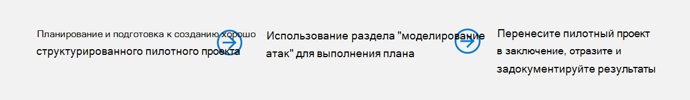
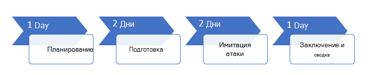

# Запуск пилотного проекта Microsoft Threat protectionRun your pilot Microsoft Threat Protection project 

[!INCLUDE [Microsoft 365 Defender rebranding](../includes/microsoft-defender.md)]

**Область применения:****Applies to:**
- Защита от угроз (Майкрософт)Microsoft Threat Protection

Чтобы эффективно определить преимущества и внедрение защиты от угроз Майкрософт (MTP), вы можете запустить пилотный проект.To effectively determine the benefit and adoption of Microsoft Threat Protection (MTP), you can run a pilot project. Перед включением защиты от угроз Майкрософт в рабочей среде и начала работы с определенными вариантами использования рекомендуется выполнить процесс планирования, чтобы определить задачи, которые необходимо выполнить в этом пилотном проекте, и условия их успешного выполнения.Before enabling Microsoft Threat Protection in your production environment and starting with defined use cases, it is best to go through a planning process to determine the tasks that must be accomplished in this pilot project, and the success criteria. 

## Как использовать эту пилотную стратегияHow to use this pilot playbook

В этом руководстве представлен обзор защиты от угроз Майкрософт и пошаговое руководство по настройке пилотного проекта.This guide provides an overview of Microsoft Threat Protection and step-by-step guidance on how to set up your pilot project. 

Ниже показана временная временная шкала, зависящая от наличия нужных ресурсов в вашей среде.The following sample timeline varies depending on having the right resources in your environment. Для некоторых обнаружений и рабочих процессов может потребоваться больше времени на обучение, чем для других.Some detections and workflows might need more learning time than the others.

>[!IMPORTANT]
>Для достижения оптимальных результатов выполните пробные инструкции, как можно ближе.For optimum results, follow the pilot instructions as closely as possible.

### Пилотные фазы стратегияPilot playbook phases 

Для запуска пилотного проекта по защите от угроз Майкрософт существует четыре этапа.There are four phases in running a Microsoft Threat Protection pilot:

|ЭтапPhase | ОписаниеDescription | 
|:-------|:-----|
|  [ПланированиеPlanning](mtp-pilot-plan.md)| Сведения о том, что необходимо учесть перед запуском пилотного проекта Microsoft Threat protection:Learn what you need to consider before running your Microsoft Threat Protection pilot project:   Область действия- Scope   — Варианты использования- Use cases  - Требования- Requirements  -Тестовый план- Test plan   Условия успеха- Success criteria   — Система показателей- Scorecard 
|   [ПредварительPreparation](mtp-evaluation.md)|  Доступ к центру безопасности Microsoft 365 для настройки экспериментальной среды Майкрософт по защите от угроз.Access Microsoft 365 Security Center to setup your Microsoft Threat Protection pilot  environment. Вы будете переработаны в следующих руководствах:You will be guided to:  — Определение заинтересованных лиц и поиск для пилотного проекта- Identify stakeholders and seek sign-off for your pilot   Аспекты среды- Environment considerations  Доступ- Access  — Установка Azure Active Directory- Azure Active Directory setup   — Порядок настройки- Configuration order   — Подписаться на пробную версию Microsoft 365- Sign up for Microsoft 365 E5 Trial   — Настройка домена- Configure domain  — Назначение лицензий Microsoft 365- Assign Microsoft 365 E5 licenses   — Завершите работу мастера установки на портале.- Complete the setup wizard in the portal|
|   [Имитация атакиAttack simulation](mtp-pilot-simulate.md) | Чтобы имитировать атаку, необходимо выполнить указанные ниже действия.To simulate an attack, you will be guided to:  -Проверка требований к тестовой среде- Verify the test environment requirements  Запуск модели-  Run the simulation  — Исследование инцидента- Investigate an incident  — устранение инцидента- resolve the incident 
|   [Заключение и заключениеClosing and summary](mtp-pilot-close.md) | Когда вы достигли конца этого процесса, вы будете участником:When you've reached the end of the process, you will be guided to:  — Пройти по итоговым выходным данным- Go through your final output — Предоставление вашим заинтересованным лицам выходных данных- Present your output to your stakeholders  — Оставить отзыв- Provide feedback  Выполните следующие действия- Take next steps 

## Следующий этапNext step
|  [Этап планированияPlanning phase](mtp-pilot-plan.md) | Планирование пилотного проекта Microsoft Threat protectionPlan your Microsoft Threat Protection pilot project 
|:-------|:-----|
