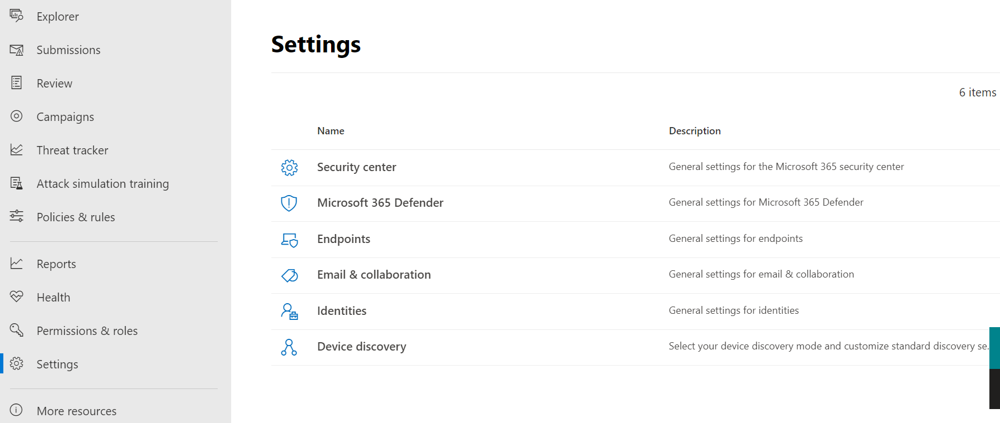

# Обзор единого Центра безопасности Microsoft 365The unified Microsoft 365 security center overview

[!INCLUDE [Microsoft 365 Defender rebranding](../includes/microsoft-defender.md)]

[!INCLUDE [Prerelease](../includes/prerelease.md)]

**Область применения:****Applies to:**

- [Microsoft 365 DefenderMicrosoft 365 Defender](https://go.microsoft.com/fwlink/?linkid=2118804)
- [Microsoft Defender для конечной точкиMicrosoft Defender for Endpoint](https://go.microsoft.com/fwlink/p/?linkid=2146631)
- [Microsoft Defender для Office 365Microsoft Defender for Office 365](https://go.microsoft.com/fwlink/?linkid=2148715)

> Хотите испытать Microsoft 365 Defender?Want to experience Microsoft 365 Defender? Вы можете [оценить его в лабораторной среде](https://aka.ms/mtp-trial-lab) или запустить [пилотный проект в производственной среде.](https://aka.ms/m365d-pilotplaybook)You can [evaluate it in a lab environment](https://aka.ms/mtp-trial-lab) or [run your pilot project in production](https://aka.ms/m365d-pilotplaybook).

Улучшенный Центр безопасности **Microsoft 365** () объединяет средства защиты, обнаружения, исследования и реагирования на угрозы электронной почты, совместной работы, удостоверений и устройств на центральном [https://security.microsoft.com](https://security.microsoft.com) портале.    The improved **Microsoft 365 security center** ([https://security.microsoft.com](https://security.microsoft.com)) combines protection, detection, investigation, and response to *email*, *collaboration*, *identity*, and *device* threats, in a central portal.

Центр безопасности Microsoft 365 объединяет функции существующих порталов безопасности Майкрософт, таких как Центр безопасности Microsoft Defender и Центр безопасности Office 365 & соответствия требованиям.Microsoft 365 security center brings together functionality from existing Microsoft security portals, like Microsoft Defender Security Center and the Office 365 Security & Compliance center. Центр безопасности акцентирует внимание на быстром доступе к информации, более простых макетах и совместном использовании связанных сведений для упростить их использование.The security center emphasizes quick access to information, simpler layouts, and bringing related information together for easier use. Этот центр включает:This center includes:

- **[Microsoft Defender для Office 365](https://docs.microsoft.com/microsoft-365/security/office-365-security/office-365-atp)** Microsoft Defender для Office 365 помогает организациям защитить свои предприятия с помощью функций предотвращения, обнаружения, исследования и вынахтовки для защиты электронной почты и ресурсов Office 365.**[Microsoft Defender for Office 365](https://docs.microsoft.com/microsoft-365/security/office-365-security/office-365-atp)** Microsoft Defender for Office 365 helps organizations secure their enterprise with a set of prevention, detection, investigation and hunting features to protect email, and Office 365 resources.
- **[Microsoft Defender for Endpoint](https://docs.microsoft.com/windows/security/threat-protection/microsoft-defender-atp/microsoft-defender-advanced-threat-protection)** обеспечивает профилактическую защиту, обнаружение после нарушения безопасности, автоматизированное исследование и реагирование на них для устройств в организации.**[Microsoft Defender for Endpoint](https://docs.microsoft.com/windows/security/threat-protection/microsoft-defender-atp/microsoft-defender-advanced-threat-protection)** delivers preventative protection, post-breach detection, automated investigation, and response for devices in your organization.
- **[Microsoft 365 Defender](microsoft-threat-protection.md)** входит в состав решения Microsoft *Extended Detection and Response* (XDR), которое использует портфель безопасности Microsoft 365 для автоматического анализа данных об угрозах в доменах и создания изображения атаки на одну панель мониторинга.**[Microsoft 365 Defender](microsoft-threat-protection.md)** is part of Microsoft’s *Extended Detection and Response* (XDR) solution that leverages the Microsoft 365 security portfolio to automatically analyze threat data across domains, and build a picture of an attack on a single dashboard.

Сведения о том, что изменилось с Центра безопасности и соответствия требованиям Office 365 & или Центра безопасности Microsoft Defender, см. в:If you need information about what's changed from the Office 365 Security & Compliance center or the Microsoft Defender Security Center, see:

- [Microsoft Defender для Office 365 в Центре безопасности Microsoft 365Defender for Office 365 in the Microsoft 365 security center](microsoft-365-security-center-mdo.md)
- [Microsoft Defender для конечной точки в Центре безопасности Microsoft 365Defender for Endpoint in the Microsoft 365 security center](microsoft-365-security-center-mde.md)

## Чего ожидатьWhat to expect

Весь контент безопасности, который вы используете в Центре безопасности и соответствия требованиям Office 365 (protection.office.com) и Центре безопасности Microsoft Defender (securitycenter.microsoft.com), теперь можно найти в Центре безопасности *Microsoft 365.*All the security content that you use in the Office 365 Security and Compliance Center (protection.office.com) and the Microsoft Defender security center (securitycenter.microsoft.com) can now be found in the *Microsoft 365 security center*.

Центр безопасности Microsoft 365 помогает группам безопасности исследовать атаки и реагировать на них, объединив сигналы из разных рабочих нагрузок в единые единые решения:Microsoft 365 security center helps security teams investigate and respond to attacks by brining in signals from different workloads into a single, unified experiences:

- Инциденты & оповещенияIncidents & alerts
- ОхотаHunting
- Центр уведомленийAction Center
- Аналитика угрозThreat analytics

Центр безопасности Microsoft 365 акцентирует внимание на *единстве,* четкости и общих целях при объединении Microsoft Defender для Office 365 и Microsoft Defender для конечной точки.The Microsoft 365 security center emphasizes *unity, clarity, and common goals* as it merges Microsoft Defender for Office 365 and Microsoft Defender for Endpoint. Объединение было основано на приоритетах, перечисленных ниже, и выполнено без ущерба для возможностей, которые каждый набор безопасности добавил в комбинацию:The merge was based on the priorities listed below, and made without sacrificing the capabilities that each security suite brought to the combination:

- общие строительные блокиcommon building blocks
- общая терминологияcommon terminology
- общие сущностиcommon entities
- четность функций с другими рабочими нагрузкамиfeature parity with other workloads

## Объединенные исследованияUnified investigations

Оптимизация центров безопасности создает единую области для расследования любых инцидентов в организации Microsoft 365.Streamlining security centers creates a single pane for investigating any incidents across a Microsoft 365 organization. В качестве основного примера можно **привести узел "Инциденты"** на быстром запуске Центра безопасности Microsoft 365.A primary example is the **Incidents** node on the quick launch of the Microsoft 365 security center.

:::image type="content" source="../../media/converged-incidents-2.png.png" alt-text="Страница &quot;Инциденты&quot; в MDO.":::

В качестве примера можно дважды щелкнуть имя инцидента с высокой степенью серьезности, чтобы демонстрировать преимущества конвергентных центров. As an example, double-clicking on an incident name with **High** severity brings you to a page that demonstrates the advantage of converging centers.

> [!TIP]
> Вкладка  "Конвергентные пользователи" — отличное место для начала запросов.The converged **Users** tab is a good place to begin your inquiries. Эта одна страница позволяет получить сведения о пользователях из конвергентных рабочих нагрузок (Microsoft Defender для конечной точки, Microsoft Defender для удостоверений и MCAS, если вы их используете) и ряде источников, таких как локальные Active Directory, Azure Active Directory, синхронизированные, локальные и сторонние пользователи.This single page surfaces information for users from converged workloads (Microsoft Defender for Endpoint, Microsoft Defender for Identity, and MCAS, if you leverage it) and a range of sources such as on-premises Active Directory, Azure Active Directory, synced, local, and third-party users. Узнайте больше о [новых впечатлениях от работы с пользователями.](investigate-users.md)Learn more about [the new Users experience](investigate-users.md).

Сведения об инциденте показывают особенности пользователей и удостоверений, а также устройства, подверженные риску, рядом с затронутыми почтовыми ящиками.Incident information shows user/identity specifics and at-risk devices, beside affected mailboxes. Он также относится к любым **сведениям об исследованиях** и собранным **свидетельствам.**It also relates any **Investigation information** and gathered **Evidence**. Это упрощает для администраторов и групп операций безопасности свести на нет одно оповещение с высокой угрозой для затронутых пользователей и почтовых ящиков.This makes it easier for admins and security operation teams to pivot from one high-risk alert to the affected users and mailboxes. На **вкладке "Инцидент"** в верхней части этой страницы можно найти другие ключевые складки безопасности, доступные в этом отдельном расположении.Looking at the **Incident** tabs at the top of this page, there are other key security pivots available from this single location.

> [!IMPORTANT]
> В верхней части любой страницы для конкретного инцидента вы увидите вкладки **"Сводка",**"Оповещения", "Устройства", "Пользователи", "Почтовые ящики", "Исследования" и "Свидетельство".      Along the top of any page for a specific Incident, you'll see the **Summary**, **Alerts**, **Devices**, **Users**, **Mailboxes**, **Investigations**, and **Evidence** tabs.

При выборе **"Исследования"** открывается страница с изображением анализа, на которую перечислены состояния (например, ожидающие **утверждения)** для устранения.Selecting **Investigations** opens  a page that features a graphic of the analysis taking place and lists a status (such as **pending approval**) for remediation. Уберите время, чтобы выбрать конкретные инциденты в своей среде, пробор этих вкладок и на практике соберите профиль для различных видов угроз.Take time to select specific incidents in your environment, drill down into these tabs, and practice building a profile for different kinds of threats. Знакомство поможет вам при любом последующих нажатии на расследования.Familiarity will benefit any later pressing investigations.

## Улучшенные процессыImproved processes

Общие элементы управления и содержимое отображаются в одном месте или сжаты в один канал данных, что упрощает поиск.Common controls and content either appear in the same place, or are condensed into one feed of data making it easier to find. Например, унифицированные параметры.For example, unified settings.

### Единые параметрыUnified settings

### Разрешения & ролейPermissions & roles

 Доступ к Центру безопасности Microsoft 365 настраивается с помощью глобальных ролей Azure Active Directory или с помощью настраиваемых ролей.Access the Microsoft 365 security center is configured with Azure Active Directory global roles or by using custom roles. О защитнике для конечной точки см. в подзапуске "Назначение [доступа пользователей к Центру безопасности Microsoft Defender".](https://docs.microsoft.com/windows/security/threat-protection/microsoft-defender-atp/assign-portal-access)For Defender for Endpoint, see [Assign user access to Microsoft Defender Security Center](https://docs.microsoft.com/windows/security/threat-protection/microsoft-defender-atp/assign-portal-access). В защитнике Office 365 см. "Разрешения" в Центре соответствия требованиям Microsoft 365 и Центре безопасности [Microsoft 365.](../office-365-security/permissions-microsoft-365-compliance-security.md)For Defender for Office 365, see [Permissions in the Microsoft 365 compliance center and Microsoft 365 security center](../office-365-security/permissions-microsoft-365-compliance-security.md).

- Узнайте больше об управлении [доступом к Microsoft 365 Defender](mtp-permissions.md)Learn more about how to [manage access to Microsoft 365 Defender](mtp-permissions.md)
- Узнайте больше о создании [настраиваемой роли в](custom-roles.md) Центре безопасности Microsoft 365Learn more about how to [create custom roles](custom-roles.md) in Microsoft 365 security center

### Интегрированные отчетыIntegrated reports

Отчеты также унифицированы в Центре безопасности Microsoft 365.Reports are also unified in the Microsoft 365 security center. Администраторы могут начать с общего отчета о безопасности и ввести определенные отчеты о конечных точках, электронной & совместной работы.Admins can start with a general security report, and branch into specific reports about endpoints, email & collaboration. Ссылки здесь динамически создаются на основе конфигурации рабочей нагрузки.The links here are dynamically generated based upon workload configuration.

### Быстрое просмотр среды Microsoft 365Quickly view your Microsoft 365 environment

На **домашней** странице показаны многие распространенные карточки, необходимые группам безопасности.The **Home** page shows many of the common cards that security teams need. Композиция карточек и данных зависит от роли пользователя.The composition of cards and data is dependent on the user role. Так как Центр безопасности Microsoft 365 использует управление доступом на основе ролей, различные роли будут видеть карточки, которые более значимы для их ежедневного задания.Because the Microsoft 365 security center uses role-based access control, different roles will see cards that are more meaningful to their day to day jobs.  

Эти обзорные сведения помогают вам следить за последними действиями в организации.This at-a-glance information helps you keep up with the latest activities in your organization. Центр безопасности Microsoft 365 объединяет сигналы из разных источников, чтобы представить целостное представление среды Microsoft 365.The Microsoft 365 security center brings together signals from different sources to present a holistic view of your Microsoft 365 environment.

Карточки подпадают под эти категории:The cards fall into these categories:

- **Удостоверения**— отслеживайте удостоверения в организации и отслеживайте подозрительные или рискованные действия.**Identities**- Monitor the identities in your organization and keep track of suspicious or risky behaviors. [Узнайте больше о защите удостоверений.](https://docs.microsoft.com/azure/active-directory/identity-protection/overview-identity-protection)[Learn more about identity protection](https://docs.microsoft.com/azure/active-directory/identity-protection/overview-identity-protection).
- **Data** - help track user activity that could lead to unauthorized data disclosure.**Data** - Help track user activity that could lead to unauthorized data disclosure.
- **Устройства** . Получите сведения об оповещениях, нарушениях безопасности и других угрозах на ваших устройствах.**Devices** - Get up-to-date information on alerts, breach activity, and other threats on your devices.
- **Приложения** . Получите представление о том, как облачные приложения используются в вашей организации.**Apps** - Gain insight into how cloud apps are being used in your organization. [Узнайте больше о обнаруженных приложениях Cloud App Security.](https://docs.microsoft.com/cloud-app-security/discovered-apps)[Learn more about Cloud App Security discovered apps](https://docs.microsoft.com/cloud-app-security/discovered-apps).

## Аналитика угроз с лучшим охватом данныхThreat analytics with better data coverage
Отслеживайте и реагируйте на возникающие угрозы с помощью следующего интегрированного анализа угроз в Microsoft 365 Defender:Track and respond to emerging threats with the following Microsoft 365 Defender threat analytics integrated experience:

- Улучшение охвата данных между Microsoft Defender для endpoint и Microsoft Defender для Office 365, что делает возможным объединенное управление инцидентами, автоматическое исследование, исправление, а также упреждающий или реактивной охоты на угрозы в домене.Better data coverage between Microsoft Defender for Endpoint and Microsoft Defender for Office 365, making combined incident management, automatic investigation, remediation, and proactive or reactive threat hunting across-domain possible. 
- Обнаружение и меры, связанные с электронной почтой, из Microsoft Defender для Office 365, в дополнение к данным конечной точки, уже доступным из Microsoft Defender для конечной точки.Email-related detections and mitigations from Microsoft Defender for Office 365, in addition to the endpoint data already available from Microsoft Defender for Endpoint.
- Представление инцидентов, связанных с угрозами, которые объединяют оповещения в до конца историях атак в Microsoft Defender для endpoint и Microsoft Defender для Office 365, чтобы сократить очередь работы, а также упростить и ускорить исследование.A view of threat-related incidents which aggregate alerts into end-to-end attack stories across Microsoft Defender for Endpoint and Microsoft Defender for Office 365 to reduce the work queue, as well as simplify and speed up your investigation.
- Попытки атаки обнаружены и блокированы решениями Microsoft 365 Defender.Attack attempts detected and blocked by Microsoft 365 Defender solutions. Кроме того, существуют данные, которые можно использовать для профилактических действий, снижая риск дальнейшего воздействия и повышения устойчивости.There's also data that you can use to drive preventive actions that mitigate the risk of further exposure and increase resilience. 
- Улучшенная разработка, которая помещает информацию с действиями в центре внимания, чтобы помочь вам быстро идентифицировать данные, чтобы в срочном порядке сосредоточиться на отчетах, изучить их и использовать их.Enhanced design that puts actionable information in the spotlight to help you  quickly identify data to urgently focus on, investigate, and leverage from the reports.

## Центр централизованного обученияA centralized Learning Hub

Центр безопасности Microsoft 365 включает в себя центр обучения, в который входят официальные руководства из таких ресурсов, как блог о безопасности Майкрософт, сообщество майкрософт по безопасности на YouTube и с официальной документацией по docs.microsoft.com.The Microsoft 365 security center includes a learning hub that bubbles up official guidance from resources such as the Microsoft security blog, the Microsoft security community on YouTube, and the official documentation at docs.microsoft.com.

В центре обучения руководство по электронной почте & Collaboration (Microsoft Defender для Office 365 или MDO) находится рядом с конечной точкой (Microsoft Defender для endpoint или MDE) и учебными ресурсами в Microsoft 365 Defender.Inside the learning hub, Email & Collaboration (Microsoft Defender for Office 365 or MDO) guidance is side-by-side with Endpoint (Microsoft Defender for Endpoint or MDE), and Microsoft 365 Defender learning resources.

В центре обучения откроется обучающий курс, организованный по таким темам, как "Изучение использования Защитника Microsoft 365?"The learning hub opens with Learning paths organized around topics such as “How to Investigate Using Microsoft 365 Defender?” и "Microsoft Defender for Office 365 Best Practices".and “Microsoft Defender for Office 365 Best Practices”. В настоящее время этот раздел находится в окнах группы безопасности "Продукты" в корпорации Майкрософт.This section is currently curated by the security Product Group inside Microsoft. Каждый путь обучения отражает проецируемые время, необходимое для изучения концепций.Each Learning path reflects a projected time it takes to get through the concepts. Например, "Действия, которые необходимо предпринять при компрометации учетной записи пользователя Microsoft Defender для Office 365", проецируемые на 8 минут, и это полезное обучение во время работы.For example 'Steps to take when a Microsoft Defender for Office 365 user account is compromised' is projected to take 8 minutes, and is valuable learning on the fly.

После щелчка по содержимому может оказаться полезным закладки на этом сайте и упорядочесть закладок в папку "Безопасность" или "Критическое".After clicking through to the content, it may be useful to bookmark this site and organize bookmarks into a 'Security' or 'Critical' folder. Чтобы увидеть все пути обучения, щелкните ссылку "Показать все" на главной панели.To see all Learning paths, click the Show all link in the main panel.

> [!NOTE]
> В верхней части центра обучения Центра безопасности Microsoft 365 есть полезные фильтры, которые помогают выбрать продукты (в настоящее время Microsoft 365 Defender, Microsoft Defender для endpoint и Microsoft Defender для Office 365). There are helpful **filters** along the top of the Microsoft 365 security center learning hub that will let you choose between products (currently Microsoft 365 Defender, Microsoft Defender for Endpoint, and Microsoft Defender for Office 365). Обратите внимание, что в списке указано количество учебных ресурсов для каждого раздела, которое поможет обучающимся отслеживать количество имеющихся у них ресурсов для обучения и обучения.Notice that the number of learning resources for each section is listed, which can help learners keep track of how many resources they have at hand for training and learning.
>
> Наряду с фильтром продуктов перечислены текущие разделы, типы ресурсов (от видео до вебинары), уровни знакомство с областями безопасности, ролями безопасности и функциями продуктов.Along with the Product filter, current topics, types of resources (from videos to webinars), levels of familiarity or experience with security areas, security roles, and product features are listed.

## Отправьте нам свой отзывSend us your feedback

Нам нужна ваша обратная связь.We need your feedback. Мы всегда хотим улучшить, поэтому если вы хотите увидеть что-то, отправьте нам свой отзыв [о Защитнике Microsoft 365.](https://www.microsoft.com/videoplayer/embed/RE4K5Ci)We're always looking to improve, so if there's something you'd like to see, [send us your Microsoft 365 Defender feedback](https://www.microsoft.com/videoplayer/embed/RE4K5Ci).

Вы также можете оставить отзыв из этой статьи.You can also leave feedback from this article. В конце раздела "Отзывы" в разделе "Отправить и просмотреть отзывы" возможные варианты: *"Этот* продукт" или *"Эта страница".*In the 'Feedback' section at the end under 'Submit and view feedback for', the options are *This product*, or *This page*.

Используйте **кнопку "Этот продукт"** для *обратной связи с продуктом:*Use the **This product** button for *product* feedback:

1. Выберите *этот продукт* в нижней части статьи.Select *This product* at the bottom of the article.
    1. Щелкните правой кнопкой мыши кнопку и выберите "Открыть на новой вкладке", если вы хотите продолжать читать эти направления.Right-click the button and 'Open in a new tab' if you want to keep reading these directions.
2. Это позволит перейти на **форум UserVoice.**This will navigate to the **UserVoice forum**.
3. У вас есть 2 варианта:You have 2 options:
    1. Прокрутите вниз до текстового окна Как улучшить соответствие требованиям или защитить пользователей в *Office 365?* И вйдите в Центр безопасности *Microsoft 365.*Scroll down to the text box *How can we improve compliance or protect your users better in Office 365?* and paste in *Microsoft 365 security center*. Вы можете найти идею, похожую на вашу, и проголосуете за нее, или использовать кнопку для **публикации новой идеи.**You can search the results for an idea like yours and up-vote it, or use the button for **Post a new idea**.
    1. Если вы уверены, что об этой проблеме уже сообщили и хотите повысить  ее профиль с помощью голоса( или голосов), используйте поле "Обратная связь" в правой части UserVoice.If you feel certain this issue is already reported, and want to raise its profile with a vote (or votes), use the *Give Feedback* box on the right side of UserVoice. Найдите *центр безопасности Microsoft 365,* найдите проблему и используйте кнопку "Голос", чтобы повысить ее состояние. Search for *Microsoft 365 security center*, **find the issue, and use the vote button** to raise its status.

Используйте *эту страницу* для обратной связи по самой статье.Use *This page* for feedback on the article itself. Благодарим вас за отзывы.Thanks for your feedback. Ваш голос помогает нам улучшать продукты.Your voice helps us improve products.

### Узнайте, что может предложить Центр безопасностиExplore what the security center has to offer

Продолжайте изучать функции и возможности в Центре безопасности Microsoft 365:Keep exploring the features and capabilities in the Microsoft 365 security center:

- [Управление инцидентами и оповещениямиManage incidents and alerts](manage-incidents.md)
- [Отслеживание и реагирование на возникающие угрозы с помощью аналитики угрозTrack and respond to emerging threats with threat analytics](threat-analytics.md)
- [Центр уведомленийThe Action center](https://docs.microsoft.com/microsoft-365/security/mtp/mtp-action-center)
- [Поиск угроз на различных устройствах, электронных письмах, приложениях и удостоверенияхHunt for threats across devices, emails, apps, and identities](https://docs.microsoft.com/microsoft-365/security/mtp/advanced-hunting-query-emails-devices)
- [Настраиваемые правила обнаруженияCustom detection rules](https://docs.microsoft.com/microsoft-365/security/mtp/custom-detection-rules)
- [Оповещения & совместной работы по электронной почтеEmail & collaboration alerts](https://docs.microsoft.com/microsoft-365/compliance/alert-policies#default-alert-policies)
- [Создание имитации фишинговых атак](https://docs.microsoft.com/microsoft-365/security/office-365-security/attack-simulation-training) и [создание полезной нагрузки для обучения команд](https://docs.microsoft.com/microsoft-365/security/office-365-security/attack-simulation-training-payloads)[Create a phishing attack simulation](https://docs.microsoft.com/microsoft-365/security/office-365-security/attack-simulation-training) and [create a payload for training your teams](https://docs.microsoft.com/microsoft-365/security/office-365-security/attack-simulation-training-payloads)
 
### Статьи по темеRelated information
- [Центр безопасности Microsoft 365Microsoft 365 security center](overview-security-center.md)
- [Microsoft Defender для Office 365 в Центре безопасности Microsoft 365Microsoft Defender for Office 365 in the Microsoft 365 security center](microsoft-365-security-center-mdo.md)
- [Microsoft Defender для конечной точки в Центре безопасности Microsoft 365Microsoft Defender for Endpoint in the Microsoft 365 security center](microsoft-365-security-center-mde.md)
- [Перенаправление учетных записей из Microsoft Defender для конечной точки в Центр безопасности Microsoft 365Redirecting accounts from Microsoft Defender for Endpoint to the Microsoft 365 security center](microsoft-365-security-mde-redirection.md)
