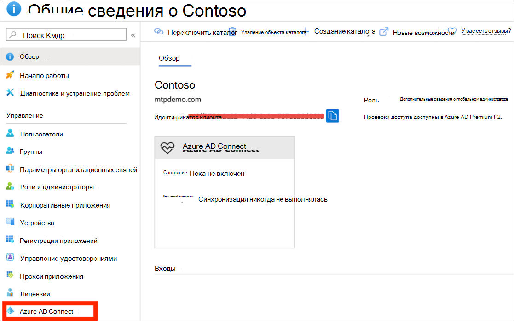
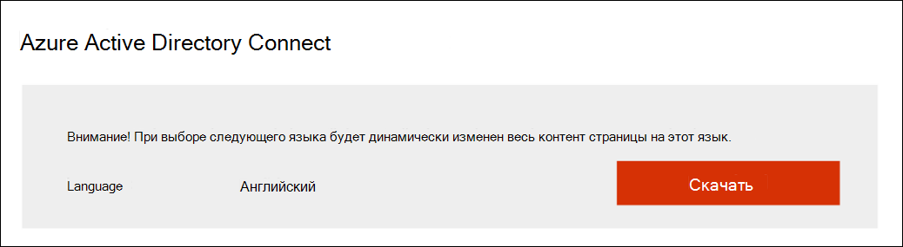
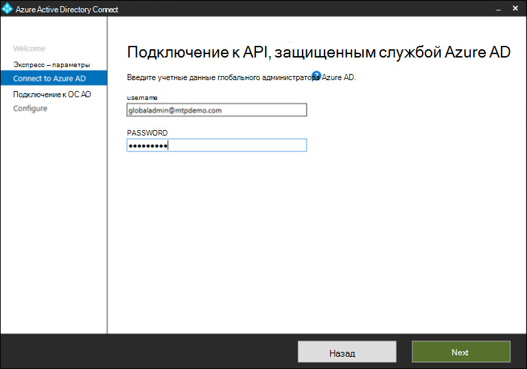
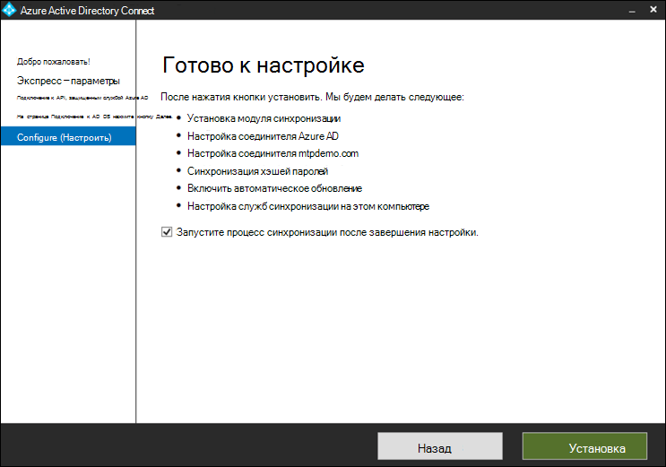
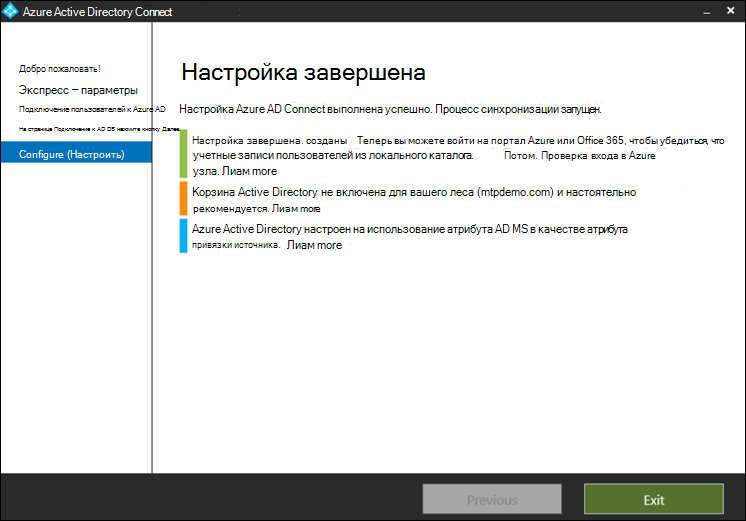

# Подготовка пробной лабораторной среды Майкрософт по защите от угрозPrepare your Microsoft Threat Protection trial lab environment

**Область применения:****Applies to:**
- Защита от угроз (Майкрософт)Microsoft Threat Protection

Создание пробной лабораторной среды Майкрософт для защиты от угроз и развертывание выполняется в три этапа:Creating a Microsoft Threat Protection trial lab environment and deploying it is a three-phase process:

 
<table border="0" width="100%" align="center">
  <tr style="text-align:center;">
    <td align="center" style="width:25%; border:0;" bgcolor="#d5f5e3">
      <a href= "https://docs.microsoft.com/microsoft-365/security/mtp/prepare-mtpeval"> 
        
       Этап 1: подготовка</a>Phase 1: Prepare </a> 
    </td>
     <td align="center"  >
      <a href="https://docs.microsoft.com/microsoft-365/security/mtp/setup-mtpeval">
        
       Этап 2: Настройка</a>Phase 2: Setup </a> 
        </td>
    <td align="center">
      <a href="https://docs.microsoft.com/microsoft-365/security/mtp/config-mtpeval">
        
       Этап 3: Настройка встроенного &</a>Phase 3: Configure & Onboard</a> 
</td>
  </tr>
  <tr>
    <td style="width:25%; border:0;">
   
    </td>
    <td valign="top" style="width:25%; border:0;">
    
</td>
    <td valign="top" style="width:25%; border:0;">

</td>    
  </tr>
</table>

В настоящее время вы находитесь на этапе подготовки.You're currently in the preparation phase.

Подготовка — это ключ к любому успешному развертыванию.Preparation is key to any successful deployment. В этом разделе вы узнаете, что нужно учесть при подготовке к созданию пробной лабораторной среды для развертывания Microsoft Threat protection.This section will guide you through what you need to consider as you prepare to create a trial lab environment for your Microsoft Threat Protection deployment.

## Необходимые компонентыPrerequisites
Сведения о лицензировании, требованиях к оборудованию и программному обеспечению, а также другие параметры конфигурации для подготовки и использования защиты от угроз Майкрософт.Learn about the licensing, hardware and software requirements, and other configuration settings to provision and use Microsoft Threat Protection. Ознакомьтесь с минимальными требованиями для [защиты от угроз Майкрософт](https://docs.microsoft.com/microsoft-365/security/mtp/prerequisites?view=o365-worldwide), [Microsoft Defender atp](https://docs.microsoft.com/windows/security/threat-protection/microsoft-defender-atp/minimum-requirements), [Office 365 ATP](https://docs.microsoft.com/office365/servicedescriptions/office-365-advanced-threat-protection-service-description), [Azure ATP](https://docs.microsoft.com/azure-advanced-threat-protection/atp-prerequisites), [Microsoft Cloud App Security](https://docs.microsoft.com/azure-advanced-threat-protection/atp-prerequisites).See the minimum requirements for [Microsoft Threat Protection](https://docs.microsoft.com/microsoft-365/security/mtp/prerequisites?view=o365-worldwide), [Microsoft Defender ATP](https://docs.microsoft.com/windows/security/threat-protection/microsoft-defender-atp/minimum-requirements), [Office 365 ATP](https://docs.microsoft.com/office365/servicedescriptions/office-365-advanced-threat-protection-service-description), [Azure ATP](https://docs.microsoft.com/azure-advanced-threat-protection/atp-prerequisites), [Microsoft Cloud App Security](https://docs.microsoft.com/azure-advanced-threat-protection/atp-prerequisites).

## Заинтересованные стороны и подписьStakeholders and sign-off
Следующий раздел служит для определения всех заинтересованных лиц, вовлеченных в проект, которые могут потребоваться для выхода, проверки или информирования, даже для оценки или пробного использования.The following section serves to identify all the stakeholders that are involved in the project and who may need to sign-off, review, or stay informed, even for an evaluation or proof of concept dry-run.

>[!NOTE]
>Не все организации могут иметь такие роли в организации безопасности.Not all organizations might have the security organization maturity to have such roles. В таком случае обратитесь к специалистам по ознакомлению и утверждению аккаунтабилитиес.In such case, consult with your leadership team on review and approval accountabilities.

Добавьте заинтересованных лиц в приведенную ниже таблицу в соответствии с требованиями Организации.Add stakeholders to the table below as appropriate for your organization.

-   Таким образом, для этого проекта следует выполнить вход.SO = Sign-off on this project

-   R = просмотр этого проекта и предоставление входных данныхR = Review this project and provide input

-   I = информирование о проектеI = Informed of this project

| ИмяName                 | RoleRole                                                                                                                                                                                                          | ActionAction |
|----------------------|---------------------------------------------------------------------------------------------------------------------------------------------------------------------------------------------------------------|--------|
| Введите имя и адрес электронной почтыEnter name and email | **Генеральный директор по безопасности информационных технологий (Цисо)** *— руководитель, который выступает в качестве спонсора в Организации для развертывания нового решения.***Chief Information Security Officer (CISO)** *An executive representative who serves as sponsor inside the organization for the new technology deployment.*                                                  | МОГЛИSO     |
| Введите имя и адрес электронной почтыEnter name and email | **Head of кибератак оборонного центра (кдок)** в *группе кдок, ответственной за определение того, как это изменение выровнено с процессами в группе "операции безопасности клиентов".***Head of Cyber Defense Operations Center (CDOC)** *A representative from the CDOC team in charge of defining how this change is aligned with the processes in the customers security operations team.*       | МОГЛИSO     |
| Введите имя и адрес электронной почтыEnter name and email | **Архитектор по безопасности** *— это представитель группы безопасности, ответственный за определение того, как это изменение согласуется с основной архитектурой безопасности в Организации.***Security Architect** *A representative from the Security team in charge of defining how this change is aligned with the core Security architecture in the organization.*                         | RR      |
| Введите имя и адрес электронной почтыEnter name and email | **Архитектор рабочего места** *— представитель ИТ-отдела, ответственный за определение того, как это изменение выровнено с основной архитектурой рабочего места в Организации.***Workplace Architect** *A representative from the IT team in charge of defining how this change is aligned with the core workplace architecture in the organization.*                             | RR      |
| Введите имя и адрес электронной почтыEnter name and email | **Аналитика безопасности** *— это представитель группы кдок, который может предоставлять входные данные о возможностях обнаружения, взаимодействии с пользователем и общей целесообразности этого изменения с точки зрения безопасности.***Security Analyst** *A representative from the CDOC team who can provide input on the detection capabilities, user experience, and overall usefulness of this change from a security operations perspective.* | II      |

## Подготовка Azure Active DirectoryPrepare your Azure Active Directory
Пропустите этот шаг, если вы уже включили синхронизацию между Active Directory и Azure Active Directory в локальной среде.Skip this step if you have already enabled synchronization between Active Directory and Azure Active Directory on premises. Изучите существующую документацию по рекомендациям из Azure Active Directory.Review existing best practices documentation from Azure Active Directory. Следующие действия оптимизированы для оценки защиты от угроз Майкрософт.The following steps are optimized to evaluate Microsoft Threat Protection.

1. Перейдите на портал [Azure Active Directory](https://portal.azure.com/#blade/Microsoft_AAD_IAM/ActiveDirectoryMenuBlade) > **Azure AD Connect**.Go to the [Azure Active Directory](https://portal.azure.com/#blade/Microsoft_AAD_IAM/ActiveDirectoryMenuBlade) portal > **Azure AD Connect**. 
   

2. Щелкните **скачать** из **Microsoft Azure Active Directory Connect** и перенесите его на контроллер домена.Click **Download** from **Microsoft Azure Active Directory Connect** and transfer it to your Domain Controller.
  

3. На контроллере домена следуйте указаниям мастера подключения Azure Active Directory.On the domain controller, follow the Azure Active Directory Connect wizard. Ознакомьтесь с условиями лицензионного соглашения и заявлением о конфиденциальности и установите флажок, если вы согласны.Read the license terms and privacy notice and select the checkbox if you agree. Нажмите кнопку **Продолжить**.Click **Continue**.
  

4. Перейдите в раздел **Экспресс — параметры**.Navigate to **Express Settings**.
  

5. Введите свои учетные данные глобального администратора.Enter your global administrator credentials. Нажмите кнопку **Далее**.Click **Next**.
  

6. Введите учетные данные администратора доменных служб Active Directory.Enter your Active Directory Domain Services enterprise administrator credentials. Нажмите кнопку **Далее**.Click **Next**.
  

7. Нажмите кнопку **установить** , чтобы подтвердить настройку.Click **Install** to confirm the configuration.
  

8. Поздравляем, вы успешно настроили Azure Active Directory Connect.Congratulations, you have successfully configured Azure Active Directory Connect.
  

Теперь вы можете [Добавить пользователей и группы в Active Directory](https://docs.microsoft.com/azure-advanced-threat-protection/atp-playbook-setup-lab#bkmk_hydrate) и [настроить политику SAM – R](https://docs.microsoft.com/azure-advanced-threat-protection/atp-playbook-setup-lab#configure-sam-r-capabilities-from-contosodc).You can now [add users and groups to Active Directory](https://docs.microsoft.com/azure-advanced-threat-protection/atp-playbook-setup-lab#bkmk_hydrate) and [configure a SAM-R policy](https://docs.microsoft.com/azure-advanced-threat-protection/atp-playbook-setup-lab#configure-sam-r-capabilities-from-contosodc).  

## Порядок настройкиConfiguration order
В таблице ниже показано, как настроить компоненты защиты от угроз Майкрософт для развертывания пробной лабораторной среды.The table below indicates the order Microsoft recommends for configuring the Microsoft Threat Protection components for your trial lab environment deployment.

| КомпонентComponent                               | ОписаниеDescription                                                                                                                                                                                                                                                                                                                                                                                                                                                                                                                                                                                                                                                                                              | Ранг заказа конфигурацииConfiguration order rank |
|-----------------------------------------|----------------------------------------------------------------------------------------------------------------------------------------------------------------------------------------------------------------------------------------------------------------------------------------------------------------------------------------------------------------------------------------------------------------------------------------------------------------------------------------------------------------------------------------------------------------------------------------------------------------------------------------------------------------------------------------------------------|---------------------|
| Office 365 Advanced Threat ProtectionOffice 365 Advanced Threat Protection| Office 365 ATP защищает вашу организацию от вредоносных угроз, исносящихся к сообщениям электронной почты, ссылкам (URL-адресам) и средствам для совместной работы.Office 365 ATP safeguards your organization against malicious threats posed by email messages, links (URLs), and collaboration tools.   [Подробнее.Learn more.](https://docs.microsoft.com/microsoft-365/security/office-365-security/office-365-atp?view=o365-worldwide)                                                                                                                                                                                                                                             | 1,11                   |
|Расширенная защита от угроз AzureAzure Advanced Threat Protection|Azure ATP использует сигналы Active Directory для определения, обнаружения и исследования сложных угроз, скомпрометированных удостоверений и действий, которые вы направляете в Организации.Azure ATP uses Active Directory signals to identify, detect, and investigate advanced threats, compromised identities, and malicious insider actions directed at your organization.   [Подробнее](https://docs.microsoft.com/azure-advanced-threat-protection/).[Learn more](https://docs.microsoft.com/azure-advanced-threat-protection/).| 22 |
|Microsoft Cloud App SecurityMicrosoft Cloud App Security| Microsoft Cloud App Security — это брокер безопасности облачного доступа (КАСБ), работающий в нескольких облаках.Microsoft Cloud App Security is a Cloud Access Security Broker (CASB) that operates on multiple clouds. Он обеспечивает широкие возможности просмотра и управления путешествием данных, а также интеллектуальную аналитику для выявления и борьбы киберугрозами среди всех облачных служб.It provides rich visibility, control over data travel, and sophisticated analytics to identify and combat cyberthreats across all your cloud services.   [Подробнее](https://docs.microsoft.com/cloud-app-security/).[Learn more](https://docs.microsoft.com/cloud-app-security/).                                                                                                                                                                                                                                                                                                                                                                       |43                   |
|Advanced Threat Protection в Microsoft DefenderMicrosoft Defender Advanced Threat Protection | Функции обнаружения угроз и реагирования на них для конечных точек в ATP в Microsoft Defender обеспечивают обнаружение расширенных атак, работают в режиме практически реального времени, а результаты, предоставляемые такими функциями, можно использовать в качестве основания для выполнения тех или иных действий.Microsoft Defender ATP endpoint detection and response capabilities provide advanced attack detections that are near real-time and actionable. Аналитики систем безопасности могут эффективно определять приоритеты предупреждений, получать полную картину всех возможных брешей в системе безопасности, а также предпринимать действия по реагированию для устранения угроз.Security analysts can prioritize alerts effectively, gain visibility into the full scope of a breach, and take response actions to remediate threats.   [Подробнее.Learn more.](https://docs.microsoft.com/windows/security/threat-protection/microsoft-defender-atp/microsoft-defender-advanced-threat-protection)                                     |4 4                   |                                                                                                                                                                                                                                    

## Следующий этапNext step
|||
|:-------|:-----|
|  [Этап 2: НастройкаPhase 2: Setup](setup-mtpeval.md) | Настройка пробной лабораторной среды Майкрософт для защиты от угрозSet up your Microsoft Threat Protection trial lab environment

