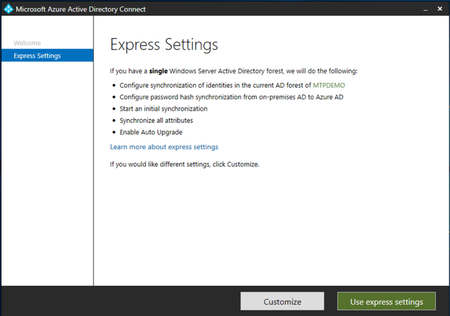

# Подготовка пробной или пилотной среды Microsoft 365 DefenderPrepare your Microsoft 365 Defender trial lab or pilot environment

[!INCLUDE [Microsoft 365 Defender rebranding](../includes/microsoft-defender.md)]

**Область применения:****Applies to:**
- Microsoft 365 DefenderMicrosoft 365 Defender

Создание пробной лабораторной или пилотной среды Microsoft 365 Defender и ее развертывание — это трех этапов:Creating a Microsoft 365 Defender trial lab or pilot environment and deploying it is a three-phase process:

| Этап 1. ПодготовкаPhase 1: Prepare | [Этап 2. НастройкаPhase 2: Set up](setup-mtpeval.md) | [Этап 3. ВетвьPhase 3: Onboard](config-mtpeval.md) |  [Вернуться к пилотной книгеBack to pilot playbook](mtp-pilot.md) |
|--|--|--|--|
|*Вы здесь!**You are here!* | || |

В настоящее время вы находится на этапе подготовки.You're currently in the preparation phase.

Подготовка — это ключ к успешному развертыванию.Preparation is key to any successful deployment. В этом разделе рассматриваются все необходимые моменты, которые необходимо учитывать при подготовке к созданию пробной лабораторной среды или пилотной среды для развертывания Microsoft 365 Defender.This section will guide you through what you need to consider as you prepare to create a trial lab or pilot environment for your Microsoft 365 Defender deployment.

## Предварительные условияPrerequisites
Узнайте о лицензировании, требованиях к оборудованию и программному обеспечению, а также о других параметрах конфигурации для предоставления и использования Защитника Microsoft 365.Learn about the licensing, hardware and software requirements, and other configuration settings to provision and use Microsoft 365 Defender. См. минимальные требования для [Microsoft 365 Defender,](https://docs.microsoft.com/microsoft-365/security/mtp/prerequisites) [Microsoft Defender для конечной](https://docs.microsoft.com/windows/security/threat-protection/microsoft-defender-atp/minimum-requirements)точки, Microsoft Defender для Office [365](https://docs.microsoft.com/office365/servicedescriptions/office-365-advanced-threat-protection-service-description), [Microsoft Defender для удостоверений](https://docs.microsoft.com/azure-advanced-threat-protection/atp-prerequisites), Microsoft Cloud App [Security](https://docs.microsoft.com/azure-advanced-threat-protection/atp-prerequisites).See the minimum requirements for [Microsoft 365 Defender](https://docs.microsoft.com/microsoft-365/security/mtp/prerequisites), [Microsoft Defender for Endpoint](https://docs.microsoft.com/windows/security/threat-protection/microsoft-defender-atp/minimum-requirements), [Microsoft Defender for Office 365](https://docs.microsoft.com/office365/servicedescriptions/office-365-advanced-threat-protection-service-description), [Microsoft Defender for Identity](https://docs.microsoft.com/azure-advanced-threat-protection/atp-prerequisites), [Microsoft Cloud App Security](https://docs.microsoft.com/azure-advanced-threat-protection/atp-prerequisites).

## Заинтересованные лица и входStakeholders and sign-off
Определите всех заинтересованных лиц, участвующих в проекте, и тех, кому может потребоваться подписать, просмотреть или получить информацию для оценки или запуска пилотного проекта.Identify all the stakeholders that are involved in the project and who may need to sign-off, review, or stay informed, whether for evaluation or running a pilot project.

>[!NOTE]
>Не все организации могут иметь уровень готовности организации безопасности для работы с такими ролями.Not all organizations might have the security organization maturity to have such roles. В таком случае проконсультируйтесь со своей командой руководителей по рассмотрению и утверждению отчетности.In such case, consult with your leadership team on review and approval accountabilities.

Добавьте заинтересованных лиц в приведенную ниже таблицу, если это подходит для вашей организации.Add stakeholders to the table below as appropriate for your organization.

-   SO = Sign-off on this projectSO = Sign-off on this project

-   R = Просмотрите этот проект и ввести данныеR = Review this project and provide input

-   I = Informed of this projectI = Informed of this project

| ИмяName                 | RoleRole                                                                                                                                                                                                          | ДействиеAction |
|----------------------|---------------------------------------------------------------------------------------------------------------------------------------------------------------------------------------------------------------|--------|
| Введите имя и адрес электронной почтыEnter name and email | **Руководитель отдела информационной безопасности (CISO)** — исполнительный представитель, который выступает в качестве спонсора в организации для *развертывания новых технологий.***Chief Information Security Officer (CISO)** *An executive representative who serves as sponsor inside the organization for the new technology deployment.*                                                  | SOSO     |
| Введите имя и адрес электронной почтыEnter name and email | Руководитель центра операций киберзащиты **(CDOC),** представитель группы *CDOC,* отвечающий за определение того, как это изменение согласуется с процессами в группе операций безопасности клиентов.**Head of Cyber Defense Operations Center (CDOC)** *A representative from the CDOC team in charge of defining how this change is aligned with the processes in the customers security operations team.*       | SOSO     |
| Введите имя и адрес электронной почтыEnter name and email | **Архитектор безопасности** *A из группы безопасности,* отвечающей за определение того, как это изменение согласуется с основной архитектурой безопасности в организации.**Security Architect** *A representative from the Security team in charge of defining how this change is aligned with the core Security architecture in the organization.*                         | RR      |
| Введите имя и адрес электронной почтыEnter name and email | **Рабочая архитектор,** *представитель ИТ-группы,* отвечающей за определение того, как это изменение согласуется с основной рабочей архитектурой в организации.**Workplace Architect** *A representative from the IT team in charge of defining how this change is aligned with the core workplace architecture in the organization.*                             | RR      |
| Введите имя и адрес электронной почтыEnter name and email | **Аналитик безопасности,** представитель группы *CDOC,* который может предоставлять отзывы о возможностях обнаружения, пользовательском интерфейсе и общей полезности этого изменения с точки зрения операций безопасности.**Security Analyst** *A representative from the CDOC team who can provide feedback on the detection capabilities, user experience, and overall usefulness of this change from a security operations perspective.* | II      |

## Подготовка Azure Active DirectoryPrepare your Azure Active Directory
Пропустите этот шаг, если вы уже включили синхронизацию между Active Directory и локальной службой Azure Active Directory.Skip this step if you have already enabled synchronization between Active Directory and Azure Active Directory on premises. Просмотрите существующую документацию по практическим методикам из Azure Active Directory.Review existing best practices documentation from Azure Active Directory. Следующие действия оптимизированы для оценки или запуска пилотного проекта Microsoft 365 Defender.The following steps are optimized to evaluate or run a pilot Microsoft 365 Defender project.

1. Перейдите на портал [Azure Active Directory](https://portal.azure.com/#blade/Microsoft_AAD_IAM/ActiveDirectoryMenuBlade) > **Azure AD Connect.**Go to the [Azure Active Directory](https://portal.azure.com/#blade/Microsoft_AAD_IAM/ActiveDirectoryMenuBlade) portal > **Azure AD Connect**. 
   

2. Щелкните **"Скачать"** **из Microsoft Azure Active Directory Connect** и перейдите на контроллер домена.Click **Download** from **Microsoft Azure Active Directory Connect** and transfer it to your Domain Controller.
  

3. На контроллере домена следуйте мастеру Azure Active Directory Connect.On the domain controller, follow the Azure Active Directory Connect wizard. Ознакомьтесь с условиями лицензии и уведомлением о конфиденциальности и выберите этот контрольный ящик, если вы согласны.Read the license terms and privacy notice and select the checkbox if you agree. Нажмите кнопку **Продолжить**.Click **Continue**.
  

4. Перейдите в **экспресс-параметры.**Navigate to **Express Settings**.
  

5. Введите учетные данные глобального администратора.Enter your global administrator credentials. Нажмите кнопку **Далее**.Click **Next**.
  

6. Введите учетные данные администратора предприятия доменных служб Active Directory.Enter your Active Directory Domain Services enterprise administrator credentials. Нажмите кнопку **Далее**.Click **Next**.
  

7. Нажмите **кнопку** "Установить", чтобы подтвердить конфигурацию.Click **Install** to confirm the configuration.
  

8. Поздравляем, вы успешно настроили Azure Active Directory Connect.Congratulations, you have successfully configured Azure Active Directory Connect.
  

Теперь вы [можете добавлять пользователей и группы в Active Directory](https://docs.microsoft.com/azure-advanced-threat-protection/atp-playbook-setup-lab#bkmk_hydrate) и [настраивать политику SAM-R.](https://docs.microsoft.com/azure-advanced-threat-protection/atp-playbook-setup-lab#configure-sam-r-capabilities-from-contosodc)You can now [add users and groups to Active Directory](https://docs.microsoft.com/azure-advanced-threat-protection/atp-playbook-setup-lab#bkmk_hydrate) and [configure a SAM-R policy](https://docs.microsoft.com/azure-advanced-threat-protection/atp-playbook-setup-lab#configure-sam-r-capabilities-from-contosodc).  

## Порядок настройкиConfiguration order
В следующей таблице указан порядок, рекомендуемый корпорацией Майкрософт для настройки компонентов Защитника Microsoft 365 для развертывания пробной лаборатории или пилотной среды.The following table indicates the order Microsoft recommends for configuring the Microsoft 365 Defender components for your trial lab or pilot environment deployment.

| КомпонентComponent                               | ОписаниеDescription                                                                                                                                                                                                                                                                                                                                                                                                                                                                                                                                                                                                                                                                                              | Ранг порядка конфигурацииConfiguration order rank |
|-----------------------------------------|----------------------------------------------------------------------------------------------------------------------------------------------------------------------------------------------------------------------------------------------------------------------------------------------------------------------------------------------------------------------------------------------------------------------------------------------------------------------------------------------------------------------------------------------------------------------------------------------------------------------------------------------------------------------------------------------------------|---------------------|
|Microsoft Defender для Office 365Microsoft Defender for Office 365|Microsoft Defender для Office 365 защищает вашу организацию от угроз, которые могут представлять электронные сообщения, ссылки (URL-адреса) и средства совместной работы.Microsoft Defender for Office 365 safeguards your organization against malicious threats posed by email messages, links (URLs), and collaboration tools.   [Подробнее.Learn more.](https://docs.microsoft.com/microsoft-365/security/office-365-security/office-365-atp)                                                                                                                                                                                                                                             | 1 1                   |
|Microsoft Defender для удостоверенийMicrosoft Defender for Identity|Microsoft Defender for Identity использует сигналы Active Directory для идентификации, обнаружения и изучения сложных угроз, скомпрометных удостоверений и вредоносных действий внутри организации.Microsoft Defender for Identity uses Active Directory signals to identify, detect, and investigate advanced threats, compromised identities, and malicious insider actions directed at your organization.   [Подробнее](https://docs.microsoft.com/azure-advanced-threat-protection/).[Learn more](https://docs.microsoft.com/azure-advanced-threat-protection/).| 2 2 |
|Microsoft Cloud App SecurityMicrosoft Cloud App Security| Microsoft Cloud App Security — это брокер безопасности облачного доступа (CASB), который работает в нескольких облаках.Microsoft Cloud App Security is a Cloud Access Security Broker (CASB) that operates on multiple clouds. Он обеспечивает богатый обзор, контроль над перемещениями данных и сложную аналитику для идентификации и борьбы с киберугрозами во всех облачных службах.It provides rich visibility, control over data travel, and sophisticated analytics to identify and combat cyberthreats across all your cloud services.   [Подробнее](https://docs.microsoft.com/cloud-app-security/).[Learn more](https://docs.microsoft.com/cloud-app-security/).                                                                                                                                                                                                                                                                                                                                                                       |33                   |
|Microsoft Defender для конечной точкиMicrosoft Defender for Endpoint | Возможности обнаружения конечных точек и реагирования в Microsoft Defender для конечных точек обеспечивают расширенные возможности обнаружения атак, которые практически недоступны в режиме реального времени и являются действиями.Microsoft Defender for Endpoint endpoint detection and response capabilities provide advanced attack detections that are near real-time and actionable. Аналитики систем безопасности могут эффективно определять приоритеты предупреждений, получать полную картину всех возможных брешей в системе безопасности, а также предпринимать действия по реагированию для устранения угроз.Security analysts can prioritize alerts effectively, gain visibility into the full scope of a breach, and take response actions to remediate threats.   [Подробнее.Learn more.](https://docs.microsoft.com/windows/security/threat-protection/microsoft-defender-atp/microsoft-defender-advanced-threat-protection)                                     |4 4                   |                                                                                                                                                                                                                                    

## Следующий этапNext step
|  [Этап 2. НастройкаPhase 2: Setup](setup-mtpeval.md) | Настройка пробной или пилотной среды Microsoft 365 DefenderSet up your Microsoft 365 Defender trial lab or pilot environment
|:-------|:-----|

