# Настройка пробной лабораторной среды Microsoft 365 DefenderSet up your Microsoft 365 Defender trial lab environment 

[!INCLUDE [Microsoft 365 Defender rebranding](../includes/microsoft-defender.md)]

**Область применения:****Applies to:**
- Microsoft 365 DefenderMicrosoft 365 Defender 

Создание пробной лабораторной или пилотной среды Microsoft 365 Defender и ее развертывание — это трех этапов:Creating a Microsoft 365 Defender trial lab or pilot environment and deploying it is a three-phase process:

|[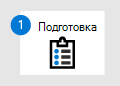](prepare-mtpeval.md) [Этап 1. ПодготовкаPhase 1: Prepare](prepare-mtpeval.md) |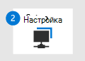 Этап 2. НастройкаPhase 2: Set up | [Этап 3. ВетвьPhase 3: Onboard](config-mtpeval.md) |  [Вернуться к пилотной книгеBack to pilot playbook](mtp-pilot.md) |
|--|--|--|--|
||*Вы здесь!**You are here!*  | | |

В настоящее время вы работаете на этапе настройка.You're currently in the set up phase. Сначала необходимо получить доступ к Центру безопасности Microsoft 365, а затем настроить пробную или пилотную среду.Take the initial steps to access Microsoft 365 Security Center then set up your trial lab or pilot environment.

Зарегистрируйте подписку на Office 365 или Azure Active Directory, чтобы создать клиент *.onmicrosoft.com,* который можно использовать для регистрации в вашей лицензии Microsoft 365 E5.Sign up for an Office 365 or Azure Active Directory subscription to generate a *.onmicrosoft.com* tenant that you can use to sign up for your Microsoft 365 E5 license. 

>[!NOTE]
>Если у вас уже есть подписка на Office 365 или Azure Active Directory, вы можете пропустить этапы создания пробной или пилотной подписки на Office 365 E5.If you already have an existing Office 365 or Azure Active Directory subscription, you can skip the Office 365 E5 trial or pilot tenant creation steps.

На этом этапе вы получите руководство по:In this phase, you'll be guided to:
- Создание пробного клиента Office 365 E5Create an Office 365 E5 trial tenant
- Включить пробную подписку на Microsoft 365Enable Microsoft 365 trial subscription

## Создание пробного клиента Office 365 E5Create an Office 365 E5 trial tenant
>[!NOTE]
>Если у вас уже есть подписка на Office 365 или Azure Active Directory, вы можете пропустить действия по созданию пробного клиента Office 365 E5.If you already have an existing Office 365 or Azure Active Directory subscription, you can skip the Office 365 E5 trial tenant creation steps.

1. Перейдите на портал [продуктов Office 365 E5](https://www.microsoft.com/microsoft-365/business/office-365-enterprise-e5-business-software?activetab=pivot%3aoverviewtab) и выберите **бесплатную пробную версия.**Go to the [Office 365 E5 product portal](https://www.microsoft.com/microsoft-365/business/office-365-enterprise-e5-business-software?activetab=pivot%3aoverviewtab) and select **Free trial**.

   
  
2. Завершите регистрацию пробной версия, введите свой адрес электронной почты (личный или корпоративный).Complete the trial registration by entering your email address (personal or corporate). Щелкните **"Настройка учетной записи".**Click **Set up account**.

   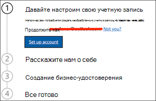

3. Уполномойте имя, фамилию, номер телефона, название компании, размер компании, страну или регион.Fill in your first name, last name, business phone number, company name, company size, and country or region.  

   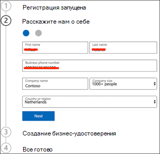
   
   > [!NOTE]
   > Страна или регион, которые вы здесь настроили, определяет регион центра обработки данных, в который будет работать Office 365.The country or region you set here determines the data center region your Office 365 will be hosted.
  
4. Выберите параметр проверки: с помощью текстового сообщения или звонка.Choose your verification preference: through a text message or call. Щелкните **"Отправить код проверки".**Click **Send Verification Code**. 

   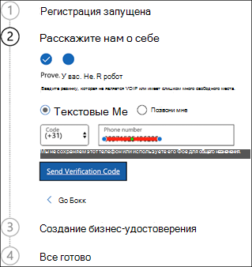

5. Задайте имя пользовательского домена для клиента, а затем нажмите кнопку **"Далее".**Set the custom domain name for your tenant, then click **Next**.

   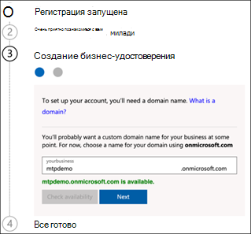
 
6. Настроить первое удостоверение, которое будет глобальным администратором клиента.Set up the first identity, which will be a Global Administrator for the tenant. В заполните **имя** и **пароль.**Fill in **Name** and **Password**. Нажмите кнопку **Зарегистрироваться**.Click **Sign up**.

   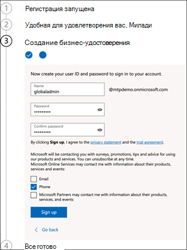

7. Нажмите **кнопку "Перейти к** установке", чтобы завершить настройку пробного клиента Office 365 E5.Click **Go to Setup** to complete the Office 365 E5 trial tenant provisioning.

   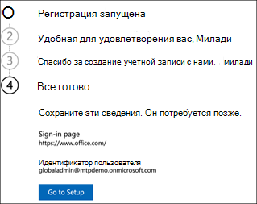

8. Подключите корпоративный домен к клиенту Office 365.Connect your corporate domain to the Office 365 tenant. [Необязательно] Choose **Connect a domain you already own** and type in your domain name.[Optional] Choose **Connect a domain you already own** and type in your domain name. Нажмите **Далее**.Click **Next**.

   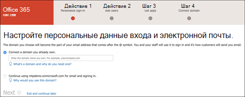
 
9. Добавьте запись TXT или MX, чтобы проверить владение доменом.Add a TXT or MX record to validate the domain ownership. После того как вы добавите запись TXT или MX в свой домен, выберите **"Проверить".**Once you’ve added the TXT or MX record to your domain, select **Verify**.

   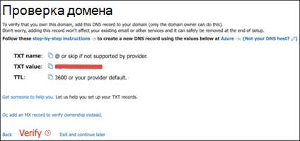
 
10. [Необязательно] Создайте дополнительные учетные записи пользователей для своего клиента.[Optional] Create more user accounts for your tenant. Вы можете пропустить этот шаг, нажав кнопку **"Далее".**You can skip this step by clicking **Next**.

    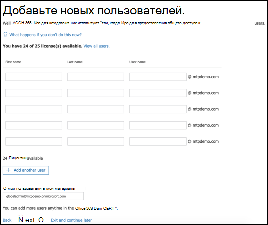
 
11. [Необязательно] Скачайте приложения Office.[Optional] Download Office apps. Нажмите **кнопку** "Далее", чтобы пропустить этот шаг.Click **Next** to skip this step. 

    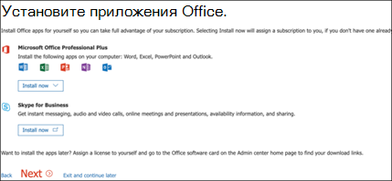

12. [Необязательно] Перенос сообщений электронной почты.[Optional] Migrate email messages. Опять же, этот шаг можно пропустить.Again, you can skip this step.

    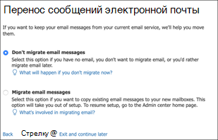
 
13. Выберите веб-службы.Choose online services. Выберите **Exchange** и нажмите **кнопку "Далее".**Select **Exchange** and click **Next**. 

    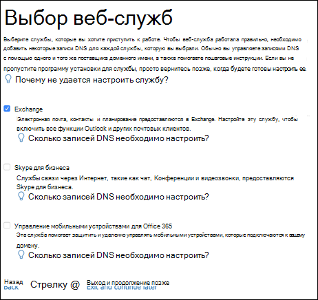

14. Добавьте записи MX, CNAME и TXT в свой домен.Add MX, CNAME, and TXT records to your domain. По завершению выберите **"Проверить".**When completed, select **Verify**.

    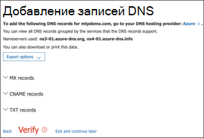
 
15. Поздравляем, вы завершили подготовка клиента Office 365.Congratulations, you have completed the provisioning of your Office 365 tenant.

    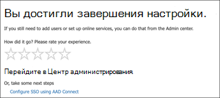

## Включить пробную подписку на Microsoft 365Enable Microsoft 365 trial subscription

>[!NOTE]
>При регистрации на пробной подписке вы можете использовать 25 пользовательских лицензий в течение месяца.Signing up for a trial gives you 25 user licenses to use for a month. Дополнительные сведения см. в сведениях о подписке [На M365](https://docs.microsoft.com/microsoft-365/commerce/try-or-buy-microsoft-365#try-or-buy-a-microsoft-365-subscription-1) try или Buy.See [Try or Buy an M365 subscription](https://docs.microsoft.com/microsoft-365/commerce/try-or-buy-microsoft-365#try-or-buy-a-microsoft-365-subscription-1) for details.

1. В [Центре администрирования Microsoft 365](https://admin.microsoft.com/)щелкните **"Выставление счета",** а затем перейдите в **"Приобретение служб".**From [Microsoft 365 Admin Center](https://admin.microsoft.com/), click **Billing** and then navigate to **Purchase services**.

2. Выберите **Microsoft 365 E5 и** нажмите кнопку **"Начать бесплатную пробную версия".**Select **Microsoft 365 E5** and click **Start free trial**. 

   

3. Выберите параметр проверки: с помощью текстового сообщения или звонка.Choose your verification preference: through a text message or call. После того как вы решили, введите номер телефона, выберите **"Текст"** или **"Позвонить мне"** в зависимости от выбранного вами выбора.Once you have decided, enter the phone number, select **Text me** or **Call me** depending on your selection.

   
 
4. Введите код проверки и нажмите **кнопку "Начать бесплатную пробную проверку".**Enter the verification code and click **Start your free trial**.

   

5. Нажмите **кнопку "Попробовать",** чтобы подтвердить пробную версия Microsoft 365 E5.Click **Try now** to confirm your Microsoft 365 E5 trial.

   
 
6. Перейдите к активным пользователям Центра администрирования **Microsoft 365.**  >    >  Go to the **Microsoft 365 Admin Center** > **Users** > **Active users**. Выберите свою учетную запись пользователя, **выберите**"Управление лицензиями на продукты" и замените лицензию с Office 365 E5 на **Microsoft 365 E5.**Select your user account, select **Manage product licenses**, then swap the license from Office 365 E5 to **Microsoft 365 E5**. Нажмите кнопку **Сохранить**.Click **Save**.

   
 
7. Снова выберите учетную запись глобального администратора, а затем нажмите кнопку **"Управление иным пользователем".**Select the global administrator account again then click **Manage username**.

   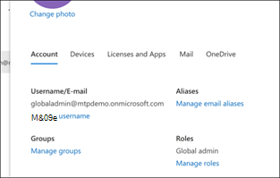

8. [Необязательно] Измените домен с *onmicrosoft.com* на собственный домен в зависимости от того, что вы выбрали на предыдущих шагах.[Optional] Change the domain from *onmicrosoft.com* to your own domain—depending on what you chose on the previous steps. Нажмите кнопку **Сохранить изменения**.Click **Save changes**.

   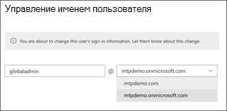

## Следующий этапNext step
|[Этап 3. Настройка & в &Phase 3: Configure & Onboard](config-mtpeval.md) | Настройте каждый компонент Microsoft 365 Defender для пробной или пилотной среды Защитника Microsoft 365, а также подстройте конечные точки.Configure each Microsoft 365 Defender pillar for your Microsoft 365 Defender trial lab or pilot environment and onboard your endpoints.
|:-------|:-----|
