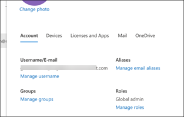

# Настройка среды пробной лаборатории Microsoft 365 DefenderSet up your Microsoft 365 Defender trial lab environment 

[!INCLUDE [Microsoft 365 Defender rebranding](../includes/microsoft-defender.md)]

**Область применения:****Applies to:**
- Microsoft 365 DefenderMicrosoft 365 Defender 

Создание пробной лаборатории или пилотной среды Microsoft 365 Defender и ее развертывание — это трех этапный процесс:Creating a Microsoft 365 Defender trial lab or pilot environment and deploying it is a three-phase process:

| [Этап 1. ПодготовкаPhase 1: Prepare](prepare-mtpeval.md) | Этап 2. НастройкаPhase 2: Set up | [Этап 3. На бортуPhase 3: Onboard](config-mtpeval.md) |  [Вернуться к экспериментальной книге воспроизведенияBack to pilot playbook](mtp-pilot.md) |
|--|--|--|--|
||*Вы здесь!**You are here!*  | | |

Вы в настоящее время на этапе настройка.You're currently in the set up phase. Сначала необходимо получить доступ к Центру безопасности Microsoft 365, а затем настроить пробную лабораторию или пилотную среду.Take the initial steps to access Microsoft 365 Security Center then set up your trial lab or pilot environment.

Зарегистрируйся для подписки На Office 365 или Azure Active Directory, чтобы создать *клиент .onmicrosoft.com,* который можно использовать для регистрации на лицензию Microsoft 365 E5.Sign up for an Office 365 or Azure Active Directory subscription to generate a *.onmicrosoft.com* tenant that you can use to sign up for your Microsoft 365 E5 license. 

>[!NOTE]
>Если у вас уже есть существующая подписка На Office 365 или Azure Active Directory, вы можете пропустить пробные или пилотные этапы создания клиента Office 365 E5.If you already have an existing Office 365 or Azure Active Directory subscription, you can skip the Office 365 E5 trial or pilot tenant creation steps.

На этом этапе вы будете руководствоваться:In this phase, you'll be guided to:
- Создание клиентского пробного клиента Office 365 E5Create an Office 365 E5 trial tenant
- Включить пробную подписку Microsoft 365Enable Microsoft 365 trial subscription

## Создание клиентского пробного клиента Office 365 E5Create an Office 365 E5 trial tenant
>[!NOTE]
>Если у вас уже есть существующая подписка На Office 365 или Azure Active Directory, можно пропустить этапы создания пробных клиентов Office 365 E5.If you already have an existing Office 365 or Azure Active Directory subscription, you can skip the Office 365 E5 trial tenant creation steps.

1. Перейдите на [портал продуктов Office 365 E5 и](https://www.microsoft.com/microsoft-365/business/office-365-enterprise-e5-business-software?activetab=pivot%3aoverviewtab) выберите **бесплатную пробную версия**.Go to the [Office 365 E5 product portal](https://www.microsoft.com/microsoft-365/business/office-365-enterprise-e5-business-software?activetab=pivot%3aoverviewtab) and select **Free trial**.

   
  
2. Завершите пробную регистрацию, введите свой адрес электронной почты (личный или корпоративный).Complete the trial registration by entering your email address (personal or corporate). Нажмите **кнопку Настройка учетной записи**.Click **Set up account**.

   

3. Заполните имя, фамилию, номер бизнес-телефона, имя компании, размер компании и страну или регион.Fill in your first name, last name, business phone number, company name, company size, and country or region.  

   
   
   > [!NOTE]
   > Страна или регион, который вы здесь застроили, определяет регион центра обработки данных, в который будет хозяйно работать Office 365.The country or region you set here determines the data center region your Office 365 will be hosted.
  
4. Выберите свое предпочтение проверки: через текстовое сообщение или вызов.Choose your verification preference: through a text message or call. Нажмите **кнопку Отправить код проверки**.Click **Send Verification Code**. 

   

5. Установите настраиваемую доменную фамилию для клиента, а затем нажмите **кнопку Далее**.Set the custom domain name for your tenant, then click **Next**.

   
 
6. Настройка первого удостоверения, которое будет глобальным администратором для клиента.Set up the first identity, which will be a Global Administrator for the tenant. Заполните **имя и** **пароль.**Fill in **Name** and **Password**. Нажмите кнопку **Зарегистрироваться**.Click **Sign up**.

   

7. Нажмите **кнопку Перейти к настройке,** чтобы завершить подготовка клиента для пробного клиента Office 365 E5.Click **Go to Setup** to complete the Office 365 E5 trial tenant provisioning.

   

8. Подключите корпоративный домен к клиенту Office 365.Connect your corporate domain to the Office 365 tenant. [Необязательный] Выберите **Подключение домена, который вы уже имеете,** и введите в доменном имени.[Optional] Choose **Connect a domain you already own** and type in your domain name. Нажмите кнопку **Далее**.Click **Next**.

   
 
9. Добавьте запись TXT или MX для проверки владения доменом.Add a TXT or MX record to validate the domain ownership. После того как вы добавите запись TXT или MX в свой домен, выберите **Проверить**.Once you’ve added the TXT or MX record to your domain, select **Verify**.

   
 
10. [Необязательный] Создайте дополнительные учетные записи пользователей для клиента.[Optional] Create more user accounts for your tenant. Этот шаг можно пропустить, нажав **кнопку Далее.**You can skip this step by clicking **Next**.

    
 
11. [Необязательный] Скачайте приложения Office.[Optional] Download Office apps. Нажмите **кнопку Далее,** чтобы пропустить этот шаг.Click **Next** to skip this step. 

    

12. [Необязательный] Перенос сообщений электронной почты.[Optional] Migrate email messages. Опять же, вы можете пропустить этот шаг.Again, you can skip this step.

    
 
13. Выберите онлайн-службы.Choose online services. Выберите **Exchange** и нажмите **кнопку Далее**.Select **Exchange** and click **Next**. 

    

14. Добавьте записи MX, CNAME и TXT в домен.Add MX, CNAME, and TXT records to your domain. После завершения выберите **Проверить**.When completed, select **Verify**.

    
 
15. Поздравляем, вы завершили подготовка клиента Office 365.Congratulations, you have completed the provisioning of your Office 365 tenant.

    

## Включить пробную подписку Microsoft 365Enable Microsoft 365 trial subscription

>[!NOTE]
>Регистрация для пробной пробной записи дает вам 25 лицензий пользователей, которые можно использовать в течение месяца.Signing up for a trial gives you 25 user licenses to use for a month. Дополнительные [сведения см. в материале Try or Buy an M365 subscription.](../../commerce/try-or-buy-microsoft-365.md#try-or-buy-a-microsoft-365-subscription-1)See [Try or Buy an M365 subscription](../../commerce/try-or-buy-microsoft-365.md#try-or-buy-a-microsoft-365-subscription-1) for details.

1. Из [Центра администрирования Microsoft 365](https://admin.microsoft.com/)щелкните **Биллинг** и перейдите к **службам покупки.**From [Microsoft 365 Admin Center](https://admin.microsoft.com/), click **Billing** and then navigate to **Purchase services**.

2. Выберите **Microsoft 365 E5** и нажмите **кнопку Начните бесплатную пробную версия**.Select **Microsoft 365 E5** and click **Start free trial**. 

   

3. Выберите свое предпочтение проверки: через текстовое сообщение или вызов.Choose your verification preference: through a text message or call. После того как вы решили, введите номер телефона, выберите **текст меня** или **позвоните** мне в зависимости от выбора.Once you have decided, enter the phone number, select **Text me** or **Call me** depending on your selection.

   
 
4. Введите код проверки и **нажмите кнопку Начните бесплатную пробную проверку.**Enter the verification code and click **Start your free trial**.

   

5. Нажмите **кнопку Попробуйте** сейчас подтвердить пробную запись Microsoft 365 E5.Click **Try now** to confirm your Microsoft 365 E5 trial.

   
 
6. Перейдите к **активным пользователям Центра администрирования Microsoft 365.**  >    >  Go to the **Microsoft 365 Admin Center** > **Users** > **Active users**. Выберите учетную запись пользователя, **выберите управление** лицензиями на продукты, а затем смените лицензию с Office 365 E5 на **Microsoft 365 E5.**Select your user account, select **Manage product licenses**, then swap the license from Office 365 E5 to **Microsoft 365 E5**. Щелкните **Сохранить**.Click **Save**.

   
 
7. Выберите глобальную учетную запись администратора и нажмите **кнопку Управление иным пользователем.**Select the global administrator account again then click **Manage username**.

   

8. [Необязательный] Измените домен с *onmicrosoft.com* на собственный домен в зависимости от того, что вы выбрали на предыдущих действиях.[Optional] Change the domain from *onmicrosoft.com* to your own domain—depending on what you chose on the previous steps. Нажмите кнопку **Сохранить изменения**.Click **Save changes**.

   

## Следующий шагNext step
|[Этап 3. Настройка & на бортуPhase 3: Configure & Onboard](config-mtpeval.md) | Настройте каждый столб Microsoft 365 Defender для пробной лаборатории Или пилотной среды Защитника Microsoft 365 и на борту конечных точек.Configure each Microsoft 365 Defender pillar for your Microsoft 365 Defender trial lab or pilot environment and onboard your endpoints.
|:-------|:-----|