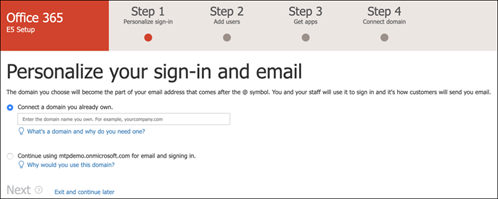

# Настройка тестовой лабораторной среды Microsoft 365 Defender 

[!INCLUDE [Microsoft 365 Defender rebranding](../includes/microsoft-defender.md)]

**Область применения:**
- Microsoft 365 Defender 

Создание пробной лабораторной или пилотной среды Microsoft 365 Defender и ее развертывание — это трех этапов:

| [Этап 1. Подготовка](prepare-mtpeval.md) | Этап 2. Настройка | [Этап 3. Ветвь](config-mtpeval.md) |  [Вернуться к пилотной книге](mtp-pilot.md) |
|--|--|--|--|
||*Вы здесь!*  | | |

В настоящее время вы работаете на этапе настройка. Сначала необходимо получить доступ к Центру безопасности Microsoft 365, а затем настроить пробную или пилотную среду.

Зарегистрируйте подписку на Office 365 или Azure Active Directory, чтобы создать клиент *.onmicrosoft.com,* который можно использовать для регистрации в вашей лицензии Microsoft 365 E5. 

>[!NOTE]
>Если у вас уже есть подписка на Office 365 или Azure Active Directory, вы можете пропустить этапы создания пробной или пилотной подписки на Office 365 E5.

На этом этапе вы получите руководство по:
- Создание пробного клиента Office 365 E5
- Включить пробную подписку на Microsoft 365

## Создание пробного клиента Office 365 E5
>[!NOTE]
>Если у вас уже есть подписка на Office 365 или Azure Active Directory, вы можете пропустить действия по созданию пробного клиента Office 365 E5.

1. Перейдите на портал [продуктов Office 365 E5](https://www.microsoft.com/microsoft-365/business/office-365-enterprise-e5-business-software?activetab=pivot%3aoverviewtab) и выберите **бесплатную пробную проверку.**

   
  
2. Завершите регистрацию пробного номера, введите свой адрес электронной почты (личный или корпоративный). Щелкните **"Настройка учетной записи".**

   

3. Уполномойте имя, фамилию, номер телефона, название компании, размер компании, страну или регион.  

   
   
   > [!NOTE]
   > Страна или регион, которые вы здесь настроили, определяет регион центра обработки данных, в который будет работать Office 365.
  
4. Выберите параметр проверки: с помощью текстового сообщения или звонка. Щелкните **"Отправить код проверки".** 

   

5. Задайте имя пользовательского домена для клиента, а затем нажмите кнопку **"Далее".**

   
 
6. Настроить первое удостоверение, которое будет глобальным администратором клиента. В заполните **имя** и **пароль.** Нажмите кнопку **Зарегистрироваться**.

   

7. Нажмите **кнопку "Перейти к** установке", чтобы завершить настройку пробного клиента Office 365 E5.

   

8. Подключите корпоративный домен к клиенту Office 365. [Необязательно] Choose **Connect a domain you already own** and type in your domain name. Нажмите кнопку **Далее**.

   
 
9. Добавьте запись TXT или MX, чтобы проверить владение доменом. После того как вы добавите запись TXT или MX в свой домен, выберите **"Проверить".**

   
 
10. [Необязательно] Создайте дополнительные учетные записи пользователей для своего клиента. Вы можете пропустить этот шаг, нажав кнопку **"Далее".**

    
 
11. [Необязательно] Скачайте приложения Office. Нажмите **кнопку** "Далее", чтобы пропустить этот шаг. 

    

12. [Необязательно] Перенос сообщений электронной почты. Опять же, этот шаг можно пропустить.

    
 
13. Выберите веб-службы. Выберите **Exchange** и нажмите **кнопку "Далее".** 

    

14. Добавьте записи MX, CNAME и TXT в свой домен. По завершению выберите **"Проверить".**

    
 
15. Поздравляем, вы завершили подготовка клиента Office 365.

    

## Включить пробную подписку на Microsoft 365

>[!NOTE]
>При регистрации на пробной подписке вы можете использовать 25 пользовательских лицензий в течение месяца. Дополнительные сведения см. в сведениях о подписке [На M365](https://docs.microsoft.com/microsoft-365/commerce/try-or-buy-microsoft-365#try-or-buy-a-microsoft-365-subscription-1) try или Buy.

1. В [Центре администрирования Microsoft 365](https://admin.microsoft.com/)щелкните **"Выставление счета",** а затем перейдите в **"Приобретение служб".**

2. Выберите **Microsoft 365 E5 и** нажмите кнопку **«Начать бесплатную пробную».** 

   

3. Выберите параметр проверки: с помощью текстового сообщения или звонка. После того как вы решили, введите номер телефона, выберите **"Текст"** или **"Позвонить мне"** в зависимости от выбранного вами выбора.

   
 
4. Введите код проверки и нажмите **кнопку "Начать бесплатную пробную проверку".**

   

5. Нажмите **кнопку "Попробовать",** чтобы подтвердить пробную версия Microsoft 365 E5.

   
 
6. Перейдите к активным пользователям Центра администрирования **Microsoft 365.**  >    >   Выберите свою учетную запись пользователя, **выберите**"Управление лицензиями на продукты" и замените лицензию с Office 365 E5 на **Microsoft 365 E5.** Щелкните **Сохранить**.

   
 
7. Снова выберите учетную запись глобального администратора и нажмите кнопку **"Управление иным пользователем".**

   

8. [Необязательно] Измените домен с *onmicrosoft.com* на собственный домен в зависимости от того, что вы выбрали на предыдущих шагах. Нажмите кнопку **Сохранить изменения**.

   

## Следующий этап
|[Этап 3. Настройка & в &](config-mtpeval.md) | Настройте каждый компонент Microsoft 365 Defender для пробной или пилотной среды Защитника Microsoft 365, а также подстройте конечные точки.
|:-------|:-----|
