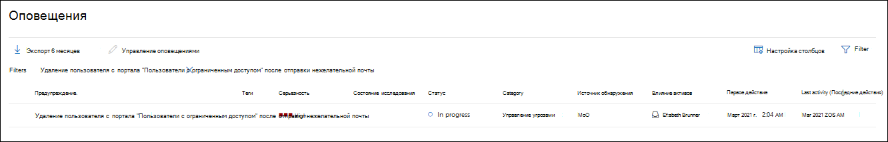
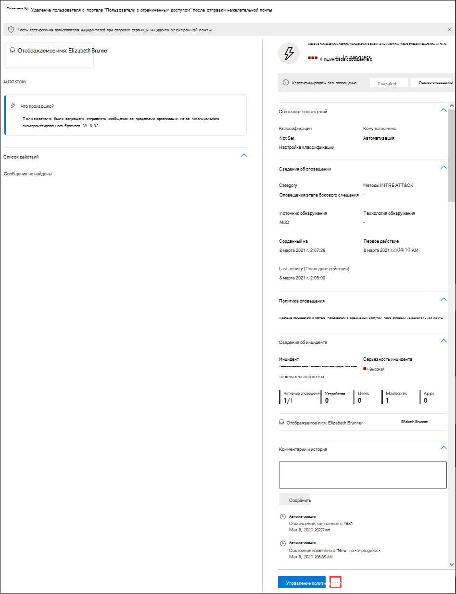

# Адрес скомпрометировать учетные записи пользователей с помощью автоматического расследования и ответаAddress compromised user accounts with automated investigation and response

**Область применения****Applies to**
- [Exchange Online ProtectionExchange Online Protection](exchange-online-protection-overview.md)
- [Microsoft Defender для Office 365 (план 1 и план 2)Microsoft Defender for Office 365 plan 1 and plan 2](defender-for-office-365.md)
- [Microsoft 365 DefenderMicrosoft 365 Defender](../defender/microsoft-365-defender.md)

[Microsoft Defender для Office 365 Plan 2](defender-for-office-365.md#microsoft-defender-for-office-365-plan-1-and-plan-2) включает в себя мощные возможности автоматического расследования [и](office-365-air.md) ответа (AIR).[Microsoft Defender for Office 365 Plan 2](defender-for-office-365.md#microsoft-defender-for-office-365-plan-1-and-plan-2) includes powerful [automated investigation and response](office-365-air.md) (AIR) capabilities. Такие возможности могут сэкономить группе операций безопасности много времени и усилий, чтобы справиться с угрозами.Such capabilities can save your security operations team a lot of time and effort dealing with threats. Корпорация Майкрософт продолжает улучшать возможности безопасности.Microsoft continues to improve security capabilities. Недавно возможности AIR были расширены, чтобы включить скомпрометированную книгу безопасности пользователей (в настоящее время в предварительном просмотре).Recently, AIR capabilities were enhanced to include a compromised user security playbook (currently in preview). Ознакомьтесь с этой статьей, чтобы узнать больше о скомпрометированной книге безопасности пользователей.Read this article to learn more about the compromised user security playbook. Дополнительные сведения см. в записи блога Speed [up time to detect and respond to user compromise and limit breach scope with Microsoft Defender for Office 365.](https://techcommunity.microsoft.com/t5/Security-Privacy-and-Compliance/Speed-up-time-to-detect-and-respond-to-user-compromise-and-limit/ba-p/977053)And see the blog post [Speed up time to detect and respond to user compromise and limit breach scope with Microsoft Defender for Office 365](https://techcommunity.microsoft.com/t5/Security-Privacy-and-Compliance/Speed-up-time-to-detect-and-respond-to-user-compromise-and-limit/ba-p/977053) for additional details.

Скомпрометированная книга безопасности пользователей позволяет группе безопасности вашей организации:The compromised user security playbook enables your organization's security team to:

- Ускорение обнаружения скомпрометированных учетных записей пользователей;Speed up detection of compromised user accounts;
- Ограничение масштабов нарушения при взломе учетной записи; иLimit the scope of a breach when an account is compromised; and
- Реагировать на скомпрометированную пользователей более эффективно и эффективно.Respond to compromised users more effectively and efficiently.

## Скомпрометированная оповещений пользователейCompromised user alerts

При взломе учетной записи пользователя возникают нетипичные или аномальные действия.When a user account is compromised, atypical or anomalous behaviors occur. Например, фишинговые и спам-сообщения могут отправляться внутренне из доверенного учетного записи пользователя.For example, phishing and spam messages might be sent internally from a trusted user account. Защитник для Office 365 может обнаруживать такие аномалии в шаблонах электронной почты и совместной деятельности в Office 365.Defender for Office 365 can detect such anomalies in email patterns and collaboration activity within Office 365. Когда это произойдет, срабатывает оповещение и начинается процесс смягчения угрозы.When this happens, alerts are triggered, and the threat mitigation process begins.

Например, вот предупреждение, которое было вызвано из-за подозрительной отправки электронной почты:For example, here's an alert that was triggered because of suspicious email sending:

И вот пример оповещения, срабатываемого при ограничении отправки для пользователя:And here's an example of an alert that was triggered when a sending limit was reached for a user:

## Исследование и реагирование на скомпрометированного пользователяInvestigate and respond to a compromised user

При взломе учетной записи пользователя срабатывает оповещение.When a user account is compromised, alerts are triggered. В некоторых случаях эта учетная запись пользователя блокируется и не может отправлять дополнительные сообщения электронной почты до тех пор, пока проблема не будет устранена командой операций безопасности организации.And in some cases, that user account is blocked and prevented from sending any further email messages until the issue is resolved by your organization's security operations team. В других случаях начинается автоматическое расследование, которое может привести к рекомендуемые действия, которые должна принять ваша группа безопасности.In other cases, an automated investigation begins which can result in recommended actions that your security team should take.

- [Просмотр и исследование пользователей с ограниченным доступомView and investigate restricted users](#view-and-investigate-restricted-users)

- [Просмотр сведений об автоматизированных расследованияхView details about automated investigations](#view-details-about-automated-investigations)

> [!IMPORTANT]
> Для выполнения следующих задач необходимо иметь соответствующие разрешения.You must have appropriate permissions to perform the following tasks. См. [необходимые разрешения на использование возможностей AIR.](office-365-air.md#required-permissions-to-use-air-capabilities)See [Required permissions to use AIR capabilities](office-365-air.md#required-permissions-to-use-air-capabilities).

### Просмотр и исследование пользователей с ограниченным доступомView and investigate restricted users

У вас есть несколько вариантов для навигации по списку ограниченных пользователей.You have a few options for navigating to a list of restricted users. Например, на портале Microsoft 365 Defender вы можете перейти к электронной почте & **обзор** \>  \> **ограниченных пользователей**.For example, in the Microsoft 365 Defender portal, you can go to **Email & collaboration** \> **Review** \> **Restricted Users**. В следующей процедуре  описывается навигация с помощью панели оповещений, которая является хорошим способом для наблюдения за различными видами оповещений, которые могли быть срабатывания.The following procedure describes navigation using the **Alerts** dashboard, which is a good way to see various kinds of alerts that might have been triggered.

1. Откройте портал Microsoft 365 Defender () и перейдите к & <https://security.microsoft.com> **оповещений.** \> Open the Microsoft 365 Defender portal (<https://security.microsoft.com>) and go to **Incidents & alerts** \> **Alerts**. Или, чтобы перейти непосредственно на страницу **Оповещений,** используйте <https://security.microsoft.com/alerts> .Or, to go directly to the **Alerts** page, use <https://security.microsoft.com/alerts>.

2. На странице **Оповещений** фильтруем результаты по времени, а политика с именем **User ограничена отправкой электронной почты.**On the **Alerts** page, filter the results by time period and the policy named **User restricted from sending email**.

   

3. Если вы выберите запись, нажав  на имя, пользователь, ограниченный отправкой страницы электронной почты, откроет дополнительные сведения для просмотра.If you select the entry by clicking on the name, a **User restricted from sending email** page opens with additional details for you to review. Рядом с кнопкой **Управление** оповещением можно нажать значок Дополнительные параметры Дополнительные параметры, а затем выбрать Просмотр ограниченных пользовательских сведений, чтобы перейти на страницу Ограниченные пользователи, где можно освободить пользователя с ограниченным   [доступом](removing-user-from-restricted-users-portal-after-spam.md).  Next to the **Manage alert** button, you can click  **More options** and then select **View restricted user details** to go to the **Restricted users** page, where you can [release the restricted user](removing-user-from-restricted-users-portal-after-spam.md).

   

### Просмотр сведений об автоматизированных расследованияхView details about automated investigations

После начала автоматического расследования вы можете увидеть его сведения и результаты в Центре & соответствия требованиям.When an automated investigation has begun, you can see its details and results in the Security & Compliance Center. Перейдите **к исследованиям** управления \> **угрозами,** а затем выберите исследование, чтобы просмотреть его сведения.Go to **Threat management** \> **Investigations**, and then select an investigation to view its details.

Дополнительные сведения [см. в материале Просмотр сведений о расследовании.](air-view-investigation-results.md)To learn more, see [View details of an investigation](air-view-investigation-results.md).

## Имейте в виду следующие точкиKeep the following points in mind

- **Оставайтесь на вершине оповещений.****Stay on top of your alerts**. Как известно, чем дольше компромисс не будет найден, тем больше вероятность широкого воздействия и затрат для организации, клиентов и партнеров.As you know, the longer a compromise goes undetected, the larger the potential for widespread impact and cost to your organization, customers, and partners. Раннее обнаружение и своевременное реагирование имеют решающее значение для смягчения угроз, особенно при взломе учетной записи пользователя.Early detection and timely response are critical to mitigate threats, and especially when a user's account is compromised.

- **Автоматизация помогает, но не заменяет команду** операций безопасности.**Automation assists, but does not replace, your security operations team**. Возможности автоматического расследования и реагирования могут обнаруживать скомпрометированного пользователя на ранних стадиях, но вашей группе операций безопасности, скорее всего, потребуется привлечь и сделать некоторое исследование и исправление.Automated investigation and response capabilities can detect a compromised user early on, but your security operations team will likely need to engage and do some investigation and remediation. Нужна помощь в этом?Need some help with this? См. [обзор и утверждение действий.](air-review-approve-pending-completed-actions.md)See [Review and approve actions](air-review-approve-pending-completed-actions.md).

- **Не полагаться на подозрительное оповещение входа как единственный индикатор**.**Don't rely on a suspicious login alert as your only indicator**. Если учетная запись пользователя скомпрометирована, она может вызвать или не вызвать подозрительное оповещение о входе.When a user account is compromised, it might or might not trigger a suspicious login alert. Иногда это серия действий, которые происходят после взлома учетной записи, которая вызывает оповещение.Sometimes it's the series of activities that occur after an account is compromised that triggers an alert. Хотите узнать больше о оповещениях?Want to know more about alerts? См. [политики оповещения.](../../compliance/alert-policies.md)See [Alert policies](../../compliance/alert-policies.md).

## Дальнейшие действияNext steps

- [Просмотр необходимых разрешений для использования возможностей AIRReview the required permissions to use AIR capabilities](office-365-air.md#required-permissions-to-use-air-capabilities)

- [Поиск и расследование вредоносной электронной почты в Office 365Find and investigate malicious email in Office 365](investigate-malicious-email-that-was-delivered.md)

- [Узнайте о AIR в Microsoft Defender для конечной точкиLearn about AIR in Microsoft Defender for Endpoint](/windows/security/threat-protection/microsoft-defender-atp/automated-investigations)

- [Посетите дорожную карту Microsoft 365, чтобы узнать, что будет в ближайшее время, и выйтиVisit the Microsoft 365 Roadmap to see what's coming soon and rolling out](https://www.microsoft.com/microsoft-365/roadmap?filters=)