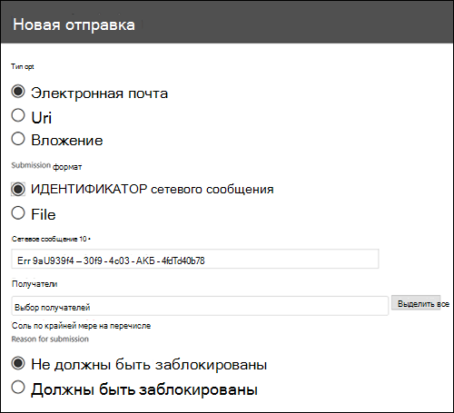
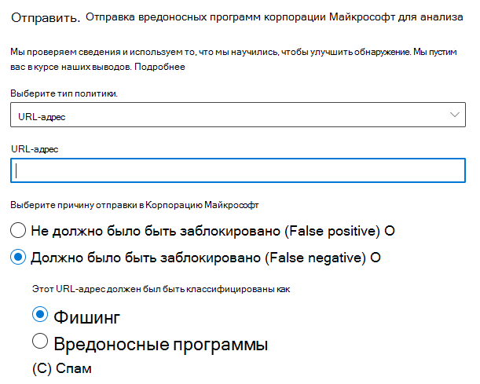
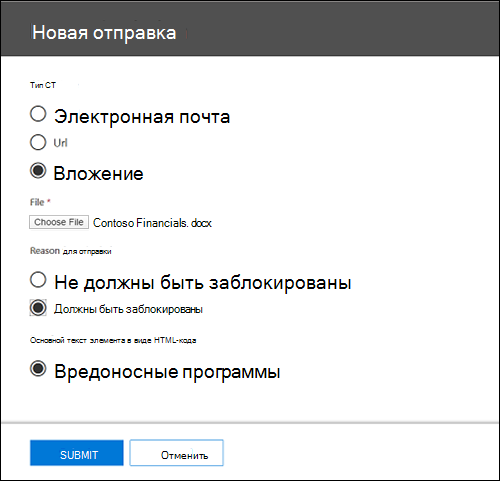
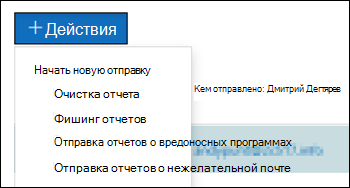

# Использование функции отправки администратором для отправки подозрительного спама, фишинговых сообщений, URL-адресов и файлов в корпорацию МайкрософтUse Admin Submission to submit suspected spam, phish, URLs, and files to Microsoft

В организациях Microsoft 365 с почтовыми ящиками в Exchange Online администраторы могут использовать портал отправки в центре безопасности & соответствия требованиям для отправки электронных сообщений, URL-адресов и вложений в корпорацию Майкрософт для сканирования.In Microsoft 365 organizations with mailboxes in Exchange Online, admins can use the Submissions portal in the Security & Compliance Center to submit email messages, URLs, and attachments to Microsoft for scanning.

При отсылке сообщения электронной почты вы получите сведения о политиках, которые могут разрешить входящую электронную почту в клиент, а также о том, как все URL-адреса и вложения в почте.When you submit an email, you will get information about any policies that may have allowed the incoming email into your tenant, as well as examination of any URLs and attachments in the mail. Политики, которые могут разрешить почту, включают список надежных отправителей отдельного пользователя, а также политики уровня клиента, такие как правила для обработки почты Exchange (также называемые правилами транспорта).Policies that may have allowed a mail include an individual user's safe sender list as well as tenant level policies such as Exchange mail flow rules (also known as transport rules).

Другие способы отправки сообщений электронной почты, URL-адресов и вложений в корпорацию Майкрософт приведены [в статье сообщения отчетов и файлы в корпорацию Майкрософт](report-junk-email-messages-to-microsoft.md).For other ways to submit email messages, URLs, and attachments to Microsoft, see [Report messages and files to Microsoft](report-junk-email-messages-to-microsoft.md).

## Что нужно знать перед началом работыWhat do you need to know before you begin?

- Откройте Центр безопасности и соответствия требованиям по ссылке <https://protection.office.com/>.You open the Security & Compliance Center at <https://protection.office.com/>. Чтобы перейти непосредственно на страницу **отправки** , используйте <https://protection.office.com/reportsubmission> .To go directly to the **Submission** page, use <https://protection.office.com/reportsubmission>.

- Чтобы вы могли выполнить эти процедуры, вам должны быть назначены соответствующие разрешения.You need to be assigned permissions before you can perform these procedures. Для добавления, изменения и удаления политик защиты от нежелательной почты необходимо быть участником группы ролей " **Управление организацией**", " **администратор безопасности**" или " **читатель безопасности** ".To add, modify, and delete anti-spam policies, you need to be a member of the **Organization Management**, **Security Administrator**, or **Security Reader** role groups. Дополнительные сведения о группах ролей в Центре безопасности и соответствия требованиям см. в статье [Разрешения в Центре безопасности и соответствия требованиям](permissions-in-the-security-and-compliance-center.md).For more information about role groups in the Security & Compliance Center, see [Permissions in the Security & Compliance Center](permissions-in-the-security-and-compliance-center.md).

- Для получения дополнительных сведений о том, как пользователи могут отсылать сообщения и файлы в корпорацию Майкрософт, просмотрите [сообщения отчетов и файлы в корпорацию Майкрософт](report-junk-email-messages-to-microsoft.md).For more information about how users can submit messages and files to Microsoft, see [Report messages and files to Microsoft](report-junk-email-messages-to-microsoft.md).

## Сообщить о подозрительном содержимом в корпорацию МайкрософтReport suspicious content to Microsoft

1. В центре безопасности & соответствия требованиям перейдите к разделу **Управление угрозами** \> **Обзор** \> **сообщений для отправки администратором**.In the Security & Compliance Center, go to **Threat management** \> **Review** \> **Admin submission messages**.

2. На открывшейся **странице "отправки"** нажмите кнопку **создать** .On the **Submissions** page that appears, click the **New submission** button.

3. Используйте всплывающее всплывающее окно **отправки** , которое появляется для отправки сообщения, URL-адреса или вложения, как описано в следующих разделах.Use **New submission** flyout that appears to submit the message, URL, or attachment as described in the following sections.

### Отправка сомнительных сообщений электронной почты в корпорацию МайкрософтSubmit a questionable email to Microsoft

1. В разделе **тип объекта** выберите **Электронная почта**.In the **Object type** section, select **Email**. В разделе **формат отправки** используйте один из следующих параметров:In the **Submission format** section, use one of the following options:

   - **Идентификатор сетевого сообщения**: это значение GUID, которое доступно в заголовке **X-MS-Exchange-Organization-Network-Message-ID** в сообщении.**Network Message ID**: This is a GUID value that's available in the **X-MS-Exchange-Organization-Network-Message-Id** header in the message.

   - **Файл**: нажмите кнопку **выбрать файл**.**File**: Click **Choose file**. В открывшемся диалоговом окне найдите и выберите файл. EML или. MSG, а затем нажмите кнопку **Открыть**.In the dialog that opens, find and select the .eml or .msg file, and then click **Open**.

2. В разделе **получатели** укажите одного или нескольких получателей, для которых необходимо выполнить проверку политики.In the **Recipients** section, specify one or more recipients that you would like to run a policy check against. Проверка политики определяет, пропускается ли сканирование сообщений электронной почты в соответствии с политиками пользователя или организации.The policy check will determine if the email bypassed scanning due to user or organization policies.

3. В разделе **Причина отправки** выберите один из следующих параметров:In the **Reason for submission** section, select one of the following options:

   - **Не должны быть заблокированы****Should not have been blocked**

   - **Должны быть заблокированы**: выберите **спам**, **Фишинг**или **вредоносная программа**.**Should have been blocked**: Select **Spam**, **Phishing**, or **Malware**. Если вы не уверены, используйте свои лучшие решения.If you're not sure, use your best judgment.

4. Если фильтр обходится из-за политик при отправке, вы увидите сведения об этой политике.If the filter was bypassed due to policies upon submission, you'll see information about that policy.

   Если фильтр не обходится из-за одной или нескольких политик, сканирование будет завершено через несколько минут.If the filter was not bypassed due to one or more policies, the scan will complete in several minutes. Вы увидите дополнительные сведения об отправке, щелкнув ссылку состояние.You'll see additional information about the submission by clicking on the status link. К ним относятся результаты проверки политики и вредоносности повторного сканирования.This includes the results of the policy check and the rescan verdict. Примечание Это не приводит к повторному выполнению электронной почты через стек полного фильтра Office 365 ATP, но выполняет частичное повторное сканирование, основанное на определенных атрибутах почты, URL-адреса или файла.Note this does not run the email through the Office 365 ATP full filtering stack again but runs a partial rescan based on certain attributes of the mail, URL, or file.

5. По завершении нажмите кнопку " **послать** ".When you're finished, click the **Submit** button.

### Отправка подозрительного URL-адреса корпорации МайкрософтSend a suspect URL to Microsoft

1. В разделе **тип объекта** выберите **URL-адрес**.In the **Object type** section, select **URL**. В появившемся поле введите полный URL-адрес (например, <https://www.fabrikam.com/marketing.html> ).In the box that appears, enter the full URL (for example, <https://www.fabrikam.com/marketing.html>).

2. В разделе **Причина отправки** выберите один из следующих параметров:In the **Reason for submission** section, select one of the following options:

   - **Не должны быть заблокированы****Should not have been blocked**

   - **Должны быть заблокированы**: выберите **Фишинг** или **вредоносную**программу.**Should have been blocked**: Select **Phishing** or **Malware**.

3. По завершении нажмите кнопку " **послать** ".When you're finished, click the **Submit** button.

### Передача подозреваемого файла в корпорацию МайкрософтSubmit a suspected file to Microsoft

1. В разделе **тип объекта** выберите **вложение**.In the **Object type** section, select **Attachment**.

2. Нажмите кнопку **выбрать файл**.Click **Choose File**. В открывшемся диалоговом окне найдите и выберите файл, а затем нажмите кнопку **Открыть**.In the dialog that opens, find and select the file, and then click **Open**.

3. В разделе **Причина отправки** выберите один из следующих параметров:In the **Reason for submission** section, select one of the following options:

   - **Не должны быть заблокированы****Should not have been blocked**

   - **Должны быть заблокированы**: **единственным** выбором и автоматически выбрано значение...**Should have been blocked**: **Malware** is the only choice, and is automatically selected..

4. По завершении нажмите кнопку " **послать** ".When you're finished, click the **Submit** button.

## Просмотр отправленных администратором сообщенийView admin submissions

1. В центре безопасности & соответствия требованиям перейдите к разделу **Управление угрозами** \> **Обзор** \> **сообщений для отправки администратором**.In the Security & Compliance Center, go to **Threat management** \> **Review** \> **Admin submission messages**.

2. На появившейся странице **отправки** убедитесь, что выбрана вкладка " **отправленные администратором** ".On the **Submissions** page that appears, verify that the **Admin submissions** tab is selected.

В верхней части страницы можно ввести дату начала, дату окончания и (по умолчанию) фильтровать по **идентификатору отправки** , указав значение в поле и нажав  .Near the top of the page, you can enter a start date, an end date, and (by default) you can filter by **Submission ID** by entering a value in the box and clicking . UpdateYou can enter multiple values separated by commas.

Чтобы изменить условия фильтра, нажмите кнопку " **идентификатор отправки** " и выберите одно из следующих значений:To change the filter criteria, click the **Submission ID** button and choose one of the following values:

- **Sender****Sender**
- **Тема/URL-адрес/имя файла****Subject/URL/File name**
- **Кем отправлено****Submitted by**
- **Тип отправки****Submission type**
- **Status****Status**

Чтобы экспортировать результаты, нажмите кнопку **Экспорт** в верхней части страницы, а затем выберите **данные диаграммы** или **Таблица**.To export the results, click **Export** near the top of the page and select **Chart data** or **Table**. В появившемся диалоговом окне сохраните CSV-файл.In the dialog that appears, save the .csv file.

Под диаграммой расположены три вкладки: **Электронная почта** (по умолчанию), **URL-адрес**и **вложение**.Below the graph, there are three tabs: **Email** (default), **URL**, and **Attachment**.

### Просмотр отправляемых по электронной почте сообщений администратораView admin email submissions

Перейдите на вкладку **Электронная почта** .Click the **Email** tab.

Можно нажать кнопку **Параметры столбца** в нижней части страницы, чтобы добавить или удалить столбцы из представления:You can click the **Column options** button near the bottom of the page to add or remove columns from the view:

- **Date****Date**
- **Идентификатор отправки****Submission ID**
- **Кем отправлено**\***Submitted by**\*
- **Тема**\***Subject**\*
- **Sender****Sender**
- **IP-адрес отправителя**\***Sender IP**\*
- **Тип отправки****Submission type**
- **Причина доставки****Delivery reason**
- **Состояние**\***Status**\*
- **Тип элемента управления****Control type**
- **Источник элемента управления****Control source**

  \*Если щелкнуть это значение, в всплывающем меню будет отображаться подробная информация.\* If you click this value, detailed information is displayed in a flyout.

### Просмотр отправок URL-адреса администратораView admin URL submissions

Перейдите на вкладку **URL-адрес** .Click the **URL** tab.

Можно нажать кнопку **Параметры столбца** в нижней части страницы, чтобы добавить или удалить столбцы из представления:You can click the **Column options** button near the bottom of the page to add or remove columns from the view:

- **Date****Date**
- **Идентификатор отправки****Submission ID**
- **Кем отправлено**\***Submitted by**\*
- **URL**\***URL**\*
- **Тип отправки****Submission type**
- **Состояние**\***Status**\*

  \*Если щелкнуть это значение, в всплывающем меню будет отображаться подробная информация.\* If you click this value, detailed information is displayed in a flyout.

### Просмотр отправки вложений администратораView admin attachment submissions

Перейдите на вкладку **вложения** .Click the **Attachments** tab.

Можно нажать кнопку **Параметры столбца** в нижней части страницы, чтобы добавить или удалить столбцы из представления:You can click the **Column options** button near the bottom of the page to add or remove columns from the view:

- **Date****Date**
- **Идентификатор отправки****Submission ID**
- **Кем отправлено**\***Submitted by**\*
- **Имя файла**\***File name**\*
- **Тип отправки****Submission type**
- **Состояние**\***Status**\*

  \*Если щелкнуть это значение, в всплывающем меню будет отображаться подробная информация.\* If you click this value, detailed information is displayed in a flyout.

## Просмотр отправленных пользователем данных в корпорацию МайкрософтView user submissions to Microsoft

Если вы развернули [надстройку "сообщение отчета](enable-the-report-message-add-in.md)" или используете [встроенные отчеты в Outlook в Интернете](report-junk-email-and-phishing-scams-in-outlook-on-the-web-eop.md), вы можете увидеть, какие пользователи будут создавать отчеты на вкладке " **Отправленные пользователем** ".If you've deployed the [Report Message add-in](enable-the-report-message-add-in.md), or people use the [built-in reporting in Outlook on the web](report-junk-email-and-phishing-scams-in-outlook-on-the-web-eop.md), you can see what users are reporting on the **User submissions** tab.

1. В центре безопасности & соответствия требованиям перейдите к разделу **Управление угрозами** \> **Обзор** \> **сообщений для отправки администратором**.In the Security & Compliance Center, go to **Threat management** \> **Review** \> **Admin submission messages**.

2. На появившейся странице **отправки** перейдите на вкладку " **Отправленные пользователем** ".On the **Submissions** page that appears, click the **User submissions** tab.

Можно нажать кнопку **Параметры столбца** в нижней части страницы, чтобы добавить или удалить столбцы из представления:You can click the **Column options** button near the bottom of the page to add or remove columns from the view:

- **Отправлено****Submitted on**
- **Кем отправлено**\***Submitted by**\*
- **Тема**\***Subject**\*
- **Sender****Sender**
- **IP-адрес отправителя**\***Sender IP**\*
- **Тип отправки****Submission type**

\*Если щелкнуть это значение, в всплывающем меню будет отображаться подробная информация.\* If you click this value, detailed information is displayed in a flyout.

В верхней части страницы можно ввести дату начала, дату окончания и (по умолчанию) фильтровать по **отправителю** , указав значение в поле и нажав  .Near the top of the page, you can enter a start date, an end date, and (by default) you can filter by **Sender** by entering a value in the box and clicking . UpdateYou can enter multiple values separated by commas.

Чтобы изменить условия фильтра, нажмите кнопку **отправитель** и выберите одно из следующих значений:To change the filter criteria, click the **Sender** button and choose one of the following values:

- **Домен отправителя****Sender domain**
- **Subject****Subject**
- **Кем отправлено****Submitted by**
- **Тип отправки****Submission type**
- **IP-адрес отправителя****Sender IP**

Чтобы экспортировать результаты, нажмите кнопку **Экспорт** в верхней части страницы, а затем выберите **данные диаграммы** или **Таблица**.To export the results, click **Export** near the top of the page and select **Chart data** or **Table**. В появившемся диалоговом окне сохраните CSV-файл.In the dialog that appears, save the .csv file.

## Просмотр отправленных пользователем данных в настраиваемый почтовый ящикView user submissions to the custom mailbox

Если вы [настроили настраиваемый почтовый ящик](user-submission.md) для получения сообщений, отправленных пользователями, вы можете просматривать и отправлять сообщения, которые были доставлены в почтовый ящик отчетов.If you've [configured a custom mailbox](user-submission.md) to receive user reported messages, you can view and also submit messages that were delivered to the reporting mailbox.

1. В центре безопасности & соответствия требованиям перейдите к разделу **Управление угрозами** \> **Обзор** \> **сообщений для отправки администратором**.In the Security & Compliance Center, go to **Threat management** \> **Review** \> **Admin submission messages**.

2. На появившейся странице **отправки** щелкните вкладку **настраиваемый почтовый ящик** .On the **Submissions** page that appears, click the **Custom mailbox** tab.

Можно нажать кнопку **Параметры столбца** в нижней части страницы, чтобы добавить или удалить столбцы из представления:You can click the **Column options** button near the bottom of the page to add or remove columns from the view:

- **Отправлено****Submitted on**
- **Кем отправлено**\***Submitted by**\*
- **Тема**\***Subject**\*
- **Sender****Sender**
- **IP-адрес отправителя**\***Sender IP**\*
- **Тип отправки****Submission type**

В верхней части страницы вы можете ввести дату начала, дату окончания, а затем отфильтровать **их, указав** значение в поле и нажав  .Near the top of the page, you can enter a start date, an end date, and you can filter by **Submitted by** by entering a value in the box and clicking . UpdateYou can enter multiple values separated by commas.

Чтобы экспортировать результаты, нажмите кнопку **Экспорт** в верхней части страницы, а затем выберите **данные диаграммы** или **Таблица**.To export the results, click **Export** near the top of the page and select **Chart data** or **Table**. В появившемся диалоговом окне сохраните CSV-файл.In the dialog that appears, save the .csv file.

### Передача сообщений в корпорацию Майкрософт из настраиваемого почтового ящикаSubmit messages to Microsoft from the custom mailbox

Если вы настроили личный почтовый ящик для перехвата сообщений, отправленных пользователями, без отправки сообщений в корпорацию Майкрософт, вы можете найти и отправить определенные сообщения в корпорацию Майкрософт для анализа.If you've configured the custom mailbox to intercept user-reported messages without sending the messages to Microsoft, you can find and send specific messages to Microsoft for analysis. Это позволяет эффективно переместить пользователя в отправку администратором.This effectively moves a user submission to an admin submission.

На вкладке **настраиваемый почтовый ящик** выберите в списке нужное сообщение, нажмите кнопку **действия** и выберите один из следующих вариантов:On the **Custom mailbox** tab, select a message in the list, click the **Action** button, and make one of the following selections:

- **Очистка отчета****Report clean**
- **Фишинг отчетов****Report phishing**
- **Отправка отчетов о вредоносных программах****Report malware**
- **Отправка отчетов о нежелательной почте****Report spam**

