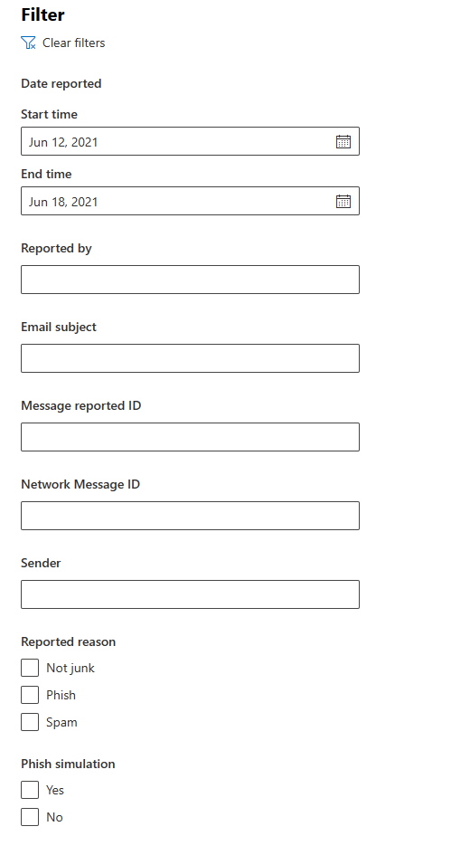

# Использование функции отправки администратором для отправки подозрительного спама, фишинговых сообщений, URL-адресов и файлов в корпорацию МайкрософтUse Admin Submission to submit suspected spam, phish, URLs, and files to Microsoft

[!INCLUDE [Microsoft 365 Defender rebranding](../includes/microsoft-defender-for-office.md)]

**Область применения****Applies to**
- [Exchange Online ProtectionExchange Online Protection](exchange-online-protection-overview.md)
- [Microsoft Defender для Office 365 (план 1 и план 2)Microsoft Defender for Office 365 plan 1 and plan 2](defender-for-office-365.md)

В Microsoft 365 организациях с Exchange Online почтовыми ящиками администраторы могут использовать портал Отправки на портале Microsoft 365 Defender для отправки сообщений электронной почты, URL-адресов и вложений в Корпорацию Майкрософт для сканирования.In Microsoft 365 organizations with Exchange Online mailboxes, admins can use the Submissions portal in the Microsoft 365 Defender portal to submit email messages, URLs, and attachments to Microsoft for scanning.

При отправке сообщения электронной почты вы получите:When you submit an email message, you will get:

- **Проверка подлинности электронной** почты. Сведения о том, прошла ли проверка подлинности электронной почты при ее доставке или сбой.**Email authentication check**: Details on whether email authentication passed or failed when it was delivered.
- **Хиты** политики. Сведения о любых политиках, которые могли разрешить или заблокировать входящие сообщения электронной почты в клиента, переопределив наши решения фильтра службы.**Policy hits**: Information about any policies that may have allowed or blocked the incoming email into your tenant, overriding our service filter verdicts.
- **Репутация и детонация полезной** нагрузки: проверка url-адресов и вложений в сообщении.**Payload reputation/detonation**: Examination of any URLs and attachments in the message.
- **Анализ грейдера.** Проверка, сделанная грейдерами,чтобы подтвердить, являются ли сообщения вредоносными.**Grader analysis**: Review done by human graders in order to confirm whether or not messages are malicious.

> [!IMPORTANT]
> Анализ репутации/детонации и грейдера полезной нагрузки не проводится во всех клиентах.Payload reputation/detonation and grader analysis are not done in all tenants. Сведения не могут выходить за пределы организации, если данные не должны покидать границу клиента в целях соответствия требованиям.Information is blocked from going outside the organization when data is not supposed to leave the tenant boundary for compliance purposes.

Другие способы отправки сообщений электронной почты, URL-адресов и вложений в Корпорацию Майкрософт см. в этой ссылке. For other ways to submit email messages, URLs, and attachments to Microsoft, see [Report messages and files to Microsoft](report-junk-email-messages-to-microsoft.md).

## Что нужно знать перед началом работыWhat do you need to know before you begin?

- Чтобы открыть портал Microsoft 365 Defender, перейдите на сайт <https://security.microsoft.com/>.You open the Microsoft 365 Defender portal at <https://security.microsoft.com/>. Чтобы перейти непосредственно на **страницу Отправки,** используйте <https://security.microsoft.com/reportsubmission> .To go directly to the **Submissions** page, use <https://security.microsoft.com/reportsubmission>.

- Чтобы отправить сообщения и файлы в Корпорацию Майкрософт, необходимо быть членом одной из следующих групп ролей:To submit messages and files to Microsoft, you need to be a member of one of the following role groups:
  - **Управление организацией** или **чтение** безопасности [на Microsoft 365 Defender портале](permissions-microsoft-365-security-center.md).**Organization Management** or **Security Reader** in the [Microsoft 365 Defender portal](permissions-microsoft-365-security-center.md).
  
    Обратите внимание, что членство в  этой группе ролей необходимо для просмотра пользовательских представлений в настраиваемом почтовом ящике, как описано выше в этой статье.Note that membership in this role group is required to [View user submissions to the custom mailbox](#view-user-submissions-to-microsoft) as described later in this article.

- Дополнительные сведения о том, как пользователи могут отправлять сообщения и файлы в Корпорацию Майкрософт, см. в материалах [Report messages and files to Microsoft.](report-junk-email-messages-to-microsoft.md)For more information about how users can submit messages and files to Microsoft, see [Report messages and files to Microsoft](report-junk-email-messages-to-microsoft.md).

## Сообщение о подозрительном контенте в Корпорацию МайкрософтReport suspicious content to Microsoft

1. На портале Microsoft 365 Defender перейдите на электронную **почту &** \> **отправки совместной работы.**In the Microsoft 365 Defender portal, go to **Email & collaboration** \> **Submissions**.

2. На странице **Отправки** убедитесь, что выбрана вкладка Отправка для анализа, а затем щелкните значок   **анализа.**On the **Submissions** page, verify that the **Submitted for analysis** tab is selected, and then click  **Submit to Microsoft for analysis**.

3. Используйте **отправку в Корпорацию Майкрософт** для проверки вылетов, которые, как представляется, представляют сообщение, URL-адрес или вложение электронной почты, как описано в следующих разделах.Use the **Submit to Microsoft for review** flyout that appears to submit the message, URL, or email attachment as described in the following sections.

   > [!NOTE]
   > Отправки файлов и URL-адресов недоступны в облаках, которые не позволяют данным выходить из среды.File and URL submissions are not available in the clouds that do not allow for data to leave the environment. Возможность выбора файла или URL-адреса будет оттеняться.The ability to select File or URL will be greyed out.

### Отправка сомнительного сообщения электронной почты в Корпорацию МайкрософтSubmit a questionable email to Microsoft

1. В поле **Выберите тип отправки** убедитесь, что **электронная** почта выбрана в списке drop down.In the **Select the submission type** box, verify that **Email** is selected in the drop down list.

2. В разделе **Добавление сетевого сообщения или** отправка раздела файл электронной почты используйте один из следующих вариантов:In the **Add the network message ID or upload the email file** section, use one of the following options:
   - Добавьте сетевой **ID** сообщения электронной почты. Это значение GUID, доступное в загонщике **X-MS-Exchange-Organization-Network-Message-Id** в сообщении или в **загоне X-MS-Office365-Filtering-Correlation-Id** в карантинных сообщениях.**Add the email network message ID**: This is a GUID value that's available in the **X-MS-Exchange-Organization-Network-Message-Id** header in the message or in the **X-MS-Office365-Filtering-Correlation-Id** header in quarantined messages.
   - **Upload файл электронной почты (.msg или .eml)**: Щелкните **Просмотр файлов**.**Upload the email file (.msg or .eml)**: Click **Browse files**. В открываемом диалоговом окте найти и выбрать файл .eml или .msg, а затем нажмите **кнопку Открыть**.In the dialog that opens, find and select the .eml or .msg file, and then click **Open**.

   > [!NOTE]
   > Возможность отправки сообщений в течение 30 дней была временно приостановлена для defender для Office 365 клиентов.The ability to submit messages as old as 30 days has been temporarily suspended for Defender for Office 365 customers. Администраторы смогут возвращаться только через 7 дней.Admins will only be able to go back 7 days.

3. В поле Выбор получателя с **проблемным полем** укажите получателя, против которого необходимо выполнить проверку политики.In the **Choose a recipient who had an issue** box, specify the recipient that you would like to run a policy check against. Проверка политики определяет, не обходится ли проверка электронной почты из-за политики пользователя или организации.The policy check will determine if the email bypassed scanning due to user or organization policies.

4. В разделе **Выбор причины отправки в раздел Microsoft** выберите один из следующих вариантов:In the **Select a reason for submitting to Microsoft** section, select one of the following options:
   - **Не должно было быть заблокировано (ложное срабатыва-****Should not have been blocked (false positive)**
   - **Должно было быть** заблокировано: В сообщении электронной почты следует классифицируются как раздел, который отображается, выберите одно из следующих значений (если вы не уверены, используйте свое наилучшее решение): **Should have been blocked**: In the **The email should have been categorized as** section that appears, select one of the following values (if you're not sure, use your best judgement):
     - **Фишинг****Phish**
     - **Спам****Spam**
     - **Вредоносная программа****Malware**

5. По завершению нажмите кнопку **Отправить.**When you're finished, click the **Submit** button.

> [!div class="mx-imgBorder"]
> 

### Отправка подозрительного URL-адреса в Корпорацию МайкрософтSend a suspect URL to Microsoft

1. В поле **Выберите тип отправки** выберите **URL-адрес** из списка drop down.In the **Select the submission type** box, select **URL** from the drop down list.

2. В поле **URL-адреса,** которое отображается, введите полный URL-адрес (например, `https://www.fabrikam.com/marketing.html` ).In the **URL** box that appears, enter the full URL (for example, `https://www.fabrikam.com/marketing.html`).

3. В разделе **Выбор причины отправки в раздел Microsoft** выберите один из следующих вариантов:In the **Select a reason for submitting to Microsoft** section, select one of the following options:
   - **Не должно было быть заблокировано (ложное срабатыва-****Should not have been blocked (false positive)**
   - **Должно было быть заблокировано:** В этом **URL-адресе** следует классифицируются как раздел, который отображается, выберите **фишинг или** вредоносные **программы**.**Should have been blocked**: In the **This URL should have been categorized as** section that appears, select **Phish** or **Malware**.

4. По завершению нажмите кнопку **Отправить.**When you're finished, click the **Submit** button.

> [!div class="mx-imgBorder"]
> 

### Отправка предполагаемого вложения электронной почты в Корпорацию МайкрософтSubmit a suspected email attachment to Microsoft

1. В поле **Выберите тип отправки** выберите **Файл из** списка выпаданий.In the **Select the submission type** box, select **File** from the drop down list.

2. В разделе **Файл,** который появится, щелкните **Просмотр файлов**.In the **File** section that appears, click **Browse files**. В открываемом диалоговом окте найти и выбрать файл, а затем нажмите кнопку **Открыть**.In the dialog that opens, find and select the file, and then click **Open**.

3. В разделе **Выбор причины отправки в раздел Microsoft** выберите один из следующих вариантов:In the **Select a reason for submitting to Microsoft** section, select one of the following options:
   - **Не должно было быть заблокировано (ложное срабатыва-****Should not have been blocked (false positive)**
   - **Должно быть заблокировано.** В этом **URL-адресе** должен быть классифицирован **раздел,** который отображается, вредоносные программы является единственным выбором, и автоматически выбирается.**Should have been blocked**: In the **This URL should have been categorized as** section that appears, **Malware** is the only choice, and is automatically selected.

4. По завершению нажмите кнопку **Отправить.**When you're finished, click the **Submit** button.

> [!div class="mx-imgBorder"]
> 

## Просмотр представлений администратора в Корпорации МайкрософтView admin submissions to Microsoft

1. На портале Microsoft 365 Defender перейдите на электронную **почту &** \> **отправки совместной работы.**In the Microsoft 365 Defender portal, go to **Email & collaboration** \> **Submissions**.

2. На странице **Отправки** убедитесь, что выбрана вкладка **Отправка** для анализа.On the **Submissions** page, verify that the **Submitted for analysis** tab is selected.

   - Вы можете сортировать записи, нажав на доступный столбец.You can sort the entries by clicking on an available column header. Нажмите **кнопку Настройка столбцов,** чтобы показать максимум семь столбцов.Click **Customize columns** to show a maximum of seven columns. Значения по умолчанию помечены звездочкой (\*):The default values are marked with an asterisk (\*):
     - **Имя отправки**\***Submission name**\*
     - **Отправитель**\***Sender**\*
     - **Дата отправки**\***Date submitted**\*
     - **Тип отправки**\***Submission type**\*
     - **Причина отправки**\***Reason for submitting**\*
     - **Состояние Rescan**\***Rescan status**\*
     - **Результат Rescan**\***Rescan result**\*
     - **Вердикт фильтра****Filter verdict**
     - **Причина доставки/блокировки****Delivery/Block reason**
     - **ID отправки****Submission ID**
     - **Сетевой ID/Object ID****Network Message ID/Object ID**
     - **Direction****Direction**
     - **IP-адрес отправителя****Sender IP**
     - **Объемный уровень совместимый (BCL)****Bulk compliant level (BCL)**
     - **Destination****Destination**
     - **Действие политики****Policy action**
     - **Отправлено****Submitted by**

     По завершению нажмите кнопку **Применить**.When you're finished, click **Apply**.

   - Чтобы отфильтровать записи, щелкните **Фильтр**.To filter the entries, click **Filter**. Доступные фильтры:The available filters are:
     - **Дата отправки:** **дата начала и** дата **окончания**.**Date submitted**: **Start date** and **End date**.
     - **Тип отправки:** **электронная** **почта, URL-адрес** или **файл.****Submission type**: **Email**, **URL**, or **File**.
     - **ID отправки:** значение GUID, назначенное каждой отправке.**Submission ID**: A GUID value that's assigned to every submission.
     - **ID сетевого сообщения****Network Message ID**
     - **Sender****Sender**

     По завершению нажмите кнопку **Применить**.When you're finished, click **Apply**.

     > [!div class="mx-imgBorder"]
     > 

   - Чтобы сгруппить записи, щелкните **Группу** и выберите одно из следующих значений из списка drop down:To group the entries, click **Group** and select one of the following values from the drop down list:
     - **Нет****None**
     - **Тип****Type**
     - **Причина****Reason**
     - **Состояние****Status**
     - **Результат Rescan****Rescan result**

   - Чтобы экспортировать записи, щелкните **Экспорт**.To export the entries, click **Export**. В диалоговом окте, который отображается, сохраните .csv файл.In the dialog that appears, save the .csv file.

### Сведения о повторном представлении администратораAdmin submission rescan details

Сообщения, представленные в представлениях администратора, рассматриваются и результаты, показанные в вылете подробных сообщений:Messages that are submitted in admin submissions are reviewed and results shown in the submissions detail flyout:

- Возникновение сбоя при проверке подлинности электронной почты отправителя в момент доставки.If there was a failure in the sender's email authentication at the time of delivery.
- Сведения о любых совпадениях политик, которые могут повлиять на решение по безопасности касательно сообщения или переопределить его.Information about any policy hits that could have affected or overridden the verdict of a message.
- Текущие результаты отключения, чтобы определить, были ли URL-адреса или файлы, содержащиеся в сообщении, вредоносными или нет.Current detonation results to see if the URLs or files contained in the message were malicious or not.
- Отзывы от грейдеров.Feedback from graders.

Если было обнаружено переопределение, повторное сканирование должно завершиться через несколько минут.If an override was found, the rescan should complete in several minutes. Если в проверке подлинности или доставке электронной почты не возникло проблем с переопределением, то отзывы от грейдеров могут занять до одного дня.If there wasn't a problem in email authentication or delivery wasn't affected by an override, then the feedback from graders could take up to a day.

## Просмотр пользовательских представлений в Корпорацию МайкрософтView user submissions to Microsoft

Если вы развернули надстройку [Report Message](enable-the-report-message-add-in.md), надстройку [Report Phishing](enable-the-report-phish-add-in.md)или пользователи используют встроенную отчетность в [Outlook в Интернете,](report-junk-email-and-phishing-scams-in-outlook-on-the-web-eop.md)вы можете увидеть, какие отчеты пользователи сообщают на вкладке Сообщение пользователя. If you've deployed the [Report Message add-in](enable-the-report-message-add-in.md), the [Report Phishing add-in](enable-the-report-phish-add-in.md), or people use the [built-in reporting in Outlook on the web](report-junk-email-and-phishing-scams-in-outlook-on-the-web-eop.md), you can see what users are reporting on the **User reported message** tab.

1. На портале Microsoft 365 Defender перейдите на электронную **почту &** \> **отправки совместной работы.**In the Microsoft 365 Defender portal, go to **Email & collaboration** \> **Submissions**.

2. На странице **Отправки** выберите вкладку **Сообщения** пользователя.On the **Submissions** page, select the **User reported messages** tab.

   - Вы можете сортировать записи, нажав на доступный столбец.You can sort the entries by clicking on an available column header. Нажмите **кнопку Настройка столбцов,** чтобы показать максимум семь столбцов.Click **Customize columns** to show a maximum of seven columns. Значения по умолчанию помечены звездочкой (\*):The default values are marked with an asterisk (\*):

     - **Тема электронной почты**\***Email subject**\*
     - **Reported by**\***Reported by**\*
     - **Дата сообщается**\***Date reported**\*
     - **Отправитель**\***Sender**\*
     - **Сообщаемая причина**\***Reported reason**\*
     - **Результат Rescan**\***Rescan result**\*
     - **ID сообщения****Message reported ID**
     - **ID сетевого сообщения****Network Message ID**
     - **IP-адрес отправителя****Sender IP**
     - **Имитация фишинга****Phish simulation**

     По завершению нажмите кнопку **Применить**.When you're finished, click **Apply**.

   - Чтобы отфильтровать записи, щелкните **Фильтр**.To filter the entries, click **Filter**. Доступные фильтры:The available filters are:
     - **Дата сообщается:** **дата начала и** **даты окончания**.**Date reported**: **Start date** and **End date**.
     - **Reported by (Сообщил)****Reported by**
     - **Тема письма****Email subject**
     - **ID сообщения****Message reported ID**
     - **ID сетевого сообщения****Network Message ID**
     - **Sender****Sender**
     - **Сообщаемая причина:** **не нежелательной,** **фишинг** или **спам**.**Reported reason**: **Not junk**, **Phish**, or **Spam**.
     - **Фишинговое моделирование:** **да** или **нет****Phish simulation**: **Yes** or **No**

     По завершению нажмите кнопку **Применить**.When you're finished, click **Apply**.

     > [!div class="mx-imgBorder"]
     > 

   - Чтобы сгруппить записи, щелкните **Группу** и выберите одно из следующих значений из списка drop down:To group the entries, click **Group** and select one of the following values from the drop down list:
     - **Нет****None**
     - **Причина****Reason**
     - **Sender****Sender**
     - **Reported by (Сообщил)****Reported by**
     - **Результат Rescan****Rescan result**
     - **Имитация фишинга****Phish simulation**

   - Чтобы экспортировать записи, щелкните **Экспорт**.To export the entries, click **Export**. В диалоговом окте, который отображается, сохраните .csv файл.In the dialog that appears, save the .csv file.

> [!NOTE]
> Если организации настроены на отправку сообщений пользователей только в настраиваемый почтовый ящик, сообщения не  будут отправляться на rescan, а результаты сообщений пользователей всегда будут пустыми.If organizations are configured to send user reported messages to the custom mailbox only, reported messages will not be sent for rescan and the results in **User reported messages** will always be empty.

### Отмена отправки пользователейUndo user submissions

После отправки подозрительной электронной почты в настраиваемый почтовый ящик у пользователя и администратора нет возможности отменить отправку.Once a user submits a suspicious email to the custom mailbox, the user and admin don't have an option to undo the submission. Если пользователь хочет восстановить электронную почту, она будет доступна для восстановления в папках "Удаленные элементы" или "Нежелательной почты".If the user would like to recover the email, it will be available for recovery in the Deleted Items or Junk Email folders.

### Отправка сообщений в Корпорацию Майкрософт из пользовательского почтового ящикаSubmit messages to Microsoft from the custom mailbox

Если настраивается настраиваемый почтовый ящик для перехвата сообщений, сообщаемых пользователями, без отправки сообщений в Корпорацию Майкрософт, вы можете найти и отправить определенные сообщения в Корпорацию Майкрософт для анализа.If you've configured the custom mailbox to intercept user-reported messages without sending the messages to Microsoft, you can find and send specific messages to Microsoft for analysis. Это эффективно перемещает отправку пользователя в отправку администратора.This effectively moves a user submission to an admin submission.

На **вкладке Сообщения** пользователя выберите сообщение в списке, щелкните Отправить в **Microsoft** для анализа, а затем выберите одно из следующих значений из списка drop down:On the **User reported messages** tab, select a message in the list, click **Submit to Microsoft for analysis**, and then select one of the following values from the drop down list:

- **Отчет о чистоте****Report clean**
- **Сообщение о фишинге****Report phishing**
- **Отчет о вредоносных программах****Report malware**
- **Сообщение о нежелательной почте****Report spam**
- **Триггерное исследование****Trigger investigation**

> [!div class="mx-imgBorder"]
> 
