# <a name="anti-spoofing-protection-in-office-365"></a><span data-ttu-id="fc6c6-105">Защита от спуфинга в Office 365</span><span class="sxs-lookup"><span data-stu-id="fc6c6-105">Anti-spoofing protection in Office 365</span></span>

<span data-ttu-id="fc6c6-106">В этой статье объясняется, как Office 365 борется с фишинговыми атаками, которые используют фальшивые домены отправителя, то есть домены, которые подверглись спуфингу.</span><span class="sxs-lookup"><span data-stu-id="fc6c6-106">This article describes how Office 365 mitigates against phishing attacks that use forged sender domains, that is, domains that are spoofed.</span></span> <span data-ttu-id="fc6c6-107">Эта задача выполняется с помощью анализа и блокировки тех, которые не могут пройти проверку подлинности с помощью стандартных методов аутентификации с помощью электронной почты и с помощью техник репутации отправителя.</span><span class="sxs-lookup"><span data-stu-id="fc6c6-107">It accomplishes this by analyzing the messages and blocking the ones that cannot be authenticated using standard email authentication methods, nor other sender reputation techniques.</span></span> <span data-ttu-id="fc6c6-108">Это изменение было реализовано, чтобы уменьшить число фишинговых атак на организаций, использующие Office 365.</span><span class="sxs-lookup"><span data-stu-id="fc6c6-108">This change was implemented to reduce the number of phishing attacks to which organizations in Office 365 are exposed.</span></span>

<span data-ttu-id="fc6c6-109">В этой статье также объясняется, почему было внесено это изменение, как клиенты могут подготовиться к этому изменению, как просматривать сообщения, на которые повлияет это изменение, как отправлять отчет о сообщениях, как устранять ложные срабатывания, а также как отправители в корпорацию Майкрософт должны готовиться к этому изменению.</span><span class="sxs-lookup"><span data-stu-id="fc6c6-109">This article also describes why this change is being made, how customers can prepare for this change, how to view messages that will be affected, how to report on messages, how to mitigate false positives, as well as how senders to Microsoft should prepare for this change.</span></span>

<span data-ttu-id="fc6c6-110">Технология защиты от спуфинга корпорации Майкрософт изначально была применена для организаций, которых оформили корпоративную подписку Е5 на Office 365 или приобрели для своей подписки надстройку Office 365 Advanced Threat Protection (ATP).</span><span class="sxs-lookup"><span data-stu-id="fc6c6-110">Microsoft's anti-spoofing technology was initially deployed to its organizations that had an Office 365 Enterprise E5 subscription or had purchased the Office 365 Advanced Threat Protection (ATP) add-on for their subscription.</span></span> <span data-ttu-id="fc6c6-111">Начиная с октября 2018 г. мы расширили защита на организаций, пользующиеся Exchange Online Protection (EOP).</span><span class="sxs-lookup"><span data-stu-id="fc6c6-111">As of October, 2018 we extended the protection to organizations that have Exchange Online Protection (EOP) as well.</span></span> <span data-ttu-id="fc6c6-112">Кроме того, из-за способа, с помощью которого все наши фильтры учатся друг у друга, пользователи Outlook.com также могут быть затронуты изменениями.</span><span class="sxs-lookup"><span data-stu-id="fc6c6-112">Additionally, because of the way all of our filters learn from each other, Outlook.com users may also be affected.</span></span>

## <a name="how-spoofing-is-used-in-phishing-attacks"></a><span data-ttu-id="fc6c6-113">Как спуфинг используется при фишинговых атаках</span><span class="sxs-lookup"><span data-stu-id="fc6c6-113">How spoofing is used in phishing attacks</span></span>

<span data-ttu-id="fc6c6-114">Когда речь идет о защите пользователей, Майкрософт серьезно относится к угрозе фишинга.</span><span class="sxs-lookup"><span data-stu-id="fc6c6-114">When it comes to protecting its users, Microsoft takes the threat of phishing seriously.</span></span> <span data-ttu-id="fc6c6-115">Один из методов, который спамеры и мошенники используют достаточно часто, это спуфинг, т.е. подделка отправителя, когда сообщение якобы поступает от определенного отправителя или из какого-то места, отличающихся от реального источника.</span><span class="sxs-lookup"><span data-stu-id="fc6c6-115">One of the techniques that spammers and phishers commonly use is spoofing, which is when the sender is forged, and a message appears to originate from someone or somewhere other than the actual source.</span></span> <span data-ttu-id="fc6c6-116">Этот способ часто используются в фишинговых кампаниях, предназначенных для получения учетных данных пользователя.</span><span class="sxs-lookup"><span data-stu-id="fc6c6-116">This technique is often used in phishing campaigns designed to obtain user credentials.</span></span> <span data-ttu-id="fc6c6-117">Технология защиты от спуфинга корпорации Майкрософт, в частности, проверяет фальсификацию элемента "От: заголовок", который отображается в почтовом клиенте, например, Outlook.</span><span class="sxs-lookup"><span data-stu-id="fc6c6-117">Microsoft's Anti-spoof technology specifically examines forgery of the 'From: header' which is the one that shows up in an email client like Outlook.</span></span> <span data-ttu-id="fc6c6-118">Когда корпорация Майкрософт может с большой долей уверенности утверждать, что элемент "От: заголовок" подвергся спуфингу, сообщение помечается как поддельное.</span><span class="sxs-lookup"><span data-stu-id="fc6c6-118">When Microsoft has high confidence that the From: header is spoofed, it identifies the message as a spoof.</span></span>

<span data-ttu-id="fc6c6-119">Поддельные сообщения имеют два отрицательных качества для реальных пользователей:</span><span class="sxs-lookup"><span data-stu-id="fc6c6-119">Spoofing messages have two negative implications for real life users:</span></span>

### <a name="1-spoofed-messages-deceive-users"></a><span data-ttu-id="fc6c6-120">1. Поддельные сообщения вводят пользователей в заблуждение</span><span class="sxs-lookup"><span data-stu-id="fc6c6-120">1. Spoofed messages deceive users</span></span>

<span data-ttu-id="fc6c6-121">Во-первых, подделанное сообщение может обманным путем заставить пользователя нажать ссылку и предоставить свои учетные данные, скачать вредоносные программы или ответить на сообщение, передав конфиденциальные данные (последний вариант называется компрометацией рабочей почты).</span><span class="sxs-lookup"><span data-stu-id="fc6c6-121">First, a spoofed message may trick a user into clicking a link and giving up their credentials, downloading malware, or replying to a message with sensitive content (the latter of which is known as Business Email Compromise).</span></span> <span data-ttu-id="fc6c6-122">Например, ниже приведено фишинговое сообщение с подделанным отправителем msoutlook94@service.outlook.com.</span><span class="sxs-lookup"><span data-stu-id="fc6c6-122">For example, the following is a phishing message with a spoofed sender of msoutlook94@service.outlook.com:</span></span>


<span data-ttu-id="fc6c6-124">Сообщение выше не было отправлено с адреса service.outlook.com, но вместо этого было подделано фишером, чтобы получатель подумал, что оно было отправлено с этого домена.</span><span class="sxs-lookup"><span data-stu-id="fc6c6-124">The above did not actually come from service.outlook.com, but instead was spoofed by the phisher to make it look like it did.</span></span> <span data-ttu-id="fc6c6-125">Он пытается заставить пользователя нажать на ссылку в сообщении.</span><span class="sxs-lookup"><span data-stu-id="fc6c6-125">It is attempting to trick a user into clicking the link within the message.</span></span>

<span data-ttu-id="fc6c6-126">Следующий пример - спуфинг contoso.com:</span><span class="sxs-lookup"><span data-stu-id="fc6c6-126">The next example is spoofing contoso.com:</span></span>


<span data-ttu-id="fc6c6-128">Сообщение выглядит нормальным, но на самом деле это подделка.</span><span class="sxs-lookup"><span data-stu-id="fc6c6-128">The message looks legitimate, but in fact is a spoof.</span></span> <span data-ttu-id="fc6c6-129">Это фишинговое сообщение представляет собой тип компрометации рабочей почты, которая является подкатегорией фишинга.</span><span class="sxs-lookup"><span data-stu-id="fc6c6-129">This phishing message is a type of Business Email Compromise which is a subcategory of phishing.</span></span>

### <a name="2-users-confuse-real-messages-for-fake-ones"></a><span data-ttu-id="fc6c6-130">2. Пользователям могут спутать реальные сообщения с поддельными</span><span class="sxs-lookup"><span data-stu-id="fc6c6-130">2. Users confuse real messages for fake ones</span></span>

<span data-ttu-id="fc6c6-131">Во-вторых, поддельные сообщения создают неопределенность для пользователей, которые знают о фишинговых сообщениях, но не могут увидеть разницу между реальным сообщением и подделанным.</span><span class="sxs-lookup"><span data-stu-id="fc6c6-131">Second, spoofed messages create uncertainty for users who know about phishing messages but cannot tell the difference between a real message and spoofed one.</span></span> <span data-ttu-id="fc6c6-132">Например, ниже приведен пример запроса на сброс действующего пароля, полученный с адреса электронной почты учетной записи Microsoft Security.</span><span class="sxs-lookup"><span data-stu-id="fc6c6-132">For example, the following is an example of an actual password reset from the Microsoft Security account email address:</span></span>


<span data-ttu-id="fc6c6-134">Сообщение выше было отправлено корпорацией Майкрософт, но в то же самое время пользователи часто получают фишинговые сообщения, которые могут обманным путем заставить пользователя нажать ссылку и предоставить свои учетные данные, скачать вредоносные программы или ответить на сообщение с конфиденциальным содержанием.</span><span class="sxs-lookup"><span data-stu-id="fc6c6-134">The above message did come from Microsoft, but at the same time, users are used to getting phishing messages that may trick a user into clicking a link and giving up their credentials, downloading malware, or replying to a message with sensitive content.</span></span> <span data-ttu-id="fc6c6-135">Так как достаточно сложно понять разницу между реальным запросом на смену пароля и поддельным запросом, многие пользователи игнорируют эти сообщения, помечают их как спам или без надобности отправляют сообщения обратно в корпорацию Майкрософт, помечая их как пропущенные фишинговые сообщения.</span><span class="sxs-lookup"><span data-stu-id="fc6c6-135">Because it is difficult to tell the difference between a real password reset and a fake one, many users ignore these messages, report them as spam, or unnecessarily report the messages back to Microsoft as missed phishing scams.</span></span>

<span data-ttu-id="fc6c6-136">Чтобы остановить спуфинг, индустрия фильтрации электронной почты разработала протоколы проверки подлинности электронной почты, такие как [SPF](https://docs.microsoft.com/office365/SecurityCompliance/set-up-spf-in-office-365-to-help-prevent-spoofing), [DKIM](https://docs.microsoft.com/office365/SecurityCompliance/use-dkim-to-validate-outbound-email) и [DMARC](https://docs.microsoft.com/office365/SecurityCompliance/use-dmarc-to-validate-email).</span><span class="sxs-lookup"><span data-stu-id="fc6c6-136">To stop spoofing, the email filtering industry has developed email authentication protocols such as [SPF](https://docs.microsoft.com/office365/SecurityCompliance/set-up-spf-in-office-365-to-help-prevent-spoofing), [DKIM](https://docs.microsoft.com/office365/SecurityCompliance/use-dkim-to-validate-outbound-email), and [DMARC](https://docs.microsoft.com/office365/SecurityCompliance/use-dmarc-to-validate-email).</span></span> <span data-ttu-id="fc6c6-137">DMARC защищает данные отправителя сообщения от подделки.</span><span class="sxs-lookup"><span data-stu-id="fc6c6-137">DMARC prevents spoofing from examining a message's sender.</span></span> <span data-ttu-id="fc6c6-138">Это отправитель, которого пользователи видят в своих почтовых клиентах (в приведенных выше примерах это service.outlook.com, outlook.com и accountprotection.microsoft.com).</span><span class="sxs-lookup"><span data-stu-id="fc6c6-138">That is, the sender that users see in their email client (in the examples above it is service.outlook.com, outlook.com, and accountprotection.microsoft.com).</span></span> <span data-ttu-id="fc6c6-139">Кроме того, пользователи видят, что домен прошел проверку SPF или DKIM. Это означает, что домен прошел проверку подлинности, а угроза спуфинга отсутствует.</span><span class="sxs-lookup"><span data-stu-id="fc6c6-139">Furthermore, users can also see that the domain has passed SPF or DKIM, which means that the domain has been authenticated and is therefore not spoofed.</span></span> <span data-ttu-id="fc6c6-140">Более подробное обсуждение см. в разделе *Почему проверки подлинности электронной почты не всегда достаточно для предотвращения спуфинга* ниже в этой статье.</span><span class="sxs-lookup"><span data-stu-id="fc6c6-140">For a more complete discussion, see the section "*Understanding why email authentication is not always enough to stop spoofing"*  later on in this article.</span></span>

<span data-ttu-id="fc6c6-141">Однако проблема состоит в том, что запись аутентификации электронной почты выполняется по желанию и не имеет обязательный характер.</span><span class="sxs-lookup"><span data-stu-id="fc6c6-141">However, the problem is that email authentication records are optional, not required.</span></span> <span data-ttu-id="fc6c6-142">Таким образом, хотя домены с надежными политиками проверки подлинности, например, microsoft.com и skype.com, защищены от спуфинга, домены, которые используют менее надежные политики проверки подлинности, либо вообще не имеющие никакой специальной политики, являются объектами для спуфинга.</span><span class="sxs-lookup"><span data-stu-id="fc6c6-142">Therefore, while domains with strong authentication policies like microsoft.com and skype.com are protected from spoofing, domains that publish weaker authentication policies, or no policy at all, are targets for being spoofed.</span></span> <span data-ttu-id="fc6c6-143">Начиная с марта 2018 г. только 9 % доменов компаний из списка Fortune 500 опубликовали надежные политики проверки подлинности электронной почты.</span><span class="sxs-lookup"><span data-stu-id="fc6c6-143">As of March 2018, only 9% of domains of companies in the Fortune 500 publish strong email authentication policies.</span></span> <span data-ttu-id="fc6c6-144">Оставшийся 91% может подвергаться подделыванию фишером, и если фильтр почты не обнаруживает подделку с помощью другой политики, такие письма могут быть получены обычным пользователем и ввести его в заблуждение:</span><span class="sxs-lookup"><span data-stu-id="fc6c6-144">The remaining 91% may be spoofed by a phisher, and unless the email filter detects it using another policy, may be delivered to an end user and deceive them:</span></span>


<span data-ttu-id="fc6c6-146">Доля компаний малого и среднего бизнеса, не входящих в список Fortune 500, которая опубликовала строгие политики проверки подлинности электронной почты, небольшая, и снижается для доменов, которые находятся за пределами Северной Америки и Западной Европы.</span><span class="sxs-lookup"><span data-stu-id="fc6c6-146">The proportion of small-to-medium sized companies that are not in the Fortune 500 that publish strong email authentication policies is smaller, and smaller still for domains that are outside of North America and western Europe.</span></span>

<span data-ttu-id="fc6c6-147">Это большая проблема, так как предприятие может не иметь четкого представления о том, как работает электронная почта, в то время как мошенники отлично это знают и могут воспользоваться недостатками знаний.</span><span class="sxs-lookup"><span data-stu-id="fc6c6-147">This is a big problem because while enterprises may not be aware of how email authentication works, phishers do understand and take advantage of the lack of it.</span></span>

<span data-ttu-id="fc6c6-148">Сведения о настройке SPF, DKIM и DMARC см. в разделе *Клиенты Office 365* ниже в этом документе.</span><span class="sxs-lookup"><span data-stu-id="fc6c6-148">For information on setting up SPF, DKIM, and DMARC, see the section "*Customers of Office 365"*  later on in this document.</span></span>

## <a name="stopping-spoofing-with-implicit-email-authentication"></a><span data-ttu-id="fc6c6-149">Прекращение спуфинга с помощью неявной проверки подлинности электронной почты</span><span class="sxs-lookup"><span data-stu-id="fc6c6-149">Stopping spoofing with implicit email authentication</span></span>

<span data-ttu-id="fc6c6-150">Так как фишинг и направленный фишинг — это огромная проблема, а также из-за ограниченного внедрения политик проверки подлинности электронной почты, корпорация Майкрософт по-прежнему инвестирует в средства для защиты своих клиентов.</span><span class="sxs-lookup"><span data-stu-id="fc6c6-150">Because phishing and spear phishing is such a problem, and because of the limited adoption of strong email authentication policies, Microsoft continues to invest in capabilities to protect its customers.</span></span> <span data-ttu-id="fc6c6-151">Таким образом, корпорация Майкрософт выступает в роли лидера с *неявной проверкой подлинности электронной почты* — если домен не прошел проверку подлинности, Майкрософт будет воспринимать его так, как если бы он имел опубликованные записи для проверки подлинности электронной почты и соответствующим образом обращаться с ним, если проверки не были пройдены успешно.</span><span class="sxs-lookup"><span data-stu-id="fc6c6-151">Therefore, Microsoft is moving ahead with  *implicit email authentication* - if a domain doesn't authenticate, Microsoft will treat it as if it had published email authentication records and treat it accordingly if it doesn't pass.</span></span>

<span data-ttu-id="fc6c6-152">Для выполнения этой задачи корпорация Майкрософт создала множество расширений для обычной аутентификации электронной почты, включая репутацию отправителя, история переписки отправителю и получателя, поведенческий анализ и другие продвинутые техники.</span><span class="sxs-lookup"><span data-stu-id="fc6c6-152">To accomplish this, Microsoft has built numerous extensions to regular email authentication including sender reputation, sender/recipient history, behavioral analysis, and other advanced techniques.</span></span> <span data-ttu-id="fc6c6-153">Сообщение, отправленное с домена, который не публикует данные для проверки подлинности электронной почты, помечается как поддельное, если оно не содержит другие сигналы, подтверждающие его подлинность.</span><span class="sxs-lookup"><span data-stu-id="fc6c6-153">A message sent from a domain that doesn't publish email authentication will be marked as spoof unless it contains other signals to indicate that it is legitimate.</span></span>

<span data-ttu-id="fc6c6-154">Благодаря этому конечные пользователи могут быть уверены, что сообщения, отправленные в их адрес, не были подделаны, а отправители могут быть уверены в том, что никто не будет подделывать их домен, а клиенты Office 365 могут пользоваться дополнительной защитой, например, защитой от подмены.</span><span class="sxs-lookup"><span data-stu-id="fc6c6-154">By doing this, end users can have confidence that an email sent to them has not been spoofed, senders can be confident that nobody is impersonating their domain, and customers of Office 365 can offer even better protection such as Impersonation protection.</span></span>

<span data-ttu-id="fc6c6-155">Общие извещение корпорации Майкрософт см. в статье [Море фишинга, часть 2 - Улучшенные средство борьбы со спуфингом в Office 365](https://techcommunity.microsoft.com/t5/Security-Privacy-and-Compliance/Schooling-A-Sea-of-Phish-Part-2-Enhanced-Anti-spoofing/ba-p/176209).</span><span class="sxs-lookup"><span data-stu-id="fc6c6-155">To see Microsoft's general announcement, see [A Sea of Phish Part 2 - Enhanced Anti-spoofing in Office 365](https://techcommunity.microsoft.com/t5/Security-Privacy-and-Compliance/Schooling-A-Sea-of-Phish-Part-2-Enhanced-Anti-spoofing/ba-p/176209).</span></span>

## <a name="identifying-that-a-message-is-classified-as-spoofed"></a><span data-ttu-id="fc6c6-156">Определение того, что то сообщения было признано поддельным</span><span class="sxs-lookup"><span data-stu-id="fc6c6-156">Identifying that a message is classified as spoofed</span></span>

### <a name="composite-authentication"></a><span data-ttu-id="fc6c6-157">Многофакторная аутентификация</span><span class="sxs-lookup"><span data-stu-id="fc6c6-157">Composite authentication</span></span>

<span data-ttu-id="fc6c6-158">Хотя SPF, DKIM и DMARC полезны сами по себе, они не позволяют сообщить о достаточности проверки подлинности в случае, если в сообщении не содержится записей о явной проверке подлинности.</span><span class="sxs-lookup"><span data-stu-id="fc6c6-158">While SPF, DKIM, and DMARC are all useful by themselves, they don't communicate enough authentication status in the event a message has no explicit authentication records.</span></span> <span data-ttu-id="fc6c6-159">В результате корпорация Майкрософт разработала алгоритм, который объединяет несколько сигналов в одно значение, которое называется многофакторной аутентификацией (compauth).</span><span class="sxs-lookup"><span data-stu-id="fc6c6-159">Therefore, Microsoft has developed an algorithm that combines multiple signals into a single value called Composite Authentication, or compauth for short.</span></span> <span data-ttu-id="fc6c6-160">Клиенты в Office 365 могут просмотреть значения compauth в заголовке *Результаты проверки подлинности* в заголовках сообщений.</span><span class="sxs-lookup"><span data-stu-id="fc6c6-160">Customers in Office 365 have compauth values stamped into the *Authentication-Results* header in the message headers.</span></span>

```text
Authentication-Results:
  compauth=<fail|pass|softpass|none> reason=<yyy>
```

|<span data-ttu-id="fc6c6-161">**Результат CompAuth**</span><span class="sxs-lookup"><span data-stu-id="fc6c6-161">**CompAuth result**</span></span>|<span data-ttu-id="fc6c6-162">**Описание**</span><span class="sxs-lookup"><span data-stu-id="fc6c6-162">**Description**</span></span>|
|:-----|:-----|
|<span data-ttu-id="fc6c6-163">сбой</span><span class="sxs-lookup"><span data-stu-id="fc6c6-163">fail</span></span>|<span data-ttu-id="fc6c6-164">Сообщению не удалось пройти явную проверку подлинности (отправка с домена, публикующего записи, явным образом в систему DNS) или неявную проверку подлинности (отправка с домена, который не публикует записи, в систему DNS, чтобы Office 365 мог интерполировать результат так, как если бы записи были опубликованы).</span><span class="sxs-lookup"><span data-stu-id="fc6c6-164">Message failed explicit authentication (sending domain published records explicitly in DNS) or implicit authentication (sending domain did not publish records in DNS, so Office 365 interpolated the result as if it had published records).</span></span>|
|<span data-ttu-id="fc6c6-165">успешно</span><span class="sxs-lookup"><span data-stu-id="fc6c6-165">pass</span></span>|<span data-ttu-id="fc6c6-166">Сообщению удалось пройти явную проверку подлинности (сообщение прошло DMARC или [лучшее предложение прошло DMARC](https://blogs.msdn.microsoft.com/tzink/2015/05/06/what-is-dmarc-bestguesspass-in-office-365)) или неявную проверку подлинности с высокой вероятностью (отправка с домена, который не публикует записи, но у Office 365 есть надежные внутренние сигналы, говорящие о том, что сообщение подлинное).</span><span class="sxs-lookup"><span data-stu-id="fc6c6-166">Message passed explicit authentication (message passed DMARC, or [Best Guess Passed DMARC](https://blogs.msdn.microsoft.com/tzink/2015/05/06/what-is-dmarc-bestguesspass-in-office-365)) or implicit authentication with high confidence (sending domain does not publish email authentication records, but Office 365 has strong backend signals to indicate the message is likely legitimate).</span></span>|
|<span data-ttu-id="fc6c6-167">частично успешно</span><span class="sxs-lookup"><span data-stu-id="fc6c6-167">softpass</span></span>|<span data-ttu-id="fc6c6-168">Сообщение прошло неявную проверки подлинности с низкой или средней уверенностью (отправка с домена, которые не публикует проверку подлинности электронной почты, но у Office 365 есть внутренние сигналы, говорящие о том, что сообщение подлинное, хотя надежность таких сигналов невысокая).</span><span class="sxs-lookup"><span data-stu-id="fc6c6-168">Message passed implicit authentication with low-to-medium confidence (sending domain does not publish email authentication, but Office 365 has backend signals to indicate the message is legitimate but the strength of the signal is weaker).</span></span>|
|<span data-ttu-id="fc6c6-169">нет</span><span class="sxs-lookup"><span data-stu-id="fc6c6-169">none</span></span>|<span data-ttu-id="fc6c6-170">Сообщение не прошло проверку подлинности (или прошло проверку подлинности, но не отвечает требованиям), но многофакторная аутентификация не применяется из-за репутации отправителя или других факторов.</span><span class="sxs-lookup"><span data-stu-id="fc6c6-170">Message did not authenticate (or it did authenticate but did not align), but composite authentication not applied due to sender reputation or other factors.</span></span>|

|||
|:-----|:-----|
|<span data-ttu-id="fc6c6-171">**Причина**</span><span class="sxs-lookup"><span data-stu-id="fc6c6-171">**Reason**</span></span>|<span data-ttu-id="fc6c6-172">**Описание**</span><span class="sxs-lookup"><span data-stu-id="fc6c6-172">**Description**</span></span>|
|<span data-ttu-id="fc6c6-173">0xx</span><span class="sxs-lookup"><span data-stu-id="fc6c6-173">0xx</span></span> |<span data-ttu-id="fc6c6-174">Сообщению не удалось пройти многофакторную аутентификацию</span><span class="sxs-lookup"><span data-stu-id="fc6c6-174">Message failed composite authentication.</span></span><br/><span data-ttu-id="fc6c6-175">**000** означает, что сообщению не удалось пройти DMARC, а сообщение было отклонено или отправлено на карантин.</span><span class="sxs-lookup"><span data-stu-id="fc6c6-175">**000** means the message failed DMARC with an action of reject or quarantine.</span></span>  <br/><span data-ttu-id="fc6c6-176">**001** означает, что сообщению не удалось пройти неявную проверку подлинности электронной почты.</span><span class="sxs-lookup"><span data-stu-id="fc6c6-176">**001** means the message failed implicit email authentication.</span></span> <span data-ttu-id="fc6c6-177">Это означает, что домена отправителя не имеет опубликованные записи для проверки подлинности электронной почты, либо, если они присутствуют, применялась мягкая политика проверки (SPF – мягкий сбой или нейтральный ответ, политика DMARC p=none).</span><span class="sxs-lookup"><span data-stu-id="fc6c6-177">This means that the sending domain did not have email authentication records published, or if they did, they had a weaker failure policy (SPF soft fail or neutral, DMARC policy of p=none).</span></span>  <br/><span data-ttu-id="fc6c6-178">**002** означает, что у организации есть политика для пары отправитель/домен, которая явным образом запрещает отправку подделанных электронных сообщений, а этот параметр вручную настроен администратором.</span><span class="sxs-lookup"><span data-stu-id="fc6c6-178">**002** means the organization has a policy for the sender/domain pair that is explicitly prohibited from sending spoofed email, this setting is manually set by an administrator.</span></span>  <br/><span data-ttu-id="fc6c6-179">**010** означает, что сообщению не удалось пройти проверку DMARC, оно было отклонено или отправлено в карантин, а домен отправителя является одним из одобренных вашей организацией доменов (это так называемый спуфинг внутри организации).</span><span class="sxs-lookup"><span data-stu-id="fc6c6-179">**010** means the message failed DMARC with an action of reject or quarantine, and the sending domain is one of your organization's accepted-domains (this is part of self-to-self, or intra-org, spoofing).</span></span>|
|<span data-ttu-id="fc6c6-180">1xx, 2xx, 3xx, 4xx и 5xx</span><span class="sxs-lookup"><span data-stu-id="fc6c6-180">1xx, 2xx, 3xx, 4xx, and 5xx</span></span>|<span data-ttu-id="fc6c6-181">Соответствуют различным внутренним кодам, информирующим о том, почему сообщение прошло неявные проверки подлинности, или осталось без проверки подлинности, но не было применено никаких действий.</span><span class="sxs-lookup"><span data-stu-id="fc6c6-181">Correspond to various internal codes for why a message passed implicit authentication, or had no authentication but no action was applied.</span></span>|
|<span data-ttu-id="fc6c6-182">6xx</span><span class="sxs-lookup"><span data-stu-id="fc6c6-182">6xx</span></span>|<span data-ttu-id="fc6c6-183">Означает, что сообщению не удалось пройти неявную проверку подлинности, а домен отправителя является одним из разрешенных вашей организацией доменов (это так называемый спуфинг внутри организации).</span><span class="sxs-lookup"><span data-stu-id="fc6c6-183">Means the message failed implicit email authentication, and the sending domain is one of your organization's accepted domains (this is part of self-to-self, or intra-org, spoofing).</span></span>|

<span data-ttu-id="fc6c6-184">Если посмотреть на заголовки сообщения, администратор или даже обычный пользователь может определить, как Office 365 пришел к выводу, что отправитель может быть подделан.</span><span class="sxs-lookup"><span data-stu-id="fc6c6-184">By looking at the headers of a message, an administrator or even an end user can determine how Office 365 arrives at the conclusion that the sender may be spoofed.</span></span>

### <a name="differentiating-between-different-types-of-spoofing"></a><span data-ttu-id="fc6c6-185">Различия между разными типами спуфинга</span><span class="sxs-lookup"><span data-stu-id="fc6c6-185">Differentiating between different types of spoofing</span></span>

<span data-ttu-id="fc6c6-186">Корпорация Майкрософт выделяет два разных типа спуфинга сообщений:</span><span class="sxs-lookup"><span data-stu-id="fc6c6-186">Microsoft differentiates between two different types of spoofing messages:</span></span>

#### <a name="intra-org-spoofing"></a><span data-ttu-id="fc6c6-187">Спуфинг внутри организации</span><span class="sxs-lookup"><span data-stu-id="fc6c6-187">Intra-org spoofing</span></span>

<span data-ttu-id="fc6c6-188">Также известный как внутренний спуфинг, он наблюдается, когда домен в строке От: адрес совпадает или согласуется с доменом получателя (если домен получателя — один из [одобренных доменов](https://docs.microsoft.com/exchange/mail-flow-best-practices/manage-accepted-domains/manage-accepted-domains) организации), или если домен в От: адрес принадлежит одной организации.</span><span class="sxs-lookup"><span data-stu-id="fc6c6-188">Also known as self-to-self spoofing, this occurs when the domain in the From: address is the same as, or aligns with, the recipient domain (when recipient domain is one of your organization's [accepted domains](https://docs.microsoft.com/exchange/mail-flow-best-practices/manage-accepted-domains/manage-accepted-domains)); or, when the domain in the From: address is part of the same organization.</span></span>

<span data-ttu-id="fc6c6-189">Например, ниже у отправителя и получателя один и тот же домен (contoso.com).</span><span class="sxs-lookup"><span data-stu-id="fc6c6-189">For example, the following has sender and recipient from the same domain (contoso.com).</span></span> <span data-ttu-id="fc6c6-190">Пробелы вставляются в адрес электронной почты для предотвращения сбора данных спамботом на этой странице):</span><span class="sxs-lookup"><span data-stu-id="fc6c6-190">Spaces are inserted into the email address to prevent spambot harvesting on this page):</span></span>

> <span data-ttu-id="fc6c6-191">От: отправитель @ contoso.com</span><span class="sxs-lookup"><span data-stu-id="fc6c6-191">From: sender @ contoso.com</span></span> <br/> <span data-ttu-id="fc6c6-192">Кому: получатель @ contoso.com </span><span class="sxs-lookup"><span data-stu-id="fc6c6-192">To: recipient @ contoso.com</span></span>

<span data-ttu-id="fc6c6-193">Ниже указаны домены отправителя и получателя, совпадающие с доменом организации (fabrikam.com).</span><span class="sxs-lookup"><span data-stu-id="fc6c6-193">The following has the sender and recipient domains aligning with the organizational domain (fabrikam.com):</span></span>

> <span data-ttu-id="fc6c6-194">От: отправитель @ foo.fabrikam.com</span><span class="sxs-lookup"><span data-stu-id="fc6c6-194">From: sender @ foo.fabrikam.com</span></span> <br/> <span data-ttu-id="fc6c6-195">Кому: получатель @ bar.fabrikam.com</span><span class="sxs-lookup"><span data-stu-id="fc6c6-195">To: recipient @ bar.fabrikam.com</span></span>

<span data-ttu-id="fc6c6-196">Ниже домены отправителя и получателя отличаются (microsoft.com и поисковая система bing.com), но они относятся к одной и той же организации (то есть оба являются частью одообренных организацией доменов):</span><span class="sxs-lookup"><span data-stu-id="fc6c6-196">The following sender and recipient domains are different (microsoft.com and bing.com), but they belong to the same organization (that is, both are part of the organization's Accepted Domains):</span></span>

> <span data-ttu-id="fc6c6-197">От: отправитель @ microsoft.com</span><span class="sxs-lookup"><span data-stu-id="fc6c6-197">From: sender @ microsoft.com</span></span> <br/> <span data-ttu-id="fc6c6-198">Кому: получатель @ поисковой системой bing.com</span><span class="sxs-lookup"><span data-stu-id="fc6c6-198">To: recipient @ bing.com</span></span>

<span data-ttu-id="fc6c6-199">Сообщения, которые не прошло проверку на внутренний спуфинг, содержат указанные ниже значения в заголовках:</span><span class="sxs-lookup"><span data-stu-id="fc6c6-199">Messages that fail intra-org spoofing contain the following values in the headers:</span></span>

`X-Forefront-Antispam-Report: ...CAT:SPM/HSPM/PHSH;...SFTY:9.11`

<span data-ttu-id="fc6c6-200">CAT – это категория сообщения, обычно оно помечается как SPM (спам), но иногда это может быть HSPM (спам с высокой долей вероятности) или PHISH (фишинг) в зависимости от того, какие другие типы шаблонов присутствуют в сообщении.</span><span class="sxs-lookup"><span data-stu-id="fc6c6-200">The CAT is the category of the message, and it is normally stamped as SPM (spam), but occasionally may be HSPM (high confidence spam) or PHISH (phishing) depending upon what other types of patterns occur in the message.</span></span>

<span data-ttu-id="fc6c6-201">SFTY — это уровень безопасности сообщения, первая цифра (от 9) означает, что это фишинговое сообщение, а второй набор цифр после точки (11) означает, что это пример спуфинга внутри организации.</span><span class="sxs-lookup"><span data-stu-id="fc6c6-201">The SFTY is the safety level of the message, the first digit (9) means the message is phishing, and second set of digits after the dot (11) means it is intra-org spoofing.</span></span>

<span data-ttu-id="fc6c6-202">Не существует кода определенной причины для многофакторной проверки подлинности при спуфинге внутри организации, который будет добавлен позднее в 2018 г. (точные сроки не определены).</span><span class="sxs-lookup"><span data-stu-id="fc6c6-202">There is no specific reason code for Composite Authentication for intra-org spoofing, that will be stamped later in 2018 (timeline not yet defined).</span></span>

#### <a name="cross-domain-spoofing"></a><span data-ttu-id="fc6c6-203">Междоменный спуфинг</span><span class="sxs-lookup"><span data-stu-id="fc6c6-203">Cross-domain spoofing</span></span>

<span data-ttu-id="fc6c6-204">Это происходит, когда домена отправителя в строке От: адрес является внешним доменом для организации получателя.</span><span class="sxs-lookup"><span data-stu-id="fc6c6-204">This occurs when the sending domain in the From: address is an external domain to the receiving organization.</span></span> <span data-ttu-id="fc6c6-205">Сообщения, которые не прошли многофакторную проверки подлинности из-за междоменного спуфинга, содержат следующие значения в заголовках:</span><span class="sxs-lookup"><span data-stu-id="fc6c6-205">Messages that fail Composite Authentication due to cross-domain spoofing contain the following values in the headers:</span></span>

`Authentication-Results: ... compauth=fail reason=000/001`

`X-Forefront-Antispam-Report: ...CAT:SPOOF;...SFTY:9.22`

<span data-ttu-id="fc6c6-206">В обоих случаях следующий красный совет по безопасности проставляется в сообщении или его эквивалент, настроенный в соответствии с языком почтового ящика получателя:</span><span class="sxs-lookup"><span data-stu-id="fc6c6-206">In both cases, the following red safety tip is stamped in the message, or an equivalent that is customized to the recipient mailbox's language:</span></span>

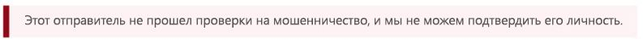

<span data-ttu-id="fc6c6-208">Только просмотрев строку От: адрес и зная адрес почты вашего получателя, либо выполнив проверку заголовков сообщений электронной почты, вы можете выявить разницу между внутренним и междоменным спуфингом.</span><span class="sxs-lookup"><span data-stu-id="fc6c6-208">It's only by looking at the From: address and knowing what your recipient email is, or by inspecting the email headers, that you can differentiate between intra-org and cross-domain spoofing.</span></span>

## <a name="how-customers-of-office-365-can-prepare-themselves-for-the-new-anti-spoofing-protection"></a><span data-ttu-id="fc6c6-209">Как клиенты Office 365 могут подготовиться к использованию новой защиты от спуфинга</span><span class="sxs-lookup"><span data-stu-id="fc6c6-209">How customers of Office 365 can prepare themselves for the new anti-spoofing protection</span></span>

### <a name="information-for-administrators"></a><span data-ttu-id="fc6c6-210">Информация для администраторов</span><span class="sxs-lookup"><span data-stu-id="fc6c6-210">Information for administrators</span></span>

<span data-ttu-id="fc6c6-211">Администратор организации, использующей Office 365, должен иметь понимание о том, что существует несколько ключевых фрагментов информации, которые следует учитывать.</span><span class="sxs-lookup"><span data-stu-id="fc6c6-211">As an administrator of an organization in Office 365, there are several key pieces of information you should be aware of.</span></span>

### <a name="understanding-why-email-authentication-is-not-always-enough-to-stop-spoofing"></a><span data-ttu-id="fc6c6-212">Необходимо понимать, почему проверки подлинности электронной почты не всегда достаточно для борьбы со спуфингом</span><span class="sxs-lookup"><span data-stu-id="fc6c6-212">Understanding why email authentication is not always enough to stop spoofing</span></span>

<span data-ttu-id="fc6c6-213">Новые средства защиты от спуфинга опираются на проверку подлинности электронной почты (SPF, DKIM и DMARC), чтобы не помечать сообщения как поддельные.</span><span class="sxs-lookup"><span data-stu-id="fc6c6-213">The new anti-spoofing protection relies on email authentication (SPF, DKIM, and DMARC) to not mark a message as spoofing.</span></span> <span data-ttu-id="fc6c6-214">Типичный пример — ситуация, когда домен отправителя не имеет опубликованных записей SPF.</span><span class="sxs-lookup"><span data-stu-id="fc6c6-214">A common example is when a sending domain has never published SPF records.</span></span> <span data-ttu-id="fc6c6-215">При отсутствии записей SPF не их некорректной настройке, отправленное сообщения будет помечаться как поддельное, если только у корпорация Майкрософт не будет данных внутренние логики операций о том, что сообщение является подлинным.</span><span class="sxs-lookup"><span data-stu-id="fc6c6-215">If there are no SPF records or they are incorrectly set up, a sent message will be marked as spoofed unless Microsoft has back-end intelligence that says the message is legitimate.</span></span>

<span data-ttu-id="fc6c6-216">Например, перед развертыванием защиты от спуфинга сообщение могло выглядеть как сообщение без записей SPF, записей DKIM и записей DMARC.</span><span class="sxs-lookup"><span data-stu-id="fc6c6-216">For example, prior to anti-spoofing being deployed, a message may have looked like the following with no SPF record, no DKIM record, and no DMARC record:</span></span>

```text
Authentication-Results: spf=none (sender IP is 1.2.3.4)
  smtp.mailfrom=fabrikam.com; contoso.com; dkim=none
  (message not signed) header.d=none; contoso.com; dmarc=none
  action=none header.from=fabrikam.com;
From: sender @ fabrikam.com
To: receiver @ contoso.com
```

<span data-ttu-id="fc6c6-217">После развертывания защиты от спуфинга, если вы используете корпоративные версии Office 365 E5, EOP или ATP, значение compauth проставляется:</span><span class="sxs-lookup"><span data-stu-id="fc6c6-217">After anti-spoofing, if you have Office 365 Enterprise E5, EOP, or ATP, the compauth value is stamped:</span></span>

```text
Authentication-Results: spf=none (sender IP is 1.2.3.4)
  smtp.mailfrom=fabrikam.com; contoso.com; dkim=none
  (message not signed) header.d=none; contoso.com; dmarc=none
  action=none header.from=fabrikam.com; compauth=fail reason=001
From: sender @ fabrikam.com
To: receiver @ contoso.com
```

<span data-ttu-id="fc6c6-218">Если fabrikam.com устраняет эту проблему, настроив запись SPF, а не запись DKIM, это могло бы позволить пройти многофакторную аутентификацию, так как домен, прошедший проверку SPF, соответствует домену в строке От: адрес:</span><span class="sxs-lookup"><span data-stu-id="fc6c6-218">If fabrikam.com fixed this by setting up an SPF record but not a DKIM record, this would pass composite authentication because the domain that passed SPF aligned with the domain in the From: address:</span></span>

```text
Authentication-Results: spf=pass (sender IP is 1.2.3.4)
  smtp.mailfrom=fabrikam.com; contoso.com; dkim=none
  (message not signed) header.d=none; contoso.com; dmarc=bestguesspass
  action=none header.from=fabrikam.com; compauth=pass reason=109
From: sender @ fabrikam.com
To: receiver @ contoso.com
```

<span data-ttu-id="fc6c6-219">Либо, если будет настроена DKIM запись, а не запись SPF, это также позволит пройти многофакторную аутентификацию, так как домен в подписи DKIM соответствует домену в строке От: адрес:</span><span class="sxs-lookup"><span data-stu-id="fc6c6-219">Or, if they set up a DKIM record but not an SPF record, this would also pass composite authentication because the domain in the DKIM-Signature that passed aligned with the domain in the From: address:</span></span>

```text
Authentication-Results: spf=none (sender IP is 1.2.3.4)
  smtp.mailfrom=fabrikam.com; contoso.com; dkim=pass
  (signature was verified) header.d=outbound.fabrikam.com;
  contoso.com; dmarc=bestguesspass action=none
  header.from=fabrikam.com; compauth=pass reason=109
From: sender @ fabrikam.com
To: receiver @ contoso.com
```

<span data-ttu-id="fc6c6-220">Тем не менее, фишер может также настроить SPF и DKIM и подписать сообщение с помощью своего домена, но указать другой домен в строке От: адрес.</span><span class="sxs-lookup"><span data-stu-id="fc6c6-220">However, a phisher may also set up SPF and DKIM and sign the message with their own domain, but specify a different domain in the From: address.</span></span> <span data-ttu-id="fc6c6-221">Ни SPF, ни DKIM не требуют, чтобы домен соответствовал домену в строке От: адрес, поэтому если fabrikam.com не имеет опубликованные записи DMARC, сообщение не будет помечаться как поддельное с помощью DMARC:</span><span class="sxs-lookup"><span data-stu-id="fc6c6-221">Neither SPF nor DKIM requires the domain to align with the domain in the From: address, so unless fabrikam.com published DMARC records, this would not be marked as a spoof using DMARC:</span></span>

```text
Authentication-Results: spf=pass (sender IP is 5.6.7.8)
  smtp.mailfrom=maliciousDomain.com; contoso.com; dkim=pass
  (signature was verified) header.d=maliciousDomain.com;
  contoso.com; dmarc=none action=none header.from=fabrikam.com;
From: sender @ fabrikam.com
To: receiver @ contoso.com
```

<span data-ttu-id="fc6c6-222">В почтовом клиенте (Outlook, веб-версия Outlook или другие почтовые клиенты) отображается только строка От: домен, а не домен в SPF или DKIM, и это может ввести в заблуждение пользователя, который может подумать, что сообщение отправлено с домена fabrikam.com, но фактически оно пришло с домена maliciousDomain.com.</span><span class="sxs-lookup"><span data-stu-id="fc6c6-222">In the email client (Outlook, Outlook on the web, or any other email client), only the From: domain is displayed, not the domain in the SPF or DKIM, and that can mislead the user into thinking the message came from fabrikam.com, but actually came from maliciousDomain.com.</span></span>


<span data-ttu-id="fc6c6-224">По этой причине Office 365 требует, чтобы домен в строке От: адрес совпадал с доменом в подписи SPF или DKIM, а если этого не произошло, домен должен содержать некоторые внутренние сигналы, которые указывают на то, что сообщение является подлинным.</span><span class="sxs-lookup"><span data-stu-id="fc6c6-224">For that reason, Office 365 requires that the domain in the From: address aligns with the domain in the SPF or DKIM signature, and if it doesn't, contains some other internal signals that indicates that the message is legitimate.</span></span> <span data-ttu-id="fc6c6-225">В противном случае сообщение не сможет пройти многофакторную аутентификацию.</span><span class="sxs-lookup"><span data-stu-id="fc6c6-225">Otherwise, the message would be a compauth fail.</span></span>

```text
Authentication-Results: spf=none (sender IP is 5.6.7.8)
  smtp.mailfrom=maliciousDomain.com; contoso.com; dkim=pass
  (signature was verified) header.d=maliciousDomain.com;
  contoso.com; dmarc=none action=none header.from=contoso.com;
  compauth=fail reason=001
From: sender@contoso.com
To: someone@fabrikam.com
```

<span data-ttu-id="fc6c6-226">Таким образом, защита от спуфинга в Office 365 защищает от доменов без проверки подлинности, а также от доменов, которые настроили проверку подлинности, но не соответствуют домену в строке От: адрес, так как именно этот домен пользователь видит и полагает, что это домен отправителя сообщения.</span><span class="sxs-lookup"><span data-stu-id="fc6c6-226">Thus, Office 365 anti-spoofing protects against domains with no authentication, and against domains who set up authentication but mismatch against the domain in the From: address as that is the one that the user sees and believes is the sender of the message.</span></span> <span data-ttu-id="fc6c6-227">Это справедливо как для внешних для вашей организации доменов, так и для доменов в пределах организации.</span><span class="sxs-lookup"><span data-stu-id="fc6c6-227">This is true both of domains external to your organization, as well as domains within your organization.</span></span>

<span data-ttu-id="fc6c6-228">Таким образом, если вы когда-нибудь получали сообщение, которое не прошло многофакторную аутентификацию и помечается как поддельное, даже несмотря на то, что сообщение прошло проверку SPF и DKIM, это означает, что домен, который прошел проверку SPF и DKIM, не совпадает с доменом в строке От: адрес.</span><span class="sxs-lookup"><span data-stu-id="fc6c6-228">Therefore, if you ever receive a message that failed composite authentication and is marked as spoofed, even though the message passed SPF and DKIM, it's because the domain that passed SPF and DKIM are not aligned with the domain in the From: address.</span></span>

### <a name="understanding-changes-in-how-spoofed-emails-are-treated"></a><span data-ttu-id="fc6c6-229">Общие сведения об изменениях в обращении с поддельными сообщениями</span><span class="sxs-lookup"><span data-stu-id="fc6c6-229">Understanding changes in how spoofed emails are treated</span></span>

<span data-ttu-id="fc6c6-230">В настоящее время для всех организаций, использующих Office 365 — ATP и не ATP — сообщения, которые не смогли пройти DMARC и отклоняются или отправляются на карантин, помечаются как спам и обычно подпадают под действие с высокой уверенность в содержании спама, или иногда под регулярное действие для нежелательной почты (в зависимости от того, определили ли другие правила для спама его в качестве нежелательной почты).</span><span class="sxs-lookup"><span data-stu-id="fc6c6-230">Currently, for all organizations in Office 365 - ATP and non-ATP - messages that fail DMARC with a policy of reject or quarantine are marked as spam and usually take the high confidence spam action, or sometimes the regular spam action (depending on whether other spam rules first identify it as spam).</span></span> <span data-ttu-id="fc6c6-231">В случае обнаружения спуфинга внутри организации выполняются стандартные действия для нежелательной почты.</span><span class="sxs-lookup"><span data-stu-id="fc6c6-231">Intra-org spoof detections take the regular spam action.</span></span> <span data-ttu-id="fc6c6-232">Такое поведение не нуждается в активации, а также вы не можете его отключить.</span><span class="sxs-lookup"><span data-stu-id="fc6c6-232">This behavior does not need to be enabled, nor can it be disabled.</span></span>

<span data-ttu-id="fc6c6-233">Тем не менее, для сообщений с междоменным спуфингом до этого изменения выполнялись стандартные проверки для спама, фишинга и вредоносных программ, и если другая часть фильтра посчитает их подозрительными, они будут помечены как спам, фишинговое сообщение или вредоносная программа соответственно.</span><span class="sxs-lookup"><span data-stu-id="fc6c6-233">However, for cross-domain spoofing messages, before this change they would go through regular spam, phish, and malware checks and if other parts of the filter identified them as suspicious, would mark them as spam, phish, or malware respectively.</span></span> <span data-ttu-id="fc6c6-234">С помощью новой защиты от междоменного спуфинга для любого сообщения, которому не удается пройти проверку подлинности, по умолчанию, будут выполняться действия, определенные в политике защиты от фишинга \> спуфинга.</span><span class="sxs-lookup"><span data-stu-id="fc6c6-234">With the new cross-domain spoofing protection, any message that can't be authenticated will, by default, take the action defined in the Anti-phishing \> Anti-spoofing policy.</span></span> <span data-ttu-id="fc6c6-235">Если политика не определена, сообщение будет перемещаться в папку с нежелательной почтой.</span><span class="sxs-lookup"><span data-stu-id="fc6c6-235">If one is not defined, it will be moved to a users Junk Email folder.</span></span> <span data-ttu-id="fc6c6-236">В некоторых случаях более подозрительные сообщения также будут получать красный совет безопасности.</span><span class="sxs-lookup"><span data-stu-id="fc6c6-236">In some cases, more suspicious messages will also have the red safety tip added to the message.</span></span>

<span data-ttu-id="fc6c6-237">Это может привести к тому, что некоторые сообщения, которые ранее были помечены как спам, по-прежнему будут помечаться как спам, но будут также иметь красный совет по безопасности; в других случаях сообщения, которые ранее были отмечены как не являющиеся спамом, будут помечены как спам (CAT:SPOOF) с красным советом по безопасности.</span><span class="sxs-lookup"><span data-stu-id="fc6c6-237">This may result in some messages that were previously marked as spam still getting marked as spam but will now also have a red safety tip; in other cases, messages that were previously marked as non-spam will start getting marked as spam (CAT:SPOOF) with a red safety tip added.</span></span> <span data-ttu-id="fc6c6-238">В других случаях клиенты, которые перемещают все помеченные как спам и фишинг сообщения в карантин, теперь увидят, что они отправляются в папку нежелательной почты (такое поведение можно изменить, см. статью [Изменение параметров защиты от спуфинга](#changing-your-anti-spoofing-settings)).</span><span class="sxs-lookup"><span data-stu-id="fc6c6-238">In still other cases, customers that were moving all spam and phish to the quarantine would now see them going to the Junk Mail Folder (this behavior can be changed, see [Changing your anti-spoofing settings](#changing-your-anti-spoofing-settings)).</span></span>

<span data-ttu-id="fc6c6-239">Существует несколько способов, с помощью которых можно подделать сообщение (см. [Различия между разными видами спуфинга](#differentiating-between-different-types-of-spoofing) выше в этой статье), но на март 2018 г. то, как Office 365 работает с такими сообщениями, еще не унифицировано.</span><span class="sxs-lookup"><span data-stu-id="fc6c6-239">There are multiple different ways a message can be spoofed (see  [Differentiating between different types of spoofing](#differentiating-between-different-types-of-spoofing) earlier in this article) but as of March 2018 the way Office 365 treats these messages is not yet unified.</span></span> <span data-ttu-id="fc6c6-240">В таблице ниже представлен краткий обзор с новым поведением средства защиты от междоменного спуфинга:</span><span class="sxs-lookup"><span data-stu-id="fc6c6-240">The following table is a quick summary, with Cross-domain spoofing protection being new behavior:</span></span>

|<span data-ttu-id="fc6c6-241">**Тип спуфинга**</span><span class="sxs-lookup"><span data-stu-id="fc6c6-241">**Type of spoof**</span></span>|<span data-ttu-id="fc6c6-242">**Категория**</span><span class="sxs-lookup"><span data-stu-id="fc6c6-242">**Category**</span></span>|<span data-ttu-id="fc6c6-243">**Добавлен совет по безопасности?**</span><span class="sxs-lookup"><span data-stu-id="fc6c6-243">**Safety tip added?**</span></span>|<span data-ttu-id="fc6c6-244">**Относится к**</span><span class="sxs-lookup"><span data-stu-id="fc6c6-244">**Applies to**</span></span>|
|:-----|:-----|:-----|:-----|
|<span data-ttu-id="fc6c6-245">Сбой DMARC (карантин или отклонение)</span><span class="sxs-lookup"><span data-stu-id="fc6c6-245">DMARC fail (quarantine or reject)</span></span>|<span data-ttu-id="fc6c6-246">HSPM (по умолчанию), также может быть SPM или PHSH</span><span class="sxs-lookup"><span data-stu-id="fc6c6-246">HSPM (default), may also be SPM or PHSH</span></span>|<span data-ttu-id="fc6c6-247">Нет (еще нет)</span><span class="sxs-lookup"><span data-stu-id="fc6c6-247">No (not yet)</span></span>|<span data-ttu-id="fc6c6-248">Всем клиентам Office 365, Outlook.com</span><span class="sxs-lookup"><span data-stu-id="fc6c6-248">All Office 365 customers, Outlook.com</span></span>|
|<span data-ttu-id="fc6c6-249">Внутри организации</span><span class="sxs-lookup"><span data-stu-id="fc6c6-249">Self-to-self</span></span>|<span data-ttu-id="fc6c6-250">SPM</span><span class="sxs-lookup"><span data-stu-id="fc6c6-250">SPM</span></span>|<span data-ttu-id="fc6c6-251">Да</span><span class="sxs-lookup"><span data-stu-id="fc6c6-251">Yes</span></span>|<span data-ttu-id="fc6c6-252">Все организации, использующие Office 365, Outlook.com</span><span class="sxs-lookup"><span data-stu-id="fc6c6-252">All Office 365 organizations, Outlook.com</span></span>|
|<span data-ttu-id="fc6c6-253">Междоменная</span><span class="sxs-lookup"><span data-stu-id="fc6c6-253">Cross-domain</span></span>|<span data-ttu-id="fc6c6-254">ПОДДЕЛКА</span><span class="sxs-lookup"><span data-stu-id="fc6c6-254">SPOOF</span></span>|<span data-ttu-id="fc6c6-255">Да</span><span class="sxs-lookup"><span data-stu-id="fc6c6-255">Yes</span></span>|<span data-ttu-id="fc6c6-256">Продвинутая защита от угроз Office 365 и клиенты E5</span><span class="sxs-lookup"><span data-stu-id="fc6c6-256">Office 365 Advanced Threat Protection and E5 customers</span></span>|

### <a name="changing-your-anti-spoofing-settings"></a><span data-ttu-id="fc6c6-257">Изменение параметров защиты от спуфинга</span><span class="sxs-lookup"><span data-stu-id="fc6c6-257">Changing your anti-spoofing settings</span></span>

<span data-ttu-id="fc6c6-258">Чтобы создать или обновить параметры защиты от спуфинга (междоменные), перейдите в раздел Настройки защиты от фишинга \> спуфинга на вкладке "Управление угрозами" \> "Политика" в Центре безопасности и соответствия требованиям.</span><span class="sxs-lookup"><span data-stu-id="fc6c6-258">To create or update your (cross-domain) anti-spoofing settings, navigate to the Anti-phishing \> Anti-spoofing settings under the Threat Management \> Policy tab in the Security & Compliance Center.</span></span> <span data-ttu-id="fc6c6-259">Если вы еще не создали параметры защиты от фишинга, необходимо будет создать данные параметры:</span><span class="sxs-lookup"><span data-stu-id="fc6c6-259">If you have never created any anti-phishing settings, you will need to create one:</span></span>

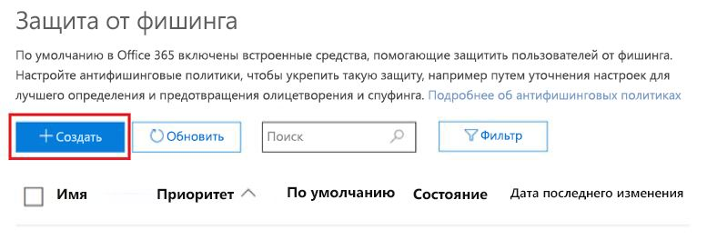

<span data-ttu-id="fc6c6-261">Если вы уже создали политику, вы можете выбрать вашу политику и изменить ее:</span><span class="sxs-lookup"><span data-stu-id="fc6c6-261">If you've already created one, you can select it to modify it:</span></span>

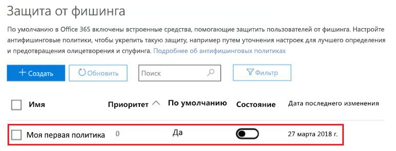

<span data-ttu-id="fc6c6-263">Выберите политику, которую вы только что создали, и выполните все необходимые действия, описанные в разделе [Дополнительные сведения об анализе подделок](learn-about-spoof-intelligence.md).</span><span class="sxs-lookup"><span data-stu-id="fc6c6-263">Select the policy you just created and proceed through the steps as described in [Learn more about spoof intelligence](learn-about-spoof-intelligence.md).</span></span>

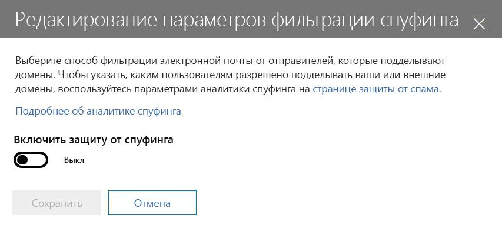

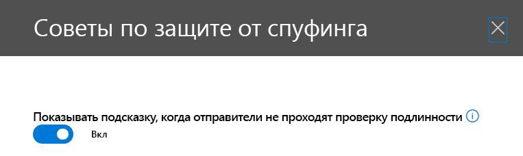

<span data-ttu-id="fc6c6-266">Чтобы создать новую политику с помощью PowerShell:</span><span class="sxs-lookup"><span data-stu-id="fc6c6-266">To create a new policy by using PowerShell:</span></span>

```powershell
$org = Get-OrganizationConfig
$name = "My first anti-phishing policy for " + $org.Name
# Note: The name should not exclude 64 characters, including spaces.
# If it does, you will need to pick a smaller name.
# Next, create a new anti-phishing policy with the default values
New-AntiphishPolicy -Name $Name
# Select the domains to scope it to
# Multiple domains are specified in a comma-separated list
$domains = "domain1.com, domain2.com, domain3.com"
# Next, create the anti-phishing rule, scope it to the anti-phishing rule
New-AntiphishRule -Name $name -AntiphishPolicy $name -RecipientDomainIs $domains
```

<span data-ttu-id="fc6c6-267">Вы можете впоследствии изменять параметры политики защиты от фишинга с помощью PowerShell, руководствуясь документацией в [Set-AntiphishPolicy](https://docs.microsoft.com/powershell/module/exchange/advanced-threat-protection/Set-AntiPhishPolicy).</span><span class="sxs-lookup"><span data-stu-id="fc6c6-267">You may then modify the anti-phishing policy parameters using PowerShell, following the documentation at [Set-AntiphishPolicy](https://docs.microsoft.com/powershell/module/exchange/advanced-threat-protection/Set-AntiPhishPolicy).</span></span> <span data-ttu-id="fc6c6-268">Вы можете задать $name в качестве параметра:</span><span class="sxs-lookup"><span data-stu-id="fc6c6-268">You may specify the $name as a parameter:</span></span>

```powershell
Set-AntiphishPolicy -Identity $name <fill in rest of parameters>
```

<span data-ttu-id="fc6c6-269">Позднее в 2018 г., вместо того чтобы создавать политику по умолчанию, она будет создана для вас и будет включать всех получателей в вашей организации, так что вам не нужно будет указывать их вручную (снимки экрана ниже поменяются перед выходом окончательной реализации).</span><span class="sxs-lookup"><span data-stu-id="fc6c6-269">Later in 2018, rather than you having to create a default policy, one will be created for you that is scoped to all the recipients in your organization so you don't have to specify it manually (the screenshots below are subject to change before the final implementation).</span></span>

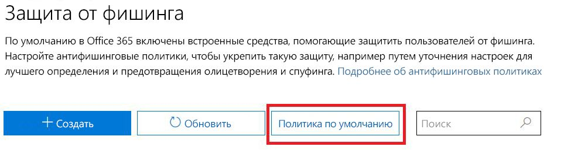

<span data-ttu-id="fc6c6-271">В отличие от политики, которую вы создаете самостоятельно, вы не можете  удалить политику по умолчанию, изменить ее приоритет или выбрать, какие пользователи, домены или группы будут подпадать под ее действие.</span><span class="sxs-lookup"><span data-stu-id="fc6c6-271">Unlike a policy that you create, you cannot delete the default policy, modify its priority, or choose which users, domains, or groups to scope it to.</span></span>

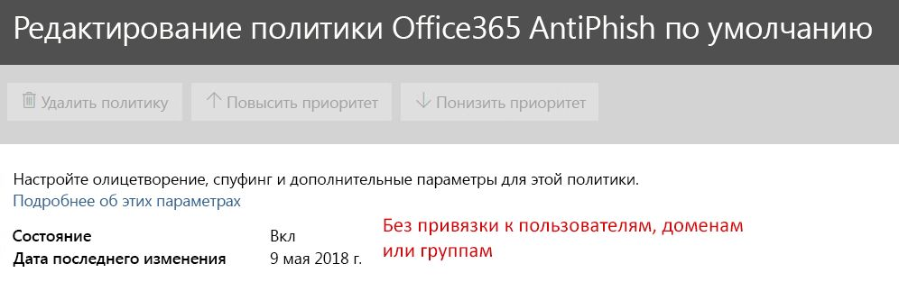

<span data-ttu-id="fc6c6-273">Чтобы настроить защиту по умолчанию с помощью PowerShell:</span><span class="sxs-lookup"><span data-stu-id="fc6c6-273">To set up your default protection by using PowerShell:</span></span>

```powershell
$defaultAntiphishPolicy = Get-AntiphishPolicy | ? {$_.IsDefault -eq $true}
Set-AntiphishPolicy -Identity $defaultAntiphishPolicy.Name -EnableAntispoofEnforcement <$true|$false>
```

<span data-ttu-id="fc6c6-274">Защиту от спуфинга следует отключить только в случае, если у вас есть другой почтовый сервер или серверы помимо Office 365 (см. Допустимые сценарии отключения защита от спуфинга, для получения дополнительных сведений).</span><span class="sxs-lookup"><span data-stu-id="fc6c6-274">You should only disable anti-spoofing protection if you have another mail server or servers in front of Office 365 (see Legitimate scenarios to disable anti-spoofing for more details).</span></span>

```powershell
$defaultAntiphishPolicy = Get-AntiphishiPolicy | ? {$_.IsDefault $true}
Set-AntiphishPolicy -Identity $defaultAntiphishPolicy.Name -EnableAntispoofEnforcement $false
```

> [!IMPORTANT]
> <span data-ttu-id="fc6c6-275">Если первая остановка в пути вашей электронной почты — это Office 365, а вы получаете слишком много корректных сообщений электронной почты, помеченных как подделка, необходимо сначала настроить списки отправителей, которым разрешено отправлять подделанные электронные сообщения на ваш домен (см. раздел [Управление добросовестными отправителями, которые отправляют неавторизованную электронную почту](#managing-legitimate-senders-who-are-sending-unauthenticated-email) в этой статье).</span><span class="sxs-lookup"><span data-stu-id="fc6c6-275">If the first hop in your email path is Office 365, and you are getting too many legitimate emails marked as spoof, you should first set up your senders that are allowed to send spoofed email to your domain (see the  [Managing legitimate senders who are sending unauthenticated email](#managing-legitimate-senders-who-are-sending-unauthenticated-email) section in this topic.</span></span> <span data-ttu-id="fc6c6-276">Если вы продолжаете получать слишком много ложных срабатываний (т. е. корректные сообщения помечаются как подделки), мы НЕ рекомендуем полностью отключать защиту от спуфинга.</span><span class="sxs-lookup"><span data-stu-id="fc6c6-276">If you are still getting too many false positives (that is, legitimate messages marked as spoof), we do NOT recommend disabling anti-spoofing protection altogether.</span></span> <span data-ttu-id="fc6c6-277">Вместо этого мы рекомендуем выбрать параметр «Базовая» (Basic) вместо параметра «Высокий уровень защиты» (High protection).</span><span class="sxs-lookup"><span data-stu-id="fc6c6-277">Instead, we recommend choosing Basic instead of High protection.</span></span> <span data-ttu-id="fc6c6-278">Лучше разобраться с ложными срабатываниями, чем поставить вашу организацию под угрозу получения подделанных сообщений, что может привести к значительно более высоким издержкам в долгосрочной перспективе.</span><span class="sxs-lookup"><span data-stu-id="fc6c6-278">It is better to work through false positives than to expose your organization to spoofed email which could end up imposing significantly higher costs in the long term.</span></span>

### <a name="managing-legitimate-senders-who-are-sending-unauthenticated-email"></a><span data-ttu-id="fc6c6-279">Управление добросовестными отправителями, которые отправляют неавторизованную электронную почту</span><span class="sxs-lookup"><span data-stu-id="fc6c6-279">Managing legitimate senders who are sending unauthenticated email</span></span>

<span data-ttu-id="fc6c6-280">Office 365 сохраняет сведения о том, кто отправляет неавторизованную электронную почты вашей организации.</span><span class="sxs-lookup"><span data-stu-id="fc6c6-280">Office 365 keeps track of who is sending unauthenticated email to your organization.</span></span> <span data-ttu-id="fc6c6-281">Если служба считает, что отправитель не является надежным, сообщение будет помечена как вызвавшее сбой *compauth*.</span><span class="sxs-lookup"><span data-stu-id="fc6c6-281">If the service thinks the sender is not legitimate, it will mark it as a *compauth* failure.</span></span> <span data-ttu-id="fc6c6-282">Оно будет рассматриваться как ПОДДЕЛКА, а последующие действия с сообщением зависят от политики защиты от спуфинга.</span><span class="sxs-lookup"><span data-stu-id="fc6c6-282">This will be classified as SPOOF although it depends on your anti-spoofing policy that was applied to the message.</span></span>

<span data-ttu-id="fc6c6-283">Тем не менее, как администратор вы можете указать, кому из отправителей разрешено отправлять поддельные сообщения переопределяя решение Office 365.</span><span class="sxs-lookup"><span data-stu-id="fc6c6-283">However, as an administrator, you can specify which senders are permitted to send spoofed email, overriding Office 365's decision.</span></span>

#### <a name="method-1---if-your-organization-owns-the-domain-set-up-email-authentication"></a><span data-ttu-id="fc6c6-284">Способ 1 — Настройка проверки подлинности электронной почты, если ваша организация является владельцем домена</span><span class="sxs-lookup"><span data-stu-id="fc6c6-284">Method 1 - If your organization owns the domain, set up email authentication</span></span>

<span data-ttu-id="fc6c6-285">Этот способ можно использовать для устранения спуфинга внутри организации, а также междоменного спуфинга в случаях, когда вы владеете или взаимодействуете с несколькими клиентами.</span><span class="sxs-lookup"><span data-stu-id="fc6c6-285">This method can be used to resolve intra-org spoofing, and cross-domain spoofing in cases where you own or interact with multiple tenants.</span></span> <span data-ttu-id="fc6c6-286">Это также позволяет устранить междоменный спуфинг, когда отправляются сообщения пользователям в среде Office 365, а также третьим сторонам, пользующимся другими провайдерами услуг.</span><span class="sxs-lookup"><span data-stu-id="fc6c6-286">It also helps resolve cross-domain spoofing where you send to other customers within Office 365, and also third parties that are hosted in other providers.</span></span>

<span data-ttu-id="fc6c6-287">Дополнительные сведения см. в статье [Клиенты Office 365](#customers-of-office-365).</span><span class="sxs-lookup"><span data-stu-id="fc6c6-287">For more details, see [Customers of Office 365](#customers-of-office-365).</span></span>

#### <a name="method-2---use-spoof-intelligence-to-configure-permitted-senders-of-unauthenticated-email"></a><span data-ttu-id="fc6c6-288">Способ 2 — Использование логики определения спуфинга, чтобы настроить разрешенных отправителей неавторизованной электронной почты</span><span class="sxs-lookup"><span data-stu-id="fc6c6-288">Method 2 - Use Spoof intelligence to configure permitted senders of unauthenticated email</span></span>

<span data-ttu-id="fc6c6-289">Вы также можете использовать [логику определения спуфинга](learn-about-spoof-intelligence.md), чтобы предоставить отправителям разрешение на передачу неавторизованных сообщений в вашей организации.</span><span class="sxs-lookup"><span data-stu-id="fc6c6-289">You can also use [Spoof Intelligence](learn-about-spoof-intelligence.md) to permit senders to transmit unauthenticated messages to your organization.</span></span>

<span data-ttu-id="fc6c6-290">Для внешних доменов подделанный пользователь определяется по домену в форме адреса, в то время как используемая для отправки инфраструктура представляет собой либо IP-адрес отправителя (поделенный на диапазоны /24 CIDR), или домен организации в записи PTR (в приведенном ниже снимке экрана, IP-адрес отправителя может быть 131.107.18.4, запись PTR outbound.mail.protection.outlook.com, и это будет выглядеть как outlook.com для инфраструктуры отправки).</span><span class="sxs-lookup"><span data-stu-id="fc6c6-290">For external domains, the spoofed user is the domain in the From address, while the sending infrastructure is either the sending IP address (divided up into /24 CIDR ranges), or the organizational domain of the PTR record (in the screenshot below, the sending IP might be 131.107.18.4 whose PTR record is outbound.mail.protection.outlook.com, and this would show up as outlook.com for the sending infrastructure).</span></span>

<span data-ttu-id="fc6c6-291">Чтобы предоставить этому отправителю разрешение на отправку неавторизованной электронной почты, измените значение с **Нет** на **Да**.</span><span class="sxs-lookup"><span data-stu-id="fc6c6-291">To permit this sender to send unauthenticated email, change the **No** to a **Yes**.</span></span>


<span data-ttu-id="fc6c6-293">Вы также можете разрешить PowerShell позволять определенному отправителю подделывать ваш домен:</span><span class="sxs-lookup"><span data-stu-id="fc6c6-293">You can also use PowerShell to allow specific sender to spoof your domain:</span></span>

```powershell
$file = "C:\My Documents\Summary Spoofed Internal Domains and Senders.csv"
Get-PhishFilterPolicy -Detailed -SpoofAllowBlockList -SpoofType External | Export-CSV $file
```


<span data-ttu-id="fc6c6-295">На предыдущем рисунке дополнительные разрывы были добавлены чтобы вместить снимок экрана.</span><span class="sxs-lookup"><span data-stu-id="fc6c6-295">In the previous image, additional line breaks have been added to make this screenshot fit.</span></span> <span data-ttu-id="fc6c6-296">Как правило, все значения отображаются в одной строке.</span><span class="sxs-lookup"><span data-stu-id="fc6c6-296">Normally, all the values would appear on a single line.</span></span>

<span data-ttu-id="fc6c6-297">Отредактируйте файл и вид линии, которая соответствует outlook.com и поисковой системе bing.com и измените значение записи AllowedToSpoof с Нет на Да:</span><span class="sxs-lookup"><span data-stu-id="fc6c6-297">Edit the file and look for the line that corresponds to outlook.com and bing.com, and change the AllowedToSpoof entry from No to Yes:</span></span>


<span data-ttu-id="fc6c6-299">Сохраните файл, а затем выполните запуск.</span><span class="sxs-lookup"><span data-stu-id="fc6c6-299">Save the file, and then run:</span></span>

```powershell
$UpdateSpoofedSenders = Get-Content -Raw "C:\My Documents\Spoofed Senders.csv"
Set-PhishFilterPolicy -Identity Default -SpoofAllowBlockList $UpdateSpoofedSenders
```

<span data-ttu-id="fc6c6-300">Это позволит поисковой системе bing.com, отправлять неавторизованные электронные сообщения с домена \*. outlook.com.</span><span class="sxs-lookup"><span data-stu-id="fc6c6-300">This will now allow bing.com to send unauthenticated email from \*.outlook.com.</span></span>

#### <a name="method-3---create-an-allow-entry-for-the-senderrecipient-pair"></a><span data-ttu-id="fc6c6-301">Способ 3 — Создание разрешающей записи для пары отправитель-получатель</span><span class="sxs-lookup"><span data-stu-id="fc6c6-301">Method 3 - Create an allow entry for the sender/recipient pair</span></span>

<span data-ttu-id="fc6c6-302">Вы также можете обойти всех методы фильтрации нежелательной почты для определенного отправителя.</span><span class="sxs-lookup"><span data-stu-id="fc6c6-302">You can also choose to bypass all spam filtering for a particular sender.</span></span> <span data-ttu-id="fc6c6-303">Дополнительные сведения см. в статье [Как безопасно добавить отправителя в список разрешенных в Office 365](https://blogs.msdn.microsoft.com/tzink/2017/11/29/how-to-securely-add-a-sender-to-an-allow-list-in-office-365/).</span><span class="sxs-lookup"><span data-stu-id="fc6c6-303">For more details, see [How to securely add a sender to an allow list in Office 365](https://blogs.msdn.microsoft.com/tzink/2017/11/29/how-to-securely-add-a-sender-to-an-allow-list-in-office-365/).</span></span>

<span data-ttu-id="fc6c6-304">Если вы используете этот метод, будет пропущена фильтрация нежелательной почты и фишинговых сообщений, но не фильтрация вредоносных программ.</span><span class="sxs-lookup"><span data-stu-id="fc6c6-304">If you use this method, it will skip spam and some of the phish filtering, but not malware filtering.</span></span>

#### <a name="method-4---contact-the-sender-and-ask-them-to-set-up-email-authentication"></a><span data-ttu-id="fc6c6-305">Способ 4 — Связаться с отправителем и попросить его настроить проверку подлинности электронной почты</span><span class="sxs-lookup"><span data-stu-id="fc6c6-305">Method 4 - Contact the sender and ask them to set up email authentication</span></span>

<span data-ttu-id="fc6c6-306">Из-за проблем со спамом и фишинговыми сообщениями корпорация Майкрософт рекомендует всем отправителям выполнить настройку проверки подлинности электронной почты.</span><span class="sxs-lookup"><span data-stu-id="fc6c6-306">Because of the problem of spam and phishing, Microsoft recommends all senders set up email authentication.</span></span> <span data-ttu-id="fc6c6-307">Если вы знаете администратора домена отправителя, свяжитесь с ним и попросите настроить записи для проверки подлинности электронной почты, чтобы вам не нужно было добавлять переопределения.</span><span class="sxs-lookup"><span data-stu-id="fc6c6-307">If you know an administrator of the sending domain, contact them and request that they set up email authentication records so you do not have to add any overrides.</span></span> <span data-ttu-id="fc6c6-308">Дополнительные сведения см. в статье [Администраторы доменов, которые не являются пользователями Office 365](#administrators-of-domains-that-are-not-office-365-customers) ниже в этой статье.</span><span class="sxs-lookup"><span data-stu-id="fc6c6-308">For more information, see [Administrators of domains that are not Office 365 customers](#administrators-of-domains-that-are-not-office-365-customers)" later in this article.</span></span>

<span data-ttu-id="fc6c6-309">Хотя сначала может показаться сложным заставить домены отправителя настроить проверку подлинности, но со временем, когда все новые и новые фильтры почты начнут отправлять в нежелательную почту или даже отклонять их почту, это заставит из настроить корректные записи для гарантии нормальной доставки почты.</span><span class="sxs-lookup"><span data-stu-id="fc6c6-309">While it may be difficult at first to get sending domains to authenticate, over time, as more and more email filters start junking or even rejecting their email, it will cause them to set up the proper records to ensure better delivery.</span></span>

### <a name="viewing-reports-of-how-many-messages-were-marked-as-spoofed"></a><span data-ttu-id="fc6c6-310">Просмотр отчетов о том, сколько сообщений было помечено как поддельные</span><span class="sxs-lookup"><span data-stu-id="fc6c6-310">Viewing reports of how many messages were marked as spoofed</span></span>

<span data-ttu-id="fc6c6-311">После включения политики защиты от спуфинга вы можете воспользоваться возможностями анализа угроз и реагирования на них, чтобы получить примерное количество сообщений, которые помечаются как фишинговые.</span><span class="sxs-lookup"><span data-stu-id="fc6c6-311">Once your anti-spoofing policy is enabled, you can use threat investigation and response capabilities to get numbers around how many messages are marked as phish.</span></span> <span data-ttu-id="fc6c6-312">Для этого перейдите в Центр безопасности и соответствия требованиям (SCC) в раздел "Управление угрозами" \> "Обозреватель", задайте для параметра "Вид" значение "Фишинг", а затем сгруппируйте сообщения по домену отправителя или состоянию защиты:</span><span class="sxs-lookup"><span data-stu-id="fc6c6-312">To do this, go into the Security & Compliance Center (SCC) under Threat Management \> Explorer, set the View to Phish, and group by Sender Domain or Protection Status:</span></span>

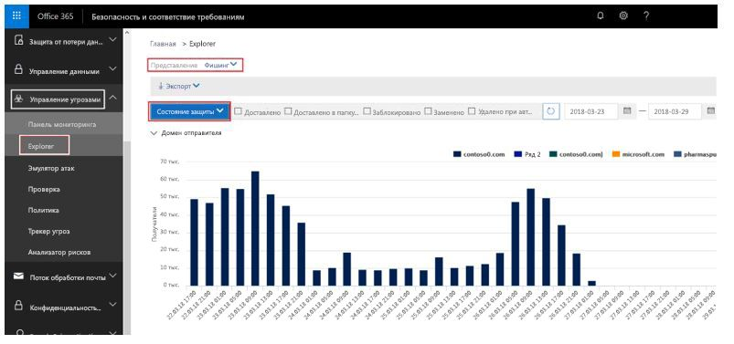

<span data-ttu-id="fc6c6-314">Вы можете взаимодействовать с различными отчетами, чтобы узнать, сколько сообщений были помечены как фишинговые, включая сообщения, помеченные как ПОДДЕЛКА.</span><span class="sxs-lookup"><span data-stu-id="fc6c6-314">You can interact with the various reports to see how many were marked as phishing, including messages marked as SPOOF.</span></span> <span data-ttu-id="fc6c6-315">Дополнительные сведения см. в статье [Начало работы с инструментом анализа угроз и реагирования на них в Office 365](office-365-ti.md).</span><span class="sxs-lookup"><span data-stu-id="fc6c6-315">To learn more, see [Get started with Office 365 Threat investigation and response](office-365-ti.md).</span></span>

<span data-ttu-id="fc6c6-316">В настоящий момент невозможно понять, какие сообщения были помечены из-за подделывания отправители в отличие от других типов фишинга (стандартный фишинг, подмена домена или пользователя и т. д.).</span><span class="sxs-lookup"><span data-stu-id="fc6c6-316">You can't yet split out which messages were marked due to spoofing as opposed to other types of phishing (general phishing, domain or user impersonation, and so on).</span></span> <span data-ttu-id="fc6c6-317">Тем не менее, позже вы сможете сделать это в Центре безопасности и соответствия требованиям.</span><span class="sxs-lookup"><span data-stu-id="fc6c6-317">However, later, you will be able to do this through the Security & Compliance Center.</span></span> <span data-ttu-id="fc6c6-318">После этого вы сможете использовать этот отчет в качестве отправной точки для определения доменов отправки, которые могут быть корректными, но помечаются как подделки из-за сбоя проверки подлинности.</span><span class="sxs-lookup"><span data-stu-id="fc6c6-318">Once you do, you can use this report as a starting place to identify sending domains that may be legitimate that are being marked as spoof due to failing authentication.</span></span>

<span data-ttu-id="fc6c6-319">На снимке экрана ниже представлено, как будут выглядеть эти данные, но внешний вид может измениться на момент выхода:</span><span class="sxs-lookup"><span data-stu-id="fc6c6-319">The following screenshot is a proposal for how this data will look, but may change when released:</span></span>

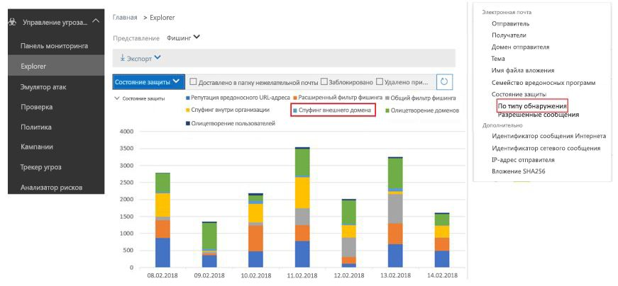

<span data-ttu-id="fc6c6-321">Для клиентов без ATP или обладателей подписки E5 эти отчеты будут доступны чуть позже в рамках отчетов о состоянии защиты от угроз, но при этом данные будут отображаться с задержкой не менее 24 часов.</span><span class="sxs-lookup"><span data-stu-id="fc6c6-321">For non-ATP and E5 customers, these reports will be available later under the Threat Protection Status (TPS) reports, but will be delayed by at least 24 hours.</span></span> <span data-ttu-id="fc6c6-322">Эта страница будет обновляться по мере интеграции функций в Центре безопасности и соответствия требованиям.</span><span class="sxs-lookup"><span data-stu-id="fc6c6-322">This page will be updated as they are integrated into the Security & Compliance Center.</span></span>

### <a name="predicting-how-many-messages-will-be-marked-as-spoof"></a><span data-ttu-id="fc6c6-323">Прогнозирование количества сообщений, которые будут помечены как подделки</span><span class="sxs-lookup"><span data-stu-id="fc6c6-323">Predicting how many messages will be marked as spoof</span></span>

<span data-ttu-id="fc6c6-324">После того, как Office 365 обновит параметры, которые позволяют отключить защиту от спуфинга обновлений Office 365, или включить базовый или высокий уровень данной защиты, вы получите возможность видеть изменения распределения сообщений при использовании различных параметров.</span><span class="sxs-lookup"><span data-stu-id="fc6c6-324">Once Office 365 updates its settings to let you turn the anti-spoofing enforcement Off, or on with Basic or High enforcement, you will be given the ability to see how message disposition will change at the various settings.</span></span> <span data-ttu-id="fc6c6-325">То есть при отключенной защите от спуфинга вы сможете увидеть, сколько сообщений будет помечено как подделанные, если вы активируете базовый уровень защиты; кроме того, при включенной базовой защите вы сможете увидеть, сколько сообщений будет помечено как подделанные, если вы активируете высокий уровень защиты.</span><span class="sxs-lookup"><span data-stu-id="fc6c6-325">That is, if anti-spoofing is Off, you will be able to see how many messages will be detected as Spoof if you turn to Basic; or, if it's Basic, you will be able to see how many more messages will be detected as Spoof if you turn it to High.</span></span>

<span data-ttu-id="fc6c6-326">Эта возможность в настоящее время находится в процессе разработки.</span><span class="sxs-lookup"><span data-stu-id="fc6c6-326">This feature is currently under development.</span></span> <span data-ttu-id="fc6c6-327">По мере уточнения деталей эта страница будет обновлена и получит скриншоты Центра безопасности и соответствия требованиям и примеры использования оболочки PowerShell.</span><span class="sxs-lookup"><span data-stu-id="fc6c6-327">As more details are defined, this page will be updated both with screenshots of the Security and Compliance Center, and with PowerShell examples.</span></span>


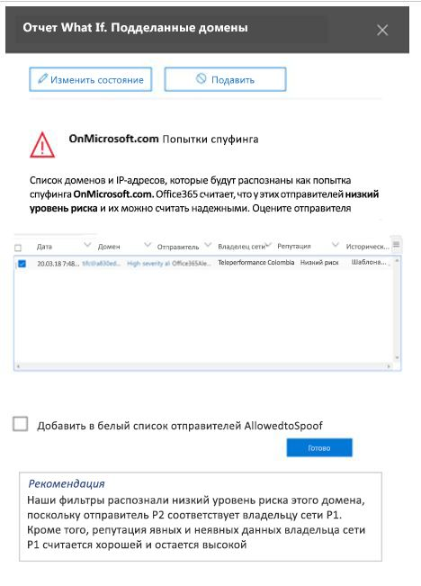

### <a name="legitimate-scenarios-to-disable-anti-spoofing"></a><span data-ttu-id="fc6c6-330">Легитимные сценарии отключения защиты от спуфинга</span><span class="sxs-lookup"><span data-stu-id="fc6c6-330">Legitimate scenarios to disable anti-spoofing</span></span>

<span data-ttu-id="fc6c6-331">Защита от спуфинга лучше защищает клиентов от фишинговых атак, и поэтому мы не рекомендуем отключать защиту от спуфинга.</span><span class="sxs-lookup"><span data-stu-id="fc6c6-331">Anti-spoofing better protects customers from phishing attacks, and therefore disabling anti-spoofing protection is strongly discouraged.</span></span> <span data-ttu-id="fc6c6-332">Отключив политику, вы можете устранить некоторые краткосрочные ложные срабатывания, но в долгосрочном плане это связано с небольшими рисками.</span><span class="sxs-lookup"><span data-stu-id="fc6c6-332">By disabling it, you may resolve some short-term false positives, but long term you will be exposed to more risk.</span></span> <span data-ttu-id="fc6c6-333">Расходы на настройку проверки подлинности на стороне отправителя или внесение изменений в политики защиты от фишинга, обычно являются единовременными или требуют только минимальных периодических действий.</span><span class="sxs-lookup"><span data-stu-id="fc6c6-333">The cost for setting up authentication on the sender side, or making adjustments in the phishing policies, are usually one-time events or require only minimal, periodic maintenance.</span></span> <span data-ttu-id="fc6c6-334">Тем не менее затраты на устранение последствий фишинговых атак, когда данные или активы были скомпрометированы, гораздо выше.</span><span class="sxs-lookup"><span data-stu-id="fc6c6-334">However, the cost to recover from a phishing attack where data has been exposed, or assets have been compromised is much higher.</span></span>

<span data-ttu-id="fc6c6-335">По этой причине гораздо лучше работать с ложными срабатываниями защиты от спуфинга, чем полностью отключить защиту от спуфинга.</span><span class="sxs-lookup"><span data-stu-id="fc6c6-335">For this reason, it is better to work through anti-spoofing false positives than to disable anti-spoof protection.</span></span>

<span data-ttu-id="fc6c6-336">Однако существует законный сценарий, когда защита от спуфинга может быть отключена, и это происходит при наличии дополнительных продуктов фильтрации почты для маршрутизации сообщений, и Office 365 не является первым местом на пути электронной почты:</span><span class="sxs-lookup"><span data-stu-id="fc6c6-336">However, there is a legitimate scenario where anti-spoofing should be disabled, and that is when there are additional mail-filtering products in the message routing, and Office 365 is not the first hop in the email path:</span></span>

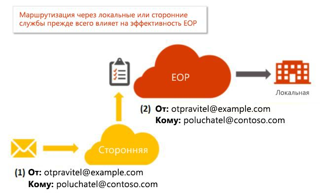

<span data-ttu-id="fc6c6-338">Другой сервер может быть локальным почтовым сервером Exchange, устройством для фильтрации почты, например, Ironport, или другое устройство, использующее облачную инфраструктуру.</span><span class="sxs-lookup"><span data-stu-id="fc6c6-338">The other server may be an Exchange on-premises mail server, a mail filtering device such as Ironport, or another cloud hosted service.</span></span>

<span data-ttu-id="fc6c6-339">Если запись MX домена получателя не указывает на Office 365, тогда нет необходимости в отключении защиты от спуфинга, так как Office 365 ищет запись MX принимающего домена и подавляет защиту от спуфинга, если она указывает на другую службу.</span><span class="sxs-lookup"><span data-stu-id="fc6c6-339">If the MX record of the recipient domain does not point to Office 365, then there is no need to disable anti-spoofing because Office 365 looks up your receiving domain's MX record and suppresses anti-spoofing if it points to another service.</span></span> <span data-ttu-id="fc6c6-340">Если вы не знаете, есть ли перед вашим доменом сервер, вы можете использовать такие веб-сайты, как, например, MX Toolbox для поиска записи MX.</span><span class="sxs-lookup"><span data-stu-id="fc6c6-340">If you don't know if your domain has another server in front, you can use a website like MX Toolbox to look up the MX record.</span></span> <span data-ttu-id="fc6c6-341">Вы можете получить следующий резульатат:</span><span class="sxs-lookup"><span data-stu-id="fc6c6-341">It might say something like the following:</span></span>

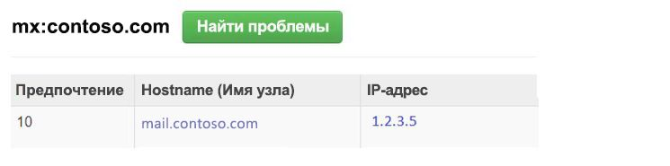

<span data-ttu-id="fc6c6-343">Этот домен содержит запись MX, которая не указывает на Office 365, поэтому Office 365 не будет применять защиту от спуфинга.</span><span class="sxs-lookup"><span data-stu-id="fc6c6-343">This domain has an MX record that does not point to Office 365, so Office 365 would not apply anti-spoofing enforcement.</span></span>

<span data-ttu-id="fc6c6-344">Тем не менее, если запись MX домена получателя *указывает* на Office 365, несмотря на то, что есть другая служба перед Office 365, следует отключить защиту от спуфинга.</span><span class="sxs-lookup"><span data-stu-id="fc6c6-344">However, if the MX record of the recipient domain  *does*  point to Office 365, even though there is another service in front of Office 365, then you should disable anti-spoofing.</span></span> <span data-ttu-id="fc6c6-345">Самый распространенный пример - это использование перезаписи получателя:</span><span class="sxs-lookup"><span data-stu-id="fc6c6-345">The most common example is through the use of a recipient rewrite:</span></span>

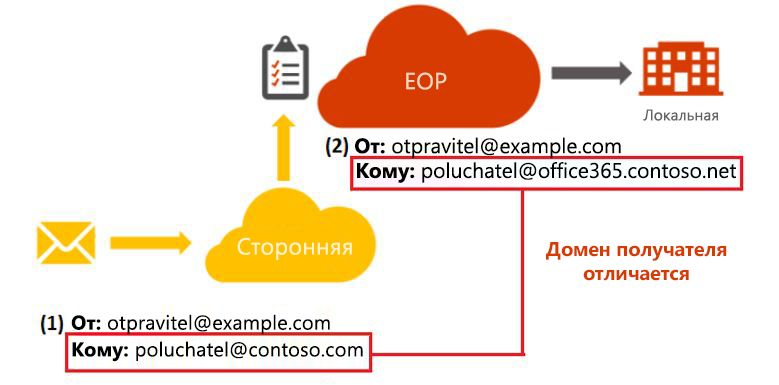

<span data-ttu-id="fc6c6-347">Запись MX домена contoso.com указывает на локальный сервер, в то время как запись MX домена @office365.contoso.net указывает на Office 365, так как она содержит \*.protection.outlook.com или \*.eo.outlook.com в записи MX:</span><span class="sxs-lookup"><span data-stu-id="fc6c6-347">The domain contoso.com's MX record points to the on-premises server, while the domain @office365.contoso.net's MX record points to Office 365 because it contains \*.protection.outlook.com, or \*.eo.outlook.com in the MX record:</span></span>

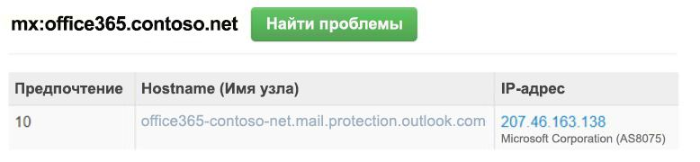

<span data-ttu-id="fc6c6-349">Убедитесь в том, что существует разница, когда запись MX для домена получателя не указывают на Office 365, и когда она претерпевает перезапись получателя.</span><span class="sxs-lookup"><span data-stu-id="fc6c6-349">Be sure to differentiate when a recipient domain's MX record does not point to Office 365, and when it has undergone a recipient rewrite.</span></span> <span data-ttu-id="fc6c6-350">Очень важно уяснить разницу между следующими двумя случаями.</span><span class="sxs-lookup"><span data-stu-id="fc6c6-350">It is important to tell the difference between these two cases.</span></span>

<span data-ttu-id="fc6c6-351">Если вы не уверены, подвергается ли ваш принимающий домен перезаписи получателя или нет, иногда вы можете определить это с помощью заголовков сообщений.</span><span class="sxs-lookup"><span data-stu-id="fc6c6-351">If you are unsure whether or not your receiving domain has undergone a recipient-rewrite, sometimes you can tell by looking at the message headers.</span></span>

<span data-ttu-id="fc6c6-352">а) Во-первых, просмотрите на заголовок сообщения для домена получателя в заголовке результатов проверки подлинности:</span><span class="sxs-lookup"><span data-stu-id="fc6c6-352">a) First, look at the headers in the message for the recipient domain in the Authentication-Results header:</span></span>

```text
Authentication-Results: spf=fail (sender IP is 1.2.3.4)
  smtp.mailfrom=fabrikam.com; office365.contoso.net; dkim=fail
  (body hash did not verify) header.d=simple.fabrikam.com;
  office365.contoso.net; dmarc=none action=none
  header.from=fabrikam.com; compauth=fail reason=001
```

<span data-ttu-id="fc6c6-353">Домен получателя выделен полужирным шрифтом красного цвета выше, в этом случае это office365.contoso.net.</span><span class="sxs-lookup"><span data-stu-id="fc6c6-353">The recipient domain is found in the bold red text above, in this case office365.contoso.net.</span></span> <span data-ttu-id="fc6c6-354">Он может отличаться от получателя в строке Кому: заголовок:</span><span class="sxs-lookup"><span data-stu-id="fc6c6-354">This may be different that the recipient in the To: header:</span></span>

<span data-ttu-id="fc6c6-355">Кому: Пример получателя \<recipient @ contoso.com\></span><span class="sxs-lookup"><span data-stu-id="fc6c6-355">To: Example Recipient \<recipient @ contoso.com\></span></span>

<span data-ttu-id="fc6c6-356">Выполните подстановку записи MX фактического домена получателя.</span><span class="sxs-lookup"><span data-stu-id="fc6c6-356">Perform an MX-record lookup of the actual recipient domain.</span></span> <span data-ttu-id="fc6c6-357">Если она содержит \*.protection.outlook.com, mail.messaging.microsoft.com, \*.eo.outlook.com или mail.global.frontbridge.com, это означает, что MX указывает на Office 365.</span><span class="sxs-lookup"><span data-stu-id="fc6c6-357">If it contains \*.protection.outlook.com, mail.messaging.microsoft.com, \*.eo.outlook.com, or mail.global.frontbridge.com, that means that the MX points to Office 365.</span></span>

<span data-ttu-id="fc6c6-358">Если она не содержит эти значения, это означает, что MX не указывают на Office 365.</span><span class="sxs-lookup"><span data-stu-id="fc6c6-358">If it does not contain those values, then it means that the MX does not point to Office 365.</span></span> <span data-ttu-id="fc6c6-359">Одним из инструментов, которые можно использовать для проверки — это MX Toolbox.</span><span class="sxs-lookup"><span data-stu-id="fc6c6-359">One tool you can use to verify this is MX Toolbox.</span></span>

<span data-ttu-id="fc6c6-360">В этом конкретном примере ниже указано, что contoso.com, домен, который выглядит как получатель, так как это была строка Кому: заголовок, имеет запись MX, которая указывает на локальный сервер:</span><span class="sxs-lookup"><span data-stu-id="fc6c6-360">For this particular example, the following says that contoso.com, the domain that looks like the recipient since it was the To: header, has MX record points to an on-prem server:</span></span>

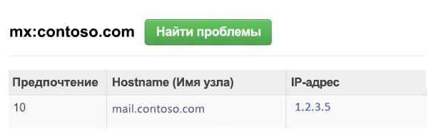

<span data-ttu-id="fc6c6-362">Тем не менее, фактический получатель – это office365.contoso.net, чья запись MX указывает на Office 365:</span><span class="sxs-lookup"><span data-stu-id="fc6c6-362">However, the actual recipient is office365.contoso.net whose MX record does point to Office 365:</span></span>

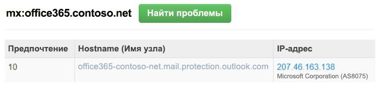

<span data-ttu-id="fc6c6-364">Таким образом, это сообщение, скорее всего, подвергалось перезаписи получателя.</span><span class="sxs-lookup"><span data-stu-id="fc6c6-364">Therefore, this message has likely undergone a recipient-rewrite.</span></span>

<span data-ttu-id="fc6c6-365">б) Во-вторых, убедитесь в наличии различий между распространенными сценариями использования перезаписи получателей.</span><span class="sxs-lookup"><span data-stu-id="fc6c6-365">b) Second, be sure to distinguish between common use cases of recipient rewrites.</span></span> <span data-ttu-id="fc6c6-366">Если вы собираетесь переписать домен получателя на \*. onmicrosoft.com, вместо этого выполните перезапись на \*. mail.onmicrosoft.com.</span><span class="sxs-lookup"><span data-stu-id="fc6c6-366">If you are going to rewrite the recipient domain to \*.onmicrosoft.com, instead rewrite it to \*.mail.onmicrosoft.com.</span></span>

<span data-ttu-id="fc6c6-367">После того как вы определили окончательный домен получателя, который перенаправляется после другого сервера, а запись MX для домена получателя фактически указывает на Office 365 (как опубликовано в ее записях DNS), вы можете переходить к отключению защиты от спуфинга.</span><span class="sxs-lookup"><span data-stu-id="fc6c6-367">Once you have identified the final recipient domain that is routed behind another server and the recipient domain's MX record actually points to Office 365 (as published in its DNS records), you may proceed to disable anti-spoofing.</span></span>

<span data-ttu-id="fc6c6-368">Помните, что вы не должны отключать защиту от спуфинга, если первым местом на пути маршрутизации домена является Office 365, только в том случае, если он находится после одной или нескольких служб.</span><span class="sxs-lookup"><span data-stu-id="fc6c6-368">Remember, you don't want to disable anti-spoofing if the domain's first hop in the routing path is Office 365, only when it's behind one or more services.</span></span>

### <a name="how-to-disable-anti-spoofing"></a><span data-ttu-id="fc6c6-369">Как отключить защиту от спуфинга</span><span class="sxs-lookup"><span data-stu-id="fc6c6-369">How to disable anti-spoofing</span></span>

<span data-ttu-id="fc6c6-370">Если вы уже создали политику защиты от фишинга, задайте для параметра *EnableAntispoofEnforcement* значение $false:</span><span class="sxs-lookup"><span data-stu-id="fc6c6-370">If you already have an Anti-phishing policy created, set the *EnableAntispoofEnforcement* parameter to $false:</span></span>

```powershell
$name = "<name of policy>"
Set-AntiphishPolicy -Identity $name -EnableAntiSpoofEnforcement $false
```

<span data-ttu-id="fc6c6-371">Если вы не знаете имя политики (или политик), которую(-е) необходимо отключить, можно отобразить их:</span><span class="sxs-lookup"><span data-stu-id="fc6c6-371">If you don't know the name of the policy (or policies) to disable, you can display them:</span></span>

```powershell
Get-AntiphishPolicy | Format-List Name
```

<span data-ttu-id="fc6c6-372">Если у вас нет существующих политик защиты от фишинга, можно создать ее и затем отключить (даже если у вас нет политики, защита от спуфинга все равно выполняется, далее в 2018 г будет создаваться политика по умолчанию, которую затем можно отключить, а не создавать самостоятельно) .</span><span class="sxs-lookup"><span data-stu-id="fc6c6-372">If you don't have any existing anti-phishing policies, you can create one and then disable it (even if you don't have a policy, anti-spoofing is still applied; later on in 2018, a default policy will be created for you and you can then disable that instead of creating one).</span></span> <span data-ttu-id="fc6c6-373">Вы сможете сделать это в разными способами:</span><span class="sxs-lookup"><span data-stu-id="fc6c6-373">You will have to do this in multiple steps:</span></span>

```powershell
$org = Get-OrganizationConfig
$name = "My first anti-phishing policy for " + $org.Name
# Note: If the name is more than 64 characters, you will need to choose a smaller one
```

```powershell
# Next, create a new anti-phishing policy with the default values
New-AntiphishPolicy -Name $Name
# Select the domains to scope it to
# Multiple domains are specified in a comma-separated list
$domains = "domain1.com, domain2.com, domain3.com"
# Next, create the anti-phishing rule, scope it to the anti-phishing rule
New-AntiphishRule -Name $name -AntiphishPolicy -RecipientDomainIs $domains
# Finally, scope the anti-phishing policy to the domains
Set-AntiphishPolicy -Identity $name -EnableAntispoofEnforcement $false
```

<span data-ttu-id="fc6c6-374">Отключение защиты от спуфинга осуществляется только через командлет (позднее она станет доступна в Центре безопасности и соответствия требованиям).</span><span class="sxs-lookup"><span data-stu-id="fc6c6-374">Disabling anti-spoofing is only available via cmdlet (later it will be available in the Security & Compliance Center).</span></span> <span data-ttu-id="fc6c6-375">Если у вас нет доступа к PowerShell, создайте запрос в службу поддержки.</span><span class="sxs-lookup"><span data-stu-id="fc6c6-375">If you do not have access to PowerShell, create a support ticket.</span></span>

<span data-ttu-id="fc6c6-376">Помните, что это следует применять только для доменов, которые подвергаются непрямой маршрутизации при отправке в Office 365.</span><span class="sxs-lookup"><span data-stu-id="fc6c6-376">Remember, this should only be applied to domains that undergo indirect routing when sent to Office 365.</span></span> <span data-ttu-id="fc6c6-377">Откажитесь от искушения отключить защиту от спуфинга из-за нескольких ложных срабатываний, в долгосрочном плане лучше обработать эти срабатывания.</span><span class="sxs-lookup"><span data-stu-id="fc6c6-377">Resist the temptation to disable anti-spoofing because of some false positives, it will be better in the long run to work through them.</span></span>

### <a name="information-for-individual-users"></a><span data-ttu-id="fc6c6-378">Сведения для отдельных пользователей</span><span class="sxs-lookup"><span data-stu-id="fc6c6-378">Information for individual users</span></span>

<span data-ttu-id="fc6c6-379">Отдельные пользователи ограничены в том, как они могут взаимодействовать с советами по безопасности для защита от спуфинга.</span><span class="sxs-lookup"><span data-stu-id="fc6c6-379">Individual users are limited in how they can interact with the anti-spoofing safety tip.</span></span> <span data-ttu-id="fc6c6-380">Тем не менее, существует несколько действий, которые можно выполнить, чтобы использовать распространенные сценарии.</span><span class="sxs-lookup"><span data-stu-id="fc6c6-380">However, there are several things you can do to resolve common scenarios.</span></span>

### <a name="common-scenario-discussion-lists"></a><span data-ttu-id="fc6c6-381">Стандартный сценарий: списки обсуждений</span><span class="sxs-lookup"><span data-stu-id="fc6c6-381">Common scenario: Discussion lists</span></span>

<span data-ttu-id="fc6c6-382">Как известно, списки обсуждений имеют проблемы с защитой от спуфинга из-за способа пересылки сообщения и изменения содержимого, сохраняя исходную строку От: адрес.</span><span class="sxs-lookup"><span data-stu-id="fc6c6-382">Discussion lists are known to have problems with anti-spoofing due to the way they forward the message and modify its contents yet retain the original From: address.</span></span>

<span data-ttu-id="fc6c6-383">Предположим, например, что Марта Артемьева (martemyeva @ contoso.com) интересуется наблюдением за птицами и поэтому присоединяется к списку обсуждений birdwatchers @ fabrikam.com.</span><span class="sxs-lookup"><span data-stu-id="fc6c6-383">For example, suppose Gabriela Laureano (glaureano @ contoso.com) is interested in bird watching and joins the discussion list birdwatchers @ fabrikam.com.</span></span> <span data-ttu-id="fc6c6-384">Когда она отправляет сообщение в список обсуждения, оно выглядит следующим образом:</span><span class="sxs-lookup"><span data-stu-id="fc6c6-384">When she send a message to the discussion list, it looks like this:</span></span>

> <span data-ttu-id="fc6c6-385">**От:** Марта Артемьева \<martemyeva @ contoso.com\></span><span class="sxs-lookup"><span data-stu-id="fc6c6-385">**From:** Gabriela Laureano \<glaureano @ contoso.com\></span></span> <br/> <span data-ttu-id="fc6c6-386">**Кому:** список обсуждений наблюдателей за птицами \<birdwatchers @ fabrikam.com\></span><span class="sxs-lookup"><span data-stu-id="fc6c6-386">**To:** Birdwatcher's Discussion List \<birdwatchers @ fabrikam.com\></span></span> <br/><span data-ttu-id="fc6c6-387"> \
\**Тема:\** Прекрасный вид голубой сойки на вершине горы</span><span class="sxs-lookup"><span data-stu-id="fc6c6-387"> \
\**Subject:\** Great viewing of blue jays at the top of Mt.</span></span> <span data-ttu-id="fc6c6-388">Рейнир на этой неделе</span><span class="sxs-lookup"><span data-stu-id="fc6c6-388">Rainier this week</span></span> <br/><br/><span data-ttu-id="fc6c6-389">Кто-нибудь хочет посмотреть птицу на этой неделе на горе</span><span class="sxs-lookup"><span data-stu-id="fc6c6-389">Anyone want to check out the viewing this week from Mt.</span></span> <span data-ttu-id="fc6c6-390">Рейнир?</span><span class="sxs-lookup"><span data-stu-id="fc6c6-390">Rainier?</span></span>

<span data-ttu-id="fc6c6-391">Когда участники в списке рассылки получают сообщение, они форматируют сообщение, меняют его содержимое и воспроизводят его для остальных участников списка обсуждения, состоящего из разных получателей электронной почты.</span><span class="sxs-lookup"><span data-stu-id="fc6c6-391">When the email list receives the message, they format the message, modify its contents, and replay it to the rest of the members on the discussion list which, is made up of participants from many different email receivers.</span></span>

> <span data-ttu-id="fc6c6-392">**От:** Марта Артемьева \<martemyeva @ contoso.com\></span><span class="sxs-lookup"><span data-stu-id="fc6c6-392">**From:** Gabriela Laureano \<glaureano @ contoso.com\></span></span> <br/> <span data-ttu-id="fc6c6-393">**Кому:** список обсуждений наблюдателей за птицами \<birdwatchers @ fabrikam.com\></span><span class="sxs-lookup"><span data-stu-id="fc6c6-393">**To:** Birdwatcher's Discussion List \<birdwatchers @ fabrikam.com\></span></span> <br/> <span data-ttu-id="fc6c6-394">**Тема:** [BIRDWATCHERS] Прекрасный вид голубой сойки на вершине горы</span><span class="sxs-lookup"><span data-stu-id="fc6c6-394">**Subject:** [BIRDWATCHERS] Great viewing of blue jays at the top of Mt.</span></span> <span data-ttu-id="fc6c6-395">Рейнир на этой неделе</span><span class="sxs-lookup"><span data-stu-id="fc6c6-395">Rainier this week</span></span> <br/><br/> <span data-ttu-id="fc6c6-396">Кто-нибудь хочет посмотреть птицу на этой неделе на горе</span><span class="sxs-lookup"><span data-stu-id="fc6c6-396">Anyone want to check out the viewing this week from Mt.</span></span> <span data-ttu-id="fc6c6-397">Рейнир?</span><span class="sxs-lookup"><span data-stu-id="fc6c6-397">Rainier?</span></span> <br/><br/> <span data-ttu-id="fc6c6-398">Это сообщение было отправлено в список обсуждения для любителей птиц Birdwatchers.</span><span class="sxs-lookup"><span data-stu-id="fc6c6-398">This message was sent to the Birdwatchers Discussion List.</span></span> <span data-ttu-id="fc6c6-399">Вы можете отменить подписку в любое время.</span><span class="sxs-lookup"><span data-stu-id="fc6c6-399">You can unsubscribe at any time.</span></span>

<span data-ttu-id="fc6c6-400">В этом примере воспроизведенные сообщения имеют ту же строку От: адрес (martemyeva @ contoso.com), но исходное сообщение было изменено путем добавления тега в строку темы и нижнего колонтитула в нижней части сообщения.</span><span class="sxs-lookup"><span data-stu-id="fc6c6-400">In this example, the replayed message has the same From: address (glaureano @ contoso.com) but the original message has been modified by adding a tag to the Subject line, and a footer to the bottom of the message.</span></span> <span data-ttu-id="fc6c6-401">Этот тип изменения сообщения часто используется в списках рассылки и может привести к ложным срабатываниям.</span><span class="sxs-lookup"><span data-stu-id="fc6c6-401">This type of message modification is common in mailing lists, and may result in false positives.</span></span>

<span data-ttu-id="fc6c6-402">Если вы или кто-то в вашей организации имеет права администратора списка рассылки, вы можете настроить его таким образом, чтобы передать проверки защиты от спуфинга.</span><span class="sxs-lookup"><span data-stu-id="fc6c6-402">If you or someone in your organization is an administrator of the mailing list, you may be able to configure it to pass anti-spoofing checks.</span></span>

- <span data-ttu-id="fc6c6-403">Вопросы и ответы на DMARC.org: [Я работаю со списком рассылки и мне нужно реализовать взаимодействовие с DMARC, что мне делать?](https://dmarc.org/wiki/FAQ#I_operate_a_mailing_list_and_I_want_to_interoperate_with_DMARC.2C_what_should_I_do.3F)</span><span class="sxs-lookup"><span data-stu-id="fc6c6-403">Check the FAQ at DMARC.org: [I operate a mailing list and I want to interoperate with DMARC, what should I do?](https://dmarc.org/wiki/FAQ#I_operate_a_mailing_list_and_I_want_to_interoperate_with_DMARC.2C_what_should_I_do.3F)</span></span>

- <span data-ttu-id="fc6c6-404">Ознакомьтесь с инструкцией в этой записи блога: [Совет для операторов почтовых рассылок для взаимодействовия с DMARC, позволяющий избежать появления ошибок](https://blogs.msdn.microsoft.com/tzink/2017/03/22/a-tip-for-mailing-list-operators-to-interoperate-with-dmarc-to-avoid-failures/)</span><span class="sxs-lookup"><span data-stu-id="fc6c6-404">Read the instructions at this blog post: [A tip for mailing list operators to interoperate with DMARC to avoid failures](https://blogs.msdn.microsoft.com/tzink/2017/03/22/a-tip-for-mailing-list-operators-to-interoperate-with-dmarc-to-avoid-failures/)</span></span>

- <span data-ttu-id="fc6c6-405">Попробуйте установить обновления на сервере списка рассылки для поддержки ARC: [https://arc-spec.org](https://arc-spec.org/)</span><span class="sxs-lookup"><span data-stu-id="fc6c6-405">Consider installing updates on your mailing list server to support ARC, see [https://arc-spec.org](https://arc-spec.org/)</span></span>

<span data-ttu-id="fc6c6-406">Если вы не являетесь владельцем списка рассылки:</span><span class="sxs-lookup"><span data-stu-id="fc6c6-406">If you don't own the mailing list:</span></span>

- <span data-ttu-id="fc6c6-407">Вы можете запросить обслуживающего список рассылки реализовать один из предыдущих вариантов (они должны поддерживать настройку проверки подлинности электронной почты для домена, используемого для пересылки списком рассылки).</span><span class="sxs-lookup"><span data-stu-id="fc6c6-407">You can request the maintainer of the mailing list to implement one of the previous options (they should also have email authentication set up for the domain the mailing list is relaying from).</span></span>

- <span data-ttu-id="fc6c6-408">Вы можете создать правила для почтовых ящиков в вашем почтовом клиенте для перемещения сообщений в папке "Входящие".</span><span class="sxs-lookup"><span data-stu-id="fc6c6-408">You can create mailbox rules in your email client to move messages to the Inbox.</span></span> <span data-ttu-id="fc6c6-409">Вы также можете попросить администраторов вашей организации настроить правила разрешения или переопределения, как описано в разделе [Управление добросовестными отправителями, которые отправляют неавторизованную электронную почту](#managing-legitimate-senders-who-are-sending-unauthenticated-email) этой статьи.</span><span class="sxs-lookup"><span data-stu-id="fc6c6-409">You can also request your organization's administrators to set up allow rules, or overrides as discussed in the [Managing legitimate senders who are sending unauthenticated email](#managing-legitimate-senders-who-are-sending-unauthenticated-email)section in this topic.</span></span>

- <span data-ttu-id="fc6c6-410">Вы можете отправить запрос в службу поддержки с помощью Office 365 для создания переопределения для списка рассылки, который нужно рассматривать как надежный.</span><span class="sxs-lookup"><span data-stu-id="fc6c6-410">You can create a support ticket with Office 365 to create an override for the mailing list to treat it as legitimate.</span></span>

### <a name="other-scenarios"></a><span data-ttu-id="fc6c6-411">Прочие сценарии</span><span class="sxs-lookup"><span data-stu-id="fc6c6-411">Other scenarios</span></span>

1. <span data-ttu-id="fc6c6-412">Если ни один из описанных выше стандартных сценариев не относится к вашей ситуации, сообщите в корпорацию Майкрософт о ложном срабатывании сообщения.</span><span class="sxs-lookup"><span data-stu-id="fc6c6-412">If neither of the above common scenarios applies to your situation, report the message as a false positive back to Microsoft.</span></span> <span data-ttu-id="fc6c6-413">Дополнительные сведения см. в разделе [Как сообщить о спаме или отсутствии спама в сообщений в корпорацию Майкрософт?](#how-can-i-report-spam-or-non-spam-messages-back-to-microsoft) далее в этой статье.</span><span class="sxs-lookup"><span data-stu-id="fc6c6-413">For more information, see the section [How can I report spam or non-spam messages back to Microsoft?](#how-can-i-report-spam-or-non-spam-messages-back-to-microsoft) later in this article.</span></span>

2. <span data-ttu-id="fc6c6-414">Вы также можете обратиться к администратору электронной почты, который можно задать этот вопрос службе поддержки корпорации Майкрософт.</span><span class="sxs-lookup"><span data-stu-id="fc6c6-414">You may also contact your email administrator who can raise it as a support ticket with Microsoft.</span></span> <span data-ttu-id="fc6c6-415">Команда разработчиков Microsoft должна выяснить, почему сообщение было помечено как поддельное.</span><span class="sxs-lookup"><span data-stu-id="fc6c6-415">The Microsoft engineering team will investigate why the message was marked as a spoof.</span></span>

3. <span data-ttu-id="fc6c6-416">Кроме того, если вы знаете, кто отправитель, и уверены в том, что он не занимается намеренной подделкой электронных сообщений, вы можете сообщить отправителю, что он отправляет сообщения с почтового сервера, который не проходит проверку подлинности.</span><span class="sxs-lookup"><span data-stu-id="fc6c6-416">Additionally, if you know who the sender is and are confident they are not being maliciously spoofed, you may reply back to the sender indicating that they are sending messages from a mail server that does not authenticate.</span></span> <span data-ttu-id="fc6c6-417">Иногда это приводит к тому, что отправителю сообщения обращается к своему ИТ-администратору, который настроит необходимые записи для проверки подлинности электронной почты.</span><span class="sxs-lookup"><span data-stu-id="fc6c6-417">This sometimes results in the original sender contacting their IT administrator who will set up the required email authentication records.</span></span>

   <span data-ttu-id="fc6c6-418">Когда достаточное число отправителей сообщат владельцам доменов о том, что им следует настроить записи для проверки подлинности электронной почты, это заставит их действовать.</span><span class="sxs-lookup"><span data-stu-id="fc6c6-418">When enough senders reply back to domain owners that they should set up email authentication records, it spurs them into taking action.</span></span> <span data-ttu-id="fc6c6-419">Хотя корпорация Майкрософт также работает с владельцами доменов в отношении необходимости публикации требуемых записей, лучше всего работает то, когда отдельные пользователи просят делать это.</span><span class="sxs-lookup"><span data-stu-id="fc6c6-419">While Microsoft also works with domain owners to publish the required records, it helps even more when individual users request it.</span></span>

4. <span data-ttu-id="fc6c6-420">При необходимости добавьте отправителя в список надежных отправителей.</span><span class="sxs-lookup"><span data-stu-id="fc6c6-420">Optionally, add the sender to your Safe Senders list.</span></span> <span data-ttu-id="fc6c6-421">Однако следует помнить, что если фишер подделает данную учетную запись, письмо этого отправителя будет доставлено в ваш почтовый ящик.</span><span class="sxs-lookup"><span data-stu-id="fc6c6-421">However, be aware that if a phisher spoofs that account, it will be delivered to your mailbox.</span></span> <span data-ttu-id="fc6c6-422">Таким образом, этот параметр следует использовать с осторожностью.</span><span class="sxs-lookup"><span data-stu-id="fc6c6-422">Therefore, this option should be used sparingly.</span></span>

## <a name="how-senders-to-microsoft-should-prepare-for-anti-spoofing-protection"></a><span data-ttu-id="fc6c6-423">Как отправители в Майкрософт должны подготовиться к внедрению защиты от спуфинга</span><span class="sxs-lookup"><span data-stu-id="fc6c6-423">How senders to Microsoft should prepare for anti-spoofing protection</span></span>

<span data-ttu-id="fc6c6-424">Если вы являетесь администратором, который в настоящее время отправляет сообщения в корпорацию Майкрософт, Office 365 или Outlook.com, вам следует убедиться, что ваши сообщения надлежащим образом проходят проверку подлинности, в противном случае, они могут помечаться как нежелательные или фишинговые сообщения.</span><span class="sxs-lookup"><span data-stu-id="fc6c6-424">If you are an administrator who currently sends messages to Microsoft, either Office 365 or Outlook.com, you should ensure that your email is properly authenticated otherwise it may be marked as spam or phish.</span></span>

### <a name="customers-of-office-365"></a><span data-ttu-id="fc6c6-425">Клиенты Office 365</span><span class="sxs-lookup"><span data-stu-id="fc6c6-425">Customers of Office 365</span></span>

<span data-ttu-id="fc6c6-426">Если вы являетесь клиентом Office 365 и вы используете Office 365 для отправки исходящей электронной почты:</span><span class="sxs-lookup"><span data-stu-id="fc6c6-426">If you are an Office 365 customer and you use Office 365 to send outbound email:</span></span>

- <span data-ttu-id="fc6c6-427">Для своих доменов выполните [Настройку инфраструктуры политики отправителей в Office 365 для предотвращения спуфинга](set-up-spf-in-office-365-to-help-prevent-spoofing.md)</span><span class="sxs-lookup"><span data-stu-id="fc6c6-427">For your domains, [Set up SPF in Office 365 to help prevent spoofing](set-up-spf-in-office-365-to-help-prevent-spoofing.md)</span></span>

- <span data-ttu-id="fc6c6-428">Для своих основных доменов выполните [Проверку исходящей электронной почты, отправляемой со своего домена в Office 365, с помощью DKIM](use-dkim-to-validate-outbound-email.md)</span><span class="sxs-lookup"><span data-stu-id="fc6c6-428">For your primary domains, [Use DKIM to validate outbound email sent from your custom domain in Office 365](use-dkim-to-validate-outbound-email.md)</span></span>

- <span data-ttu-id="fc6c6-429">[Рекомендуем настроить записи DMARC ](use-dmarc-to-validate-email.md) для вашего домена, чтобы определить список добросовестных отправителей</span><span class="sxs-lookup"><span data-stu-id="fc6c6-429">[Consider setting up DMARC records](use-dmarc-to-validate-email.md) for your domain to determine who are your legitimate senders</span></span>

<span data-ttu-id="fc6c6-430">Майкрософт не предоставляет подробные рекомендации по реализации для SPF, DKIM и DMARC.</span><span class="sxs-lookup"><span data-stu-id="fc6c6-430">Microsoft does not provide detailed implementation guidelines for each of SPF, DKIM, and DMARC.</span></span> <span data-ttu-id="fc6c6-431">Однако существует большой объем сведений, опубликованный в сети Интернет.</span><span class="sxs-lookup"><span data-stu-id="fc6c6-431">However, there is a lot of information published online.</span></span> <span data-ttu-id="fc6c6-432">Существуют также сторонние компании, которые могут помочь вашей организации настроить записи для проверки подлинности электронной почты.</span><span class="sxs-lookup"><span data-stu-id="fc6c6-432">There are also 3rd party companies dedicated to helping your organization set up email authentication records.</span></span>

### <a name="administrators-of-domains-that-are-not-office-365-customers"></a><span data-ttu-id="fc6c6-433">Администраторы доменов, которые не являются пользователями Office 365</span><span class="sxs-lookup"><span data-stu-id="fc6c6-433">Administrators of domains that are not Office 365 customers</span></span>

<span data-ttu-id="fc6c6-434">Если вы являетесь администратором домена, но не являетесь клиентом Office 365:</span><span class="sxs-lookup"><span data-stu-id="fc6c6-434">If you are a domain administrator but are not an Office 365 customer:</span></span>

- <span data-ttu-id="fc6c6-435">Вы должны настроить SPF для публикации IP-адреса отправителя для вашего домена, а также настроить DKIM (при наличии) для выполнения цифровой подписи к сообщениям.</span><span class="sxs-lookup"><span data-stu-id="fc6c6-435">You should set up SPF to publish your domain's sending IP addresses, and also set up DKIM (if available) to digitally sign messages.</span></span> <span data-ttu-id="fc6c6-436">Вы также можете рассмотреть возможность настройки записей DMARC.</span><span class="sxs-lookup"><span data-stu-id="fc6c6-436">You may also consider setting up DMARC records.</span></span>

- <span data-ttu-id="fc6c6-437">Если у вас есть массовые отправители, которые передают электронную почты от вашего имени, вы должны работать с ними для отправки электронной почты таким образом, чтобы домен отправителя в строке От: адрес (если он принадлежит вам) соответствовал домену, который обрабатывается SPF и DMARC.</span><span class="sxs-lookup"><span data-stu-id="fc6c6-437">If you have bulk senders who are transmitting email on your behalf, you should work with them to send email in a way such that the sending domain in the From: address (if it belongs to you) aligns with the domain that passes SPF or DMARC.</span></span>

- <span data-ttu-id="fc6c6-438">Если у вас есть локальные почтовые сервера, или вы выполняете отправку через поставщика программного обеспечения как услуги, или через облачную службу, такую как Microsoft Azure, GoDaddy, Rackspace, веб-службы Amazon и т.д., следует убедиться, что они добавлены в вашу запись SPF.</span><span class="sxs-lookup"><span data-stu-id="fc6c6-438">If you have on-premises mail servers, or send from a Software-as-a-service provider, or from a cloud-hosting service like Microsoft Azure, GoDaddy, Rackspace, Amazon Web Services, or similar, you should ensure that they are added to your SPF record.</span></span>

- <span data-ttu-id="fc6c6-439">Если у вас малый домен, который использует хостинг поставщика услуг Интернета, необходимо настроить запись SPF следуя инструкциям, предоставленным для вас поставщиком услуг Интернета.</span><span class="sxs-lookup"><span data-stu-id="fc6c6-439">If you are a small domain that is hosted by an ISP, you should set up your SPF record according to the instructions that is provided to you by your ISP.</span></span> <span data-ttu-id="fc6c6-440">Большинство поставщиков услуг Интернета предоставляют такого рода инструкции, которые можно найти на страницах поддержки нашей компании.</span><span class="sxs-lookup"><span data-stu-id="fc6c6-440">Most ISPs provide these types of instructions and can be found on the company's support pages.</span></span>

- <span data-ttu-id="fc6c6-441">Даже в том случае, если у вас ранее не было потребности в публикации записи для проверки подлинности электронной почты, и проблем не возникало, вы все равно должны опубликовать записи для проверки подлинности электронной почты для отправки в корпорацию Майкрософт.</span><span class="sxs-lookup"><span data-stu-id="fc6c6-441">Even if you have not had to publish email authentication records before, and it worked fine, you must still publish email authentication records to send to Microsoft.</span></span> <span data-ttu-id="fc6c6-442">Сделав это, вы поможете нам в борьбе с фишингом и уменьшите вероятность того, что вы, либо кто-то в организациях, которым вы отправляете письма, станет жертвой фишинга.</span><span class="sxs-lookup"><span data-stu-id="fc6c6-442">By doing so, you are helping in the fight against phishing, and reducing the possibility that either you, or organizations you send to, will get phished.</span></span>

### <a name="what-if-you-dont-know-who-sends-email-as-your-domain"></a><span data-ttu-id="fc6c6-443">Что делать, если вы не знаете, кто отправляет электронную почты с вашего домена?</span><span class="sxs-lookup"><span data-stu-id="fc6c6-443">What if you don't know who sends email as your domain?</span></span>

<span data-ttu-id="fc6c6-444">Многие домены не публикуют записи SPF, так как они не знает, кто их отправители.</span><span class="sxs-lookup"><span data-stu-id="fc6c6-444">Many domains do not publish SPF records because they do not know who all their senders are.</span></span> <span data-ttu-id="fc6c6-445">Это не проблема, вы не должны знать, кто все эти люди.</span><span class="sxs-lookup"><span data-stu-id="fc6c6-445">That's okay, you do not need to know who all of them are.</span></span> <span data-ttu-id="fc6c6-446">Вместо этого вы должны приступить к работе с публикации записи SPF для тех из них, кого вы знаете, особенно если ваш корпоративный трафик локальный, и опубликовать нейтральную политику SPF, `?all`:</span><span class="sxs-lookup"><span data-stu-id="fc6c6-446">Instead, you should get started by publishing an SPF record for the ones you do know of, especially where your corporate traffic is located, and publish a neutral SPF policy, `?all`:</span></span>

```text
fabrikam.com IN TXT "v=spf1 include:spf.fabrikam.com ?all"
```

<span data-ttu-id="fc6c6-447">Нейтральная политика SPF подразумевает, что любые почтовые сообщения, которая поступают из вашей корпоративной инфраструктуры, будут проходить проверку подлинности электронной почты у любых прочих получателей электронной почты.</span><span class="sxs-lookup"><span data-stu-id="fc6c6-447">The neutral SPF policy means that any email that comes out of your corporate infrastructure will pass email authentication at all other email receivers.</span></span> <span data-ttu-id="fc6c6-448">Электронная почта, которая поступает от отправителей, которых вы не знаете, будет подпадать под нейтральную политику, что равно отсутствию публикации записи SPF.</span><span class="sxs-lookup"><span data-stu-id="fc6c6-448">Email that comes from senders you don't know about will fall back to neutral, which is almost the same as publishing no SPF record at all.</span></span>

<span data-ttu-id="fc6c6-449">При отправке в Office 365, электронная почта, полученная из корпоративного трафика, будет помечаться как прошедшая проверку подлинности, но электронная почта, полученные из источников, которые вы не знаете, по-прежнему будет помечаться как поддельная (зависит от того, сможет ли Office 365 выполнить неявную проверку подлинности, или нет).</span><span class="sxs-lookup"><span data-stu-id="fc6c6-449">When sending to Office 365, email that comes from your corporate traffic will be marked as authenticated, but the email that comes from sources you don't know about may still be marked as spoof (depending upon whether or not Office 365 can implicitly authenticate it).</span></span> <span data-ttu-id="fc6c6-450">Но это все равно является шагом вперед по сравнению с ситуацией, когда все электронные письма помечались как поддельные в Office 365.</span><span class="sxs-lookup"><span data-stu-id="fc6c6-450">However, this is still an improvement from all email being marked as spoof by Office 365.</span></span>

<span data-ttu-id="fc6c6-451">После того как вы начали работу с записи SPF с резервный политику ?all,  вы можете постепенно добавлять новую и новую инфраструктуру отправки, а затем публиковать более строгие политики.</span><span class="sxs-lookup"><span data-stu-id="fc6c6-451">Once you've gotten started with an SPF record with a fallback policy of ?all, you can gradually include more and more sending infrastructure and then publish a stricter policy.</span></span>

### <a name="what-if-you-are-the-owner-of-a-mailing-list"></a><span data-ttu-id="fc6c6-452">Что делать, если вы являетесь владельцем списка рассылки?</span><span class="sxs-lookup"><span data-stu-id="fc6c6-452">What if you are the owner of a mailing list?</span></span>

<span data-ttu-id="fc6c6-453">См. раздел [Стандартный сценарий: списки обсуждений](#common-scenario-discussion-lists) выше в этой статье.</span><span class="sxs-lookup"><span data-stu-id="fc6c6-453">See the [Common scenario: Discussion lists](#common-scenario-discussion-lists) section earlier in this topic.</span></span>

### <a name="what-if-you-are-an-infrastructure-provider-such-as-an-internet-service-provider-isp-email-service-provider-esp-or-cloud-hosting-service"></a><span data-ttu-id="fc6c6-454">Что делать, если вы являетесь поставщиком услуг инфраструктуры, например, поставщиком услуг Интернета (ISP), поставщиком службы электронной почты (ESP) или облачной службой?</span><span class="sxs-lookup"><span data-stu-id="fc6c6-454">What if you are an infrastructure provider such as an Internet Service Provider (ISP), Email Service Provider (ESP), or cloud hosting service?</span></span>

<span data-ttu-id="fc6c6-455">Если вы размещаете домен электронная почты, с которого отправляется электронная почта, или предоставляете инфраструктуру для хостинга, которая позволяет отправлять почту, вы должны сделать следующее:</span><span class="sxs-lookup"><span data-stu-id="fc6c6-455">If you host a domain's email, and it sends email, or provide hosting infrastructure that can send email, you should do the following:</span></span>

- <span data-ttu-id="fc6c6-456">Убедитесь, что клиенты используют документацию с подробным описанием того, что нужно публиковать в своих записях SPF.</span><span class="sxs-lookup"><span data-stu-id="fc6c6-456">Ensure your customers have documentation detailing what to publish in their SPF records</span></span>

- <span data-ttu-id="fc6c6-457">Рассмотрите возможность использования подписей DKIM для исходящей электронной почты, даже если клиент не настроил эту опцию явным образом (подпись с доменом по умолчанию).</span><span class="sxs-lookup"><span data-stu-id="fc6c6-457">Consider signing DKIM-signatures on outbound email even if the customer doesn't explicitly set it up (sign with a default domain).</span></span> <span data-ttu-id="fc6c6-458">Вы можете даже дважды подписать электронную почту с помощью подписей DKIM (один раз с доменом клиента, если они настроили эту опцию, и еще раз с помощью подписи DKIM вашей организации)</span><span class="sxs-lookup"><span data-stu-id="fc6c6-458">You can even double-sign the email with DKIM signatures (once with the customer's domain if they have set it up, and a second time with your company's DKIM signature)</span></span>

<span data-ttu-id="fc6c6-459">Возможность доставки в корпорацию Майкрософт не гарантирована, даже если вы смогли пройти проверку подлинности почты, поступающей с вашей платформы, но, по крайней мере, это гарантирует, что корпорация Майкрософт не будет направлять ваши письма в папку с нежелательными сообщения, которые не проходят проверку подлинности.</span><span class="sxs-lookup"><span data-stu-id="fc6c6-459">Deliverability to Microsoft is not guaranteed even if you authenticate email originating from your platform, but at least it ensures that Microsoft does not junk your email because it is not authenticated.</span></span> <span data-ttu-id="fc6c6-460">Дополнительные сведения о принципе фильтрации электронной почты в Outlook.com см. в статье [Страницы Postmaster в Outlook.com](https://postmaster.live.com/pm/postmaster.aspx).</span><span class="sxs-lookup"><span data-stu-id="fc6c6-460">For more details around how Outlook.com filters email, see the [Outlook.com Postmaster page](https://postmaster.live.com/pm/postmaster.aspx).</span></span>

<span data-ttu-id="fc6c6-461">Дополнительные сведения о советах и рекомендациях поставщиков услуг см. в статье [M3AAWG Советы и рекомендации по обмену сообщениями с помощью мобильных устройств для поставщиков услуг](https://www.m3aawg.org/sites/default/files/M3AAWG-Mobile-Messaging-Best-Practices-Service-Providers-2015-08.pdf).</span><span class="sxs-lookup"><span data-stu-id="fc6c6-461">For more details on service providers best practices, see [M3AAWG Mobile Messaging Best Practices for Service Providers](https://www.m3aawg.org/sites/default/files/M3AAWG-Mobile-Messaging-Best-Practices-Service-Providers-2015-08.pdf).</span></span>

## <a name="frequently-asked-questions"></a><span data-ttu-id="fc6c6-462">Вопросы и ответы</span><span class="sxs-lookup"><span data-stu-id="fc6c6-462">Frequently Asked Questions</span></span>

### <a name="why-is-microsoft-making-this-change"></a><span data-ttu-id="fc6c6-463">Зачем потребовалось это изменение?</span><span class="sxs-lookup"><span data-stu-id="fc6c6-463">Why is Microsoft making this change?</span></span>

<span data-ttu-id="fc6c6-464">В результате последствий фишинговых атак, а также на основании того, что проверка подлинности применяется уже более 15 лет, корпорация Майкрософт считает, что риск получения неавторизованного письма серьезней риска потери обычного сообщения.</span><span class="sxs-lookup"><span data-stu-id="fc6c6-464">Because of the impact of phishing attacks, and because email authentication has been around for over 15 years, Microsoft believes that the risk of continue to allow unauthenticated email is higher than the risk of losing legitimate email.</span></span>

### <a name="will-this-change-cause-legitimate-email-to-be-marked-as-spam"></a><span data-ttu-id="fc6c6-465">Приведет ли это изменение к тому, что обычные сообщения могут помечаться как спам?</span><span class="sxs-lookup"><span data-stu-id="fc6c6-465">Will this change cause legitimate email to be marked as spam?</span></span>

<span data-ttu-id="fc6c6-466">Сначала появятся сообщения, которые будут помечены как спам.</span><span class="sxs-lookup"><span data-stu-id="fc6c6-466">At first, there will be some messages that are marked as spam.</span></span> <span data-ttu-id="fc6c6-467">Тем не менее, со временем отправители внесут коррективы, после чего количество сообщений, ошибочно помеченных как поддельные, станет очень мало для большинства путей электронной почты.</span><span class="sxs-lookup"><span data-stu-id="fc6c6-467">However, over time, senders will adjust and then the amount of messages mislabeled as spoofed will be negligible for most email paths.</span></span>

<span data-ttu-id="fc6c6-468">Microsoft уже начала использовать эту функцию за несколько недель до ее развертывания для остальной части своих клиентов.</span><span class="sxs-lookup"><span data-stu-id="fc6c6-468">Microsoft itself first adopted this feature several weeks before deploying it to the rest of its customers.</span></span> <span data-ttu-id="fc6c6-469">Хотя сначала наступали проблемы, их количество постепенно снижалось.</span><span class="sxs-lookup"><span data-stu-id="fc6c6-469">While there was disruption at first, it gradually declined.</span></span>

### <a name="will-microsoft-bring-this-feature-to-outlookcom-and-non-advanced-threat-protection-customers-of-office-365"></a><span data-ttu-id="fc6c6-470">Собирается ли Microsoft предоставлять эту функцию для пользователей Outlook.com и другим клиентам, которые не используют продвинутые инструменты защиты от угроз в Office 365?</span><span class="sxs-lookup"><span data-stu-id="fc6c6-470">Will Microsoft bring this feature to Outlook.com and non-Advanced Threat Protection customers of Office 365?</span></span>

<span data-ttu-id="fc6c6-471">Технология защиты от спуфинга корпорации Майкрософт изначально была применена для организаций, которых оформили корпоративную подписку Е5 на Office 365 или приобрели для своей подписки надстройку Office 365 Advanced Threat Protection (ATP).</span><span class="sxs-lookup"><span data-stu-id="fc6c6-471">Microsoft's anti-spoofing technology was initially deployed to its organizations that had an Office 365 Enterprise E5 subscription or had purchased the Office 365 Advanced Threat Protection (ATP) add-on for their subscription.</span></span> <span data-ttu-id="fc6c6-472">Начиная с октября 2018 г. мы распространили защиту на организаций, пользующиеся Exchange Online Protection (EOP).</span><span class="sxs-lookup"><span data-stu-id="fc6c6-472">As of October, 2018 we've extended the protection to organizations that have Exchange Online Protection (EOP) as well.</span></span> <span data-ttu-id="fc6c6-473">В будущем мы, возможно, реализуем поддержку для Outlook.com.</span><span class="sxs-lookup"><span data-stu-id="fc6c6-473">In the future, we may release it for Outlook.com.</span></span> <span data-ttu-id="fc6c6-474">Тем не менее, если мы сделаем это, возможно, будет ряд возможностей, которые не будут применяться, например, создание отчетов и настраиваемые переопределения.</span><span class="sxs-lookup"><span data-stu-id="fc6c6-474">However, if we do, there may be some capabilities that are not applied such as reporting and custom overrides.</span></span>

### <a name="how-can-i-report-spam-or-non-spam-messages-back-to-microsoft"></a><span data-ttu-id="fc6c6-475">Как сообщить спама или фишинговых сообщений назад в корпорацию Майкрософт?</span><span class="sxs-lookup"><span data-stu-id="fc6c6-475">How can I report spam or non-spam messages back to Microsoft?</span></span>

<span data-ttu-id="fc6c6-476">Вы можете использовать [Надстройки для отправки жалоб на сообщение для Outlook](https://support.office.com/article/b5caa9f1-cdf3-4443-af8c-ff724ea719d2), или, если она не установлена, [отправить спам, не являющиеся спамом сообщение и фишинговые мошеннические сообщения  в корпорацию Майкрософт для анализа](submit-spam-non-spam-and-phishing-scam-messages-to-microsoft-for-analysis.md).</span><span class="sxs-lookup"><span data-stu-id="fc6c6-476">You can either use the [Report Message Add-in for Outlook](https://support.office.com/article/b5caa9f1-cdf3-4443-af8c-ff724ea719d2), or if it isn't installed, [Submit spam, non-spam, and phishing scam messages to Microsoft for analysis](submit-spam-non-spam-and-phishing-scam-messages-to-microsoft-for-analysis.md).</span></span>

### <a name="im-a-domain-administrator-who-doesnt-know-who-all-my-senders-are"></a><span data-ttu-id="fc6c6-477">Я администратор домена, который не знает, кто все мои отправители!</span><span class="sxs-lookup"><span data-stu-id="fc6c6-477">I'm a domain administrator who doesn't know who all my senders are!</span></span>

<span data-ttu-id="fc6c6-478">См. [Администраторы доменов, которые не являются пользователями Office 365](#administrators-of-domains-that-are-not-office-365-customers).</span><span class="sxs-lookup"><span data-stu-id="fc6c6-478">Please see [Administrators of domains that are not Office 365 customers](#administrators-of-domains-that-are-not-office-365-customers).</span></span>

### <a name="what-happens-if-i-disable-anti-spoofing-protection-for-my-organization-even-though-office-365-is-my-primary-filter"></a><span data-ttu-id="fc6c6-479">Что произойдет, если я отключу защита от спуфинга для моей организации несмотря на то, что Office 365 является основным фильтром?</span><span class="sxs-lookup"><span data-stu-id="fc6c6-479">What happens if I disable anti-spoofing protection for my organization, even though Office 365 is my primary filter?</span></span>

<span data-ttu-id="fc6c6-480">Мы не рекомендуем делать это, так как вы столкнетесь с большим количеством пропущенных фишинговых сообщений и спама.</span><span class="sxs-lookup"><span data-stu-id="fc6c6-480">We do not recommend this because you will be exposed to more missed phishing and spam messages.</span></span> <span data-ttu-id="fc6c6-481">Не все фишинговые сообщения являются поддельными, и не все поддельные сообщения будут пропущены.</span><span class="sxs-lookup"><span data-stu-id="fc6c6-481">Not all phishing is spoofing, and not all spoofs will be missed.</span></span> <span data-ttu-id="fc6c6-482">Тем не менее, вы столкнетесь с большим риском, чем клиенты, который активируют, защиту от спуфинга.</span><span class="sxs-lookup"><span data-stu-id="fc6c6-482">However, your risk will be higher than a customer who enables anti-spoofing.</span></span>

### <a name="does-enabling-anti-spoofing-protection-mean-i-will-be-protected-from-all-phishing"></a><span data-ttu-id="fc6c6-483">Включение защиты от спуфинга означает, что я смогу пользоваться защитой от любого фишинга?</span><span class="sxs-lookup"><span data-stu-id="fc6c6-483">Does enabling anti-spoofing protection mean I will be protected from all phishing?</span></span>

<span data-ttu-id="fc6c6-484">К сожалению, нет, так как мошенники будут адаптироваться и использовать другие методы, например, скомпрометированные учетные записи или настройка учетных записей для бесплатных служб.</span><span class="sxs-lookup"><span data-stu-id="fc6c6-484">Unfortunately, no, because phishers will adapt to use other techniques such as compromised accounts, or setting up accounts of free services.</span></span> <span data-ttu-id="fc6c6-485">Тем не менее, защита от фишинга работает гораздо лучше при определении других типов фишинговых атак, так как слои защиты в Office 365 предназначены для совместной работы и опираются друг на друга.</span><span class="sxs-lookup"><span data-stu-id="fc6c6-485">However, anti-phishing protection works much better to detect these other types of phishing methods because Office 365's protection layers are designed work together and build on top of each other.</span></span>

### <a name="do-other-large-email-receivers-block-unauthenticated-email"></a><span data-ttu-id="fc6c6-486">Другие крупные получатели электронной почты блокируют неавторизованную электронную почту?</span><span class="sxs-lookup"><span data-stu-id="fc6c6-486">Do other large email receivers block unauthenticated email?</span></span>

<span data-ttu-id="fc6c6-487">Почти во всех крупных получателях электронной почты реализованы традиционные решения, такие как SPF, DKIM и DMARC.</span><span class="sxs-lookup"><span data-stu-id="fc6c6-487">Nearly all large email receivers implement traditional SPF, DKIM, and DMARC.</span></span> <span data-ttu-id="fc6c6-488">Некоторые получатели используют другие проверки, которые отличаются большей строгостью, чем эти стандарты, но немногие, как и Office 365, блокируют непроверенную электронную почту и рассматривают ее как поддельную.</span><span class="sxs-lookup"><span data-stu-id="fc6c6-488">Some receivers have other checks that are more strict than just those standards, but few go as far as Office 365 to block unauthenticated email and treat them as a spoof.</span></span> <span data-ttu-id="fc6c6-489">Тем не менее, большинство участников отрасли используют все более и более строгие средства для этого типа электронной почты из-за проблемы фишинга.</span><span class="sxs-lookup"><span data-stu-id="fc6c6-489">However, most of the industry is becoming more and more strict about this particular type of email, particularly because of the problem of phishing.</span></span>

### <a name="do-i-still-need-to-enable-the-advanced-spam-filter-asf-setting-spf-record-hard-fail-_markasspamspfrecordhardfail_-if-i-enable-anti-spoofing"></a><span data-ttu-id="fc6c6-490">Необходимо ли включить параметр расширенного фильтра спама (ASF) "Запись инфраструктуры политики отправителей: серьезный сбой" (_MarkAsSpamSpfRecordHardFail_), если включена защита от спуфинга?</span><span class="sxs-lookup"><span data-stu-id="fc6c6-490">Do I still need to enable the Advanced Spam Filter (ASF) setting "SPF record: hard fail" (_MarkAsSpamSpfRecordHardFail_) if I enable anti-spoofing?</span></span>

<span data-ttu-id="fc6c6-491">Нет, этот параметр больше не требуется, так как функция защиты от спуфинга покрывает не только жесткие сбои SP, а гораздо более широкий круг условий.</span><span class="sxs-lookup"><span data-stu-id="fc6c6-491">No, this option is no longer required because the anti-spoofing feature not only considers SPF hard fails, but a much wider set of criteria.</span></span> <span data-ttu-id="fc6c6-492">Если у вас активированы защита от спуфинга и **Запись инфраструктуры политики отправителей: серьезный сбой** (_MarkAsSpamSpfRecordHardFail_), вы, скорее всего, будете получать больше ложных срабатываний.</span><span class="sxs-lookup"><span data-stu-id="fc6c6-492">If you have anti-spoofing enabled and the **SPF record: hard fail** (_MarkAsSpamSpfRecordHardFail_) turned on, you will probably get more false positives.</span></span>

<span data-ttu-id="fc6c6-493">Мы рекомендуем отключать эту функцию, так как она практически не будет приносить пользы при борьбе со спамом или фишинговыми сообщениями, а вместо этого будут генерировать в основном ложные срабатывания.</span><span class="sxs-lookup"><span data-stu-id="fc6c6-493">We recommend disabling this feature as it would provide almost no additional catch for spam or phish, and would instead generate mostly false positives.</span></span> <span data-ttu-id="fc6c6-494">Дополнительные сведения см. в статье [Параметры расширенного фильтра спама (ASF) в Office 365](advanced-spam-filtering-asf-options.md).</span><span class="sxs-lookup"><span data-stu-id="fc6c6-494">For more information, see [Advanced Spam Filter (ASF) settings in Office 365](advanced-spam-filtering-asf-options.md).</span></span>

### <a name="does-sender-rewriting-scheme-srs-help-fix-forwarded-email"></a><span data-ttu-id="fc6c6-495">Схема перезаписи отправителя (SRS) помогает устранить проблемы с пересланным письмом?</span><span class="sxs-lookup"><span data-stu-id="fc6c6-495">Does Sender Rewriting Scheme (SRS) help fix forwarded email?</span></span>

<span data-ttu-id="fc6c6-496">SRS только частично устраняет проблемы с пересланным письмом.</span><span class="sxs-lookup"><span data-stu-id="fc6c6-496">SRS only partially fixes the problem of forwarded email.</span></span> <span data-ttu-id="fc6c6-497">При перезаписи SMTP MAIL FROM схема перезаписи отправителя (SRS) можно гарантировать, что пересылаемое сообщение пройдет SPF в следующем пункте назначения.</span><span class="sxs-lookup"><span data-stu-id="fc6c6-497">By rewriting the SMTP MAIL FROM, SRS can ensure that the forwarded message passes SPF at the next destination.</span></span> <span data-ttu-id="fc6c6-498">Тем не менее, так как защита от спуфинга опирается на строку От: адрес в сочетании с MAIL FROM или доменом с подписью DKIM (или другими сигналами), этого недостаточно, чтобы предотвратить пометку пересылаемых писем как поддельных.</span><span class="sxs-lookup"><span data-stu-id="fc6c6-498">However, because anti-spoofing is based upon the From: address in combination with either the MAIL FROM or DKIM-signing domain (or other signals), it is not enough to prevent forwarded email from being marked as spoofed.</span></span>
