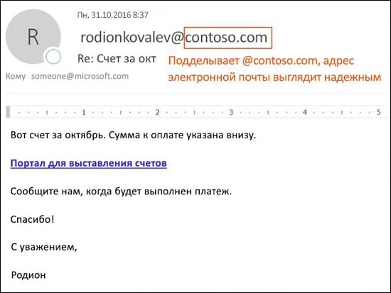

# Защита от спуфинга в EOP

[!INCLUDE [Microsoft 365 Defender rebranding](../includes/microsoft-defender-for-office.md)]

В организациях Microsoft 365 с почтовыми ящиками в Exchange Online и в автономных организациях Exchange Online Protection (EOP) без почтовых ящиков Exchange Online служба EOP включает функции для защиты организации от поддельных отправителей.

Когда речь идет о защите пользователей, Майкрософт серьезно относится к угрозе фишинга. Спуфинг - распространенная техника, используемая злоумышленниками. **Поддельные сообщения, похоже, исходят от кого-то или откуда-то, кроме фактического источника**. Этот метод часто используется в фишинговых кампаниях, предназначенных для получения учетных данных пользователя. Технология защиты от спуфинга в EOP специально проверяет подделку заголовка From в теле сообщения (используется для отображения отправителя сообщения в почтовых клиентах). Когда EOP имеет высокую уверенность в том, что заголовок From подделан, сообщение идентифицируется как поддельное.

В EOP доступны следующие технологии против спуфинга:

- **Аналитика подделки**: Просмотрите поддельные сообщения от отправителей во внутренних и внешних доменах и разрешите или заблокируйте этих отправителей. Дополнительные сведения см. в статье [Настройка аналитики спуфинга в Microsoft 365](learn-about-spoof-intelligence.md).

- **Политики защиты от фишинга**: в EOP встроенные политики защиты от фишинга позволяют включать и отключать интеллектуальный анализ, включать или отключать идентификацию не прошедших проверку подлинности отправителей в Outlook и указывать действия для заблокированных поддельных отправителей (перемещение в папку нежелательной почты или в карантин). Расширенные политики защиты от фишинга, доступные в Microsoft Defender для Office 365, также содержат параметры защиты от олицетворения (защищенные отправители и домены), параметры аналитики почтовых ящиков и настраиваемые расширенные пороги фишинга. Дополнительные сведения см. в статье [Политики защиты от фишинга в Microsoft 365](set-up-anti-phishing-policies.md).

- **Проверка подлинности электронной почты**: неотъемлемой частью любых усилий по борьбе со спуфингом является использование аутентификации электронной почты (также известной как проверка электронной почты) записями SPF, DKIM и DMARC в DNS. Вы можете настроить эти записи для своих доменов, чтобы почтовые системы назначения могли проверять достоверность сообщений, которые, как утверждают, были отправлены в ваших доменах. Для входящих сообщений Microsoft 365 требует проверки подлинности электронной почты для доменов отправителей. Дополнительные сведения см. в статье [Поверка подлинности электронной почты в Microsoft 365](email-validation-and-authentication.md).

Защите от спуфинга доступа в EOP с октября 2018 года.

EOP анализирует и блокирует сообщения, которые не могут быть аутентифицированы с помощью комбинации стандартных методов аутентификации электронной почты и методов репутации отправителя.

## Как спуфинг используется при фишинговых атаках

Поддельные сообщения имеют следующие негативные последствия для пользователей:

- **Поддельные сообщения обманывают пользователей**: Поддельное сообщение может заставить получателя щелкнуть ссылку и отказаться от своих учетных данных, загрузить вредоносное ПО или ответить на сообщение с конфиденциальным содержимым (известное как компрометация деловой электронной почты или BEC).

  Следующее сообщение является примером фишинга, в котором используется поддельный отправитель msoutlook94@service.outlook.com:

  

  Это сообщение не пришло с service.outlook.com, но злоумышленник подделал поле заголовка **От**, чтобы оно выглядело так, как оно было. Это была попытка обмануть получателя, щелкнув ссылку **изменить ваш пароль** и отказавшись от его учетных данных.

  Следующее сообщение является примером BEC, который использует поддельный почтовый домен contoso.com:

  

  Сообщение выглядит законным, но отправитель подделан.

- **Пользователи путают настоящие сообщения с поддельными**: Даже пользователи, которые знают о фишинге, могут с трудом увидеть разницу между реальными и поддельными сообщениями.

  Следующее сообщение является примером сообщения о сбросе реального пароля из учетной записи Microsoft Security:

  

  Сообщение действительно пришло от Microsoft, но пользователи были настроены быть подозрительными. Поскольку трудно отличить реальное сообщение о сбросе пароля от поддельного, пользователи могут игнорировать сообщение, сообщать о нем как о спаме или излишне сообщать об этом в Microsoft как о фишинге.

## Различные виды подмены

Microsoft различает два разных типа поддельных сообщений:

- **Спуфинг внутри организации**: также известен как спуфинг _самому себе_. Например,

  - Отправитель и получатель находятся в одном домене:
    > От: chris@contoso.com   Кому: michelle@contoso.com

  - Отправитель и получатель находятся в поддоменах одного домена:
    > От: laura@marketing.fabrikam.com   Кому: julia@engineering.fabrikam.com

  - Отправитель и получатель находятся в разных доменах, принадлежащих одной организации (то есть оба домена настроены как [принятые домены](https://docs.microsoft.com/exchange/mail-flow-best-practices/manage-accepted-domains/manage-accepted-domains) в одной организации):
    > От: отправитель @ microsoft.com   Кому: получатель @ поисковой системой bing.com

    Пробелы используются в адресах электронной почты, чтобы предотвратить сбор спамботов.

  Сообщения, которые не проходят [составную аутентификацию](email-validation-and-authentication.md#composite-authentication) из-за подделки внутри организации, содержат следующие значения заголовка:

  `Authentication-Results: ... compauth=fail reason=6xx`

  `X-Forefront-Antispam-Report: ...CAT:SPOOF;...SFTY:9.11`

  - `reason=6xx` обозначает подделку внутри Организации.

  - SFTY — уровень безопасности сообщения. 9 указывает на фишинг, .11 указывает на подделку внутри организации.

- **Междоменная спуфинг**: домены отправителя и получателя отличаются и не имеют отношения друг к другу (также известные как внешние домены). Например,
    > От: chris@contoso.com   Кому: michelle@tailspintoys.com

  Сообщения, которые не проходят [составную аутентификацию](email-validation-and-authentication.md#composite-authentication) из-за междоменной спуфинга, содержат следующие значения заголовков:

  `Authentication-Results: ... compauth=fail reason=000/001`

  `X-Forefront-Antispam-Report: ...CAT:SPOOF;...SFTY:9.22`

  - `reason=000` указывает, что сообщение не прошло явную проверку подлинности электронной почты. `reason=001` означает, что сообщение не прошло неявную проверку подлинности электронной почты.

  - SFTY - уровень безопасности сообщения. 9 указывает на фишинг, .22 указывает на междоменную спуфинг.

Дополнительные сведения о значениях категории и составной проверки подлинности (compauth), связанных со спуфингом, см. в статье [Заголовки сообщений для защиты от нежелательной почты в Microsoft 365](anti-spam-message-headers.md).

Дополнительные сведения о DMARC см. в статье [Использование DMARC для проверки электронной почты в Microsoft 365](use-dmarc-to-validate-email.md).

## Отчеты о том, сколько сообщений было помечено как поддельные

Организации EOP могут использовать отчет об **обнаружении подделки** на панели отчетов в Центре безопасности и соответствия требованиям. Для получения дополнительной информации см. [Отчет об обнаружении подделки](view-email-security-reports.md#spoof-detections-report).

Организация Microsoft Defender для Office 365 может использовать обозреватель угроз в Центре безопасности и соответствия требованиям для просмотра информации о попытках фишинга. Дополнительные сведения см. в статье [Исследование угроз Microsoft 365 и реагирование на них](office-365-ti.md).

## Проблемы с защитой от спуфинга

Известно, что списки рассылки (также называемые списками обсуждений) имеют проблемы с антиспуфингом из-за способа пересылки и изменения сообщений.

Например, Марта Артемьева (martemyeva@contoso.com) заинтересована в наблюдении за птицами, присоединяется к списку рассылки birdwatchers@fabrikam.com и отправляет в список следующее сообщение:

> **От:** "Марта Артемьева" \<glaureano@contoso.com\>   **Кому:** Список обсуждений наблюдателей за птицами \<birdwatchers@fabrikam.com\>   **Тема:** Прекрасный вид голубой сойки на вершине горы Рейнир на этой неделе 
 Кто-нибудь хочет посмотреть птицу на этой неделе на горе Рейнир?

Сервер списка рассылки принимает сообщение, изменяет его содержимое и передает его членам списка. Воспроизводимое сообщение имеет тот же адрес отправителя (glaureano@contoso.com), но в строку темы добавляется тег, а нижний колонтитул добавляется в конец сообщения. Этот тип изменений распространен в списках рассылки и может привести к ложным срабатываниям при подделке.

> **От:** "Марта Артемьева" \<glaureano@contoso.com\>   **Кому:** Список обсуждений наблюдателей за птицами \<birdwatchers@fabrikam.com\>   **Тема:** [BIRDWATCHERS] Прекрасный вид голубой сойки на вершине горы Рейнир на этой неделе 
 Кто-нибудь хочет посмотреть птицу на этой неделе на горе Рейнир? 
 Это сообщение было отправлено в список обсуждения для любителей птиц Birdwatchers. Вы можете отменить подписку в любое время.

Чтобы помочь сообщениям списка рассылки проходить проверку на спуфинг, выполните следующие действия в зависимости от того, управляете ли вы списком рассылки:

- Ваша организация владеет списком рассылки:

  - Проверьте FAQ на DMARC.org: [У меня есть список рассылки, и я хочу взаимодействовать с DMARC, что мне делать?](https://dmarc.org/wiki/FAQ#I_operate_a_mailing_list_and_I_want_to_interoperate_with_DMARC.2C_what_should_I_do.3F).

  - Прочтите инструкции в этом сообщении: [Совет операторам списков рассылки по взаимодействию с DMARC во избежание сбоев](https://blogs.msdn.microsoft.com/tzink/2017/03/22/a-tip-for-mailing-list-operators-to-interoperate-with-dmarc-to-avoid-failures/).

  - Попробуйте установить обновления на сервере списка рассылки для поддержки ARC: <http://arc-spec.org>.

- Вашей организации не принадлежит список рассылки:

  - Попросите сопровождающего списка рассылки настроить аутентификацию электронной почты для домена, с которого пересылается список рассылки.

    Когда достаточное число отправителей сообщат владельцам доменов о том, что им следует настроить записи для проверки подлинности электронной почты, это заставит их действовать. Хотя корпорация Майкрософт также работает с владельцами доменов в отношении необходимости публикации требуемых записей, лучше всего работает то, когда отдельные пользователи просят делать это.

  - Создайте правила входящих в своем почтовом клиенте для перемещения сообщений в папку «Входящие». Вы также можете попросить своих администраторов настроить переопределения, как описано в разделе [Использование подделки, для настройки разрешенных отправителей неаутентифицированной электронной почты](email-validation-and-authentication.md#use-spoof-intelligence-to-configure-permitted-senders-of-unauthenticated-email).

  - Создайте запрос в службу поддержки Microsoft 365, чтобы создать переопределение для списка рассылки, которое позволит считать этот список правомерным. Для получения дополнительной информации см. [Поддержка контактов для бизнес-продуктов - Справка администратора](../../admin/contact-support-for-business-products.md).

Если ничего не помогло, вы можете сообщить об этом сообщении Microsoft как о ложном срабатывании. Для получения дополнительной информации см. [Отчет о сообщениях и файлах в Microsoft](report-junk-email-messages-to-microsoft.md).

Вы также можете связаться со своим администратором, который может поднять его в качестве заявки в службу поддержки Microsoft. Команда разработчиков Microsoft должна выяснить, почему сообщение было помечено как поддельное.

## Соображения по поводу защиты от спуфинга

Если вы являетесь администратором, который в настоящее время отправляет сообщения в Microsoft 365, вам необходимо убедиться, что ваша электронная почта прошла надлежащую проверку подлинности. В противном случае она может быть помечена как спам или фишинг. Дополнительные сведения см. в разделе [Решения для добросовестных отправителей, которые отправляют письма без проверки подлинности](email-validation-and-authentication.md#solutions-for-legitimate-senders-who-are-sending-unauthenticated-email).

Отправители, внесенные в список надежных отправителей пользователя (или администратора), будут обходить части стека фильтрации, включая защиту от спуфинга. Подробнее см. в статье [Надежные отправители в Outlook](create-safe-sender-lists-in-office-365.md#use-outlook-safe-senders).

Администраторам следует избегать (по возможности) использование списка разрешенных отправителей или списков разрешенных доменов. Такие отправители обходят всю защиту от спама, спуфинга и фишинга, а также проверку подлинности отправителя (SPF, DKIM, DMARC). Подробнее см. в статье [Использование списков разрешенных отправителей и списков разрешенных доменов](create-safe-sender-lists-in-office-365.md#use-allowed-sender-lists-or-allowed-domain-lists).
