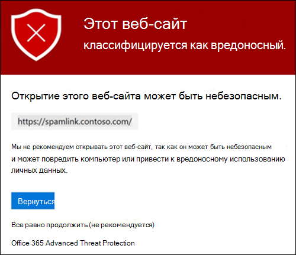
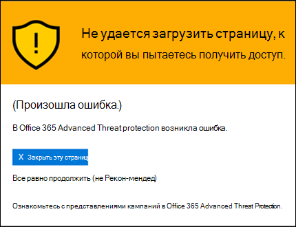

# Безопасные ссылки в Office 365 ATP

[!INCLUDE [Microsoft 365 Defender rebranding](../includes/microsoft-defender-for-office.md)]

> [!IMPORTANT]
> Эта статья предназначена для компаний-клиентов, у которых есть [Office 365 Advanced Threat protection (ATP)](office-365-atp.md). Если вы используете Outlook.com, семейство Microsoft 365 или Microsoft 365 персональный, а вы ищете сведения о Сафелинкс в Outlook, ознакомьтесь со статьей [Advanced Outlook.com Security](https://support.microsoft.com/office/882d2243-eab9-4545-a58a-b36fee4a46e2).

Безопасные ссылки это функция в [Office 365 Advanced Threat protection](office-365-atp.md) , которая обеспечивает сканирование и перезапись входящих сообщений электронной почты в канале обработки почты, а также время на проверку URL-адресов и ссылок в сообщениях электронной почты и других расположениях. Проверка безопасных ссылок выполняется в дополнение к обычной [защите от нежелательной почты и вредоносных программ](anti-spam-and-anti-malware-protection.md) в входящих сообщениях электронной почты в Exchange Online Protection (EOP). Сканирование безопасных ссылок помогает защитить организацию от вредоносных ссылок, используемых в фишинге и других атаках.

Защита с помощью безопасных ссылок доступна в следующих расположениях:

- **Сообщения электронной почты** : защита ссылок в сообщениях электронной почты управляется политиками безопасных ссылок. Политика безопасных ссылок по умолчанию отсутствует, **поэтому для обеспечения защиты безопасных ссылок в сообщениях электронной почты необходимо создать одну или несколько политик безопасных ссылок** . Инструкции см в разделе [Настройка политик безопасных ссылок в ATP](set-up-atp-safe-links-policies.md).

  Дополнительные сведения о защите защищенных ссылок для сообщений электронной почты можно найти в разделе [Параметры безопасных ссылок для сообщений электронной почты](#safe-links-settings-for-email-messages) далее в этой статье.

- **Microsoft Teams** (в настоящее время в режиме предварительного просмотра): защита ссылок в беседах Teams, групповых беседах и каналах также контролируется политиками безопасных ссылок. Политика безопасных ссылок по умолчанию отсутствует, **поэтому для обеспечения защиты безопасных ссылок в Teams необходимо создать одну или несколько политик безопасных ссылок** .

  Дополнительные сведения о защите ссылок в Teams можно найти в разделе [Параметры безопасных ссылок для Microsoft Teams](#safe-links-settings-for-microsoft-teams) далее в этом разделе.

- **Приложения office 365** : защита безопасных ссылок для приложений Office 365 доступна для настольных систем, мобильных устройств и веб-точек доступа. Вы **настраиваете** защиту безопасных ссылок для приложений Office 365 в глобальном параметре, который находится **вне** политик безопасных ссылок. Инструкции: [Настройка глобальных параметров для параметров безопасных ссылок в Office 365 ATP](configure-global-settings-for-safe-links.md).

  Но защита безопасных ссылок для приложений Office 365 **применяется** только к пользователям, включенным в активные политики безопасных ссылок. Если пользователь не включен в активную политику безопасных ссылок, пользователь не будет защищенных ссылок в поддерживаемых приложениях Office 365.

  Дополнительные сведения о защите безопасных ссылок в приложениях Office 365 можно найти в разделе [Параметры безопасных ссылок для приложений office 365](#safe-links-settings-for-office-365-apps) далее в этой статье.

В этой статье приведены подробные описания следующих типов параметров безопасных ссылок:

- **Параметры в политиках безопасных ссылок** : эти параметры применяются только к пользователям, включенным в конкретные политики, а параметры могут различаться в разных политиках. К этим параметрам относятся:

  - [Параметры безопасных ссылок для сообщений электронной почты](#safe-links-settings-for-email-messages)
  - [Параметры безопасных ссылок для Microsoft Teams](#safe-links-settings-for-microsoft-teams)
  - ["Не переопределять следующие списки URL-адресов" в политиках безопасных ссылок](#do-not-rewrite-the-following-urls-lists-in-safe-links-policies)

- **Глобальные параметры безопасных ссылок** : эти параметры настроены глобально, а не в политиках безопасных ссылок. Однако параметры применяются только для пользователей, включенных в активные политики безопасных ссылок. К этим параметрам относятся:

  - [Параметры безопасных ссылок для приложений Office 365](#safe-links-settings-for-office-365-apps)
  - [Список "блокировать следующие URL-адреса" для безопасных ссылок](#block-the-following-urls-list-for-safe-links)

В следующей таблице описаны сценарии для безопасных ссылок в организациях Microsoft 365 и Office 365, включающих ATP (другими словами, отсутствие лицензирования не является вопросом в примерах).

****

|Сценарий|Результат|
|---|---|
|Жан является участником маркетингового отдела. Защита безопасных ссылок для приложений Office 365 включена в глобальных параметрах для безопасных ссылок, а политика безопасных ссылок, которая применяется к участникам маркетингового отдела, существует. Жан открывает презентацию PowerPoint в сообщении электронной почты, а затем щелкает URL-адрес в презентации.|Жан защищается с помощью безопасных ссылок.    Жан включен в политику безопасных ссылок и включена защита безопасных ссылок для приложений Office 365.    Дополнительные сведения о требованиях для защиты безопасных ссылок в приложениях Office 365 можно найти в разделе [Параметры безопасных ссылок для приложений office 365](#safe-links-settings-for-office-365-apps) далее в этой статье.|
|В Microsoft 365 в компании Крис не настроены политики безопасных ссылок. Крис получает электронное письмо от внешнего отправителя, который содержит URL-адрес вредоносного веб-сайта, который в конечном итоге щелкает.|Крис не защищается с помощью безопасных ссылок.    Администратор должен создать по крайней мере одну политику безопасных ссылок для всех пользователей, чтобы обеспечить защиту ссылок в входящих сообщениях электронной почты. Крис должен быть включен в условия политики, чтобы обеспечить защиту с помощью безопасных ссылок.|
|В Организации Pat никакие администраторы не создали политики безопасных ссылок, но для приложений Office 365 включено безопасное связывание. Pat открывает документ Word и щелкает URL-адрес в файле.|Pat не защищены с помощью безопасных ссылок.    Несмотря на то, что защита безопасных ссылок для приложений Office 365 включена глобально, не включаются в активные политики безопасных ссылок, поэтому защита не может быть применена.|
|В Организации Иванов `https://tailspintoys.com` настраивается в списке **блокировать следующие URL-адреса** в глобальных параметрах для безопасных ссылок. Политика безопасных ссылок, включающая себя, уже существует. Иванов получает сообщение электронной почты, содержащее URL-адрес `https://tailspintoys.com/aboutus/trythispage` . "Иванов" выбирает URL-адрес.|URL-адрес может автоматически блокироваться для Ивановых; Это зависит от записи URL-адреса в списке и использованного почтового клиента. Более подробную информацию можно найти в разделе ["Блокировка следующих URL-адресов" списка для безопасных ссылок](#block-the-following-urls-list-for-safe-links) далее в этом разделе.|
|Ольга и Жулиа работают для contoso.com. Большое время назад администраторы настроили политики безопасных ссылок, которые применяются к обоим ресурсам и Жулиа. Ольга отправляет сообщение электронной почты в Жулиа, не зная, что сообщение содержит вредоносный URL-адрес.|Жулиа защищается безопасными связями, **Если** политика безопасных ссылок, которая применяется к ней, настроена для применения к сообщениям между внутренними получателями. Дополнительные сведения можно найти в разделе [Параметры безопасных ссылок для сообщений электронной почты](#safe-links-settings-for-email-messages) далее в этом разделе.|

## Параметры безопасных ссылок для сообщений электронной почты

Функция "безопасные ссылки" сканирует входящую электронную почту для известных вредоносных гиперссылок. Проверенные URL-адреса перезаписываются с помощью стандартного префикса URL-адреса Майкрософт: `https://nam01.safelinks.protection.outlook.com` . После перезаписи ссылки она анализируется на наличие потенциально вредоносного контента.

После того как безопасные ссылки переопределяют URL-адрес, URL-адрес остается переписанным, даже если сообщение переадресовано или ответило. Дополнительные ссылки, добавляемые к сообщению переадресованные или Отвеченные, не переписываются.

Параметры политик безопасных ссылок, применимые к сообщениям электронной почты, описаны в приведенном ниже списке.

- **Выберите действие для неизвестных потенциально вредоносных URL-адресов в сообщениях** : включает или отключает сканирование безопасных ссылок в сообщениях электронной почты. Рекомендуемое значение — **On** . Включение этого параметра приводит к следующим действиям.

  - Сканирование безопасных ссылок включено в Outlook (C2R) в Windows.
  - URL-адреса переопределяются, и пользователи направляются через безопасную связь при нажатии на URL-адреса в сообщениях.
  - При нажатии URL-адреса проверяются на соответствие списку известных вредоносных URL-адресов и [списку "блокировать следующие URL-адреса"](#block-the-following-urls-list-for-safe-links).
  - URL-адреса, у которых нет действующей репутации, обезврежено асинхронно в фоновом режиме.

- **Применить сканирование URL-адресов в режиме реального времени для подозрительных ссылок и ссылок, указывающих на файлы** : включает сканирование ссылок в режиме реального времени, включая ссылки в сообщениях электронной почты, указывающие на загружаемый контент. Рекомендуемое значение — Enabled.

  - **Перед доставкой сообщения дождитесь завершения сканирования URL-адресов** :

    - Enabled: сообщения, содержащие URL-адреса, удерживаются до завершения сканирования. Сообщения доставляются только после подтверждения безопасности URL-адресов. Это рекомендуемое значение.
    - Disabled: Если сканирование URL-адресов не удается завершить, доставить сообщение все равно.

- **Применяйте безопасные ссылки к сообщениям электронной почты, отправленным в Организации** : включает или выключает сканирование безопасных ссылок для сообщений, отправляемых между внутренними отправителями и внутренними получателями в той же организации Exchange Online. Рекомендуемое значение — Enabled.

- **Не Отслеживайте щелчков пользователя** : Включение или отключение сохранения безопасных ссылок. Щелкните данные для URL-адресов, которые вы щелкнули в сообщениях электронной почты. Рекомендуемое значение оставить этот параметр невыбранным (для отслеживания нажатий клавиш пользователем).

  URL-адрес щелкните Отслеживание ссылок в сообщениях электронной почты, отправляемых между внутренними отправителями и внутренними получателями, в настоящее время не поддерживается.

- **Не разрешать пользователям щелкать по исходному URL-адресу** : разрешает или запрещает пользователям щелкать через [страницу предупреждения](#warning-pages-from-safe-links) по исходному URL-адресу. Рекомендуемое значение — Enabled.

- **Не перезаписывайте следующие URL-адреса** : оставляет URL-адреса как есть. Сохраняет настраиваемый список безопасных URL-адресов, для которых не требуется сканирование. Список уникален для каждой политики безопасных ссылок. Для получения дополнительных сведений о **перезаписи следующего списка URL-адресов** обратитесь к разделу ["не переопределять следующие URL-адреса" в разделе политики безопасных ссылок](#do-not-rewrite-the-following-urls-lists-in-safe-links-policies) далее в этой статье.

Дополнительные сведения о рекомендуемых значениях для стандартных политик и политик строгого доступа для политик безопасных ссылок приведены в разделе [Параметры политики безопасных ссылок](recommended-settings-for-eop-and-office365-atp.md#safe-links-policy-settings).

- **Фильтры получателей** : необходимо указать условия получателей и исключения, которые определяют, к кому применяется политика. Для условий и исключений можно использовать следующие свойства:

  - **Получатель**
  - **Домен получателя** .
  - **Получатель входит в группу**

  Условие или исключение можно использовать только один раз, но оно может содержать несколько значений. Указать несколько значений в одном условии или исключении можно с помощью оператора OR (например, _\<recipient1\>_ or _\<recipient2\>_ ). Между разными условиями и исключениями используется оператор AND (например, _\<recipient1\>_ and _\<member of group 1\>_ ).

- **Priority** : Если вы создаете несколько политик, вы можете указать порядок их применения. Никакие две политики не могут иметь одинаковый приоритет, и обработка политики прекращается после применения первой политики.

  Дополнительные сведения о приоритетах, а также оценке и применении нескольких политик см. в статье [Порядок и приоритет защиты электронной почты](how-policies-and-protections-are-combined.md).

### Как безопасные ссылки работают в сообщениях электронной почты

На высоком уровне ниже показано, как защита безопасных ссылок работает с URL-адресами в сообщениях электронной почты.

1. Все сообщения электронной почты проходят через EOP, где IP-фильтры и фильтры конвертов, защита от вредоносных программ на основе подписей, фильтры защиты от нежелательной почты и защиты от вредоносных программ перед доставкой сообщения в почтовый ящик получателя.

2. Пользователь открывает сообщение в своем почтовом ящике и щелкает URL-адрес в сообщении.

3. Безопасные ссылки сразу проверяют URL-адрес перед открытием веб-сайта:

   - Если URL-адрес включен в список **блокирования следующих URL-адресов** , откроется [предупреждение о блокированном URL-адресе](#blocked-url-warning) .

   - Если URL-адрес указывает на веб-сайт, который определен как вредоносный, откроется страница [предупреждения о вредоносном веб-сайте](#malicious-website-warning) (или на другой странице предупреждения).

   - Если URL-адрес указывает на загружаемый файл, а параметр **Применить сканирование URL-адресов в режиме реального времени для подозрительных ссылок и ссылок, которые указывают на** параметр "файлы" включен в политике, применяемой к пользователю, то проверяется загружаемый файл.

   - Если URL-адрес определен как безопасный, откроется веб-сайт.

## Параметры безопасных ссылок для Microsoft Teams

> [!IMPORTANT]
> В марте 2020 эта функция доступна только для участников программы внедрения технологий Microsoft Teams (TAP). За сведениями о расписании выпуска, ознакомьтесь с [планом Microsoft 365](https://www.microsoft.com/microsoft-365/roadmap?rtc=1&filters=&searchterms=Safe%2CLinks%2CProtection%2Cfor%2CMicrosoft%2CTeams).

Вы включаете или отключаете защиту безопасных ссылок для Microsoft Teams в политиках безопасных ссылок. В частности, вы используете параметр **выбрать действие для неизвестных или потенциально вредоносных URL-адресов в Microsoft Teams** . Рекомендуемое значение — **On** .

Следующие параметры в политиках безопасных ссылок, применяемых к ссылкам в сообщениях электронной почты, также применяются к ссылкам в Microsoft teams:

- **Применение сканирования URL-адресов в режиме реального времени для подозрительных ссылок и ссылок, указывающих на файлы**
- **Не отслеживать нажатия пользователем**
- **Не разрешать пользователям щелкать по исходному URL-адресу**

Эти параметры описаны в разделе предыдущие [Параметры безопасных ссылок для сообщений электронной почты](#safe-links-settings-for-email-messages) .

После включения защиты безопасных ссылок для Microsoft Teams в Teams проверяется список известных вредоносных ссылок, когда защищенный пользователь щелкает ссылку (защита по времени нажатия). URL-адреса не перезаписываются. Если обнаружена вредоносная ссылка, у пользователей будет следующий опыт:

- Если ссылка была выбрана в беседе Teams, группе чатов или каналах, страница предупреждения, как показано на снимке экрана ниже, будет отображаться в веб-браузере по умолчанию.
- Если ссылка была выбрана из закрепленной вкладки, то страница предупреждения будет отображаться в интерфейсе Teams на этой вкладке. Из соображений безопасности отключается возможность открыть ссылку в веб-браузере.
- В зависимости от того, как параметр запретить пользователям переходить по **исходному URL-адресу** в политике настроен, пользователю будет разрешено или не будет разрешено переходить по исходному URL-адресу ( **Продолжить (не рекомендуется)** на снимке экрана). Рекомендуется включить параметр **не разрешать пользователям переходить по исходному URL-адресу** , чтобы пользователи не могли щелкать по исходному URL-адресу.

Если пользователь, который отправил ссылку не включен в политику безопасных ссылок, в которой включена защита Teams, пользователь может свободно щелкать по исходному URL-адресу на компьютере или устройстве.

Нажатие кнопки **"вернуться** " на странице предупреждения вернет пользователя к исходному контексту или расположению URL-адреса. Тем не менее, если щелкнуть исходную ссылку еще раз, можно получить безопасные ссылки для повторного сканирования URL-адреса, поэтому страница предупреждения появится снова.

### Как безопасные ссылки работают в Teams

На высоком уровне ниже показано, как защита безопасных ссылок работает для URL-адресов в Microsoft teams:

1. Пользователь запускает приложение Teams.

2. Microsoft 365 удостоверяется в том, что в организации пользователя включен Office 365 ATP, а пользователь включен в активную политику безопасных ссылок, в которой включена защита для Microsoft Teams.

3. URL-адреса проверяются во время щелчка пользователя в беседах, групповых чатов, каналов и вкладок.

## Параметры безопасных ссылок для приложений Office 365

Защита с помощью безопасных ссылок для приложений Office 365. проверяет ссылки в документах Office, а не ссылки в сообщениях электронной почты (но они могут проверять ссылки в прикрепленных документах Office в сообщениях электронной почты после открытия документа).

Защита безопасных ссылок для приложений Office 365 имеет следующие требования к клиентам:

- Приложения Microsoft 365 или Microsoft 365 бизнес премиум.
  - Текущие версии Word, Excel и PowerPoint в Windows, Mac или в веб-браузере.
  - Приложения Office на устройствах с iOS или Android.
  - Visio в Windows.
  - OneNote в веб-браузере.

- Приложения Office 365 настроены для использования современной проверки подлинности. Для получения дополнительных сведений Узнайте, [как работает современная проверка подлинности для office 2013, office 2016 и клиентских приложений office 2019](https://docs.microsoft.com/microsoft-365/enterprise/modern-auth-for-office-2013-and-2016).

- Пользователи вошли в систему, используя рабочие или учебные учетные записи. Дополнительную информацию можно узнать [в статье вход в Office](https://support.microsoft.com/office/b9582171-fd1f-4284-9846-bdd72bb28426).

Вы настраиваете защиту безопасных ссылок для приложений Office 365 в глобальных параметрах для безопасных ссылок, а не в политиках безопасных ссылок. Однако для применения защиты от безопасных ссылок для приложений Office 365 пользователь, который открывает документ Office и щелкает ссылку, должен быть включен в активную политику безопасных ссылок.

Следующие параметры безопасных ссылок доступны для приложений Office 365:

- **Приложения office 365** : включает или отключает сканирование безопасных ссылок в поддерживаемых приложениях Office 365. Значение по умолчанию и рекомендуемое значение — **On** .

- **Не Отслеживайте, когда пользователи щелкают ссылки "безопасные ссылки** ": Включение или отключение сохранения безопасных ссылок. Щелкните данные для URL-адресов, щелкнув на настольных версиях Word, Excel, PowerPoint и Visio. Рекомендуемое значение — " **отключено** ", это означает, что пользователь щелкает элемент отслеживается.

- **Не разрешать пользователям щелкать ссылки по безопасному URL-адресу** : разрешает или запрещает пользователям щелкать через [страницу предупреждения](#warning-pages-from-safe-links) на исходный URL-адрес на настольных версиях Word, Excel, PowerPoint и Visio. Значение по умолчанию и рекомендуемое значение — **On** .

Чтобы настроить параметры безопасных ссылок для приложений Office 365, ознакомьтесь со статьей [Настройка защиты безопасных ссылок для приложений office 365](configure-global-settings-for-safe-links.md#configure-safe-links-protection-for-office-365-apps-in-the-security--compliance-center).

Дополнительные сведения о рекомендуемых значениях для стандартных параметров и политик строгой политики приведены в статье [глобальные параметры для безопасных ссылок](recommended-settings-for-eop-and-office365-atp.md#global-settings-for-safe-links).

### Как безопасные ссылки работают в приложениях Office 365

На высоком уровне ниже показано, как защита безопасных ссылок работает для URL-адресов в приложениях Office 365. Поддерживаемые приложения Office 365 описаны в предыдущем разделе.

1. Пользователь подписывается с помощью рабочей или учебной учетной записи в Организации, которая включает приложения Microsoft 365 или Microsoft 365 бизнес премиум.

2. Пользователь открывает и щелкает ссылку на документ Office в поддерживаемом приложении Office.

3. Безопасные ссылки сразу проверяют URL-адрес перед открытием конечного веб-сайта:

   - Если URL-адрес включен в список, пропускающий сканирование безопасных ссылок ( **блокировать список URL-адресов** ), откроется страница [предупреждения о заблокированном URL-адресе](#blocked-url-warning) .

   - Если URL-адрес указывает на веб-сайт, который определен как вредоносный, откроется страница [предупреждения о вредоносном веб-сайте](#malicious-website-warning) (или на другой странице предупреждения).

   - Если URL-адрес указывает на загружаемый файл, а политика безопасных ссылок, которая применяется к пользователю, настроена на сканирование ссылок на загружаемый контент ( **применение сканирования URL-адресов для подозрительных ссылок и ссылок, указывающих на файлы** ), проверяется загружаемый файл.

   - Если URL-адрес считается безопасным, пользователь передается на веб-сайт.

   - Если проверка на наличие безопасных ссылок не может быть завершена, защита безопасных ссылок не инициируется. В клиенте Office для настольных ПК перед переходом к конечному веб-сайту пользователю будет выводиться предупреждение.

> [!NOTE]
> В начале каждого сеанса может потребоваться несколько секунд, чтобы убедиться в том, что пользователь имеет безопасные ссылки для Office.

## Список "блокировать следующие URL-адреса" для безопасных ссылок

В списке **Блокировка следующих URL-адресов** определены ссылки, которые всегда блокируются при сканировании ссылок в следующих расположениях:

- Сообщения электронной почты.
- Документы в приложениях Office 365 в Windows и Mac.
- Документы в Office для iOS и Android.

Когда пользователь в активной политике безопасных ссылок щелкает Заблокированную ссылку в поддерживаемом приложении, они переводятся на страницу [предупреждения блокированного URL-адреса](#blocked-url-warning) .

Список URL-адресов настраивается в глобальных параметрах для безопасных ссылок. Инструкции можно найти [в разделе Настройка списка "Блокировка следующих URL-адресов"](configure-global-settings-for-safe-links.md#configure-the-block-the-following-urls-list-in-the-security--compliance-center).

**Примечания** :

- Для получения действительно универсального списка URL-адресов, которые блокируются везде, ознакомьтесь со статьей [Управление URL-адресами в списке разрешенных и](tenant-allow-block-list.md)запрещенных клиентов.

- Шагов
  - Максимальное число записей — 500.
  - Максимальная длина записи составляет 128 символов.
  - Длина всех записей не может превышать 10 000 символов.

- Не включайте косую черту ( `/` ) в конце URL-адреса. Например, используйте `https://www.contoso.com` , Not `https://www.contoso.com/` .

- URL-адрес только для домена (например `contoso.com` , или `tailspintoys.com` ) будет блокировать любой URL-адрес, содержащий домен.

- Вы можете заблокировать дочерний домен, не блокируя весь домен. Например, `toys.contoso.com*` блокирует любой URL-адрес, содержащий поддомен, но не блокирует URL-адреса, содержащие весь домен `contoso.com` .

- Можно указать до трех подстановочных знаков ( `*` ) для каждой записи URL-адреса.

### Синтаксис записи для списка "Блокировка следующих URL-адресов"

В следующей таблице приведены примеры значений, которые можно ввести, и их результаты.

****

|Значение|Результат|
|---|---|
|`contoso.com`   или   `*contoso.com*`|Блокирует домен, дочерние домены и пути. Например,, `https://www.contoso.com` , `https://sub.contoso.com` и `https://contoso.com/abc` они заблокированы.|
|`https://contoso.com/a`|Блокирует `https://contoso.com/a` , но не дополнительные подпути, такие как `https://contoso.com/a/b` .|
|`https://contoso.com/a*`|Блоки `https://contoso.com/a` и дополнительные подпути, такие как `https://contoso.com/a/b` .|
|`https://toys.contoso.com*`|Блокирует поддомен ( `toys` в данном примере), но позволяет переходить на другие URL-адреса доменов (например `https://contoso.com` , или `https://home.contoso.com` ).|
|

## "Не переопределять следующие списки URL-адресов" в политиках безопасных ссылок

> [!NOTE]
> Если в вашей организации используются политики безопасных ссылок, **не перезаписывайте следующие списки URL-адресов** — единственный поддерживаемый способ проверки фишинга сторонних производителей.

Каждая политика безопасных ссылок содержит параметр **не переопределять следующий список URL-адресов** , который можно использовать для указания URL-адресов, которые не переписываются при сканировании безопасных ссылок. Другими словами, список разрешает пользователям, включенным в политику, получать доступ к указанным URL-адресам, которые в противном случае будут заблокированы с помощью безопасных ссылок. Можно настроить различные списки в разных политиках безопасных ссылок. Обработка политики завершается после применения первой (вероятно, наивысшей приоритетной) политики к пользователю. Таким образом, только один **следующий список URL-адресов не переопределяется** для пользователя, включенного в несколько активных политик безопасных ссылок.

Чтобы добавить записи в список новых или существующих политик безопасных ссылок, ознакомьтесь со статьей Создание политик безопасных [ссылок](set-up-atp-safe-links-policies.md#use-the-security--compliance-center-to-create-safe-links-policies) или [изменение политик безопасных ссылок](set-up-atp-safe-links-policies.md#use-the-security--compliance-center-to-modify-safe-links-policies).

**Примечания** :

- Следующие клиенты не распознают не **переписывать следующие списки URL-адресов** в политиках безопасных ссылок. Пользователи, включенные в политики, могут блокировать доступ к URL-адресам на основе результатов проверки безопасных ссылок в следующих клиентах:

  - Microsoft Teams
  - Office Web Apps

  Для получения действительно универсального списка URL-адресов, которые можно использовать везде, ознакомьтесь со статьей [Управление URL-адресами в списке Разрешить/запретить клиента](tenant-allow-block-list.md).

- Рекомендуется добавить в список часто используемые внутренние URL-адреса для усовершенствования взаимодействия с пользователем. Например, если у вас есть локальные службы, такие как Skype для бизнеса или SharePoint, вы можете добавить эти URL-адреса, чтобы исключить их из проверки.

- Если вы уже не **переопределяете следующие записи URL-адресов** в политиках безопасных ссылок, обязательно ознакомьтесь со списками и добавьте подстановочные знаки по мере необходимости. Например, в списке есть такая запись, `https://contoso.com/a` а позднее вы решите включить подпути, такие как `https://contoso.com/a/b` . Вместо того чтобы добавлять новую запись, добавьте к существующей записи подстановочный знак, чтобы он стал доступен `https://contoso.com/a/*` .

- Можно указать до трех подстановочных знаков ( `*` ) для каждой записи URL-адреса. В явном виде используются префиксы или поддомены. Например, запись `contoso.com` не совпадает с `*.contoso.com/*` , так как `*.contoso.com/*` позволяет людям посещать поддомены и пути в указанном домене.

### Синтаксис записи для списка "не переопределять следующие URL-адреса"

В следующей таблице приведены примеры значений, которые можно ввести, и их результаты.

****

|Значение|Результат|
|---|---|
|`contoso.com`|Разрешает доступ к, `https://contoso.com` но не дочерним доменам или путям.|
|`*.contoso.com/*`|Разрешает доступ к домену, поддоменам и путям (например,,, `https://www.contoso.com` `https://www.contoso.com` `https://maps.contoso.com` или `https://www.contoso.com/a` ).    Эта запись по сути лучше `*contoso.com*` , так как она не допускает потенциально мошеннических сайтов, например, `https://www.falsecontoso.com` или `https://www.false.contoso.completelyfalse.com`|
|`https://contoso.com/a`|Разрешает доступ `https://contoso.com/a` , но не вложенные пути, такие как `https://contoso.com/a/b`|
|`https://contoso.com/a/*`|Разрешает доступ к `https://contoso.com/a` таким же подпапкам, как и к `https://contoso.com/a/b`|
|

## Страницы с предупреждениями из безопасных ссылок

В этом разделе содержатся примеры страниц предупреждений, которые запускаются с помощью защиты с помощью безопасного соединения при щелчке URL-адреса.

Обратите внимание на то, что были обновлены несколько страниц с предупреждениями. Если вы еще не видите обновленные страницы, вскоре вы будете готовы. Обновленные страницы включают новую цветовую схему, более подробную информацию и возможность перехода на сайт, несмотря на заданное предупреждение и рекомендации.

### Уведомление о ходе сканирования

URL-адрес щелчка проверяется с помощью ссылки "безопасные". Вам может потребоваться подождать некоторое время, прежде чем повторять ссылку.

Исходная страница уведомления выглядит следующим образом:

### Предупреждение о подозрительном сообщении

URL-адрес, который был выбран, находится в сообщении электронной почты, похожем на другие подозрительные сообщения. Перед переходом на сайт рекомендуется проверить сообщение электронной почты.

### Предупреждение о неудачной попытке фишинга

URL-адрес, который был выбран, находится в сообщении электронной почты, которое было определено как атака фишинга. В результате все URL-адреса в сообщении электронной почты блокируются. Не рекомендуется переходить на сайт.

### Предупреждение о вредоносном веб-сайте

URL-адрес щелчка указывает на сайт, который был определен как вредоносный. Не рекомендуется переходить на сайт.

Исходная страница предупреждения выглядела следующим образом:

### Предупреждение о заблокированном URL-адресе

Щелчок по указанному URL-адресу был заблокирован администратором в организации вручную (в разделе "глобальные параметры для безопасных ссылок" заблокируйте **следующий список URL-адресов** ). Ссылка не была проверена по безопасным связям, так как она была заблокирована вручную.

Существует несколько причин, по которым администратору придется вручную блокировать определенные URL-адреса. Если вы считаете, что сайт не должен быть заблокирован, обратитесь к администратору.

Исходная страница предупреждения выглядела следующим образом:

### Предупреждение об ошибке

Произошла ошибка, и не удается открыть URL-адрес.

Исходная страница предупреждения выглядела следующим образом:

