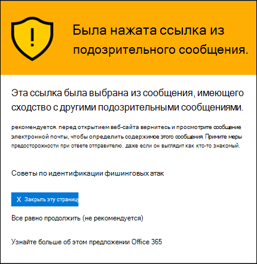
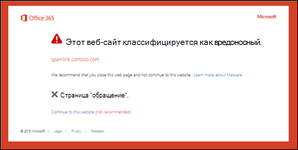

# Безопасные ссылки в Microsoft Defender для Office 365Safe Links in Microsoft Defender for Office 365

[!INCLUDE [Microsoft 365 Defender rebranding](../includes/microsoft-defender-for-office.md)]

**Область применения****Applies to**
- [Microsoft Defender для Office 365 (план 1 и план 2)Microsoft Defender for Office 365 plan 1 and plan 2](https://go.microsoft.com/fwlink/?linkid=2148715)
- [Microsoft 365 DefenderMicrosoft 365 Defender](https://go.microsoft.com/fwlink/?linkid=2118804)

> [!IMPORTANT]
> Эта статья предназначена для бизнес-клиентов, использующих [Microsoft Defender для Office 365](office-365-atp.md).This article is intended for business customers who have [Microsoft Defender for Office 365](office-365-atp.md). Если вы используете Outlook.com, Семейство Microsoft 365 или Microsoft 365 персональный и ищете сведения о безопасных ссылках в Outlook, см. дополнительные сведения [о Outlook.com безопасности.](https://support.microsoft.com/office/882d2243-eab9-4545-a58a-b36fee4a46e2)If you're using Outlook.com, Microsoft 365 Family, or Microsoft 365 Personal, and you're looking for information about Safelinks in Outlook, see [Advanced Outlook.com security](https://support.microsoft.com/office/882d2243-eab9-4545-a58a-b36fee4a46e2).

Функция "Безопасные ссылки" — это функция в [Защитнике Office 365,](office-365-atp.md) которая обеспечивает сканирование URL-адресов и переописывание входящие сообщения электронной почты в потоке почты, а также проверку URL-адресов и ссылок в электронных сообщениях и других расположениях во время щелчка мышью.Safe Links is a feature in [Defender for Office 365](office-365-atp.md) that provides URL scanning and rewriting of inbound email messages in mail flow, and time-of-click verification of URLs and links in email messages and other locations. Сканирование безопасных ссылок происходит  в дополнение к обычной защите от нежелательной почты и вредоносных программ во входящие сообщения электронной почты в Exchange Online Protection (EOP).Safe Links scanning occurs in addition to the regular [anti-spam and anti-malware protection](anti-spam-and-anti-malware-protection.md) in inbound email messages in Exchange Online Protection (EOP). Сканирование безопасных ссылок помогает защитить организацию от вредоносных ссылок, используемых в фишинге и других атаках.Safe Links scanning can help protect your organization from malicious links that are used in phishing and other attacks.

Защита безопасных ссылок доступна в следующих расположениях:Safe Links protection is available in the following locations:

- **Сообщения электронной** почты: защита безопасных ссылок для ссылок в сообщениях электронной почты контролируется политиками безопасных ссылок.**Email messages**: Safe Links protection for links in email messages is controlled by Safe Links policies. Политика безопасных ссылок по умолчанию не существует, поэтому для защиты безопасных ссылок в сообщениях электронной почты необходимо создать одну или несколько политик безопасных **ссылок.**There is no default Safe Links policy, **so to get the protection of Safe Links in email messages, you need to create one or more Safe Links policies**. Инструкции см. в [настройках политик безопасных ссылок в Microsoft Defender для Office 365.](set-up-atp-safe-links-policies.md)For instructions, see [Set up Safe Links policies in Microsoft Defender for Office 365](set-up-atp-safe-links-policies.md).

  Дополнительные сведения о защите безопасных ссылок  для сообщений электронной почты см. в разделе "Параметры безопасных ссылок для сообщений электронной почты" далее в этой статье.For more information about Safe Links protection for email messages, see the [Safe Links settings for email messages](#safe-links-settings-for-email-messages) section later in this article.

- **Microsoft Teams** (в настоящее время находится в предварительной версии TAP): защита безопасных ссылок для ссылок в беседах Teams, групповых чатах или каналах также контролируется политиками безопасных ссылок.**Microsoft Teams** (currently in TAP Preview): Safe Links protection for links in Teams conversations, group chats, or from channels is also controlled by Safe Links policies. Политика безопасных ссылок по умолчанию не существует, поэтому для защиты безопасных ссылок в Teams необходимо создать одну или несколько политик безопасных **ссылок.**There is no default Safe Links policy, **so to get the protection of Safe Links in Teams, you need to create one or more Safe Links policies**.

  Дополнительные сведения о защите безопасных ссылок в Teams см. в разделе "Параметры безопасных ссылок [для Microsoft Teams"](#safe-links-settings-for-microsoft-teams) далее в этой статье.For more information about Safe Links protection in Teams, see the [Safe Links settings for Microsoft Teams](#safe-links-settings-for-microsoft-teams) section later in this article.

- **Приложения Office 365:** защита безопасных ссылок для приложений Office 365 доступна в поддерживаемых классических, мобильных и веб-aps.**Office 365 apps**: Safe Links protection for Office 365 apps is available in supported desktop, mobile, and web aps. Защита **безопасных** ссылок для приложений Office 365 настраивается в глобальном параметре, который не **является** политикой безопасных ссылок.You **configure** Safe Links protection for Office 365 apps in the global setting that are **outside** of Safe Links policies. Инструкции см. в инструкциях по настройке глобальных параметров для параметров безопасных ссылок [в Microsoft Defender для Office 365.](configure-global-settings-for-safe-links.md)For instructions, see [Configure global settings for Safe Links settings in Microsoft Defender for Office 365](configure-global-settings-for-safe-links.md).

  Однако защита безопасных ссылок для приложений  Office 365 применяется только к пользователям, включенным в активные политики безопасных ссылок.But, Safe Links protection for Office 365 apps is only **applied** to users who are included in active Safe Links policies. Если пользователь не включен в активную политику безопасных ссылок, он не получает защиту безопасных ссылок в поддерживаемых приложениях Office 365.If a user isn't included in an active Safe Links policy, the user doesn't get Safe Links protection in supported Office 365 apps.

  Дополнительные сведения о защите безопасных ссылок в приложениях Office 365 см. в разделе "Параметры безопасных ссылок для приложений [Office 365"](#safe-links-settings-for-office-365-apps) далее в этой статье.For more information about Safe Links protection in Office 365 apps, see the [Safe Links settings for Office 365 apps](#safe-links-settings-for-office-365-apps) section later in this article.

В этой статье подробно описаны следующие типы параметров безопасных ссылок:This article includes detailed descriptions of the following types of Safe Links settings:

- **Параметры в** политиках безопасных ссылок: эти параметры применяются только к пользователям, включенным в определенные политики, и параметры могут быть разными в разных политиках.**Settings in Safe Links policies**: These settings apply only to the users who are included in the specific policies, and the settings might be different between policies. К этим параметрам относятся:These settings include:

  - [Параметры безопасных ссылок для сообщений электронной почтыSafe Links settings for email messages](#safe-links-settings-for-email-messages)
  - [Параметры безопасных ссылок для Microsoft TeamsSafe Links settings for Microsoft Teams](#safe-links-settings-for-microsoft-teams)
  - [Списки "Не переописывать следующие URL-адреса" в политиках безопасных ссылок"Do not rewrite the following URLs" lists in Safe Links policies](#do-not-rewrite-the-following-urls-lists-in-safe-links-policies)

- **Глобальные параметры безопасных ссылок:** эти параметры настраиваются глобально, а не в политиках безопасных ссылок.**Global Safe Links settings**: These settings are configured globally, not in Safe Links policies. Однако эти параметры применяются только к пользователям, включенным в активные политики безопасных ссылок.But, the settings apply only to users who are included in active Safe Links policies. К этим параметрам относятся:These settings include:

  - [Параметры безопасных ссылок для приложений Office 365Safe Links settings for Office 365 apps](#safe-links-settings-for-office-365-apps)
  - [Список "Блокировать следующие URL-адреса" для безопасных ссылок"Block the following URLs" list for Safe Links](#block-the-following-urls-list-for-safe-links)

В следующей таблице описываются сценарии безопасных ссылок в организациях Microsoft 365 и Office 365, включающие Защитник для Office 365 (другими словами, отсутствие лицензирования никогда не является проблемой в примерах).The following table describes scenarios for Safe Links in Microsoft 365 and Office 365 organizations that include Defender for Office 365 (in other words, lack of licensing is never an issue in the examples).

****

|СценарийScenario|РезультатResult|
|---|---|
|Она является сотрудником отдела маркетинга.Jean is a member of the marketing department. Защита безопасных ссылок для приложений Office 365 включена в глобальных параметрах безопасных ссылок, и существует политика безопасных ссылок, применяемая к сотрудникам маркетингового отдела.Safe Links protection for Office 365 apps is turned on in the global settings for Safe Links, and a Safe Links policy that applies to members of the marketing department exists. Она открывает презентацию PowerPoint в сообщении электронной почты, а затем щелкает URL-адрес презентации.Jean opens a PowerPoint presentation in an email message, and then clicks a URL in the presentation.|Она защищена с помощью безопасных ссылок.Jean is protected by Safe Links. 
 Она включена в политику безопасных ссылок, а защита безопасных ссылок для приложений Office 365 включена.Jean is included in a Safe Links policy, and Safe Links protection for Office 365 apps is turned on. 
 Дополнительные сведения о требованиях к защите безопасных ссылок в приложениях Office 365 см. в разделе "Параметры безопасных ссылок для приложений [Office 365"](#safe-links-settings-for-office-365-apps) далее в этой статье.For more information about the requirements for Safe Links protection in Office 365 apps, see the [Safe Links settings for Office 365 apps](#safe-links-settings-for-office-365-apps) section later in this article.|
|В организации Microsoft 365 E5 Криса не настроены политики безопасных ссылок.Chris's Microsoft 365 E5 organization has no Safe Links policies configured. Chris получает сообщение электронной почты от внешнего отправитель, которое содержит URL-адрес вредоносного веб-сайта, который он в конечном итоге щелкает.Chris receives an email from an external sender that contains a URL to a malicious website that he ultimately clicks.|Chris не защищен с помощью безопасных ссылок.Chris is not protected by Safe Links. 
 Администратор должен создать по крайней мере одну политику безопасных ссылок для всех, чтобы получить защиту безопасных ссылок во входящие сообщения электронной почты.An admin must create at least one Safe Links policy for anyone to get Safe Links protection in inbound email messages. Чтобы получить защиту безопасных ссылок, Крис должен быть включен в условия политики.Chris must be included in the conditions of policy to get Safe Links protection.|
|В организации Pat администраторы не создали никаких политик безопасных ссылок, но защита безопасных ссылок для приложений Office 365 включена.In Pat's organization, no admins have created any Safe Links policies, but Safe Links protection for Office 365 apps is turned on. Pat открывает документ Word и щелкает URL-адрес в файле.Pat opens a Word document and clicks a URL in the file.|Pat не защищена с помощью безопасных ссылок.Pat is not protected by Safe Links. 
 Хотя защита безопасных ссылок для приложений Office 365 включена глобально, Pat не включен ни в какие активные политики безопасных ссылок, поэтому защиту нельзя применить.Although Safe Links protection for Office 365 apps is turned on globally, Pat is not included in any active Safe Links policies, so the protection can't be applied.|
|В организации Ли настроен в списке "Блокировать следующие URL-адреса" в глобальных параметрах `https://tailspintoys.com` безопасных ссылок. In Lee's organization, `https://tailspintoys.com` is configured in the **Block the following URLs** list in the global settings for Safe Links. Политика безопасных ссылок, включаемая Ли, уже существует.A Safe Links policy that includes Lee already exists. Ли получает сообщение электронной почты с URL-адресом. `https://tailspintoys.com/aboutus/trythispage`Lee receives an email message that contains the URL `https://tailspintoys.com/aboutus/trythispage`. Ли щелкает URL-адрес.Lee clicks the URL.|URL-адрес может быть автоматически заблокирован для Ли; это зависит от записи URL-адреса в списке и используемого почтового клиента Ли.The URL might be automatically blocked for Lee; it depends on the URL entry in the list and the email client Lee used. Дополнительные сведения см. в разделе "Блокировка следующих [URL-адресов" раздела "Безопасные ссылки"](#block-the-following-urls-list-for-safe-links) далее в этой статье.For more information, see the ["Block the following URLs" list for Safe Links](#block-the-following-urls-list-for-safe-links) section later in this article.|
|Юля и Юля работают contoso.com.Jamie and Julia both work for contoso.com. Много времени назад администраторы настраивали политики безопасных ссылок, которые применяются к Юлии и Юлии.A long time ago, admins configured Safe Links policies that apply to both of Jamie and Julia. Он отправляет юлии сообщение электронной почты, не зная, что сообщение содержит вредоносный URL-адрес.Jamie sends an email to Julia, not knowing that the email contains a malicious URL.|Юлия защищена с помощью безопасных **ссылок,** если применяемая к ней политика безопасных ссылок настроена для применения к сообщениям между внутренними получателями.Julia is protected by Safe Links **if** the Safe Links policy that applies to her is configured to apply to messages between internal recipients. Дополнительные сведения см. в разделе "Параметры безопасных [ссылок для](#safe-links-settings-for-email-messages) сообщений электронной почты" далее в этой статье.For more information, see the [Safe Links settings for email messages](#safe-links-settings-for-email-messages) section later in this article.|

## Параметры безопасных ссылок для сообщений электронной почтыSafe Links settings for email messages

Безопасные ссылки сканируют входящие сообщения электронной почты на известные вредоносные гиперссылки.Safe Links scans incoming email for known malicious hyperlinks. Сканированные URL-адреса переописываются с использованием стандартного префикса URL-адреса Майкрософт: `https://nam01.safelinks.protection.outlook.com` .Scanned URLs are rewritten using the Microsoft standard URL prefix: `https://nam01.safelinks.protection.outlook.com`. После перезаписи ссылки она анализируется на потенциально вредоносное содержимое.After the link is rewritten, it's analyzed for potentially malicious content.

После перезаписи URL-адреса "Безопасные ссылки" URL-адрес остается переописанным, даже если сообщение переадрится или на которое будет ответ.After Safe Links rewrites a URL, the URL remains rewritten, even if the message is forwarded or replied to. Дополнительные ссылки, добавленные в переад/ответ на сообщение, не переописываются.Additional links that are added to the forwarded or replied to message are not rewritten.

Параметры политик безопасных ссылок, которые применяются к электронным письмам, описаны в следующем списке:The settings in Safe Links policies that apply to email messages are described in the following list:

- **Выберите действие для неизвестных потенциально вредоносных** URL-адресов в сообщениях: включает или отключает сканирование безопасных ссылок в сообщениях электронной почты.**Select the action for unknown potentially malicious URLs in messages**: Enables or disables Safe Links scanning in email messages. Рекомендуемое значение — **"В.**The recommended value is **On**. Включение этого параметра приводит к следующим действиям.Turning on this setting results in the following actions.

  - Сканирование безопасных ссылок включено в Outlook (C2R) в Windows.Safe Links scanning is enabled in Outlook (C2R) on Windows.
  - URL-адреса переописываются, и пользователи перенабовываются с помощью защиты безопасных ссылок при щелчке URL-адресов в сообщениях.URLs are rewritten and users are routed through Safe Links protection when they click URLs in messages.
  - При щелчке URL-адреса проверяются на наличие списка известных вредоносных URL-адресов и списка ["Блокировать следующие URL-адреса".](#block-the-following-urls-list-for-safe-links)When clicked, URLs are checked against a list of known malicious URLs and the ["Block the following URLs" list](#block-the-following-urls-list-for-safe-links).
  - URL-адреса, которые не имеют допустимой репутации, асинхронно детонацию в фоновом режиме.URLs that don't have a valid reputation are detonated asynchronously in the background.

- **Примените** сканирование URL-адресов в режиме реального времени для подозрительных ссылок и ссылок, которые указывают на файлы: включает сканирование ссылок в режиме реального времени, включая ссылки в сообщениях электронной почты, которые указывают на загружаемый контент.**Apply real-time URL scanning for suspicious links and links that point to files**: Enables real-time scanning of links, including links in email messages that point to downloadable content. Рекомендуемое значение включено.The recommended value is enabled.

  - **Дождись завершения проверки URL-адресов перед доставкой сообщения:****Wait for URL scanning to complete before delivering the message**:

    - Включено: сообщения, содержащие URL-адреса, удерживаются до завершения сканирования.Enabled: Messages that contain URLs are held until scanning is finished. Сообщения доставляются только после подтверждения безопасности URL-адресов.Messages are delivered only after the URLs are confirmed to be safe. Это рекомендуемое значение.This is the recommended value.
    - Отключено: если сканирование URL-адресов не завершено, доставка сообщения в любом случае.Disabled: If URL scanning can't complete, deliver the message anyway.

- **Применение безопасных ссылок** к электронным письмам, отправленным в организации: включает или отключает сканирование безопасных ссылок на сообщения, отправляемые между внутренними и внутренними получателями в пределах одной организации Exchange Online.**Apply Safe Links to email messages sent within the organization**: Enables or disables Safe Links scanning on messages sent between internal senders and internal recipients within the same Exchange Online organization. Рекомендуемое значение включено.The recommended value is enabled.

- **Не отслеживайте щелчки пользователей:** включает или отключает хранение данных щелчков "Безопасные ссылки" для URL-адресов, щелкающих в сообщениях электронной почты.**Do not track user clicks**: Enables or disables storing Safe Links click data for URLs clicked in email messages. Рекомендуется оставить этот параметр невыбранным (для отслеживания щелчков пользователя).The recommend value is to leave this setting unselected (to track user clicks).

  Отслеживание щелчков URL-адресов для ссылок в сообщениях электронной почты, отправляемых между внутренними и внутренними получателями, в настоящее время не поддерживается.URL click tracking for links in email messages sent between internal senders and internal recipients is currently not supported.

- **Не разрешайте пользователям перенажимать** исходный URL-адрес: разрешает или блокирует для пользователей перейдите по странице предупреждения [к](#warning-pages-from-safe-links) исходному URL-адресу.**Do not allow users to click through to original URL**: Allows or blocks users from clicking through the [warning page](#warning-pages-from-safe-links) to the original URL. Рекомендуемое значение включено.The recommend value is enabled.

- **Не переописывание следующих URL-адресов:** оставляет URL-адреса как есть.**Do not rewrite the following URLs**: Leaves URLs as they are. Сохраняет настраиваемый список безопасных URL-адресов, которые не требуют проверки.Keeps a custom list of safe URLs that don't need scanning. Этот список уникален для каждой политики безопасных ссылок.The list is unique for each Safe Links policy. Дополнительные сведения о списке "Не переописывать следующие **URL-адреса"** см. в разделе "Не переописывать следующие URL-адреса" в разделе "Политики безопасных ссылок" далее в этой статье. For more information about the **Do not rewrite the following URLs** list, see the ["Do not rewrite the following URLs" lists in Safe Links policies](#do-not-rewrite-the-following-urls-lists-in-safe-links-policies) section later in this article.

Дополнительные сведения о рекомендуемых значениях параметров политики Standard и Strict для политик безопасных ссылок см. в параметрах политики безопасных [ссылок.](recommended-settings-for-eop-and-office365-atp.md#safe-links-policy-settings)For more information about the recommended values for Standard and Strict policy settings for Safe Links policies, see [Safe Links policy settings](recommended-settings-for-eop-and-office365-atp.md#safe-links-policy-settings).

- **Фильтры получателей:** необходимо указать условия и исключения получателей, которые определяют, к кому применяется политика.**Recipient filters**: You need to specify the recipient conditions and exceptions that determine who the policy applies to. Для условий и исключений можно использовать следующие свойства:You can use these properties for conditions and exceptions:

  - **Получатель****The recipient is**
  - **Домен получателя**.**The recipient domain is**
  - **Получатель входит в группу****The recipient is a member of**

  Условие или исключение можно использовать только один раз, но оно может содержать несколько значений.You can only use a condition or exception once, but the condition or exception can contain multiple values. Указать несколько значений в одном условии или исключении можно с помощью оператора OR (например, _\<recipient1\>_ or _\<recipient2\>_).Multiple values of the same condition or exception use OR logic (for example, _\<recipient1\>_ or _\<recipient2\>_). Между разными условиями и исключениями используется оператор AND (например, _\<recipient1\>_ and _\<member of group 1\>_).Different conditions or exceptions use AND logic (for example, _\<recipient1\>_ and _\<member of group 1\>_).

- **Приоритет:** при создании нескольких политик можно указать порядок их применении.**Priority**: If you create multiple policies, you can specify the order that they're applied. Никакие две политики не могут иметь одинаковый приоритет, и обработка политики прекращается после применения первой политики.No two policies can have the same priority, and policy processing stops after the first policy is applied.

  Дополнительные сведения о приоритетах, а также оценке и применении нескольких политик см. в статье [Порядок и приоритет защиты электронной почты](how-policies-and-protections-are-combined.md).For more information about the order of precedence and how multiple policies are evaluated and applied, see [Order and precedence of email protection](how-policies-and-protections-are-combined.md).

### Как безопасные ссылки работают в сообщениях электронной почтыHow Safe Links works in email messages

На высоком уровне вот как защита безопасных ссылок работает с URL-адресами в сообщениях электронной почты:At a high level, here's how Safe Links protection works on URLs in email messages:

1. Вся электронная почта проходит через EOP, где перед доставкой сообщения в почтовый ящик получателя проходят фильтры протокола IP и конверта, защиты от вредоносных программ на основе сигнатур, защиты от нежелательной почты и вредоносных программ.All email goes through EOP, where internet protocol (IP) and envelope filters, signature-based malware protection, anti-spam and anti-malware filters before the message is delivered to the recipient's mailbox.

2. Пользователь открывает сообщение в своем почтовом ящике и щелкает URL-адрес сообщения.The user opens the message in their mailbox and clicks on a URL in the message.

3. Безопасные ссылки сразу же проверяют URL-адрес перед открытием веб-сайта:Safe Links immediately checks the URL before opening the website:

   - Если URL-адрес включен  в список блокировки следующих URL-адресов, откроется [предупреждение о заблокированном URL-адресе.](#blocked-url-warning)If the URL is included in the **Block the following URLs** list, a [blocked URL warning](#blocked-url-warning) opens.

   - Если URL-адрес указывает на веб-сайт, который  был определен как вредоносный, откроется страница предупреждения вредоносного веб-сайта (или другая страница предупреждения).If the URL points to a website that has been determined to be malicious, a [malicious website warning](#malicious-website-warning) page (or a different warning page) opens.

   - Если URL-адрес указывает на загружаемый файл, а в политике, применяемой к пользователю, включена проверка **URL-адресов** в режиме реального времени на наличие подозрительных ссылок и ссылок, указывав на параметры файлов, в политике, применяемой к пользователю, загружаемый файл проверяется.If the URL points to a downloadable file, and the **Apply real-time URL scanning for suspicious links and links that point to files** setting is enabled in the policy that applies to the user, the downloadable file is checked.

   - Если URL-адрес определен как безопасный, откроется веб-сайт.If the URL is determined to be safe, the website opens.

## Параметры безопасных ссылок для Microsoft TeamsSafe Links settings for Microsoft Teams

> [!IMPORTANT]
> С марта 2020 г. эта функция доступна в предварительной версии и доступна только участникам программы внедрения технологий Microsoft Teams (TAP).As of March 2020, this feature is in Preview and is available only to members of the Microsoft Teams Technology Adoption Program (TAP). Сведения о расписании выпусков можно узнать в [плане развития Microsoft 365.](https://www.microsoft.com/microsoft-365/roadmap?rtc=1&filters=&searchterms=Safe%2CLinks%2CProtection%2Cfor%2CMicrosoft%2CTeams)For information about the release schedule, check out the [Microsoft 365 roadmap](https://www.microsoft.com/microsoft-365/roadmap?rtc=1&filters=&searchterms=Safe%2CLinks%2CProtection%2Cfor%2CMicrosoft%2CTeams).

Вы включаете или отключать защиту безопасных ссылок для Microsoft Teams в политиках безопасных ссылок.You enable or disable Safe Links protection for Microsoft Teams in Safe Links policies. В частности, в параметре Microsoft Teams используется действие **"Выбрать** действие для неизвестных или потенциально вредоносных URL-адресов".Specifically, you use the **Select the action for unknown or potentially malicious URLs within Microsoft Teams** setting. Рекомендуемое значение — **"В.**The recommended value is **On**.

Следующие параметры в политиках безопасных ссылок, которые применяются к ссылкам в сообщениях электронной почты, также применяются к ссылкам в Teams:The following settings in Safe Links policies that apply to links in email messages also apply to links in Teams:

- **Применение сканирования URL-адресов в режиме реального времени для подозрительных ссылок и ссылок, которые указывают на файлы****Apply real-time URL scanning for suspicious links and links that point to files**
- **Не отслеживать щелчки пользователей****Do not track user clicks**
- **Не разрешайте пользователям перенажимать исходный URL-адрес****Do not allow users to click through to original URL**

Эти параметры поясняется в предыдущем разделе параметров безопасных [ссылок для сообщений электронной почты.](#safe-links-settings-for-email-messages)These settings are explained in the previous [Safe Links settings for email messages](#safe-links-settings-for-email-messages) section.

После того как вы включите защиту безопасных ссылок для Microsoft Teams, URL-адреса в Teams проверяются на наличие списка известных вредоносных ссылок, когда защищенный пользователь щелкает ссылку (защита при щелчке мышью).After you turn on Safe Links protection for Microsoft Teams, URLs in Teams are checked against a list of known malicious links when the protected user clicks the link (time-of-click protection). URL-адреса не переописываются.URLs are not rewritten. Если ссылка будет обнаружена как вредоносная, пользователи будут иметь следующие впечатления:If a link is found to be malicious, users will have the following experiences:

- Если ссылка была щелкнуть в беседе Teams, групповом чате или в каналах, страница предупреждения, как показано на снимке экрана ниже, будет отображаться в веб-браузере по умолчанию.If the link was clicked in a Teams conversation, group chat, or from channels, the warning page as shown in the screenshot below will appear in the default web browser.
- Если щелкнуть ссылку со закрепленной вкладки, в интерфейсе Teams на этой вкладке появится страница предупреждения. Возможность открыть ссылку в веб-браузере отключена из соображений безопасности.If the link was clicked from a pinned tab, the warning page will appear in the Teams interface within that tab. The option to open the link in a web browser is disabled for security reasons.
- В зависимости от  того, как настроен параметр "Не разрешайте пользователям пережимать исходный URL-адрес" в политике, пользователю будет или не разрешено перенажимать исходный URL-адрес ( продолжить в любом случае **(не рекомендуется)** на снимке экрана).Depending on how the **Do not allow users to click through to original URL** setting in the policy is configured, the user will or will not be allowed to click through to the original URL (**Continue anyway (not recommended)** in the screenshot). Рекомендуется включить параметр  "Не разрешайте пользователям перенажимать исходный URL-адрес", чтобы пользователи не могли перейдите к исходному URL-адресу.We recommend that you enable the **Do not allow users to click through to original URL** setting so users can't click through to the original URL.

Если пользователь, отправивший ссылку, не включен в политику безопасных ссылок, в которой включена защита Teams, пользователь может щелкнуть исходный URL-адрес на своем компьютере или устройстве.If the user who sent the link isn't included in a Safe Links policy where Teams protection is enabled, the user is free to click through to the original URL on their computer or device.

Если нажать **кнопку "Назад"** на странице предупреждения, пользователь вернется к исходному контексту или URL-адресу.Clicking the **Go Back** button on the warning page will return the user to their original context or URL location. Однако при повторном нажатии на исходную ссылку url-адрес будет повторно сканен, поэтому страница предупреждения появится снова.However, clicking on the original link again will cause Safe Links to rescan the URL, so the warning page will reappear.

### Как безопасные ссылки работают в TeamsHow Safe Links works in Teams

На высоком уровне вот как защита безопасных ссылок работает для URL-адресов в Microsoft Teams:At a high level, here's how Safe Links protection works for URLs in Microsoft Teams:

1. Пользователь запускает приложение Teams.A user starts the Teams app.

2. Microsoft 365 проверяет, включает ли организация пользователя Microsoft Defender для Office 365 и включен ли пользователь в активную политику безопасных ссылок, в которой включена защита Microsoft Teams.Microsoft 365 verifies that the user's organization includes Microsoft Defender for Office 365, and that the user is included in an active Safe Links policy where protection for Microsoft Teams is enabled.

3. URL-адреса проверяются во время нажатия на пользователя в чатах, групповых чатах, каналах и вкладок.URLs are validated at the time of click for the user in chats, group chats, channels, and tabs.

## Параметры безопасных ссылок для приложений Office 365Safe Links settings for Office 365 apps

Защита безопасных ссылок для приложений Office 365 проверяет ссылки в документах Office, а не ссылки в сообщениях электронной почты (но она может проверять ссылки в вложенных документах Office в сообщениях электронной почты после открытия документа).Safe Links protection for Office 365 apps checks links in Office documents, not links in email messages (but it can check links in attached Office documents in email messages after the document is opened).

Защита безопасных ссылок для приложений Office 365 предъявляет следующие требования к клиенту:Safe Links protection for Office 365 apps has the following client requirements:

- Приложения Microsoft 365 или Microsoft 365 бизнес премиум.Microsoft 365 Apps or Microsoft 365 Business Premium.
  - Текущие версии Word, Excel и PowerPoint для Windows, Mac или в веб-браузере.Current versions of Word, Excel, and PowerPoint on Windows, Mac, or in a web browser.
  - Приложения Office на устройствах с iOS или Android.Office apps on iOS or Android devices.
  - Visio для Windows.Visio on Windows.
  - OneNote в веб-браузере.OneNote in a web browser.

- Приложения Office 365 настроены на использование современной проверки подлинности.Office 365 apps are configured to use modern authentication. Дополнительные сведения см. в сведениях о современной проверке подлинности для клиентских приложений [Office 2013, Office 2016 и Office 2019.](https://docs.microsoft.com/microsoft-365/enterprise/modern-auth-for-office-2013-and-2016)For more information, see [How modern authentication works for Office 2013, Office 2016, and Office 2019 client apps](https://docs.microsoft.com/microsoft-365/enterprise/modern-auth-for-office-2013-and-2016).

- Пользователи вписались с помощью своих учетных записей на работе или в учебном зачете.Users are signed in using their work or school accounts. Дополнительные сведения см. в [документе "Вход в Office".](https://support.microsoft.com/office/b9582171-fd1f-4284-9846-bdd72bb28426)For more information, see [Sign in to Office](https://support.microsoft.com/office/b9582171-fd1f-4284-9846-bdd72bb28426).

Защита безопасных ссылок для приложений Office 365 настраивается в глобальных параметрах для безопасных ссылок, а не в политиках безопасных ссылок.You configure Safe Links protection for Office 365 apps in the global settings for Safe Links, not in Safe Links policies. Но чтобы применить защиту безопасных ссылок для приложений Office 365, пользователь, открывавший документ Office и щелкнув ссылку, должен быть включен в активную политику безопасных ссылок.But, in order for Safe Links protection for Office 365 apps to be applied, the user who opens the Office document and clicks the link must be included in an active Safe Links policy.

Для приложений Office 365 доступны следующие параметры безопасных ссылок:The following Safe Links settings are available for Office 365 apps:

- **Приложения Office 365:** включает или отключает сканирование безопасных ссылок в поддерживаемых приложениях Office 365.**Office 365 applications**: Enables or disables Safe Links scanning in supported Office 365 apps. Значение по умолчанию и рекомендуемое значение **— On**.The default and recommended value is **On**.

- **Не отслеживайте,** когда пользователи нажимают кнопку "Безопасные ссылки": включает или отключает хранение безопасных ссылок для URL-адресов, щелкающих в классических версиях Word, Excel, PowerPoint и Visio.**Do not track when users click Safe Links**: Enables or disables storing Safe Links click data for URLs clicked in the desktop versions Word, Excel, PowerPoint, and Visio. Рекомендуемое значение — **"Вы отключено",** то есть щелчки пользователя отслеживаются.The recommended value is **Off**, which means user clicks are tracked.

- Не позволяйте пользователям пережимать безопасные ссылки на исходный **URL-адрес:** разрешает или блокирует для пользователей возможность щелкать страницу предупреждения по исходному URL-адресу в классических версиях Word, Excel, PowerPoint и Visio. **Do not let users click through safe links to original URL**: Allows or blocks users from clicking through the [warning page](#warning-pages-from-safe-links) to the original URL in in the desktop versions Word, Excel, PowerPoint, and Visio. Значение по умолчанию и рекомендуемое значение **— On**.The default and recommended value is **On**.

Чтобы настроить параметры безопасных ссылок для приложений Office 365, см. "Настройка защиты безопасных ссылок для приложений [Office 365".](configure-global-settings-for-safe-links.md#configure-safe-links-protection-for-office-365-apps-in-the-security--compliance-center)To configure the Safe Links settings for Office 365 apps, see [Configure Safe Links protection for Office 365 apps](configure-global-settings-for-safe-links.md#configure-safe-links-protection-for-office-365-apps-in-the-security--compliance-center).

Дополнительные сведения о рекомендуемых значениях для параметров политики Standard и Strict см. в глобальных [параметрах для безопасных ссылок.](recommended-settings-for-eop-and-office365-atp.md#global-settings-for-safe-links)For more information about the recommended values for Standard and Strict policy settings, see [Global settings for Safe Links](recommended-settings-for-eop-and-office365-atp.md#global-settings-for-safe-links).

### Как безопасные ссылки работают в приложениях Office 365How Safe Links works in Office 365 apps

На высоком уровне вот как защита безопасных ссылок работает для URL-адресов в приложениях Office 365.At a high level, here's how Safe Links protection works for URLs in Office 365 apps. Поддерживаемые приложения Office 365 описаны в предыдущем разделе.The supported Office 365 apps are described in the previous section.

1. Пользователь входит в организацию, включаю в себя приложения Microsoft 365 или Microsoft 365 бизнес премиум, используя свою работу или учетную запись учебного заведения.A user signs in using their work or school account in an organization that includes Microsoft 365 Apps or Microsoft 365 Business Premium.

2. Пользователь открывает и щелкает ссылку на документ Office в поддерживаемом приложении Office.The user opens and clicks on a link an Office document in a supported Office app.

3. Безопасные ссылки немедленно проверяют URL-адрес перед открытием целевого веб-сайта:Safe Links immediately checks the URL before opening the target website:

   - Если в список включен URL-адрес, пропускающий сканирование  безопасных ссылок (список блокировки следующих URL-адресов), откроется страница предупреждения [о заблокированных](#blocked-url-warning) URL-адресах.If the URL is included in the list that skips Safe Links scanning (the **Block the following URLs** list) a [blocked URL warning](#blocked-url-warning) page opens.

   - Если URL-адрес указывает на веб-сайт, который  был определен как вредоносный, откроется страница предупреждения вредоносного веб-сайта (или другая страница предупреждения).If the URL points to a website that has been determined to be malicious, a [malicious website warning](#malicious-website-warning) page (or a different warning page) opens.

   - Если **URL-адрес** указывает на скачиваемый файл, а политика безопасных ссылок, применяемая к пользователю, настроена для проверки ссылок на загружаемый контент (примените сканирование URL-адресов в режиме реального времени для подозрительных ссылок и ссылок, которые указывают на файлы), загружаемый файл проверяется.If the URL points to a downloadable file, and the Safe Links policy that applies to the user is configured to scan links to downloadable content (**Apply real-time URL scanning for suspicious links and links that point to files**), the downloadable file is checked.

   - Если URL-адрес считается безопасным, пользователь перенанося на веб-сайт.If the URL is considered safe, the user is taken to the website.

   - Если проверка безопасных ссылок не завершена, защита безопасных ссылок не активирована.If Safe Links scanning is unable to complete, Safe Links protection does not trigger. В классических клиентах Office пользователь получит предупреждение перед тем, как перейти на веб-сайт назначения.In Office desktop clients, the user will be warned before they proceed to the destination website.

> [!NOTE]
> В начале каждого сеанса может потребоваться несколько секунд, чтобы убедиться, что для пользователя включены безопасные ссылки для Office.It may take several seconds at the beginning of each session to verify that the user has Safe Links for Office enabled.

## Список "Блокировать следующие URL-адреса" для безопасных ссылок"Block the following URLs" list for Safe Links

В **списке "Блокировать следующие** URL-адреса" определяются ссылки, которые всегда блокируются при сканировании безопасных ссылок в следующих расположениях:The **Block the following URLs** list defines the links that are always blocked by Safe Links scanning in the following locations:

- Сообщения электронной почты.Email messages.
- Документы в приложениях Office 365 в Windows и Mac.Documents in Office 365 apps in Windows and Mac.
- Документы в Office для iOS и Android.Documents in Office for iOS and Android.

Когда пользователь в активной политике безопасных ссылок щелкает заблокированную ссылку в поддерживаемом приложении, он перенажимается на страницу предупреждения о [заблокированных URL-адресах.](#blocked-url-warning)When a user in an active Safe Links policy clicks a blocked link in a supported app, they're taken to the [Blocked URL warning](#blocked-url-warning) page.

Список URL-адресов настраивается в глобальных параметрах для безопасных ссылок.You configure the list of URLs in the global settings for Safe Links. Инструкции см. в [подстройке "Блокировка следующих URL-адресов".](configure-global-settings-for-safe-links.md#configure-the-block-the-following-urls-list-in-the-security--compliance-center)For instructions, see [Configure the "Block the following URLs" list](configure-global-settings-for-safe-links.md#configure-the-block-the-following-urls-list-in-the-security--compliance-center).

**Примечания**.**Notes**:

- Полный список URL-адресов, заблокированных везде, см. в под управлением списка ["Разрешить/заблокировать клиента".](tenant-allow-block-list.md)For a truly universal list of URLs that are blocked everywhere, see [Manage the Tenant Allow/Block List](tenant-allow-block-list.md).

- Ограничения:Limits:
  - Максимальное число записей — 500.The maximum number of entries is 500.
  - Максимальная длина записи — 128 символов.The maximum length of an entry is 128 characters.
  - Все записи не могут превышать 10 000 символов.All of the entries can't exceed 10,000 characters.

- Не включайте косую черту `/` () в конце URL-адреса.Don't include a forward slash (`/`) at the end of the URL. Например, используйте `https://www.contoso.com` , а не `https://www.contoso.com/` .For example, use `https://www.contoso.com`, not `https://www.contoso.com/`.

- URL-адрес только для домена (например, или) блокирует `contoso.com` `tailspintoys.com` любой URL-адрес, содержащий домен.A domain only-URL (for example `contoso.com` or `tailspintoys.com`) will block any URL that contains the domain.

- Можно заблокировать поддомен, не блокируя полный домен.You can block a subdomain without blocking the full domain. Например, блокирует любой URL-адрес, содержащий поддомен, но не блокирует URL-адреса, содержащие `toys.contoso.com*` полный `contoso.com` домен.For example, `toys.contoso.com*` blocks any URL that contains the subdomain, but it doesn't block URLs that contain the full domain `contoso.com`.

- Для каждого URL-адреса можно включить до трех `*` поддеревьев ( ).You can include up to three wildcards (`*`) per URL entry.

### Синтаксис записи для списка "Блокировать следующие URL-адреса"Entry syntax for the "Block the following URLs" list

Примеры значений, которые можно ввести, и их результаты описаны в следующей таблице:Examples of the values that you can enter and their results are described in the following table:

****

|ЗначениеValue|РезультатResult|
|---|---|
|`contoso.com` 
 илиor 
 `*contoso.com*`|Блокирует домен, поддомены и пути.Blocks the domain, subdomains, and paths. Например, `https://www.contoso.com` , `https://sub.contoso.com` и `https://contoso.com/abc` заблокированы.For example, `https://www.contoso.com`, `https://sub.contoso.com`, and `https://contoso.com/abc` are blocked.|
|`https://contoso.com/a`|`https://contoso.com/a`Блоки, но не дополнительные подпазки, такие как `https://contoso.com/a/b` .Blocks `https://contoso.com/a` but not additional subpaths like `https://contoso.com/a/b`.|
|`https://contoso.com/a*`|Блоки `https://contoso.com/a` и дополнительные подpaths, такие как `https://contoso.com/a/b` .Blocks `https://contoso.com/a` and additional subpaths like `https://contoso.com/a/b`.|
|`https://toys.contoso.com*`|Блокирует поддомен (в этом примере), но разрешает нажатия на другие URL-адреса домена `toys` `https://contoso.com` (например, или `https://home.contoso.com` ).Blocks a subdomain (`toys` in this example) but allow clicks to other domain URLs (like `https://contoso.com` or `https://home.contoso.com`).|
|

## Списки "Не переописывать следующие URL-адреса" в политиках безопасных ссылок"Do not rewrite the following URLs" lists in Safe Links policies

> [!NOTE]
> Если в организации используются политики  безопасных ссылок, единственным поддерживаемым методом проверки сторонних фишинговых сообщений является "Не переописывать следующие списки URL-адресов".If your organization use Safe Links policies, the **Do not rewrite the following URLs** lists are the only supported method for third party phishing tests.

Каждая политика безопасных  ссылок содержит список "Не перезаписывать следующий список URL-адресов", который можно использовать для указания URL-адресов, которые не перезаписываются при сканировании безопасных ссылок.Each Safe Links policy contains a **Do not rewrite the following URLs** list that you can use to specify URLs that are not rewritten by Safe Links scanning. Другими словами, список позволяет пользователям, включенным в политику, получать доступ к указанным URL-адресам, которые в противном случае были бы заблокированы с помощью безопасных ссылок.In other words, the list allows users who are included in the policy to access the specified URLs that would otherwise be blocked by Safe Links. Можно настроить разные списки в различных политиках безопасных ссылок.You can configure different lists in different Safe Links policies. Обработка политик останавливается после того, как к пользователю применяется первая (скорее всего, с наивысшим приоритетом) политика.Policy processing stops after the first (likely, the highest priority) policy is applied to the user. Поэтому к  пользователю, включенного в несколько активных политик безопасных ссылок, применяется только один список "Не переописывать следующий список URL-адресов".So, only one **Do not rewrite the following URLs** list is applied to a user who is included in multiple active Safe Links policies.

Чтобы добавить записи в список в новых или  существующих политиках безопасных ссылок, см. статьи "Создание политик безопасных ссылок" или "Изменение политик [безопасных ссылок".](set-up-atp-safe-links-policies.md#use-the-security--compliance-center-to-modify-safe-links-policies)To add entries to the list in new or existing Safe Links policies, see [Create Safe Links policies](set-up-atp-safe-links-policies.md#use-the-security--compliance-center-to-create-safe-links-policies) or [Modify Safe Links policies](set-up-atp-safe-links-policies.md#use-the-security--compliance-center-to-modify-safe-links-policies).

**Примечания**.**Notes**:

- Следующие клиенты не распознают список "Не **переописывать** следующие URL-адреса" в политиках безопасных ссылок.The following clients don't recognize the **Do not rewrite the following URLs** lists in Safe Links policies. Пользователям, включенным в эти службы, может быть заблокирован доступ к URL-адресам на основе результатов сканирования безопасных ссылок в этих клиентах:Users included in the polices can be blocked from accessing the URLs based on the results of Safe Links scanning in these clients:

  - Microsoft TeamsMicrosoft Teams
  - Веб-приложения OfficeOffice web apps

  Полный список URL-адресов, разрешенных везде, см. в под управлением списка [разрешенных и заблокированных клиентов.](tenant-allow-block-list.md)For a truly universal list of URLs that are allowed everywhere, see [Manage the Tenant Allow/Block List](tenant-allow-block-list.md).

- Рассмотрите возможность добавления часто используемых внутренних URL-адресов в список для улучшения пользовательского интерфейса.Consider adding commonly used internal URLs to the list to improve the user experience. Например, если у вас есть локальное обслуживание, например Skype для бизнеса или SharePoint, вы можете добавить эти URL-адреса, чтобы исключить их из сканирования.For example, if you have on-premises services, such as Skype for Business or SharePoint, you can add those URLs to exclude them from scanning.

- Если в  политиках безопасных ссылок не были переописывать следующие записи URL-адресов, обязательно просмотрите списки и добавьте поддиапные знаки.If you already have **Do not rewrite the following URLs** entries in your Safe Links policies, be sure to review the lists and add wildcards as required. Например, в вашем списке есть запись "нравится", и вы позже решите включить `https://contoso.com/a` такие подpaths, как `https://contoso.com/a/b` .For example, your list has an entry like `https://contoso.com/a` and you later decide to include subpaths like `https://contoso.com/a/b`. Вместо добавления новой записи добавьте к существующей записи подстройки, чтобы она стала `https://contoso.com/a/*` .Instead of adding a new entry, add a wildcard to the existing entry so it becomes `https://contoso.com/a/*`.

- Для каждого URL-адреса можно включить до трех `*` поддеревьев ( ).You can include up to three wildcards (`*`) per URL entry. Поддиапазоны явно включают префиксы или поддомены.Wildcards explicitly include prefixes or subdomains. Например, запись не то же самое, что , так как позволяет пользователям посетить поддомены и пути в `contoso.com` `*.contoso.com/*` `*.contoso.com/*` указанном домене.For example, the entry `contoso.com` is not the same as `*.contoso.com/*`, because `*.contoso.com/*` allows people to visit subdomains and paths in the specified domain.

### Синтаксис записи для списка "Не переописывать следующие URL-адреса"Entry syntax for the "Do not rewrite the following URLs" list

Примеры значений, которые можно ввести, и их результаты описаны в следующей таблице:Examples of the values that you can enter and their results are described in the following table:

****

|ЗначениеValue|РезультатResult|
|---|---|
|`contoso.com`|Разрешает доступ к поддоменам или путям, `https://contoso.com` но не к ним.Allows access to `https://contoso.com` but not subdomains or paths.|
|`*.contoso.com/*`|Разрешает доступ к домену, поддоменам и путям (например, `https://www.contoso.com` `https://www.contoso.com` , , или `https://maps.contoso.com` `https://www.contoso.com/a` ).Allows access to a domain, subdomains, and paths (for example, `https://www.contoso.com`, `https://www.contoso.com`, `https://maps.contoso.com`, or `https://www.contoso.com/a`). 
 Эта запись по сути лучше, чем , так как она не разрешает потенциально `*contoso.com*` мошеннические сайты, например `https://www.falsecontoso.com` или `https://www.false.contoso.completelyfalse.com`This entry is inherently better than `*contoso.com*`, because it doesn't allow potentially fraudulent sites, like `https://www.falsecontoso.com` or `https://www.false.contoso.completelyfalse.com`|
|`https://contoso.com/a`|Разрешает доступ к `https://contoso.com/a` подстраховке, но не к ним `https://contoso.com/a/b`Allows access to `https://contoso.com/a`, but not subpaths like `https://contoso.com/a/b`|
|`https://contoso.com/a/*`|Разрешает доступ к `https://contoso.com/a` подстраховке и такие подпазки, как `https://contoso.com/a/b`Allows access to `https://contoso.com/a` and subpaths like `https://contoso.com/a/b`|
|

## Страницы предупреждений из безопасных ссылокWarning pages from Safe Links

В этом разделе представлены примеры различных страниц предупреждений, запускающихся защитой безопасных ссылок при щелчке URL-адреса.This section contains examples of the various warning pages that are triggered by Safe Links protection when you click a URL.

Обратите внимание, что было обновлено несколько страниц предупреждений.Note that several warning pages have been updated. Если обновленные страницы еще не отсвеялись, скоро.If you're not already seeing the updated pages, you will soon. Обновленные страницы включают новую цветовую схему, более подробные и возможность перейти на сайт несмотря на заданное предупреждение и рекомендации.The updated pages include a new color scheme, more detail, and the ability to proceed to a site despite the given warning and recommendations.

### Уведомление о проверке в ходе выполненияScan in progress notification

Url-адрес по щелчку проверяется с помощью безопасных ссылок.The clicked URL is being scanned by Safe Links. Может потребоваться подождать несколько секунд, прежде чем снова переходить по ссылке.You might need to wait a few moments before trying the link again.

Исходная страница уведомления выглядела так:The original notification page looked like this:

### Предупреждение о подозрительном сообщенииSuspicious message warning

В сообщении электронной почты был указан URL-адрес, похожий на другие подозрительные сообщения.The clicked URL was in an email message that's similar to other suspicious messages. Рекомендуется еще раз проверить сообщение электронной почты перед тем, как ться на сайт.We recommend that you double-check the email message before proceeding to the site.

### Предупреждение о попытке фишингаPhishing attempt warning

Url-адрес, нажав его, был указан в сообщении электронной почты, которое было определено как фишинговая атака.The clicked URL was in an email message that has been identified as a phishing attack. В результате все URL-адреса в сообщении электронной почты блокируются.As a result, all URLs in the email message are blocked. Не рекомендуется перенаступить к сайту.We recommend that you do not proceed to the site.

### Предупреждение о вредоносном веб-сайтеMalicious website warning

Щелчок URL-адреса указывает на сайт, который был определен как вредоносный.The clicked URL points to a site that has been identified as malicious. Не рекомендуется перенаступить к сайту.We recommend that you do not proceed to the site.

Исходная страница предупреждения выглядела так:The original warning page looked like this:

### Предупреждение о заблокированном URL-адресеBlocked URL warning

Щелчок URL-адрес был вручную заблокирован администратором вашей  организации (список "Блокировать следующие URL-адреса" в глобальных параметрах для безопасных ссылок).The clicked URL has been manually blocked by an admin in your organization (the **Block the following URLs** list in the global settings for Safe Links). Ссылка не была просканирована с помощью безопасных ссылок, так как она была заблокирована вручную.The link was not scanned by Safe Links because it was manually blocked.

Существует несколько причин, по которым администратор вручную блокирует определенные URL-адреса.There are several reasons why an admin would manually block specific URLs. Если вы считаете, что сайт не следует блокировать, обратитесь к администратору.If you think the site should not be blocked, contact your admin.

Исходная страница предупреждения выглядела так:The original warning page looked like this:

### Предупреждение об ошибкеError warning

Произошла какая-то ошибка, и URL-адрес не может быть открыт.Some kind of error has occurred, and the URL can't be opened.

Исходная страница предупреждения выглядела так:The original warning page looked like this:

