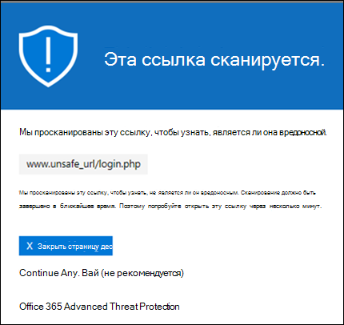
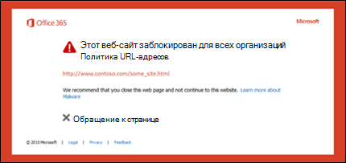

# Безопасные ссылки в Microsoft Defender для Office 365

[!INCLUDE [Microsoft 365 Defender rebranding](../includes/microsoft-defender-for-office.md)]

> [!IMPORTANT]
> Эта статья предназначена для бизнес-клиентов, использующих [Microsoft Defender для Office 365](office-365-atp.md). Если вы используете Outlook.com, Семейство Microsoft 365 или Microsoft 365 персональный и ищете сведения о безопасных ссылках в Outlook, см. дополнительные сведения [о Outlook.com безопасности.](https://support.microsoft.com/office/882d2243-eab9-4545-a58a-b36fee4a46e2)

Функция "Безопасные ссылки" — это функция в [Защитнике Office 365,](office-365-atp.md) которая обеспечивает сканирование URL-адресов и переописывание входящие сообщения электронной почты в потоке почты, а также проверку URL-адресов и ссылок в электронных сообщениях и других расположениях во время щелчка мышью. Сканирование безопасных ссылок происходит  в дополнение к обычной защите от нежелательной почты и вредоносных программ в входящие сообщения электронной почты в Exchange Online Protection (EOP). Сканирование безопасных ссылок помогает защитить организацию от вредоносных ссылок, используемых в фишинге и других атаках.

Защита безопасных ссылок доступна в следующих расположениях:

- **Сообщения электронной** почты: защита безопасных ссылок для ссылок в сообщениях электронной почты контролируется политиками безопасных ссылок. Политика безопасных ссылок по умолчанию не существует, поэтому для защиты безопасных ссылок в сообщениях электронной почты необходимо создать одну или несколько политик безопасных **ссылок.** Инструкции см. в [настройках политик безопасных ссылок в Microsoft Defender для Office 365.](set-up-atp-safe-links-policies.md)

  Дополнительные сведения о защите безопасных ссылок  для сообщений электронной почты см. в разделе "Параметры безопасных ссылок для сообщений электронной почты" далее в этой статье.

- **Microsoft Teams** (в настоящее время находится в предварительной версии TAP): защита безопасных ссылок для ссылок в беседах Teams, групповых чатах или каналах также контролируется политиками безопасных ссылок. Политика безопасных ссылок по умолчанию не существует, поэтому для защиты безопасных ссылок в Teams необходимо создать одну или несколько политик безопасных **ссылок.**

  Дополнительные сведения о защите безопасных ссылок в Teams см. в разделе "Параметры безопасных ссылок [для Microsoft Teams"](#safe-links-settings-for-microsoft-teams) далее в этой статье.

- **Приложения Office 365:** защита безопасных ссылок для приложений Office 365 доступна в поддерживаемых классических, мобильных и веб-aps. Защита **безопасных** ссылок для приложений Office 365 настраивается в глобальном параметре, который не **является** политикой безопасных ссылок. Инструкции см. в инструкциях по настройке глобальных параметров для параметров безопасных ссылок [в Microsoft Defender для Office 365.](configure-global-settings-for-safe-links.md)

  Однако защита безопасных ссылок для приложений  Office 365 применяется только к пользователям, включенным в активные политики безопасных ссылок. Если пользователь не включен в активную политику безопасных ссылок, он не получает защиту безопасных ссылок в поддерживаемых приложениях Office 365.

  Дополнительные сведения о защите безопасных ссылок в приложениях Office 365 см. в разделе "Параметры безопасных ссылок для приложений [Office 365"](#safe-links-settings-for-office-365-apps) далее в этой статье.

В этой статье подробно описаны следующие типы параметров безопасных ссылок:

- **Параметры в** политиках безопасных ссылок: эти параметры применяются только к пользователям, включенным в определенные политики, и параметры могут быть разными в разных политиках. К этим параметрам относятся:

  - [Параметры безопасных ссылок для сообщений электронной почты](#safe-links-settings-for-email-messages)
  - [Параметры безопасных ссылок для Microsoft Teams](#safe-links-settings-for-microsoft-teams)
  - [Списки "Не переописывать следующие URL-адреса" в политиках безопасных ссылок](#do-not-rewrite-the-following-urls-lists-in-safe-links-policies)

- **Глобальные параметры безопасных ссылок:** эти параметры настраиваются глобально, а не в политиках безопасных ссылок. Однако эти параметры применяются только к пользователям, включенным в активные политики безопасных ссылок. К этим параметрам относятся:

  - [Параметры безопасных ссылок для приложений Office 365](#safe-links-settings-for-office-365-apps)
  - [Список "Блокировать следующие URL-адреса" для безопасных ссылок](#block-the-following-urls-list-for-safe-links)

В следующей таблице описываются сценарии безопасных ссылок в организациях Microsoft 365 и Office 365, включающие Защитник для Office 365 (другими словами, отсутствие лицензирования никогда не является проблемой в примерах).

****

|Сценарий|Результат|
|---|---|
|Она является сотрудником отдела маркетинга. Защита безопасных ссылок для приложений Office 365 включена в глобальных параметрах безопасных ссылок, и существует политика безопасных ссылок, применяемая к сотрудникам маркетингового отдела. Она открывает презентацию PowerPoint в сообщении электронной почты, а затем щелкает URL-адрес презентации.|Она защищена с помощью безопасных ссылок. 
 Она включена в политику безопасных ссылок, а защита безопасных ссылок для приложений Office 365 включена. 
 Дополнительные сведения о требованиях к защите безопасных ссылок в приложениях Office 365 см. в разделе "Параметры безопасных ссылок для приложений [Office 365"](#safe-links-settings-for-office-365-apps) далее в этой статье.|
|В организации Microsoft 365 E5 Криса не настроены политики безопасных ссылок. Крис получает сообщение электронной почты от внешнего отправитель, которое содержит URL-адрес вредоносного веб-сайта, который он в конечном итоге щелкает.|Chris is not protected by Safe Links. 
 Администратор должен создать по крайней мере одну политику безопасных ссылок для всех, чтобы получить защиту безопасных ссылок во входящие сообщения электронной почты. Чтобы получить защиту безопасных ссылок, Крис должен быть включен в условия политики.|
|В организации Pat никакие администраторы не создали никаких политик безопасных ссылок, но защита безопасных ссылок для приложений Office 365 включена. Pat открывает документ Word и щелкает URL-адрес в файле.|Pat не защищена с помощью безопасных ссылок. 
 Хотя защита безопасных ссылок для приложений Office 365 включена глобально, Pat не включен ни в какие активные политики безопасных ссылок, поэтому защиту нельзя применить.|
|В организации Ли настроен в списке "Блокировать следующие URL-адреса" глобальных параметров `https://tailspintoys.com` для безопасных  ссылок. Политика безопасных ссылок, включаемая Ли, уже существует. Ли получает сообщение электронной почты с URL-адресом. `https://tailspintoys.com/aboutus/trythispage` Ли щелкает URL-адрес.|URL-адрес может быть автоматически заблокирован для Ли; это зависит от записи URL-адреса в списке и используемого почтового клиента Ли. Дополнительные сведения см. в разделе "Блокировка следующих [URL-адресов" раздела "Безопасные ссылки"](#block-the-following-urls-list-for-safe-links) далее в этой статье.|
|Юля и Юля работают contoso.com. Много времени назад администраторы настраивали политики безопасных ссылок, которые применяются к Юлии и Юлии. Он отправляет юлии сообщение электронной почты, не зная, что сообщение содержит вредоносный URL-адрес.|Юлия защищена с помощью безопасных **ссылок,** если применяемая к ней политика безопасных ссылок настроена для применения к сообщениям между внутренними получателями. Дополнительные сведения см. в разделе "Параметры безопасных [ссылок для](#safe-links-settings-for-email-messages) сообщений электронной почты" далее в этой статье.|

## Параметры безопасных ссылок для сообщений электронной почты

Безопасные ссылки сканируют входящие сообщения электронной почты на известные вредоносные гиперссылки. Сканированные URL-адреса переописываются с использованием стандартного префикса URL-адреса Майкрософт: `https://nam01.safelinks.protection.outlook.com` . После перезаписи ссылки она анализируется на потенциально вредоносное содержимое.

После перезаписи URL-адреса "Безопасные ссылки" URL-адрес остается переписанным, даже если сообщение переадрится или на которое будет ответ. Дополнительные ссылки, добавленные в переад/ответ на сообщение, не переописываются.

Параметры политик безопасных ссылок, которые применяются к электронным письмам, описаны в следующем списке:

- **Выберите действие для неизвестных потенциально вредоносных** URL-адресов в сообщениях: включает или отключает сканирование безопасных ссылок в сообщениях электронной почты. Рекомендуемое значение — **"В"**. Включение этого параметра приводит к следующим действиям.

  - Сканирование безопасных ссылок включено в Outlook (C2R) в Windows.
  - URL-адреса переописываются, и пользователи перенабовываются с помощью защиты безопасных ссылок при щелчке URL-адресов в сообщениях.
  - При щелчке URL-адреса проверяются на наличие списка известных вредоносных URL-адресов и списка ["Блокировать следующие URL-адреса".](#block-the-following-urls-list-for-safe-links)
  - URL-адреса, которые не имеют допустимой репутации, асинхронно детонацию в фоновом режиме.

- **Примените** сканирование URL-адресов в режиме реального времени для подозрительных ссылок и ссылок, которые указывают на файлы: включает сканирование ссылок в режиме реального времени, включая ссылки в сообщениях электронной почты, которые указывают на загружаемый контент. Рекомендуемое значение включено.

  - **Дождись завершения сканирования URL-адресов перед доставкой сообщения:**

    - Включено: сообщения, содержащие URL-адреса, удерживаются до завершения сканирования. Сообщения доставляются только после подтверждения безопасности URL-адресов. Это рекомендуемое значение.
    - Отключено: если проверка URL-адресов не может завершиться, доставка сообщения в любом случае.

- **Применение безопасных ссылок** к электронным письмам, отправленным в организации: включает или отключает сканирование безопасных ссылок на сообщения, отправляемые между внутренними и внутренними получателями в пределах одной организации Exchange Online. Рекомендуемое значение включено.

- **Не отслеживайте щелчки:** включает или отключает хранение данных "Безопасные ссылки" для URL-адресов, щелкающих в сообщениях электронной почты. Рекомендуется оставить этот параметр невыбранным (для отслеживания щелчков пользователем).

  Отслеживание щелчков URL-адресов для ссылок в сообщениях электронной почты, отправляемых между внутренними и внутренними получателями, в настоящее время не поддерживается.

- **Не разрешайте пользователям пережимать исходный** URL-адрес: разрешает или блокирует для пользователей возможность перейдите по странице предупреждения [к](#warning-pages-from-safe-links) исходному URL-адресу. Рекомендуемое значение включено.

- **Не переописывание следующих URL-адресов:** оставляет URL-адреса как есть. Сохраняет настраиваемый список безопасных URL-адресов, которые не требуют проверки. Этот список уникален для каждой политики безопасных ссылок. Дополнительные сведения о списке "Не переописывать следующие **URL-адреса"** см. в разделе "Не переописывать следующие URL-адреса" в разделе "Политики безопасных ссылок" далее в этой статье. 

Дополнительные сведения о рекомендуемых значениях для параметров политики "Стандартный" и "Строгий" для политик безопасных ссылок см. в параметрах [политики безопасных ссылок.](recommended-settings-for-eop-and-office365-atp.md#safe-links-policy-settings)

- **Фильтры получателей:** необходимо указать условия и исключения получателей, которые определяют, к кому применяется политика. Для условий и исключений можно использовать следующие свойства:

  - **Получатель**
  - **Домен получателя**.
  - **Получатель входит в группу**

  Условие или исключение можно использовать только один раз, но оно может содержать несколько значений. Указать несколько значений в одном условии или исключении можно с помощью оператора OR (например, _\<recipient1\>_ or _\<recipient2\>_). Между разными условиями и исключениями используется оператор AND (например, _\<recipient1\>_ and _\<member of group 1\>_).

- **Приоритет:** при создании нескольких политик можно указать порядок их применении. Никакие две политики не могут иметь одинаковый приоритет, и обработка политики прекращается после применения первой политики.

  Дополнительные сведения о приоритетах, а также оценке и применении нескольких политик см. в статье [Порядок и приоритет защиты электронной почты](how-policies-and-protections-are-combined.md).

### Как безопасные ссылки работают в сообщениях электронной почты

На высоком уровне вот как защита безопасных ссылок работает с URL-адресами в сообщениях электронной почты:

1. Вся электронная почта проходит через EOP, где перед доставкой сообщения в почтовый ящик получателя проходят фильтры протокола IP и конверта, защиты от вредоносных программ на основе сигнатур, защиты от нежелательной почты и вредоносных программ.

2. Пользователь открывает сообщение в своем почтовом ящике и щелкает URL-адрес сообщения.

3. Безопасные ссылки сразу же проверяют URL-адрес перед открытием веб-сайта:

   - Если URL-адрес включен  в список блокировки следующих URL-адресов, откроется [предупреждение о заблокированном URL-адресе.](#blocked-url-warning)

   - Если URL-адрес указывает на веб-сайт, который  был определен как вредоносный, откроется страница предупреждения вредоносного веб-сайта (или другая страница предупреждения).

   - Если URL-адрес указывает на загружаемый файл, а в политике, применяемой к пользователю, включена проверка **URL-адресов** в режиме реального времени на наличие подозрительных ссылок и ссылок, указывав на параметры файлов, в политике, применяемой к пользователю, загружаемый файл проверяется.

   - Если URL-адрес определен как безопасный, откроется веб-сайт.

## Параметры безопасных ссылок для Microsoft Teams

> [!IMPORTANT]
> С марта 2020 г. эта функция доступна в предварительной версии и доступна только участникам программы внедрения технологий Microsoft Teams (TAP). Сведения о расписании выпусков можно узнать в [плане развития Microsoft 365.](https://www.microsoft.com/microsoft-365/roadmap?rtc=1&filters=&searchterms=Safe%2CLinks%2CProtection%2Cfor%2CMicrosoft%2CTeams)

Вы включаете или отключать защиту безопасных ссылок для Microsoft Teams в политиках безопасных ссылок. В частности, вы используете действие "Выбрать действие для неизвестных или потенциально вредоносных **URL-адресов" в параметре Microsoft Teams.** Рекомендуемое значение — **"В"**.

Следующие параметры в политиках безопасных ссылок, которые применяются к ссылкам в сообщениях электронной почты, также применяются к ссылкам в Teams:

- **Применение сканирования URL-адресов в режиме реального времени для подозрительных ссылок и ссылок, которые указывают на файлы**
- **Не отслеживать щелчки пользователей**
- **Не разрешайте пользователям перенажимать исходный URL-адрес**

Эти параметры поясняется в предыдущем разделе параметров безопасных [ссылок для сообщений электронной почты.](#safe-links-settings-for-email-messages)

После того как вы включите защиту безопасных ссылок для Microsoft Teams, URL-адреса в Teams проверяются на наличие списка известных вредоносных ссылок, когда защищенный пользователь щелкает ссылку (защита при щелчке мышью). URL-адреса не переописываются. Если ссылка будет обнаружена как вредоносная, пользователи будут иметь следующие впечатления:

- Если ссылка была щелкнуть в беседе Teams, групповом чате или в каналах, страница предупреждения, как показано на снимке экрана ниже, будет отображаться в веб-браузере по умолчанию.
- Если щелкнуть ссылку со закрепленной вкладки, в интерфейсе Teams на этой вкладке появится страница предупреждения. Возможность открыть ссылку в веб-браузере отключена из соображений безопасности.
- В зависимости от  того, как настроен параметр "Не разрешайте пользователям пережимать исходный URL-адрес" в политике, пользователю будет или запрещено перенажимать исходный URL-адрес ( продолжить в любом случае **(не рекомендуется)** на снимке экрана). Рекомендуется включить параметр  "Не разрешайте пользователям перенажимать исходный URL-адрес", чтобы пользователи не могли перейдите к исходному URL-адресу.

Если пользователь, отправивший ссылку, не включен в политику безопасных ссылок, в которой включена защита Teams, пользователь может щелкнуть исходный URL-адрес на своем компьютере или устройстве.

Если нажать **кнопку "Назад"** на странице предупреждения, пользователь вернется к исходному контексту или URL-адресу. Однако при повторном нажатии на исходную ссылку url-адрес будет повторно засканен, поэтому страница предупреждения появится снова.

### Как безопасные ссылки работают в Teams

На высоком уровне вот как защита безопасных ссылок работает для URL-адресов в Microsoft Teams:

1. Пользователь запускает приложение Teams.

2. Microsoft 365 проверяет, включает ли организация пользователя Microsoft Defender для Office 365 и включен ли пользователь в активную политику безопасных ссылок, в которой включена защита Microsoft Teams.

3. URL-адреса проверяются во время нажатия на пользователя в чатах, групповых чатах, каналах и вкладок.

## Параметры безопасных ссылок для приложений Office 365

Защита безопасных ссылок для приложений Office 365 проверяет ссылки в документах Office, а не ссылки в сообщениях электронной почты (но она может проверять ссылки в вложенных документах Office в сообщениях электронной почты после открытия документа).

Защита безопасных ссылок для приложений Office 365 предъявляет следующие требования к клиенту:

- Приложения Microsoft 365 или Microsoft 365 бизнес премиум.
  - Текущие версии Word, Excel и PowerPoint для Windows, Mac или в веб-браузере.
  - Приложения Office на устройствах с iOS или Android.
  - Visio для Windows.
  - OneNote в веб-браузере.

- Приложения Office 365 настроены на использование современной проверки подлинности. Дополнительные сведения см. в сведениях о современной проверке подлинности для клиентских приложений [Office 2013, Office 2016 и Office 2019.](https://docs.microsoft.com/microsoft-365/enterprise/modern-auth-for-office-2013-and-2016)

- Пользователи вписались с помощью своих учетных записей на работе или в учебном зачете. Дополнительные сведения см. в [документе "Вход в Office".](https://support.microsoft.com/office/b9582171-fd1f-4284-9846-bdd72bb28426)

Защита безопасных ссылок для приложений Office 365 настраивается в глобальных параметрах для безопасных ссылок, а не в политиках безопасных ссылок. Но чтобы применить защиту безопасных ссылок для приложений Office 365, пользователь, открывавший документ Office и щелкнув ссылку, должен быть включен в активную политику безопасных ссылок.

Для приложений Office 365 доступны следующие параметры безопасных ссылок:

- **Приложения Office 365:** включает или отключает сканирование безопасных ссылок в поддерживаемых приложениях Office 365. Значение по умолчанию и рекомендуемое значение **— On**.

- **Не отслеживайте,** когда пользователи нажимают кнопку "Безопасные ссылки": включает или отключает хранение безопасных ссылок для URL-адресов, щелкающих в классических версиях Word, Excel, PowerPoint и Visio. Рекомендуемое значение — **"Вы отключено",** то есть щелчки пользователя отслеживаются.

- Не позволяйте пользователям пережимать безопасные ссылки на исходный **URL-адрес:** разрешает или блокирует для пользователей возможность щелкать страницу предупреждения по исходному URL-адресу в классических версиях Word, Excel, PowerPoint и Visio.  Значение по умолчанию и рекомендуемое значение **— On**.

Чтобы настроить параметры безопасных ссылок для приложений Office 365, см. "Настройка защиты безопасных ссылок для приложений [Office 365".](configure-global-settings-for-safe-links.md#configure-safe-links-protection-for-office-365-apps-in-the-security--compliance-center)

Дополнительные сведения о рекомендуемых значениях для параметров политики Standard и Strict см. в глобальных [параметрах для безопасных ссылок.](recommended-settings-for-eop-and-office365-atp.md#global-settings-for-safe-links)

### Как безопасные ссылки работают в приложениях Office 365

На высоком уровне вот как защита безопасных ссылок работает для URL-адресов в приложениях Office 365. Поддерживаемые приложения Office 365 описаны в предыдущем разделе.

1. Пользователь входит в организацию, включаю в себя приложения Microsoft 365 или Microsoft 365 бизнес премиум, используя свою работу или учетную запись учебного заведения.

2. Пользователь открывает и щелкает ссылку на документ Office в поддерживаемом приложении Office.

3. Безопасные ссылки немедленно проверяют URL-адрес перед открытием целевого веб-сайта:

   - Если URL-адрес включен в список, пропускающий сканирование  безопасных ссылок (список блокирования следующих URL-адресов), откроется страница предупреждения [о заблокированных](#blocked-url-warning) URL-адресах.

   - Если URL-адрес указывает на веб-сайт, который  был определен как вредоносный, откроется страница предупреждения вредоносного веб-сайта (или другая страница предупреждения).

   - Если **URL-адрес** указывает на загружаемый файл, а политика безопасных ссылок, применяемая к пользователю, настроена для проверки ссылок на загружаемый контент (примените сканирование URL-адресов в режиме реального времени для подозрительных ссылок и ссылок, которые указывают на файлы), загружаемый файл проверяется.

   - Если URL-адрес считается безопасным, пользователь перенанося на веб-сайт.

   - Если проверка безопасных ссылок не завершена, защита безопасных ссылок не активирована. В классических клиентах Office пользователь будет предупрежден перед тем, как перейти на веб-сайт назначения.

> [!NOTE]
> В начале каждого сеанса может потребоваться несколько секунд, чтобы убедиться, что для пользователя включены безопасные ссылки для Office.

## Список "Блокировать следующие URL-адреса" для безопасных ссылок

В **списке "Блокировать следующие** URL-адреса" определяются ссылки, которые всегда блокируются при сканировании безопасных ссылок в следующих расположениях:

- Сообщения электронной почты.
- Документы в приложениях Office 365 в Windows и Mac.
- Документы в Office для iOS и Android.

Когда пользователь в активной политике безопасных ссылок щелкает заблокированную ссылку в поддерживаемом приложении, он перенажимается на страницу предупреждения о [заблокированных URL-адресах.](#blocked-url-warning)

Список URL-адресов настраивается в глобальных параметрах для безопасных ссылок. Инструкции см. в [подстройке "Блокировка следующих URL-адресов".](configure-global-settings-for-safe-links.md#configure-the-block-the-following-urls-list-in-the-security--compliance-center)

**Примечания**:

- Полный список URL-адресов, заблокированных везде, см. в списке "Управление [URL-адресами"](tenant-allow-block-list.md)в списке "Разрешить/заблокировать клиента".

- Ограничения:
  - Максимальное число записей — 500.
  - Максимальная длина записи — 128 символов.
  - Все записи не могут превышать 10 000 символов.

- Не включайте косую черту `/` () в конце URL-адреса. Например, используйте `https://www.contoso.com` , а не `https://www.contoso.com/` .

- URL-адрес только для домена (например, или) блокирует `contoso.com` `tailspintoys.com` любой URL-адрес, содержащий домен.

- Можно заблокировать поддомен, не блокируя полный домен. Например, блокирует любой URL-адрес, содержащий поддомен, но не блокирует URL-адреса, содержащие `toys.contoso.com*` полный `contoso.com` домен.

- Для каждого URL-адреса можно включить до трех поддиаными знаками ( `*` ).

### Синтаксис записи для списка "Блокировать следующие URL-адреса"

Примеры значений, которые можно ввести, и их результаты описаны в следующей таблице:

****

|Значение|Результат|
|---|---|
|`contoso.com` 
 или 
 `*contoso.com*`|Блокирует домен, поддомены и пути. Например, `https://www.contoso.com` , `https://sub.contoso.com` и `https://contoso.com/abc` заблокированы.|
|`https://contoso.com/a`|`https://contoso.com/a`Блоки, но не дополнительные подпазки, такие как `https://contoso.com/a/b` .|
|`https://contoso.com/a*`|Блоки `https://contoso.com/a` и дополнительные подpaths, такие как `https://contoso.com/a/b` .|
|`https://toys.contoso.com*`|Блокирует поддомен (в этом примере), но разрешает щелчки по другим URL-адресам `toys` домена `https://contoso.com` (например, или `https://home.contoso.com` ).|
|

## Списки "Не переописывать следующие URL-адреса" в политиках безопасных ссылок

> [!NOTE]
> Если в организации используются политики  безопасных ссылок, единственным поддерживаемым методом проверки сторонних фишинговых сообщений является "Не переописывать следующие списки URL-адресов".

Каждая политика безопасных  ссылок содержит список "Не перезаписывать следующий список URL-адресов", который можно использовать для указания URL-адресов, которые не перезаписываются при сканировании безопасных ссылок. Другими словами, список позволяет пользователям, включенным в политику, получать доступ к указанным URL-адресам, которые в противном случае были бы заблокированы с помощью безопасных ссылок. Можно настроить разные списки в различных политиках безопасных ссылок. Обработка политик останавливается после того, как к пользователю применяется первая (скорее всего, с наивысшим приоритетом) политика. Таким образом,  к пользователю, включенного в несколько активных политик безопасных ссылок, применяется только один список "Не переописывать следующий список URL-адресов".

Чтобы добавить записи в список в новых или  существующих политиках безопасных ссылок, см. статьи "Создание политик безопасных ссылок" или "Изменение политик [безопасных ссылок".](set-up-atp-safe-links-policies.md#use-the-security--compliance-center-to-modify-safe-links-policies)

**Примечания**:

- Следующие клиенты не распознают список "Не **переописывать** следующие URL-адреса" в политиках безопасных ссылок. Пользователям, включенным в эти службы, может быть заблокирован доступ к URL-адресам на основе результатов сканирования безопасных ссылок в этих клиентах:

  - Microsoft Teams
  - Веб-приложения Office

  Полный список URL-адресов, разрешенных везде, см. в списке "Управление URL-адресами в списке разрешенных [и заблокированных клиентов".](tenant-allow-block-list.md)

- Рассмотрите возможность добавления часто используемых внутренних URL-адресов в список для улучшения пользовательского интерфейса. Например, если у вас есть локальное обслуживание, например Skype для бизнеса или SharePoint, вы можете добавить эти URL-адреса, чтобы исключить их из сканирования.

- Если в  политиках безопасных ссылок не были переописывать следующие записи URL-адресов, обязательно просмотрите списки и добавьте поддиапные знаки. Например, в вашем списке есть запись "нравится", и вы позже решите включить `https://contoso.com/a` такие подpaths, как `https://contoso.com/a/b` . Вместо добавления новой записи добавьте к существующей записи подстройки, чтобы она стала `https://contoso.com/a/*` .

- Для каждого URL-адреса можно включить до трех поддиаными знаками ( `*` ). Поддиапазоны явно включают префиксы или поддомены. Например, запись не то же самое, что , так как позволяет пользователям посетить поддомены и пути в `contoso.com` `*.contoso.com/*` `*.contoso.com/*` указанном домене.

### Синтаксис записи для списка "Не переописывать следующие URL-адреса"

Примеры значений, которые можно ввести, и их результаты описаны в следующей таблице:

****

|Значение|Результат|
|---|---|
|`contoso.com`|Разрешает доступ к поддоменам или `https://contoso.com` путям, но не к ним.|
|`*.contoso.com/*`|Разрешает доступ к домену, поддоменам и путям (например, `https://www.contoso.com` `https://www.contoso.com` , , или `https://maps.contoso.com` `https://www.contoso.com/a` ). 
 Эта запись по сути лучше, чем , так как она не разрешает потенциально `*contoso.com*` мошеннические сайты, например `https://www.falsecontoso.com` или `https://www.false.contoso.completelyfalse.com`|
|`https://contoso.com/a`|Разрешает доступ к `https://contoso.com/a` подстраховке, но не к ним `https://contoso.com/a/b`|
|`https://contoso.com/a/*`|Разрешает доступ к `https://contoso.com/a` подстраховке и такие подпазки, как `https://contoso.com/a/b`|
|

## Страницы предупреждений из безопасных ссылок

В этом разделе представлены примеры различных страниц предупреждений, запускающихся защитой безопасных ссылок при щелчке URL-адреса.

Обратите внимание, что было обновлено несколько страниц предупреждений. Если обновленные страницы еще не отсвеялись, скоро. Обновленные страницы включают новую цветовую схему, более подробные и возможность перейти на сайт несмотря на заданное предупреждение и рекомендации.

### Уведомление о проверке в ходе выполнения

Url-адрес по щелчку проверяется с помощью безопасных ссылок. Прежде чем переходить по ссылке, может потребоваться подождать несколько секунд.

Исходная страница уведомления выглядела так:

### Предупреждение о подозрительном сообщении

В сообщении электронной почты был указан URL-адрес, похожий на другие подозрительные сообщения. Рекомендуется еще раз проверить сообщение электронной почты перед тем, как ться на сайт.

### Предупреждение о попытке фишинга

Url-адрес, нажав его, был указан в сообщении электронной почты, которое было определено как фишинговая атака. В результате все URL-адреса в сообщении электронной почты блокируются. Не рекомендуется перенаступить к сайту.

### Предупреждение о вредоносном веб-сайте

Щелчок URL-адреса указывает на сайт, который был определен как вредоносный. Не рекомендуется перенаступить к сайту.

Исходная страница предупреждения выглядела так:

### Предупреждение о заблокированном URL-адресе

Щелчок URL-адрес был вручную заблокирован администратором вашей  организации (список заблокированных URL-адресов в глобальных параметрах для безопасных ссылок). Ссылка не была просканирована с помощью безопасных ссылок, так как она была заблокирована вручную.

Существует несколько причин, по которым администратор вручную блокирует определенные URL-адреса. Если вы считаете, что сайт не следует блокировать, обратитесь к администратору.

Исходная страница предупреждения выглядела так:

### Предупреждение об ошибке

Произошла какая-то ошибка, и URL-адрес не может быть открыт.

Исходная страница предупреждения выглядела так:

