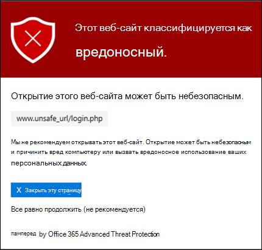

# Безопасные ссылки в Office 365 ATPSafe Links in Office 365 ATP

[!INCLUDE [Microsoft 365 Defender rebranding](../includes/microsoft-defender-for-office.md)]

> [!IMPORTANT]
> Эта статья предназначена для компаний-клиентов, у которых есть [Office 365 Advanced Threat protection (ATP)](office-365-atp.md).This article is intended for business customers who have [Office 365 Advanced Threat Protection (ATP)](office-365-atp.md). Если вы используете Outlook.com, семейство Microsoft 365 или Microsoft 365 персональный, а вы ищете сведения о Сафелинкс в Outlook, ознакомьтесь со статьей [Advanced Outlook.com Security](https://support.microsoft.com/office/882d2243-eab9-4545-a58a-b36fee4a46e2).If you're using Outlook.com, Microsoft 365 Family, or Microsoft 365 Personal, and you're looking for information about Safelinks in Outlook, see [Advanced Outlook.com security](https://support.microsoft.com/office/882d2243-eab9-4545-a58a-b36fee4a46e2).

Безопасные ссылки это функция в [Office 365 Advanced Threat protection](office-365-atp.md) , которая обеспечивает сканирование и перезапись входящих сообщений электронной почты в канале обработки почты, а также время на проверку URL-адресов и ссылок в сообщениях электронной почты и других расположениях.Safe Links is a feature in [Office 365 Advanced Threat Protection](office-365-atp.md) that provides URL scanning and rewriting of inbound email messages in mail flow, and time-of-click verification of URLs and links in email messages and other locations. Проверка безопасных ссылок выполняется в дополнение к обычной [защите от нежелательной почты и вредоносных программ](anti-spam-and-anti-malware-protection.md) в входящих сообщениях электронной почты в Exchange Online Protection (EOP).Safe Links scanning occurs in addition to the regular [anti-spam and anti-malware protection](anti-spam-and-anti-malware-protection.md) in inbound email messages in Exchange Online Protection (EOP). Сканирование безопасных ссылок помогает защитить организацию от вредоносных ссылок, используемых в фишинге и других атаках.Safe Links scanning can help protect your organization from malicious links that are used in phishing and other attacks.

Защита с помощью безопасных ссылок доступна в следующих расположениях:Safe Links protection is available in the following locations:

- **Сообщения электронной почты**: защита ссылок в сообщениях электронной почты управляется политиками безопасных ссылок.**Email messages**: Safe Links protection for links in email messages is controlled by Safe Links policies. Политика безопасных ссылок по умолчанию отсутствует, **поэтому для обеспечения защиты безопасных ссылок в сообщениях электронной почты необходимо создать одну или несколько политик безопасных ссылок**.There is no default Safe Links policy, **so to get the protection of Safe Links in email messages, you need to create one or more Safe Links policies**. Инструкции см в разделе [Настройка политик безопасных ссылок в ATP](set-up-atp-safe-links-policies.md).For instructions, see [Set up Safe Links policies in ATP](set-up-atp-safe-links-policies.md).

  Дополнительные сведения о защите защищенных ссылок для сообщений электронной почты можно найти в разделе [Параметры безопасных ссылок для сообщений электронной почты](#safe-links-settings-for-email-messages) далее в этой статье.For more information about Safe Links protection for email messages, see the [Safe Links settings for email messages](#safe-links-settings-for-email-messages) section later in this article.

- **Microsoft Teams** (в настоящее время в режиме предварительного просмотра): защита ссылок в беседах Teams, групповых беседах и каналах также контролируется политиками безопасных ссылок.**Microsoft Teams** (currently in TAP Preview): Safe Links protection for links in Teams conversations, group chats, or from channels is also controlled by Safe Links policies. Политика безопасных ссылок по умолчанию отсутствует, **поэтому для обеспечения защиты безопасных ссылок в Teams необходимо создать одну или несколько политик безопасных ссылок**.There is no default Safe Links policy, **so to get the protection of Safe Links in Teams, you need to create one or more Safe Links policies**.

  Дополнительные сведения о защите ссылок в Teams можно найти в разделе [Параметры безопасных ссылок для Microsoft Teams](#safe-links-settings-for-microsoft-teams) далее в этом разделе.For more information about Safe Links protection in Teams, see the [Safe Links settings for Microsoft Teams](#safe-links-settings-for-microsoft-teams) section later in this topic.

- **Приложения office 365**: защита безопасных ссылок для приложений Office 365 доступна для настольных систем, мобильных устройств и веб-точек доступа.**Office 365 apps**: Safe Links protection for Office 365 apps is available in supported desktop, mobile, and web aps. Вы **настраиваете** защиту безопасных ссылок для приложений Office 365 в глобальном параметре, который находится **вне** политик безопасных ссылок.You **configure** Safe Links protection for Office 365 apps in the global setting that are **outside** of Safe Links policies. Инструкции: [Настройка глобальных параметров для параметров безопасных ссылок в Office 365 ATP](configure-global-settings-for-safe-links.md).For instructions, see [Configure global settings for Safe Links settings in Office 365 ATP](configure-global-settings-for-safe-links.md).

  Но защита безопасных ссылок для приложений Office 365 **применяется** только к пользователям, включенным в активные политики безопасных ссылок.But, Safe Links protection for Office 365 apps is only **applied** to users who are included in active Safe Links policies. Если пользователь не включен в активную политику безопасных ссылок, пользователь не будет защищенных ссылок в поддерживаемых приложениях Office 365.If a user isn't included in an active Safe Links policy, the user doesn't get Safe Links protection in supported Office 365 apps.

  Дополнительные сведения о защите безопасных ссылок в приложениях Office 365 можно найти в разделе [Параметры безопасных ссылок для приложений office 365](#safe-links-settings-for-office-365-apps) далее в этой статье.For more information about Safe Links protection in Office 365 apps, see the [Safe Links settings for Office 365 apps](#safe-links-settings-for-office-365-apps) section later in this article.

В этой статье приведены подробные описания следующих типов параметров безопасных ссылок:This article includes detailed descriptions of the following types of Safe Links settings:

- **Параметры в политиках безопасных ссылок**: эти параметры применяются только к пользователям, включенным в конкретные политики, а параметры могут различаться в разных политиках.**Settings in Safe Links policies**: These settings apply only to the users who are included in the specific policies, and the settings might be different between policies. К этим параметрам относятся:These settings include:

  - [Параметры безопасных ссылок для сообщений электронной почтыSafe Links settings for email messages](#safe-links-settings-for-email-messages)
  - [Параметры безопасных ссылок для Microsoft TeamsSafe Links settings for Microsoft Teams](#safe-links-settings-for-microsoft-teams)
  - ["Не переопределять следующие списки URL-адресов" в политиках безопасных ссылок"Do not rewrite the following URLs" lists in Safe Links policies](#do-not-rewrite-the-following-urls-lists-in-safe-links-policies)

- **Глобальные параметры безопасных ссылок**: эти параметры настроены глобально, а не в политиках безопасных ссылок.**Global Safe Links settings**: These settings are configured globally, not in Safe Links policies. Однако параметры применяются только для пользователей, включенных в активные политики безопасных ссылок.But, the settings apply only to users who are included in active Safe Links policies. К этим параметрам относятся:These settings include:

  - [Параметры безопасных ссылок для приложений Office 365Safe Links settings for Office 365 apps](#safe-links-settings-for-office-365-apps)
  - [Список "блокировать следующие URL-адреса" для безопасных ссылок"Block the following URLs" list for Safe Links](#block-the-following-urls-list-for-safe-links)

В следующей таблице описаны сценарии для безопасных ссылок в организациях Microsoft 365 и Office 365, включающих ATP (другими словами, отсутствие лицензирования не является вопросом в примерах).The following table describes scenarios for Safe Links in Microsoft 365 and Office 365 organizations that include ATP (in other words, lack of licensing is never an issue in the examples).

****

|СценарийScenario|РезультатResult|
|---|---|
|Жан является участником маркетингового отдела.Jean is a member of the marketing department. Защита безопасных ссылок для приложений Office 365 включена в глобальных параметрах для безопасных ссылок, а политика безопасных ссылок, которая применяется к участникам маркетингового отдела, существует.Safe Links protection for Office 365 apps is turned on in the global settings for Safe Links, and a Safe Links policy that applies to members of the marketing department exists. Жан открывает презентацию PowerPoint в сообщении электронной почты, а затем щелкает URL-адрес в презентации.Jean opens a PowerPoint presentation in an email message, and then clicks a URL in the presentation.|Жан защищается с помощью безопасных ссылок.Jean is protected by Safe Links.    Жан включен в политику безопасных ссылок и включена защита безопасных ссылок для приложений Office 365.Jean is included in a Safe Links policy, and Safe Links protection for Office 365 apps is turned on.    Дополнительные сведения о требованиях для защиты безопасных ссылок в приложениях Office 365 можно найти в разделе [Параметры безопасных ссылок для приложений office 365](#safe-links-settings-for-office-365-apps) далее в этой статье.For more information about the requirements for Safe Links protection in Office 365 apps, see the [Safe Links settings for Office 365 apps](#safe-links-settings-for-office-365-apps) section later in this article.|
|В Microsoft 365 в компании Крис не настроены политики безопасных ссылок.Chris's Microsoft 365 E5 organization has no Safe Links policies configured. Крис получает электронное письмо от внешнего отправителя, который содержит URL-адрес вредоносного веб-сайта, который в конечном итоге щелкает.Chris receives an email from an external sender that contains a URL to a malicious website that he ultimately clicks.|Крис не защищается с помощью безопасных ссылок.Chris is not protected by Safe Links.    Администратор должен создать по крайней мере одну политику безопасных ссылок для всех пользователей, чтобы обеспечить защиту ссылок в входящих сообщениях электронной почты.An admin must create at least one Safe Links policy for anyone to get Safe Links protection in inbound email messages. Крис должен быть включен в условия политики, чтобы обеспечить защиту с помощью безопасных ссылок.Chris must be included in the conditions of policy to get Safe Links protection.|
|В Организации Pat никакие администраторы не создали политики безопасных ссылок, но для приложений Office 365 включено безопасное связывание.In Pat's organization, no admins have created any Safe Links policies, but Safe Links protection for Office 365 apps is turned on. Pat открывает документ Word и щелкает URL-адрес в файле.Pat opens a Word document and clicks a URL in the file.|Pat не защищены с помощью безопасных ссылок.Pat is not protected by Safe Links.    Несмотря на то, что защита безопасных ссылок для приложений Office 365 включена глобально, не включаются в активные политики безопасных ссылок, поэтому защита не может быть применена.Although Safe Links protection for Office 365 apps is turned on globally, Pat is not included in any active Safe Links policies, so the protection can't be applied.|
|В Организации Иванов `https://tailspintoys.com` настраивается в списке **блокировать следующие URL-адреса** в глобальных параметрах для безопасных ссылок.In Lee's organization, `https://tailspintoys.com` is configured in the **Block the following URLs** list in the global settings for Safe Links. Политика безопасных ссылок, включающая себя, уже существует.A Safe Links policy that includes Lee already exists. Иванов получает сообщение электронной почты, содержащее URL-адрес `https://tailspintoys.com/aboutus/trythispage` .Lee receives an email message that contains the URL `https://tailspintoys.com/aboutus/trythispage`. "Иванов" выбирает URL-адрес.Lee clicks the URL.|URL-адрес может автоматически блокироваться для Ивановых; Это зависит от записи URL-адреса в списке и использованного почтового клиента.The URL might be automatically blocked for Lee; it depends on the URL entry in the list and the email client Lee used. Более подробную информацию можно найти в разделе ["Блокировка следующих URL-адресов" списка для безопасных ссылок](#block-the-following-urls-list-for-safe-links) далее в этом разделе.For more information, see the ["Block the following URLs" list for Safe Links](#block-the-following-urls-list-for-safe-links) section later in this topic.|
|Ольга и Жулиа работают для contoso.com.Jamie and Julia both work for contoso.com. Большое время назад администраторы настроили политики безопасных ссылок, которые применяются к обоим ресурсам и Жулиа.A long time ago, admins configured Safe Links policies that apply to both of Jamie and Julia. Ольга отправляет сообщение электронной почты в Жулиа, не зная, что сообщение содержит вредоносный URL-адрес.Jamie sends an email to Julia, not knowing that the email contains a malicious URL.|Жулиа защищается безопасными связями, **Если** политика безопасных ссылок, которая применяется к ней, настроена для применения к сообщениям между внутренними получателями.Julia is protected by Safe Links **if** the Safe Links policy that applies to her is configured to apply to messages between internal recipients. Дополнительные сведения можно найти в разделе [Параметры безопасных ссылок для сообщений электронной почты](#safe-links-settings-for-email-messages) далее в этом разделе.For more information, see the [Safe Links settings for email messages](#safe-links-settings-for-email-messages) section later in this topic.|

## Параметры безопасных ссылок для сообщений электронной почтыSafe Links settings for email messages

Функция "безопасные ссылки" сканирует входящую электронную почту для известных вредоносных гиперссылок.Safe Links scans incoming email for known malicious hyperlinks. Проверенные URL-адреса перезаписываются с помощью стандартного префикса URL-адреса Майкрософт: `https://nam01.safelinks.protection.outlook.com` .Scanned URLs are rewritten using the Microsoft standard URL prefix: `https://nam01.safelinks.protection.outlook.com`. После перезаписи ссылки она анализируется на наличие потенциально вредоносного контента.After the link is rewritten, it's analyzed for potentially malicious content.

После того как безопасные ссылки переопределяют URL-адрес, URL-адрес остается переписанным, даже если сообщение переадресовано или ответило.After Safe Links rewrites a URL, the URL remains rewritten, even if the message is forwarded or replied to. Дополнительные ссылки, добавляемые к сообщению переадресованные или Отвеченные, не переписываются.Additional links that are added to the forwarded or replied to message are not rewritten.

Параметры политик безопасных ссылок, применимые к сообщениям электронной почты, описаны в приведенном ниже списке.The settings in Safe Links policies that apply to email messages are described in the following list:

- **Выберите действие для неизвестных потенциально вредоносных URL-адресов в сообщениях**: включает или отключает сканирование безопасных ссылок в сообщениях электронной почты.**Select the action for unknown potentially malicious URLs in messages**: Enables or disables Safe Links scanning in email messages. Рекомендуемое значение — **On**.The recommended value is **On**. Включение этого параметра приводит к следующим действиям.Turning on this setting results in the following actions.

  - Сканирование безопасных ссылок включено в Outlook (C2R) в Windows.Safe Links scanning is enabled in Outlook (C2R) on Windows.
  - URL-адреса переопределяются, и пользователи направляются через безопасную связь при нажатии на URL-адреса в сообщениях.URLs are rewritten and users are routed through Safe Links protection when they click URLs in messages.
  - При нажатии URL-адреса проверяются на соответствие списку известных вредоносных URL-адресов и [списку "блокировать следующие URL-адреса"](#block-the-following-urls-list-for-safe-links).When clicked, URLs are checked against a list of known malicious URLs and the ["Block the following URLs" list](#block-the-following-urls-list-for-safe-links).
  - URL-адреса, у которых нет действующей репутации, обезврежено асинхронно в фоновом режиме.URLs that don't have a valid reputation are detonated asynchronously in the background.

- **Применить сканирование URL-адресов в режиме реального времени для подозрительных ссылок и ссылок, указывающих на файлы**: включает сканирование ссылок в режиме реального времени, включая ссылки в сообщениях электронной почты, указывающие на загружаемый контент.**Apply real-time URL scanning for suspicious links and links that point to files**: Enables real-time scanning of links, including links in email messages that point to downloadable content. Рекомендуемое значение — Enabled.The recommended value is enabled.

  - **Перед доставкой сообщения дождитесь завершения сканирования URL-адресов**:**Wait for URL scanning to complete before delivering the message**:

    - Enabled: сообщения, содержащие URL-адреса, удерживаются до завершения сканирования.Enabled: Messages that contain URLs are held until scanning is finished. Сообщения доставляются только после подтверждения безопасности URL-адресов.Messages are delivered only after the URLs are confirmed to be safe. Это рекомендуемое значение.This is the recommended value.
    - Disabled: Если сканирование URL-адресов не удается завершить, доставить сообщение все равно.Disabled: If URL scanning can't complete, deliver the message anyway.

- **Применяйте безопасные ссылки к сообщениям электронной почты, отправленным в Организации**: включает или выключает сканирование безопасных ссылок для сообщений, отправляемых между внутренними отправителями и внутренними получателями в той же организации Exchange Online.**Apply Safe Links to email messages sent within the organization**: Enables or disables Safe Links scanning on messages sent between internal senders and internal recipients within the same Exchange Online organization. Рекомендуемое значение — Enabled.The recommended value is enabled.

- **Не Отслеживайте щелчков пользователя**: Включение или отключение сохранения безопасных ссылок. Щелкните данные для URL-адресов, которые вы щелкнули в сообщениях электронной почты.**Do not track user clicks**: Enables or disables storing Safe Links click data for URLs clicked in email messages. Рекомендуемое значение оставить этот параметр невыбранным (для отслеживания нажатий клавиш пользователем).The recommend value is to leave this setting unselected (to track user clicks).

  URL-адрес щелкните Отслеживание ссылок в сообщениях электронной почты, отправляемых между внутренними отправителями и внутренними получателями, в настоящее время не поддерживается.URL click tracking for links in email messages sent between internal senders and internal recipients is currently not supported.

- **Не разрешать пользователям щелкать по исходному URL-адресу**: разрешает или запрещает пользователям щелкать через [страницу предупреждения](#warning-pages-from-safe-links) по исходному URL-адресу.**Do not allow users to click through to original URL**: Allows or blocks users from clicking through the [warning page](#warning-pages-from-safe-links) to the original URL. Рекомендуемое значение — Enabled.The recommend value is enabled.

- **Не перезаписывайте следующие URL-адреса**: оставляет URL-адреса как есть.**Do not rewrite the following URLs**: Leaves URLs as they are. Сохраняет настраиваемый список безопасных URL-адресов, для которых не требуется сканирование.Keeps a custom list of safe URLs that don't need scanning. Список уникален для каждой политики безопасных ссылок.The list is unique for each Safe Links policy. Для получения дополнительных сведений о **перезаписи следующего списка URL-адресов** обратитесь к разделу ["не переопределять следующие URL-адреса" в разделе политики безопасных ссылок](#do-not-rewrite-the-following-urls-lists-in-safe-links-policies) далее в этой статье.For more information about the **Do not rewrite the following URLs** list, see the ["Do not rewrite the following URLs" lists in Safe Links policies](#do-not-rewrite-the-following-urls-lists-in-safe-links-policies) section later in this article.

Дополнительные сведения о рекомендуемых значениях для стандартных политик и политик строгого доступа для политик безопасных ссылок приведены в разделе [Параметры политики безопасных ссылок](recommended-settings-for-eop-and-office365-atp.md#safe-links-policy-settings).For more information about the recommended values for Standard and Strict policy settings for Safe Links policies, see [Safe Links policy settings](recommended-settings-for-eop-and-office365-atp.md#safe-links-policy-settings).

- **Фильтры получателей**: необходимо указать условия получателей и исключения, которые определяют, к кому применяется политика.**Recipient filters**: You need to specify the recipient conditions and exceptions that determine who the policy applies to. Для условий и исключений можно использовать следующие свойства:You can use these properties for conditions and exceptions:

  - **Получатель****The recipient is**
  - **Домен получателя**.**The recipient domain is**
  - **Получатель входит в группу****The recipient is a member of**

  Условие или исключение можно использовать только один раз, но оно может содержать несколько значений.You can only use a condition or exception once, but the condition or exception can contain multiple values. Указать несколько значений в одном условии или исключении можно с помощью оператора OR (например, _\<recipient1\>_ or _\<recipient2\>_).Multiple values of the same condition or exception use OR logic (for example, _\<recipient1\>_ or _\<recipient2\>_). Между разными условиями и исключениями используется оператор AND (например, _\<recipient1\>_ and _\<member of group 1\>_).Different conditions or exceptions use AND logic (for example, _\<recipient1\>_ and _\<member of group 1\>_).

- **Priority**: Если вы создаете несколько политик, вы можете указать порядок их применения.**Priority**: If you create multiple policies, you can specify the order that they're applied. Никакие две политики не могут иметь одинаковый приоритет, и обработка политики прекращается после применения первой политики.No two policies can have the same priority, and policy processing stops after the first policy is applied.

  Дополнительные сведения о приоритетах, а также оценке и применении нескольких политик см. в статье [Порядок и приоритет защиты электронной почты](how-policies-and-protections-are-combined.md).For more information about the order of precedence and how multiple policies are evaluated and applied, see [Order and precedence of email protection](how-policies-and-protections-are-combined.md).

### Как безопасные ссылки работают в сообщениях электронной почтыHow Safe Links works in email messages

На высоком уровне ниже показано, как защита безопасных ссылок работает с URL-адресами в сообщениях электронной почты.At a high level, here's how Safe Links protection works on URLs in email messages:

1. Все сообщения электронной почты проходят через EOP, где IP-фильтры и фильтры конвертов, защита от вредоносных программ на основе подписей, фильтры защиты от нежелательной почты и защиты от вредоносных программ перед доставкой сообщения в почтовый ящик получателя.All email goes through EOP, where internet protocol (IP) and envelope filters, signature-based malware protection, anti-spam and anti-malware filters before the message is delivered to the recipient's mailbox.

2. Пользователь открывает сообщение в своем почтовом ящике и щелкает URL-адрес в сообщении.The user opens the message in their mailbox and clicks on a URL in the message.

3. Безопасные ссылки сразу проверяют URL-адрес перед открытием веб-сайта:Safe Links immediately checks the URL before opening the website:

   - Если URL-адрес включен в список **блокирования следующих URL-адресов** , откроется [предупреждение о блокированном URL-адресе](#blocked-url-warning) .If the URL is included in the **Block the following URLs** list, a [blocked URL warning](#blocked-url-warning) opens.

   - Если URL-адрес указывает на веб-сайт, который определен как вредоносный, откроется страница [предупреждения о вредоносном веб-сайте](#malicious-website-warning) (или на другой странице предупреждения).If the URL points to a website that has been determined to be malicious, a [malicious website warning](#malicious-website-warning) page (or a different warning page) opens.

   - Если URL-адрес указывает на загружаемый файл, а параметр **Применить сканирование URL-адресов в режиме реального времени для подозрительных ссылок и ссылок, которые указывают на** параметр "файлы" включен в политике, применяемой к пользователю, то проверяется загружаемый файл.If the URL points to a downloadable file, and the **Apply real-time URL scanning for suspicious links and links that point to files** setting is enabled in the policy that applies to the user, the downloadable file is checked.

   - Если URL-адрес определен как безопасный, откроется веб-сайт.If the URL is determined to be safe, the website opens.

## Параметры безопасных ссылок для Microsoft TeamsSafe Links settings for Microsoft Teams

> [!IMPORTANT]
> В марте 2020 эта функция доступна только для участников программы внедрения технологий Microsoft Teams (TAP).As of March 2020, this feature is in Preview and is available only to members of the Microsoft Teams Technology Adoption Program (TAP). За сведениями о расписании выпуска, ознакомьтесь с [планом Microsoft 365](https://www.microsoft.com/microsoft-365/roadmap?rtc=1&filters=&searchterms=Safe%2CLinks%2CProtection%2Cfor%2CMicrosoft%2CTeams).For information about the release schedule, check out the [Microsoft 365 roadmap](https://www.microsoft.com/microsoft-365/roadmap?rtc=1&filters=&searchterms=Safe%2CLinks%2CProtection%2Cfor%2CMicrosoft%2CTeams).

Вы включаете или отключаете защиту безопасных ссылок для Microsoft Teams в политиках безопасных ссылок.You enable or disable Safe Links protection for Microsoft Teams in Safe Links policies. В частности, вы используете параметр **выбрать действие для неизвестных или потенциально вредоносных URL-адресов в Microsoft Teams** .Specifically, you use the **Select the action for unknown or potentially malicious URLs within Microsoft Teams** setting. Рекомендуемое значение — **On**.The recommended value is **On**.

Следующие параметры в политиках безопасных ссылок, применяемых к ссылкам в сообщениях электронной почты, также применяются к ссылкам в Microsoft teams:The following settings in Safe Links policies that apply to links in email messages also apply to links in Teams:

- **Применение сканирования URL-адресов в режиме реального времени для подозрительных ссылок и ссылок, указывающих на файлы****Apply real-time URL scanning for suspicious links and links that point to files**
- **Не отслеживать нажатия пользователем****Do not track user clicks**
- **Не разрешать пользователям щелкать по исходному URL-адресу****Do not allow users to click through to original URL**

Эти параметры описаны в разделе предыдущие [Параметры безопасных ссылок для сообщений электронной почты](#safe-links-settings-for-email-messages) .These settings are explained in the previous [Safe Links settings for email messages](#safe-links-settings-for-email-messages) section.

После включения защиты безопасных ссылок для Microsoft Teams в Teams проверяется список известных вредоносных ссылок, когда защищенный пользователь щелкает ссылку (защита по времени нажатия).After you turn on Safe Links protection for Microsoft Teams, URLs in Teams are checked against a list of known malicious links when the protected user clicks the link (time-of-click protection). URL-адреса не перезаписываются.URLs are not rewritten. Если обнаружена вредоносная ссылка, у пользователей будет следующий опыт:If a link is found to be malicious, users will have the following experiences:

- Если ссылка была выбрана в беседе Teams, группе чатов или каналах, страница предупреждения, как показано на снимке экрана ниже, будет отображаться в веб-браузере по умолчанию.If the link was clicked in a Teams conversation, group chat, or from channels, the warning page as shown in the screenshot below will appear in the default web browser.
- Если ссылка была выбрана из закрепленной вкладки, то страница предупреждения будет отображаться в интерфейсе Teams на этой вкладке. Из соображений безопасности отключается возможность открыть ссылку в веб-браузере.If the link was clicked from a pinned tab, the warning page will appear in the Teams interface within that tab. The option to open the link in a web browser is disabled for security reasons.
- В зависимости от того, как параметр запретить пользователям переходить по **исходному URL-адресу** в политике настроен, пользователю будет разрешено или не будет разрешено переходить по исходному URL-адресу (**Продолжить (не рекомендуется)** на снимке экрана).Depending on how the **Do not allow users to click through to original URL** setting in the policy is configured, the user will or will not be allowed to click through to the original URL (**Continue anyway (not recommended)** in the screenshot). Рекомендуется включить параметр **не разрешать пользователям переходить по исходному URL-адресу** , чтобы пользователи не могли щелкать по исходному URL-адресу.We recommend that you enable the **Do not allow users to click through to original URL** setting so users can't click through to the original URL.

Если пользователь, который отправил ссылку не включен в политику безопасных ссылок, в которой включена защита Teams, пользователь может свободно щелкать по исходному URL-адресу на компьютере или устройстве.If the user who sent the link isn't included in a Safe Links policy where Teams protection is enabled, the user is free to click through to the original URL on their computer or device.

При нажатии кнопки " **вернуться** " на странице предупреждения будет закрыта страница (или может появиться пустая страница, которую пользователи могут закрыть).Clicking the **Go Back** button on the warning page will close the page (or might result in a blank page that users can close). Тем не менее, если щелкнуть исходную ссылку еще раз, можно получить безопасные ссылки для повторного сканирования URL-адреса, поэтому страница предупреждения появится снова.However, clicking on the original link again will cause Safe Links to rescan the URL, so the warning page will reappear.

### Как безопасные ссылки работают в TeamsHow Safe Links works in Teams

На высоком уровне ниже показано, как защита безопасных ссылок работает для URL-адресов в Microsoft teams:At a high level, here's how Safe Links protection works for URLs in Microsoft Teams:

1. Пользователь запускает приложение Teams.A user starts the Teams app.

2. Microsoft 365 удостоверяется в том, что в организации пользователя включен Office 365 ATP, а пользователь включен в активную политику безопасных ссылок, в которой включена защита для Microsoft Teams.Microsoft 365 verifies that the user's organization includes Office 365 ATP, and that the user is included in an active Safe Links policy where protection for Microsoft Teams is enabled.

3. URL-адреса проверяются во время щелчка пользователя в беседах, групповых чатов, каналов и вкладок.URLs are validated at the time of click for the user in chats, group chats, channels, and tabs.

## Параметры безопасных ссылок для приложений Office 365Safe Links settings for Office 365 apps

Защита с помощью безопасных ссылок для приложений Office 365. проверяет ссылки в документах Office, а не ссылки в сообщениях электронной почты (но они могут проверять ссылки в прикрепленных документах Office в сообщениях электронной почты после открытия документа).Safe Links protection for Office 365 apps checks links in Office documents, not links in email messages (but it can check links in attached Office documents in email messages after the document is opened).

Защита безопасных ссылок для приложений Office 365 имеет следующие требования к клиентам:Safe Links protection for Office 365 apps has the following client requirements:

- Приложения Microsoft 365 или Microsoft 365 бизнес премиум.Microsoft 365 Apps or Microsoft 365 Business Premium.
  - Текущие версии Word, Excel и PowerPoint в Windows, Mac или в веб-браузере.Current versions of Word, Excel, and PowerPoint on Windows, Mac, or in a web browser.
  - Приложения Office на устройствах с iOS или Android.Office apps on iOS or Android devices.
  - Visio в Windows.Visio on Windows.
  - OneNote в веб-браузере.OneNote in a web browser.

- Приложения Office 365 настроены для использования современной проверки подлинности.Office 365 apps are configured to use modern authentication. Для получения дополнительных сведений Узнайте, [как работает современная проверка подлинности для office 2013, office 2016 и клиентских приложений office 2019](https://docs.microsoft.com/microsoft-365/enterprise/modern-auth-for-office-2013-and-2016).For more information, see [How modern authentication works for Office 2013, Office 2016, and Office 2019 client apps](https://docs.microsoft.com/microsoft-365/enterprise/modern-auth-for-office-2013-and-2016).

- Пользователи вошли в систему, используя рабочие или учебные учетные записи.Users are signed in using their work or school accounts. Дополнительную информацию можно узнать [в статье вход в Office](https://support.microsoft.com/office/b9582171-fd1f-4284-9846-bdd72bb28426).For more information, see [Sign in to Office](https://support.microsoft.com/office/b9582171-fd1f-4284-9846-bdd72bb28426).

Вы настраиваете защиту безопасных ссылок для приложений Office 365 в глобальных параметрах для безопасных ссылок, а не в политиках безопасных ссылок.You configure Safe Links protection for Office 365 apps in the global settings for Safe Links, not in Safe Links policies. Однако для применения защиты от безопасных ссылок для приложений Office 365 пользователь, который открывает документ Office и щелкает ссылку, должен быть включен в активную политику безопасных ссылок.But, in order for Safe Links protection for Office 365 apps to be applied, the user who opens the Office document and clicks the link must be included in an active Safe Links policy.

Следующие параметры безопасных ссылок доступны для приложений Office 365:The following Safe Links settings are available for Office 365 apps:

- **Приложения office 365**: включает или отключает сканирование безопасных ссылок в поддерживаемых приложениях Office 365.**Office 365 applications**: Enables or disables Safe Links scanning in supported Office 365 apps. Значение по умолчанию и рекомендуемое значение — **On**.The default and recommended value is **On**.

- **Не Отслеживайте, когда пользователи щелкают ссылки "безопасные ссылки**": Включение или отключение сохранения безопасных ссылок. Щелкните данные для URL-адресов, щелкнув на настольных версиях Word, Excel, PowerPoint и Visio.**Do not track when users click Safe Links**: Enables or disables storing Safe Links click data for URLs clicked in the desktop versions Word, Excel, PowerPoint, and Visio. Рекомендуемое значение — " **отключено**", это означает, что пользователь щелкает элемент отслеживается.The recommended value is **Off**, which means user clicks are tracked.

- **Не разрешать пользователям щелкать ссылки по безопасному URL-адресу**: разрешает или запрещает пользователям щелкать через [страницу предупреждения](#warning-pages-from-safe-links) на исходный URL-адрес на настольных версиях Word, Excel, PowerPoint и Visio.**Do not let users click through safe links to original URL**: Allows or blocks users from clicking through the [warning page](#warning-pages-from-safe-links) to the original URL in in the desktop versions Word, Excel, PowerPoint, and Visio. Значение по умолчанию и рекомендуемое значение — **On**.The default and recommended value is **On**.

Чтобы настроить параметры безопасных ссылок для приложений Office 365, ознакомьтесь со статьей [Настройка защиты безопасных ссылок для приложений office 365](configure-global-settings-for-safe-links.md#configure-safe-links-protection-for-office-365-apps-in-the-security--compliance-center).To configure the Safe Links settings for Office 365 apps, see [Configure Safe Links protection for Office 365 apps](configure-global-settings-for-safe-links.md#configure-safe-links-protection-for-office-365-apps-in-the-security--compliance-center).

Дополнительные сведения о рекомендуемых значениях для стандартных параметров и политик строгой политики приведены в статье [глобальные параметры для безопасных ссылок](recommended-settings-for-eop-and-office365-atp.md#global-settings-for-safe-links).For more information about the recommended values for Standard and Strict policy settings, see [Global settings for Safe Links](recommended-settings-for-eop-and-office365-atp.md#global-settings-for-safe-links).

### Как безопасные ссылки работают в приложениях Office 365How Safe Links works in Office 365 apps

На высоком уровне ниже показано, как защита безопасных ссылок работает для URL-адресов в приложениях Office 365.At a high level, here's how Safe Links protection works for URLs in Office 365 apps. Поддерживаемые приложения Office 365 описаны в предыдущем разделе.The supported Office 365 apps are described in the previous section.

1. Пользователь подписывается с помощью рабочей или учебной учетной записи в Организации, которая включает приложения Microsoft 365 или Microsoft 365 бизнес премиум.A user signs in using their work or school account in an organization that includes Microsoft 365 Apps or Microsoft 365 Business Premium.

2. Пользователь открывает и щелкает ссылку на документ Office в поддерживаемом приложении Office.The user opens and clicks on a link an Office document in a supported Office app.

3. Безопасные ссылки сразу проверяют URL-адрес перед открытием конечного веб-сайта:Safe Links immediately checks the URL before opening the target website:

   - Если URL-адрес включен в список, пропускающий сканирование безопасных ссылок ( **блокировать список URL-адресов** ), откроется страница [предупреждения о заблокированном URL-адресе](#blocked-url-warning) .If the URL is included in the list that skips Safe Links scanning (the **Block the following URLs** list) a [blocked URL warning](#blocked-url-warning) page opens.

   - Если URL-адрес указывает на веб-сайт, который определен как вредоносный, откроется страница [предупреждения о вредоносном веб-сайте](#malicious-website-warning) (или на другой странице предупреждения).If the URL points to a website that has been determined to be malicious, a [malicious website warning](#malicious-website-warning) page (or a different warning page) opens.

   - Если URL-адрес указывает на загружаемый файл, а политика безопасных ссылок, которая применяется к пользователю, настроена на сканирование ссылок на загружаемый контент (**применение сканирования URL-адресов для подозрительных ссылок и ссылок, указывающих на файлы**), проверяется загружаемый файл.If the URL points to a downloadable file, and the Safe Links policy that applies to the user is configured to scan links to downloadable content (**Apply real-time URL scanning for suspicious links and links that point to files**), the downloadable file is checked.

   - Если URL-адрес считается безопасным, пользователь передается на веб-сайт.If the URL is considered safe, the user is taken to the website.

   - Если проверка на наличие безопасных ссылок не может быть завершена, защита безопасных ссылок не инициируется.If Safe Links scanning is unable to complete, Safe Links protection does not trigger. В клиенте Office для настольных ПК перед переходом к конечному веб-сайту пользователю будет выводиться предупреждение.In Office desktop clients, the user will be warned before they proceed to the destination website.

> [!NOTE]
> В начале каждого сеанса может потребоваться несколько секунд, чтобы убедиться в том, что пользователь имеет безопасные ссылки для Office.It may take several seconds at the beginning of each session to verify that the user has Safe Links for Office enabled.

## Список "блокировать следующие URL-адреса" для безопасных ссылок"Block the following URLs" list for Safe Links

В списке **Блокировка следующих URL-адресов** определены ссылки, которые всегда блокируются при сканировании ссылок в следующих расположениях:The **Block the following URLs** list defines the links that are always blocked by Safe Links scanning in the following locations:

- Сообщения электронной почты.Email messages.
- Документы в приложениях Office 365 в Windows и Mac.Documents in Office 365 apps in Windows and Mac.
- Документы в Office для iOS и Android.Documents in Office for iOS and Android.

Когда пользователь в активной политике безопасных ссылок щелкает Заблокированную ссылку в поддерживаемом приложении, они переводятся на страницу [предупреждения блокированного URL-адреса](#blocked-url-warning) .When a user in an active Safe Links policy clicks a blocked link in a supported app, they're taken to the [Blocked URL warning](#blocked-url-warning) page.

Список URL-адресов настраивается в глобальных параметрах для безопасных ссылок.You configure the list of URLs in the global settings for Safe Links. Инструкции можно найти [в разделе Настройка списка "Блокировка следующих URL-адресов"](configure-global-settings-for-safe-links.md#configure-the-block-the-following-urls-list-in-the-security--compliance-center).For instructions, see [Configure the "Block the following URLs" list](configure-global-settings-for-safe-links.md#configure-the-block-the-following-urls-list-in-the-security--compliance-center).

**Примечания**.**Notes**:

- Для получения действительно универсального списка URL-адресов, которые блокируются везде, ознакомьтесь со статьей [Управление URL-адресами в списке разрешенных и](tenant-allow-block-list.md)запрещенных клиентов.For a truly universal list of URLs that are blocked everywhere, see [Manage URLs in the Tenant Allow/Block List](tenant-allow-block-list.md).

- ШаговLimits:
  - Максимальное число записей — 500.The maximum number of entries is 500.
  - Максимальная длина записи составляет 128 символов.The maximum length of an entry is 128 characters.
  - Длина всех записей не может превышать 10 000 символов.All of the entries can't exceed 10,000 characters.

- Не включайте косую черту ( `/` ) в конце URL-адреса.Don't include a forward slash (`/`) at the end of the URL. Например, используйте `https://www.contoso.com` , Not `https://www.contoso.com/` .For example, use `https://www.contoso.com`, not `https://www.contoso.com/`.

- URL-адрес только для домена (например `contoso.com` , или `tailspintoys.com` ) будет блокировать любой URL-адрес, содержащий домен.A domain only-URL (for example `contoso.com` or `tailspintoys.com`) will block any URL that contains the domain.

- Вы можете заблокировать дочерний домен, не блокируя весь домен.You can block a subdomain without blocking the full domain. Например, `toys.contoso.com*` блокирует любой URL-адрес, содержащий поддомен, но не блокирует URL-адреса, содержащие весь домен `contoso.com` .For example, `toys.contoso.com*` blocks any URL that contains the subdomain, but it doesn't block URLs that contain the full domain `contoso.com`.

- Можно указать до трех подстановочных знаков ( `*` ) для каждой записи URL-адреса.You can include up to three wildcards (`*`) per URL entry.

### Синтаксис записи для списка "Блокировка следующих URL-адресов"Entry syntax for the "Block the following URLs" list

В следующей таблице приведены примеры значений, которые можно ввести, и их результаты.Examples of the values that you can enter and their results are described in the following table:

****

|ЗначениеValue|РезультатResult|
|---|---|
|`contoso.com`   илиor   `*contoso.com*`|Блокирует домен, дочерние домены и пути.Blocks the domain, subdomains, and paths. Например,, `https://www.contoso.com` , `https://sub.contoso.com` и `https://contoso.com/abc` они заблокированы.For example, `https://www.contoso.com`, `https://sub.contoso.com`, and `https://contoso.com/abc` are blocked.|
|`https://contoso.com/a`|Блокирует `https://contoso.com/a` , но не дополнительные подпути, такие как `https://contoso.com/a/b` .Blocks `https://contoso.com/a` but not additional subpaths like `https://contoso.com/a/b`.|
|`https://contoso.com/a*`|Блоки `https://contoso.com/a` и дополнительные подпути, такие как `https://contoso.com/a/b` .Blocks `https://contoso.com/a` and additional subpaths like `https://contoso.com/a/b`.|
|`https://toys.contoso.com*`|Блокирует поддомен ( `toys` в данном примере), но позволяет переходить на другие URL-адреса доменов (например `https://contoso.com` , или `https://home.contoso.com` ).Blocks a subdomain (`toys` in this example) but allow clicks to other domain URLs (like `https://contoso.com` or `https://home.contoso.com`).|
|

## "Не переопределять следующие списки URL-адресов" в политиках безопасных ссылок"Do not rewrite the following URLs" lists in Safe Links policies

> [!NOTE]
> Если в вашей организации используются политики безопасных ссылок, **не перезаписывайте следующие списки URL-адресов** — единственный поддерживаемый способ проверки фишинга сторонних производителей.If your organization use Safe Links policies, the **Do not rewrite the following URLs** lists are the only supported method for third party phishing tests.

Каждая политика безопасных ссылок содержит параметр **не переопределять следующий список URL-адресов** , который можно использовать для указания URL-адресов, которые не переписываются при сканировании безопасных ссылок.Each Safe Links policy contains a **Do not rewrite the following URLs** list that you can use to specify URLs that are not rewritten by Safe Links scanning. Другими словами, список разрешает пользователям, включенным в политику, получать доступ к указанным URL-адресам, которые в противном случае будут заблокированы с помощью безопасных ссылок.In other words, the list allows users who are included in the policy to access the specified URLs that would otherwise be blocked by Safe Links. Можно настроить различные списки в разных политиках безопасных ссылок.You can configure different lists in different Safe Links policies. Обработка политики завершается после применения первой (вероятно, наивысшей приоритетной) политики к пользователю.Policy processing stops after the first (likely, the highest priority) policy is applied to the user. Таким образом, только один **следующий список URL-адресов не переопределяется** для пользователя, включенного в несколько активных политик безопасных ссылок.So, only one **Do not rewrite the following URLs** list is applied to a user who is included in multiple active Safe Links policies.

Чтобы добавить записи в список новых или существующих политик безопасных ссылок, ознакомьтесь со статьей Создание политик безопасных [ссылок](set-up-atp-safe-links-policies.md#use-the-security--compliance-center-to-create-safe-links-policies) или [изменение политик безопасных ссылок](set-up-atp-safe-links-policies.md#use-the-security--compliance-center-to-modify-safe-links-policies).To add entries to the list in new or existing Safe Links policies, see [Create Safe Links policies](set-up-atp-safe-links-policies.md#use-the-security--compliance-center-to-create-safe-links-policies) or [Modify Safe Links policies](set-up-atp-safe-links-policies.md#use-the-security--compliance-center-to-modify-safe-links-policies).

**Примечания**.**Notes**:

- Следующие клиенты не распознают не **переписывать следующие списки URL-адресов** в политиках безопасных ссылок.The following clients don't recognize the **Do not rewrite the following URLs** lists in Safe Links policies. Пользователи, включенные в политики, могут блокировать доступ к URL-адресам на основе результатов проверки безопасных ссылок в следующих клиентах:Users included in the polices can be blocked from accessing the URLs based on the results of Safe Links scanning in these clients:

  - Microsoft TeamsMicrosoft Teams
  - Office Web AppsOffice web apps

  Для получения действительно универсального списка URL-адресов, которые можно использовать везде, ознакомьтесь со статьей [Управление URL-адресами в списке Разрешить/запретить клиента](tenant-allow-block-list.md).For a truly universal list of URLs that are allowed everywhere, see [Manage URLs in the Tenant Allow/Block List](tenant-allow-block-list.md).

- Рекомендуется добавить в список часто используемые внутренние URL-адреса для усовершенствования взаимодействия с пользователем.Consider adding commonly used internal URLs to the list to improve the user experience. Например, если у вас есть локальные службы, такие как Skype для бизнеса или SharePoint, вы можете добавить эти URL-адреса, чтобы исключить их из проверки.For example, if you have on-premises services, such as Skype for Business or SharePoint, you can add those URLs to exclude them from scanning.

- Если вы уже не **переопределяете следующие записи URL-адресов** в политиках безопасных ссылок, обязательно ознакомьтесь со списками и добавьте подстановочные знаки по мере необходимости.If you already have **Do not rewrite the following URLs** entries in your Safe Links policies, be sure to review the lists and add wildcards as required. Например, в списке есть такая запись, `https://contoso.com/a` а позднее вы решите включить подпути, такие как `https://contoso.com/a/b` .For example, your list has an entry like `https://contoso.com/a` and you later decide to include subpaths like `https://contoso.com/a/b`. Вместо того чтобы добавлять новую запись, добавьте к существующей записи подстановочный знак, чтобы он стал доступен `https://contoso.com/a/*` .Instead of adding a new entry, add a wildcard to the existing entry so it becomes `https://contoso.com/a/*`.

- Можно указать до трех подстановочных знаков ( `*` ) для каждой записи URL-адреса.You can include up to three wildcards (`*`) per URL entry. В явном виде используются префиксы или поддомены.Wildcards explicitly include prefixes or subdomains. Например, запись `contoso.com` не совпадает с `*.contoso.com/*` , так как `*.contoso.com/*` позволяет людям посещать поддомены и пути в указанном домене.For example, the entry `contoso.com` is not the same as `*.contoso.com/*`, because `*.contoso.com/*` allows people to visit subdomains and paths in the specified domain.

### Синтаксис записи для списка "не переопределять следующие URL-адреса"Entry syntax for the "Do not rewrite the following URLs" list

В следующей таблице приведены примеры значений, которые можно ввести, и их результаты.Examples of the values that you can enter and their results are described in the following table:

****

|ЗначениеValue|РезультатResult|
|---|---|
|`contoso.com`|Разрешает доступ к, `https://contoso.com` но не дочерним доменам или путям.Allows access to `https://contoso.com` but not subdomains or paths.|
|`*.contoso.com/*`|Разрешает доступ к домену, поддоменам и путям (например,,, `https://www.contoso.com` `https://www.contoso.com` `https://maps.contoso.com` или `https://www.contoso.com/a` ).Allows access to a domain, subdomains, and paths (for example, `https://www.contoso.com`, `https://www.contoso.com`, `https://maps.contoso.com`, or `https://www.contoso.com/a`).    Эта запись по сути лучше `*contoso.com*` , так как она не допускает потенциально мошеннических сайтов, например, `https://www.falsecontoso.com` или `https://www.false.contoso.completelyfalse.com`This entry is inherently better than `*contoso.com*`, because it doesn't allow potentially fraudulent sites, like `https://www.falsecontoso.com` or `https://www.false.contoso.completelyfalse.com`|
|`https://contoso.com/a`|Разрешает доступ `https://contoso.com/a` , но не вложенные пути, такие как `https://contoso.com/a/b`Allows access to `https://contoso.com/a`, but not subpaths like `https://contoso.com/a/b`|
|`https://contoso.com/a/*`|Разрешает доступ к `https://contoso.com/a` таким же подпапкам, как и к `https://contoso.com/a/b`Allows access to `https://contoso.com/a` and subpaths like `https://contoso.com/a/b`|
|

## Страницы с предупреждениями из безопасных ссылокWarning pages from Safe Links

В этом разделе содержатся примеры страниц предупреждений, которые запускаются с помощью защиты с помощью безопасного соединения при щелчке URL-адреса.This section contains examples of the various warning pages that are triggered by Safe Links protection when you click a URL.

Обратите внимание на то, что были обновлены несколько страниц с предупреждениями.Note that several warning pages have been updated. Если вы еще не видите обновленные страницы, вскоре вы будете готовы.If you're not already seeing the updated pages, you will soon. Обновленные страницы включают новую цветовую схему, более подробную информацию и возможность перехода на сайт, несмотря на заданное предупреждение и рекомендации.The updated pages include a new color scheme, more detail, and the ability to proceed to a site despite the given warning and recommendations.

### Уведомление о ходе сканированияScan in progress notification

URL-адрес щелчка проверяется с помощью ссылки "безопасные".The clicked URL is being scanned by Safe Links. Вам может потребоваться подождать некоторое время, прежде чем повторять ссылку.You might need to wait a few moments before trying the link again.

Исходная страница уведомления выглядит следующим образом:The original notification page looked like this:

### Предупреждение о подозрительном сообщенииSuspicious message warning

URL-адрес, который был выбран, находится в сообщении электронной почты, похожем на другие подозрительные сообщения.The clicked URL was in an email message that's similar to other suspicious messages. Перед переходом на сайт рекомендуется проверить сообщение электронной почты.We recommend that you double-check the email message before proceeding to the site.

### Предупреждение о неудачной попытке фишингаPhishing attempt warning

URL-адрес, который был выбран, находится в сообщении электронной почты, которое было определено как атака фишинга.The clicked URL was in an email message that has been identified as a phishing attack. В результате все URL-адреса в сообщении электронной почты блокируются.As a result, all URLs in the email message are blocked. Не рекомендуется переходить на сайт.We recommend that you do not proceed to the site.

### Предупреждение о вредоносном веб-сайтеMalicious website warning

URL-адрес щелчка указывает на сайт, который был определен как вредоносный.The clicked URL points to a site that has been identified as malicious. Не рекомендуется переходить на сайт.We recommend that you do not proceed to the site.

Исходная страница предупреждения выглядела следующим образом:The original warning page looked like this:

### Предупреждение о заблокированном URL-адресеBlocked URL warning

Щелчок по указанному URL-адресу был заблокирован администратором в организации вручную (в разделе "глобальные параметры для безопасных ссылок" заблокируйте **следующий список URL-адресов** ).The clicked URL has been manually blocked by an admin in your organization (the **Block the following URLs** list in the global settings for Safe Links). Ссылка не была проверена по безопасным связям, так как она была заблокирована вручную.The link was not scanned by Safe Links because it was manually blocked.

Существует несколько причин, по которым администратору придется вручную блокировать определенные URL-адреса.There are several reasons why an admin would manually block specific URLs. Если вы считаете, что сайт не должен быть заблокирован, обратитесь к администратору.If you think the site should not be blocked, contact your admin.

Исходная страница предупреждения выглядела следующим образом:The original warning page looked like this:

### Предупреждение об ошибкеError warning

Произошла ошибка, и не удается открыть URL-адрес.Some kind of error has occurred, and the URL can't be opened.

Исходная страница предупреждения выглядела следующим образом:The original warning page looked like this:

