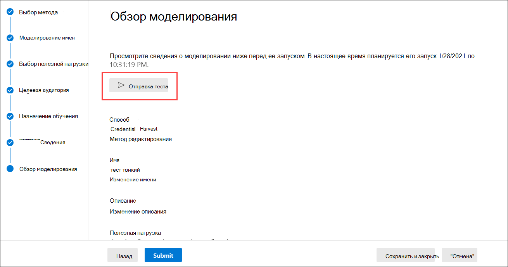

# Рекомендации по развертыванию обучения имитации атаки и часто задаваемые вопросы

Обучение имитации атаки теперь доступно в [общем доступе.](https://techcommunity.microsoft.com/t5/microsoft-security-and/attack-simulation-training-in-microsoft-defender-for-office-365/ba-p/2037291) Обучение имитации атак позволяет организациям Microsoft 365 E5 или Microsoft Defender for Office 365 Plan 2 измерять и управлять рисками социальной инженерии, позволяя создавать и управлять фишинговыми симуляциями, которые обеспечиваются оторужеными фишинговыми нагрузками. Обучение с гипернацелями, которое обеспечивается в сотрудничестве с безопасностью Terranova, помогает улучшить знания и изменить поведение сотрудников.

Дополнительные сведения о том, как начать обучение имитации атаки, см. в этой [ссылке.](attack-simulation-training-get-started.md)

Несмотря на то, что весь опыт создания и планирования моделирования был разработан как свободный и без трения, моделирование в корпоративном масштабе часто требует планирования. В этой статье помогают решать определенные проблемы, которые мы видим, когда наши клиенты запускают моделирование в собственных средах.

## Проблемы с опытом конечных пользователей

### URL-адреса имитации фишинга, заблокированные google Safe Browsing

Служба репутации URL-адресов может определить один или несколько URL-адресов, используемых обучением имитации атаки, как небезопасные. Google Safe Browsing в Google Chrome блокирует некоторые из смоделированных URL-адресов фишинга с обманным сообщением на **сайте.** Хотя мы работаем со многими поставщиками репутации URL-адресов, чтобы всегда разрешал наши URL-адреса моделирования, мы не всегда имеем полный охват.

Обратите внимание, что эта проблема не влияет на Microsoft Edge.

Прежде чем использовать URL-адрес в фишинговой кампании, проверьте доступность URL-адреса в поддерживаемых веб-браузерах. Если URL-адреса заблокированы google Safe [Browsing,](https://support.google.com/chrome/a/answer/7532419) следуйте этому руководству от Google, чтобы разрешить доступ к URL-адресам.

Обратитесь [к началу обучения имитации атаки](attack-simulation-training-get-started.md) для списка URL-адресов, которые в настоящее время используются в обучении имитации атаки.

### Фишинговое моделирование и URL-адреса администратора, заблокированные сетевыми прокси-решениями и драйверами фильтрации

URL-адреса имитации фишинга и URL-адреса администратора могут быть заблокированы или отброшены промежуточными устройствами безопасности или фильтрами. Пример.

- Брандмауэры
- Решения брандмауэра веб-приложения (WAF)
- Драйверы сторонних фильтров (например, фильтры режима ядра)

Несмотря на то, что на этом уровне было заблокировано несколько клиентов, это происходит. Если возникают проблемы, подумайте о настройке следующих URL-адресов для обхода сканирования устройствами безопасности или фильтрами по мере необходимости:

- Смоделированные URL-адреса фишинга, описанные в ["Начало работы с обучением моделированию атак".](attack-simulation-training-get-started.md)
- <https://security.microsoft.com/attacksimulator>
- <https://security.microsoft.com/attacksimulationreport>
- <https://security.microsoft.com/trainingassignments>

### Сообщения моделирования, не доставленные всем целевым пользователям

Не исключено, что число пользователей, которые получают сообщения электронной почты моделирования, меньше, чем число пользователей, которые были объектом моделирования. Следующие типы пользователей будут исключены в рамках целевой проверки:

- Недействительные адреса электронной почты получателей.
- Гостевых пользователей.
- Пользователи, которые больше не активны в Azure Active Directory (Azure AD).

Только допустимые, не приглашенные пользователи с допустимым почтовым ящиком будут включены в моделирование. Если для целевых пользователей используются группы рассылки или группы безопасности с поддержкой почты, вы можете использовать команды [Get-DistributionGroupMember](/powershell/module/exchange/get-distributiongroupmember) в [PowerShell Exchange Online](/powershell/exchange/connect-to-exchange-online-powershell) для просмотра и проверки участников группы рассылки.

## Проблемы с отчетами об обучении моделированию атак

### Отчеты об обучении имитации атак не содержат сведений о действиях

Обучение моделированию атак поставляется с богатыми и понятными сведениями, которые информируют вас о прогрессе готовности к угрозам ваших сотрудников. Если отчеты об обучении имитации атаки не заполнены данными, убедитесь, что поиск журнала аудита включен в организации (он включен по умолчанию).

Поиск журналов аудита необходим обучением имитации атаки, чтобы события могли быть записаны, записаны и прочитано обратно. Отключение поиска журналов аудита имеет следующие последствия для обучения имитации атаки:

- Данные отчетов доступны не во всех отчетах. Отчеты будут отображаться пустыми.
- Учебные назначения блокируют, так как данные недоступны.

Чтобы включить поиск журнала аудита, включите или отключите поиск журнала [аудита.](../../compliance/turn-audit-log-search-on-or-off.md)

> [!NOTE]
> Пустые сведения о действиях также могут быть вызваны отсутствием лицензий E5, которые будут назначены пользователям. Убедитесь, что для активного пользователя назначена по крайней мере одна лицензия E5, чтобы обеспечить запись и запись событий отчетности.

### Отчеты о моделировании обновляются не сразу

Подробные отчеты о моделировании не обновляются сразу после запуска кампании. Не волнуйтесь. такое поведение ожидается.

Каждая кампания моделирования имеет жизненный цикл. При первом создании моделирование находится в **состоянии Запланированное.** Когда моделирование начинается, оно переходит в состояние **"В процессе".** После завершения моделирование переходит в состояние **Завершено.**

Пока моделирование находится в **запланированном** состоянии, отчеты о моделировании будут в основном пустыми. На этом этапе механизм моделирования решает целевые адреса электронной почты пользователей, расширяет группы рассылки, удаляет гостевых пользователей из списка и т.д.:

После того, как моделирование вступает **в** стадию выполнения, вы заметите, что информация начинает струйку в отчеты:

Обновление отдельных отчетов моделирования после перехода в состояние **"В** процессе" может занять до 30 минут. Данные отчета продолжают создаваться до тех пор, пока моделирование не достигнет **состояния Завершено.** Обновления отчетов происходят в следующих интервалах:

- Каждые 10 минут в течение первых 60 минут.
- Каждые 15 минут после 60 минут до 2 дней.
- Каждые 30 минут после 2 дней до 7 дней.
- Каждые 60 минут после 7 дней.

Виджеты на странице **Обзор** предоставляют быстрый снимок о позе безопасности организации, основанной на моделировании, с течением времени. Поскольку эти виджеты отражают общую осанку безопасности и путешествие с течением времени, они обновляются после завершения каждой кампании моделирования.

> [!NOTE]
> Для извлечения данных можно использовать параметр **Export** на различных страницах отчетов.

### Сообщения, сообщающие о фишинге пользователями, не отображаются в отчетах моделирования

Отчеты о моделировании в тренинге симулятора атаки предоставляют сведения о действиях пользователей. Пример.

- Пользователи, щелкнув ссылку в сообщении.
- Пользователи, которые отступили от своих учетных данных.
- Пользователи, которые сообщили о сообщении как фишинг.

Если сообщения, которые пользователи сообщали как фишинг, не запечатлены в отчетах об имитации имитации атак, может быть правило потока почты Exchange (также известное как правило транспорта), которое блокирует доставку сообщений в Корпорацию Майкрософт. Убедитесь, что правила потока почты не блокируют доставку на следующие адреса электронной почты:

- junk@office365.microsoft.com
- abuse@messaging.microsoft.com
- phish@office365.microsoft.com
- не \_ junk@office365.microsoft.com

## Другие часто задамые вопросы

### В. Какой рекомендуемый метод для ориентации пользователей на кампании моделирования?

A. Для целевых пользователей доступно несколько вариантов:

- Включи всех пользователей (в настоящее время доступны организациям с менее чем 40 000 пользователей).
- Выберите определенных пользователей.
- Выберите пользователей из CSV-файла.
- Таргетинг на группу Azure AD.

Мы обнаружили, что кампании, в которых целевые пользователи идентифицированы группами Azure AD, как правило, легче управлять.

### В. Существуют ли ограничения в ориентации на пользователей при импорте из CSV или добавлении пользователей?

О. Ограничение для импорта получателей из CSV-файла или добавления отдельных получателей в имитацию составляет 40 000.

Получателем может быть отдельный пользователь или группа. Группа может содержать сотни или тысячи получателей, поэтому фактическое ограничение не помещается на число отдельных пользователей.

Управление большим CSV-файлом или добавлением множества отдельных получателей может быть громоздким. Использование групп Azure AD упростит общее управление моделированием.

### В. Предоставляет ли Корпорация Майкрософт полезной нагрузки на других языках?

О. В настоящее время доступно 5 локализованных полезной нагрузки. Мы заметили, что любые прямые или машинные переводы существующих полезной нагрузки на другие языки приведут к неточности и снижению релевантности.

При этом вы можете создать собственную полезной нагрузки на языке по вашему выбору с помощью пользовательского опыта создания полезной нагрузки. Мы также настоятельно рекомендуем собирать существующие полезной нагрузки, которые использовались для целевой аудитории в определенной географии. Другими словами, позвольте злоумышленникам локализовать содержимое для вас.

### В. Как перейти на другие языки для портала администрирования и обучения?

О. В Microsoft 365 или Office 365 конфигурация языка является определенной и централизованной для каждой учетной записи пользователя. Инструкции по изменению языковых параметров см. в веб-сайте [Change your display language and time zone in Microsoft 365 for Business.](https://support.microsoft.com/office/6f238bff-5252-441e-b32b-655d5d85d15b)

Обратите внимание, что для синхронизации всех служб может потребоваться до 30 минут.

### В. Могу ли я запустить тестовую симуляцию, чтобы понять, как она выглядит до запуска полноценной кампании?

Ответ: Да, вы можете! На последней странице **Моделирование** обзоров в мастере для создания нового моделирования можно отправить **тест.** Этот параметр будет отправлять пример фишинговых сообщений моделирования для пользователя, зарегистрированного в настоящее время. После проверки фишинговых сообщений в почтовом ящике можно отправить имитацию.

### В. Могу ли я нацелить пользователей, принадлежащих другому клиенту в рамках одной и той же кампании моделирования?

Ответ. Нет. В настоящее время моделирование между клиентами не поддерживается. Убедитесь, что все целевые пользователи находятся в одном клиенте. Все пользователи или гостевых пользователей будут исключены из кампании моделирования.

### В. Как работает доставка в регионе?

О. Для доставки в регионе используется атрибут TimeZone почтового ящика целевого пользователя и логика "не раньше", чтобы определить, когда доставить сообщение. Например, рассмотрим следующий сценарий:

- В 7:00 в тихоокеанском часовом поясе (UTC-8) администратор создает и запланировать кампанию, которая начнется в 9:00 в тот же день.
- UserA находится в восточном часовом поясе (UTC-5).
- UserB также находится в тихоокеанском часовом поясе.

В 9:00 в тот же день сообщение моделирования отправляется в UserB. При доставке с учетом региона сообщение не отправляется в UserA в тот же день, так как 9:00 по тихоокеанскому времени — 12:00 по восточному времени. Вместо этого сообщение отправляется в UserA в 9:00 по восточному времени на следующий день.

Таким образом, при начальном запуске кампании с включенной доставкой с включенными данными о регионах может показаться, что сообщение моделирования было отправлено только пользователям в определенном часовом поясе. Но по мере времени и увеличения числа пользователей число целевых пользователей будет увеличиваться.