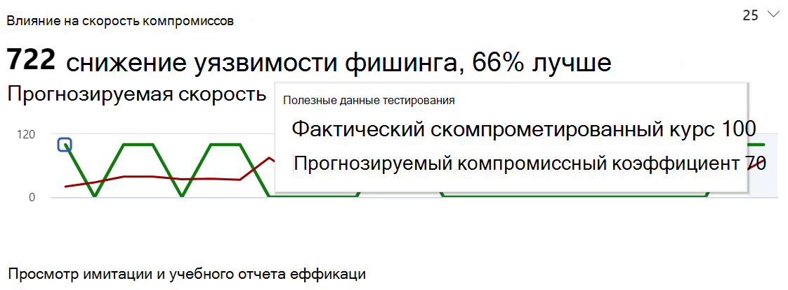
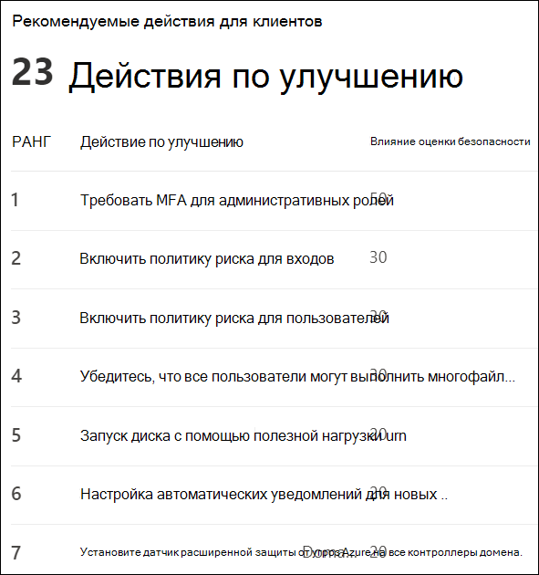

# Получение аналитики с помощью обучения имитации атаки

В рамках обучения моделированию атак корпорация Майкрософт предоставляет вам анализ результатов моделирования и учебных занятий, которые прошли сотрудники. Эти сведения помогут вам проинформировать вас о ходе готовности ваших сотрудников к угрозам, а также порекомендовать дальнейшие действия для лучшей подготовки сотрудников и вашей среды к атакам.

Мы постоянно работаем над расширением доступных вам данных. Влияние на поведение и рекомендуемые действия в настоящее время доступны. Для начала перенаначните обучение моделированию [атак в Центре безопасности Microsoft 365.](https://security.microsoft.com/attacksimulator?viewid=overview)

## Влияние поведения на уровень компрометации

На **вкладке "Обзор"** обучения моделированию атак вы найдете влияние на поведение карты **коэффициента компрометации.** На этой карточке показано, как сотрудники работают с имитациями, которые вы запустили в отличие от **прогнозируемой скорости компрометации.** Эти сведения можно использовать для отслеживания хода выполнения в готовности сотрудников к угрозам путем выполнения нескольких имитаций для одной и той же группы сотрудников.

На графике вы можете увидеть:

- **Прогнозируемая скорость** компрометации, которая отражает среднюю скорость компрометации для имитаций с использованием того же типа полезной нагрузки в других клиентах Microsoft 365, использующих обучение моделированию атак.
- **Фактическая доля компрометации** отражает процент сотрудников, которые были в моделировании.

Кроме того, отражает разницу между фактическим количеством сотрудников, скомпрометированных в результате атаки, и `<number> less susceptible to phishing` прогнозируемым коэффициентом компрометации. Это число сотрудников с меньшей вероятностью будет скомпрометировано аналогичными атаками в будущем, а также указывает, как сотрудники в целом сделали это в отличие от прогнозируемой скорости `<percent%> better than predicted rate` компрометации.

> [!div class="mx-imgBorder"]
> 

Чтобы просмотреть более подробный отчет, щелкните **"Просмотр имитаций и учебный отчет".** В этом отчете предоставляется та же информация с дополнительным контекстом из самого моделирования (например, методика моделирования и общее количество целевых пользователей).

## Рекомендуемые действия

На [ **вкладке**](https://security.microsoft.com/attacksimulator?viewid=simulations)"Имитации" выбор имитации поможет вам получить сведения о моделировании, где вы найдете раздел "Рекомендуемые **действия".**

Рекомендации в разделе рекомендуемых действий, доступные в [оценке безопасности (Майкрософт).](https://docs.microsoft.com/microsoft-365/security/mtp/microsoft-secure-score) Эти рекомендации основаны на полезной нагрузке, используемой в моделировании, и помогут защитить сотрудников и среду. Щелкнув каждое действие по улучшению, вы сможете получить сведения о них.

> [!div class="mx-imgBorder"]
> 

## Дополнительные ссылки

[Начало использования обучения имитации атаки](attack-simulation-training-get-started.md)

[Создание имитации фишинговой атаки](attack-simulation-training.md)

[создание полезной нагрузки для обучения сотрудников](attack-simulation-training-payloads.md)
