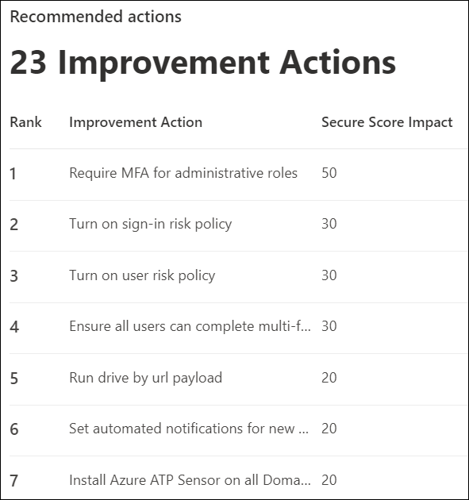

# Получение аналитики с помощью обучения имитации атакиGain insights through Attack simulation training

В рамках обучения моделированию атак корпорация Майкрософт предоставляет вам анализ результатов моделирования и учебных занятий, которые прошли сотрудники.Within Attack simulation training, Microsoft provides you with insights based on outcomes of simulations and trainings that employees went through. Эти сведения помогут вам проинформировать вас о ходе готовности ваших сотрудников к угрозам, а также порекомендовать дальнейшие действия для лучшей подготовки сотрудников и вашей среды к атакам.These insights will help keep you informed on the threat readiness progress of your employees, as well as recommend next steps to better prepare your employees and your environment for attacks.

[!INCLUDE [Prerelease information](../includes/prerelease.md)]

Мы постоянно работаем над расширением доступных вам данных.We are continuously working on expanding the insights that are available to you. Влияние на поведение и рекомендуемые действия в настоящее время доступны.Behavior impact and recommended actions are currently available. Для начала перенаначните обучение моделированию [атак в Центре безопасности Microsoft 365.](https://security.microsoft.com/attacksimulator?viewid=overview)To start, head over to [Attack simulation training in the Microsoft 365 security center](https://security.microsoft.com/attacksimulator?viewid=overview).

## Влияние поведения на уровень компрометацииBehavior impact on compromise rate

На **вкладке "Обзор"** обучения моделированию атак вы найдете влияние на поведение карты **коэффициента компрометации.**On the **Overview** tab of Attack simulation training, you'll find the **behavior impact on compromise rate** card. На этой карточке показано, как сотрудники работают с имитациями, которые вы запустили в отличие от **прогнозируемой скорости компрометации.**This card shows how employees dealt with the simulations you ran in contrast to the **predicted compromise rate**. Эти сведения можно использовать для отслеживания хода выполнения в готовности сотрудников к угрозам путем выполнения нескольких имитаций для одной и той же группы сотрудников.You can use these insights to track progress in employees threat readiness by running multiple simulations against the same groups of employees.

На графике вы можете увидеть:In the graph you can see:

- **Прогнозируемая скорость** компрометации, которая отражает среднюю скорость компрометации для имитаций с использованием того же типа полезной нагрузки в других клиентах Microsoft 365, использующих обучение моделированию атак.**Predicted compromise rate** which reflects the average compromise rate for simulations using the same type of payload across other Microsoft 365 tenants that use Attack simulation training.
- **Фактическая доля компрометации** отражает процент сотрудников, которые были в моделировании.**Actual compromise rate** reflects the percentage of employees that fell for the simulation.

Кроме того, отражает разницу между фактическим количеством сотрудников, скомпрометированных в результате атаки, и `<number> less susceptible to phishing` прогнозируемым коэффициентом компрометации.Additionally, `<number> less susceptible to phishing` reflects the difference between actual number of employees compromised by the attack and the predicted compromise rate. Это число сотрудников с меньшей вероятностью будет скомпрометировано аналогичными атаками в будущем, а также указывает, как сотрудники в целом сделали это в противоположность прогнозируемой скорости `<percent%> better than predicted rate` компрометации.This number of employees is less likely to be compromised by similar attacks in the future, while `<percent%> better than predicted rate` indicates how employees did overall in contrast with the predicted compromise rate.

> [!div class="mx-imgBorder"]
> 

Чтобы просмотреть более подробный отчет, щелкните **"Просмотр имитаций и учебный отчет".**To see a more detailed report, click **View simulations and training efficacy report**. В этом отчете предоставляется та же информация с дополнительным контекстом из самого моделирования (например, методика моделирования и общее количество целевых пользователей).This report provides the same information with additional context from the simulation itself (for example, simulation technique and total users targeted).

## Рекомендуемые действияRecommended actions

На [ **вкладке**](https://security.microsoft.com/attacksimulator?viewid=simulations)"Имитации" выбор имитации поможет вам получить сведения о моделировании, где вы найдете раздел "Рекомендуемые **действия".**On the [**Simulations** tab](https://security.microsoft.com/attacksimulator?viewid=simulations), selecting a simulation will take you to the simulation details, where you'll find the **Recommended actions** section.

В разделе рекомендуемых действий подробно рекомендоваться рекомендации, доступные в [оценке безопасности (Майкрософт).](https://docs.microsoft.com/microsoft-365/security/mtp/microsoft-secure-score)The recommended actions section details recommendations as available in [Microsoft Secure Score](https://docs.microsoft.com/microsoft-365/security/mtp/microsoft-secure-score). Эти рекомендации основаны на полезной нагрузке, используемой в моделировании, и помогут защитить сотрудников и среду.These recommendations are based on the payload used in the simulation, and will help you protect your employees and your environment. Щелкнув каждое действие по улучшению, вы сможете получить сведения о них.Clicking on each improvement action will take you to its details.

> [!div class="mx-imgBorder"]
> 

## Дополнительные ссылкиRelated Links

[Начало работы с обучением моделированию атакGet started using Attack simulation training](attack-simulation-training-get-started.md)

[Создание имитации фишинговой атакиCreate a phishing attack simulation](attack-simulation-training.md)

[создание полезной нагрузки для обучения сотрудниковcreate a payload for training your people](attack-simulation-training-payloads.md)
