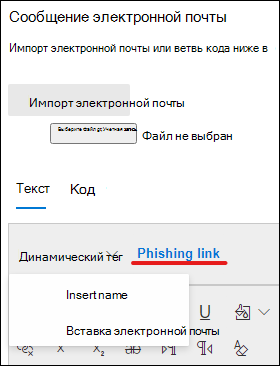
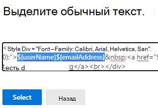

# Создание пользовательских полезных данных для обучения имитации атаки

Корпорация Майкрософт предлагает надежный каталог полезной нагрузки для различных методов социальной инженерии в паре с обучением имитации атак. Однако может потребоваться создать настраиваемые рабочие нагрузки, которые будут работать лучше для вашей организации. В этой статье описывается создание полезной нагрузки в обучении моделированию атак в Microsoft Defender для Office 365.

Вы можете создать полезной нагрузки, нажав на **Создание** полезной нагрузки в выделенной вкладке [ **Полезной**](https://security.microsoft.com/attacksimulator?viewid=payload) нагрузки или в [мастере создания моделирования](attack-simulation-training.md#selecting-a-payload).

На первом этапе мастера будет выбран тип полезной нагрузки. **В настоящее время доступна только электронная почта.**

Далее выберите связанный метод. Дополнительные сведения о методах см. в [подборе метода социальной инженерии.](attack-simulation-training.md#selecting-a-social-engineering-technique)

На следующем шаге назовите полезной нагрузкой. Необязательно, вы можете дать ему описание.

## Настройка полезной нагрузки

Теперь пришло время для создания полезной нагрузки. Ввод имени, адреса электронной почты и темы электронной почты в разделе **Сведения отправитель.** Выберите URL-адрес фишинга из предоставленного списка. Этот URL-адрес позже будет встроен в текст сообщения.

> [!TIP]
> Вы можете выбрать внутреннюю электронную почту отправитель полезной нагрузки, которая будет отображаться как исходя из другого сотрудника компании. Это увеличит восприимчивость к полезной нагрузке и поможет обучить сотрудников риску внутренних угроз.

Для создания полезной нагрузки доступен редактор с богатым текстом. Вы также можете импортировать электронную почту, созданную заранее. Создав тело электронной почты, вы  сможете использовать динамические теги для персонализации электронной почты в целевых адресах. Щелкните **фишинговую** ссылку, чтобы добавить выбранный ранее URL-адрес фишинга в текст сообщения.

> [!TIP]
> Чтобы сэкономить время, загляайте на возможность заменить все ссылки в сообщении электронной почты **ссылкой фишинга.**

После создания полезной нагрузки по своему вкусу нажмите **кнопку Далее**.

## Добавление индикаторов

Индикаторы помогут сотрудникам, которые проходят моделирование атак, понять подсказки, которые они могут искать в будущих атаках. Для начала нажмите **кнопку Добавить индикатор**.

Выберите индикатор, который вы хотите использовать из выпадаемого списка. Этот список является куратором, чтобы содержать наиболее распространенные подсказки, которые отображаются в фишинговых сообщениях электронной почты. После выбора убедитесь, что размещение  индикатора установлено в тексте электронной почты и нажмите кнопку **Выберите текст**. Выделите часть полезной нагрузки, в которой появится этот индикатор, и нажмите **кнопку Выберите**.

Добавьте пользовательское описание для описания индикатора и нажмите кнопку в кадре предварительного просмотра индикатора, чтобы просмотреть индикатор. После этого нажмите **кнопку Добавить**. Повторите эти действия, пока не охватите все индикаторы полезной нагрузки.

## Просмотр полезной нагрузки

Вы закончили создание полезной нагрузки. Теперь пришло время просмотреть сведения и просмотреть сведения о полезной нагрузке. Предварительный просмотр будет включать все созданные индикаторы. С этого шага можно изменить каждую часть полезной нагрузки. После удовлетворены, вы можете **отправить** полезной нагрузки.

> [!IMPORTANT]
> Созданные вами полезной нагрузки будут иметь **клиента** в качестве источника. При выборе полезной нагрузки убедитесь, что вы не отфильтруете **Tenant**.

## Связанные ссылки

[Начало использования обучения имитации атаки](attack-simulation-training-get-started.md)

[Создание имитации фишинговых атак](attack-simulation-training.md)

[Получение аналитики с помощью обучения имитации атаки](attack-simulation-training-insights.md)
