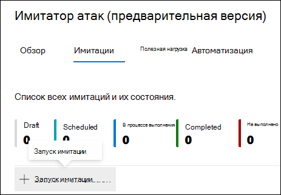
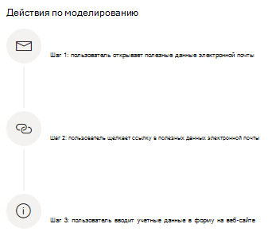
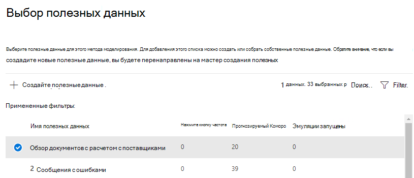
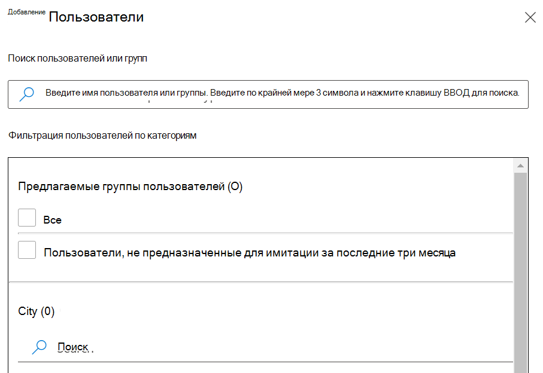
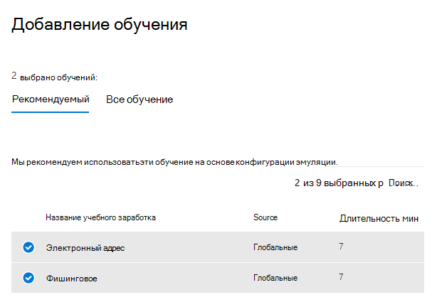

# Имитация атаки фишинга

Учебные курсы по атакам через защитник Майкрософт для Office 365 позволяет выполнять в Организации неблагоприятные имитации атаки кибератак, чтобы протестировать политики и методики безопасности, а также обучить сотрудников Организации, чтобы повысить их осведомленность и снизить риск атак на сусцептибилити. Ниже приведена пошаговое руководство по моделированию атаки с фишингом с помощью учебного захождения для симуляторов атак.

[!INCLUDE [Prerelease information](../includes/prerelease.md)]

Чтобы запустить имитацию атаки фишинга, перейдите в [Центр безопасности Microsoft 365](https://security.microsoft.com/). В разделе **Электронная почта & совместная работа** щелкните **симулятор атак** и переключитесь на вкладку [**имитация**](https://security.microsoft.com/attacksimulator?viewid=simulations) .

В разделе **имитация** выберите **+ запустить имитацию**.

> [!NOTE]
> В любой момент при создании модели можно сохранить и закрыть, чтобы продолжить настройку имитации позже.

## Выбор метода социального проектирования

Выберите один из четырех различных способов, проверенных в [МИТРЕ ATT&а® Framework](https://attack.mitre.org/techniques/enterprise/). Разные полезные данные доступны для разных приемов.

- Сбор **учетных данных** пытается собрать учетные данные сотрудников, отправляя их на известный веб-сайт с полями ввода для ввода имени пользователя и пароля.
- **Вложение вредоносных программ** добавляет к сообщению вредоносное вложение. При открытии этого вложения запустится произвольный код, который поможет злоумышленнику взвредить целевое устройство.
- **Ссылка во вложении** — это тип гибридной системы сбора учетных данных. Злоумышленник вставляет URL-адрес во вложение электронной почты. URL-адрес внутри вложения соответствует тому же методу, что и сбор учетных данных.
- **Ссылка на вредоносный** код запустит некоторый произвольный код из файла, размещенного на хорошо известном сайте совместного использования файлов. Ссылка на этот вредоносный файл добавляется в сообщение, отправляемое на целевой объект, и щелкает его, чтобы запустить файл и помочь злоумышленнику получить несанкционированный доступ к оконечному устройству.

> [!TIP]
> При нажатии кнопки **Просмотр сведений** в описании каждого метода отображаются дополнительные сведения о приеме, а также действия по моделированию для этого метода.
>
> 

После выбора метода и нажатия кнопки **Далее** укажите имя и, при необходимости, описание модели.

## Выбор полезных данных

Далее необходимо выбрать полезные данные из ранее существующего каталога полезных данных.

Полезные данные содержат ряд точек данных, которые помогут выбрать:

- **Выберите** количество пользователей, которые щелкают эту полезную нагрузку.
- **Предсказуемая частота угроз** прогнозирует процент людей, которые будут скомпрометированы на основе исторических данных для этих полезных данных в защитнике Майкрософт для пользователей Office 365.
- **Запущенных эмуляций** подсчитывает количество использований этих полезных данных в других эмуляциях.
- **Сложность** , доступная через **фильтры** , вычисляется на основе количества индикаторов в полезных данных, которые могут быть нацелены на атаку. Дополнительные индикаторы понизьте сложность.
- **Источник** , доступный через **фильтры** , указывает, были ли полезные данные созданы в вашем клиенте или является частью уже существующего каталога полезных данных корпорации Майкрософт (Global).

Выберите полезные данные в списке для предварительного просмотра полезных данных с дополнительными сведениями о ней.

Если вы хотите создать свои полезные данные, прочитайте статью [Создание полезных данных для обучения по моделированию атак](attack-simulation-training-payloads.md).

## Выбор целевой аудитории

Теперь настало время выбрать аудиторию этого моделирования. Можно выбрать **Включение всех пользователей в Организации** или **Включение только определенных пользователей и групп**. 

Если вы решили **включить только определенных пользователей и групп** , можно выполнить одно из следующих действий:

- **Добавление пользователей** , которое позволяет использовать поиск клиента, а также расширенные возможности поиска и фильтрации, например целевые пользователи, которым не назначена эмуляция в последние 3 месяца.
  
- **Импорт из CSV** позволяет импортировать предварительно определенный набор пользователей для этой имитации.

## Назначение обучения

Рекомендуется назначить обучение для каждой имитации, так как сотрудники, проходящих через обучение, менее подвержены воздействию подобных атак.

Вы можете выбрать обучение, назначенное Вам, либо самостоятельно выбрать учебные курсы и модули.

Выберите срок **обучения** , чтобы убедиться, что сотрудники своевременно завершают обучение.

> [!NOTE]
> Если вы решили выбрать курсы и модули самостоятельно, вы по-прежнему сможете просматривать рекомендуемый контент, а также все доступные курсы и модули.
>
> 

В следующих действиях необходимо **Добавить обучение** , если вы выбрали его самостоятельно и настроите начальную страницу обучения. Вы сможете просмотреть учебную целевую страницу, а также изменить заголовок и основной текст.

## Сведения о запуске и обзор

Теперь, когда все настроено, вы можете запустить эту имитацию немедленно или запланировать ее на более позднюю дату. Кроме того, необходимо выбрать время окончания этой имитации. Мы не будем перезаписывать взаимодействие с этим моделированием за выбранный период времени. 

**Включить поддержку часовых поясов для региона** для предоставления имитации сообщений о атаках сотрудникам в рабочее время в зависимости от их региона.

После завершения нажмите кнопку **Далее** и просмотрите сведения о модели. Нажмите кнопку **Edit (изменить** ) в любой из частей, чтобы вернуться и изменить все нужные сведения. После этого нажмите кнопку **послать**.
