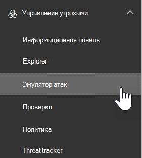

# Симулятор атак в ATP

**Сводка** Если вы являетесь глобальным администратором или администратором безопасности и у вашей организации есть Office 365 Advanced Threat Protection Plan 2, который включает [функции расследования и реагирования на угрозы](office-365-ti.md), вы можете использовать симуляторы атак для выполнения сценариев в Организации. Благодаря этому можно идентифицировать и находить уязвимых пользователей до того как вы понесете убытки от реальной атаки. Ознакомьтесь с этой статьей, чтобы узнать больше.

## Что нужно знать перед началом работы

- Чтобы открыть Центр безопасности и соответствия требованиям, перейдите по ссылке <https://protection.office.com/>. Симулятор атак доступен в **Threat management** \> **симуляторе атак**с управлением угрозами.

  

- Дополнительные сведения о доступности симуляторов атак в различных подписках на Microsoft 365 приведены в статье [Описание службы Advanced Threat Protection для Office 365](https://docs.microsoft.com/office365/servicedescriptions/office-365-advanced-threat-protection-service-description).

- Необходимо быть участником группы ролей " **Управление организацией** " или " **администратор безопасности** ". Дополнительные сведения о группах ролей в Центре безопасности и соответствия требованиям см. в статье [Разрешения в Центре безопасности и соответствия требованиям](permissions-in-the-security-and-compliance-center.md).

- Ваша учетная запись должна быть настроена для многофакторной проверки подлинности (MFA) для создания кампаний в симуляторе атак и управления ими. Инструкции приведены в разделе [Настройка многофакторной проверки подлинности](https://docs.microsoft.com/microsoft-365/admin/security-and-compliance/set-up-multi-factor-authentication).

Для успешного запуска атаки убедитесь, что учетная запись, используемая для запуска имитации атак, использует многофакторную проверку подлинности. Кроме того, вы должны быть глобальным администратором или администратором безопасности. (Дополнительные сведения о ролях и разрешениях см. в разделе [разрешения в центре безопасности & соответствия требованиям](permissions-in-the-security-and-compliance-center.md).)

- Фишинговые кампании будут собирать и обрабатывать события в течение 30 дней. Исторические данные кампании будут доступны в течение до 90 дней после запуска кампании.

- Для симулятора атак нет соответствующих командлетов PowerShell.

## Фишинговые кампании спеар

*Фишинг* — это общий термин для атак электронной почты, которые пытаются украсть конфиденциальные данные в сообщениях, которые не являются законными или надежными отправителями. *Фишинг спеар* — это нацеленная атака фишинга, использующая очень специализированный и настроенный контент, специально предназначенный для целевых получателей (как правило, после реконнаиссанце от получателей).

- Вы являетесь глобальным администратором или администратором безопасности

В симуляторе атак доступны два различных типа спеар фишинговых кампаний:

- [Многофакторная проверка подлинности и условный доступ](https://docs.microsoft.com/microsoft-365/admin/security-and-compliance/set-up-multi-factor-authentication) включены, по крайней мере глобальному администратору и администраторам безопасности, которые будут использовать симулятор для атаки. (В идеале многофакторная проверка подлинности и условный доступ включены для всех пользователей в Организации.)

  - Страница по умолчанию с объяснением это только тест, и приводятся советы по распознаванию фишинговых сообщений.

    

  - Настраиваемая страница (URL-адрес).

- **Спеар фишинга (вложение)**: атака пытается убедить получателей открыть DOCX-или PDF-вложение в сообщении. Вложение содержит то же содержимое, что и адрес фишинга по умолчанию, но первое предложение начинается с " \<Display Name\> , что вы видите это сообщение как последнее открытое сообщение электронной почты...".

> [!NOTE]
> В настоящее время спеар фишинговых кампаний в симуляторе атак не истечет.

### Создание спеар фишинговых кампаний

Важной частью любой антифишинговой кампании спеар является внешний вид сообщения электронной почты, которое отправляется получателям. Чтобы создать и настроить сообщение электронной почты, вы можете использовать следующие параметры:

- **Используйте встроенный шаблон электронной почты**: доступны два встроенных шаблона: **приз Гивеавай** и **Обновление зарплаты**. Вы можете настроить некоторые, все или ни одно из свойств электронной почты из шаблона при создании и запуске кампании.

- **Создание шаблона электронной почты для повторного использования**: после создания и сохранения шаблона электронной почты его можно использовать повторно в будущих спеар фишинговых кампаний. Вы можете настроить некоторые, все или ни одно из свойств электронной почты из шаблона при создании и запуске кампании.

- **Создайте сообщение электронной почты в мастере**: вы можете создать сообщение электронной почты непосредственно в мастере при создании и запуске антифишинговой кампании спеар.

#### Шаг 1 (необязательно): Создание настраиваемого шаблона электронной почты

Если вы планируете использовать один из встроенных шаблонов или создать сообщение электронной почты непосредственно в мастере, вы можете пропустить этот шаг.

1. В центре безопасности & соответствия требованиям перейдите к **Threat management** \> **симулятору атак**управления угрозами.

2. На странице **имитация атак** : в разделах **спеар фишинг (учетные данные)** или **спеар фишинга (вложение)** нажмите **сведения об атаках**.

   Не имеет значения, где вы создаете шаблон. Параметры, доступные в шаблоне, одинаковы для обоих типов фишинговых атак.

3. На открывшейся странице **сведения об атаке** в разделе **шаблоны фишинга** в области **Создание шаблонов** щелкните **новый шаблон**.

4. Мастер **настройки шаблонов фишинга** запускается в новом всплывающем меню. В разделе " **начать** " введите уникальное отображаемое имя для шаблона, а затем нажмите кнопку **Далее**.

5. На шаге **Настройка сведений о сообщении электронной почты** настройте указанные ниже параметры.

   - **From (имя)**: отображаемое имя, используемое для отправителя сообщения.

   - **From (электронная почта)**: адрес электронной почты отправителя.

   - **URL-адрес сервера входа с фишингом**: щелкните раскрывающийся список и выберите один из доступных URL-адресов из списка. Это URL-адрес, по которому пользователи будут поддаваться своему щелчку. Имеются следующие варианты.

     - <http://portal.docdeliveryapp.com>
     - <http://portal.docdeliveryapp.net>
     - <http://portal.docstoreinternal.com>
     - <http://portal.docstoreinternal.net>
     - <http://portal.hardwarecheck.net>
     - <http://portal.hrsupportint.com>
     - <http://portal.payrolltooling.com>
     - <http://portal.payrolltooling.net>
     - <http://portal.prizegiveaway.net>
     - <http://portal.prizesforall.com>
     - <http://portal.salarytoolint.com>
     - <http://portal.salarytoolint.net>

     > [!NOTE]
     > <ul><li>Все URL-адреса являются намеренно HTTP, а не HTTPS.</li><li>Служба репутации URL-адресов может идентифицировать один или несколько из этих URL-адресов как небезопасные. Прежде чем использовать URL-адрес в фишинговой кампании, проверьте доступность URL-адреса в поддерживаемых веб-браузерах.</li></ul>

   - **Настраиваемый URL-адрес начальной страницы**: Введите необязательную целевую страницу, на которой будут выполняться пользователи, если щелкнуть ссылку фишинга и ввести свои учетные данные. Эта ссылка заменяет целевую страницу по умолчанию. Например, если у вас есть внутреннее обучение, можно указать здесь URL-адрес.

   - **Category**: в настоящее время этот параметр не используется (все введенные данные игнорируются).

   - **Тема**: поле **темы** сообщения электронной почты.

   По завершении нажмите кнопку **Далее**.

6. На шаге создание **электронного** сообщения Создайте текст сообщения электронной почты. Вы можете использовать вкладку **Электронная почта** (ФОРМАТИРОВАННЫЙ HTML-редактор) или вкладку **источник** (HTML-код RAW).

   Форматирование HTML может быть простым или сложным по мере необходимости. Вы можете вставить изображения и текст, чтобы улучшить белиевабилити сообщения в почтовом клиенте получателя.

   - `${username}`Вставка имени получателя.

   - `${loginserverurl}`Вставляет значение **URL-адреса сервера фишингового входа** из предыдущего действия.

   По завершении нажмите кнопку **Далее**.

7. На шаге **Подтверждение** нажмите кнопку **Готово**.

#### Шаг 2: создание и запуск антифишинговой кампании спеар

1. В центре безопасности & соответствия требованиям перейдите к **Threat management** \> **симулятору атак**управления угрозами.

2. На странице **имитация атак** выберите один из следующих вариантов, в зависимости от типа кампании, которую вы хотите создать:

   - В разделе **спеар фишинг (учетные данные)** нажмите **запустить атаку** или " **сведения об атаке** ", чтобы \> **запустить атаку**.

   - В разделе **спеар фишинг (вложение)** нажмите **запустить атаку** или " **сведения об атаке** ", чтобы \> **запустить атаку**.

3. Мастер **настройки фишинговых атак** запускается в новом всплывающем меню. На **начальном** этапе выполните одно из следующих действий:

   - В поле **имя** введите уникальное отображаемое имя для кампании. Не щелкайте **шаблон использовать**, так как вы создадите сообщение электронной почты позже в мастере.

   - Щелкните **использовать шаблон** и выберите встроенный или настраиваемый шаблон электронной почты. После выбора шаблона поле **имя** автоматически заполняется на основе шаблона, но вы можете изменить его имя.

   

   По завершении нажмите кнопку **Далее**.

4. На шаге **целевые получатели** выполните одно из указанных ниже действий.

   - Щелкните **Адресная книга** , чтобы выбрать получателей (пользователей или групп) для кампании. У каждого целевого получателя должен быть почтовый ящик Exchange Online. Если нажать кнопку **Фильтр** и **Применить** , не вводя условия поиска, все получатели возвращаются и добавляются в кампанию.

   - Нажмите кнопку **Импорт** и импорт **файлов** , чтобы импортировать значения с разделителями-запятыми (CSV) или файлы электронной почты с разделителями-запятыми. Каждая строка должна содержать адрес электронной почты получателя.

   По завершении нажмите кнопку **Далее**.

5. На шаге **Настройка сведений о сообщении электронной почты** настройте указанные ниже параметры.

   Если вы выбрали шаблон на **начальном** этапе, большая часть этих значений уже настроена, но вы можете изменить их.

   - **From (имя)**: отображаемое имя, используемое для отправителя сообщения.

   - **From (электронная почта)**: адрес электронной почты отправителя. Вы можете ввести реальный или поддельный адрес электронной почты из почтового ящика организации или можно ввести реальный или фальшивый внешний адрес электронной почты. Действительный адрес электронной почты отправителя в Организации будет фактически разрешаться в почтовом клиенте получателя.

   - **URL-адрес сервера входа с фишингом**: щелкните раскрывающийся список и выберите один из доступных URL-адресов из списка. Это URL-адрес, по которому пользователи будут поддаваться своему щелчку. Имеются следующие варианты.

     - <http://portal.docdeliveryapp.com>
     - <http://portal.docdeliveryapp.net>
     - <http://portal.docstoreinternal.com>
     - <http://portal.docstoreinternal.net>
     - <http://portal.hardwarecheck.net>
     - <http://portal.hrsupportint.com>
     - <http://portal.payrolltooling.com>
     - <http://portal.payrolltooling.net>
     - <http://portal.prizegiveaway.net>
     - <http://portal.prizesforall.com>
     - <http://portal.salarytoolint.com>
     - <http://portal.salarytoolint.net>

     > [!NOTE]
     > <ul><li>Все URL-адреса являются намеренно HTTP, а не HTTPS.</li><li>Служба репутации URL-адресов может идентифицировать один или несколько из этих URL-адресов как небезопасные. Прежде чем использовать URL-адрес в фишинговой кампании, проверьте доступность URL-адреса в поддерживаемых веб-браузерах.</li><li>Вам необходимо выбрать URL-адрес. Для кампаний с <b>фишингом (СПЕАР)</b> можно удалить ссылку из текста сообщения на следующем этапе (в противном случае сообщение будет содержать как ссылку <b>, так и</b> вложение).</li></ul>

   - **Тип вложения**: этот параметр доступен только для кампаний с **фишингом спеар (вложение)** . Щелкните раскрывающийся список и выберите **. DOCX** или **. PDF** из списка.

   - **Имя вложения**: этот параметр доступен только для кампаний с **фишингом спеар (вложение)** . Введите имя файла для DOCX-или PDF-вложения.

   - **Настраиваемый URL-адрес начальной страницы**: Введите необязательную целевую страницу, на которой будут выполняться пользователи, если щелкнуть ссылку фишинга и ввести свои учетные данные. Эта ссылка заменяет целевую страницу по умолчанию. Например, если у вас есть внутреннее обучение, можно указать здесь URL-адрес.

   - **Тема**: поле **темы** сообщения электронной почты.

   По завершении нажмите кнопку **Далее**.

6. На шаге создание **электронного** сообщения Создайте текст сообщения электронной почты. Если вы выбрали шаблон на **начальном** этапе, текст сообщения уже настроен, но его можно настроить. Вы можете использовать вкладку **Электронная почта** (ФОРМАТИРОВАННЫЙ HTML-редактор) или вкладку **источник** (HTML-код RAW).

   Форматирование HTML может быть простым или сложным по мере необходимости. Вы можете вставить изображения и текст, чтобы улучшить белиевабилити сообщения в почтовом клиенте получателя.

   - `${username}`Вставка имени получателя.

   - `${loginserverurl}`Вставляет значение **URL-адреса сервера фишингового входа** .

   Для кампаний с **фишингом спеар (вложение)** необходимо удалить ссылку из текста сообщения (в противном случае сообщение будет содержать **как ссылку, так и вложение** ), а ссылки, которые не отслеживаются в кампании вложения.

   

   По завершении нажмите кнопку **Далее**.

7. На шаге **Подтверждение** нажмите кнопку **Готово** , чтобы запустить кампанию. Сообщение фишинга доставляется получателям.

## Кампании по атакам паролей

*Атака* с помощью пароля пытается угадать пароли учетных записей пользователей в Организации, как правило, после того, как злоумышленник обнаружил одну или несколько действительных учетных записей пользователей.

В симуляторе атак можно проверить сложность паролей пользователей двумя различными типами кампаний по атакам паролей:

- **Пароль принудительной силы (Словарная атака)**: при атаке *методом грубого* или *словаря* используется большой файл словаря паролей для учетной записи пользователя с тем, что один из них будет работать (многие пароли для одной учетной записи). Неправильные блокировки паролей помогают предотвратить атаки пароля методом прямого доступа.

  Для атаки словаря можно указать один или несколько паролей, которые необходимо использовать (вручную или в отправленном файле), а также указать одного или нескольких пользователей.

- **Распыление паролей**: при атаке с помощью *распылителя пароля* такой же тщательно распознанный пароль используется для списка учетных записей пользователей (один пароль для многих учетных записей). Не удается обнаружить пароли, которые трудно обнаружить, чем атаки методом грубой силы (вероятность успеха возрастает, когда злоумышленник пытается использовать один пароль в десятках или сотни учетных записей, не выполняя риск блокировки неправильного пароля пользователя).

  Для атаки с помощью распылителя пароля можно указать только один пароль, а вы можете указать одного или нескольких пользователей.

> [!NOTE]
> При атаке по паролю в симуляторе атак выполняется передача имени пользователя и пароля базовой авторизации в конечную точку, поэтому они также работают с другими методами проверки подлинности (AD FS, синхронизация хэша пароля, сквозной, Пингфедерате и т. д.). Для пользователей с включенным MFA, даже если парольная атака пытается использовать действительный пароль, попытка всегда будет регистрироваться как сбой (другими словами, пользователи MFA никогда не будут отображаться в списке **успешных попыток** кампании). Это ожидаемый результат. MFA — это основной метод защиты от атак паролей.

### Создание и запуск кампании по атаке паролей

1. В центре безопасности & соответствия требованиям перейдите к **Threat management** \> **симулятору атак**управления угрозами.

2. На странице **имитация атак** выберите один из следующих вариантов, в зависимости от типа кампании, которую вы хотите создать:

   - В разделе @ @ **грубый пароль (атака с словарем)** нажмите кнопку **запустить атаку** или выберите пункт **сведения об атаке** \> **запустить атаку**.

   - в разделе " **распыление пароли для паролей** " нажмите кнопку **запустить атаку** или " **сведения об атаке** ", чтобы \> **запустить атаку**.

3. Мастер **настройки парольной атаки** запускается в новом всплывающем меню. В разделе " **начать** " введите уникальное отображаемое имя кампании, а затем нажмите кнопку **Далее**.

4. В шаге **Целевые пользователи** выполните одно из указанных ниже действий.

   - Щелкните **Адресная книга** , чтобы выбрать получателей (пользователей или групп) для кампании. У каждого целевого получателя должен быть почтовый ящик Exchange Online. Если нажать кнопку **Фильтр** и **Применить** , не вводя условия поиска, все получатели возвращаются и добавляются в кампанию.

   - Нажмите кнопку **Импорт** и импорт **файлов** , чтобы импортировать значения с разделителями-запятыми (CSV) или файлы электронной почты с разделителями-запятыми. Каждая строка должна содержать адрес электронной почты получателя.

   По завершении нажмите кнопку **Далее**.

5. В разделе **Выбор параметров атаки** выберите действия, которые нужно выполнить, в зависимости от типа кампании:

   - **Пароль принудительной перебора (атака со словарем)**: выполните одно из следующих действий:

     - **Введите пароли вручную**: в поле **нажмите клавишу ВВОД, чтобы добавить пароль** , введите пароль и нажмите клавишу ВВОД. Повторите этот шаг необходимое количество раз.

     - **Отправьте пароли из файла словаря**: нажмите кнопку **Отправить** , чтобы импортировать существующий текстовый файл, который содержит один пароль в каждой строке, и пустую последнюю строку. Размер текстового файла должен быть не менее 10 МБ и не может содержать более 30000 паролей.

   - **Распыление паролей**: в поле **пароль (s) для атаки** введите один пароль.

   По завершении нажмите кнопку **Далее**.

6. На шаге **Подтверждение** нажмите кнопку **Готово** , чтобы запустить кампанию. Указанные пароли будут использоваться для указанных пользователей.

## Просмотр результатов кампании

После запуска кампании можно проверить ход выполнения и результаты на основной странице **имитации атак** .

В активных кампаниях будет отображаться строка состояния, процентное значение завершенного количества пользователей (количество пользователей). Нажмите кнопку **Обновить** , чтобы обновить ход выполнения активных кампаний. Вы также можете нажать кнопку **прекратить** , чтобы остановить активную кампанию.

По завершении кампании состояние "атака" будет изменено на " **атака завершена**". Результаты кампании можно просмотреть, выполнив одно из следующих действий:

- На главной странице **имитации атак** нажмите кнопку **Просмотреть отчет** под названием кампании.

- На главной странице " **имитация атак** " в разделе **сведения о атаках** выберите тип атаки. На открывшейся странице **сведения об атаке** выберите кампания в разделе **Журнал атак** .

При любом из предыдущих действий вы перейдете на страницу с именем " **сведения об атаке**". Сведения, доступные на этой странице для каждого типа кампании, описаны в следующих разделах.

### Результаты кампании фишинга спеар (Credential Credential)

Следующая информация доступна на странице **сведения о атаках** для каждой кампании:

- Длительность кампании (Дата и время начала и Дата и время окончания).

- **Общее количество целевых пользователей**

- **Успешных попыток**: количество пользователей, которые щелкают ссылку **и** ввели учетные данные (*любое* имя пользователя и пароль).

- **Общая доля успешных**попыток: процент, рассчитанный на количество **успешных попыток**, для которых  /  **назначены пользователи**.

- **Самый быстрый щелчок**: сколько времени занял первый пользователь, щелкнув ссылку после запуска кампании.

- **Среднее нажатие**: количество времени, в течение которого все потребовалось щелкнуть ссылку, деленную на количество пользователей, которые щелкают ссылку.

- **Выберите процент успешных**действий: процент, вычисляемый (число пользователей, которые щелкают ссылку)/общее число **целевых пользователей**.

- **Самые быстрые учетные данные**: время, в течение которого первый пользователь вводит свои учетные данные после запуска кампании.

- **Средняя учетная**запись: сумма, на которую все пользователи могут вводить свои учетные данные, разделенные на количество пользователей, которые ввели свои учетные данные.

- **Доля успешных учетных данных**: процентное отношение, вычисляемое (число пользователей, которые вводили свои учетные данные)/ **Общее число целевых пользователей**.

- Линейчатая диаграмма, показывающая, что **выбрана ссылка** , и число **предоставленных учетных данных** в день.

- Граф круга, отображающий **выбранную ссылку**, **предоставленные учетные данные** **и процентные** значения для кампании.

- Раздел **скомпрометированные пользователи** : содержит сведения о пользователях, которые щелкают ссылку:

  - Адрес электронной почты пользователя.

  - Дата и время щелчка ссылки.

  - IP-адрес клиента.

  - Сведения о версии Windows и веб-браузере пользователя.

  Вы можете нажать кнопку **Экспорт** , чтобы экспортировать результаты в CSV-файл.

### Результаты кампании фишинга спеар (вложение)

Следующая информация доступна на странице **сведения о атаках** для каждой кампании:

- Длительность кампании (Дата и время начала и Дата и время окончания).

- **Общее количество целевых пользователей**

- **Успешных попыток**: количество пользователей, которые открывали или открывали вложение (Предварительная версия не учитывается).

- **Общая доля успешных**попыток: процент, рассчитанный на количество **успешных попыток**, для которых  /  **назначены пользователи**.

- **Самое быстрое время открытия вложения: время**, затрачиваемое первым пользователем на открытие вложения после запуска кампании.

- **Среднее время открытия вложения**: сумма, с которой все пользователи открывают вложение, разделенное на количество пользователей, открывающих вложение.

- **Доля успешных попыток открытия вложений**: процент, вычисляемый (число пользователей, открывших вложение)/ **Общее число целевых пользователей**.

### Результаты кампании с паролями грубой силы (Словарная атака)

Следующая информация доступна на странице **сведения о атаках** для каждой кампании:

- Длительность кампании (Дата и время начала и Дата и время окончания).

- **Общее количество целевых пользователей**

- **Успешных попыток**: количество пользователей, которые применялись к одному из указанных паролей.

- **Общая доля успешных**попыток: процент, рассчитанный на количество **успешных попыток**, для которых  /  **назначены пользователи**.

- Раздел **скомпрометированные пользователи** содержит список адресов электронной почты затронутых пользователей. Вы можете нажать кнопку **Экспорт** , чтобы экспортировать результаты в CSV-файл.

### Результаты кампании для атаки на распылителя пароля

Следующая информация доступна на странице **сведения о атаках** для каждой кампании:

- Длительность кампании (Дата и время начала и Дата и время окончания).

- **Общее количество целевых пользователей**

- **Успешных попыток**: количество пользователей, которые были использованы с указанным паролем.

- **Общая доля успешных**попыток: процент, рассчитанный на количество **успешных попыток**, для которых  /  **назначены пользователи**.
