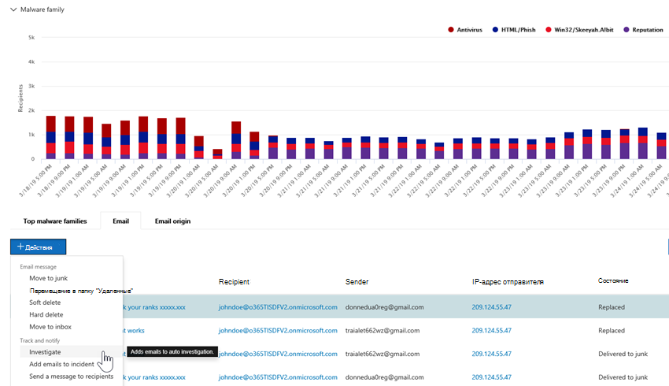
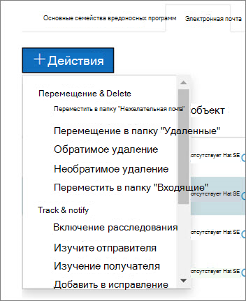

# Как автоматизированные исследования и ответы работают в Microsoft Defender для Office 365

[!INCLUDE [Microsoft 365 Defender rebranding](../includes/microsoft-defender-for-office.md)]

**Область применения**
- [Microsoft Defender для Office 365 (план 2)](defender-for-office-365.md)
- [Microsoft 365 Defender](../defender/microsoft-365-defender.md)

По мере запуска оповещений о безопасности ваша группа операций безопасности должна инициализации этих оповещений и принять меры для защиты организации. Иногда группы операций безопасности могут чувствовать себя перегруженными из-за объема срабатываемого оповещения. Автоматизированные возможности исследования и реагирования (AIR) в Microsoft Defender для Office 365 могут помочь.

AIR позволяет вашей группе операций безопасности работать эффективнее и эффективнее. Возможности AIR включают автоматизированные процессы расследования в ответ на известные угрозы, которые существуют сегодня. Соответствующие действия по исправлению последствий ожидают утверждения, что позволяет группе операций безопасности реагировать на обнаруженные угрозы.

В этой статье описывается, как AIR работает с помощью нескольких примеров. Когда вы будете готовы к началу работы с air, см. в статью Автоматические расследования и [реагирование на угрозы.](office-365-air.md)

- [Пример 1. Сообщение о фишинге, сообщаемом пользователем, запускает книгу расследований](#example-a-user-reported-phish-message-launches-an-investigation-playbook)
- [Пример 2. Администратор безопасности запускает расследование из Обозревателя угроз](#example-a-security-administrator-triggers-an-investigation-from-threat-explorer)
- [Пример 3. Группа операций безопасности интегрирует AIR с их SIEM с помощью API Office 365 управления](#example-a-security-operations-team-integrates-air-with-their-siem-using-the-office-365-management-activity-api)

## Пример: сообщение о фишинге, о чем сообщалось пользователем, запускает книгу расследований

Предположим, что пользователь в организации получает сообщение электронной почты, которое, по его мнению, является попыткой фишинга. Пользователь, обученный сообщать о таких сообщениях, использует надстройку Report [Message](enable-the-report-message-add-in.md) или надстройку [Report Phishing,](enable-the-report-phish-add-in.md) чтобы отправить ее в Корпорацию Майкрософт для анализа. Отправка также отправляется в систему и отображается в Обозревателе в представлении **Отправки** (ранее именуемом представлением **пользователя).** Кроме того, сообщение, о котором сообщалось пользователю, запускает информационное оповещение на основе системы, которое автоматически запускает книгу расследований.

На этапе корневого исследования оцениваются различные аспекты электронной почты. Эти аспекты включают в себя:

- Определение типа угрозы;
- Кто отправлено;
- Отправка электронной почты (отправка инфраструктуры);
- Были ли доставлены или заблокированы другие экземпляры электронной почты;
- Оценка наших аналитиков;
- Связано ли сообщение электронной почты с любыми известными кампаниями;
- и более.

После завершения корневого исследования в книге содержится список рекомендуемых действий для выполнения исходной электронной почты и связанных с ней сущностями.

Далее выполняется несколько действий по расследованию угроз и охоте:

- Аналогичные сообщения электронной почты идентифицированы с помощью поиска кластера электронной почты.
- Сигнал передается другим платформам, например [Microsoft Defender для конечной точки.](/windows/security/threat-protection/microsoft-defender-atp/microsoft-defender-advanced-threat-protection)
- Будет принято решение о том, щелкнули ли пользователи какие-либо вредоносные ссылки в подозрительных сообщениях электронной почты.
- Проверка проводится в Exchange Online Protection[(EOP)](exchange-online-protection-overview.md)и[(Microsoft Defender для Office 365),](defender-for-office-365.md)чтобы узнать, есть ли другие аналогичные сообщения, о чем сообщают пользователи.
- Проводится проверка, чтобы узнать, был ли скомпрометирован пользователь. Эта проверка использует сигналы Office 365, [Microsoft Cloud App Security](/cloud-app-security)и [Azure Active Directory,](/azure/active-directory)соотнося все связанные аномалии активности пользователей.

На этапе охоты рискам и угрозам назначены различные этапы охоты.

Исправление — это заключительный этап игры. На этом этапе принимаются меры по исправлению последствий на основе этапов расследования и охоты.

## Пример. Администратор безопасности запускает расследование из Обозревателя угроз

Помимо автоматических расследований, запускаемой оповещением, группа операций безопасности организации может запускать автоматическое расследование из представления [в Обозревателе угроз.](threat-explorer.md)  Это расследование также создает оповещение, чтобы инциденты Microsoft Defender и внешние средства SIEM могли видеть, что это расследование было инициировано.

Например, предположим, что вы используете представление **вредоносных** программ в Explorer. На вкладке ниже диаграммы выберите вкладку **Email.** Если в списке выбран один или несколько элементов, **активируется кнопка +Действия.**

С помощью **меню Действия** можно выбрать **исследование Trigger.**

Как и в играх, запускаемых оповещением, автоматические расследования, которые запускаются из представления в Explorer, включают корневое исследование, действия по выявлению и сопоставлению угроз, а также рекомендуемые действия по смягчению этих угроз.

## Пример. Группа операций безопасности интегрирует AIR со своим SIEM с помощью API Office 365 управления

Возможности AIR в Microsoft Defender для  Office 365 включают отчеты &, которые группы операций безопасности могут использовать для мониторинга и устранения угроз. Но вы также можете интегрировать возможности AIR с другими решениями. В качестве примеров можно привести систему управления сведениями о безопасности и событиями (SIEM), систему управления случаями или настраиваемую систему отчетности. Такие интеграции можно сделать с помощью [API Office 365 управления.](/office/office-365-management-api/office-365-management-activity-api-reference)

Например, недавно организация установила для своей группы операций безопасности способ просмотра сообщений о фишинге пользователей, которые уже были обработаны air. Их решение интегрирует соответствующие оповещения с сервером SIEM организации и их системой управления случаями. Решение значительно сокращает количество ложных срабатывавай, чтобы их группа операций безопасности сосредоточила свое время и усилия на реальных угрозах. Дополнительные информацию об этом настраиваемом решении см. в блоге Tech Community: Повышение эффективности soc с Помощью Microsoft Defender для Office 365 и API управления [O365.](https://techcommunity.microsoft.com/t5/microsoft-security-and/improve-the-effectiveness-of-your-soc-with-office-365-atp-and/ba-p/1525185)

## Дальнейшие действия

- [Начало работы с air](office-365-air.md)
- [Просмотр ожидающих или завершенных действий по исправлению](air-review-approve-pending-completed-actions.md)