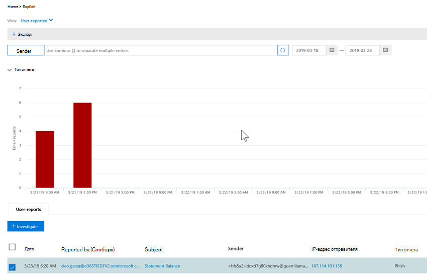

# Автоматическое исследование и реагирование (AIR) в Office 365Automated investigation and response (AIR) in Office 365

По мере инициирования оповещений системы безопасности Группа управления операциями может искать эти оповещения и принимать меры по защите Организации.As security alerts are triggered, it's up to your security operations team to look into those alerts and take steps to protect your organization. В некоторых случаях команды безопасности могут быть перегружены объемом триггерных оповещений.Sometimes, security operations teams can feel overwhelmed by the volume of alerts that are triggered. Возможности автоматического исследования и реагирования (AIR) в Office 365 могут помочь.Automated investigation and response (AIR) capabilities in Office 365 can help. Воздушный поток позволяет группе управления безопасностью работать эффективнее и эффективно.AIR enables your security operations team to operate more efficiently and effectively. Возможности воздуха включают автоматизированные процессы расследования в ответ на хорошо известные угрозы, существующие сегодня.AIR capabilities include automated investigation processes in response to well known threats that exist today. Соответствующие действия по исправлению ожидают утверждения, позволяя группе управления операциями безопасности отвечать на обнаруженные угрозы.Appropriate remediation actions await approval, enabling your security operations team to respond to detected threats. 

В этой статье представлен обзор воздуха.This article provides an overview of AIR. Когда вы будете готовы приступить к работе с AIR, ознакомьтесь со статьей [Автоматическое исследование и реагирование на угрозы в Office 365](office-365-air.md).When you're ready to get started using AIR, see [Automatically investigate and respond to threats in Office 365](office-365-air.md).

## На высоком уровнеAt a high level

При срабатывании оповещений "Playbooks" безопасности переходит в действующий.As alerts are triggered, security playbooks go into effect. В зависимости от ситуации может начаться [процесс автоматического исследования](https://docs.microsoft.com/microsoft-365/security/office-365-security/office-365-air) .Depending on the situation, an [automated investigation process](https://docs.microsoft.com/microsoft-365/security/office-365-security/office-365-air) can begin. Во время и после автоматического исследования рекомендуются [действия по исправлению](air-remediation-actions.md) .During and after an automated investigation, [remediation actions](air-remediation-actions.md) are recommended. Никакие действия не выполняются автоматически в Office 365 Advanced Threat protection.No actions are taken automatically in Office 365 Advanced Threat Protection. Команда по обеспечению безопасности выполняет проверку, а затем [утверждает или отвергает каждое действие по исправлению](air-remediation-actions.md#approve-or-reject-pending-actions), а когда это выполняется, каждое исследование завершается.Your security operations team reviews, and then [approves or rejects each remediation action](air-remediation-actions.md#approve-or-reject-pending-actions), and when this is done, each investigation completes. Все эти действия отслеживаются и доступны для просмотра в центре безопасности & безопасности Office 365 (ознакомьтесь со статьей [Просмотр сведений о расследовании](air-view-investigation-results.md#view-details-of-an-investigation)).All of these activities are tracked and viewable in the Office 365 Security & Compliance Center (see [View details of an investigation](air-view-investigation-results.md#view-details-of-an-investigation)).

В следующих разделах представлены дополнительные сведения об оповещениях, безопасности "Playbooks" и примерах воздуха в действии.The following sections provide more details about alerts, security playbooks, and examples of AIR in action.

## ОповещенияAlerts

[Оповещения](../../compliance/alert-policies.md#viewing-alerts) представляют триггеры для рабочих процессов группы операций безопасности для реагирования на инциденты.[Alerts](../../compliance/alert-policies.md#viewing-alerts) represent triggers for security operations team workflows for incident response. Приоритизация правильного набора оповещений для изучения, а отсутствие неустраненных угроз не является проблематичным.Prioritizing the right set of alerts for investigation, while making sure no threats are unaddressed is challenging. При расследовании в оповещениях выполняются вручную, поэтому группы операций безопасности должны осуществлять слежение за сущностями (например, контент, устройства и пользователей) от угроз.When investigations into alerts are performed manually, Security Operations teams must hunt and correlate entities (such as content, devices and users) at risk from threats. Такие задачи и рабочие процессы могут занимать много времени и включать несколько средств и систем.Such tasks and workflows can be very time consuming and involve multiple tools and systems. В среде AIR исследование и реагирование на события безопасности Office 365 выполняются автоматически с помощью оповещений о безопасности "Playbooks" автоматически.With AIR, investigation and response for Office 365 security events are automated by having key security and threat management alerts trigger security response playbooks automatically. 

В настоящее время для воздуха оповещения, созданные из следующих видов политик оповещений, автоматически изучены:Currently for AIR, alerts generated from the following kinds of alert policies are auto-investigated:  

- Обнаружен потенциально вредоносный URL-адрес.A potentially malicious URL click was detected
- Сообщение электронной почты, предоставленное пользователем как фишинга \*Email reported by user as phish\*
- Сообщения электронной почты, содержащие вредоносную программу, удалена после доставки \*Email messages containing malware removed after delivery\*
- Сообщения электронной почты, содержащие URL-адреса фишинга, удаленные после доставки \*Email messages containing phish URLs removed after delivery\*
- Обнаружены подозрительные шаблоны отправки электронной почты #Suspicious email sending patterns detected#
- Пользователю запрещено отправлять электронную почту. #User restricted from sending email#

> [!NOTE]
> Для оповещений, помеченных звездочкой (\*), назначаются *информационные* уровни в соответствующих политиках оповещений в центре безопасности & соответствия требованиям, если уведомления по электронной почте отключены.The alerts marked with an asterisk (\*) are assigned an *Informational* severity in the respective alert policies within the Security & Compliance Center, with email notifications turned off. Уведомления по электронной почте можно включить с помощью [настройки политики оповещений](../../compliance/alert-policies.md#alert-policy-settings).Email notifications can be turned on through [Alert policy configuration](../../compliance/alert-policies.md#alert-policy-settings). Оповещения, помеченные с помощью хэша (#), обычно доступны для общедоступной предварительной версии "Playbooks".Alerts marked with a hash (#) are generally available alerts associated with public preview playbooks.

Чтобы просмотреть оповещения, в центре безопасности & соответствия требованиям выберите **оповещения** > **Просмотр оповещений**.To view alerts, in the Security & Compliance Center, choose **Alerts** > **View alerts**. Выберите оповещение, чтобы просмотреть сведения о нем, а затем воспользуйтесь ссылкой **Просмотр расследования** , чтобы перейти к соответствующему [исследованию](air-view-investigation-results.md#investigation-graph).Select an alert to view its details, and from there, use the **View investigation** link to go to the corresponding [investigation](air-view-investigation-results.md#investigation-graph).  

> [!NOTE]
> По умолчанию информационные оповещения скрыты в представлении оповещений.Informational alerts are hidden in the alert view by default. Чтобы просмотреть их, измените фильтрацию оповещений, чтобы она включала информационные оповещения.To see them, change the alert filtering to include informational alerts.

Если ваша организация управляет оповещениями системы безопасности с помощью системы управления оповещениями, системы управления службами или системы безопасности и управления событиями (SIEM), вы можете отправлять оповещения Office 365 в систему с помощью уведомления по электронной почте или с помощью [API действий управления Office 365](https://docs.microsoft.com/office/office-365-management-api/office-365-management-activity-api-reference).If your organization manages your security alerts through an alert management system, service management system, or Security Information and Event Management (SIEM) system, you can send Office 365 alerts to that system via either email notification or via the [Office 365 Management Activity API](https://docs.microsoft.com/office/office-365-management-api/office-365-management-activity-api-reference). Уведомления об анализе с помощью электронной почты или API содержат ссылки для доступа к оповещениям в центре безопасности & соответствия требованиям, что позволяет администратору безопасности быстро перейти к расследованию.The investigation alert notifications via email or API include links to access the alerts in the Security & Compliance Center, enabling the assigned security administrator to navigate quickly to the investigation.

 

## "Playbooks" безопасностиSecurity playbooks

"Playbooks" безопасности — это внутренние политики, которые используются в сердце автоматизации в Office Advanced Threat Protection и Microsoft Threat protection.Security playbooks are back-end policies that are at the heart of automation in Office Advanced Threat Protection and Microsoft Threat Protection. "Playbooks" безопасности, предоставляемые в среде AIR, основаны на распространенных сценариях безопасности и разработаны на основе отзывов от Teams.The security playbooks provided in AIR are based on common real-world security scenarios and developed based on feedback from Security Operations teams. Стратегия безопасности запускается автоматически при активации определенных оповещений в Организации.A security playbook is launched automatically when specific alerts are triggered within your organization. После срабатывания триггера оповещения связанный стратегия запускается системой автоматического исследования и обработки ответа (AIR).Once the alert triggers, the associated playbook is run by the Automated Investigation and Response (AIR) system. В ходе анализа пошаговое руководство по анализу оповещений на основе стратегия, в котором просматриваются все связанные метаданные (включая сообщения электронной почты, пользователей, темы, отправители и т. д.).The investigation steps through analysis of the alert based on that particular alert's playbook, looking at all the associated metadata (including email messages, users, subjects, senders, etc.). В зависимости от полученных результатов исследования стратегия воздух рекомендует набор действий, которые Группа безопасности Организации может предпринять для управления и устранения угроз.Based on the investigation playbook's findings, AIR recommends a set of actions that your organization's security team can take to control and mitigate the threat. 

"Playbooks" по обеспечению безопасности, которые вы будете получать с помощью воздуха, предназначены для самых распространенных угроз, с которыми организации сталкиваются сегодня с помощью электронной почты.The security playbooks you'll get with AIR are designed to tackle the most frequent threats that organizations encounter today with email. Они основываются на входных данных из операций безопасности и команд реагирования на инциденты, в том числе те, кто помогает защищать ресурсы корпорации Майкрософт и наших клиентов.They're based on input from Security Operations and Incident Response teams, including those who help defend Microsoft and our customers' assets.

### Этапы безопасности "Playbooks"Security playbooks are rolling out in phases

Как часть воздуха, "Playbooks" безопасности — это этапы.As part of AIR, security playbooks are rolling out in phases. Этап 1 теперь доступен и включает несколько "Playbooks", предоставляющих рекомендации для действий, которые администраторы безопасности могут просматривать и утверждать:Phase 1 is now generally available and includes several playbooks that provide recommendations for actions that security administrators can review and approve:
- Сообщение о phishing-атаке, сообщенное пользователемUser-reported phish message
- URL-адрес нажмите кнопку вредоносности Change (изменить)URL click verdict change
- Вредоносная программа обнаружила пост-Delivery (вредоносный ZAP)Malware detected post-delivery (Malware ZAP)
- Антифишинг обнаружил, что после доставки ZAP (фишинг ZAP)Phish detected post-delivery ZAP (Phish ZAP)

Этап 1 также включает поддержку инициированных администратором электронных исследований (с помощью [обозревателя угроз](threat-explorer.md)).Phase 1 also includes support for administrator triggered e-mail investigations (using [Threat Explorer](threat-explorer.md)).

Этап 2 теперь работает со следующими "Playbooks" в **общедоступной предварительной версии**, предоставляя рекомендации для действий и изучая администраторов безопасности при исследовании проблем:Phase 2 is now progress with the following playbooks in **public preview**, providing recommendations for actions and aiding security administrators in investigating issues:
- Пользователь сообщил о нарушении (общедоступная Предварительная версия)User reported as compromised (public preview)

Дальнейшие "Playbooks" будут выпускаться по мере их завершения.Further playbooks will be released as they are completed. Посетите [план Microsoft 365](https://www.microsoft.com/microsoft-365/roadmap) , чтобы увидеть, что еще запланировано и скоро.Visit the [Microsoft 365 Roadmap](https://www.microsoft.com/microsoft-365/roadmap) to see what else is planned and coming soon.

### "Playbooks": исследование и рекомендацииPlaybooks include investigation and recommendations

В среде AIR каждый стратегия безопасности включает:In AIR, each security playbook includes: 
- корневое исследование объектов электронной почты (файлов, URL-адресов, получателей, IP-адресов и т. д.);a root investigation of an email's entities (files, URLs, recipients, IP addresses, etc.),
- дальнейшее Поиск похожих сообщений электронной почты, полученных Организациейfurther hunting for similar emails received by the organization 
- действия, предпринимаемые для определения и сопоставления других потенциальных угроз, а такжеsteps taken to identify and correlate other potential threats, and 
- Рекомендуемые действия по исправлению угроз.recommended threat remediation actions.

Каждый этап высокого уровня включает в себя ряд подэтапов, которые выполняются для обеспечения детального, подробного и исчерпывающего ответа на угрозы.Each high-level step includes a number of substeps that are executed to provide a deep, detailed, and exhaustive response to threats.

## Пример: сообщение фишинга, зарегистрированное пользователем, запускает расследования стратегияExample: A user-reported phish message launches an investigation playbook

Когда пользователь в Организации отправляет сообщение электронной почты и передает его в корпорацию Майкрософт с помощью [надстройки Report Message для Outlook или Outlook Web App](enable-the-report-message-add-in.md), отчет также отправляется в систему и отображается в проводнике в представлении, сообщенном пользователем.When a user in your organization submits an email message and reports it to Microsoft by using the [Report Message add-in for Outlook or Outlook Web App](enable-the-report-message-add-in.md), the report is also sent to your system and is visible in Explorer in the User-reported view. Это сообщение, сообщенное пользователем, теперь запускает системное информационное оповещение, которое автоматически запускает исследование стратегия.This user-reported message now triggers a system-based informational alert, which automatically launches the investigation playbook.

Во время корневого этапа исследования различные аспекты электронного исследования оцениваются.During the root investigation phase, various aspects of the email are assessed. Такие законодательные акты перечислены ниже.These include:
- Определение типа угрозы, который может быть таким:A determination about what type of threat it might be;
- Отправитель;Who sent it;
- Откуда отправлено сообщение (инфраструктура отправки);Where the email was sent from (sending infrastructure);
- Указывает, были ли доставляются или заблокированы другие экземпляры электронной почты;Whether other instances of the email were delivered or blocked;
- Оценка из наших аналитик;An assessment from our analysts;
- Связан ли электронная почта со всеми известными кампаниями;Whether the email is associated with any known campaigns;
- и многое другое.and more.

По завершении корневого исследования стратегия предоставляет список рекомендуемых действий, которые необходимо выполнить для исходной электронной почты и связанных с ним сущностей.After the root investigation is complete, the playbook provides a list of recommended actions to take on the original email and entities associated with it.
  
После этого выполняются некоторые этапы расследования и исследования угроз:Next, several threat investigation and hunting steps are executed:

- Аналогичные сообщения электронной почты определяются с помощью поиска в кластере электронной почты.Similar email messages are identified via email cluster searches.
- Этот сигнал используется совместно с другими платформами, например, с помощью [защитника (Майкрософт) ATP](https://docs.microsoft.com/windows/security/threat-protection/microsoft-defender-atp/microsoft-defender-advanced-threat-protection).The signal is shared with other platforms, such as [Microsoft Defender ATP](https://docs.microsoft.com/windows/security/threat-protection/microsoft-defender-atp/microsoft-defender-advanced-threat-protection).
- Определение, когда пользователи щелкают любые вредоносные ссылки в подозрительных сообщениях электронной почты.A determination is made on whether any users have clicked through any malicious links in suspicious email messages.
- Проверка выполняется в Office 365 Exchange Online Protection ([EOP](exchange-online-protection-eop.md)) и Office 365 Advanced Threat protection ([ATP](office-365-atp.md)), чтобы проверить наличие других подобных сообщений, о которых сообщили пользователи.A check is done across Office 365 Exchange Online Protection ([EOP](exchange-online-protection-eop.md)) and Office 365 Advanced Threat Protection ([ATP](office-365-atp.md)) to see if there are any other similar messages reported by users.
- Проверка того, был ли пользователь скомпрометирован.A check is done to see if a user has been compromised. Эта проверка использует сигналы в Office 365, [Microsoft Cloud App Security](https://docs.microsoft.com/cloud-app-security)и [Azure Active Directory](https://docs.microsoft.com/azure/active-directory), соотнесение со всеми связанными аномалиями действий пользователей.This check leverages signals across Office 365, [Microsoft Cloud App Security](https://docs.microsoft.com/cloud-app-security), and [Azure Active Directory](https://docs.microsoft.com/azure/active-directory), correlating any related user activity anomalies. 

Во время фазы Поиск риски и угрозы назначаются для различных шагов по поиску.During the hunting phase, risks and threats are assigned to various hunting steps. 

Исправление является завершающим этапом стратегия.Remediation is the final phase of the playbook. На этом этапе выполняются действия по исправлению, основанные на этапах расследования и исследования.During this phase, remediation steps are taken, based on the investigation and hunting phases. 

## Пример: администратор безопасности инициирует исследование в обозревателе угрозExample: A security administrator triggers an investigation from Threat Explorer

В дополнение к автоматическому расследованию, которое инициируется оповещением, Группа операций безопасности в Организации может инициировать автоматическое исследование из представления в [обозревателе угроз](threat-explorer.md).In addition to automatic investigations that are triggered by an alert, your organization's security operations team can trigger an automatic investigation from a view in [Threat Explorer](threat-explorer.md).

Например, предположим, что вы просматриваете данные в проводнике о сообщениях, сообщенных пользователями.For example, suppose that you are viewing data in Explorer about user-reported messages. Вы можете выбрать элемент в списке результатов, а затем нажать кнопку **исследовать** в меню Действие (предполагается, что у вас есть соответствующие разрешения на обновление).You can select an item in the list of results, and then click **Investigate** from the action menu (assuming you have appropriate remediation permissions).

В качестве другого примера предположим, что вы просматриваете данные о сообщениях электронной почты, обнаруженных как содержащие вредоносные программы, и обнаружено несколько сообщений электронной почты, содержащих вредоносные программы.As another example, suppose you are viewing data about email messages detected as containing malware, and there are several email messages detected as containing malware. Можно выбрать вкладку **Электронная почта** , выбрать одно или несколько сообщений электронной почты, а затем в меню **действия** выберите команду **исследовать**.You can select the **Email** tab, select one or more email messages, and then, on the **Actions** menu, select **Investigate**. 

Как и в "Playbooks", вызванных оповещением, автоматическое исследование, запущенное из представления в проводнике, включает в себя корневое исследование, действия по определению и корреляции угроз, а также Рекомендуемые действия по устранению этих угроз.Similar to playbooks triggered by an alert, automatic investigations that are triggered from a view in Explorer include a root investigation, steps to identify and correlate threats, and recommended actions to mitigate those threats.

## Дальнейшие действияNext steps

- [Начало работы с AIR в Office 365Get started using AIR in Office 365](office-365-air.md)

- [Посетите план Microsoft 365, чтобы узнать, что скоро ожидается и как выполняется развертывание.Visit the Microsoft 365 Roadmap to see what's coming soon and rolling out](https://www.microsoft.com/microsoft-365/roadmap?filters=)

