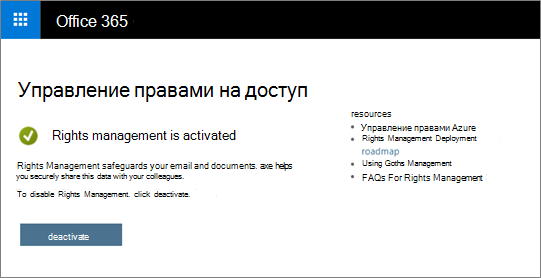

# <a name="protection-features-in-azure-information-protection-rolling-out-to-existing-tenants"></a>Функции защиты в Azure Information Protection выходят из существующих клиентов

Для получения справки по начальному этапу защиты данных, начиная с июля 2018 все подходящие клиенты, соответствующие требованиям Azure Information Protection, будут иметь функции защиты в Azure Information Protection, включенные по умолчанию. Функции защиты в Azure Information Protection ранее были известны в Office 365 как Rights Management или Azure RMS. Если у вашей организации есть план обслуживания Office E3 или более высокий план обслуживания, вы получите головной офис, чтобы защитить информацию с помощью Azure Information Protection при выполнении этих функций.

## <a name="changes-beginning-july-1-2018"></a>Изменения, начиная с 1 июля, 2018

Начиная с 1 июля 2018 г. Корпорация Майкрософт включит функцию защиты в Azure Information Protection для всех организаций с одним из следующих планов подписки:

- Шифрование сообщений Office 365 предлагается в составе Office 365 E3 и "3: E3", Microsoft E3 и "\", Office 365 a1, A3 и A5, а также Office 365 G3 и G5. Дополнительные лицензии не требуются для получения новых возможностей защиты на базе Azure Information Protection.

- Вы также можете добавить план Azure Information Protection (план 1) в следующие планы, чтобы получить новые возможности шифрования сообщений Office 365: Exchange Online (план 1), Exchange Online (план 2), Office 365 F1, Microsoft 365 бизнес базовый, Microsoft 365 Business Standard или Office 365 Enterprise E1.

- Для каждого из пользователей, использующих шифрование сообщений Office 365, необходимо лицензироваться с помощью этой функции.

- Полный список приведен в [описании служб Exchange Online](https://docs.microsoft.com/office365/servicedescriptions/exchange-online-service-description/exchange-online-service-description) для шифрования сообщений Office 365.

Администраторы клиентов могут проверить состояние защиты на портале администрирования Office 365.



## <a name="why-are-we-making-this-change"></a>Почему мы внесены изменения?

Шифрование сообщений Office 365 использует возможности защиты в Azure Information Protection. В основе последних улучшений, связанных с шифрованием сообщений Office 365 и нашими сведениями о широких вложениях в систему защиты информации в Microsoft 365, мы упростили включение и использование наших возможностей защиты, так как в этом случае трудно настроить технологии шифрования. Включив функции защиты в Azure Information Protection по умолчанию, вы можете быстро приступить к защите конфиденциальных данных.

## <a name="does-this-impact-me"></a>Это повлияет на меня?

Если ваша организация приобрела подходящие лицензии на Office 365, это изменение повлияет на ваш клиент.

 **ВНИМАНИЕ!** Если вы используете службы управления правами Active Directory (AD RMS) в локальной среде, вам следует либо отказаться от этого изменения немедленно, либо перенести его в Azure Information Protection, прежде чем мы истечением этого изменения в течение следующих 30 дней. Сведения о том, как отказаться от использования AD RMS, как отказаться от использования AD RMS. Далее в этой статье. Если вы предпочитаете перенос, ознакомьтесь со статьей [Миграция из AD RMS в Azure Information Protection.](https://docs.microsoft.com/azure/information-protection/plan-design/migrate-from-ad-rms-to-azure-rms)

## <a name="can-i-use-azure-information-protection-with-active-directory-rights-management-services-ad-rms"></a>Можно ли использовать Azure Information Protection со службами Active Directory Rights Management (AD RMS)?

Нет. Это не поддерживаемый сценарий развертывания. Не изменяя дополнительные шаги, некоторые компьютеры могут автоматически начать использовать службу управления правами Azure, а также подключиться к кластеру службы управления правами Active Directory. Этот сценарий не поддерживается и содержит недостоверные результаты, поэтому важно отказаться от этого изменения в течение следующих 30 дней, прежде чем мы разбирали новые функции. Сведения о том, как отказаться от использования AD RMS, как отказаться от использования AD RMS. Далее в этой статье. Если вы предпочитаете перенос, ознакомьтесь со статьей [Миграция из AD RMS в Azure Information Protection.](https://docs.microsoft.com/azure/information-protection/plan-design/migrate-from-ad-rms-to-azure-rms)

## <a name="how-do-i-know-if-im-using-ad-rms"></a>Как узнать, используется ли AD RMS?

Используйте приведенные ниже инструкции [, чтобы подготовить среду для управления правами Azure, если у вас также есть служба управления правами Active Directory (AD RMS)](https://docs.microsoft.com/azure/information-protection/deploy-use/prepare-environment-adrms) для проверки наличия развертывания службы управления правами Active Directory:

1. Несмотря на то, что дополнительные развертывания службы управления правами Active Directory публикуют точку подключения службы (SCP) в Active Directory, чтобы компьютеры домена могли обнаружить кластер AD RMS.

Используйте команду ADSI Edit, чтобы узнать, есть ли в Active Directory SCP, опубликованные в Active Directory: CN = Configuration [имя сервера], CN = Services, CN = Ригхтсманажементсервицес, CN = SCP

2. Если вы не используете точку подключения службы, то компьютеры с Windows, подключающиеся к кластеру AD RMS, должны быть настроены на обнаружение служб на стороне клиента или на перенаправление лицензирования с помощью реестра Windows: HKEY_LOCAL_MACHINE \Софтваре\микрософт\мсипк\сервицелокатион или HKEY_LOCAL_MACHINE \SOFTWARE\Wow6432Node\Microsoft\MSIPC\ServiceLocation

Для получения дополнительных сведений об этих конфигурациях реестра, ознакомьтесь со статьей [Включение обнаружения служб на стороне клиента с помощью реестра Windows](https://docs.microsoft.com/azure/information-protection/rms-client/client-deployment-notes#enabling-client-side-service-discovery-by-using-the-windows-registry) и [перенаправления трафика сервера лицензирования](https://docs.microsoft.com/azure/information-protection/rms-client/client-deployment-notes#redirecting-licensing-server-traffic).

## <a name="i-use-ad-rms-how-do-i-opt-out"></a>Как отказаться от использования AD RMS?

Чтобы отказаться от предстоящего изменения, выполните указанные ниже действия.

1. С помощью рабочей или учебной учетной записи с разрешениями глобального администратора в Организации запустите сеанс Windows PowerShell и подключитесь к Exchange Online. Инструкции см. в статье [Подключение к Exchange Online PowerShell](https://docs.microsoft.com/powershell/exchange/exchange-online/connect-to-exchange-online-powershell/connect-to-exchange-online-powershell).

2. Выполните командлет Set – IRMConfiguration, используя следующий синтаксис:

  ```powershell
  Set-IRMConfiguration -AutomaticServiceUpdateEnabled $false
  ```

## <a name="what-can-i-expect-after-this-change-has-been-made"></a>Что можно ожидать после внесения этого изменения?

Если этот параметр включен, то вы можете начать использовать новую версию Office 365 Message Encryption, которая была объявлена в [Microsoft Ignite 2017](https://techcommunity.microsoft.com/t5/Security-Privacy-and-Compliance/Email-Encryption-and-Rights-Protection/ba-p/110801) и использует возможности шифрования и защиты Azure Information Protection.


Более подробную информацию о новых возможностях можно узнать в статье [Шифрование сообщений в Office 365](../../compliance/ome.md).
