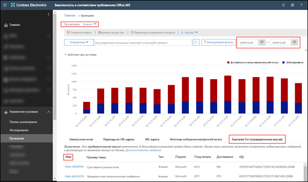
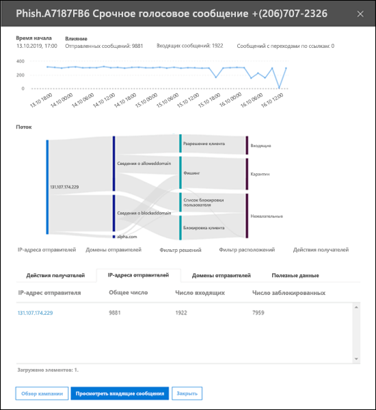
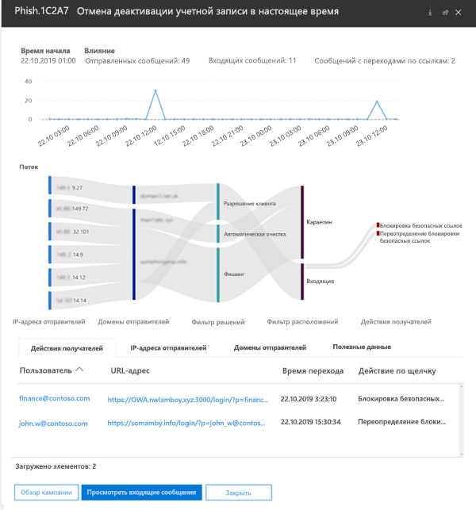

# Представления кампаний в Office 365 ATPCampaign Views in Office 365 ATP

> [!NOTE]
> Возможности, описанные в этой статье, в настоящее время доступны в предварительной версии и могут изменяться.The features described in this article are currently in preview and subject to change.

Представления кампаний — это функция службы Advanced Threat Protection (ATP) в Центре безопасности и соответствия требованиям Office 365, которая определяет и классифицирует фишинговые атаки в службе.Campaign Views is a feature in Advanced Threat Protection (ATP) in the Office 365 Security & Compliance Center that identifies and categorizes phishing attacks in the service. Представления кампаний помогают:Campaign Views can help you to:

- эффективно анализировать фишинговые атаки и отвечать на них;Efficiently investigate and respond to phishing attacks.

- точнее устанавливать область, затронутую атакой;Better understand the scope of the attack.

- демонстрировать проблему лицам, ответственным за принятие решений.Show value to decision makers.

Представления кампаний позволяют быстрее и полнее получить общую картину атаки.Campaign Views lets you see the big picture of an attack faster and more complete than any human.

## Что такое кампания?What is a ToolTip?

Кампания — это скоординированная атака по электронной почте, направленная против одной или нескольких организаций.A campaign is a coordinated email attack against one or many organizations. На сегодняшний день атаки по электронной почте с целью украсть учетные данные и данные компании — это большой и прибыльный бизнес.Today, email attacks that steal credentials and company data are a big and lucrative business. По мере того, как совершенствуются технологии защиты от атак, злоумышленникам приходится менять свои методы, чтобы добиться продолжительного успеха.As technologies increase in an effort to stop attacks, attackers are sophisticated enough to modify their methods in an effort to ensure continued success.

Для выявления кампаний корпорация Майкрософт применяет во всех компонентах службы Office 365 во всем мире разнообразные данные и механизмы защиты от фишинга, спама и вредоносных программ.Microsoft leverages the vast amounts of anti-phishing, anti-spam, and anti-malware data and experience across the entire Office 365 service world-wide to identify campaigns. Информация об атаке анализируется и систематизируется с учетом ряда факторов.The attack information is analyzed and classified according to several factors. Пример:For example:

- **Источник атаки**: исходные адреса и домены электронной почты отправителя.**Attack source**: Source IP addresses and sender email domains.

- **Свойства сообщения атаки**: содержание, стиль и тон сообщений, выражающих атаку.**Attack message properties**: The content, style, and tone of the attack messages.

- **Объекты атаки**: домены получателей, должности получателей (администраторы, руководители и т. д.), типы компаний (крупные, мелкие, государственные, частные и т. д.) и отрасли.**Attack recipients**: Recipient domains, recipient job functions (admins, executives, etc.), company types (large, small, public, private, etc.), and industries.

- **Полезная нагрузка атаки**: вредоносные ссылки, вложения или другие данные.**Attack payload**: Malicious links, attachments, or other payloads.

## Представления кампаний в Центре безопасности и соответствия требованиям Office 365Permissions in the Office 365 Security & Compliance Center

Представления кампаний доступны в следующих разделах [Центра безопасности и соответствия требованиям](https://docs.microsoft.com/microsoft-365/compliance/go-to-the-securitycompliance-center):Campaign Views is available in the [Security & Compliance Center](https://docs.microsoft.com/microsoft-365/compliance/go-to-the-securitycompliance-center) at the following locations:

- **Управление угрозами** \> **Обозреватель** \> **Вид** \> **Фишинг** \> **Top campaign (предварительная версия)****Threat management** \> **Explorer** \> **View** \> **Phish** \> **Top campaign (Preview)**

- **Управление угрозами** \> **Обозреватель** \> **Вид** \> **Вся почта** \> **Top campaign (предварительная версия)****Threat management** \> **Explorer** \> **View** \> **All email** \> **Top campaign (Preview)**

> [!TIP]
> В настоящее время доступна только фильтрация по диапазону дат.Currently, the only filtering that's available is the date range. Если вы не видите данные кампаний, попробуйте изменить диапазон дат.If you don't see any campaign data, try changing the date range.

На странице обзора приведена следующая информация о кампании.The overview page shows the following information about the campaign:

- **Название****Name**

- **Образец темы**: строка темы одного из сообщений кампании.**Sample subject**: The subject line of one of the messages in the campaign. Учтите, что не у _всех_ сообщений в кампании обязательно будет такая же строка темы.Note that _all_ the messages in the campaign will not necessarily have this same subject line.

- **Тип**: в настоящее время используется только тип **Фишинг**.**Type**: Currently, this value will always be **Phish**.

- **Подтип**: при наличии — бренд, который подвергается фишингу в этой кампании.**Subtype**: Where available, the brand that is being phished by this campaign. Если при обнаружении кампании используется технология ATP, перед подтипом ставится префикс **ATP-**.When the detection is driven by ATP technology, the prefix **ATP-** is added to the subtype value.

- **Получатели**: количество пользователей, которые подверглись этой кампании.**Recipients**: The number of users that were targeted by this campaign.

- **Доставлено**: количество пользователей, в почтовые ящики которых пришли сообщения этой кампании.**Delivered**: The number of users that received messages from this campaign into their Inbox.

- **ID**: уникальный идентификатор кампании.**ID**: A unique identifier for the campaign.

Если щелкнуть название кампании, в всплывающем окне выводятся сведения о кампании.When you click on the name of a campaign, the campaign details appears in a flyout.

## Сведения о кампанииCampaign details

В окне сведений о кампании представлена очень подробная информация о кампании.In the campaign details view, a lot of information is available about the campaign:

- Информация о кампанииCampaign information:

  - **ID**: уникальный идентификатор кампании, указанный на экране обзора.**ID**: The same unique identifier of the campaign from the overview screen.

  - **Начало** и **Окончание**: выбранный диапазон данных.**Started** and **Ended**: the date range filter you selected.

  - **Влияние**: количество сообщений, отправленных в течение выбранного диапазона дат, сколько сообщений пришло в почтовые ящик и сколько пользователей перешло по URL-адресу, приведенному в фишинговом сообщении.**Impact**: the number of messages sent in the date range you selected, how many were "inboxed" (that is, delivered to the Inbox), and how many users clicked on the URL payload in the phishing message.

  - Временная шкала активности кампании: когда кампания была начата и закончена и изменение объема сообщений со временем.A timeline of campaign activity: When the campaign started and ended, and the volume of messages over time.

### Ход кампанииCampaign flow

Важные сведения о кампании представлены на горизонтальной блок-схеме (так называемой схеме _Sankey_) в разделе **Поток**.Important details about the campaign are presented in a horizontal flow diagram (known as a _Sankey_ diagram) in the **Flow** section. Эти сведения помогут вам изучить элементы кампании и ее потенциальное влияние на вашу организацию.These details will help you to understand the elements of the campaign and the potential impact in your organization.

Если навести указатель мыши на горизонтальную полоску на схеме, будет показано количество связанных с ней сообщений (например, сообщений с определенного исходного IP-адреса, сообщения из исходного IP-адреса с использованием указанного домена отправителя и т. д.).If you hover over a horizontal band in the diagram, you'll see the number of related messages (for example, messages from a particular source IP, messages from the source IP using the specified sender domain, etc.).

Схема содержит следующую информацию.The entry contains the following information:

- **IP-адреса отправителей****Sender IPs**

- **Домены отправителей****Sender domains**

- **Выводы по фильтрам**: эти значения относятся к выводам по доступным фильтрам против фишинга и спама, описанным в статье [Заголовки сообщений по защите от нежелательной почты](anti-spam-message-headers.md).**Filter verdicts**: The values here are related to the available anti-phishing and anti-spam filter verdicts as described in [Anti-spam message headers](anti-spam-message-headers.md). Большой интерес здесь представляют значения **Разрешение клиента**, которые показывают, что настройка, заданная в организации, разрешила пропустить сообщение, которое иначе было бы заблокировано службой (например, домен в списке "Разрешенные отправители").Of great interest here are the values **Tenant Allow**, which means a configured setting in the organization allowed a message through that would have been otherwise blocked by the service (for example, a domain in the Allowed Senders list).

  - **Блокировка клиента**: это значение показывает, что настройка в вашей организации (например, запись в списке [Заблокированные отправители](create-block-sender-lists-in-office-365.md)) позволила как обнаружить сообщение, так и определить, куда оно было доставлено.**Tenant Block**: This value indicates that a setting in your organization (for example, a domain entry in the [Blocked Senders list](create-block-sender-lists-in-office-365.md)) both detected the message and determined where it was delivered. Для сообщений, которые не были помещены в карантин, проверьте настройки заблокированных отправителей, чтобы определить, почему сообщение было доставлено.For messages that weren't quarantined, review your blocked senders settings to determine why the message was delivered.

  - **Обнаружено****Detected app**

  - **Разрешение клиента****Tenant Allow**

- **Места доставки**: скорее всего, вы захотите исследовать сообщения, которые действительно были доставлены получателям (в папку "Входящие" или в папку "Нежелательная почта"), даже если пользователи не переходили по URL-адресам, указанным в сообщении.**Delivery locations**: You'll likely want to investigate messages that were actually delivered to recipients (either to the Inbox or the Junk Email folder), even if users didn't click on the payload URL in the message. Вы также можете удалять сообщения из [карантина сообщений электронной почты в Office 365](quarantine-email-messages.md).You can also remove the quarantined messages from [Quarantine email messages in Office 365](quarantine-email-messages.md).

  - **Нежелательная почта****Junk folder**

  - **Карантин****Quarantine**

  - **Входящие****Inbox**

#### Переходы по URL-адресуURL clicks

Всегда есть вероятность, что пользователь предпримет действия с сообщениями, доставленными в его папку "Входящие" или "Нежелательная почта" (то есть щелкнет вредоносный URL-адрес в сообщении).There's always the chance that messages delivered to the recipient's Inbox or Junk Email folder can be acted upon by the user (that is, user will click on the malicious URL in the message). Если пользователь ничего не делал, это уже небольшой успех, но вам определенно нужно установить, почему вообще вредоносное сообщение попало в почтовый ящик.If they haven't, that's a small measure of success, although you certainly need to determine why the harmful message was delivered to their mailbox in the first place.

Если пользователь щелкнул вредоносный URL-адрес, действия отображаются в области **Переходы по URL-адресу** на схеме.If a user has clicked on the malicious URL, the actions are displayed in the **URL clicks** area of the diagram.

- **Блокировка безопасных ссылок**: это значение показывает, что получатель щелкнул URL-адрес в сообщении, но он был заблокирован политиками [Безопасные ссылки ATP](atp-safe-links.md) вашей организации.**Safe Links Block**: This value indicates the recipient clicked on the payload URL in the message, but it was blocked by the [ATP Safe Links](atp-safe-links.md) policies in your organization.

- **Отмена блокировки безопасных ссылок**: это значение также указывает, что получатель щелкнул URL-адрес в сообщении, политики «Безопасные ссылки ATP» попытались остановить его, но им было разрешено отменить блокировку.**Safe Links Block Override**: This value also indicates the recipient clicked on the payload URL in the message, ATP Safe Links tried to stop them, but they were allowed to override the block. Необходимо изучить ваши политики [Безопасные ссылки](set-up-atp-safe-links-policies.md) и узнать, почему пользователям разрешено отменять выводы "Безопасных ссылок" и переходить по вредоносным URL-адресам.You need to investigate your [Safe Links policies](set-up-atp-safe-links-policies.md) to see why users are allowed to override the Safe Links verdict and click on malicious URLs.

### ВкладкиTabs

Представление сведений о кампании содержит несколько вкладок, с помощью которых можно более подробно изучить кампанию.There are several tabs in the campaign details view that allow you to further investigate the campaign.

- **Переходы по URL-адресу**: если пользователь не перешел по URL-адресу в фишинговом сообщении, этот раздел будет пустым.**URL Clicks**: If the payload URL in the phishing message wasn't clicked, this section will be blank. Если пользователь мог перейти по URL-адресу,If a user was able to click on the URL, you

  - **Пользователь**\*User

  - **URL**\*URL

  - **Время перехода****Click Time**

  - **Действие перехода**Click **Action**.

- **IP-адреса отправителей****Sender IPs**

  - **IP-адрес отправителя**\***Sender IP**\*

  - **Общее количество****Total Count**

  - **Полученное количество****Inboxed Count**

  - **Заблокированное количество****Blocked Count**

  - **Прошли SPF****SPF Passed**

- **Отправители****Senders**

  - **Отправитель****Sender**

  - **Общее количество****Total Count**

  - **Полученное количество****Inboxed Count**

  - **Заблокированное количество****Blocked Count**

  - **Прошли DKIM****DKIM Passed**

  - **Прошли DMARC****DMARC Passed**

- **Полезная нагрузка****Payloads**

  - **URL**\*URL

  - **Общее количество****Total Count**

\* Если щелкнуть это значение, в верхней части представления сведений о кампании откроется новое всплывающее окно с более подробными сведениями об указанном элементе (пользователь, URL-адрес и т. д.)\* Clicking on this value opens a new flyout that contains more details about the specified item (user, URL, etc.) on top of the campaign details view. Чтобы вернуться в представление сведений о кампании, нажмите кнопку **Готово** в новом всплывающем окне.To return to the campaign details view, click **Done** in the new flyout.

### КнопкиButtons

Кнопки в представлении сведений о кампании позволяют использовать возможности обозревателя угроз для дальнейшего изучения кампании.The buttons in the campaign details view allow you to use the power of Threat Explorer to further investigate the campaign.

- **Изучение кампании**: открывает новую вкладку поиска обозревателя угроз со значением **ID кампании** в качестве поискового фильтра.**Explore campaign**: Opens a new Threat Explorer search tab using the **Campaign ID** value as the search filter.

- **Изучение входящих сообщений**: открывает новую вкладку поиска обозревателя угроз с **ID кампании** и **Место доставки: Входящие** в качестве поискового фильтра.**Explore Inbox messages**: Opens a new Threat Explorer search tab using the **Campaign ID** and **Delivery location: Inbox** as the search filter.
