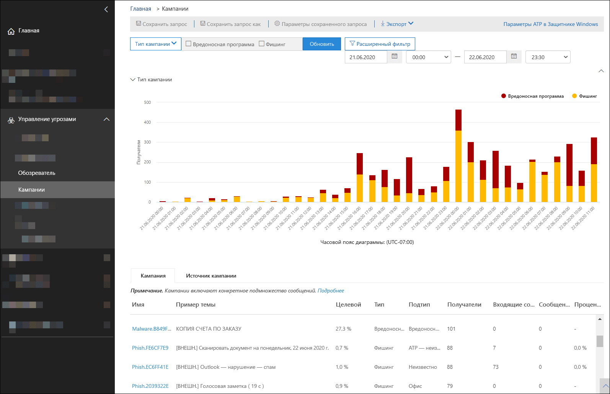
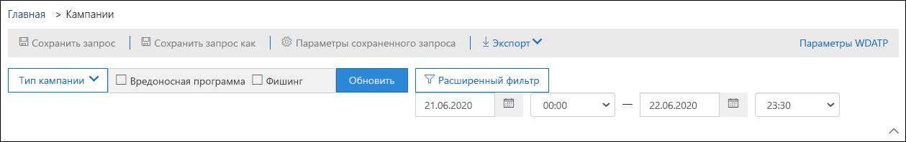
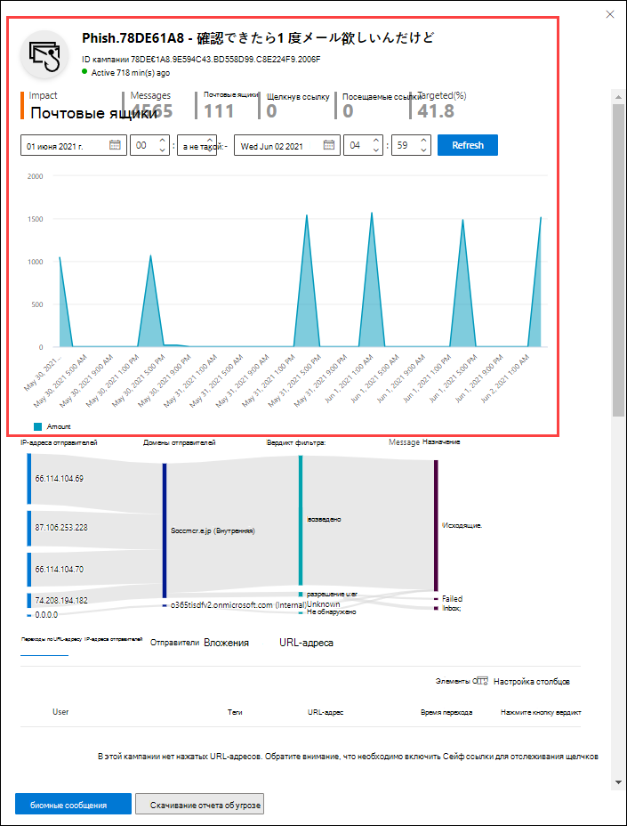
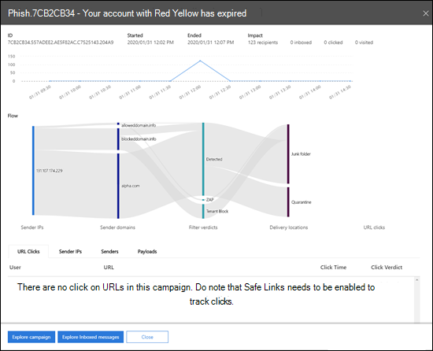

# Представления кампаний в Microsoft Defender для Office 365

[!INCLUDE [Microsoft 365 Defender rebranding](../includes/microsoft-defender-for-office.md)]

**Область применения**
- [Microsoft Defender для Office 365 (план 2)](https://go.microsoft.com/fwlink/?linkid=2148715)

Представления кампаний — это функция в Microsoft Defender для Office 365 (план 2) (например, Microsoft 365 E5 или организации с надстройки "Защитник для Office 365 план 2"). Представления кампаний в Центре & соответствия требованиям определяют и классифицируют фишинговые атаки в службе. Представления кампаний помогают:

- эффективно анализировать фишинговые атаки и отвечать на них;
- точнее устанавливать область, затронутую атакой;
- демонстрировать проблему лицам, ответственным за принятие решений.

Представления кампаний позволяют быстрее и полнее получить общую картину атаки.

## Что такое кампания?

Кампания — это скоординированная атака по электронной почте, направленная против одной или нескольких организаций. Атаки с электронной почтой, которые похищают учетные данные и данные компании, являются крупной и финансовой отрасли. По мере того как технологии увеличивают попытки остановить атаки, злоумышленники изменяют свои методы в целях обеспечения дальнейшего успеха.

Корпорация Майкрософт использует большое количество данных о защите от фишинга, нежелательной почты и вредоносных программ во всей службе для идентификации кампаний. Мы анализируем и классифицируем информацию об атаке в соответствии с несколькими факторами. Например:

- **Источник атаки:** исходные IP-адреса и домены электронной почты отправитель.
- **Свойства сообщения:** содержимое, стиль и тон сообщений.
- **Получатели сообщений:** связи получателей. Например, домены получателей, функции задания получателей (администраторы, руководители и т. д.), типы компаний (большие, малые, общедоступные, частные и т. д.) и отрасли.
- **Полезной нагрузки атаки:** вредоносные ссылки, вложения и другие полезной нагрузки в сообщениях.

Кампания может быть кратковременной или может охватывать несколько дней, недель или месяцев с активными и неактивными периодами. Кампания может быть запущена для конкретной организации или может быть частью более крупной кампании в нескольких компаниях.

## Представления кампаний в Центре безопасности & соответствия требованиям

Представления кампаний доступны в Центре [безопасности & соответствия](https://protection.office.com) требованиям в **рамках** кампаний по управлению угрозами или непосредственно \> в <https://protection.office.com/campaigns> .

Вы также можете попасть в представления кампании из:

- **Управление угрозами** \> **Проводник** \> **Представление** \> **Кампании**
- **Управление угрозами** \> **Проводник** \> **Представление** \> **Все сообщения электронной почты** \> **Вкладка кампании**
- **Управление угрозами** \> **Проводник** \> **Представление** \> **Фишинг** \> **Вкладка кампании**
- **Управление угрозами** \> **Проводник** \> **Представление** \> **Вредоносная программа** \> **Вкладка кампании**

Для доступа к представлениям кампании необходимо быть членом группы  ролей "Управление организацией", "Администратор безопасности" или "Читатель безопасности" в Центре безопасности & соответствия требованиям. Дополнительные сведения см. в статье [Разрешения в Центре безопасности и соответствия требованиям](permissions-in-the-security-and-compliance-center.md).

## Обзор кампаний

На странице обзора показаны сведения обо всех кампаниях.

На вкладке **"Кампания"** по умолчанию в области "Тип **кампании"** показан график с числом получателей в день. По умолчанию на графике показаны как данные **о фишинге,** так и **о вредоносных** программах.

> [!TIP]
> Если вы не видите данных кампании, попробуйте изменить диапазон дат или [фильтры.](#filters-and-settings)

На остальной странице обзора показаны следующие сведения на вкладке **"Кампания":**

- **Название**

- **Образец темы**: строка темы одного из сообщений кампании. Обратите внимание, что тема всех сообщений в кампании не обязательно будет одинаковой.

- **Targeted**: процент, вычисляемой по: (количество получателей кампании в организации) / (общее количество получателей в кампании во всех организациях в службе). Это значение указывает степень, в которой кампания направляется только в вашу организацию (более высокое значение) по сравнению с другими организациями в службе (более низкое значение).

- **Type**: This value is either **Phish** or **Malware**.

- **Подтип:** это значение содержит дополнительные сведения о кампании. Например:
  - **Фишинг**: где доступно, бренд, который фишингуется в рамках этой кампании. Например, `Microsoft` , `365` `Unknown` , , , , `Outlook` или `DocuSign` .
  - **Вредоносная** программа: например, `HTML/PHISH` или `HTML/<MalwareFamilyName>` .

  Там, где это доступно, бренд, который фишингуется в рамках этой кампании. Когда обнаружение управляется технологией Defender для Office 365, префикс **ATP добавляется** к значению подтипа.

- **Получатели**: количество пользователей, которые подверглись этой кампании.

- **Входящие:** количество пользователей, которые получили сообщения от этой кампании в папке "Входящие" (не доставлено в папку нежелательной почты).

- **Clicked**: the number of users that clicked on the URL or opened the attachment in the phishing message.

- **Click rate**: The percentage as calculated by "**Clicked**  /  **Inboxed**". Это значение является индикатором эффективности кампании. Другими словами, если получатели могли определить сообщение как фишинговое и не щелкнули URL-адрес полезной нагрузки.

  Обратите **внимание, что в кампаниях** по вредоносным программам не используется скорость щелчка.

- **Visited**: how many users actually made it through to the payload website. Если имеются **значения "Щелчок",** но безопасные ссылки блокируют доступ к веб-сайту, это значение будет нулем.

На **вкладке "Источник** кампании" показаны источники сообщений на карте мира.

### Фильтры и параметры

В верхней части страницы "Представления кампании" имеется несколько параметров фильтра и запросов, которые помогут найти и изолировать определенные кампании.

Самая базовая фильтрация— это дата и время начала и даты и времени окончания.

Чтобы отфильтровать представление, можно сделать одно свойство с несколькими  значениями, нажав кнопку "Тип кампании", сделав выбор и нажав кнопку **"Обновить".**

Свойства фильтруемой кампании,  доступные в кнопке "Тип кампании", описаны в следующем списке:

- **Базовая:**
  - **Тип кампании:** выберите **вредоносное ПО** или **фишинг.** Очистка выбранных окна имеет тот же результат, что и выбор обоих.
  - **Имя кампании**
  - **Подтип кампании**
  - **Sender**
  - **Получатели**
  - **Домен отправителя**
  - **Тема**
  - **Имя файла вложения**
  - **Семейство вредоносных программ**
  - **Теги**: пользователи или группы, к которых был применен указанный тег пользователя (включая учетные записи с приоритетом). Дополнительные сведения о тегах пользователей см. в [тегах пользователей.](user-tags.md)
  - **Переопределения системы**
  - **Действие доставки**
  - **Дополнительное действие**
  - **Направление**
  - **Технология обнаружения**
  - **Исходное расположение доставки**
  - **Последнее место доставки**
  - **Переопределения системы**

- **Дополнительные:**
  - **Internet message ID**: Available in the **Message-ID** header field in the message header. Пример значения : `<08f1e0f6806a47b4ac103961109ae6ef@server.domain>` (обратите внимание на угловые скобки).
  - **ИД сетевого** сообщения: значение GUID, доступное в поле **X-MS-Exchange-Organization-Network-Message-Id** в заголке сообщения.
  - **IP-адрес отправителя**
  - **Вложение SHA256**: чтобы найти значение hash SHA256 для файла в Windows, в командной области запустите следующую команду: `certutil.exe -hashfile "<Path>\<Filename>" SHA256` .
  - **ИД кластера**
  - **ИД политики оповещений**
  - **Сигнал URL-адреса ZAP**

- **URL-адреса:**
  - **Домен URL-адреса**
  - **Домен и путь URL-адреса**
  - **URL-адрес**
  - **URL-путь**
  - **Click verdict**

Для более подробной фильтрации, включая фильтрацию по нескольким  свойствам, можно нажать кнопку "Расширенный фильтр", чтобы создать запрос. Доступны те же свойства кампании, но со следующими улучшениями:

- Можно нажать **кнопку "Добавить условие",** чтобы выбрать несколько условий.
- Можно выбрать оператор **"И"** или **"Или"** между условиями.
- Вы можете выбрать элемент **группы условий** в нижней части списка условий, чтобы создать сложные составные условия.

После завершения нажмите кнопку **"Запрос".**

После создания базового или более простого фильтра его можно сохранить с помощью запроса **"Сохранить"** или **"Сохранить как".** Позже, когда вы вернетесь в представления кампании, можно загрузить сохраненный фильтр, щелкнув параметры **сохраненных запросов.**

Чтобы экспортировать график или список  кампаний, щелкните "Экспорт" и выберите "Экспорт данных **диаграммы"** или **"Экспортировать список кампаний".**

Если у вас есть подписка на Microsoft Defender для конечной точки, вы можете щелкнуть "Параметры **MDE",** чтобы подключить или отключить сведения о кампаниях с Помощью Microsoft Defender для конечной точки. Дополнительные сведения см. в теме ["Интеграция Microsoft Defender для Office 365 с Microsoft Defender для конечной точки".](integrate-office-365-ti-with-wdatp.md)

## Сведения о кампании

При нажатии имени кампании сведения о кампании отображаются во flyout.

### Сведения о кампании

В верхней части представления сведений о кампании доступны следующие сведения о кампании:

- **Идентификатор:** уникальный идентификатор кампании.

- **Started** and **Ended**: the start date and end date of the campaign. Обратите внимание, что эти даты могут расширяться дальше, чем даты фильтра, выбранные на странице обзора.

- **Влияние:** этот раздел содержит следующие данные для выбранного фильтра диапазона дат (или выбранного на временной шкале):
  - Общее количество получателей.
  - Количество сообщений, отправленных в папку "Входящие" (то есть доставленных в папку "Входящие", а не в папку нежелательной почты).
  - Сколько пользователей щелкнули полезное количество URL-адресов в фишинговом сообщении.
  - Сколько пользователей посетили URL-адрес.

- **Targeted**: процент, вычисляемой по: (количество получателей кампании в организации) / (общее количество получателей в кампании во всех организациях в службе). Обратите внимание, что это значение вычисляется за весь жизненный срок кампании и не меняется в зависимости от фильтров дат.

- Интерактивная временная шкала действий кампании: на временной шкале показаны действия за весь жизненный срок кампании. По умолчанию затененные области содержит фильтр диапазона дат, выбранный в обзоре. Вы можете щелкнуть и перетащить, чтобы выбрать определенную точки начала и конечной точки, что изменит данные, отображавшиеся в области <u>влияния,  </u>а также на остальной части страницы, как описано в следующих разделах.

В заголовке панели можно  щелкнуть значок записи кампании скачивания для скачивания сведений о кампании в документ Word (по умолчанию с именем  CampaignReport.docx). Обратите внимание, что скачивание содержит сведения за весь период кампании (а не только выбранные вами даты фильтра).

### Ход кампании

В середине представления сведений о кампании важные сведения о кампании представлены в разделе **Flow** на горизонтальной схеме потока (известной как схема _sankey)._ Эти сведения помогут вам изучить элементы кампании и ее потенциальное влияние на вашу организацию.

> [!TIP]
> Информация, отображаемая на схеме **Flow,** управляется затеняемого диапазона дат на временной шкале, как описано в предыдущем разделе.

Если навести указатель мыши на горизонтальную полоску на схеме, будет показано количество связанных с ней сообщений (например, сообщений с определенного исходного IP-адреса, сообщения из исходного IP-адреса с использованием указанного домена отправителя и т. д.).

Схема содержит следующую информацию.

- **IP-адреса отправителей**
- **Домены отправителей**
- **Решения фильтра:** значения заключение связаны с доступными решениями фильтрации фишинга и нежелательной почты, как описано в заглавных сообщениях защиты от [нежелательной почты.](anti-spam-message-headers.md) Доступные значения описаны в следующей таблице:

  ****

  |Значение|Решение фильтра нежелательной почты|Описание|
  |---|---|---|
  |**Разрешено**|`SFV:SKN` 
 `SFV:SKI`|Сообщение было помечено как не являлось спамом и/или пропущено фильтрацией перед оценкой с помощью фильтрации нежелательной почты. Например, правило потока почты (также известное как правило транспорта) помечает сообщение как не нежелательное. 
 Сообщение пропустило фильтрацию нежелательной почты по другим причинам. Например, отправитель и получатель , как представляется, в одной организации.|
  |**Заблокировано**|`SFV:SKS`|Сообщение было помечено как нежелательное до оценки с помощью фильтрации нежелательной почты. Например, правилом потока почты.|
  |**Обнаружено**|`SFV:SPM`|Сообщение помечено фильтром спама как спам.|
  |**Не обнаружено**|`SFV:NSPM`|Сообщение было помечено как не нежелательное с помощью фильтрации нежелательной почты.|
  |**Выпущено**|`SFV:SKQ`|Сообщение пропустило фильтрацию нежелательной почты, так как оно было освобождено из карантина.|
  |**Tenant Allow**\*|`SFV:SKA`|Сообщение пропустило фильтрацию нежелательной почты из-за параметров политики нежелательной почты. Например, отправитель был в списке разрешенных или разрешенных доменов.|
  |**Блокировка клиента**\*\*|`SFV:SKA`|Сообщение было заблокировано с помощью фильтрации нежелательной почты из-за параметров политики борьбы с нежелательной почтой. Например, отправитель был в списке разрешенных или разрешенных доменов.|
  |**User Allow**\*|`SFV:SFE`|Сообщение пропустило фильтрацию нежелательной почты, так как отправитель был в списке надежных отправителей пользователя.|
  |**Блок пользователей**\*\*|`SFV:BLK`|Сообщение было заблокировано с помощью фильтрации нежелательной почты, так как отправитель был в списке заблокированных отправителей пользователя.|
  |**ZAP**|н/д|[Автоматическая очистка (ZAP)](zero-hour-auto-purge.md) нулевого часа переместила доставленное сообщение в папку нежелательной почты или в карантин. Действие настраивается в политике борьбы с нежелательной почтой.|
  |

  \* Просмотрите политики борьбы с нежелательной почтой, так как разрешенное сообщение, скорее всего, было бы заблокировано службой.

  \*\* Просмотрите политики борьбы с нежелательной почтой, так как эти сообщения должны быть поставлены на карантин, а не доставлены.

- **Расположения доставки:** скорее всего, вы захотите исследовать сообщения, доставленные получателям (в папку "Входящие" или в папку нежелательной почты), даже если пользователи не щелкнули URL-адрес полезной нагрузки в сообщении. Вы также можете удалить сообщения из карантина. Дополнительные сведения см. в сообщениях электронной почты, отправленных на карантин, [в EOP.](quarantine-email-messages.md)
  - **Удалена папка**
  - **Отброшено**
  - **Внешний:** получатель находится в локальной организации электронной почты в гибридных средах.
  - **Не удалось выполнить**
  - **Forwarded**
  - **Входящие**
  - **Нежелательная почта**
  - **Карантин**
  - **Unknown**

- **Url clicks**: These values are described in the next section.

> [!NOTE]
> На всех уровнях, содержащих более 10 элементов, показаны 10 первых элементов, а остальные объединены в **другие.**

#### Переходы по URL-адресу

При доставке фишинговых сообщений в папку "Входящие" или "Нежеланая почта" получателя всегда есть вероятность, что пользователь щелкнуть URL-адрес полезной нагрузки. Не нажатие URL-адреса — это небольшая мера успешности, но вам необходимо определить, почему фишинговое сообщение было даже доставлено в почтовый ящик.

Если пользователь щелкнул URL-адрес полезной нагрузки в фишинговом сообщении, действия отображаются в области **щелчков URL-адреса** схемы в представлении сведений о кампании.

- **Разрешено**
- **BlockPage**: получатель щелкнул URL-адрес полезной нагрузки, но его  доступ к вредоносному веб-сайту был заблокирован политикой безопасных ссылок в вашей организации.
- **BlockPageOverride**: получатель щелкнул URL-адрес полезной нагрузки в сообщении, "Безопасные ссылки" попытались остановить их, но им было разрешено переопределять блок. Проверьте политики [безопасных ссылок,](set-up-atp-safe-links-policies.md) чтобы узнать, почему пользователям разрешено переопределять решение "Безопасные ссылки", и переехав на вредоносный веб-сайт.
- **PendingDetonationPage**: безопасные вложения в Microsoft Defender для Office 365 находятся в процессе открытия и исследования URL-адреса полезной нагрузки в среде виртуального компьютера.
- **PendingDetonationPageOverride**: получателю разрешено переопределять процесс детонации полезной нагрузки и открывать URL-адрес, не дожидаясь результатов.

### Вкладки

Вкладки в представлении сведений о кампании позволяют дополнительно изучить кампанию.

> [!TIP]
> Информация, отображаемая на вкладке, управляется затеняемого диапазона дат на временной шкале, как описано в разделе ["Сведения о](#campaign-information) кампании".

- **Url clicks**: If users didn't click on the payload URL in the message, this section will be blank. Если пользователю удалось щелкнуть URL-адрес, будут заполнены следующие значения:
  - **Пользователь**\*
  - **URL**\*
  - **Время щелчка**
  - **Click verdict**

- **IP-адреса отправителей**
  - **IP-адрес отправителя**\*
  - **Общее число**
  - **Входящие**
  - **Не входящие**
  - **Переданная SPF:** отправитель прошел проверку подлинности с помощью [SPF.](how-office-365-uses-spf-to-prevent-spoofing.md) Отправитель, который не прошел проверку SPF, указывает отправитель, не прошел проверку, или сообщение подменит допустимого отправитель.

- **Отправители**
  - **Sender**: this is the actual sender address in the SMTP MAIL FROM command, which is not necessarily the From: email address that users see in their email clients.
  - **Общее число**
  - **Входящие**
  - **Не входящие**
  - **DKIM passed**: The sender was authenticated by [Domain Keys Identified Mail (DKIM)](support-for-validation-of-dkim-signed-messages.md). Отправитель, который не прошел проверку DKIM, указывает отправитель, не прошел проверку, или сообщение подменит допустимого отправитель.
  - **DMARC passed**: The sender was authenticated by [Domain-based Message Authentication, Reporting, and Conformance (DMARC)](use-dmarc-to-validate-email.md). Отправитель, который не прошел проверку DMARC, указывает, что отправитель не прошел проверку, или сообщение подменит допустимого отправитель.

- **Вложения**
  - **Filename**
  - **SHA256**
  - **Семейство вредоносных программ**
  - **Общее число**

- **URL-адрес**
  - **URL**\*
  - **Общее количество**

\* Если щелкнуть это значение, в верхней части представления сведений о кампании откроется новое всплывающее окно с более подробными сведениями об указанном элементе (пользователь, URL-адрес и т. д.) Чтобы вернуться в представление сведений о кампании, нажмите кнопку **Готово** в новом всплывающем окне.

### Кнопки

Кнопки в представлении сведений о кампании позволяют использовать возможности обозревателя угроз для дальнейшего изучения кампании.

- **Изучение кампании**: открывает новую вкладку поиска обозревателя угроз со значением **ID кампании** в качестве поискового фильтра.
- **Изучение сообщений входящих** сообщений: открывает новую вкладку поиска в обозревателе угроз с помощью **ИД** кампании и места **доставки:** входящие в качестве фильтра поиска.
