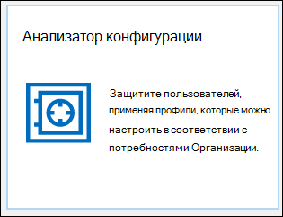
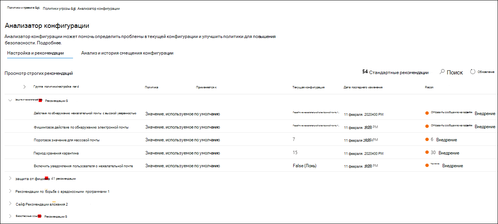
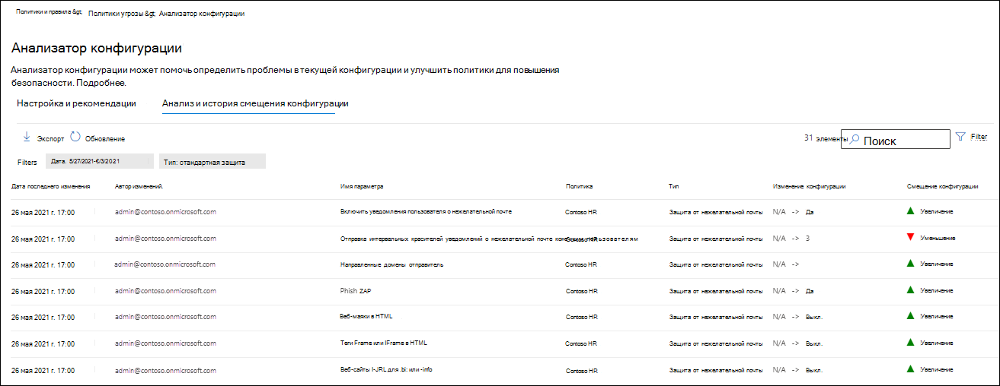

# Анализатор конфигурации для политик защиты в EOP и защитнике Майкрософт для Office 365

[!INCLUDE [Microsoft 365 Defender rebranding](../includes/microsoft-defender-for-office.md)]

> [!NOTE]
> Функции, описанные в этой статье, в предварительной версии, недоступны во всех организациях и могут быть изменены. За сведениями о расписании выпуска, ознакомьтесь с [планом Microsoft 365](https://www.microsoft.com/microsoft-365/roadmap?filters=&searchterms=config%2Canalyzer).

Configuration Analyzer в центре безопасности & соответствия требованиям — централизованное расположение для поиска и исправления политик безопасности, в которых параметры находятся ниже стандартных параметров защиты и усиленной защиты профилей в [предустановленных политиках безопасности](preset-security-policies.md).

Анализатором конфигурации анализируются следующие типы политик:

- **Политики Exchange Online Protection (EOP)**: Это включает в себя организации Microsoft 365 с почтовыми ящиками Exchange Online и автономными организациями EOP без почтовых ящиков Exchange Online:

  - [Политики защиты от нежелательной почты](configure-your-spam-filter-policies.md).
  - [Политики защиты от вредоносных программ](configure-anti-malware-policies.md).
  - [EOP политики защиты от фишинга](set-up-anti-phishing-policies.md#spoof-settings).

- **Защитник Майкрософт для office 365 политики**: Это включает в себя организации с Microsoft 365 или защитник для Office 365 подписки на надстройки:

  - Политики защиты от фишинга в защитнике Microsoft для Office 365, которые включают:

    - [Параметры подделки](set-up-anti-phishing-policies.md#spoof-settings) , доступные в политиках защиты от фишинга EOP.
    - [Параметры олицетворения](set-up-anti-phishing-policies.md#impersonation-settings-in-anti-phishing-policies-in-microsoft-defender-for-office-365)
    - [Расширенные пороговые значения фишинга](set-up-anti-phishing-policies.md#advanced-phishing-thresholds-in-anti-phishing-policies-in-microsoft-defender-for-office-365)

  - [Политики безопасных ссылок](set-up-atp-safe-links-policies.md).

  - [Политики безопасных вложений](set-up-atp-safe-attachments-policies.md).

Значения **стандартных** и **ограниченных** параметров политики, используемые в качестве базовых, описаны в разделе [Рекомендуемые параметры для безопасности EOP и Microsoft Defender для Office 365](recommended-settings-for-eop-and-office365-atp.md).

## Что нужно знать перед началом работы

- Откройте Центр безопасности и соответствия требованиям на сайте <https://protection.office.com/>. Чтобы перейти непосредственно на страницу **анализатора конфигурации** , используйте <https://protection.office.com/configurationAnalyzer> .

- Сведения о том, как подключиться к Exchange Online PowerShell, см. в статье [Подключение к Exchange Online PowerShell](https://docs.microsoft.com/powershell/exchange/connect-to-exchange-online-powershell).

- Для выполнения процедур, описанных в этой статье, вам должны быть назначены разрешения в Центре безопасности и соответствия требованиям:
  - Чтобы использовать анализатор конфигурации **и** внести изменения в политики безопасности, необходимо быть участником группы ролей " **Управление организацией** " или " **администратор безопасности** ".
  - Для доступа только для чтения к анализатору конфигурации необходимо быть членом группы ролей " **глобальный читатель** " или " **читатель безопасности** ".

  Дополнительные сведения см. в статье [Разрешения в Центре безопасности и соответствия требованиям](permissions-in-the-security-and-compliance-center.md).

  **Примечания**.

  - Добавление пользователей в соответствующую роль Azure Active Directory в Центре безопасности Microsoft 365 предоставляет пользователям необходимые разрешения в Центре безопасности и соответствия требованиям _и_ разрешения для других функций в Microsoft 365. Дополнительные сведения см. в статье [О ролях администраторов](https://docs.microsoft.com/microsoft-365/admin/add-users/about-admin-roles).
  - Группа ролей **Управление организацией с правами только на просмотр** в [Exchange Online](https://docs.microsoft.com/Exchange/permissions-exo/permissions-exo#role-groups) также предоставляет доступ только для чтения к этой функции.

## Использование анализатора конфигурации в центре безопасности & соответствия требованиям

В центре безопасности & соответствия требованиям откройте  \>  \> **анализатор настройки** политики управления угрозами.

У анализатора конфигурации есть две основные вкладки:

- **Параметры и рекомендации**: вы выбираете параметры Standard или Option и сравните эти параметры с существующими политиками безопасности. В результаты вы можете скорректировать значения параметров, чтобы они выстроили на тот же уровень, что и стандартный или ограниченный.

- **Анализ и история смещений конфигурации**: это представление позволяет отслеживать изменения политики с течением времени.

### Вкладка "Настройка и рекомендации" в анализаторе конфигурации

По умолчанию вкладка открывается при сравнении со стандартным профилем защиты. Чтобы переключиться на сравнение профиля с помощью ограниченной защиты, нажмите кнопку **Показать рекомендации**. Для обратного переключения выберите **Просмотр стандартных рекомендаций**.

По умолчанию столбец **Группа политик/имя параметра** содержит свернутое представление различных типов политик безопасности и число параметров, требующих улучшения (если они есть). Типы политик:

- **Защита от нежелательной почты**
- **Защита от фишинга**
- **Защита от вредоносных программ**
- **Безопасное вложение ATP** (если ваша подписка включает защитник Майкрософт для Office 365)
- **Безопасные ссылки ATP** (если ваша подписка включает защитник Майкрософт для Office 365)

В представлении по умолчанию все свернуты. Рядом с каждой политикой есть сводка результатов сравнения политик (которые можно изменить), а также параметров соответствующих политик для стандартных или ограниченных профилей защиты (которые невозможно изменить). Для профиля защиты, к которому выполняется сравнение, отображаются следующие сведения:

- **Зеленый**: все параметры во всех существующих политиках имеют по крайней мере такой же уровень безопасности, что и профиль защиты.
- **Оранжевый**: небольшое количество параметров в существующих политиках не является безопасным для профиля защиты.
- **Red**: значительное количество параметров в существующих политиках не является безопасным для профиля защиты. Это может быть несколько параметров во многих политиках или нескольких параметрах в одной политике.

Для получения наиболее благоприятных сравнений вы увидите текст: **All Settings следуйте** \<**Standard** or **Strict**\> **рекомендациям**. В противном случае вы увидите число рекомендуемых параметров для изменения.

Если вы развернете **имя группы или параметра политики**, все политики и связанные с ними параметры в каждой политике, требующей внимания, будут отображены. Кроме того, можно развернуть определенный тип политики (например, **Защита от нежелательной почты**), чтобы увидеть только те параметры политик, которые требуют вашего внимания.

Если сравнение не имеет рекомендаций по улучшению (зеленый), то расширение политики не открывает ничего. Если имеется любое количество рекомендаций по улучшению (оранжевый или красный), то параметры, требующие внимания, будут отображены, а соответствующая информация отображается в следующих столбцах:

- Имя параметра, требующего вашего внимания. Например, на предыдущем снимке экрана это **пороговое значение групповой электронной почты** в политике защиты от нежелательной почты.

- **Политика**: имя затронутой политики, содержащей параметр.

- **Применяется к**: количество пользователей, к которым применяются затронутые политики.

- **Текущая конфигурация**: текущее значение параметра.

- Дата **последнего изменения**: Дата последнего изменения политики.

- **Рекомендации**: значение параметра в стандартном или ограниченном профиле защиты. Чтобы изменить значение параметра в политике в значение, соответствующее рекомендуемому значению в профиле защиты, нажмите кнопку **принять**. Если изменение прошло успешно, вы увидите сообщение: **рекомендации успешно приняты**. Нажмите кнопку **Обновить** , чтобы увидеть уменьшенное количество рекомендаций и удалить определенную строку параметров или политик из результатов.

### Вкладка "анализ и анализ сведений о смещении конфигурации" в анализаторе конфигурации

Эта вкладка позволяет отслеживать изменения, внесенные в пользовательские политики безопасности. По умолчанию отображаются следующие сведения:

- **Дата последнего изменения**
- **Кем изменено**
- **Имя параметра**
- **Политика**
- **Тип**

Чтобы отфильтровать результаты, нажмите **Фильтр**. В появившемся всплывающем окне **фильтры** можно выбрать следующие фильтры:

- Время **начала** и **время окончания** (дата)
- **Стандартная защита** или **ограниченная защита**

Чтобы экспортировать результаты в CSV-файл, нажмите кнопку **Экспорт**.

