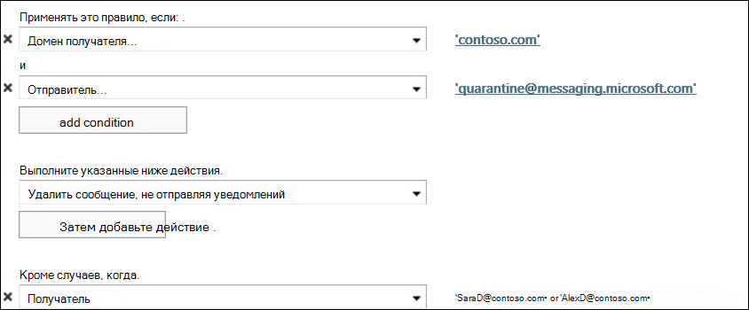

# Настройка уведомлений пользователя о спаме в Exchange Online

> [!IMPORTANT]
> Этот раздел предназначается клиентам Exchange Online, обеспечивающим защиту почтовых ящиков, размещенных в облаке. Изолированные клиенты Exchange Online Protection (EOP), защищающие локальные почтовые ящики, должны прочитать следующий раздел: [Настройка уведомлений конечных пользователей о нежелательной почте в EOP](configure-end-user-spam-notifications-in-eop.md). 
  
Вы можете настроить уведомления о нежелательной почте для пользователей по умолчанию для политики фильтрации нежелательной почты по умолчанию или для настраиваемых политик фильтрации нежелательной почты. Включение оповещений о нежелательной почте пользователи могут управлять своими сообщениями о нежелательной почте, массовых и фишинговых сообщениях в карантине.   
  
Уведомления конечного пользователя о нежелательных сообщениях содержат список всех сообщений, помещенных на карантин нежелательной почты, которые получил пользователь в течение определенного вами периода (можно указать значение между 1 и 15 днями). Можно также настроить язык сообщения уведомления.
  
После получения сообщения с уведомлением пользователи могут выбрать один из следующих вариантов:

**Блокировать отправителя** , если вы хотите, чтобы Office 365 добавить отправителя в список заблокированных отправителей.

**Отпустите** , если сообщение не является спамом и вы хотите, чтобы Office 365 отправлял сообщение в ваш почтовый ящик.

**Просмотрите** , чтобы перейти на портал карантина в центре безопасности & соответствия требованиям, если вы хотите выполнить другие действия, такие как предварительный просмотр или выпуск.
  
## Что нужно знать перед началом работы

Предполагаемое время выполнения: 2 минуты.
  
Для выполнения этой процедуры (процедур) необходимы соответствующие разрешения. Чтобы просмотреть необходимые разрешения, обратитесь к разделу "Защита от нежелательной почты" в разделе [Feature Permissions in Exchange Online](https://docs.microsoft.com/exchange/permissions-exo/feature-permissions) . 
  
Дополнительные сведения о сочетаниях клавиш, которые могут применяться к процедурам, описанным в этой статье, приведены в статье [сочетания клавиш для центра администрирования Exchange в Exchange Online](https://docs.microsoft.com/Exchange/accessibility/keyboard-shortcuts-in-admin-center).
  
## Настройка уведомлений пользователя о нежелательной почте с помощью Центра администрирования Exchange

1. В Центре администрирования Exchange перейдите в раздел **Защита** \> **Фильтр спама**.
    
2. Выберите политику фильтрации нежелательной почты, для которой нужно включить уведомления конечных пользователей о нежелательной почте (по умолчанию они отключены).
    
3. На правой панели, на которой отображается сводная информация о вашей политике, выберите ссылку **Включить уведомления пользователя о нежелательной почте**. 
    
4. В следующем диалоговом окне можно настроить следующие параметры:
    
   - **Включить уведомления пользователя о нежелательной почте** Установите этот флажок, если нужно включить уведомления для этой политики. (И наоборот: если эта политика включена, снимите этот флажок, если нужно отключить уведомления пользователя о нежелательной почте для этой политики.) 
    
   - **Отправлять уведомления пользователя о нежелательной почте каждые (дн.)** Укажите, как часто необходимо отправлять пользователям уведомления о нежелательной почте. Значение по умолчанию — 3 дня. Допустимый интервал значений — от 1 до 15 дней. Например, если вы укажете 7 дней, уведомление будет включать список всех сообщений за последние 7 дней, которые предназначались этому пользователю, но были ошибочно поставлены на карантин нежелательной почты. 
    
   - **Язык уведомлений** В раскрывающемся списке выберите язык, на котором пользователю будут отправляться уведомления о нежелательной почте для этой политики. 
    
   - Нажмите кнопку **Сохранить**. Сводка параметров политики фильтрации нежелательной почты, в том числе параметров уведомлений для конечных пользователей, отображается в правой области.
    
> [!NOTE]
>  Уведомления конечных пользователей о нежелательной почте будут работать только с включенными политиками фильтрации нежелательной почты. >  Уведомления о нежелательной почте отправляются конечному пользователю один раз в день. Время доставки уведомления не гарантируется для каждого конкретного пользователя, и его нельзя настроить. 
  
 **Совет:** Если вы хотите протестировать уведомления о нежелательной почте пользователей, отправив их ограниченному набору пользователей, прежде чем приступать к их полному внедрению, создайте настраиваемую политику фильтрации нежелательной почты, позволяющую пользователям получать уведомления о нежелательной почте для доменов, в которых они находятся. Затем в центре администрирования Exchange в разделе ** \> правила обработки почтового ящика**создайте правило для обработки почтового ящика (также называемое правилом транспорта), чтобы заблокировать сообщения от Quarantine@messaging.microsoft.com (адрес электронной почты, который отправляет уведомления) с исключениями для пользователей, которые хотят получать уведомления. На следующем рисунке показан пример создания исключения для двух пользователей (SaraD и AlexD) с домена Contoso.com: 
  

  
## Использование SCC для настройки уведомлений конечных пользователей о нежелательной почте

Вы также можете использовать центр безопасности и соответствия требованиям (SCC) для настройки уведомлений конечных пользователей о нежелательной почте. Выполните приведенные ниже действия.

1. Откройте центр безопасности и соответствия требованиям, перейдите к разделу **Защита от** угроз для **политики** \> \> **управления угрозами** или https://protection.office.com/antispamиспользуйте прямую ссылку.

2. Щелкните стрелку вниз рядом с политикой фильтрации нежелательной почты, для которой нужно включить уведомления конечных пользователей о нежелательной почте.

3. Щелкните ссылку **настроить уведомления пользователя о нежелательной почте** .

4. В следующем диалоговом окне можно настроить следующие параметры:
    
   - **Включить уведомления пользователя о нежелательной почте** Установите этот флажок, если нужно включить уведомления для этой политики. (И наоборот: если эта политика включена, снимите этот флажок, если нужно отключить уведомления пользователя о нежелательной почте для этой политики.) 
    
   - **Отправлять уведомления пользователя о нежелательной почте каждые (дн.)** Укажите, как часто необходимо отправлять пользователям уведомления о нежелательной почте. Значение по умолчанию — 3 дня. Допустимый интервал значений — от 1 до 15 дней. Например, если вы укажете 7 дней, уведомление будет включать список всех сообщений за последние 7 дней, которые предназначались этому пользователю, но были ошибочно поставлены на карантин нежелательной почты. 
    
   - **Язык уведомлений** В раскрывающемся списке выберите язык, на котором пользователю будут отправляться уведомления о нежелательной почте для этой политики. 
    
   - Нажмите кнопку **Сохранить**. Сводка параметров политики фильтрации нежелательной почты, включая параметры уведомления о нежелательной почте пользователя, отображается в области.

## Дополнительные сведения

[Настройка политик фильтрации нежелательной почты](configure-your-spam-filter-policies.md)

[Set — HostedContentFilterPolicy](https://docs.microsoft.com/powershell/module/exchange/antispam-antimalware/set-hostedcontentfilterpolicy)
  
