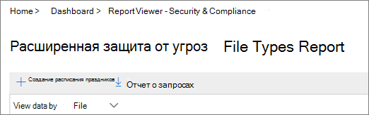
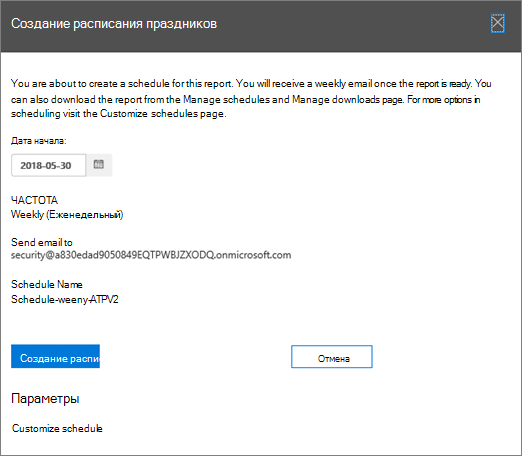

# Создание расписания для отчета в центре безопасности &amp; и соответствия требованиямCreate a schedule for a report in the Security &amp; Compliance Center

В центре соответствия &amp; требованиям безопасности доступны некоторые [отчеты и](reports-and-insights-in-security-and-compliance.md) сведения, помогающие группе безопасности Организации уменьшить риски и устранить угрозы в Организации.In the Security &amp; Compliance Center, several [reports and insights](reports-and-insights-in-security-and-compliance.md) are available to help your organization's security team mitigate and address threats to your organization. Если вы являетесь участником группы безопасности Организации, вы можете создать расписание для отчета.If you're a member of your organization's security team, you can create a schedule for a report. Создаваемое расписание может включать настраиваемые диапазоны дат в соответствии с вашей организацией.The schedule you create can include a custom date ranges to suit your organization. 
  
## Создание расписания для отчетаCreate a schedule for a report

> [!IMPORTANT]
> Убедитесь, что у вас есть необходимые разрешения для выполнения этой задачи.Make sure that you have the necessary permissions to perform this task. В общем случае пользователи Office 365 глобальные администраторы, администраторы безопасности и средства чтения безопасности могут получать доступ к отчетам в центре безопасности &amp; и соответствия требованиям.In general, Office 365 global administrators, security administrators, and security readers can access reports in the Security &amp; Compliance Center. Дополнительные сведения о разрешениях приведены [в разделе разрешения в центре безопасности &amp; и соответствия требованиям Office 365](permissions-in-the-security-and-compliance-center.md).To learn more about permissions, see [Permissions in the Office 365 Security &amp; Compliance Center](permissions-in-the-security-and-compliance-center.md).
  
1. В [центре безопасности &amp; и соответствия требованиям](https://protection.office.com)откройте **панель мониторинга** **отчетов** \> .In the [Security &amp; Compliance Center](https://protection.office.com), go to **Reports** \> **Dashboard**.
    
2. Выберите один из следующих отчетов:Choose one of the following reports: 

    - Соответствия политике защиты от потери данныхDLP policy matches
    - Правило транспорта ExchangeExchange Transport Rule
    - Ложные срабатывания и переопределения защиты от потери данныхDLP false positives and overrides
    - Типы файлов ATP для Office 365Office 365 ATP file types
    - Расположение сообщений ATP для Office 365Office 365 ATP message disposition
    - Вредоносные программы, обнаруженные в сообщении электронной почтыMalware detected in email
    - Самые популярные вредоносные программыTop malware
    - Пользователи, которые чаще всего отправляют и получают почтуTop senders and recipients
    - Обнаружение поддельных поддельныхSpoof detections
    - Обнаружения нежелательной почтыSpam detections
    - Отправленные и полученные сообщения электронной почтыSent and received email
    - Инциденты DLPDLP incidents
    - Отчет о шифрованииEncryption report

    В этом примере мы будем выбирать отчет "типы файлов Advanced Threat protection".For this example, we'll choose the Advanced Threat Protection File Types report.
    
3. В левом верхнем углу отчета выберите **+ создать расписание**.In the upper left corner of the report, choose **+ Create schedule**. 
    
    

    (Примечание: не все отчеты имеют кнопку **+ создать расписание** .)(NOTE: Not all reports have the **+ Create schedule** button.)
  
    Откроется диалоговое окно " **Создание расписания** ".The **Create schedule** dialog box opens. 
    
4. Оставьте параметры по умолчанию и нажмите **создать расписание**, или выберите **настроить расписание**.Keep the default settings and choose **Create schedule**, or choose **Customize schedule**.
    
    
  
    Если вы решили настроить расписание отчета, вы можете указать частоту отчета, адрес электронной почты отправителя и адрес электронной почты получателя.If you choose to customize your report schedule, you can specify the report's frequency, a sender's email address, and a recipient's email address. 
    
После создания расписания для отчета этот отчет будет доставлен по электронной почте на адреса электронной почты получателей автоматически.Once you have created a schedule for a report, that report will be delivered via email to recipients' email addresses automatically. 
  
## Связанные статьиRelated topics

[Отчеты и аналитика в центре безопасности &amp; и соответствия требованиям Office 365Reports and insights in the Office 365 Security &amp; Compliance Center](reports-and-insights-in-security-and-compliance.md)
  
[Управление расписаниями для отчетов в центре &amp; безопасности и соответствия требованиямManage schedules for reports in the Security &amp; Compliance Center](manage-schedules-for-multiple-reports.md)
  
[Загрузка существующих отчетов в центре безопасности &amp; и соответствия требованиямDownload existing reports in the Security &amp; Compliance Center](download-existing-reports.md)
  
[Скачайте настраиваемый отчет в центре безопасности &amp; и соответствия требованиямDownload a custom report in the Security &amp; Compliance Center](set-up-and-download-a-custom-report.md)
  

